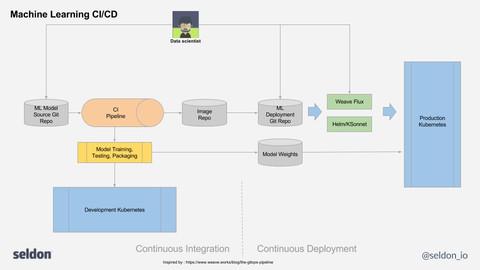

# Deployment

You can manage your deployments via the standard Kubernetes CLI kubectl, e.g.

```bash
kubectl apply -f my_ml_deployment.yaml
```

# Production Integration
For production settings you will want to incorporate your ML infrastructure and ML code into a continuous integration and deployment pipeline. One such realization of such a pipeline is shown below:



The pipeline consists of

 * A model code repo (in Git) where training and runtime ML components are stored
 * A continuous integration pipeline that will train and test the model and wrap it (using Seldon built-in Wrappers or custom wrappers)
 * An image repository where the final runtime inference model image is stored.
 * A git repo for the infrastructure to store the ML deployment graph described as a SeldonDeployment
 * Some tool to either monitor the infrastructure repo and apply to the production Kubernetes changes or a tool to allow dev ops to push updated infrastructure manually.

