# Production image classifier with drift and outlier monitoring

Run these examples from the `samples/examples/image_classifier` folder.

## CIFAR10 Image Classification Production Deployment

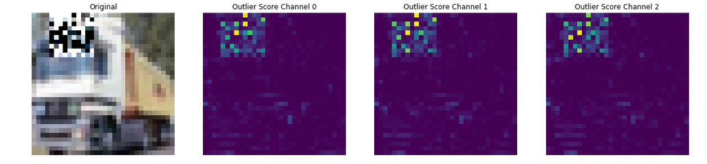

We show an image classifier (CIFAR10) with associated outlier and drift detectors using a Pipeline.

* The model is a tensorflow [CIFAR10](https://www.cs.toronto.edu/\~kriz/cifar.html) image classfier
* The outlier detector is created from the [CIFAR10 VAE Outlier example](https://docs.seldon.io/projects/alibi-detect/en/stable/examples/od\_vae\_cifar10.html).
* The drift detector is created from the [CIFAR10 KS Drift example](https://docs.seldon.io/projects/alibi-detect/en/stable/examples/cd\_ks\_cifar10.html)

### Model Training (optional for notebook)

To run local training run the [training notebook](notebooks/train.ipynb).

```python
import requests
import json
from typing import Dict, List
import numpy as np
import os
import tensorflow as tf
from alibi_detect.utils.perturbation import apply_mask
from alibi_detect.datasets import fetch_cifar10c
import matplotlib.pyplot as plt
tf.keras.backend.clear_session()
```

```
2023-06-30 15:39:28.732453: W tensorflow/stream_executor/platform/default/dso_loader.cc:64] Could not load dynamic library 'libcudart.so.11.0'; dlerror: libcudart.so.11.0: cannot open shared object file: No such file or directory
2023-06-30 15:39:28.732465: I tensorflow/stream_executor/cuda/cudart_stub.cc:29] Ignore above cudart dlerror if you do not have a GPU set up on your machine.

```

```python
train, test = tf.keras.datasets.cifar10.load_data()
X_train, y_train = train
X_test, y_test = test

X_train = X_train.astype('float32') / 255
X_test = X_test.astype('float32') / 255
print(X_train.shape, y_train.shape, X_test.shape, y_test.shape)
classes = (
    "plane",
    "car",
    "bird",
    "cat",
    "deer",
    "dog",
    "frog",
    "horse",
    "ship",
    "truck",
)

```

```
(50000, 32, 32, 3) (50000, 1) (10000, 32, 32, 3) (10000, 1)

```

```python
outliers = []
for idx in range(0,X_train.shape[0]):
    X_mask, mask = apply_mask(X_train[idx].reshape(1, 32, 32, 3),
                                  mask_size=(14,14),
                                  n_masks=1,
                                  channels=[0,1,2],
                                  mask_type='normal',
                                  noise_distr=(0,1),
                                  clip_rng=(0,1))
    outliers.append(X_mask)
X_outliers = np.vstack(outliers)
X_outliers.shape
```

```
(50000, 32, 32, 3)

```

```python
corruption = ['brightness']
X_corr, y_corr = fetch_cifar10c(corruption=corruption, severity=5, return_X_y=True)
X_corr = X_corr.astype('float32') / 255
```

```python
reqJson = json.loads('{"inputs":[{"name":"input_1","data":[],"datatype":"FP32","shape":[]}]}')
url = "http://0.0.0.0:9000/v2/models/model/infer"
```

```python
def infer(resourceName: str, batchSz: int, requestType: str):
    if requestType == "outlier":
        rows = X_outliers[0:0+batchSz]
    elif requestType == "drift":
        rows = X_corr[0:0+batchSz]
    else:
        rows = X_train[0:0+batchSz]
    for i in range(batchSz):
        show(rows[i])
    reqJson["inputs"][0]["data"] = rows.flatten().tolist()
    reqJson["inputs"][0]["shape"] = [batchSz, 32, 32, 3]
    headers = {"Content-Type": "application/json", "seldon-model":resourceName}
    response_raw = requests.post(url, json=reqJson, headers=headers)
    print(response_raw)
    print(response_raw.json())


def show(X):
    plt.imshow(X.reshape(32, 32, 3))
    plt.axis("off")
    plt.show()

```

### Pipeline

```bash
cat ../../models/cifar10.yaml
echo "---"
cat ../../models/cifar10-outlier-detect.yaml
echo "---"
cat ../../models/cifar10-drift-detect.yaml
```

```yaml
apiVersion: mlops.seldon.io/v1alpha1
kind: Model
metadata:
  name: cifar10
spec:
  storageUri: "gs://seldon-models/triton/tf_cifar10"
  requirements:
  - tensorflow
---
apiVersion: mlops.seldon.io/v1alpha1
kind: Model
metadata:
  name: cifar10-outlier
spec:
  storageUri: "gs://seldon-models/scv2/examples/mlserver_1.3.5/cifar10/outlier-detector"
  requirements:
    - mlserver
    - alibi-detect
---
apiVersion: mlops.seldon.io/v1alpha1
kind: Model
metadata:
  name: cifar10-drift
spec:
  storageUri: "gs://seldon-models/scv2/examples/mlserver_1.3.5/cifar10/drift-detector"
  requirements:
    - mlserver
    - alibi-detect

```

```bash
seldon model load -f ../../models/cifar10.yaml
seldon model load -f ../../models/cifar10-outlier-detect.yaml
seldon model load -f ../../models/cifar10-drift-detect.yaml
```

```json
{}
{}
{}

```

```bash
seldon model status cifar10 -w ModelAvailable | jq .
seldon model status cifar10-outlier -w ModelAvailable | jq .
seldon model status cifar10-drift -w ModelAvailable | jq .
```

```json
{}
{}
{}

```

```bash
cat ../../pipelines/cifar10.yaml
```

```yaml
apiVersion: mlops.seldon.io/v1alpha1
kind: Pipeline
metadata:
  name: cifar10-production
spec:
  steps:
    - name: cifar10
    - name: cifar10-outlier
    - name: cifar10-drift
      batch:
        size: 20
  output:
    steps:
    - cifar10
    - cifar10-outlier.outputs.is_outlier

```

```bash
seldon pipeline load -f ../../pipelines/cifar10.yaml
```

```bash
seldon pipeline status cifar10-production -w PipelineReady | jq -M .
```

```json
{
  "pipelineName": "cifar10-production",
  "versions": [
    {
      "pipeline": {
        "name": "cifar10-production",
        "uid": "cifeii2ufmbc73e5insg",
        "version": 1,
        "steps": [
          {
            "name": "cifar10"
          },
          {
            "name": "cifar10-drift",
            "batch": {
              "size": 20
            }
          },
          {
            "name": "cifar10-outlier"
          }
        ],
        "output": {
          "steps": [
            "cifar10.outputs",
            "cifar10-outlier.outputs.is_outlier"
          ]
        },
        "kubernetesMeta": {}
      },
      "state": {
        "pipelineVersion": 1,
        "status": "PipelineReady",
        "reason": "created pipeline",
        "lastChangeTimestamp": "2023-06-30T14:40:09.047429817Z",
        "modelsReady": true
      }
    }
  ]
}

```

```python
infer("cifar10-production.pipeline",20, "normal")
```


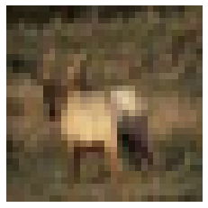


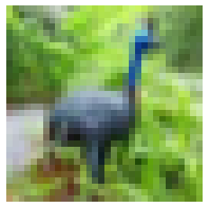


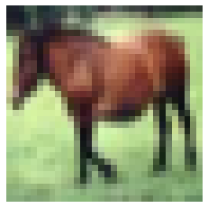


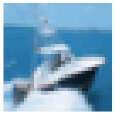


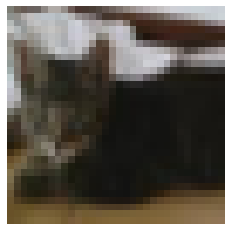


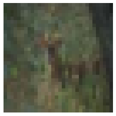


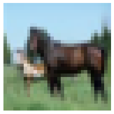


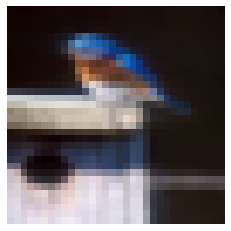


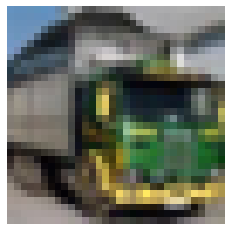


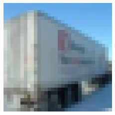


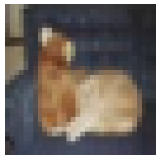


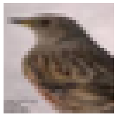


```
<Response [200]>
{'model_name': '', 'outputs': [{'data': [1.45001495e-08, 1.2525752e-09, 1.6298458e-07, 0.11529388, 1.7431412e-07, 6.1856604e-06, 0.8846994, 6.0739285e-09, 7.437921e-08, 4.7317337e-09, 1.26449e-06, 4.8814868e-09, 1.5153439e-09, 8.490656e-09, 5.5131194e-10, 1.1617216e-09, 5.7729294e-10, 2.8839776e-07, 0.0006149016, 0.99938357, 0.888746, 2.5331951e-06, 0.00012967695, 0.10531583, 2.4284174e-05, 6.3332986e-06, 0.0016261435, 1.13079e-05, 0.0013286703, 0.0028091935, 2.0993439e-06, 3.680449e-08, 0.0013269952, 2.1766558e-05, 0.99841356, 0.00015300694, 6.9472035e-06, 1.3277059e-05, 6.1860555e-05, 3.4072806e-07, 1.1205097e-05, 0.99997175, 1.9948227e-07, 6.9880834e-08, 3.3387135e-08, 5.2603138e-08, 3.0352305e-07, 4.3738982e-08, 5.3243946e-07, 1.5870584e-05, 0.0006525102, 0.013322109, 1.480307e-06, 0.9766325, 4.9847167e-05, 0.00058075984, 0.008405659, 5.2234273e-06, 0.00023390084, 0.000116047224, 1.6682397e-06, 5.7737526e-10, 0.9975605, 6.45564e-05, 0.002371972, 1.0392675e-07, 9.747962e-08, 1.4484569e-07, 8.762438e-07, 2.4758325e-08, 5.028761e-09, 6.856381e-11, 5.9932094e-12, 4.921233e-10, 1.471166e-07, 2.7940719e-06, 3.4563383e-09, 0.99999714, 5.9420524e-10, 9.445026e-11, 4.1854888e-05, 5.041549e-08, 8.0302314e-08, 1.2119854e-07, 6.781646e-09, 1.2616152e-08, 1.1878505e-08, 1.628573e-09, 0.9999578, 3.281738e-08, 0.08930307, 1.4065135e-07, 4.1117343e-07, 0.90898305, 8.933351e-07, 0.0015637449, 0.00013868928, 9.092981e-06, 4.8759745e-07, 4.3976044e-07, 0.00016094849, 3.5653954e-07, 0.0760521, 0.8927447, 0.0011777573, 0.00265573, 0.027189083, 4.1892267e-06, 1.329405e-05, 1.8564688e-06, 1.3373891e-06, 1.0251247e-07, 8.651912e-09, 4.458202e-06, 1.4646349e-05, 1.260957e-06, 1.046087e-08, 0.9998946, 8.332438e-05, 3.900894e-07, 6.53852e-05, 3.012202e-08, 1.0247197e-07, 1.8824371e-06, 0.0004958526, 3.533475e-05, 2.739997e-07, 0.99939275, 4.840305e-06, 3.5346695e-06, 0.0005518078, 3.1597017e-07, 0.99902296, 0.00031509742, 8.07886e-07, 1.6366084e-06, 2.795575e-06, 6.112367e-06, 9.817249e-05, 2.602709e-07, 0.0004561966, 5.360607e-06, 2.8656412e-05, 0.000116040654, 6.881144e-05, 8.844774e-06, 4.4655946e-05, 3.5564542e-05, 0.006564381, 0.9926715, 0.007300911, 1.766928e-06, 3.0520596e-07, 0.026906287, 1.3769699e-06, 0.00027539674, 5.583593e-06, 3.792553e-06, 0.0003876767, 0.9651169, 0.18114138, 2.8360228e-05, 0.00019927241, 0.007685872, 0.00014663498, 3.9361137e-05, 5.941682e-05, 7.36174e-05, 0.79936546, 0.01126067, 2.3992783e-11, 7.6336457e-16, 1.4644799e-15, 1, 2.4652159e-14, 1.1786078e-10, 1.9402116e-13, 4.2408636e-15, 1.209294e-15, 2.9042784e-15, 1.5366902e-08, 1.2476195e-09, 1.3560152e-07, 0.999997, 4.3113017e-11, 2.8163534e-08, 2.4494727e-06, 1.3122828e-10, 3.8081083e-07, 2.1628158e-11, 0.0004926238, 6.9424555e-06, 2.827196e-05, 0.92534137, 9.500486e-06, 0.00036133997, 0.072713904, 1.2831057e-07, 0.0010457055, 2.8514464e-07], 'name': 'fc10', 'shape': [20, 10], 'datatype': 'FP32'}, {'data': [0, 0, 0, 0, 0, 0, 0, 0, 0, 0, 0, 0, 0, 0, 0, 0, 0, 0, 0, 0], 'name': 'is_outlier', 'shape': [1, 20], 'datatype': 'INT64', 'parameters': {'content_type': 'np'}}]}

```

```bash
seldon pipeline inspect cifar10-production.cifar10-drift.outputs.is_drift
```

```
seldon.default.model.cifar10-drift.outputs	cifeij8fh5ss738i5bp0	{"name":"is_drift", "datatype":"INT64", "shape":["1", "1"], "parameters":{"content_type":{"stringParam":"np"}}, "contents":{"int64Contents":["0"]}}

```

```python
infer("cifar10-production.pipeline",20, "drift")
```

```


```

```


```

```


```

```


```

```


```

```


```

```


```

```


```

```


```

```


```

```


```

```


```

```


```

```


```

```


```

```


```

```


```

```


```

```


```

```


```

```
<Response [200]>
{'model_name': '', 'outputs': [{'data': [8.080701e-09, 2.3025173e-12, 2.2681688e-09, 1, 4.1828953e-11, 4.48467e-09, 3.216822e-08, 2.8404365e-13, 5.217064e-09, 3.3497323e-13, 0.96965235, 4.7030144e-06, 1.6964266e-07, 1.7355454e-05, 2.6667e-06, 1.9505828e-06, 1.1363079e-07, 3.3352034e-08, 0.030320557, 1.7086056e-07, 0.03725602, 6.8623276e-06, 7.5557014e-05, 0.00018132397, 2.2838503e-05, 0.000110639296, 2.3732607e-06, 2.1210687e-06, 0.9623351, 7.131072e-06, 0.999079, 4.207448e-09, 1.5788535e-08, 2.723756e-08, 2.6555508e-11, 2.1526697e-10, 2.7599315e-10, 2.0737433e-10, 0.0009210062, 3.0885383e-09, 6.665241e-07, 1.7765576e-09, 1.4911559e-07, 0.9765331, 1.9476123e-07, 2.8244015e-06, 0.023463126, 5.8030287e-09, 3.243206e-09, 1.12179785e-08, 4.4123663e-06, 4.7628927e-09, 1.1727273e-08, 0.9761534, 1.1409252e-08, 8.922882e-05, 0.023752932, 3.1563903e-08, 2.7916305e-09, 8.7746266e-10, 1.0166265e-05, 0.999703, 4.5408615e-05, 0.00022673907, 1.7365853e-07, 1.0147362e-06, 6.253448e-06, 2.9711526e-07, 7.811687e-07, 6.183683e-06, 0.86618125, 5.47548e-07, 0.00038408802, 0.013155022, 3.6916779e-06, 0.0006137024, 0.11965008, 3.6425424e-06, 6.7638084e-06, 1.2372367e-06, 1.9545263e-05, 1.1281859e-13, 1.6811868e-14, 0.9999777, 1.9805435e-11, 2.7563674e-06, 2.9651657e-09, 1.1363432e-12, 2.9902746e-13, 1.220973e-12, 2.9895918e-05, 3.4964305e-07, 1.1331837e-08, 1.7012125e-06, 3.6088227e-07, 3.035954e-08, 2.2102333e-06, 1.7414077e-08, 0.9999455, 1.9921794e-05, 0.9999999, 5.3446598e-11, 6.3188843e-10, 1.0956511e-07, 1.1538642e-10, 8.113561e-10, 4.7179572e-08, 1.4544753e-11, 5.490219e-08, 1.3347151e-10, 1.5363307e-07, 6.604881e-09, 2.424105e-10, 9.963063e-09, 3.9349533e-09, 1.5709017e-09, 7.705774e-10, 4.8085802e-08, 1.8885139e-05, 0.9999809, 7.147243e-08, 3.143131e-13, 2.1447092e-13, 0.00042652222, 6.945973e-12, 0.9995734, 6.174434e-09, 4.1128205e-11, 3.4031404e-13, 8.573159e-15, 1.2226405e-09, 2.3768018e-10, 2.822187e-07, 8.016278e-08, 4.0692296e-08, 6.8023346e-06, 2.3926754e-07, 0.9999925, 6.652648e-09, 7.743497e-09, 7.6360675e-06, 5.9386625e-09, 1.5675019e-09, 2.136716e-07, 1.3074002e-06, 3.700079e-10, 1.0984521e-09, 6.2138824e-08, 0.9609078, 0.03908287, 0.0008332255, 7.696685e-08, 2.4428939e-09, 7.186676e-05, 1.4520063e-09, 1.4521317e-08, 1.09093e-06, 1.2531165e-10, 0.9990938, 5.798501e-09, 5.785368e-05, 3.82365e-09, 7.404351e-08, 0.008338481, 8.048078e-10, 0.99157715, 1.1663455e-05, 1.4583546e-05, 8.3543476e-08, 3.274394e-08, 2.4682688e-05, 1.3951502e-09, 1.0260489e-08, 0.9998845, 1.9418138e-08, 8.667954e-07, 2.1851054e-07, 8.917964e-05, 4.4437223e-07, 1.1292918e-07, 4.5302792e-07, 5.631744e-08, 2.9086214e-08, 3.1013877e-07, 7.695681e-09, 2.1452344e-09, 1.1493902e-08, 6.1980093e-10, 0.99999917, 1.1436694e-08, 2.42685e-05, 8.557389e-08, 0.024081504, 0.0073837163, 4.8152968e-05, 5.128531e-07, 0.9684405, 9.630179e-08, 2.1060101e-05, 1.901065e-07], 'name': 'fc10', 'shape': [20, 10], 'datatype': 'FP32'}, {'data': [0, 0, 0, 0, 0, 0, 0, 0, 0, 0, 0, 0, 0, 0, 0, 0, 0, 0, 0, 0], 'name': 'is_outlier', 'shape': [1, 20], 'datatype': 'INT64', 'parameters': {'content_type': 'np'}}]}

```

```bash
seldon pipeline inspect cifar10-production.cifar10-drift.outputs.is_drift
```

```
seldon.default.model.cifar10-drift.outputs	cifeimgfh5ss738i5bpg	{"name":"is_drift", "datatype":"INT64", "shape":["1", "1"], "parameters":{"content_type":{"stringParam":"np"}}, "contents":{"int64Contents":["1"]}}

```

```python
infer("cifar10-production.pipeline",1, "outlier")
```

```


```

```
<Response [200]>
{'model_name': '', 'outputs': [{'data': [6.3606867e-06, 0.0006106364, 0.0054279356, 0.6536454, 1.4738829e-05, 2.6104701e-06, 0.3397848, 1.3538776e-05, 0.0004458526, 4.807229e-05], 'name': 'fc10', 'shape': [1, 10], 'datatype': 'FP32'}, {'data': [1], 'name': 'is_outlier', 'shape': [1, 1], 'datatype': 'INT64', 'parameters': {'content_type': 'np'}}]}

```

```python
infer("cifar10-production.pipeline",1, "ok")
```

```


```

```
<Response [200]>
{'model_name': '', 'outputs': [{'data': [1.45001495e-08, 1.2525752e-09, 1.6298458e-07, 0.11529388, 1.7431412e-07, 6.1856604e-06, 0.8846994, 6.0739285e-09, 7.43792e-08, 4.7317337e-09], 'name': 'fc10', 'shape': [1, 10], 'datatype': 'FP32'}, {'data': [0], 'name': 'is_outlier', 'shape': [1, 1], 'datatype': 'INT64', 'parameters': {'content_type': 'np'}}]}

```

Use the seldon CLI to look at the outputs from the CIFAR10 model. It will decode the Triton binary outputs for us.

```bash
seldon pipeline inspect cifar10-production.cifar10.outputs
```

```
seldon.default.model.cifar10.outputs	cifeiq8fh5ss738i5bqg	{"modelName":"cifar10_1", "modelVersion":"1", "outputs":[{"name":"fc10", "datatype":"FP32", "shape":["1", "10"], "contents":{"fp32Contents":[1.45001495e-8, 1.2525752e-9, 1.6298458e-7, 0.11529388, 1.7431412e-7, 0.0000061856604, 0.8846994, 6.0739285e-9, 7.43792e-8, 4.7317337e-9]}}]}

```

```bash
seldon pipeline unload cifar10-production
```

```bash
seldon model unload cifar10
seldon model unload cifar10-outlier
seldon model unload cifar10-drift
```
