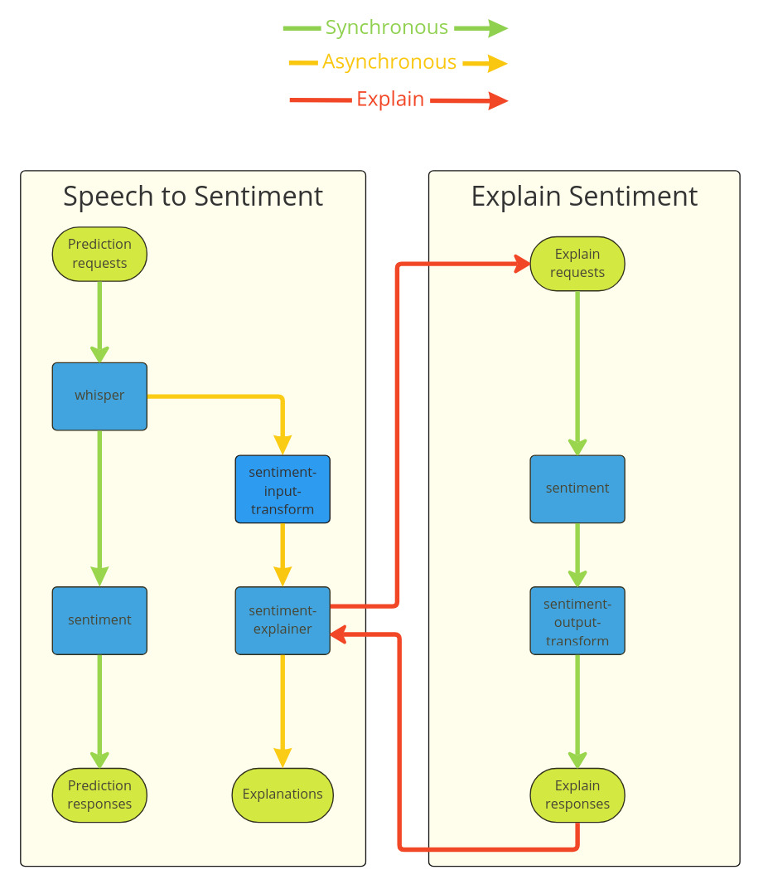

# Huggingface speech to sentiment pipeline

In this example we create a Pipeline to chain two huggingface models to allow speech to sentiment functionalityand add an explainer to understand the result.

This example also illustrates how explainers can target pipelines to allow complex explanations flows.



This example requires **ffmpeg** package to be installed locally. run `make install-requirements` for the Python dependencies.

```python
from ipywebrtc import AudioRecorder, CameraStream
import torchaudio
from IPython.display import Audio
import base64
import json
import requests
import os
import time
```

Create a method to load speech from recorder; transform into mp3 and send at base64 data. On return of the result extract and show the text and sentiment.

```python
reqJson = json.loads('{"inputs":[{"name":"args", "parameters": {"content_type": "base64"}, "data":[],"datatype":"BYTES","shape":[1]}]}')
url = "http://0.0.0.0:9000/v2/models/model/infer"
def infer(resource: str):
    with open('recording.webm', 'wb') as f:
        f.write(recorder.audio.value)
    !ffmpeg -i recording.webm -vn -ab 128k -ar 44100 file.mp3 -y -hide_banner -loglevel panic
    with open("file.mp3", mode='rb') as file:
        fileContent = file.read()
        encoded = base64.b64encode(fileContent)
        base64_message = encoded.decode('utf-8')
    reqJson["inputs"][0]["data"] = [str(base64_message)]
    headers = {"Content-Type": "application/json", "seldon-model": resource}
    response_raw = requests.post(url, json=reqJson, headers=headers)
    j = response_raw.json()
    sentiment = j["outputs"][0]["data"][0]
    text = j["outputs"][1]["data"][0]
    reqId = response_raw.headers["x-request-id"]
    print(reqId)
    os.environ["REQUEST_ID"]=reqId
    print(base64.b64decode(text))
    print(base64.b64decode(sentiment))
```

### Load Huggingface Models

We will load two Huggingface models for speech to text and text to sentiment.

```bash
cat ../../models/hf-whisper.yaml
echo "---"
cat ../../models/hf-sentiment.yaml
```

```yaml
apiVersion: mlops.seldon.io/v1alpha1
kind: Model
metadata:
  name: whisper
spec:
  storageUri: "gs://seldon-models/mlserver/huggingface/whisper"
  requirements:
  - huggingface
---
apiVersion: mlops.seldon.io/v1alpha1
kind: Model
metadata:
  name: sentiment
spec:
  storageUri: "gs://seldon-models/mlserver/huggingface/sentiment"
  requirements:
  - huggingface

```

```bash
seldon model load -f ../../models/hf-whisper.yaml
seldon model load -f ../../models/hf-sentiment.yaml
```

```json
{}
{}

```

```bash
seldon model status whisper -w ModelAvailable | jq -M .
seldon model status sentiment -w ModelAvailable | jq -M .
```

```json
{}
{}

```

### Create Explain Pipeline

To allow Alibi-Explain to more easily explain the sentiment we will need:

 * input and output transfrorms that take the Dict values input and output by the Huggingface sentiment model and turn them into values that Alibi-Explain can easily understand with the core values we want to explain and the outputs from the sentiment model.
 * A separate Pipeline to allow us to join the sentiment model with the output transform

These transform models are MLServer custom runtimes as shown below:

```bash
cat ./sentiment-input-transform/model.py | pygmentize
```

```
# Copyright (c) 2024 Seldon Technologies Ltd.

# Use of this software is governed BY
# (1) the license included in the LICENSE file or
# (2) if the license included in the LICENSE file is the Business Source License 1.1,
# the Change License after the Change Date as each is defined in accordance with the LICENSE file.

from mlserver import MLModel
from mlserver.types import InferenceRequest, InferenceResponse, ResponseOutput
from mlserver.codecs.string import StringRequestCodec
from mlserver.logging import logger
import json


class SentimentInputTransformRuntime(MLModel):

  async def load(self) -> bool:
    return self.ready

  async def predict(self, payload: InferenceRequest) -> InferenceResponse:
    logger.info("payload (input-transform): %s",payload)
    res_list = self.decode_request(payload, default_codec=StringRequestCodec)
    logger.info("res list (input-transform): %s",res_list)
    texts = []
    for res in res_list:
      logger.info("decoded data (input-transform): %s", res)
      #text = json.loads(res)
      text = res
      texts.append(text["text"])

    logger.info("transformed data (input-transform): %s", texts)
    response =  StringRequestCodec.encode_response(
      model_name="sentiment",
      payload=texts
    )
    logger.info("response (input-transform): %s", response)
    return response

```

```bash
cat ./sentiment-output-transform/model.py | pygmentize
```

```py
# Copyright (c) 2024 Seldon Technologies Ltd.

# Use of this software is governed BY
# (1) the license included in the LICENSE file or
# (2) if the license included in the LICENSE file is the Business Source License 1.1,
# the Change License after the Change Date as each is defined in accordance with the LICENSE file.

from mlserver import MLModel
from mlserver.types import InferenceRequest, InferenceResponse, ResponseOutput
from mlserver.codecs import StringCodec, Base64Codec, NumpyRequestCodec
from mlserver.codecs.string import StringRequestCodec
from mlserver.codecs.numpy import NumpyRequestCodec
import base64
from mlserver.logging import logger
import numpy as np
import json

class SentimentOutputTransformRuntime(MLModel):

  async def load(self) -> bool:
    return self.ready

  async def predict(self, payload: InferenceRequest) -> InferenceResponse:
    logger.info("payload (output-transform): %s",payload)
    res_list = self.decode_request(payload, default_codec=StringRequestCodec)
    logger.info("res list (output-transform): %s",res_list)
    scores = []
    for res in res_list:
      logger.debug("decoded data (output transform): %s",res)
      #sentiment = json.loads(res)
      sentiment = res
      if sentiment["label"] == "POSITIVE":
        scores.append(1)
      else:
        scores.append(0)
    response =  NumpyRequestCodec.encode_response(
      model_name="sentiments",
      payload=np.array(scores)
    )
    logger.info("response (output-transform): %s", response)
    return response

```

```bash
cat ../../models/hf-sentiment-input-transform.yaml
echo "---"
cat ../../models/hf-sentiment-output-transform.yaml
```

```yaml
apiVersion: mlops.seldon.io/v1alpha1
kind: Model
metadata:
  name: sentiment-input-transform
spec:
  storageUri: "gs://seldon-models/scv2/examples/huggingface/mlserver_1.3.5/sentiment-input-transform"
  requirements:
  - mlserver
  - python
---
apiVersion: mlops.seldon.io/v1alpha1
kind: Model
metadata:
  name: sentiment-output-transform
spec:
  storageUri: "gs://seldon-models/scv2/examples/huggingface/mlserver_1.3.5/sentiment-output-transform"
  requirements:
  - mlserver
  - python

```

```bash
seldon model load -f ../../models/hf-sentiment-input-transform.yaml
seldon model load -f ../../models/hf-sentiment-output-transform.yaml
```

```json
{}
{}

```

```bash
seldon model status sentiment-input-transform -w ModelAvailable | jq -M .
seldon model status sentiment-output-transform -w ModelAvailable | jq -M .
```

```json
{}
{}

```

```bash
cat ../../pipelines/sentiment-explain.yaml
```

```yaml
apiVersion: mlops.seldon.io/v1alpha1
kind: Pipeline
metadata:
  name: sentiment-explain
spec:
  steps:
    - name: sentiment
      tensorMap:
        sentiment-explain.inputs.predict: array_inputs
    - name: sentiment-output-transform
      inputs:
      - sentiment
  output:
    steps:
    - sentiment-output-transform

```

```bash
seldon pipeline load -f ../../pipelines/sentiment-explain.yaml
```

```bash
seldon pipeline status sentiment-explain -w PipelineReady | jq -M .
```

```json
{
  "pipelineName": "sentiment-explain",
  "versions": [
    {
      "pipeline": {
        "name": "sentiment-explain",
        "uid": "cihuo3svgtec73bj6ncg",
        "version": 2,
        "steps": [
          {
            "name": "sentiment",
            "tensorMap": {
              "sentiment-explain.inputs.predict": "array_inputs"
            }
          },
          {
            "name": "sentiment-output-transform",
            "inputs": [
              "sentiment.outputs"
            ]
          }
        ],
        "output": {
          "steps": [
            "sentiment-output-transform.outputs"
          ]
        },
        "kubernetesMeta": {}
      },
      "state": {
        "pipelineVersion": 2,
        "status": "PipelineReady",
        "reason": "created pipeline",
        "lastChangeTimestamp": "2023-07-04T09:53:19.250753906Z",
        "modelsReady": true
      }
    }
  ]
}

```

```bash
cat ../../models/hf-sentiment-explainer.yaml
```

```yaml
apiVersion: mlops.seldon.io/v1alpha1
kind: Model
metadata:
  name: sentiment-explainer
spec:
  storageUri: "gs://seldon-models/scv2/examples/huggingface/speech-sentiment/explainer"
  explainer:
    type: anchor_text
    pipelineRef: sentiment-explain

```

```bash
seldon model load -f ../../models/hf-sentiment-explainer.yaml
```

```json
{}

```

```bash
seldon model status sentiment-explainer -w ModelAvailable | jq -M .
```

```
Error: Model wait status timeout

```

### Speech to Sentiment Pipeline with Explanation

We can now create the final pipeline that will take speech and generate sentiment alongwith an explanation of why that sentiment was predicted.

```bash
cat ../../pipelines/speech-to-sentiment.yaml
```

```yaml
apiVersion: mlops.seldon.io/v1alpha1
kind: Pipeline
metadata:
  name: speech-to-sentiment
spec:
  steps:
    - name: whisper
    - name: sentiment
      inputs:
      - whisper
      tensorMap:
        whisper.outputs.output: args
    - name: sentiment-input-transform
      inputs:
      - whisper
    - name: sentiment-explainer
      inputs:
      - sentiment-input-transform
  output:
    steps:
    - sentiment
    - whisper

```

```bash
seldon pipeline load -f ../../pipelines/speech-to-sentiment.yaml
```

```bash
seldon pipeline status speech-to-sentiment -w PipelineReady | jq -M .
```

```json
{
  "pipelineName": "speech-to-sentiment",
  "versions": [
    {
      "pipeline": {
        "name": "speech-to-sentiment",
        "uid": "cihuqb4vgtec73bj6nd0",
        "version": 2,
        "steps": [
          {
            "name": "sentiment",
            "inputs": [
              "whisper.outputs"
            ],
            "tensorMap": {
              "whisper.outputs.output": "args"
            }
          },
          {
            "name": "sentiment-explainer",
            "inputs": [
              "sentiment-input-transform.outputs"
            ]
          },
          {
            "name": "sentiment-input-transform",
            "inputs": [
              "whisper.outputs"
            ]
          },
          {
            "name": "whisper"
          }
        ],
        "output": {
          "steps": [
            "sentiment.outputs",
            "whisper.outputs"
          ]
        },
        "kubernetesMeta": {}
      },
      "state": {
        "pipelineVersion": 2,
        "status": "PipelineReady",
        "reason": "created pipeline",
        "lastChangeTimestamp": "2023-07-04T09:58:04.277171896Z",
        "modelsReady": true
      }
    }
  ]
}

```

### Test

```python
camera = CameraStream(constraints={'audio': True,'video':False})
recorder = AudioRecorder(stream=camera)
recorder
```

```
AudioRecorder(audio=Audio(value=b'', format='webm'), stream=CameraStream(constraints={'audio': True, 'video': …

```

```python
infer("speech-to-sentiment.pipeline")
```

```
cihuqm8fh5ss73der5gg
b'{"text": " Cambridge is a great place."}'
b'{"label": "POSITIVE", "score": 0.9998548030853271}'

```

We will wait for the explanation which is run asynchronously to the functional output from the Pipeline above.

```python
while True:
    base64Res = !seldon pipeline inspect speech-to-sentiment.sentiment-explainer.outputs --format json \
          --request-id ${REQUEST_ID}
    j = json.loads(base64Res[0])
    if j["topics"][0]["msgs"] is not None:
        expBase64 = j["topics"][0]["msgs"][0]["value"]["outputs"][0]["contents"]["bytesContents"][0]
        expRaw = base64.b64decode(expBase64)
        exp = json.loads(expRaw)
        print("")
        print("Explanation anchors:",exp["data"]["anchor"])
        break
    else:
        print(".",end='')
        time.sleep(1)

```

```
......
Explanation anchors: ['great']

```

### Cleanup

```bash
seldon pipeline unload speech-to-sentiment
seldon pipeline unload sentiment-explain
```

```bash
seldon model unload whisper
seldon model unload sentiment
seldon model unload sentiment-explainer
seldon model unload sentiment-output-transform
seldon model unload sentiment-input-transform
```
