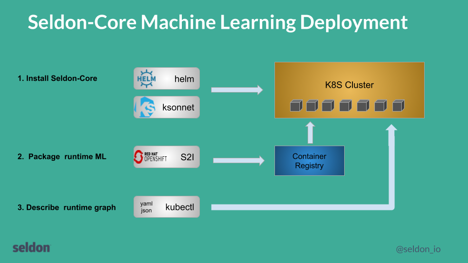
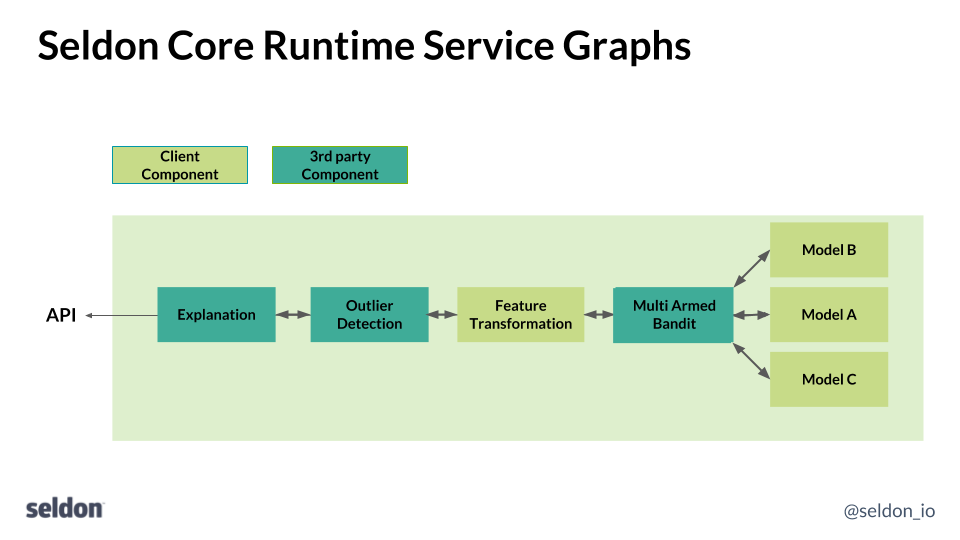

# Getting started Seldon Core

There are 3 steps to using seldon-core.

 1. Install seldon-core onto a kubernetes cluster
 1. Wrap your components (usually runtime model servers) as Docker containers that respect the internal Seldon microservice API.
 1. Define your runtime service graph as a SeldonDeployment resource and deploy your model and serve predictions



# Install Seldon Core

To install seldon-core follow the [installation guide](../install.md).

# Wrap Your Model

The components you want to run in production need to be wrapped as Docker containers that respect the [Seldon microservice API](../reference/internal-api.md). You can create models that serve predictions, routers that decide on where requests go, such as A-B Tests, Combiners that combine responses and transformers that provide generic components that can transform requests and/or responses.

To allow users to easily wrap machine learning components built using different langauges and toolkits we provide wrappers that allow you easily to build a docker container from your code that can be run inside seldon-core. Our current recommended tool is RedHat's Source-to-Image. Wrapping your models is discussed [here](../wrappers/readme.md).

# Define Runtime Service Graph

To run your machine learning graph on Kubernetes you need to define how the components you created in the last step fit together to represent a service graph. This is defined inside a [SeldonDeployment Kubernetes Custom resource](../reference/seldon-deployment.md). A [guide to constructing this custom resource service graph is provided](../crd/readme.md).



# Deploy and Serve Predictions

You can use ```kubectl``` to deploy your ML service like any other Kubernetes resource. This is discussed [here](../deploying.md).

# Worked Examples

 * [Jupyter notebooks showing worked examples](../../readme.md#quick-start)
 * [Integration with other machine learning frameworks](../../readme.md#integrations)

# Production 