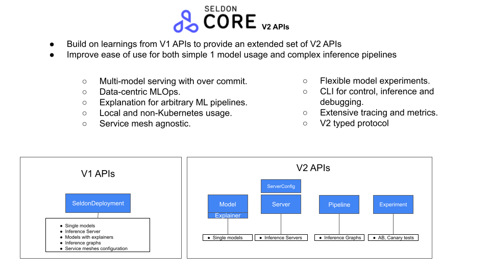
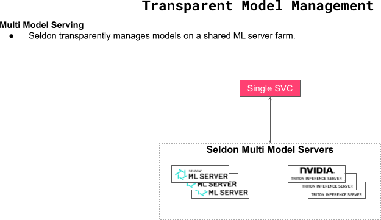
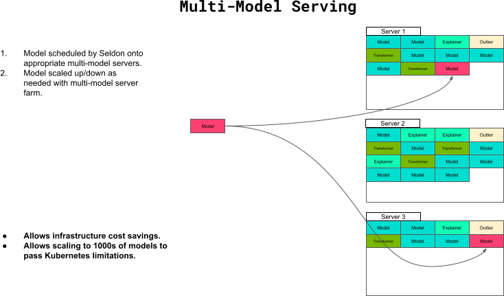
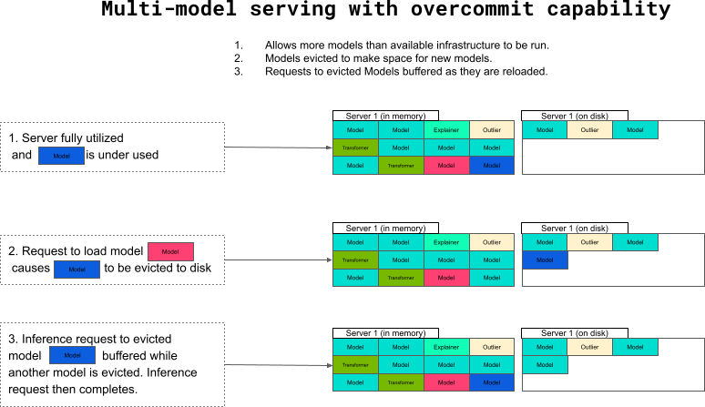
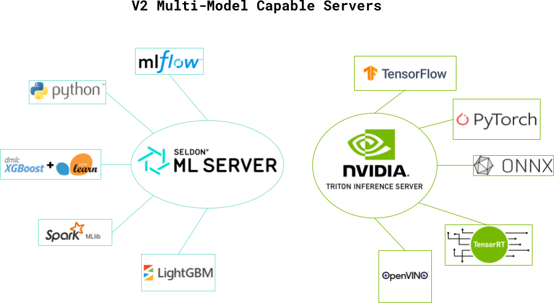
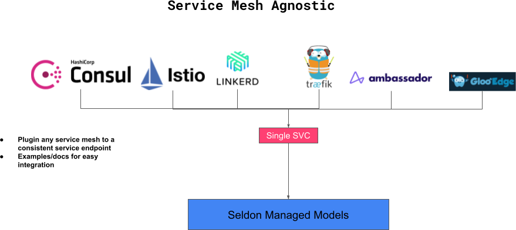

# About 

Seldon V2 APIs provide a state of the art solution for machine learning inference which can be run locally on a laptop as well as on Kubernetes for production.

## Features

 * A single platform for inference.
   * Deploy a wide range of model artifacts and custom models with a single solution.
 * Deploy locally in Docker during development and testing of models.
 * Deploy at scale on Kubernetes for production.
 * Deploy single models to multi-step pipelines.
 * Save infrastructure costs by deploys multiple models transparently in inference servers.
 * Overcommit on resources to deploy more models than available memory.
 * Dynamically extended models with pipelines with a data-centric perspective backed by Kafka
 * Explain individual models and pipeliens with state of the art explanation techniques
 * Deploy drift and outlier detectors alongside models
 * Kubernetes Service mesh agnostic - use the service mesh of your choice.

## Core features and comparison to V1 Seldon Core APIs

Out V2 APIs separate out core tasks into separate resources allowing users to get started fast with deploying a Model and the progressing to more complex Pipelines, Explainers and Experiments.

## Multi-model serving

Seldon transparently will provision your model onto the correct inference server.

By packing multiple models onto a smaller set of servers users can save infrastructure costs and efficiently utilize their models.

By allowing over-commit users can provision model models that available memory resources by allowing Seldon to transprently unload models that are not in use.

## Inference Servers

Seldon V2 supports any V2 protocol inference server. At present we include Seldon's MLServer and NVIDIA's Triton inference server automatically on install. These servers cover a wide range of artifacts including custom python models.

## Service Mesh Agnostic

Seldon core v2 can be integrated with any Kubernetes service mesh. There are current examples with istio, Ambassador and Traefic.

