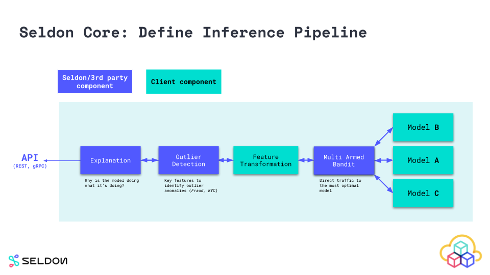
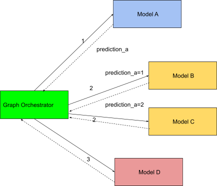
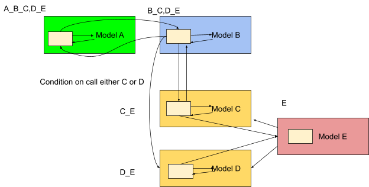

# Data flow design paradigm in Seldon Core

Seldon Core v2 is designed around data flow paradigm. Here we will explain what that means and some of the rationals behind this choice.

## Seldon Core v1

Initial release of Seldon Core introduced a concept of an _inference graph_, which can be thought of as a sequence of operations that happen to the inference request. Here is how it may look like:

In reality though this was not how Seldon Core v1 is implemented. Instead, Seldon deployment consists of a range of independent services that host models, transofrmations, detectors and explainers, and a central orchestrator that knows the inference graph topology and makes service calls in the correct order, passing data between responces and requests as necessary. Here is how the picture looks under the hood:

While this is a convenient way of implementing evaluation graph with microservices, it has a few problems. Orchestrator becomes a bottleneck and a single point of failure. It also hides all the data transformations that need to happen to translate one service's responce to another service's request. Data tracing and lineage becomes difficult. All in all, while Seldon platform is all about processing data, under-the-hood implementation was still focused on order of operations and not on data itself.

## Data flow

The realisation of this disparity led to a new approach towards inference graph evaluation in v2, based on the data flow paradigm. Data flow is a well known concept in software engineering, known from 1960s. In contrast to services, that model programs as a control flow, focusing on the order of operations, data flow proposes to model software systems as a series of connections that modify incoming data, focusing on data flowing through the system. A particular flavor of data flow paradigm used by v2 is known as flow-based programming, FBP. FBP defines software applications as a set of processes which exchange data via connections that are external to those processes. Connections are made via named ports, which promotes data coupling between components of the system.

Data flow design makes data in software the top priority. That is one of the key messages of the so called "data-centric AI" idea, which is becoming increasingly popular within the ML comunity. Data is a key component of a successful ML project. Data needs to be discovered, described, cleaned, understood, monitored and verified. Consequently, there is a growing demand for data-centric platforms and solutions. Making Seldon Core data-centric was one of the key goals of the v2 design.

## Seldon Core v2

In the context of Seldon Core application of FBP design approach means that the evaluation implementation is done the same way inferece graph. So instead of routing everything through a centralized orchestrator the evaluation happens in the same graph-like manner:

As far as implementation goes, Seldon Core v2 runs on Kafka. Inference request is put onto a pipeline input topic, which triggers an evaluation. Each part of the inference graph is a service running in its own container fronted by a model gateway. Model gateway listens to a corresponding input Kafka topic, reads data from it, calls the service and puts the received response to an output Kafka topic. There is also a pipeline gateway that allows to interact with Seldon Core in synchronous manner.

This approach gives SCv2 several important features. Firstly, Seldon Core natively supports both synchronous and asynchronous modes of operation. Asynchronicity is achieved via streaming: input data can be sent to an input topic in Kafka, and after the evaluation the output topic will contain the inference result. For those looking to use it in the v1 style, a service API is provided.

Secondly, there is no single point of failure. Even if one or more nodes in the graph go down, the data will still be sitting on the streams waiting to be processed, and the evaluation resumes whenever the failed node comes back up.

Thirdly, data flow means intermediate data can be accessed at any arbitrary step of the graph, inspected and collected as necessary. Data lineage is possible throughout, which opens up opportunities for advanced monitoring and explainability use cases. This is a key feature for effective error surfacing in production environments as it allows:
* Adding context from different parts of the graph to better understand a particular output
* Reducing false positive rates of alerts as different slices of the data can be investigated
* Enabling reproducing of results as fined-grained lineage of computation and associated data transformation are tracked by design

Finally, inference graph can now be extended with adding new nodes at arbitrary places, all without affecting the pipeline execution. This kind of flexiblity was not possible with v1. This also allows multiple pipelines to share common nodes and therefore optimising resources usage.

## References

More details and information on data-centric AI and data flow paradigm can be found in these resources:
* Data-centric AI Resource Hub: https://datacentricai.org/
* Stanford MLSys seminar "What can Data-Centric AI Learn from Data and ML Engineering?": https://www.youtube.com/watch?v=cqDgxP8DcJA
* A paper that explores data flow in ML deployment context: https://arxiv.org/abs/2204.12781
* Introduction to flow based programming from its creator J.P. Morrison: https://jpaulm.github.io/fbp/index.html
* Pathways: Asynchronous Distributed Dataflow for ML (research work from Google on the design and implementation of data flow based orchestration layer for accelerators): https://arxiv.org/abs/2203.12533
* Better understanding of data requires tracking its history and context: https://queue.acm.org/detail.cfm?id=2602651
