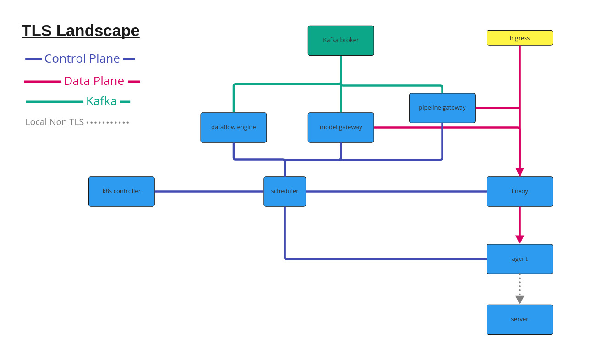

# Security

Seldon can be run with secure control plane and data plane operations. There are three areas of concern:

 * [Control Plane](#control-plane)
 * [Kafka](#kafka)
 * [Data Plane](#data-plane)

The various communication points between services are shown in the diagram below:



## Control Plane

TLS control plane activation is switched on and off via the environment variable: `CONTROL_PLANE_SECURITY_PROTOCOL` whose values can be `PLAINTEXT` or `SSL`.

Certificates will be loaded and used for the control plane gRPC services. The secrets or folders will be watched for updates (on certificate renewal) and automatically loaded again.

### Helm Control Plane Install

When installing `seldon-core-v2-setup` you can set the secret names for your certificates. If using cert-manager example discussed below this would be as follows:

```bash
helm install seldon-v2 k8s/helm-charts/seldon-core-v2-setup/ -n seldon-mesh \
      --set security.controlplane.protocol=SSL
```

## Kafka

Kafka secure activation is switched on and off via the environment variable: `KAFKA_SECURITY_PROTOCOL` whose values can be `PLAINTEXT`, `SSL` or `SASL_SSL`.

Examples are shown below:

 * [mTLS Strimzi](strimzi-mtls.md) example
 * [mTLS AWS MSK](aws-msk-mtls.md) example
 * [SASL PLAIN with Confluent Cloud](confluent-sasl.md) example
 * [SASL PLAIN with Azure Event Hub](azure-event-hub-sasl.md) example
 * [SASL SCRAM with Strimzi](strimzi-sasl.md) example
 * [SASL SCRAM with AWS MSK](aws-msk-sasl.md) example
 * [SASL OAUTH with Confluent Cloud](confluent-oauth.md) example

## Data Plane

TLS Data plane activation is switched on and off via the environment variable: `ENVOY_SECURITY_PROTOCOL` whose values can be `PLAINTEXT` or `SSL`.

When activated this ensures TLS is used to communicate to Envoy via the xDS server as well as using the SDS service to send cretificates to envoy to use for  upstream and downstream networking. Downstream is the external access to Seldon and upstream is the path from Envoy to the model servers or pipeline gateway.

### Helm Data Plane Install

When installing `seldon-core-v2-setup` you can set data plane operations to TLS as below. This assumes the secrets installed by the helm chart at the end of this section.

```bash
helm install seldon-v2 k8s/helm-charts/seldon-core-v2-setup/ -n seldon-mesh --set security.envoy.protocol=SSL
```

The above uses default secret names defined for the certificates installed. You can change the names of the required certificate secrets as shown in a longer configuration below (again using the default names for illustration).

For this we use the following updated Helm values (`k8s/samples/values-tls-dataplane-example.yaml`):

```{literalinclude} ../../../../../../k8s/samples/values-tls-dataplane-example.yaml
:language: yaml
```

We use Envoy internally to direct traffic and in Envoy's terminology `upstream` is for internal model servers called from Envoy while the downstream server is the entrypoint server running in Envoy to receive grpc and REST calls. The above settings ensure mTLS for internal "upstream" traffic while provides a standard SSL non-mTLS entrpoint.

To use the above with the seldon CLI you would need a custom config file as follow:

```json
{
    "dataplane": {
	"tls": true,
	"skipSSLVerify": true
    }
}

```

We skip SSL Verify as these are internal self-signed certificates. For production use you would change this to the correct DNS name you are exposing the Seldon entrypoint.

## Cetificate Providers

The installer/cluster controller for Seldon needs to provide the certificates. As part of Seldon we provide an example set of certificate issuers and certificates using [cert-manager](https://cert-manager.io/).

### Helm

You can install Certificates into the desired namespace, here we use `seldon-mesh` as an example.

```
helm install seldon-v2-certs k8s/helm-charts/seldon-core-v2-certs/ -n seldon-mesh
```

```{toctree}
:maxdepth: 1
:hidden:

strimzi-mtls.md
strimzi-sasl.md
confluent-sasl.md
confluent-oauth.md
azure-event-hub-sasl.md
aws-msk-sasl.md
aws-msk-mtls.md
reference.md
```
