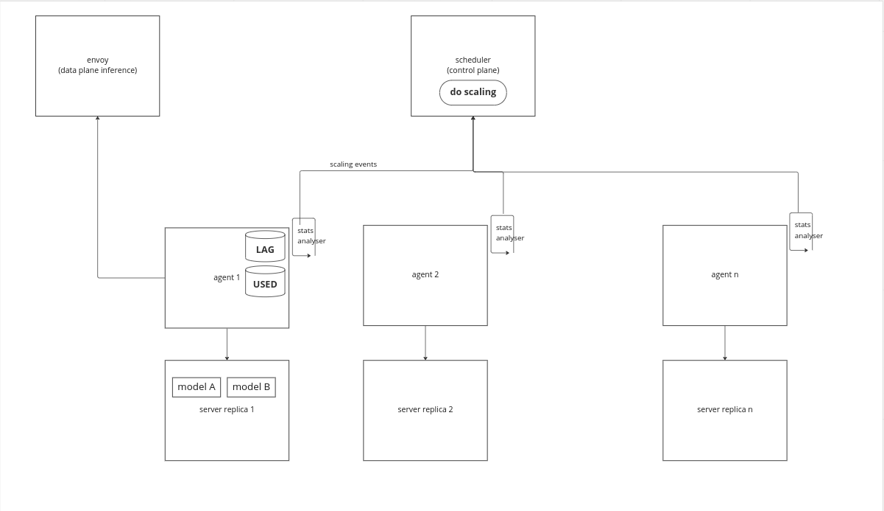
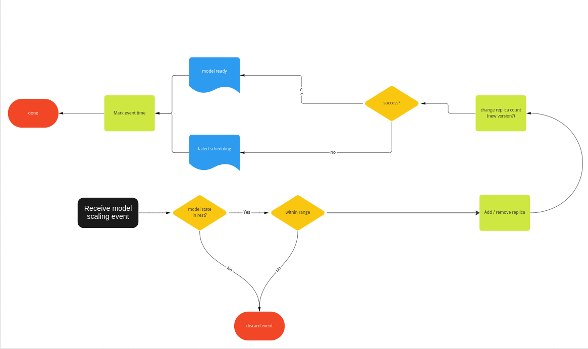

# Autoscaling

Autoscaling in Seldon applies to various concerns:

 * Inference servers autoscaling
 * Model autoscaling
 * Model memory overcommit

## Inference servers autoscaling


Autoscaling of servers can be done via `HorizontalPodAutoscaler` (HPA).

HPA can be applied to any deployed `Server` resource.
In this case HPA will manage the number of server replicas in the corresponding statefulset according to utilisation metrics  (e.g. CPU or memory).

For example assuming that a `triton` server is deployed, then the user can attach an HPA based on cpu utilisation as follows:

```
kubectl autoscale server triton --cpu-percent=50 --min=1 --max=5
```

In this case, according to load, the system will add / remove server replicas to / from the `triton` statefulset. 

It is worth considering the following points:

- If HPA adds a new server replica, this new replica will be included in any **future** scheduling decisions.
  In other words, when deploying a new model or rescheduling failed models this new replica will be considered.

- If HPA deletes an existing server replica, the scheduler will first attempt to drain any loaded model on this server replica before the server replica gets actually deleted. This is achieved by leveraging a `PreStop` hook on the server replica pod that triggers a process before receiving the termination signal. This draining process is capped by `terminationGracePeriodSeconds`, which the user can set (default is 2 minutes).

Therefore there should generally be minimal disruption to the inference workload during scaling.

For more details on HPA check this [Kubernetes walk-through](https://kubernetes.io/docs/tasks/run-application/horizontal-pod-autoscale-walkthrough/).

```{note}
Autoscaling of inference servers via `seldon-scheduler` is under consideration for the roadmap. This allow for more fine grained interactions with model autoscaling.
```

## Model autoscaling

As each model server can serve multiple models, models can scale across the available replicas of the server according to load.

Autoscaling of models is enabled if at least `MinReplicas` or `MaxReplicas` is set in the model custom resource. Then according to load the system will scale the number of `Replicas` within this range. 

For example the following model will be deployed at first with 1 replica and it can scale up according to load.
```{literalinclude} ../../../../../samples/models/tfsimple_scaling.yaml
:language: yaml
```

Note that model autoscaling will not attempt to add extra servers if the desired number of replicas cannot be currently fulfilled by the current provisioned number of servers. This is a process left to be done by server autoscaling.

Additionally when the system autoscales, the initial model spec is not changed (e.g. the number of `Replicas`) and therefore the user cannot reset the number of replicas back to the initial specified value without an explicit change.

If only `Replicas` is specified by the user, autoscaling of models is disabled and the system will have exactly the number of replicas of this model deployed regardless of inference load.

### Architecture

The model autoscaling architecture is designed such as each agent decides on which models to scale up / down according to some defined internal metrics and then sends a triggering message to the scheduler. The current metrics are collected from the data plane (inference path), representing a proxy on how loaded is a given model with fulfilling inference requests.




### Agent autoscaling stats collection

#### Scale up logic:
The main idea is that we keep the "lag" for each model. We define the "lag" as the difference between incoming and outgoing requests in a given time period. If the lag crosses a threshold, then we trigger a model scale up event. This threshold can be defined via `SELDON_MODEL_INFERENCE_LAG_THRESHOLD` inference server environment variable.

#### Scale down logic:
For now we keep things simple and we trigger model scale down events if a model has not been used for a number of seconds. This is defined in `SELDON_MODEL_INACTIVE_SECONDS_THRESHOLD` inference server environment variable.

Each agent checks the above stats periodically and if any model hits the corresponding threshold, then the agent sends an event to the scheduler to request model scaling.

How often this process executes can be defined via `SELDON_SCALING_STATS_PERIOD_SECONDS` inference server environment variable.

### Scheduler autoscaling



The scheduler will perform model autoscale if:
* The model is stable (no state change in the last 5 minutes) and available.
* The desired number of replicas is within range. Note we always have a least 1 replica of any deployed model and we rely on over commit to reduce the resources used further.
* For scaling up, there is enough capacity for the new model replica.

## Model memory overcommit

Servers can hold more models than available memory if overcommit is swictched on (default yes). This allows under utilized models to be moved from inference server memory to allow for other models to take their place. Note that these evicted models are still registered and in the case future inference requests arrive, the system will reload the models back to memory before serving the requests. If traffic patterns for inference of models vary then this can allow more models than available server memory to be run on the system.

