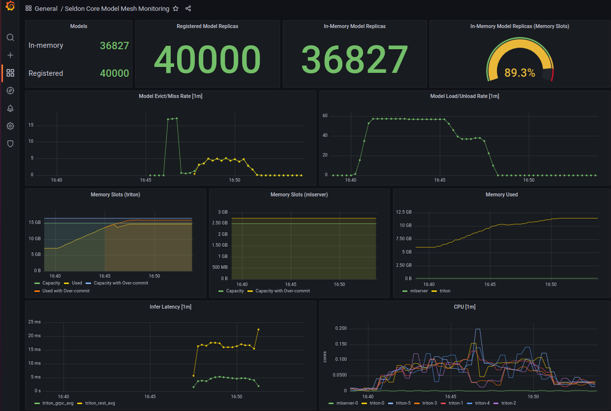

# Metrics

While the system is running we collect metrics via prometheus that allow users to observe differnet aspects of SCv2
with regards to throughout, latency, memory, cpu etc.

This is in addition to the standard kubernetes like metrics that are scraped by prometheus.

There is a grafana dashboard (referenced below) that provides an overview of the system.

## List of SCv2 metrics

The list of SCv2 metrics that we are compiling is:

  ```{literalinclude} ../../../../scheduler/pkg/metrics/prometheus.go
   :language: golang
   :start-after: // start list of metrics 
   :end-before: // end list of metrics 
   ```

Many of these metrics are model level counters and gauges. We also aggregate some of these metrics to speed up the display of graphs.

This is experimental and these metrics are bound to change to reflect the trends we want to capture as we get more information about the usage of the system.

## Grafana dashboard

We have a prebuilt grafana dashboard that makes use of many of the metrics that we expose.



### Installation

Download the dashboard from [SCv2 dashboard](https://github.com/SeldonIO/seldon-core-v2/blob/master/prometheus/dashboards/Seldon%20Core%20Model%20Mesh%20Monitoring.json) and import it in grafana, making sure that the data source is pointing to the correct prometheus store. Find more information on how to import the dashboard [here](https://grafana.com/docs/grafana/latest/dashboards/export-import/)


