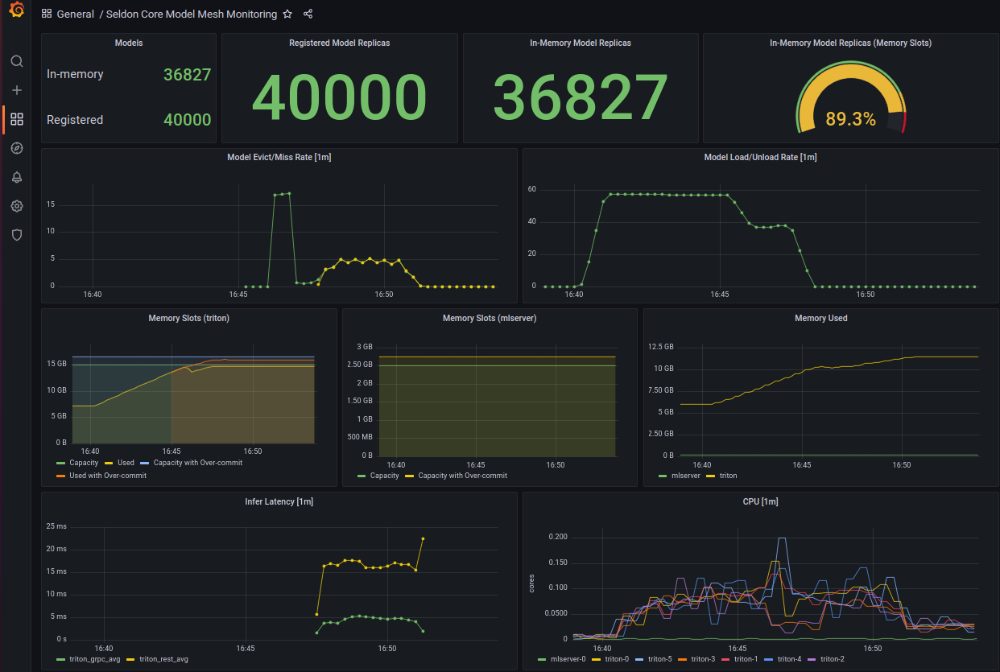

# Operational Metrics

While the system is running we collect metrics via Prometheus that allow users to observe different aspects of SCv2 with regards to throughout, latency, memory, CPU etc.

This is in addition to the standard Kubernetes metrics that are scraped by Prometheus.

There is a Grafana dashboard (referenced below) that provides an overview of the system.

## List of SCv2 metrics

The list of SCv2 metrics that we are compiling is as follows.

For the agent that sits next to the inference servers:

  ```{literalinclude} ../../../../scheduler/pkg/metrics/agent.go
   :language: golang
   :start-after: // start list of metrics 
   :end-before: // end list of metrics 
   ```

For the pipeline gateway that handles requests to pipelines:

   ```{literalinclude} ../../../../scheduler/pkg/metrics/gateway.go
   :language: golang
   :start-after: // start list of metrics 
   :end-before: // end list of metrics 
   ```

Many of these metrics are model and pipeline level counters and gauges.
We also aggregate some of these metrics to speed up the display of graphs. We don't presently store per-model histogram metrics for performance reasons. However, we do presently store per-pipeline histogram metrics.

This is experimental and these metrics are bound to change to reflect the trends we want to capture as we get more information about the usage of the system.

## Grafana dashboard

We have a prebuilt Grafana dashboard that makes use of many of the metrics that we expose.



### Local Use

Grafana and Prometheus are available when you run Seldon locally.
You will be able to connect to the Grafana dashboard at `http://localhost:3000`.
Prometheus will be available at `http://localhost:9090`.

### Kubernetes Installation

Download the dashboard from [SCv2 dashboard](https://github.com/SeldonIO/seldon-core-v2/blob/master/prometheus/dashboards/seldon.json) and import it in Grafana, making sure that the data source is pointing to the correct Prometheus store.
Find more information on how to import the dashboard [here](https://grafana.com/docs/grafana/latest/dashboards/export-import/).


