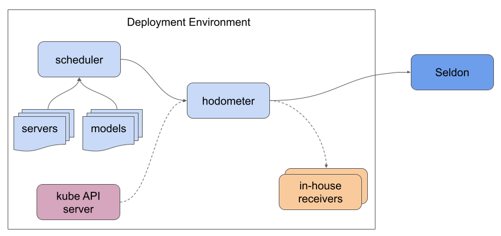

# Usage Metrics

There are various interesting system metrics about how Seldon Core v2 is used.
These metrics can be recorded **anonymously** and sent to Seldon by a lightweight, optional, stand-alone component called Hodometer.

When provided, these metrics will be used to understand the adoption of Seldon Core v2 and how people interact with it.
For example, knowing how many clusters Seldon Core v2 is running on, if it is used in Kubernetes or for local development, and how many people are benefitting from features like multi-model serving.

## Architecture



Hodometer is not an integral part of Seldon Core v2, but rather an independent component which connects to the public APIs of the Seldon Core v2 scheduler.
If deployed in Kubernetes, it will also try to request some basic information from the Kubernetes API.

Recorded metrics are sent to Seldon and, optionally, to any [additional endpoints](#extra-publish-urls) you define.

## Privacy

Hodometer was explicitly designed with privacy of user information and transparency of implementation in mind.

It does not record any sensitive or identifying information.
For example, it has no knowledge of IP addresses, model names, or user information.

All information sent to Seldon is anonymised with a completely random cluster identifier.

Hodometer supports [different information levels](#metrics-levels), so you have full control over what metrics are provided to Seldon, if any.

For transparency, the implementation is fully open-source and designed to be easy to read.
The full source code is available [here](https://github.com/seldonio/seldon-core-v2/tree/master/hodometer), with metrics defined in code [here](https://github.com/seldonio/seldon-core-v2/tree/master/hodometer/pkg/hodometer/metrics.go).
See [below](#list-of-metrics) for an equivalent table of metrics.

## Performance

Metrics are collected as periodic snapshots a few times per day.
They are lightweight to collect, coming mostly from the Seldon Core v2 scheduler, and are heavily aggregated.
As such, they should have minimal impact on CPU, memory, and network consumption.

Hodometer does not store anything it records, so does not have any persistent storage.
As a result, it should not be considered a replacement for tools like Prometheus.

## Configuration

### Metrics levels

Hodometer supports 3 different metrics levels:

| Level | Description |
| --- | --- |
| Cluster | Basic information about the Seldon Core v2 installation |
| Resource | High-level information about which Seldon Core v2 resources are used |
| Feature | More detailed information about how resources are used and whether or not certain feature flags are enabled |

Alternatively, usage metrics can be completely disabled.
To do so, simply remove any existing deployment of Hodometer or disable it in the installation for your environment, discussed below.

### Options

The following environment variables control the behaviour of Hodometer, regardless of the environment it is installed in.

| Flag | Format | Example | Description |
| --- | --- | --- | --- |
| `METRICS_LEVEL` | string | feature | Level of detail for recorded metrics; one of `feature`, `resource`, or `cluster` |
| `EXTRA_PUBLISH_URLS` | comma-separated list of URLs | http://my-endpoint-1:8000,http://my-endpoint-2:8000 | Additional endpoints to publish metrics to |
| `SCHEDULER_HOST` | string | seldon-scheduler | Hostname for Seldon Core v2 scheduler |
| `SCHEDULER_PORT` | integer | 9004 | Port for Seldon Core v2 scheduler |
| `LOG_LEVEL` | string | info | Level of detail for application logs |

### Kubernetes

Hodometer is installed as a separate deployment, by default in the same namespace as the rest of the Seldon components.

`````{tabs}

````{group-tab} Helm


If you install Seldon Core v2 by [Helm chart](../getting-started/kubernetes-installation/helm.md), there are values corresponding to the key environment variables discussed [above](#setting-options).
These Helm values and their equivalents are provided below:

| Helm value | Environment variable |
| --- | --- |
| `hodometer.metricsLevel` | `METRICS_LEVEL` |
| `hodometer.extraPublishUrls` | `EXTRA_PUBLISH_URLS` |
| `hodometer.logLevel` | `LOG_LEVEL` |

If you do not want usage metrics to be recorded, you can disable Hodometer via the `hodometer.enabled` Helm value.
The following command disables collection of usage metrics in fresh installations and also serves to remove Hodometer from an existing installation:

```bash
helm install seldon-core-v2 k8s/helm-charts/seldon-core-v2-setup \
  --namespace seldon-mesh \
  --set hodometer.enabled=false
```

```{note}
It is a good practice to set Helm values in values file.
These can be applied by using the `-f <filename>` switch when running Helm.
```

````
````{group-tab} YAML

The [raw YAML](../getting-started/kubernetes-installation/raw.md) approach to installing Seldon Core v2 provides an opinionated, pre-configured set of manifests.
Hodometer is automatically enabled with this approach.

You can disable Hodometer by manually removing the appropriate resources before applying the manifests.
If you have an existing installation, you will also need to delete the deployment and, optionally, any of the RBAC resources.

As there is no templating with the raw YAML manifests, you would need to set configuration environment variables manually before deploying them to a cluster.
````
`````

### Docker Compose

The [Compose setup](../getting-started/docker-installation/index.md) provides a pre-configured and opinionated, yet still flexible, approach to using Seldon Core v2.

Hodometer is defined as a service called `hodometer` in the Docker Compose manifest.
It is automatically enabled when running as per the installation instructions.

You can disable Hodometer in Docker Compose by removing the corresponding service from the base manifest.
Alternatively, you can gate it behind a [profile](https://docs.docker.com/compose/profiles/).
If the service is already running, you can stop it directly using `docker-compose stop ...`.

Configuration can be provided by environment variables when running `make` or directly invoking `docker-compose`.
The available variables are defined in the Docker Compose environment file, prefixed with `HODOMETER_`.

### Extra publish URLs

Hodometer can be instructed to publish metrics not only to Seldon, but also to any extra endpoints you specify.
This is controlled by the `EXTRA_PUBLISH_URLS` environment variable, which expects a comma-separated list of HTTP-compatible URLs.

You might choose to use this for your own usage monitoring.
For example, you could capture these metrics and expose them to Prometheus or another monitoring system using your own service.

Metrics are recorded in MixPanel-compatible format, which employs a highly flexible JSON schema.

For an example of how to define your own metrics listener, see the [`receiver` Go package](https://github.com/SeldonIO/seldon-core-v2/tree/master/hodometer/pkg/receiver) in the `hodometer` sub-project.

## List of metrics

```{include} ../../../../hodometer/README.md
:start-after: <!-- start list metrics -->
:end-before: <!-- end list metrics -->
```
