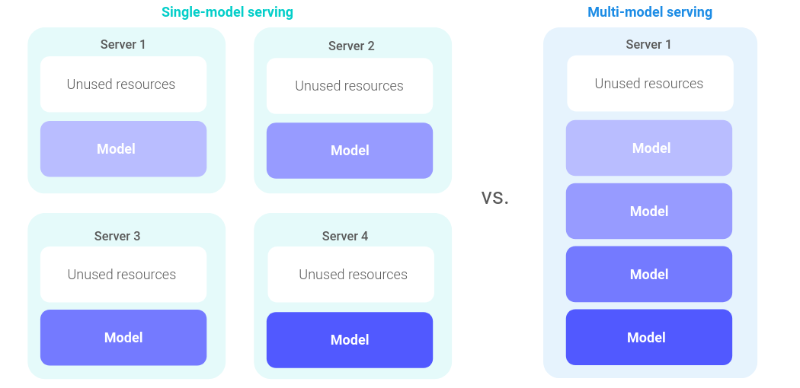
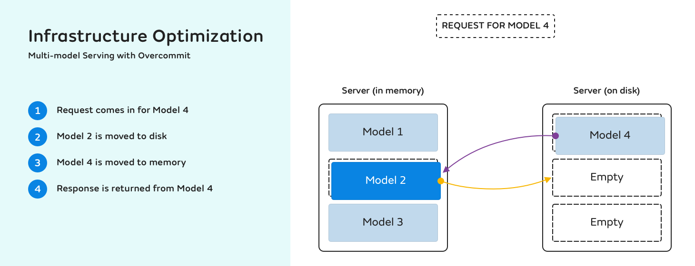

# Multi-model Serving with Overcommit

## Multi-model Serving

Multi-model serving is an architecture pattern where one ML inference server hosts multiple models at the same time. This means that, within a single instance of the server, you can serve multiple models under different paths. This is a feature provided out of the box by Nvidia Triton and Seldon MLServer, currently the two inference servers that are integrated in Seldon Core v2.

This deployment pattern allows the system to handle a large number of deployed models letting them share hardware resources allocated to inference servers (e.g GPUs). For example if a single model inference server is deployed on a one GPU node, the underlying loaded models on this inference server instance are able to effectively share this GPU. This is contrast to a single model per server deployment pattern where only one model can use the allocated GPU. 




Multi-model serving is enabled by design in Seldon Core v2. Based on requirements that are specified by the user on a given `Model`, the Scheduler will find an appropriate model inference server instance to load the model onto. 

In the below example, given that the model is `tensorflow`, the system will deploy the model onto a `triton` server instance (matching with the `Server` labels). Additionally as the model `memory` requirement is `100Ki`, the system will pick the server instance that has enough (memory) capacity to host this model in parallel to other potentially existing models. 


```{literalinclude} ../../../../../samples/models/tfsimple1.yaml 
:language: yaml
```

All models are loaded and active on this model server. Inference requests for these models are served concurrently and the hardware resources are shared to fulfil these inference requests.

## Overcommit

Overcommit allows shared servers to handle more models than can fit in memory. This is done by keeping highly utilized models in memory and evicting other ones to disk using a least-recently-used (LRU) cache mechanism. From a user perspective these models are all registered and "ready" to serve inference requests. If an inference request comes for a model that is unloaded/evicted to disk, the system will reload the model first before forwarding the request to the inference server.

Overcommit is enabled by setting `SELDON_OVERCOMMIT_PERCENTAGE` on shared servers; it is set by default at 10%. In other words a given model inference server instance can register models with a total memory requirement up to `MEMORY_REQUEST` * ( 1 + `SELDON_OVERCOMMIT_PERCENTAGE` / 100).

The Seldon Agent (a side car next to each model inference server deployment) is keeping track of inference requests times on the different models. These models are sorted in time ascending order and this data structure is used to evict the least recently used model in order to make room for another incoming model. This happens during two scenarios:
- A new model load request beyond the active memory capacity of the inference server.
- An incoming inference request to a registered model that is not loaded in-memory (previously evicted).

This is done seamlessly to users and specifically for reloading a model onto the inference server to respond to an inference request, the model artifact is cached on disk which allows a faster reload (no remote artifact fetch). Therefore we expect that the extra latency to reload a model during an inference request is acceptable in many cases (with a lower bound of ~100ms).

Overcommit can be disabled by setting `SELDON_OVERCOMMIT_PERCENTAGE` to 0 for a given shared server.



**Note**: currently we are using memory requirement values that are specified by the user on the Server and Model side. In the future we are looking at how to make the system automatically handle memory management.

Check [notebook](../../examples/local-overcommit-examples.md) for a local example.