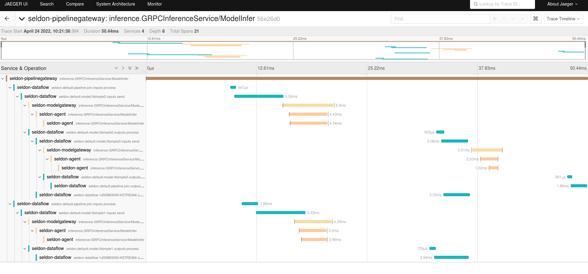

# Pipelines

Pipelines allow models to be connected into flows of data transformations. This allows more complex machine learning pipelines to be created with multiple modles, feature transformations and monitoring components such as drift and outlier detectors.

## Creating Pipelines

The simplest way to create Pipelines is by defining them with the [Pipeline resource we provide for Kubernetes](../kubernetes/resources/pipeline/index). This format is accepted by our Kubernetes implementation but also locally via out `seldon` CLI.

Internally in both cases Pipelines are created via our [Scheduler API](../apis/scheduler/index). Advanced users could submit Pipelines directly using this gRPC service.

An example that chains two models together is shown below:

```
apiVersion: mlops.seldon.io/v1alpha1
kind: Pipeline
metadata:
  name: chain
  namespace: seldon-mesh
spec:
  steps:
    - name: model1
    - name: model2
      inputs:
      - model1
  output:
    steps:
    - model2

```

  * `steps` allow you to specifier the models you want to combine into a pipeline. Each step name will correspond to a model of the same name. These models will need to have been deployed and available for the Pipeline to funciton, however Pipelines can be deployed before or at the same time you deploy the underlying models.
  * `steps.inputs` allow you to specify the inputs to this step.
  * `outputs.steps` allow you to specify the output of the Pipeline. A pipeline can have multiple paths include flows of data that do not reach the output, e.g. Drift detection steps. However, if you wisht to call your Pipeline in a synchronous manner via REST/gRPC then and output must be present so the Pipeline can be treated as a function.

## Expressing input data sources


Model step inputs are defined with a dot notation of the form:

```
<stepName>|<pipelineName>.<inputs|outputs>.<tensorName>
```

Inputs with just step name will be assumed to be `step.outputs`.

The default payloads for Pipelines is the V2 protocol which requires named tensors as inputs and outputs from a model. If you require just certain tensors from a model you can reference those in the inputs, e.g. `mymodel.outputs.t1` will reference the tensor `t1` from the model `mymodel`.

For the specification of the [V2 protocol](../apis/inference/index.md).

## Chain

The simplest Pipeline chains models together: the output of one model goes into the input of the next. This will work out of the box if the output tensor names from a model match the input tensor names for the one being chained to. If they do not then the `tensorMap` construct presently needs to be used to define the mapping explicitly, e.g. see below for a simple chained pipeline of two tfsimple example models:

```{literalinclude} ../../../../samples/pipelines/tfsimples.yaml
:language: yaml
```

In the above we rename tensor `OUTPUT0` to `INPUT0` and `OUTPUT1` to `INPUT11. This allows these models to be chained together. The shape and data-type of the tensors needs to match as well.

This example can be found in the [pipeline-examples examples](../examples/pipeline-examples.html#model-chaining).

## Join

Joining allows us to combine outputs from multiple steps as input to a new step.

```{literalinclude} ../../../../samples/pipelines/tfsimples-join.yaml
:language: yaml
```

Here we pass the pipeline inputs to two models and then take one output tensor from each and pass to the final model. We use the same `tensorMap` technique to rename tensors as disucssed in the previous section.

Joins can have a join type which can be specified with `inputsJoinType` and can take the values:
  * `inner` : require all inputs to be available to join.
  * `outer` : wait for `joinWindowMs` to join any inputs. Ignoring any inputs that have not sent any data at that point. This will mean this step of the pipeline is guaranteed to have a latency of at least `joinWindowMs`.
  * `any` : Wait for any of the specified data sources.

This example can be found in the [pipeline-examples examples](../examples/pipeline-examples.html#model-join).

## Conditional Logic

Pipelines can create conditional flows via various methods. We will discuss each in turn.

### Model routing via tensors

The simplest way is create a model that outputs different named tensors based on its decision. This way downstream steps can be dependant on different expected tensors. An example is shhow below:

```{literalinclude} ../../../../samples/pipelines/conditional.yaml
:language: yaml
```

In the above we have a step `conditional` that either outputs a tensor named `OUTPUT0` or a tensor named `OUTPUT1`. The `mul10` step depends on an output in `OUTPUT0` while the add10 step depends on an output from `OUTPUT1`.

Note, we also have a final Pipeline output step that does an `any` join on these two models essentially outputing fron the pipeline whichever data arrives from either model. This type of Pipeline can be used for Multi-Armed bandit solutions where you want to route traffic dynamically.`

This example can be found in the [pipeline-examples examples](../examples/pipeline-examples.html#conditional).

### Errors

Its also possible to abort pipelines when an error is produced to in effect create a condition. This is illustrated below:

```{literalinclude} ../../../../samples/pipelines/error.yaml
:language: yaml
```

This Pipeline runs normally or throws an error based on whether the inut tensors have certain values.

This example can be found in the [pipeline-examples examples](../examples/pipeline-examples.html#error).

### Triggers

Sometimes you want to run a step if an output is received from a previous step but not to send the data from that step to the model. This is illustrated below:

```{literalinclude} ../../../../samples/pipelines/tfsimples-join-outlier.yaml
:language: yaml
```

In this example the last step `tfsimple3` runs only if there are outputs from `tfsimple1` and `tfsimple2` but also data from the `check` step. However, if the step `tfsimple3` is run it only receives the join of data from `tfsimple1` and `tfsimple2`.

This example can be found in the [pipeline-examples examples](../examples/pipeline-examples.html#model-join-with-trigger).

## Data Centric Implementation

Internally Pipelines are implemented using Kafka. Each input and output to a pipeline s
tep has an associated Kafka topic. This has many advantages and allows auditing, replay and debugging easier as data is preseved from every step in your pipeline.

Tracing allows you to monitor the processing latency of your pieplines.


 
As each request to a pipelines moves through the steps its data will appear in input and output topics. This allows a full audit of every transformation to be carried out.

