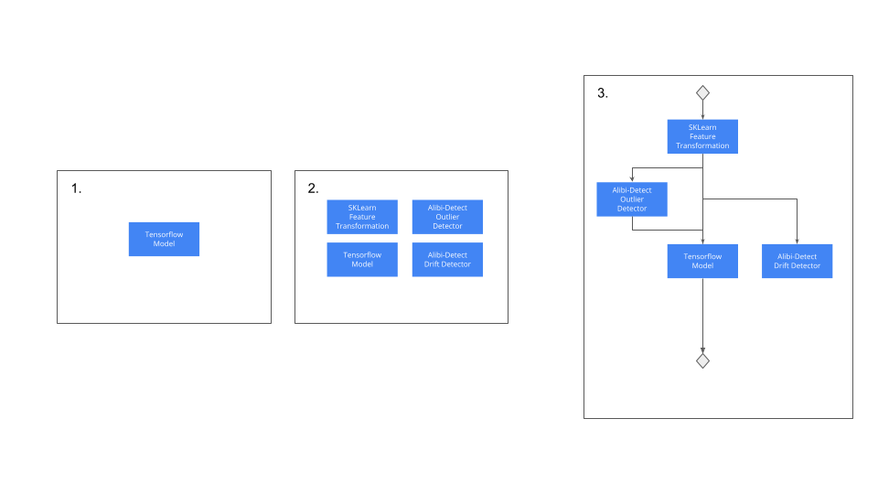

# Seldon Workflow Introduction

Seldon inference is built from atomic Model components. Models as [shown here](../inference-artifacts/index) cover a wide range of artifacts including:

  * Core machine learning models, e.g. a Tensorflow model.
  * Feature transformations that might be built with custom python code.
  * Drift detectors.
  * Outlier detectors.
  * Adversarial detectors.

A typical workflow for a production machine learning setup might be as follows:

 1. You create a Tensorflow model for your core application use case.
    1. You test this model in isolation to validate
 1. You create SKLearn feature transformation component before your model to convert the input into the correct form for your model. You also create Drift and Outlier dteectors using Seldon's open source ALibi-detect library and test these in isolation. 
 1. You join these components together into a Pipeline for the final production setup.

These steps are shown in the diagram below:

