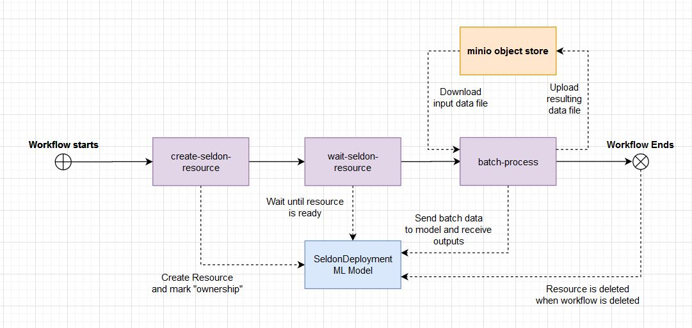

## Batch processing with Argo Worfklows

In this notebook we will dive into how you can run batch processing with Argo Workflows and Seldon Core.

Dependencies:

* Seldon core installed as per the docs with an ingress
* Argo Workfklows installed in cluster (and argo CLI for commands)


## Seldon Core Batch with Object Store

In some cases we may want to read the data from an object source.

In this case we will show how you can read from an object store, in this case minio.

The workflow will look as follows:



For this we will assume you have installed the Minio (mc) CLI - we will use a Minio client in the cluster but you can use another object store provider like S3, Google Cloud, Azure, etc.

### Set up Minio in your cluster


```bash
%%bash 
helm install minio stable/minio \
    --set accessKey=minioadmin \
    --set secretKey=minioadmin \
    --set image.tag=RELEASE.2020-04-15T19-42-18Z
```

    NAME: minio
    LAST DEPLOYED: Thu Apr 30 10:57:00 2020
    NAMESPACE: default
    STATUS: deployed
    REVISION: 1
    TEST SUITE: None
    NOTES:
    Minio can be accessed via port 9000 on the following DNS name from within your cluster:
    minio.default.svc.cluster.local
    
    To access Minio from localhost, run the below commands:
    
      1. export POD_NAME=$(kubectl get pods --namespace default -l "release=minio" -o jsonpath="{.items[0].metadata.name}")
    
      2. kubectl port-forward $POD_NAME 9000 --namespace default
    
    Read more about port forwarding here: http://kubernetes.io/docs/user-guide/kubectl/kubectl_port-forward/
    
    You can now access Minio server on http://localhost:9000. Follow the below steps to connect to Minio server with mc client:
    
      1. Download the Minio mc client - https://docs.minio.io/docs/minio-client-quickstart-guide
    
      2. mc config host add minio-local http://localhost:9000 minioadmin minioadmin S3v4
    
      3. mc ls minio-local
    
    Alternately, you can use your browser or the Minio SDK to access the server - https://docs.minio.io/categories/17


### Forward the Minio port so you can access it

You can do this by runnning the following command in your terminal:
```
kubectl port-forward svc/minio 9000:9000
    ```
    
### Configure local minio client


```python
!mc config host add minio-local http://localhost:9000 minioadmin minioadmin
```

    Added `minio-local` successfully.
    

### Create some input for our model

We will create a file that will contain the inputs that will be sent to our model


```python
with open("assets/input-data.txt", "w") as f:
    for i in range(10000):
        f.write('[[1, 2, 3, 4]]\n')
```

### Check the contents of the file


```python
!wc -l assets/input-data.txt
!head assets/input-data.txt
```

    10000 assets/input-data.txt
    [[1, 2, 3, 4]]
    [[1, 2, 3, 4]]
    [[1, 2, 3, 4]]
    [[1, 2, 3, 4]]
    [[1, 2, 3, 4]]
    [[1, 2, 3, 4]]
    [[1, 2, 3, 4]]
    [[1, 2, 3, 4]]
    [[1, 2, 3, 4]]
    [[1, 2, 3, 4]]


### Upload the file to our minio


```python
!mc mb minio-local/data
!mc cp assets/input-data.txt minio-local/data/
```

    mc: <ERROR> Unable to make bucket `minio-local/data`. The difference between the request time and the server's time is too large.
     0 B / ? ┃░░░░░░░░░░░░░░░░░░░░░░░░░░░░░░░░░░░░░░░░░░░░░░░░░░░░░░░░░░░░░░░░░░░░▓┃
    mc: <ERROR> Failed to copy `assets/input-data.txt`. The difference between the request time and the server's time is too large.
    

### Create Argo Workflow

In order to create our argo workflow we have made it simple so you can leverage the power of the helm charts.

Before we dive into the contents of the full helm chart, let's first give it a try with some of the settings.

We will run a batch job that will set up a Seldon Deployment with 10 replicas and 100 batch client workers to send requests.


```python
!helm template seldon-batch-workflow helm-charts/seldon-batch-workflow/ \
    --set workflow.name=seldon-batch-process \
    --set seldonDeployment.name=sklearn \
    --set seldonDeployment.replicas=10 \
    --set batchWorker.workers=100 \
    --set batchWorker.payloadType=ndarray \
    --set batchWorker.dataType=data \
    | argo submit -
```

    ERRO[0000] Create request is failed. Error: workflows.argoproj.io "seldon-batch-process" already exists 
    2020/06/06 09:34:13 Failed to submit workflow: workflows.argoproj.io "seldon-batch-process" already exists


```python
!argo list
```

    NAME                   STATUS    AGE   DURATION   PRIORITY
    seldon-batch-process   Running   11s   11s        0


```python
!argo get seldon-batch-process
```

    Name:                seldon-batch-process
    Namespace:           default
    ServiceAccount:      default
    Status:              Succeeded
    Created:             Sat Jun 06 09:34:04 +0100 (1 minute ago)
    Started:             Sat Jun 06 09:34:04 +0100 (1 minute ago)
    Finished:            Sat Jun 06 09:35:45 +0100 (5 seconds ago)
    Duration:            1 minute 41 seconds
    
    STEP                                                             PODNAME                          DURATION  MESSAGE
     ✔ seldon-batch-process (seldon-batch-process)                                                              
     ├---✔ create-seldon-resource (create-seldon-resource-template)  seldon-batch-process-3626514072  2s        
     ├---✔ wait-seldon-resource (wait-seldon-resource-template)      seldon-batch-process-2052519094  31s       
     ├---✔ download-object-store (download-object-store-template)    seldon-batch-process-1257652469  3s        
     ├---✔ process-batch-inputs (process-batch-inputs-template)      seldon-batch-process-2033515954  57s       
     └---✔ upload-object-store (upload-object-store-template)        seldon-batch-process-2123074048  3s        


```python
!argo logs -w seldon-batch-process 
```

    create-seldon-resource:	time="2020-06-06T08:34:05Z" level=info msg="Starting Workflow Executor" version=v2.8.0-rc4+8f69617.dirty
    create-seldon-resource:	time="2020-06-06T08:34:05Z" level=info msg="Creating a docker executor"
    create-seldon-resource:	time="2020-06-06T08:34:05Z" level=info msg="Executor (version: v2.8.0-rc4+8f69617.dirty, build_date: 2020-05-12T15:17:15Z) initialized (pod: default/seldon-batch-process-3626514072) with template:\n{\"name\":\"create-seldon-resource-template\",\"arguments\":{},\"inputs\":{},\"outputs\":{},\"metadata\":{},\"resource\":{\"action\":\"create\",\"manifest\":\"apiVersion: machinelearning.seldon.io/v1\\nkind: SeldonDeployment\\nmetadata:\\n  name: \\\"sklearn\\\"\\n  namespace: default\\n  ownerReferences:\\n  - apiVersion: argoproj.io/v1alpha1\\n    blockOwnerDeletion: true\\n    kind: Workflow\\n    name: \\\"seldon-batch-process\\\"\\n    uid: \\\"8b3db526-8558-43cc-8bbc-a5c65247b995\\\"\\nspec:\\n  name: \\\"sklearn\\\"\\n  predictors:\\n    - graph:\\n        children: []\\n        implementation: SKLEARN_SERVER\\n        modelUri: gs://seldon-models/sklearn/iris\\n        name: classifier\\n      name: default\\n      replicas: 10\\n        \\n\"}}"
    create-seldon-resource:	time="2020-06-06T08:34:05Z" level=info msg="Loading manifest to /tmp/manifest.yaml"
    create-seldon-resource:	time="2020-06-06T08:34:05Z" level=info msg="kubectl create -f /tmp/manifest.yaml -o json"
    create-seldon-resource:	time="2020-06-06T08:34:06Z" level=info msg=default/SeldonDeployment.machinelearning.seldon.io/sklearn
    create-seldon-resource:	time="2020-06-06T08:34:06Z" level=info msg="No output parameters"
    wait-seldon-resource:	Waiting for deployment "sklearn-default-0-classifier" rollout to finish: 0 of 10 updated replicas are available...
    wait-seldon-resource:	Waiting for deployment "sklearn-default-0-classifier" rollout to finish: 1 of 10 updated replicas are available...
    wait-seldon-resource:	Waiting for deployment "sklearn-default-0-classifier" rollout to finish: 2 of 10 updated replicas are available...
    wait-seldon-resource:	Waiting for deployment "sklearn-default-0-classifier" rollout to finish: 3 of 10 updated replicas are available...
    wait-seldon-resource:	Waiting for deployment "sklearn-default-0-classifier" rollout to finish: 4 of 10 updated replicas are available...
    wait-seldon-resource:	Waiting for deployment "sklearn-default-0-classifier" rollout to finish: 5 of 10 updated replicas are available...
    wait-seldon-resource:	Waiting for deployment "sklearn-default-0-classifier" rollout to finish: 6 of 10 updated replicas are available...
    wait-seldon-resource:	Waiting for deployment "sklearn-default-0-classifier" rollout to finish: 7 of 10 updated replicas are available...
    wait-seldon-resource:	Waiting for deployment "sklearn-default-0-classifier" rollout to finish: 8 of 10 updated replicas are available...
    wait-seldon-resource:	Waiting for deployment "sklearn-default-0-classifier" rollout to finish: 9 of 10 updated replicas are available...
    wait-seldon-resource:	deployment "sklearn-default-0-classifier" successfully rolled out
    download-object-store:	Added `minio-local` successfully.
    download-object-store:	`minio-local/data/input-data.txt` -> `/assets/input-data.txt`
    download-object-store:	Total: 0 B, Transferred: 146.48 KiB, Speed: 18.89 MiB/s
    process-batch-inputs:	Elapsed time: 53.00515842437744
    upload-object-store:	Added `minio-local` successfully.
    upload-object-store:	`/assets/output-data.txt` -> `minio-local/data/output-data-8b3db526-8558-43cc-8bbc-a5c65247b995.txt`
    upload-object-store:	Total: 0 B, Transferred: 2.75 MiB, Speed: 72.64 MiB/s


## Check output in object store

We can now visualise the output that we obtained in the object store.

First we can check that the file is present:


```python
import json
wf_arr = !argo get seldon-batch-process -o json
wf = json.loads("".join(wf_arr))
WF_ID = wf["metadata"]["uid"]
print(f"Workflow ID is {WF_ID}")
```

    Workflow ID is 8b3db526-8558-43cc-8bbc-a5c65247b995


```python
!mc ls minio-local/data/output-data-"$WF_ID".txt
```

    [2020-06-06 09:35:43 BST]  2.7MiB output-data-8b3db526-8558-43cc-8bbc-a5c65247b995.txt
    

Now we can output the contents of the file created using the `mc head` command.


```python
!mc cp minio-local/data/output-data-"$WF_ID".txt assets/output-data.txt
!head assets/output-data.txt
```

    ...7b995.txt:  2.75 MiB / 2.75 MiB ┃▓▓▓▓▓▓▓▓▓▓▓▓▓▓▓▓▓▓▓▓▓▓▓▓▓▓▓▓┃ 24.51 MiB/s 0s{"data": {"names": ["t:0", "t:1", "t:2"], "ndarray": [[0.0006985194531162841, 0.003668039039435755, 0.9956334415074478]]}, "meta": {"tags": {"tags": {"batch_id": "944923a4-a7d0-11ea-8b38-5a8d77e3a334", "batch_index": 4.0, "batch_instance_id": "944a02ce-a7d0-11ea-95d0-5a8d77e3a334"}}}}
    {"data": {"names": ["t:0", "t:1", "t:2"], "ndarray": [[0.0006985194531162841, 0.003668039039435755, 0.9956334415074478]]}, "meta": {"tags": {"tags": {"batch_id": "944923a4-a7d0-11ea-8b38-5a8d77e3a334", "batch_index": 1.0, "batch_instance_id": "94498e84-a7d0-11ea-95d0-5a8d77e3a334"}}}}
    {"data": {"names": ["t:0", "t:1", "t:2"], "ndarray": [[0.0006985194531162841, 0.003668039039435755, 0.9956334415074478]]}, "meta": {"tags": {"tags": {"batch_id": "944923a4-a7d0-11ea-8b38-5a8d77e3a334", "batch_index": 6.0, "batch_instance_id": "944a30c8-a7d0-11ea-95d0-5a8d77e3a334"}}}}
    {"data": {"names": ["t:0", "t:1", "t:2"], "ndarray": [[0.0006985194531162841, 0.003668039039435755, 0.9956334415074478]]}, "meta": {"tags": {"tags": {"batch_id": "944923a4-a7d0-11ea-8b38-5a8d77e3a334", "batch_index": 0.0, "batch_instance_id": "94498aa6-a7d0-11ea-95d0-5a8d77e3a334"}}}}
    {"data": {"names": ["t:0", "t:1", "t:2"], "ndarray": [[0.0006985194531162841, 0.003668039039435755, 0.9956334415074478]]}, "meta": {"tags": {"tags": {"batch_id": "944923a4-a7d0-11ea-8b38-5a8d77e3a334", "batch_index": 2.0, "batch_instance_id": "94499050-a7d0-11ea-95d0-5a8d77e3a334"}}}}
    {"data": {"names": ["t:0", "t:1", "t:2"], "ndarray": [[0.0006985194531162841, 0.003668039039435755, 0.9956334415074478]]}, "meta": {"tags": {"tags": {"batch_id": "944923a4-a7d0-11ea-8b38-5a8d77e3a334", "batch_index": 5.0, "batch_instance_id": "944a0f76-a7d0-11ea-95d0-5a8d77e3a334"}}}}
    {"data": {"names": ["t:0", "t:1", "t:2"], "ndarray": [[0.0006985194531162841, 0.003668039039435755, 0.9956334415074478]]}, "meta": {"tags": {"tags": {"batch_id": "944923a4-a7d0-11ea-8b38-5a8d77e3a334", "batch_index": 3.0, "batch_instance_id": "9449f414-a7d0-11ea-95d0-5a8d77e3a334"}}}}
    {"data": {"names": ["t:0", "t:1", "t:2"], "ndarray": [[0.0006985194531162841, 0.003668039039435755, 0.9956334415074478]]}, "meta": {"tags": {"tags": {"batch_id": "944923a4-a7d0-11ea-8b38-5a8d77e3a334", "batch_index": 7.0, "batch_instance_id": "944a3956-a7d0-11ea-95d0-5a8d77e3a334"}}}}
    {"data": {"names": ["t:0", "t:1", "t:2"], "ndarray": [[0.0006985194531162841, 0.003668039039435755, 0.9956334415074478]]}, "meta": {"tags": {"tags": {"batch_id": "944923a4-a7d0-11ea-8b38-5a8d77e3a334", "batch_index": 8.0, "batch_instance_id": "944a3c62-a7d0-11ea-95d0-5a8d77e3a334"}}}}
    {"data": {"names": ["t:0", "t:1", "t:2"], "ndarray": [[0.0006985194531162841, 0.003668039039435755, 0.9956334415074478]]}, "meta": {"tags": {"tags": {"batch_id": "944923a4-a7d0-11ea-8b38-5a8d77e3a334", "batch_index": 16.0, "batch_instance_id": "944aaba2-a7d0-11ea-95d0-5a8d77e3a334"}}}}


```python
!argo delete seldon-batch-process
```

    Workflow 'seldon-batch-process' deleted


```python

```
