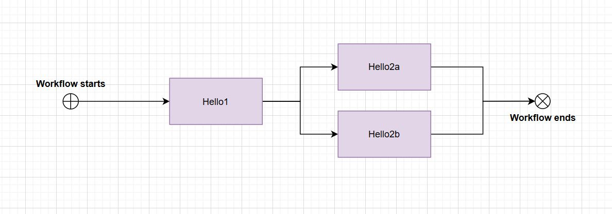
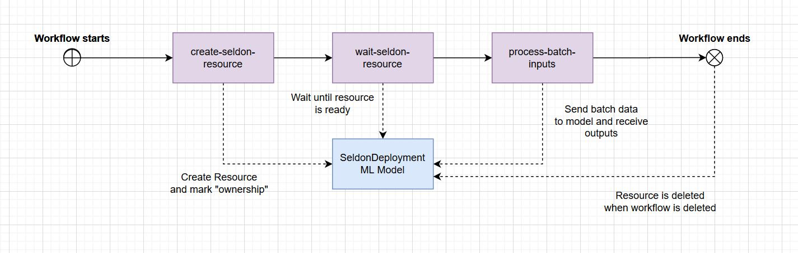
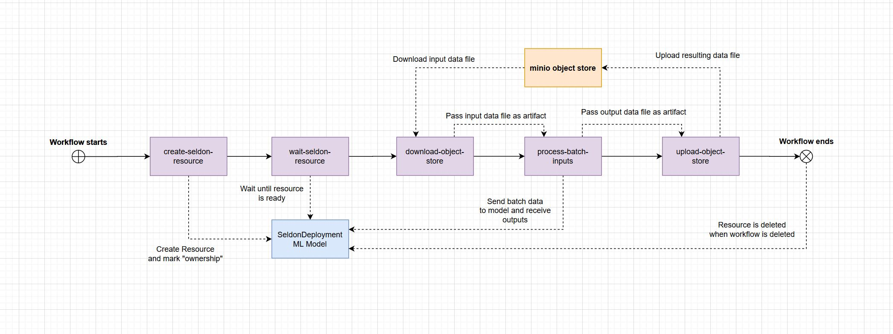

## Batch processing with Argo Worfklows

In this notebook we will dive into how you can run batch processing with Argo Workflows and Seldon Core.

Dependencies:

* Seldon core installed as per the docs with an ingress
* Argo Workfklows installed in cluster (and argo CLI for commands)


## Argo Workflows Example

Let's try an argo workflows example to see intuitively how it works. 

In this case we will trigger a workflow with 3 steps (first one will execute and the other two jobs are dependent on that).

The example below will basically run a workflow in the following order:




```python
mkdir -p assets
```


```python
%%writefile assets/argo-example.yaml
---
apiVersion: argoproj.io/v1alpha1
kind: Workflow
metadata:
  generateName: steps-
spec:
  entrypoint: hello-hello-hello
  # This spec contains two templates: hello-hello-hello and whalesay
  templates:
  - name: hello-hello-hello
    # Instead of just running a container
    # This template has a sequence of steps
    steps:
    - - name: hello1            # hello1 is run before the following steps
        template: whalesay
        arguments:
          parameters:
          - name: message
            value: "hello1"
    - - name: hello2a           # double dash => run after previous step
        template: whalesay
        arguments:
          parameters:
          - name: message
            value: "hello2a"
      - name: hello2b           # single dash => run in parallel with previous step
        template: whalesay
        arguments:
          parameters:
          - name: message
            value: "hello2b"
  # This is the same template as from the previous example
  - name: whalesay
    inputs:
      parameters:
      - name: message
    container:
      image: docker/whalesay
      command: [cowsay]
      args: ["{{inputs.parameters.message}}"]
        
```

    Overwriting assets/argo-example.yaml


```python
!argo submit assets/argo-example.yaml
```

    Name:                steps-9tgj9
    Namespace:           default
    ServiceAccount:      default
    Status:              Pending
    Created:             Fri Apr 17 08:27:14 +0100 (8 hours ago)


```python
!argo list
```

    NAME          STATUS      AGE   DURATION   PRIORITY
    steps-9tgj9   Succeeded   8h    3m         0


```python
output=!argo list | grep steps
WF_NAME=output[0].split()[0]
print(WF_NAME)
```

    steps-9tgj9


```python
!argo get $WF_NAME
```

    Name:                steps-9tgj9
    Namespace:           default
    ServiceAccount:      default
    Status:              Succeeded
    Created:             Fri Apr 17 08:27:14 +0100 (8 hours ago)
    Started:             Fri Apr 17 08:27:14 +0100 (8 hours ago)
    Finished:            Fri Apr 17 08:30:48 +0100 (8 hours ago)
    Duration:            3 minutes 34 seconds
    
    STEP                                PODNAME                 DURATION  MESSAGE
     ✔ steps-9tgj9 (hello-hello-hello)                                    
     ├---✔ hello1 (whalesay)            steps-9tgj9-3240403473  3m        
     └-·-✔ hello2a (whalesay)           steps-9tgj9-3510808138  3s        
       └-✔ hello2b (whalesay)           steps-9tgj9-3494030519  5s        


```python
!argo logs -w $WF_NAME
```

    hello1:	 ________ 
    hello1:	< hello1 >
    hello1:	 -------- 
    hello1:	    \
    hello1:	     \
    hello1:	      \     
    hello1:	                    ##        .            
    hello1:	              ## ## ##       ==            
    hello1:	           ## ## ## ##      ===            
    hello1:	       /""""""""""""""""___/ ===        
    hello1:	  ~~~ {~~ ~~~~ ~~~ ~~~~ ~~ ~ /  ===- ~~~   
    hello1:	       \______ o          __/            
    hello1:	        \    \        __/             
    hello1:	          \____\______/   
    hello2a:	 _________ 
    hello2a:	< hello2a >
    hello2a:	 --------- 
    hello2a:	    \
    hello2a:	     \
    hello2a:	      \     
    hello2a:	                    ##        .            
    hello2a:	              ## ## ##       ==            
    hello2a:	           ## ## ## ##      ===            
    hello2a:	       /""""""""""""""""___/ ===        
    hello2a:	  ~~~ {~~ ~~~~ ~~~ ~~~~ ~~ ~ /  ===- ~~~   
    hello2a:	       \______ o          __/            
    hello2a:	        \    \        __/             
    hello2a:	          \____\______/   
    hello2b:	 _________ 
    hello2b:	< hello2b >
    hello2b:	 --------- 
    hello2b:	    \
    hello2b:	     \
    hello2b:	      \     
    hello2b:	                    ##        .            
    hello2b:	              ## ## ##       ==            
    hello2b:	           ## ## ## ##      ===            
    hello2b:	       /""""""""""""""""___/ ===        
    hello2b:	  ~~~ {~~ ~~~~ ~~~ ~~~~ ~~ ~ /  ===- ~~~   
    hello2b:	       \______ o          __/            
    hello2b:	        \    \        __/             
    hello2b:	          \____\______/   


```python
!argo delete $WF_NAME
```

    Workflow 'steps-9tgj9' deleted


## Seldon Core Batch 
Now we can leverage this functionality by using seldon core batch.

The structure of this job will be the following:



THe file below denotes the structure of the three steps in this workflow:


```python
%%writefile assets/seldon-batch.yaml
---
apiVersion: argoproj.io/v1alpha1
kind: Workflow
metadata:
  generateName: seldon-batch-
spec:
  entrypoint: seldon-batch-process
  templates:
  - name: seldon-batch-process
    steps:
    - - name: create-seldon-resource            
        template: create-seldon-resource-template
    - - name: wait-seldon-resource
        template: wait-seldon-resource-template
    - - name: process-batch-inputs
        template: process-batch-inputs-template
            
  - name: create-seldon-resource-template
    resource:
      action: create
      manifest: |
        apiVersion: machinelearning.seldon.io/v1
        kind: SeldonDeployment
        metadata:
          name: "{{workflow.uid}}"
          ownerReferences:
          - apiVersion: argoproj.io/v1alpha1
            blockOwnerDeletion: true
            kind: Workflow
            name: "{{workflow.name}}"
            uid: "{{workflow.uid}}"
        spec:
          name: "{{workflow.uid}}"
          predictors:
            - graph:
                children: []
                implementation: SKLEARN_SERVER
                modelUri: gs://seldon-models/sklearn/iris
                name: classifier
              name: default
              replicas: 1
                
  - name: wait-seldon-resource-template
    script:
      image: seldonio/core-builder:0.14
      command: [bash]
      source: |
        kubectl rollout status deploy/$(kubectl get deploy -l seldon-deployment-id="{{workflow.uid}}" -o jsonpath='{.items[0].metadata.name}')
        
  - name: process-batch-inputs-template
    script:
      image: seldonio/seldon-core-s2i-python3:1.1.1-SNAPSHOT
      command: [python]
      source: |
        from seldon_core.seldon_client import SeldonClient
        import numpy as np
        import time
        sc = SeldonClient(
            gateway_endpoint="istio-ingressgateway.istio-system.svc.cluster.local",
            deployment_name="{{workflow.uid}}",
            namespace="default")
        for i in range(10):
            data = np.array([[i, i, i, i]])
            output = sc.predict(data=data)
            print(output.response)
            
```

    Overwriting assets/seldon-batch.yaml


```python
!argo submit assets/seldon-batch.yaml
```

    Name:                seldon-batch-wxbr5
    Namespace:           default
    ServiceAccount:      default
    Status:              Pending
    Created:             Sat Apr 18 12:36:57 +0100 (now)


```python
!argo list
```

    NAME                 STATUS      AGE   DURATION   PRIORITY
    seldon-batch-wxbr5   Running     2s    2s         0
    seldon-batch-kslgh   Succeeded   2m    42s        0


```python
output=!argo list | grep seldon-batch
WF_NAME=output[0].split()[0]
print(WF_NAME)
```

    seldon-batch-kslgh


```python
!argo get $WF_NAME
```

    Name:                seldon-batch-wxbr5
    Namespace:           default
    ServiceAccount:      default
    Status:              Running
    Created:             Sat Apr 18 12:36:57 +0100 (3 seconds ago)
    Started:             Sat Apr 18 12:36:57 +0100 (3 seconds ago)
    Duration:            3 seconds
    
    STEP                                                             PODNAME                        DURATION  MESSAGE
     ● seldon-batch-wxbr5 (seldon-batch-process)                                                              
     └---● create-seldon-resource (create-seldon-resource-template)  seldon-batch-wxbr5-2588046603  3s        


```python
!argo logs -w $WF_NAME
```

    create-seldon-resource:	time="2020-04-18T11:36:58Z" level=info msg="Starting Workflow Executor" version=vv2.7.4+50b209c.dirty
    create-seldon-resource:	time="2020-04-18T11:36:58Z" level=info msg="Creating a docker executor"
    create-seldon-resource:	time="2020-04-18T11:36:58Z" level=info msg="Executor (version: vv2.7.4+50b209c.dirty, build_date: 2020-04-16T16:37:57Z) initialized (pod: default/seldon-batch-wxbr5-2588046603) with template:\n{\"name\":\"create-seldon-resource-template\",\"arguments\":{},\"inputs\":{},\"outputs\":{},\"metadata\":{},\"resource\":{\"action\":\"create\",\"manifest\":\"apiVersion: machinelearning.seldon.io/v1\\nkind: SeldonDeployment\\nmetadata:\\n  name: \\\"b83971e5-e0e9-488f-9bd0-4c57dc97c79c\\\"\\n  ownerReferences:\\n  - apiVersion: argoproj.io/v1alpha1\\n    blockOwnerDeletion: true\\n    kind: Workflow\\n    name: \\\"seldon-batch-wxbr5\\\"\\n    uid: \\\"b83971e5-e0e9-488f-9bd0-4c57dc97c79c\\\"\\nspec:\\n  name: \\\"b83971e5-e0e9-488f-9bd0-4c57dc97c79c\\\"\\n  predictors:\\n    - graph:\\n        children: []\\n        implementation: SKLEARN_SERVER\\n        modelUri: gs://seldon-models/sklearn/iris\\n        name: classifier\\n      name: default\\n      replicas: 1\\n\"}}"
    create-seldon-resource:	time="2020-04-18T11:36:58Z" level=info msg="Loading manifest to /tmp/manifest.yaml"
    create-seldon-resource:	time="2020-04-18T11:36:58Z" level=info msg="kubectl create -f /tmp/manifest.yaml -o json"
    create-seldon-resource:	time="2020-04-18T11:36:59Z" level=info msg=default/SeldonDeployment.machinelearning.seldon.io/b83971e5-e0e9-488f-9bd0-4c57dc97c79c
    create-seldon-resource:	time="2020-04-18T11:36:59Z" level=info msg="No output parameters"
    wait-seldon-resource:	Waiting for deployment "b83971e5-e0e9-488f-9bd0-4c57dc97c79c-default-0-classifier" rollout to finish: 0 of 1 updated replicas are available...
    wait-seldon-resource:	deployment "b83971e5-e0e9-488f-9bd0-4c57dc97c79c-default-0-classifier" successfully rolled out
    process-batch-inputs:	{'data': {'names': ['t:0', 't:1', 't:2'], 'tensor': {'shape': [1, 3], 'values': [0.3664487684438811, 0.48528762951761806, 0.14826360203850078]}}, 'meta': {}}
    process-batch-inputs:	{'data': {'names': ['t:0', 't:1', 't:2'], 'tensor': {'shape': [1, 3], 'values': [0.2075509473561692, 0.2443463805811625, 0.5481026720626684]}}, 'meta': {}}
    process-batch-inputs:	{'data': {'names': ['t:0', 't:1', 't:2'], 'tensor': {'shape': [1, 3], 'values': [0.06995304386311439, 0.04864300564562103, 0.8814039504912645]}}, 'meta': {}}
    process-batch-inputs:	{'data': {'names': ['t:0', 't:1', 't:2'], 'tensor': {'shape': [1, 3], 'values': [0.01859472366015777, 0.006956450489196832, 0.9744488258506454]}}, 'meta': {}}
    process-batch-inputs:	{'data': {'names': ['t:0', 't:1', 't:2'], 'tensor': {'shape': [1, 3], 'values': [0.004653433216061866, 0.0009398331072469446, 0.9944067336766912]}}, 'meta': {}}
    process-batch-inputs:	{'data': {'names': ['t:0', 't:1', 't:2'], 'tensor': {'shape': [1, 3], 'values': [0.0011463235173706913, 0.0001256712307515923, 0.9987280052518777]}}, 'meta': {}}
    process-batch-inputs:	{'data': {'names': ['t:0', 't:1', 't:2'], 'tensor': {'shape': [1, 3], 'values': [0.0002812079399700444, 1.6767055911301234e-05, 0.9997020250041186]}}, 'meta': {}}
    process-batch-inputs:	{'data': {'names': ['t:0', 't:1', 't:2'], 'tensor': {'shape': [1, 3], 'values': [6.890870086562858e-05, 2.235872103887171e-06, 0.9999288554270304]}}, 'meta': {}}
    process-batch-inputs:	{'data': {'names': ['t:0', 't:1', 't:2'], 'tensor': {'shape': [1, 3], 'values': [1.6881012306246608e-05, 2.981118341014688e-07, 0.9999828208758597]}}, 'meta': {}}
    process-batch-inputs:	{'data': {'names': ['t:0', 't:1', 't:2'], 'tensor': {'shape': [1, 3], 'values': [4.135155685795574e-06, 3.974630518304911e-08, 0.9999958250980091]}}, 'meta': {}}


```python
outputs = !(argo logs -w $WF_NAME --no-color | grep "process-batch-inputs" | cut -c 23-)
for o in outputs:
    print(o)
```

    {'data': {'names': ['t:0', 't:1', 't:2'], 'tensor': {'shape': [1, 3], 'values': [0.3664487684438811, 0.48528762951761806, 0.14826360203850078]}}, 'meta': {}}
    {'data': {'names': ['t:0', 't:1', 't:2'], 'tensor': {'shape': [1, 3], 'values': [0.2075509473561692, 0.2443463805811625, 0.5481026720626684]}}, 'meta': {}}
    {'data': {'names': ['t:0', 't:1', 't:2'], 'tensor': {'shape': [1, 3], 'values': [0.06995304386311439, 0.04864300564562103, 0.8814039504912645]}}, 'meta': {}}
    {'data': {'names': ['t:0', 't:1', 't:2'], 'tensor': {'shape': [1, 3], 'values': [0.01859472366015777, 0.006956450489196832, 0.9744488258506454]}}, 'meta': {}}
    {'data': {'names': ['t:0', 't:1', 't:2'], 'tensor': {'shape': [1, 3], 'values': [0.004653433216061866, 0.0009398331072469446, 0.9944067336766912]}}, 'meta': {}}
    {'data': {'names': ['t:0', 't:1', 't:2'], 'tensor': {'shape': [1, 3], 'values': [0.0011463235173706913, 0.0001256712307515923, 0.9987280052518777]}}, 'meta': {}}
    {'data': {'names': ['t:0', 't:1', 't:2'], 'tensor': {'shape': [1, 3], 'values': [0.0002812079399700444, 1.6767055911301234e-05, 0.9997020250041186]}}, 'meta': {}}
    {'data': {'names': ['t:0', 't:1', 't:2'], 'tensor': {'shape': [1, 3], 'values': [6.890870086562858e-05, 2.235872103887171e-06, 0.9999288554270304]}}, 'meta': {}}
    {'data': {'names': ['t:0', 't:1', 't:2'], 'tensor': {'shape': [1, 3], 'values': [1.6881012306246608e-05, 2.981118341014688e-07, 0.9999828208758597]}}, 'meta': {}}
    {'data': {'names': ['t:0', 't:1', 't:2'], 'tensor': {'shape': [1, 3], 'values': [4.135155685795574e-06, 3.974630518304911e-08, 0.9999958250980091]}}, 'meta': {}}


```python
!argo delete $WF_NAME
```

    Workflow 'seldon-batch-kslgh' deleted


## Seldon Core Batch with Object Store

In some cases we may want to read the data from an object source.

In this case we will show how you can read from an object store, in this case minio.

The workflow will look as follows:



For this we will assume you have installed the Minio (mc) CLI - we will use a Minio client in the cluster but you can use another object store provider like S3, Google Cloud, Azure, etc.

### Set up Minio in your cluster


```bash
%%bash 
helm install minio stable/minio \
    --set accessKey=minioadmin \
    --set secretKey=minioadmin \
    --set image.tag=RELEASE.2020-04-15T19-42-18Z
```

    NAME: minio
    LAST DEPLOYED: Thu Apr 30 10:57:00 2020
    NAMESPACE: default
    STATUS: deployed
    REVISION: 1
    TEST SUITE: None
    NOTES:
    Minio can be accessed via port 9000 on the following DNS name from within your cluster:
    minio.default.svc.cluster.local
    
    To access Minio from localhost, run the below commands:
    
      1. export POD_NAME=$(kubectl get pods --namespace default -l "release=minio" -o jsonpath="{.items[0].metadata.name}")
    
      2. kubectl port-forward $POD_NAME 9000 --namespace default
    
    Read more about port forwarding here: http://kubernetes.io/docs/user-guide/kubectl/kubectl_port-forward/
    
    You can now access Minio server on http://localhost:9000. Follow the below steps to connect to Minio server with mc client:
    
      1. Download the Minio mc client - https://docs.minio.io/docs/minio-client-quickstart-guide
    
      2. mc config host add minio-local http://localhost:9000 minioadmin minioadmin S3v4
    
      3. mc ls minio-local
    
    Alternately, you can use your browser or the Minio SDK to access the server - https://docs.minio.io/categories/17


### Forward the Minio port so you can access it

You can do this by runnning the following command in your terminal:
```
kubectl port-forward svc/minio 9000:9000
    ```
    
### Configure local minio client


```python
!mc config host add minio-local http://localhost:9000 minioadmin minioadmin
```

    Added `minio-local` successfully.
    

### Create some input for our model

We will create a file that will contain the inputs that will be sent to our model


```python
with open("assets/input-data.txt", "w") as f:
    for i in range(10000):
        f.write('{"data":{"ndarray":[[1, 2, 3, 4]]}, "meta": { "puid": "' + str(i) + '"}}\n')
```

### Check the contents of the file


```python
!wc -l assets/input-data.txt
!head assets/input-data.txt
```

    10000 assets/input-data.txt
    {"data":{"ndarray":[[1, 2, 3, 4]]}, "meta": { "puid": "0"}}
    {"data":{"ndarray":[[1, 2, 3, 4]]}, "meta": { "puid": "1"}}
    {"data":{"ndarray":[[1, 2, 3, 4]]}, "meta": { "puid": "2"}}
    {"data":{"ndarray":[[1, 2, 3, 4]]}, "meta": { "puid": "3"}}
    {"data":{"ndarray":[[1, 2, 3, 4]]}, "meta": { "puid": "4"}}
    {"data":{"ndarray":[[1, 2, 3, 4]]}, "meta": { "puid": "5"}}
    {"data":{"ndarray":[[1, 2, 3, 4]]}, "meta": { "puid": "6"}}
    {"data":{"ndarray":[[1, 2, 3, 4]]}, "meta": { "puid": "7"}}
    {"data":{"ndarray":[[1, 2, 3, 4]]}, "meta": { "puid": "8"}}
    {"data":{"ndarray":[[1, 2, 3, 4]]}, "meta": { "puid": "9"}}


### Upload the file to our minio


```python
!mc mb minio-local/data
!mc cp assets/input-data.txt minio-local/data/
```

    Bucket created successfully `minio-local/data`.
    ...-data.txt:  614.15 KiB / 614.15 KiB ┃▓▓▓▓▓▓▓▓▓▓▓▓▓▓▓▓▓▓▓▓▓▓▓▓▓┃ 9.74 MiB/s 0s

### Create Job to Execute


```python
%%writefile assets/seldon-batch-store.yaml
---
apiVersion: argoproj.io/v1alpha1
kind: Workflow
metadata:
  generateName: seldon-batch-object-store-
spec:
  entrypoint: seldon-batch-process
  templates:
  - name: seldon-batch-process
    steps:
    - - name: create-seldon-resource            
        template: create-seldon-resource-template
    - - name: wait-seldon-resource
        template: wait-seldon-resource-template
    - - name: download-object-store
        template: download-object-store-template
    - - name: process-batch-inputs
        template: process-batch-inputs-template
        arguments:
          artifacts:
          - name: input-data
            from: "{{steps.download-object-store.outputs.artifacts.input-data}}"
    - - name: upload-object-store
        template: upload-object-store-template
        arguments:
          artifacts:
          - name: output-data
            from: "{{steps.process-batch-inputs.outputs.artifacts.output-data}}"
            
  - name: create-seldon-resource-template
    resource:
      action: create
      manifest: |
        apiVersion: machinelearning.seldon.io/v1
        kind: SeldonDeployment
        metadata:
          name: "sklearn-{{workflow.uid}}"
          ownerReferences:
          - apiVersion: argoproj.io/v1alpha1
            blockOwnerDeletion: true
            kind: Workflow
            name: "{{workflow.name}}"
            uid: "{{workflow.uid}}"
        spec:
          name: "sklearn-{{workflow.uid}}"
          predictors:
            - graph:
                children: []
                implementation: SKLEARN_SERVER
                modelUri: gs://seldon-models/sklearn/iris
                name: classifier
              name: default
              replicas: 10
                
  - name: wait-seldon-resource-template
    script:
      image: seldonio/core-builder:0.14
      command: [bash]
      source: |
        sleep 3
        kubectl rollout status \
            deploy/$(kubectl get deploy \
                     -l seldon-deployment-id="sklearn-{{workflow.uid}}" \
                     -o jsonpath='{.items[0].metadata.name}')
                     
  - name: download-object-store-template
    script:
      image: minio/mc:RELEASE.2020-04-17T08-55-48Z
      command: [sh]
      source: |
        mc config host add minio-local http://minio.default.svc.cluster.local:9000 minioadmin minioadmin
        mc cp minio-local/data/input-data.txt /assets/input-data.txt
    outputs:
      artifacts:
      - name: input-data
        path: /assets/input-data.txt
            
  - name: process-batch-inputs-template
    inputs:
      artifacts:
      - name: input-data
        path: /assets/input-data.txt
    outputs:
      artifacts:
      - name: output-data
        path: /assets/output-data.txt
    script:
      image: seldonio/seldon-core-s2i-python37:1.1.1-SNAPSHOT
      command: [bash]
      source: |
        seldon-batch-processor \
            --deployment-name "sklearn-{{workflow.uid}}" \
            --namespace "default" \
            --endpoint "istio-ingressgateway.istio-system.svc.cluster.local" \
            --parallelism "100" \
            --retries "10" \
            --input-data-path "/assets/input-data.txt" \
            --output-data-path /assets/output-data.txt
      
  - name: upload-object-store-template
    inputs:
      artifacts:
      - name: output-data
        path: /assets/output-data.txt
    script:
      image: minio/mc:RELEASE.2020-04-17T08-55-48Z
      command: [sh]
      source: |
        mc config host add minio-local http://minio.default.svc.cluster.local:9000 minioadmin minioadmin
        mc cp /assets/output-data.txt minio-local/data/output-data-{{workflow.name}}.txt
        
```

    Overwriting assets/seldon-batch-store.yaml


### Configure bucket for Argo Artefact passing


```python
%%writefile assets/argo-config.yaml
---
apiVersion: v1
kind: ConfigMap
metadata:
  name: workflow-controller-configmap
data:
  config: |
    artifactRepository:
      s3:
        bucket: argo-artifacts
        endpoint: minio.default.svc.cluster.local:9000
        insecure: true
        accessKeySecret:
          name: minio
          key: accesskey
        secretKeySecret:
          name: minio
          key: secretkey
```

    Overwriting assets/argo-config.yaml


### Make sure the configmap is in the same location as your argo controller


```python
!kubectl apply -n argo -f assets/argo-config.yaml
```

    configmap/workflow-controller-configmap unchanged


### Create the bucket for artifact passing


```python
!mc mb minio-local/argo-artifacts
```

    mc: <ERROR> Unable to make bucket `minio-local/argo-artifacts`. Your previous request to create the named bucket succeeded and you already own it.
    

### Create Argo Workflow


```python
!argo submit assets/seldon-batch-store.yaml
```

    Name:                seldon-batch-object-store-h69hp
    Namespace:           default
    ServiceAccount:      default
    Status:              Pending
    Created:             Thu Apr 30 10:58:25 +0100 (now)


```python
!argo list
```

    NAME                              STATUS    AGE   DURATION   PRIORITY
    seldon-batch-object-store-h69hp   Running   2s    2s         0


```python
output=!argo list | grep seldon-batch
WF_NAME=output[0].split()[0]
print(WF_NAME)
```

    seldon-batch-object-store-h69hp


```python
!argo get $WF_NAME
```

    Name:                seldon-batch-object-store-h69hp
    Namespace:           default
    ServiceAccount:      default
    Status:              Running
    Created:             Thu Apr 30 10:58:25 +0100 (46 seconds ago)
    Started:             Thu Apr 30 10:58:25 +0100 (46 seconds ago)
    Duration:            46 seconds
    
    STEP                                                             PODNAME                                     DURATION  MESSAGE
     ● seldon-batch-object-store-h69hp (seldon-batch-process)                                                              
     ├---✔ create-seldon-resource (create-seldon-resource-template)  seldon-batch-object-store-h69hp-314939370   1s        
     ├---✔ wait-seldon-resource (wait-seldon-resource-template)      seldon-batch-object-store-h69hp-2783451180  28s       
     └---● download-object-store (download-object-store-template)    seldon-batch-object-store-h69hp-1252821251  14s       


```python
!argo logs -w $WF_NAME
```

    create-seldon-resource:	time="2020-04-30T09:58:25Z" level=info msg="Starting Workflow Executor" version=vv2.7.4+50b209c.dirty
    create-seldon-resource:	time="2020-04-30T09:58:25Z" level=info msg="Creating a docker executor"
    create-seldon-resource:	time="2020-04-30T09:58:25Z" level=info msg="Executor (version: vv2.7.4+50b209c.dirty, build_date: 2020-04-16T16:37:57Z) initialized (pod: default/seldon-batch-object-store-h69hp-314939370) with template:\n{\"name\":\"create-seldon-resource-template\",\"arguments\":{},\"inputs\":{},\"outputs\":{},\"metadata\":{},\"resource\":{\"action\":\"create\",\"manifest\":\"apiVersion: machinelearning.seldon.io/v1\\nkind: SeldonDeployment\\nmetadata:\\n  name: \\\"sklearn-7b369f59-10b8-4f90-80b1-9360adc81ea8\\\"\\n  ownerReferences:\\n  - apiVersion: argoproj.io/v1alpha1\\n    blockOwnerDeletion: true\\n    kind: Workflow\\n    name: \\\"seldon-batch-object-store-h69hp\\\"\\n    uid: \\\"7b369f59-10b8-4f90-80b1-9360adc81ea8\\\"\\nspec:\\n  name: \\\"sklearn-7b369f59-10b8-4f90-80b1-9360adc81ea8\\\"\\n  predictors:\\n    - graph:\\n        children: []\\n        implementation: SKLEARN_SERVER\\n        modelUri: gs://seldon-models/sklearn/iris\\n        name: classifier\\n      name: default\\n      replicas: 10\\n        \\n\"}}"
    create-seldon-resource:	time="2020-04-30T09:58:25Z" level=info msg="Loading manifest to /tmp/manifest.yaml"
    create-seldon-resource:	time="2020-04-30T09:58:25Z" level=info msg="kubectl create -f /tmp/manifest.yaml -o json"
    create-seldon-resource:	time="2020-04-30T09:58:26Z" level=info msg=default/SeldonDeployment.machinelearning.seldon.io/sklearn-7b369f59-10b8-4f90-80b1-9360adc81ea8
    create-seldon-resource:	time="2020-04-30T09:58:26Z" level=info msg="No output parameters"
    wait-seldon-resource:	Waiting for deployment "seldon-d4e62214cd9033ac8c6b14fc997a7b4e" rollout to finish: 0 of 10 updated replicas are available...
    wait-seldon-resource:	Waiting for deployment "seldon-d4e62214cd9033ac8c6b14fc997a7b4e" rollout to finish: 1 of 10 updated replicas are available...
    wait-seldon-resource:	Waiting for deployment "seldon-d4e62214cd9033ac8c6b14fc997a7b4e" rollout to finish: 2 of 10 updated replicas are available...
    wait-seldon-resource:	Waiting for deployment "seldon-d4e62214cd9033ac8c6b14fc997a7b4e" rollout to finish: 3 of 10 updated replicas are available...
    wait-seldon-resource:	Waiting for deployment "seldon-d4e62214cd9033ac8c6b14fc997a7b4e" rollout to finish: 4 of 10 updated replicas are available...
    wait-seldon-resource:	Waiting for deployment "seldon-d4e62214cd9033ac8c6b14fc997a7b4e" rollout to finish: 5 of 10 updated replicas are available...
    wait-seldon-resource:	Waiting for deployment "seldon-d4e62214cd9033ac8c6b14fc997a7b4e" rollout to finish: 6 of 10 updated replicas are available...
    wait-seldon-resource:	Waiting for deployment "seldon-d4e62214cd9033ac8c6b14fc997a7b4e" rollout to finish: 7 of 10 updated replicas are available...
    wait-seldon-resource:	Waiting for deployment "seldon-d4e62214cd9033ac8c6b14fc997a7b4e" rollout to finish: 8 of 10 updated replicas are available...
    wait-seldon-resource:	Waiting for deployment "seldon-d4e62214cd9033ac8c6b14fc997a7b4e" rollout to finish: 9 of 10 updated replicas are available...
    wait-seldon-resource:	deployment "seldon-d4e62214cd9033ac8c6b14fc997a7b4e" successfully rolled out
    download-object-store:	Added `minio-local` successfully.
    download-object-store:	`minio-local/data/input-data.txt` -> `/assets/input-data.txt`
    download-object-store:	Total: 0 B, Transferred: 614.15 KiB, Speed: 40.21 MiB/s


## Check output in object store

We can now visualise the output that we obtained in the object store.

First we can check that the file is present:


```python
!mc ls minio-local/data/output-data-"$WF_NAME".txt
```

    [2020-04-30 10:49:07 BST]  1.2MiB output-data-seldon-batch-object-store-dxf5d.txt
    

Now we can output the contents of the file created using the `mc head` command.


```python
!mc cp minio-local/data/output-data-"$WF_NAME".txt assets/output-data.txt
!head assets/output-data.txt
```

    ...dxf5d.txt:  1.19 MiB / 1.19 MiB ┃▓▓▓▓▓▓▓▓▓▓▓▓▓▓▓▓▓▓▓▓▓▓▓▓▓▓▓▓┃ 24.49 MiB/s 0s{"data":{"names":["t:0","t:1","t:2"],"ndarray":[[0.0006985194531162841,0.003668039039435755,0.9956334415074478]]},"meta":{}}
    {"data":{"names":["t:0","t:1","t:2"],"ndarray":[[0.0006985194531162841,0.003668039039435755,0.9956334415074478]]},"meta":{}}
    {"data":{"names":["t:0","t:1","t:2"],"ndarray":[[0.0006985194531162841,0.003668039039435755,0.9956334415074478]]},"meta":{}}
    {"data":{"names":["t:0","t:1","t:2"],"ndarray":[[0.0006985194531162841,0.003668039039435755,0.9956334415074478]]},"meta":{}}
    {"data":{"names":["t:0","t:1","t:2"],"ndarray":[[0.0006985194531162841,0.003668039039435755,0.9956334415074478]]},"meta":{}}
    {"data":{"names":["t:0","t:1","t:2"],"ndarray":[[0.0006985194531162841,0.003668039039435755,0.9956334415074478]]},"meta":{}}
    {"data":{"names":["t:0","t:1","t:2"],"ndarray":[[0.0006985194531162841,0.003668039039435755,0.9956334415074478]]},"meta":{}}
    {"data":{"names":["t:0","t:1","t:2"],"ndarray":[[0.0006985194531162841,0.003668039039435755,0.9956334415074478]]},"meta":{}}
    {"data":{"names":["t:0","t:1","t:2"],"ndarray":[[0.0006985194531162841,0.003668039039435755,0.9956334415074478]]},"meta":{}}
    {"data":{"names":["t:0","t:1","t:2"],"ndarray":[[0.0006985194531162841,0.003668039039435755,0.9956334415074478]]},"meta":{}}


```python
!argo delete $WF_NAME
```

    Workflow 'seldon-batch-object-store-dxf5d' deleted


```python

```
