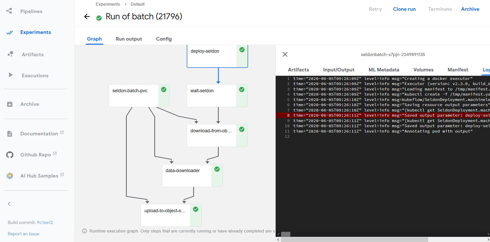
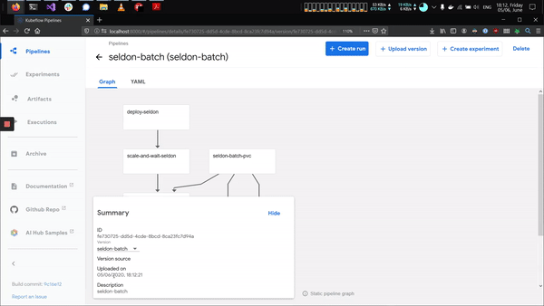

# Batch processing with Kubeflow Pipelines
In this notebook we will dive into how you can run batch processing with Kubeflow Pipelines and Seldon Core.

Dependencies:
* Seldon core installed as per the docs with [Istio Ingress](https://docs.seldon.io/projects/seldon-core/en/latest/workflow/install.html#install-seldon-core-with-helm)
* Kubeflow Pipelines installed (installation instructions in this notebook)



### Kubeflow Pipelines Setup

Setup the pipeline in your current cluster:


```bash
%%bash
export PIPELINE_VERSION=0.5.1
kubectl apply -k github.com/kubeflow/pipelines/manifests/kustomize/cluster-scoped-resources?ref=$PIPELINE_VERSION
kubectl wait --for condition=established --timeout=60s crd/applications.app.k8s.io
kubectl apply -k github.com/kubeflow/pipelines/manifests/kustomize/env/dev?ref=$PIPELINE_VERSION
```

We also install the Python Library so we can create our pipeline:


```python
pip install kfp==0.5.1
```

### Add Batch Data

In order to run our batch job we will need to create some batch data that can be used to process.

This batch dataset will be pushed to a minio instance so it can be downloaded from Minio (which we need to install first)

#### Install Minio


```bash
%%bash 
helm install minio stable/minio \
    --set accessKey=minioadmin \
    --set secretKey=minioadmin \
    --set image.tag=RELEASE.2020-04-15T19-42-18Z
```

#### Forward the Minio port so you can access it

You can do this by runnning the following command in your terminal:
```
kubectl port-forward svc/minio 9000:9000
    ```
    
#### Configure local minio client


```python
!mc config host add minio-local http://localhost:9000 minioadmin minioadmin
```

#### Create some input for our model

We will create a file that will contain the inputs that will be sent to our model


```python
with open("assets/input-data.txt", "w") as f:
    for i in range(10000):
        f.write('[[1, 2, 3, 4]]\n')
```

Check the contents of the file


```python
!wc -l assets/input-data.txt
!head assets/input-data.txt
```

    10000 assets/input-data.txt
    [[1, 2, 3, 4]]
    [[1, 2, 3, 4]]
    [[1, 2, 3, 4]]
    [[1, 2, 3, 4]]
    [[1, 2, 3, 4]]
    [[1, 2, 3, 4]]
    [[1, 2, 3, 4]]
    [[1, 2, 3, 4]]
    [[1, 2, 3, 4]]
    [[1, 2, 3, 4]]


#### Upload the file to our minio


```python
!mc mb minio-local/data
!mc cp assets/input-data.txt minio-local/data/
```

### Create Kubeflow Pipeline

We are now able to create a kubeflow pipeline that will allow us to enter the batch parameters through the UI.

We will also be able to add extra steps that will download the data from a Minio client.


```python
mkdir -p assets/
```

We use the pipeline syntax to create the kubeflow pipeline, as outlined below:


```python
%%writefile assets/seldon-batch-pipeline.py

import kfp.dsl as dsl
import yaml
from kubernetes import client as k8s

@dsl.pipeline(
  name='SeldonBatch',
  description='A batch processing pipeline for seldon models'
)
def nlp_pipeline(
        namespace="kubeflow",
        seldon_server="SKLEARN_SERVER",
        model_path="gs://seldon-models/v1.11.0-dev/sklearn/iris",
        gateway_endpoint="istio-ingressgateway.istio-system.svc.cluster.local",
        retries=3,
        replicas=10,
        workers=100,
        input_path="data/input-data.txt",
        output_path="data/output-data.txt"):
    """
    Pipeline 
    """
    
    vop = dsl.VolumeOp(
      name='seldon-batch-pvc',
      resource_name="seldon-batch-pvc",
      modes=dsl.VOLUME_MODE_RWO,
      size="2Mi"
    )
    
    seldon_deployment_yaml = f"""
apiVersion: machinelearning.seldon.io/v1
kind: SeldonDeployment
metadata:
  name: "{{{{workflow.name}}}}"
  namespace: "{namespace}"
spec:
  name: "{{{{workflow.name}}}}"
  predictors:
  - graph:
      children: []
      implementation: "{seldon_server}"
      modelUri: "{model_path}"
      name: classifier
    name: default
    """
    
    deploy_step = dsl.ResourceOp(
        name="deploy_seldon",
        action="create",
        k8s_resource=yaml.safe_load(seldon_deployment_yaml))
    
    scale_and_wait = dsl.ContainerOp(
        name="scale_and_wait_seldon",
        image="bitnami/kubectl:1.17",
        command="bash",
        arguments=[
            "-c",
            f"sleep 10 && kubectl scale --namespace {namespace} --replicas={replicas} sdep/{{{{workflow.name}}}} && sleep 2 && kubectl rollout status deploy/$(kubectl get deploy -l seldon-deployment-id={{{{workflow.name}}}} -o jsonpath='{{.items[0].metadata.name'}})"   
        ])
    
    download_from_object_store = dsl.ContainerOp(
        name="download-from-object-store",
        image="minio/mc:RELEASE.2020-04-17T08-55-48Z",
        command="sh",
        arguments=[
            "-c",
            f"mc config host add minio-local http://minio.default.svc.cluster.local:9000 minioadmin minioadmin && mc cp minio-local/{input_path} /assets/input-data.txt"   
        ],
        pvolumes={ "/assets": vop.volume })
    

    batch_process_step = dsl.ContainerOp(
        name='data_downloader',
        image='seldonio/seldon-core-s2i-python37:1.2.3-dev',        command="seldon-batch-processor",
        arguments=[
            "--deployment-name", "{{workflow.name}}",
            "--namespace", namespace,
            "--host", gateway_endpoint,
            "--retries", retries,
            "--input-data-path", "/assets/input-data.txt",
            "--output-data-path", "/assets/output-data.txt",
            "--benchmark"
        ],
        pvolumes={ "/assets": vop.volume }
    )
    
    upload_to_object_store = dsl.ContainerOp(
        name="upload-to-object-store",
        image="minio/mc:RELEASE.2020-04-17T08-55-48Z",
        command="sh",
        arguments=[
            "-c",
            f"mc config host add minio-local http://minio.default.svc.cluster.local:9000 minioadmin minioadmin && mc cp /assets/output-data.txt minio-local/{output_path}"   
        ],
        pvolumes={ "/assets": vop.volume })
    
    delete_step = dsl.ResourceOp(
        name="delete_seldon",
        action="delete",
        k8s_resource=yaml.safe_load(seldon_deployment_yaml))
    
    scale_and_wait.after(deploy_step)
    download_from_object_store.after(scale_and_wait)
    batch_process_step.after(download_from_object_store)
    upload_to_object_store.after(batch_process_step)
    delete_step.after(upload_to_object_store)

if __name__ == '__main__':
  import kfp.compiler as compiler
  compiler.Compiler().compile(nlp_pipeline, __file__ + '.tar.gz')

```

    Overwriting assets/seldon-batch-pipeline.py


### Trigger the creation 
We will run the python file which triggers the creation of the pipeline that we can the upload on the UI:


```python
!python assets/seldon-batch-pipeline.py
```

    /home/alejandro/miniconda3/lib/python3.7/site-packages/kfp/components/_data_passing.py:168: UserWarning: Missing type name was inferred as "Integer" based on the value "3".
      warnings.warn('Missing type name was inferred as "{}" based on the value "{}".'.format(type_name, str(value)))
    /home/alejandro/miniconda3/lib/python3.7/site-packages/kfp/components/_data_passing.py:168: UserWarning: Missing type name was inferred as "Integer" based on the value "10".
      warnings.warn('Missing type name was inferred as "{}" based on the value "{}".'.format(type_name, str(value)))
    /home/alejandro/miniconda3/lib/python3.7/site-packages/kfp/components/_data_passing.py:168: UserWarning: Missing type name was inferred as "Integer" based on the value "100".
      warnings.warn('Missing type name was inferred as "{}" based on the value "{}".'.format(type_name, str(value)))


Check the pipeline has been created:


```python
!ls assets/
```

    input-data.txt		  seldon-batch-pipeline.py.tar.gz
    kubeflow-pipeline.jpg	  seldon-kubeflow-batch.gif
    seldon-batch-pipeline.py


### Open the Kubeflow Pipelines UI

We can now open the UI by port forwarding the UI with the following command:
    
```
kubectl port-forward svc/ml-pipeline-ui -n kubeflow 8000:80
```

And we can open it locally in our browser via [http://localhost:8000](http://localhost:8000)

Now we can follow the standard steps to create and deploy the kubeflow pipline




```python

```
