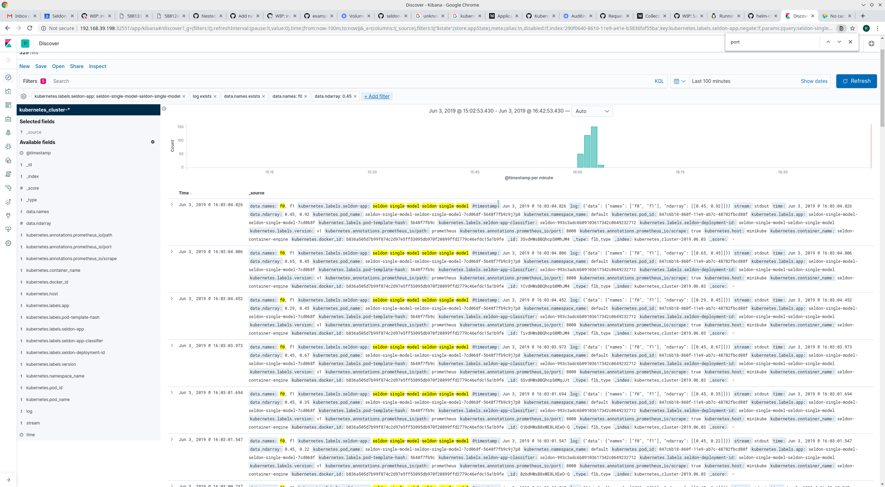

# Centralised and Request Logging Example

Centralized logging means pulling pod logs and bringing together in a single place - elasticsearch.

Request logging means also logging the http requests and responses in elasticsearch.

## Introduction

Here we will set up EFK (elasticsearch, fluentd/fluentbit, kibana) as a stack to gather logs from SeldonDeployments and make them searchable.

This demo is aimed at KIND but can also work with a cloud provider. Uses helm v3.

Either run through step-by-step or use full-kind-setup.sh.

## Setup Elastic Stack - KIND

Start cluster

```
kind create cluster --config ./kind_config.yaml --image kindest/node:v1.17.5@sha256:ab3f9e6ec5ad8840eeb1f76c89bb7948c77bbf76bcebe1a8b59790b8ae9a283a
```

Setup the namespace and KIND config for using volumes:

```
kubectl create namespace seldon-logs
kubectl apply -f https://raw.githubusercontent.com/rancher/local-path-provisioner/master/deploy/local-path-storage.yaml
```

Install elastic stack:

```
mkdir -p tempresources
cp values-opendistro-kind.yaml ./tempresources
cp fluentd-values.yaml ./tempresources
cd tempresources
git clone https://github.com/opendistro-for-elasticsearch/opendistro-build
cd opendistro-build/helm/opendistro-es/
git fetch --all --tags
git checkout tags/v1.12.0
helm package .
helm upgrade --install elasticsearch opendistro-es-1.12.0.tgz --namespace=seldon-logs --values=../../../values-opendistro-kind.yaml
helm upgrade --install fluentd fluentd-elasticsearch --version 9.6.2 --namespace=seldon-logs --values=../../../fluentd-values.yaml --repo https://kiwigrid.github.io
kubectl rollout status -n seldon-logs deployment/elasticsearch-opendistro-es-kibana
cd ../../../../
kubectl apply -f kibana-virtualservice.yaml
```


## Setting Up Model

First we need seldon and a seldon deployment.

Install seldon operator:

```
kubectl create namespace seldon-system

helm install seldon-core ../../helm-charts/seldon-core-operator/ --namespace seldon-system
```

Check that it now recognises the seldon CRD by running `kubectl get sdep`.

Now a model:

```
helm install seldon-single-model \
  ../../helm-charts/seldon-single-model/ \
  --set 'model.image=seldonio/mock_classifier_rest:1.3' \
  --set model.logger.enabled=true \
  --set model.logger.url="http://broker-ingress.knative-eventing.svc.cluster.local/seldon-logs/default"
```

## Setting up Request Logging

The approach is:

1 Configure a seldon deployment to send the requests and responses of the HTTP traffic into a knative broker.
2 The broker sends these to a knative service for logging, called seldon-request-logger
3 seldon-request-logger processes and sends to elasticsearch

The seldon-request-logger enriches the raw message to optimise for searching.

Run `kubectl apply -f seldon-request-logger.yaml`


Create broker:

```
kubectl create -f - <<EOF
apiVersion: eventing.knative.dev/v1
kind: Broker
metadata:
  name: default
  namespace: seldon-logs
EOF

sleep 6
broker=$(kubectl -n seldon-logs get broker default -o jsonpath='{.metadata.name}')
if [ $broker == 'default' ]; then
  echo "knative broker created"
else
  echo "knative broker not created"
  exit 1
fi
```

The broker should be created.

Note that when we installed the seldon model earlier we told it to log to a broker in the seldon-logs namespace.

And trigger:

```
kubectl apply -f ./trigger.yaml
```

## Generating Logging

And the loadtester (first line is only needed for KIND):

```
kubectl label nodes kind-worker role=locust --overwrite
kubectl label nodes $(kubectl get nodes -o jsonpath='{.items[0].metadata.name}') role=locust --overwrite

helm install seldon-core-loadtesting ../../helm-charts/seldon-core-loadtesting/ --set locust.host=http://seldon-single-model-default:8000 --set oauth.enabled=false --set oauth.key=oauth-key --set oauth.secret=oauth-secret --set locust.hatchRate=1 --set locust.clients=1 --set loadtest.sendFeedback=0 --set locust.minWait=1000 --set locust.maxWait=1000 --set replicaCount=1
```

## Inspecting Logging and Search for Requests

Access kibana with a port-forward to `localhost:8080/kibana/`:
```
kubectl port-forward -n istio-system svc/istio-ingressgateway 8080:80
```

When Kibana appears for the first time there will be a brief animation while it initializes.
Login in with `admin/admin`.
On the Welcome page click Explore on my own.
From the top-left menu under `Kibana` select the `Discover` item.
In the form field Index pattern enter *
It should read "Success!" and Click the `> Next` step button on the right.
In the next form select timestamp from the dropdown labeled `Time Filter` field name.
From the bottom-right of the form select `Create index pattern`.
In a moment a list of fields will appear.
From the top-left or the home screen's `Visualize and Explore Data` panel, select the `Discover` item.
The log list will appear.
Refine the list a bit by selecting `log` near the bottom the left-hand Selected fields list.
When you hover over or click on the word `log`, click the `Add` button to the right of the label.
You can create a filter using the `Add Filter` button under `Search`. The field can be `kubernetes.labels.seldon-app` and the value can be an 'is' match on `seldon-single-model-default`.

To add mappings, go to `Management` at the bottom-left and then `Index Patterns`. Hit `Refresh` on the index created earlier. The number of fields should increase.

Now we can go back and add further filters if we want.

Adding a filter for `Ce-Inferenceservicename` exists will restrict to just request-response pairs.




## Credits

Loosely based on https://www.katacoda.com/javajon/courses/kubernetes-observability/efk
Fluentd filtering based on https://blog.ptrk.io/tweaking-an-efk-stack-on-kubernetes/
