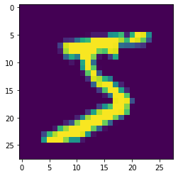

# Image Classifier

Implementation of an image classifier model, based in [PyTorch's MNIST example](https://github.com/pytorch/examples/blob/master/mnist/main.py).

## Training

First we will train a machine learning model, which will help us classify news across multiple categories.
This model will use a custom reusable server, responsible for loading a PyTorch model.

### Install dependencies 

We will need the following dependencies in order to run the Python code:


```python
%%writefile src/requirements.txt
torch==1.3.1
torchvision==0.4.2
matplotlib==3.1.2
```

    Overwriting src/requirements.txt


We can now install the dependencies using the make command:


```bash
%%bash
make install_dev
```

    pip install -r src/requirements.txt
    Requirement already satisfied: torch==1.3.1 in /home/agm/.virtualenvs/sig-mlops/lib/python3.6/site-packages (from -r src/requirements.txt (line 1)) (1.3.1)
    Requirement already satisfied: torchvision==0.4.2 in /home/agm/.virtualenvs/sig-mlops/lib/python3.6/site-packages (from -r src/requirements.txt (line 2)) (0.4.2)
    Requirement already satisfied: matplotlib==3.1.2 in /home/agm/.virtualenvs/sig-mlops/lib/python3.6/site-packages (from -r src/requirements.txt (line 3)) (3.1.2)
    Requirement already satisfied: numpy in /home/agm/.virtualenvs/sig-mlops/lib/python3.6/site-packages (from torch==1.3.1->-r src/requirements.txt (line 1)) (1.17.4)
    Requirement already satisfied: six in /home/agm/.virtualenvs/sig-mlops/lib/python3.6/site-packages (from torchvision==0.4.2->-r src/requirements.txt (line 2)) (1.13.0)
    Requirement already satisfied: pillow>=4.1.1 in /home/agm/.virtualenvs/sig-mlops/lib/python3.6/site-packages (from torchvision==0.4.2->-r src/requirements.txt (line 2)) (6.2.1)
    Requirement already satisfied: pyparsing!=2.0.4,!=2.1.2,!=2.1.6,>=2.0.1 in /home/agm/.virtualenvs/sig-mlops/lib/python3.6/site-packages (from matplotlib==3.1.2->-r src/requirements.txt (line 3)) (2.4.5)
    Requirement already satisfied: cycler>=0.10 in /home/agm/.virtualenvs/sig-mlops/lib/python3.6/site-packages (from matplotlib==3.1.2->-r src/requirements.txt (line 3)) (0.10.0)
    Requirement already satisfied: kiwisolver>=1.0.1 in /home/agm/.virtualenvs/sig-mlops/lib/python3.6/site-packages (from matplotlib==3.1.2->-r src/requirements.txt (line 3)) (1.1.0)
    Requirement already satisfied: python-dateutil>=2.1 in /home/agm/.virtualenvs/sig-mlops/lib/python3.6/site-packages (from matplotlib==3.1.2->-r src/requirements.txt (line 3)) (2.8.1)
    Requirement already satisfied: setuptools in /home/agm/.virtualenvs/sig-mlops/lib/python3.6/site-packages (from kiwisolver>=1.0.1->matplotlib==3.1.2->-r src/requirements.txt (line 3)) (42.0.1)


### Download the ML data

Now that we have all the dependencies we can proceed to download the data.

We will download the news stories dataset, and we'll be attempting to classify across the four classes below.


```python
from src.data import fetch_training, fetch_test

training_dataset = fetch_training()
test_dataset = fetch_test()
```

We can have a look into the data to see a few examples:


```python
import matplotlib.pyplot as plt 

x_example, y_example = training_dataset[0]
plt.imshow(x_example.squeeze())
```


    <matplotlib.image.AxesImage at 0x7faf16f31e80>





### Train a model

Now that we've downloaded the data, we can train the ML model using a simple pipeline with basic text pre-processors and a Multiclass naive bayes classifier


```python
import torch
import torch.optim as optim
from torch.optim.lr_scheduler import StepLR

from src.data import fetch_test, fetch_training
from src.train import train_epoch, test_epoch
from src.model import Classifier

batch_size = 256
epochs = 2
lr = 1.0
gamma = 0.7

train_loader = torch.utils.data.DataLoader(
    training_dataset, batch_size=batch_size, shuffle=True
)
test_loader = torch.utils.data.DataLoader(
    test_dataset, batch_size=batch_size, shuffle=True
)

model = Classifier()
optimizer = optim.Adadelta(model.parameters(), lr=lr)

scheduler = StepLR(optimizer, step_size=1, gamma=gamma)
for epoch in range(1, epochs + 1):
    train_epoch(model, train_loader, optimizer, epoch)
    test_epoch(model, test_loader)
    scheduler.step()
```

    Train Epoch: 1 [0/60000 (0%)]	Loss: 2.308114
    Train Epoch: 1 [2560/60000 (4%)]	Loss: 1.369711
    Train Epoch: 1 [5120/60000 (9%)]	Loss: 0.638653
    Train Epoch: 1 [7680/60000 (13%)]	Loss: 0.428343
    Train Epoch: 1 [10240/60000 (17%)]	Loss: 0.357857
    Train Epoch: 1 [12800/60000 (21%)]	Loss: 0.446279
    Train Epoch: 1 [15360/60000 (26%)]	Loss: 0.319209
    Train Epoch: 1 [17920/60000 (30%)]	Loss: 0.221589
    Train Epoch: 1 [20480/60000 (34%)]	Loss: 0.280998
    Train Epoch: 1 [23040/60000 (38%)]	Loss: 0.170742
    Train Epoch: 1 [25600/60000 (43%)]	Loss: 0.218999
    Train Epoch: 1 [28160/60000 (47%)]	Loss: 0.206189
    Train Epoch: 1 [30720/60000 (51%)]	Loss: 0.111903
    Train Epoch: 1 [33280/60000 (55%)]	Loss: 0.242586
    Train Epoch: 1 [35840/60000 (60%)]	Loss: 0.206079
    Train Epoch: 1 [38400/60000 (64%)]	Loss: 0.210710
    Train Epoch: 1 [40960/60000 (68%)]	Loss: 0.171747
    Train Epoch: 1 [43520/60000 (72%)]	Loss: 0.247889
    Train Epoch: 1 [46080/60000 (77%)]	Loss: 0.060543
    Train Epoch: 1 [48640/60000 (81%)]	Loss: 0.144133
    Train Epoch: 1 [51200/60000 (85%)]	Loss: 0.128856
    Train Epoch: 1 [53760/60000 (89%)]	Loss: 0.078763
    Train Epoch: 1 [56320/60000 (94%)]	Loss: 0.130446
    Train Epoch: 1 [58880/60000 (98%)]	Loss: 0.101130
    
    Test set: Average loss: 0.0656, Accuracy: 9772/10000 (98%)
    
    Train Epoch: 2 [0/60000 (0%)]	Loss: 0.041494
    Train Epoch: 2 [2560/60000 (4%)]	Loss: 0.094879
    Train Epoch: 2 [5120/60000 (9%)]	Loss: 0.068686
    Train Epoch: 2 [7680/60000 (13%)]	Loss: 0.120580
    Train Epoch: 2 [10240/60000 (17%)]	Loss: 0.082097
    Train Epoch: 2 [12800/60000 (21%)]	Loss: 0.054558
    Train Epoch: 2 [15360/60000 (26%)]	Loss: 0.065923
    Train Epoch: 2 [17920/60000 (30%)]	Loss: 0.243822
    Train Epoch: 2 [20480/60000 (34%)]	Loss: 0.099501
    Train Epoch: 2 [23040/60000 (38%)]	Loss: 0.107730
    Train Epoch: 2 [25600/60000 (43%)]	Loss: 0.052492
    Train Epoch: 2 [28160/60000 (47%)]	Loss: 0.074916
    Train Epoch: 2 [30720/60000 (51%)]	Loss: 0.087789
    Train Epoch: 2 [33280/60000 (55%)]	Loss: 0.107939
    Train Epoch: 2 [35840/60000 (60%)]	Loss: 0.062355
    Train Epoch: 2 [38400/60000 (64%)]	Loss: 0.100331
    Train Epoch: 2 [40960/60000 (68%)]	Loss: 0.126194
    Train Epoch: 2 [43520/60000 (72%)]	Loss: 0.091540
    Train Epoch: 2 [46080/60000 (77%)]	Loss: 0.102458
    Train Epoch: 2 [48640/60000 (81%)]	Loss: 0.063010
    Train Epoch: 2 [51200/60000 (85%)]	Loss: 0.063841
    Train Epoch: 2 [53760/60000 (89%)]	Loss: 0.054854
    Train Epoch: 2 [56320/60000 (94%)]	Loss: 0.157604
    Train Epoch: 2 [58880/60000 (98%)]	Loss: 0.104388
    
    Test set: Average loss: 0.0470, Accuracy: 9846/10000 (98%)
    


### Test single prediction

Now that we've trained our model we can use it to predict from un-seen data.

We can see below that the model is able to predict the first datapoint in the dataset correctly.


```python
y_pred = model(x_example.unsqueeze(0))
print(f"PREDICTED: {y_pred.argmax()}")
print(f"ACTUAL: {y_example}")
```

    PREDICTED: 5
    ACTUAL: 5


### Print accuracy

We can print the accuracy of the model by running the test data and counting the number of correct classes.


```python
test_epoch(model, test_loader)
```

    
    Test set: Average loss: 0.0470, Accuracy: 9846/10000 (98%)
    


## Deployment

Now we want to be able to deploy the model we just trained. This will just be as simple as updated the model binary.

### Save the trained model

First we have to save the trained model in the `src/` folder.
This is the artifact we will upload to our model registry and which the wrapper will load.


```python
import os

model_path = os.path.join("src", "model.pt")
torch.save(model.state_dict(), model_path)
```

### Update your unit test

We'll write a very simple unit test that make sure that the model loads and runs as expected.


```python
%%writefile ./src/test_model.py
from src.model import Classifier

def test_model():
    data = ["text 1", "text 2"]

    model = Classifier()
    model_path = "model.pt"
    model_state_dict = torch.load(model_path)
    model.load_state_dict(model_state_dict)
    y_pred = model(x_example.unsqueeze(0))

    assert all(y_pred == 5)
```

    Writing ./src/test_model.py


```python
restored_model.forward()
```


    <bound method Classifier.forward of Classifier(
      (conv1): Conv2d(1, 32, kernel_size=(3, 3), stride=(1, 1))
      (conv2): Conv2d(32, 64, kernel_size=(3, 3), stride=(1, 1))
      (dropout1): Dropout2d(p=0.25, inplace=False)
      (dropout2): Dropout2d(p=0.5, inplace=False)
      (fc1): Linear(in_features=9216, out_features=128, bias=True)
      (fc2): Linear(in_features=128, out_features=10, bias=True)
    )>


```bash
%%bash
make test
```

    cd src && \
    	pytest -s --verbose -W ignore --log-level=INFO 2>&1
    ============================= test session starts ==============================
    platform linux -- Python 3.6.9, pytest-5.1.1, py-1.8.0, pluggy-0.13.1 -- /home/agm/.virtualenvs/sig-mlops/bin/python3.6
    cachedir: .pytest_cache
    rootdir: /home/agm/Seldon/sig-mlops-jenkins-classic/models/image_classifier/src
    collecting ... collected 1 item
    
    test_model.py::test_model FAILED
    
    =================================== FAILURES ===================================
    __________________________________ test_model __________________________________
    
        def test_model():
            data = ["text 1", "text 2"]
        
            model = Classifier()
    >       model.load_state_dict("model.pt")
    
    test_model.py:7: 
    _ _ _ _ _ _ _ _ _ _ _ _ _ _ _ _ _ _ _ _ _ _ _ _ _ _ _ _ _ _ _ _ _ _ _ _ _ _ _ _ 
    
    self = Classifier(
      (conv1): Conv2d(1, 32, kernel_size=(3, 3), stride=(1, 1))
      (conv2): Conv2d(32, 64, kernel_size=(3, 3), ...): Linear(in_features=9216, out_features=128, bias=True)
      (fc2): Linear(in_features=128, out_features=10, bias=True)
    )
    state_dict = 'model.pt', strict = True
    
        def load_state_dict(self, state_dict, strict=True):
            r"""Copies parameters and buffers from :attr:`state_dict` into
            this module and its descendants. If :attr:`strict` is ``True``, then
            the keys of :attr:`state_dict` must exactly match the keys returned
            by this module's :meth:`~torch.nn.Module.state_dict` function.
        
            Arguments:
                state_dict (dict): a dict containing parameters and
                    persistent buffers.
                strict (bool, optional): whether to strictly enforce that the keys
                    in :attr:`state_dict` match the keys returned by this module's
                    :meth:`~torch.nn.Module.state_dict` function. Default: ``True``
        
            Returns:
                ``NamedTuple`` with ``missing_keys`` and ``unexpected_keys`` fields:
                    * **missing_keys** is a list of str containing the missing keys
                    * **unexpected_keys** is a list of str containing the unexpected keys
            """
            missing_keys = []
            unexpected_keys = []
            error_msgs = []
        
            # copy state_dict so _load_from_state_dict can modify it
            metadata = getattr(state_dict, '_metadata', None)
    >       state_dict = state_dict.copy()
    E       AttributeError: 'str' object has no attribute 'copy'
    
    /home/agm/.virtualenvs/sig-mlops/lib/python3.6/site-packages/torch/nn/modules/module.py:812: AttributeError
    ============================== 1 failed in 0.75s ===============================


    make: *** [Makefile:10: test] Error 1


    ---------------------------------------------------------------------------

    CalledProcessError                        Traceback (most recent call last)

    <ipython-input-20-d00272f30bcb> in <module>
    ----> 1 get_ipython().run_cell_magic('bash', '', 'make test\n')
    

    ~/.virtualenvs/sig-mlops/lib/python3.6/site-packages/IPython/core/interactiveshell.py in run_cell_magic(self, magic_name, line, cell)
       2350             with self.builtin_trap:
       2351                 args = (magic_arg_s, cell)
    -> 2352                 result = fn(*args, **kwargs)
       2353             return result
       2354 


    ~/.virtualenvs/sig-mlops/lib/python3.6/site-packages/IPython/core/magics/script.py in named_script_magic(line, cell)
        140             else:
        141                 line = script
    --> 142             return self.shebang(line, cell)
        143 
        144         # write a basic docstring:


    </home/agm/.virtualenvs/sig-mlops/lib/python3.6/site-packages/decorator.py:decorator-gen-110> in shebang(self, line, cell)


    ~/.virtualenvs/sig-mlops/lib/python3.6/site-packages/IPython/core/magic.py in <lambda>(f, *a, **k)
        185     # but it's overkill for just that one bit of state.
        186     def magic_deco(arg):
    --> 187         call = lambda f, *a, **k: f(*a, **k)
        188 
        189         if callable(arg):


    ~/.virtualenvs/sig-mlops/lib/python3.6/site-packages/IPython/core/magics/script.py in shebang(self, line, cell)
        243             sys.stderr.flush()
        244         if args.raise_error and p.returncode!=0:
    --> 245             raise CalledProcessError(p.returncode, cell, output=out, stderr=err)
        246 
        247     def _run_script(self, p, cell, to_close):


    CalledProcessError: Command 'b'make test\n'' returned non-zero exit status 2.


### Updating Integration Tests

We can also now update the integration tests. This is another very simple step, where we'll want to test this model specifically.


```python
!pygmentize integration/test_e2e_seldon_model_server.py
```

    from seldon_core.seldon_client import SeldonClient
    from seldon_core.utils import seldon_message_to_json
    import numpy as np
    from subprocess import run
    import time
    import logging
    
    
    API_AMBASSADOR = "localhost:8003"
    
    def test_sklearn_server():
        data = ["From: brian@ucsd.edu (Brian Kantor)\nSubject: Re: HELP for Kidney Stones ..............\nOrganization: The Avant-Garde of the Now, Ltd.\nLines: 12\nNNTP-Posting-Host: ucsd.edu\n\nAs I recall from my bout with kidney stones, there isn't any\nmedication that can do anything about them except relieve the pain.\n\nEither they pass, or they have to be broken up with sound, or they have\nto be extracted surgically.\n\nWhen I was in, the X-ray tech happened to mention that she'd had kidney\nstones and children, and the childbirth hurt less.\n\nDemerol worked, although I nearly got arrested on my way home when I barfed\nall over the police car parked just outside the ER.\n\t- Brian\n",
                'From: rind@enterprise.bih.harvard.edu (David Rind)\nSubject: Re: Candida(yeast) Bloom, Fact or Fiction\nOrganization: Beth Israel Hospital, Harvard Medical School, Boston Mass., USA\nLines: 37\nNNTP-Posting-Host: enterprise.bih.harvard.edu\n\nIn article <1993Apr26.103242.1@vms.ocom.okstate.edu>\n banschbach@vms.ocom.okstate.edu writes:\n>are in a different class.  The big question seems to be is it reasonable to \n>use them in patients with GI distress or sinus problems that *could* be due \n>to candida blooms following the use of broad-spectrum antibiotics?\n\nI guess I\'m still not clear on what the term "candida bloom" means,\nbut certainly it is well known that thrush (superficial candidal\ninfections on mucous membranes) can occur after antibiotic use.\nThis has nothing to do with systemic yeast syndrome, the "quack"\ndiagnosis that has been being discussed.\n\n\n>found in the sinus mucus membranes than is candida.  Women have been known \n>for a very long time to suffer from candida blooms in the vagina and a \n>women is lucky to find a physician who is willing to treat the cause and \n>not give give her advise to use the OTC anti-fungal creams.\n\nLucky how?  Since a recent article (randomized controlled trial) of\noral yogurt on reducing vaginal candidiasis, I\'ve mentioned to a \nnumber of patients with frequent vaginal yeast infections that they\ncould try eating 6 ounces of yogurt daily.  It turns out most would\nrather just use anti-fungal creams when they get yeast infections.\n\n>yogurt dangerous).  If this were a standard part of medical practice, as \n>Gordon R. says it is, then the incidence of GI distress and vaginal yeast \n>infections should decline.\n\nAgain, this just isn\'t what the systemic yeast syndrome is about, and\nhas nothing to do with the quack therapies that were being discussed.\nThere is some evidence that attempts to reinoculate the GI tract with\nbacteria after antibiotic therapy don\'t seem to be very helpful in\nreducing diarrhea, but I don\'t think anyone would view this as a\nquack therapy.\n-- \nDavid Rind\nrind@enterprise.bih.harvard.edu\n']
        labels = [2.0, 2.0]
        
        sc = SeldonClient(
            gateway="ambassador",
            gateway_endpoint=API_AMBASSADOR,
            deployment_name="seldon-model-server",
            payload_type="ndarray",
            namespace="seldon",
            transport="rest")
    
        sm_result = sc.predict(data=np.array(data))
        logging.info(sm_result)
        result = seldon_message_to_json(sm_result.response)
        logging.info(result)
        values = result.get("data", {}).get("ndarray", {})
        assert (values == labels)


### Now push your changes to trigger the pipeline
Because Jenkins Classic has created a CI GitOps pipeline for our repo we just need to push our changes to run all the tests

We can do this by running our good old git commands:


```bash
%%bash
git add .
git push origin master
```

We can now see that the pipeline has been triggered by viewing our activities:


```python
!jx get activity -f sig-mlops-seldon-jenkins-x | tail
```

        Create Effective Pipeline                          11h28m57s       7s Succeeded 
        Create Tekton Crds                                 11h28m50s      11s Succeeded 
      test and deploy sklearn server                       11h28m38s    1m54s Succeeded 
        Credential Initializer 59hx6                       11h28m38s       0s Succeeded 
        Working Dir Initializer Fslpm                      11h28m38s       1s Succeeded 
        Place Tools                                        11h28m37s       1s Succeeded 
        Git Source Seldonio Sig Mlops Seldon Jenki Ftjtn   11h28m36s       6s Succeeded https://github.com/SeldonIO/sig-mlops-seldon-jenkins-x.git
        Git Merge                                          11h28m30s       1s Succeeded 
        Run Tests                                          11h28m29s      13s Succeeded 
        Build And Push Images                              11h28m16s    1m32s Succeeded 


Similarly we can actually see the logs of our running job:


```bash
%%bash
YOUR_GIT_USERNAME=SeldonIO
jx get build logs "$YOUR_GIT_USERNAME/sig-mlops-seldon-jenkins-x/master #7 release" | tail
```

    error: Failed to parse docker reference ELDON_BASE_WRAPPER
    ERROR: An error occurred: unable to get metadata for ELDON_BASE_WRAPPER:latest
    ERROR: Suggested solution: check image name
    ERROR: If the problem persists consult the docs at https://github.com/openshift/source-to-image/tree/master/docs. Eventually reach us on freenode #openshift or file an issue at https://github.com/openshift/source-to-image/issues providing us with a log from your build using log output level 3.
    Makefile:8: recipe for target 'build' failed
    make: *** [build] Error 1
    Stopping Docker: dockerProgram process in pidfile '/var/run/docker-ssd.pid', 1 process(es), refused to die.
    
    Pipeline failed on stage 'test-and-deploy-sklearn-server' : container 'step-build-and-push-images'. The execution of the pipeline has stopped.
    


    wrote: /tmp/086bfe4e-d4ac-46e6-baa1-71d4ef7abca4095596018


## Managing your Jenkins X Application

Now that we've deployed our MLOps repo, Jenkins X now has created an application from our charts.

This application gets automatically syncd into the Jenkins X staging environment, which you can see:


```python
!kubectl get pods -n jx-staging
```

### Test your application in the staging environment


```python
from seldon_core.seldon_client import SeldonClient
import numpy as np

url = !kubectl get svc ambassador -o jsonpath='{.status.loadBalancer.ingress[0].hostname}'

sc = SeldonClient(
    gateway="ambassador", 
    gateway_endpoint="localhost:80",
    deployment_name="mlops-server",
    payload_type="ndarray",
    namespace="jx-staging",
    transport="rest")

response = sc.predict(data=np.array([twenty_test.data[0]]))

response.response.data
```


    ndarray {
      values {
        number_value: 2.0
      }
    }


```bash
%%bash
curl -X POST -H 'Content-Type: application/json' \
     -d "{'data': {'names': ['text'], 'ndarray': ['Hello world this is a test']}}" \
    http://localhost/seldon/jx-staging/news-classifier-server/api/v0.1/predictions
```

    {
      "meta": {
        "puid": "so6n21pkf70fm66eka28lc63cr",
        "tags": {
        },
        "routing": {
        },
        "requestPath": {
          "news-classifier-server-processor": "axsauze/sklearn-server:0.1"
        },
        "metrics": []
      },
      "data": {
        "names": [],
        "ndarray": [2.0]
      }
    }

      % Total    % Received % Xferd  Average Speed   Time    Time     Time  Current
                                     Dload  Upload   Total   Spent    Left  Speed
    100   350  100   278  100    72   7942   2057 --:--:-- --:--:-- --:--:-- 10294

