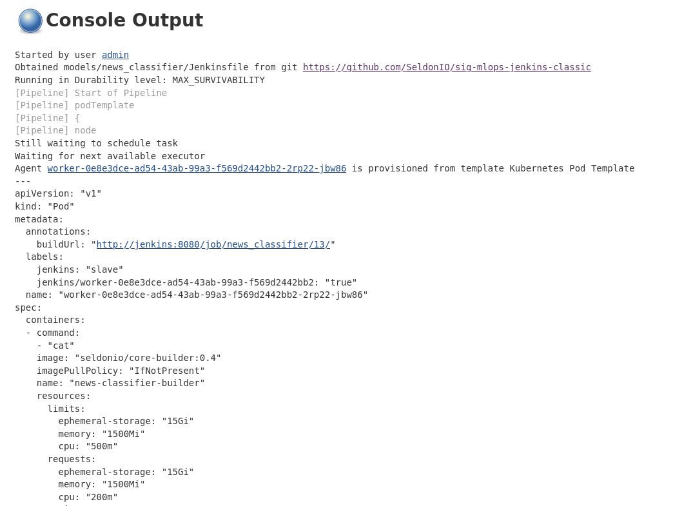

# News Classifier

Implementation of a news classifier model using Scikit Learn's Naive Bayes implementation.
Since this model is implemented using Scikit Learn, we can deploy it using [one of Seldon's pre-built re-usable server](https://docs.seldon.io/projects/seldon-core/en/latest/servers/sklearn.html).

## Training

First we will train a machine learning model, which will help us classify news across multiple categories.

### Install dependencies 

We will need the following dependencies in order to run the Python code:


```python
%%writefile ./src/requirements.txt
# You need the right versions for your model server:
# Model servers: https://docs.seldon.io/projects/seldon-core/en/latest/servers/overview.html

# For SKLearn you need a pickle and the following:
scikit-learn==0.20.3 # See https://docs.seldon.io/projects/seldon-core/en/latest/servers/sklearn.html
joblib==0.13.2

# For XGBoost you need v 0.82 and an xgboost export (not a pickle)
#xgboost==0.82

# For MLFlow you need the following, and a link to the built model:
#mlflow==1.1.0
#pandas==0.25

# For tensorflow, any models supported by tensorflow serving (less than v2.0)

# For testing
pytest==5.1.1

```

    Overwriting ./src/requirements.txt


We can now install the dependencies using the make command:


```bash
%%bash
make install_dev
```

    cat: VERSION: No such file or directory
    Makefile:10: warning: overriding recipe for target 'make'
    Makefile:7: warning: ignoring old recipe for target 'make'
    Makefile:14: warning: overriding recipe for target 'make'
    Makefile:10: warning: ignoring old recipe for target 'make'
    pip install -r src/requirements.txt
    Collecting scikit-learn==0.20.3 (from -r src/requirements.txt (line 5))
    [?25l  Downloading https://files.pythonhosted.org/packages/5e/82/c0de5839d613b82bddd088599ac0bbfbbbcbd8ca470680658352d2c435bd/scikit_learn-0.20.3-cp36-cp36m-manylinux1_x86_64.whl (5.4MB)
         |████████████████████████████████| 5.4MB 3.8MB/s eta 0:00:01
    [?25hCollecting joblib==0.13.2 (from -r src/requirements.txt (line 6))
    [?25l  Downloading https://files.pythonhosted.org/packages/cd/c1/50a758e8247561e58cb87305b1e90b171b8c767b15b12a1734001f41d356/joblib-0.13.2-py2.py3-none-any.whl (278kB)
         |████████████████████████████████| 286kB 44.0MB/s eta 0:00:01
    [?25hCollecting pytest==5.1.1 (from -r src/requirements.txt (line 18))
    [?25l  Downloading https://files.pythonhosted.org/packages/ef/3b/5652e27e048ae086f79ce9c4ce8a2da6bad1e9590788e5768aafc6f375ef/pytest-5.1.1-py3-none-any.whl (223kB)
         |████████████████████████████████| 225kB 37.8MB/s eta 0:00:01
    [?25hCollecting scipy>=0.13.3 (from scikit-learn==0.20.3->-r src/requirements.txt (line 5))
    [?25l  Downloading https://files.pythonhosted.org/packages/54/18/d7c101d5e93b6c78dc206fcdf7bd04c1f8138a7b1a93578158fa3b132b08/scipy-1.3.3-cp36-cp36m-manylinux1_x86_64.whl (25.2MB)
         |████████████████████████████████| 25.2MB 11.9MB/s eta 0:00:01
    [?25hRequirement already satisfied: numpy>=1.8.2 in /home/agm/.pyenv/versions/3.6.9/lib/python3.6/site-packages (from scikit-learn==0.20.3->-r src/requirements.txt (line 5)) (1.17.4)
    Collecting py>=1.5.0 (from pytest==5.1.1->-r src/requirements.txt (line 18))
      Using cached https://files.pythonhosted.org/packages/76/bc/394ad449851729244a97857ee14d7cba61ddb268dce3db538ba2f2ba1f0f/py-1.8.0-py2.py3-none-any.whl
    Collecting pluggy<1.0,>=0.12 (from pytest==5.1.1->-r src/requirements.txt (line 18))
      Downloading https://files.pythonhosted.org/packages/a0/28/85c7aa31b80d150b772fbe4a229487bc6644da9ccb7e427dd8cc60cb8a62/pluggy-0.13.1-py2.py3-none-any.whl
    Requirement already satisfied: importlib-metadata>=0.12; python_version < "3.8" in /home/agm/.pyenv/versions/3.6.9/lib/python3.6/site-packages (from pytest==5.1.1->-r src/requirements.txt (line 18)) (0.23)
    Collecting packaging (from pytest==5.1.1->-r src/requirements.txt (line 18))
      Using cached https://files.pythonhosted.org/packages/cf/94/9672c2d4b126e74c4496c6b3c58a8b51d6419267be9e70660ba23374c875/packaging-19.2-py2.py3-none-any.whl
    Requirement already satisfied: more-itertools>=4.0.0 in /home/agm/.pyenv/versions/3.6.9/lib/python3.6/site-packages (from pytest==5.1.1->-r src/requirements.txt (line 18)) (7.2.0)
    Collecting atomicwrites>=1.0 (from pytest==5.1.1->-r src/requirements.txt (line 18))
      Using cached https://files.pythonhosted.org/packages/52/90/6155aa926f43f2b2a22b01be7241be3bfd1ceaf7d0b3267213e8127d41f4/atomicwrites-1.3.0-py2.py3-none-any.whl
    Collecting wcwidth (from pytest==5.1.1->-r src/requirements.txt (line 18))
      Using cached https://files.pythonhosted.org/packages/7e/9f/526a6947247599b084ee5232e4f9190a38f398d7300d866af3ab571a5bfe/wcwidth-0.1.7-py2.py3-none-any.whl
    Requirement already satisfied: attrs>=17.4.0 in /home/agm/.pyenv/versions/3.6.9/lib/python3.6/site-packages (from pytest==5.1.1->-r src/requirements.txt (line 18)) (19.1.0)
    Requirement already satisfied: zipp>=0.5 in /home/agm/.pyenv/versions/3.6.9/lib/python3.6/site-packages (from importlib-metadata>=0.12; python_version < "3.8"->pytest==5.1.1->-r src/requirements.txt (line 18)) (0.6.0)
    Requirement already satisfied: six in /home/agm/.pyenv/versions/3.6.9/lib/python3.6/site-packages (from packaging->pytest==5.1.1->-r src/requirements.txt (line 18)) (1.12.0)
    Collecting pyparsing>=2.0.2 (from packaging->pytest==5.1.1->-r src/requirements.txt (line 18))
      Using cached https://files.pythonhosted.org/packages/c0/0c/fc2e007d9a992d997f04a80125b0f183da7fb554f1de701bbb70a8e7d479/pyparsing-2.4.5-py2.py3-none-any.whl
    Installing collected packages: scipy, scikit-learn, joblib, py, pluggy, pyparsing, packaging, atomicwrites, wcwidth, pytest
    Successfully installed atomicwrites-1.3.0 joblib-0.13.2 packaging-19.2 pluggy-0.13.1 py-1.8.0 pyparsing-2.4.5 pytest-5.1.1 scikit-learn-0.20.3 scipy-1.3.3 wcwidth-0.1.7
    WARNING: You are using pip version 19.2.3, however version 19.3.1 is available.
    You should consider upgrading via the 'pip install --upgrade pip' command.


### Download the ML data

Now that we have all the dependencies we can proceed to download the data.

We will download the news stories dataset, and we'll be attempting to classify across the four classes below.


```python
from sklearn.datasets import fetch_20newsgroups
categories = ['alt.atheism', 'soc.religion.christian',
              'comp.graphics', 'sci.med']

twenty_train = fetch_20newsgroups(
    subset='train', categories=categories, shuffle=True, random_state=42)

twenty_test = fetch_20newsgroups(
    subset='test', categories=categories, shuffle=True, random_state=42)

# Printing the top 3 newstories
print("\n".join(twenty_train.data[0].split("\n")[:3]))
```

    Downloading 20news dataset. This may take a few minutes.
    Downloading dataset from https://ndownloader.figshare.com/files/5975967 (14 MB)


    From: sd345@city.ac.uk (Michael Collier)
    Subject: Converting images to HP LaserJet III?
    Nntp-Posting-Host: hampton


### Train a model

Now that we've downloaded the data, we can train the ML model using a simple pipeline with basic text pre-processors and a Multiclass naive bayes classifier


```python
from sklearn.pipeline import Pipeline
from sklearn.feature_extraction.text import TfidfTransformer, CountVectorizer
from sklearn.naive_bayes import MultinomialNB

text_clf = Pipeline([
    ('vect', CountVectorizer()),
    ('tfidf', TfidfTransformer()),
    ('clf', MultinomialNB()),
])

text_clf.fit(twenty_train.data, twenty_train.target)
```


    Pipeline(memory=None,
         steps=[('vect', CountVectorizer(analyzer='word', binary=False, decode_error='strict',
            dtype=<class 'numpy.int64'>, encoding='utf-8', input='content',
            lowercase=True, max_df=1.0, max_features=None, min_df=1,
            ngram_range=(1, 1), preprocessor=None, stop_words=None,
            strip...inear_tf=False, use_idf=True)), ('clf', MultinomialNB(alpha=1.0, class_prior=None, fit_prior=True))])


### Test single prediction

Now that we've trained our model we can use it to predict from un-seen data.

We can see below that the model is able to predict the first datapoint in the dataset correctly.


```python
idx = 0
print(f"CONTENT:{twenty_test.data[idx][35:230]}\n\n-----------\n")
print(f"PREDICTED CLASS: {categories[twenty_test.target[idx]]}")
```

    CONTENT:
    Subject: Re: HELP for Kidney Stones ..............
    Organization: The Avant-Garde of the Now, Ltd.
    Lines: 12
    NNTP-Posting-Host: ucsd.edu
    
    As I recall from my bout with kidney stones, there isn't 
    
    -----------
    
    PREDICTED CLASS: comp.graphics


### Print accuracy

We can print the accuracy of the model by running the test data and counting the number of correct classes.


```python
import numpy as np

predicted = text_clf.predict(twenty_test.data)
print(f"Accuracy: {np.mean(predicted == twenty_test.target):.2f}")
```

    Accuracy: 0.83


## Deployment

Now we want to be able to deploy the model we just trained. This will just be as simple as updated the model binary.

### Save the trained model

First we have to save the trained model in the `src/` folder.
This is the binary that we will upload to our cloud storage (which acts as model registry) and which our wrapper will load.


```python
import joblib
joblib.dump(text_clf, "src/model.joblib")
```


    ['src/model.joblib']


### Update your unit test

We'll write a very simple unit test that make sure that the model loads and runs as expected.


```python
%%writefile src/test_model.py
import numpy as np
from unittest import mock
import joblib
import os

EXPECTED_RESPONSE = np.array([3, 3])

def test_model(*args, **kwargs):
    data = ["text 1", "text 2"]

    m = joblib.load("model.joblib")
    result = m.predict(data)
    assert all(result == EXPECTED_RESPONSE)

```

    Overwriting src/test_model.py


```bash
%%bash
make test
```

    cat: VERSION: No such file or directory
    Makefile:10: warning: overriding recipe for target 'make'
    Makefile:7: warning: ignoring old recipe for target 'make'
    Makefile:14: warning: overriding recipe for target 'make'
    Makefile:10: warning: ignoring old recipe for target 'make'
    (cd src && \
    	pytest -s --verbose -W ignore --log-level=INFO 2>&1)
    ============================= test session starts ==============================
    platform linux -- Python 3.6.9, pytest-5.1.1, py-1.8.0, pluggy-0.13.1 -- /home/agm/.pyenv/versions/3.6.9/bin/python3.6
    cachedir: .pytest_cache
    rootdir: /home/agm/Seldon/sig-mlops-jenkins-classic/models/news_classifier/src
    collected 1 item                                                               
    
    test_model.py::test_model PASSED
    
    ============================== 1 passed in 1.05s ===============================


### Updating Integration Tests

We can also now update the integration tests. This is another very simple step, where we'll want to test this model specifically.


```python
%%writefile integration/test_e2e_seldon_model_server.py
from seldon_core.seldon_client import SeldonClient
from seldon_core.utils import seldon_message_to_json
import numpy as np
from subprocess import run
import time
import logging


API_AMBASSADOR = "localhost:8003"

def test_sklearn_server():
    data = ["From: brian@ucsd.edu (Brian Kantor)\nSubject: Re: HELP for Kidney Stones ..............\nOrganization: The Avant-Garde of the Now, Ltd.\nLines: 12\nNNTP-Posting-Host: ucsd.edu\n\nAs I recall from my bout with kidney stones, there isn't any\nmedication that can do anything about them except relieve the pain.\n\nEither they pass, or they have to be broken up with sound, or they have\nto be extracted surgically.\n\nWhen I was in, the X-ray tech happened to mention that she'd had kidney\nstones and children, and the childbirth hurt less.\n\nDemerol worked, although I nearly got arrested on my way home when I barfed\nall over the police car parked just outside the ER.\n\t- Brian\n",
            'From: rind@enterprise.bih.harvard.edu (David Rind)\nSubject: Re: Candida(yeast) Bloom, Fact or Fiction\nOrganization: Beth Israel Hospital, Harvard Medical School, Boston Mass., USA\nLines: 37\nNNTP-Posting-Host: enterprise.bih.harvard.edu\n\nIn article <1993Apr26.103242.1@vms.ocom.okstate.edu>\n banschbach@vms.ocom.okstate.edu writes:\n>are in a different class.  The big question seems to be is it reasonable to \n>use them in patients with GI distress or sinus problems that *could* be due \n>to candida blooms following the use of broad-spectrum antibiotics?\n\nI guess I\'m still not clear on what the term "candida bloom" means,\nbut certainly it is well known that thrush (superficial candidal\ninfections on mucous membranes) can occur after antibiotic use.\nThis has nothing to do with systemic yeast syndrome, the "quack"\ndiagnosis that has been being discussed.\n\n\n>found in the sinus mucus membranes than is candida.  Women have been known \n>for a very long time to suffer from candida blooms in the vagina and a \n>women is lucky to find a physician who is willing to treat the cause and \n>not give give her advise to use the OTC anti-fungal creams.\n\nLucky how?  Since a recent article (randomized controlled trial) of\noral yogurt on reducing vaginal candidiasis, I\'ve mentioned to a \nnumber of patients with frequent vaginal yeast infections that they\ncould try eating 6 ounces of yogurt daily.  It turns out most would\nrather just use anti-fungal creams when they get yeast infections.\n\n>yogurt dangerous).  If this were a standard part of medical practice, as \n>Gordon R. says it is, then the incidence of GI distress and vaginal yeast \n>infections should decline.\n\nAgain, this just isn\'t what the systemic yeast syndrome is about, and\nhas nothing to do with the quack therapies that were being discussed.\nThere is some evidence that attempts to reinoculate the GI tract with\nbacteria after antibiotic therapy don\'t seem to be very helpful in\nreducing diarrhea, but I don\'t think anyone would view this as a\nquack therapy.\n-- \nDavid Rind\nrind@enterprise.bih.harvard.edu\n']
    labels = [2.0, 2.0]
    
    sc = SeldonClient(
        gateway="ambassador",
        gateway_endpoint=API_AMBASSADOR,
        deployment_name="seldon-model-server",
        payload_type="ndarray",
        namespace="seldon",
        transport="rest")

    sm_result = sc.predict(data=np.array(data))
    logging.info(sm_result)
    result = seldon_message_to_json(sm_result.response)
    logging.info(result)
    values = result.get("data", {}).get("ndarray", {})
    assert (values == labels)

```

    Overwriting integration/test_e2e_seldon_model_server.py


### Now push your changes to trigger the pipeline
Because Jenkins Classic has created a CI GitOps pipeline for our repo we just need to push our changes to run all the tests

We can do this by running our good old git commands:


```bash
%%bash
git add .
git push origin master
```

We can now see that the pipeline has been triggered by going to the Status page inside Jenkins pipeline:


Similarly we can actually see the logs of our running job by going to the Console Output page:



## Managing your ML Application

Now that we've deployed our MLOps repo, Argo CD will sync the model implementation repository charts with our Staging environ ment automatically.


```bash
%%bash
kubectl get pods -n staging
```

    NAME                                                   READY   STATUS    RESTARTS   AGE
    default-broker-filter-b487cfff8-tr9sm                  2/2     Running   4          26d
    default-broker-ingress-7dc67f5f7b-gvxh5                2/2     Running   3          26d
    seldon-model-server-default-cbb4caa-7d9f5db4b7-kh5ql   3/3     Running   2          3h42m
    test1-default-98783c9-84d96c8f64-wv9j6                 3/3     Running   0          23h


### Test your application in the staging environment


```python
from seldon_core.seldon_client import SeldonClient
import numpy as np

url = !kubectl get svc ambassador -o jsonpath='{.status.loadBalancer.ingress[0].hostname}'

sc = SeldonClient(
    gateway="ambassador", 
    gateway_endpoint="localhost:80",
    deployment_name="mlops-server",
    payload_type="ndarray",
    namespace="staging",
    transport="rest")

response = sc.predict(data=np.array([twenty_test.data[0]]))

response.response.data
```


    ndarray {
      values {
        number_value: 2.0
      }
    }


```bash
%%bash
curl -X POST -H 'Content-Type: application/json' \
     -d "{'data': {'names': ['text'], 'ndarray': ['Hello world this is a test']}}" \
    http://localhost/seldon/staging/news-classifier-server/api/v0.1/predictions
```

    {
      "meta": {
        "puid": "so6n21pkf70fm66eka28lc63cr",
        "tags": {
        },
        "routing": {
        },
        "requestPath": {
          "news-classifier-server-processor": "axsauze/sklearn-server:0.1"
        },
        "metrics": []
      },
      "data": {
        "names": [],
        "ndarray": [2.0]
      }
    }

      % Total    % Received % Xferd  Average Speed   Time    Time     Time  Current
                                     Dload  Upload   Total   Spent    Left  Speed
    100   350  100   278  100    72   7942   2057 --:--:-- --:--:-- --:--:-- 10294

