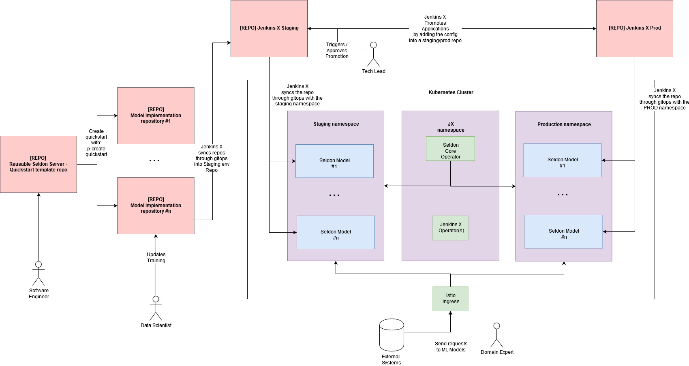

# End-to-end MLOps with Seldon Core and Jenkins X

This tutorial provides an end-to-end hands-on tutorial that shows you how to build your own re-usable MLOps pipelines leveraging Seldon Core and Jenkins X. 

By the end of this tutorial, you will be able to:

* Quickly spin up a project based on the MLOps quickstart
* Leverage Seldon's prepackaged model servers
* Leverage Seldon's language wrapper for custom model servers
* Run unit tests using Jenkins X 
* Run end-to-end tests for your model with KIND (Kubernetes in Docker)
* Promote your model as a Jenkins X application across multiple (staging / prod) environments


## Intuitive explanation

In this project, we will be building an MLOps workflow to deploy your production machine learning models by buiding a re-usable pre-packaged model server through CI, and then deploying individual models using CD.



## Requirements

* A Kubernetes cluster running v1.13+ (this was run using GKE)
* The [jx CLI](https://github.com/jenkins-x/jx/) version 2.0.916
* Jenkins-X installed in your cluster (you can set it up with the [jx boot tutorial](https://jenkins-x.io/docs/getting-started/setup/boot/))
* Seldon Core [v0.5.0 installed]() in your cluster

Once you set everything up, we'll be ready to kick off 🚀

# Setting up repo

Now we want to start setting up our repo. For this we'll just leverage the MLOps quickstart by running:


```python
!jx create quickstart --org "SeldonIO" --project-name "mlops-deployment" --filter "mlops-quickstart"
```

What this command does is basically the following:

* Find the quickstarts in the organisation "SeldonIO"
* Find the quickstart named "mlops-quickstart"
* Build the project with name "mlops-deployment"

You now have a repo where you'll be able to leverage [Seldon's pre-packaged model servers](https://docs.seldon.io/projects/seldon-core/en/latest/servers/overview.html).

Let's have a look at what was created:

* `jenkins-x.yml` - File specifying the CI / CD steps 
* `Makefile` - Commands to build and test model
* `README.(md|ipynb)` - This file!
* `VERSION` - A file containing the version which is updated upon each release
* `charts/` 
    * `mlops-server/` - Folder containing helm charts to deploy your model
    * `preview/` - Folder containing reference to helm charts to create preview environments
* `integration/`
    * `kind_test_all.sh` - File that spins up KIND cluster and runs your model
    * `test_e2e_model_server.py` - End-to-end tests to run on your model
    * `requirements-dev.py` - Requirements for your end to end tests
* `src/` 
    * `model.joblib` - Sample trained model that is deployed when importing project
    * `train_model.py` - Sample code to train your model and output a model.pickle
    * `test_model.py` - Sample code to unit test your model 
    * `requirements.txt` - Example requirements file with supported versions

## Let's train a model locally

First we will train a machine learning model, which will help us classify news across multiple categories.

### Install dependencies 

We will need the following dependencies in order to run the Python code:


```python
!cat src/requirements.txt
```

    # You need the right versions for your model server:
    # Model servers: https://docs.seldon.io/projects/seldon-core/en/latest/servers/overview.html
    
    # For SKLearn you need a pickle and the following:
    scikit-learn==0.20.3 # See https://docs.seldon.io/projects/seldon-core/en/latest/servers/sklearn.html
    joblib==0.13.2
    
    # For XGBoost you need v 0.82 and an xgboost export (not a pickle)
    #xgboost==0.82
    
    # For MLFlow you need the following, and a link to the built model:
    #mlflow==1.1.0
    #pandas==0.25
    
    # For tensorflow, any models supported by tensorflow serving (less than v2.0)


We can now install the dependencies using the make command:


```python
!make install_dev
```

### Download the ML data

Now that we have all the dependencies we can proceed to download the data.

We will download the news stories dataset, and we'll be attempting to classify across the four classes below.


```python
from sklearn.datasets import fetch_20newsgroups
categories = ['alt.atheism', 'soc.religion.christian',
              'comp.graphics', 'sci.med']

twenty_train = fetch_20newsgroups(
    subset='train', categories=categories, shuffle=True, random_state=42)

twenty_test = fetch_20newsgroups(
    subset='test', categories=categories, shuffle=True, random_state=42)

# Printing the top 3 newstories
print("\n".join(twenty_train.data[0].split("\n")[:3]))
```

    From: sd345@city.ac.uk (Michael Collier)
    Subject: Converting images to HP LaserJet III?
    Nntp-Posting-Host: hampton


### Train a model

Now that we've downloaded the data, we can train the ML model using a simple pipeline with basic text pre-processors and a Multiclass naive bayes classifier


```python
from sklearn.pipeline import Pipeline
from sklearn.feature_extraction.text import TfidfTransformer, CountVectorizer
from sklearn.naive_bayes import MultinomialNB

text_clf = Pipeline([
    ('vect', CountVectorizer()),
    ('tfidf', TfidfTransformer()),
    ('clf', MultinomialNB()),
])

text_clf.fit(twenty_train.data, twenty_train.target)
```


    Pipeline(memory=None,
             steps=[('vect',
                     CountVectorizer(analyzer='word', binary=False,
                                     decode_error='strict',
                                     dtype=<class 'numpy.int64'>, encoding='utf-8',
                                     input='content', lowercase=True, max_df=1.0,
                                     max_features=None, min_df=1,
                                     ngram_range=(1, 1), preprocessor=None,
                                     stop_words=None, strip_accents=None,
                                     token_pattern='(?u)\\b\\w\\w+\\b',
                                     tokenizer=None, vocabulary=None)),
                    ('tfidf',
                     TfidfTransformer(norm='l2', smooth_idf=True,
                                      sublinear_tf=False, use_idf=True)),
                    ('clf',
                     MultinomialNB(alpha=1.0, class_prior=None, fit_prior=True))],
             verbose=False)


### Test single prediction

Now that we've trained our model we can use it to predict from un-seen data.

We can see below that the model is able to predict the first datapoint in the dataset correctly.


```python
idx = 0
print(f"CONTENT:{twenty_test.data[idx][35:230]}\n\n-----------\n")
print(f"PREDICTED CLASS: {categories[twenty_test.target[idx]]}")
```

    CONTENT:
    Subject: Re: HELP for Kidney Stones ..............
    Organization: The Avant-Garde of the Now, Ltd.
    Lines: 12
    NNTP-Posting-Host: ucsd.edu
    
    As I recall from my bout with kidney stones, there isn't 
    
    -----------
    
    PREDICTED CLASS: comp.graphics


### Print accuracy

We can print the accuracy of the model by running the test data and counting the number of correct classes.


```python
import numpy as np

predicted = text_clf.predict(twenty_test.data)
print(f"Accuracy: {np.mean(predicted == twenty_test.target):.2f}")
```

    Accuracy: 0.83


## Deploy the model

Now we want to be able to deploy the model we just trained. This will just be as simple as updated the model binary.

### Save the trained model

First we have to save the trained model in the `src/` folder, which our wrapper will load


```python
import joblib
joblib.dump(text_clf, "src/model.joblib")
```


    ['src/model.joblib']


### Update your unit test

We'll write a very simple unit test that make sure that the model loads and runs as expected.


```python
%%writefile src/test_model.py

import numpy as np
from unittest import mock
import joblib

EXPECTED_RESPONSE = np.array([3, 3])

def test_model(*args, **kwargs):
    data = ["text 1", "text 2"]

    m = joblib.load("model.joblib")
    result = m.predict(data)
    assert all(result == EXPECTED_RESPONSE)

```

    Overwriting src/test_model.py


```python
!make test
```

    cat: VERSION: No such file or directory
    Makefile:12: warning: overriding recipe for target 'make'
    Makefile:9: warning: ignoring old recipe for target 'make'
    Makefile:15: warning: overriding recipe for target 'make'
    Makefile:12: warning: ignoring old recipe for target 'make'
    (cd src && pytest -s --verbose -W ignore 2>&1)
    ============================= test session starts ==============================
    platform linux -- Python 3.7.3, pytest-5.1.1, py-1.8.0, pluggy-0.12.0 -- /home/alejandro/miniconda3/envs/reddit-classification/bin/python
    cachedir: .pytest_cache
    rootdir: /home/alejandro/Programming/kubernetes/seldon/sig-mlops-example/src
    plugins: cov-2.7.1, forked-1.0.2, localserver-0.5.0
    collected 1 item                                                               
    
    test_model.py::test_model PASSED
    
    ============================== 1 passed in 2.21s ===============================


### Updating Integration Tests

We can also now update the integration tests. This is another very simple step, where we'll want to test this model specifically.


```python
%%writefile integration/test_e2e_sklearn_server.py
from seldon_core.seldon_client import SeldonClient
import numpy as np

API_AMBASSADOR = "localhost:8003"

def test_sklearn_server():
    data = ["From: brian@ucsd.edu (Brian Kantor)\nSubject: Re: HELP for Kidney Stones ..............\nOrganization: The Avant-Garde of the Now, Ltd.\nLines: 12\nNNTP-Posting-Host: ucsd.edu\n\nAs I recall from my bout with kidney stones, there isn't any\nmedication that can do anything about them except relieve the pain.\n\nEither they pass, or they have to be broken up with sound, or they have\nto be extracted surgically.\n\nWhen I was in, the X-ray tech happened to mention that she'd had kidney\nstones and children, and the childbirth hurt less.\n\nDemerol worked, although I nearly got arrested on my way home when I barfed\nall over the police car parked just outside the ER.\n\t- Brian\n",
            'From: rind@enterprise.bih.harvard.edu (David Rind)\nSubject: Re: Candida(yeast) Bloom, Fact or Fiction\nOrganization: Beth Israel Hospital, Harvard Medical School, Boston Mass., USA\nLines: 37\nNNTP-Posting-Host: enterprise.bih.harvard.edu\n\nIn article <1993Apr26.103242.1@vms.ocom.okstate.edu>\n banschbach@vms.ocom.okstate.edu writes:\n>are in a different class.  The big question seems to be is it reasonable to \n>use them in patients with GI distress or sinus problems that *could* be due \n>to candida blooms following the use of broad-spectrum antibiotics?\n\nI guess I\'m still not clear on what the term "candida bloom" means,\nbut certainly it is well known that thrush (superficial candidal\ninfections on mucous membranes) can occur after antibiotic use.\nThis has nothing to do with systemic yeast syndrome, the "quack"\ndiagnosis that has been being discussed.\n\n\n>found in the sinus mucus membranes than is candida.  Women have been known \n>for a very long time to suffer from candida blooms in the vagina and a \n>women is lucky to find a physician who is willing to treat the cause and \n>not give give her advise to use the OTC anti-fungal creams.\n\nLucky how?  Since a recent article (randomized controlled trial) of\noral yogurt on reducing vaginal candidiasis, I\'ve mentioned to a \nnumber of patients with frequent vaginal yeast infections that they\ncould try eating 6 ounces of yogurt daily.  It turns out most would\nrather just use anti-fungal creams when they get yeast infections.\n\n>yogurt dangerous).  If this were a standard part of medical practice, as \n>Gordon R. says it is, then the incidence of GI distress and vaginal yeast \n>infections should decline.\n\nAgain, this just isn\'t what the systemic yeast syndrome is about, and\nhas nothing to do with the quack therapies that were being discussed.\nThere is some evidence that attempts to reinoculate the GI tract with\nbacteria after antibiotic therapy don\'t seem to be very helpful in\nreducing diarrhea, but I don\'t think anyone would view this as a\nquack therapy.\n-- \nDavid Rind\nrind@enterprise.bih.harvard.edu\n']
    labels = [2, 2]
    
    sc = SeldonClient(
        gateway="ambassador", 
        gateway_endpoint=API_AMBASSADOR,
        deployment_name="news-classifier-server",
        payload_type="ndarray",
        namespace="default",
        transport="rest")

    result = sc.predict(np.array(data))
    assert all(result.response.data.ndarray.values == labels)
```

    Overwriting integration/test_e2e_sklearn_server.py


### Now push your changes to trigger the pipeline
Because Jenkins X has created a CI GitOps pipeline for our repo we just need to push our changes to run all the tests

We can do this by running our good old git commands:


```bash
%%bash
git add .
git push origin master
```

We can now see that the pipeline has been triggered by viewing our activities:


```python
!jx get activity -f sig-mlops-seldon-jenkins-x | tail
```

        Create Effective Pipeline                          11h28m57s       7s Succeeded 
        Create Tekton Crds                                 11h28m50s      11s Succeeded 
      test and deploy sklearn server                       11h28m38s    1m54s Succeeded 
        Credential Initializer 59hx6                       11h28m38s       0s Succeeded 
        Working Dir Initializer Fslpm                      11h28m38s       1s Succeeded 
        Place Tools                                        11h28m37s       1s Succeeded 
        Git Source Seldonio Sig Mlops Seldon Jenki Ftjtn   11h28m36s       6s Succeeded https://github.com/SeldonIO/sig-mlops-seldon-jenkins-x.git
        Git Merge                                          11h28m30s       1s Succeeded 
        Run Tests                                          11h28m29s      13s Succeeded 
        Build And Push Images                              11h28m16s    1m32s Succeeded 


```python
Similarly we can actually see the logs of our running job:
```


```bash
%%bash
YOUR_GIT_USERNAME=SeldonIO
jx get build logs "$YOUR_GIT_USERNAME/sig-mlops-seldon-jenkins-x/master #7 release" | tail
```

    error: Failed to parse docker reference ELDON_BASE_WRAPPER
    ERROR: An error occurred: unable to get metadata for ELDON_BASE_WRAPPER:latest
    ERROR: Suggested solution: check image name
    ERROR: If the problem persists consult the docs at https://github.com/openshift/source-to-image/tree/master/docs. Eventually reach us on freenode #openshift or file an issue at https://github.com/openshift/source-to-image/issues providing us with a log from your build using log output level 3.
    Makefile:8: recipe for target 'build' failed
    make: *** [build] Error 1
    Stopping Docker: dockerProgram process in pidfile '/var/run/docker-ssd.pid', 1 process(es), refused to die.
    
    Pipeline failed on stage 'test-and-deploy-sklearn-server' : container 'step-build-and-push-images'. The execution of the pipeline has stopped.
    


    wrote: /tmp/086bfe4e-d4ac-46e6-baa1-71d4ef7abca4095596018


## Managing your Jenkins X Application

Now that we've deployed our MLOps repo, Jenkins X now has created an application from our charts.

This application gets automatically syncd into the Jenkins X staging environment, which you can see:


```python
!kubectl get pods -n jx-staging
```

### Test your application in the staging environment


```python
from seldon_core.seldon_client import SeldonClient
import numpy as np

url = !kubectl get svc ambassador -o jsonpath='{.status.loadBalancer.ingress[0].hostname}'

sc = SeldonClient(
    gateway="ambassador", 
    gateway_endpoint="localhost:80",
    deployment_name="mlops-server",
    payload_type="ndarray",
    namespace="jx-staging",
    transport="rest")

response = sc.predict(data=np.array([twenty_test.data[0]]))

response.response.data
```


    ndarray {
      values {
        number_value: 2.0
      }
    }


```bash
%%bash
curl -X POST -H 'Content-Type: application/json' \
     -d "{'data': {'names': ['text'], 'ndarray': ['Hello world this is a test']}}" \
    http://localhost/seldon/jx-staging/news-classifier-server/api/v0.1/predictions
```

    {
      "meta": {
        "puid": "so6n21pkf70fm66eka28lc63cr",
        "tags": {
        },
        "routing": {
        },
        "requestPath": {
          "news-classifier-server-processor": "axsauze/sklearn-server:0.1"
        },
        "metrics": []
      },
      "data": {
        "names": [],
        "ndarray": [2.0]
      }
    }

      % Total    % Received % Xferd  Average Speed   Time    Time     Time  Current
                                     Dload  Upload   Total   Spent    Left  Speed
    100   350  100   278  100    72   7942   2057 --:--:-- --:--:-- --:--:-- 10294


# Diving into our continuous integration

We have now separated our model development into two chunks: 

* The first one involves the creation of a model serve, and the second one involves the CI of the model server, and the second involves the deployment of models that create the model.


## Using the Jenkins X pipeline

In order to do this we will be able to first run some tests and the push to the docker repo.

For this we will be leveraging the Jenkins X file, we'll first start with a simple file that just runs the tests:


```python
%%writefile jenkins-x.yml
buildPack: none
pipelineConfig:
  pipelines:
    release:
      pipeline:
        agent:
          image: seldonio/core-builder:0.4
        stages:
          - name: test-sklearn-server
            steps:
            - name: run-tests
              command: make
              args:
              - install_dev
              - test
    pullRequest:
      pipeline:
        agent:
          image: seldonio/core-builder:0.4
        stages:
          - name: test-sklearn-server
            steps:
            - name: run-tests
              command: make
              args:
              - install_dev
              - test
```

    Overwriting jenkins-x.yml


The `jenkins-x.yml` file is pretty easy to understand if we read through the different steps.

Basically we can define the steps of what happens upon `release` - i.e. when a PR / Commit is added to master - and what happens upon `pullRequest` - whenever someone opens a pull request.

You can see that the steps are exactly the same for both release and PR for now - namely, we run `make install_dev test` which basically installs all the dependencies and runs all the tests.

# Integration tests

Now that we have a model that we want to be able to deploy, we want to make sure that we run end-to-end tests on that model to make sure everything works as expected.

For this we will leverage the same framework that the Kubernetes team uses to test Kubernetes itself: KIND.

KIND stands for Kubernetes in Docker, and is used to isolate a Kubernetes environent for end-to-end tests.

In our case, we will be able to leverage to create an isolated environment, where we'll be able to test our model.

For this, the steps we'll have to carry out include:

1. Authenticate your docker with the jx CLI
2. Add the steps in the `Jenkins-X.yml` to run this in the production cluster
3. Leverage the `kind_run_all.sh` script that creates a KIND cluster and runs the tests


## Add docker auth to your cluster

Adding a docker authentication with Jenkins X can be done through a JX CLI command, which is the following:

* `jx create docker auth --host https://index.docker.io/v1/ --user $YOUR_DOCKER_USERNAME --secret $YOUR_DOCKER_KEY_SECRET --email $YOUR_DOCKER_EMAIL`

This comamnd will use these credentials to authenticate with Docker and create an auth token (which expires).

## Extend JenkinsX file for integration

Now that we have the test that would run for the integration tests, we need to extend the JX pipeline to run this.

This extension is quite simple, and only requires adding the following line:
    
```
            - name: run-end-to-end-tests
              command: bash
              args:
              - integration/kind_test_all.sh
```

This line would be added in both the PR and release pipelines so that we can run integration tests then.

It is also possible to move the integration tests into a separate jenkins-x file such as `jenkins-x-integration.yml` by leveraging [Contexts & Schedules]() which basically allow us to extend the functionality of Prow by writing our own triggers, however this is outside the scope of this tutorial.

### Config to provide docker authentication

This piece is slightly more extensive, as we will need to use Docker to build out containers due to the dependency on `s2i` to build the model wrappers.

First we need to define the volumes that we'll be mounting to the container.

The first few volumes before basically consist of the core components that docker will need to be able to run.
```
          volumes:
            - name: modules
              hostPath:
                path: /lib/modules
                type: Directory
            - name: cgroup
              hostPath:
                path: /sys/fs/cgroup
                type: Directory
            - name: dind-storage
              emptyDir: {}
```
We also want to mount the docker credentials which we will generate in the next step.
```
            - name: jenkins-docker-config-volume
              secret:
                items:
                - key: config.json
                  path: config.json
                secretName: jenkins-docker-cfg
```
Once we've created the volumes, now we just need to mount them. This can be done as follows:
```
        options:
          containerOptions:
            volumeMounts:
              - mountPath: /lib/modules
                name: modules
                readOnly: true
              - mountPath: /sys/fs/cgroup
                name: cgroup
              - name: dind-storage
                mountPath: /var/lib/docker                 
```
And finally we also mount the docker auth configuration so we don't have to run `docker login`:
```
              - mountPath: /builder/home/.docker
                name: jenkins-docker-config-volume
```

And to finalise, we need to make sure that the pod can run with privileged context.

The reason why this is required is in order to be able to run the docker daemon:
```
            securityContext:
              privileged: true
```

## Kind run all integration tests script

The kind_run_all may seem complicated at first, but it's actually quite simple. 

All the script does is set-up a kind cluster with all dependencies, deploy the model and clean everything up.

Let's break down each of the components within the script.

#### Start docker

We first start the docker daemon and wait until Docker is running (using `docker ps q` for guidance.

```
# FIRST WE START THE DOCKER DAEMON
service docker start
# the service can be started but the docker socket not ready, wait for ready
WAIT_N=0
while true; do
    # docker ps -q should only work if the daemon is ready
    docker ps -q > /dev/null 2>&1 && break
    if [[ ${WAIT_N} -lt 5 ]]; then
        WAIT_N=$((WAIT_N+1))
        echo "[SETUP] Waiting for Docker to be ready, sleeping for ${WAIT_N} seconds ..."
        sleep ${WAIT_N}
    else
        echo "[SETUP] Reached maximum attempts, not waiting any longer ..."
        break
    fi
done
```

#### Create and set-up KIND cluster

Once we're running a docker daemon, we can run the command to create our KIND cluster, and install all the components.

This will set up a Kubnernetes cluster using the docker daemon (using containers as Nodes), and then install Ambassador + Seldon Core.

```
#######################################
# AVOID EXIT ON ERROR FOR FOLLOWING CMDS
set +o errexit

# START CLUSTER 
make kind_create_cluster
KIND_EXIT_VALUE=$?

# Ensure we reach the kubeconfig path
export KUBECONFIG=$(kind get kubeconfig-path)

# ONLY RUN THE FOLLOWING IF SUCCESS
if [[ ${KIND_EXIT_VALUE} -eq 0 ]]; then
    # KIND CLUSTER SETUP
    make kind_setup
    SETUP_EXIT_VALUE=$?
```

#### Run python tests

We can now run the tests; for this we run all the dev installations and kick off our tests (which we'll add inside of the integration folder).

```
    # BUILD S2I BASE IMAGES
    make build
    S2I_EXIT_VALUE=$?

    ## INSTALL ALL REQUIRED DEPENDENCIES
    make install_integration_dev
    INSTALL_EXIT_VALUE=$?
    
    ## RUNNING TESTS AND CAPTURING ERROR
    make test
    TEST_EXIT_VALUE=$?
fi
```

#### Clean up

Finally we just clean everything, including the cluster, the containers and the docker daemon.

```
# DELETE KIND CLUSTER
make kind_delete_cluster
DELETE_EXIT_VALUE=$?

#######################################
# EXIT STOPS COMMANDS FROM HERE ONWARDS
set -o errexit

# CLEANING DOCKER
docker ps -aq | xargs -r docker rm -f || true
service docker stop || true
```


# Promote your application
Now that we've verified that our CI pipeline is working, we want to promote our application to production

This can be done with our JX CLI:


```python
!jx promote application --...
```

## Test your production application

Once your production application is deployed, you can test it using the same script, but in the `jx-production` namespace:


```python
from seldon_core.seldon_client import SeldonClient
import numpy as np

url = !kubectl get svc ambassador -o jsonpath='{.status.loadBalancer.ingress[0].hostname}'

sc = SeldonClient(
    gateway="ambassador", 
    gateway_endpoint="localhost:80",
    deployment_name="mlops-server",
    payload_type="ndarray",
    namespace="jx-production",
    transport="rest")

response = sc.predict(data=np.array([twenty_test.data[0]]))

response.response.data
```
