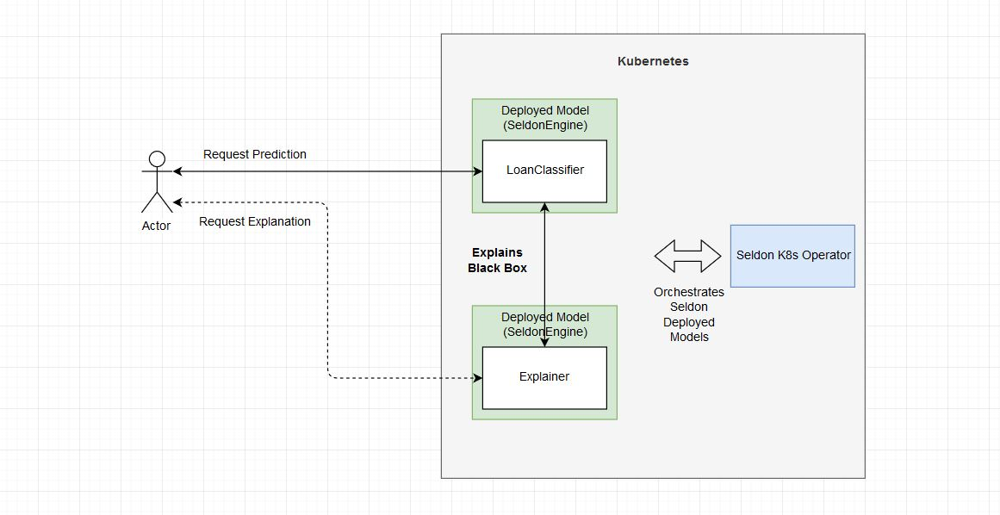

# Seldon deployment of income classifier and Alibi anchor explainer

The objective of this tutorial is to build a "loan approval" predictor using the Income classifier dataset to showcase the importance of black-box model explainers, which in this case are built using our open source framework [Alibi](http://github.com/SeldonIO/Alibi). The diagram of this tutorial is as follows:



In this tutorial we will follow the following steps:

1) Train a model to predict loan approvals

2) Containerise and deploy your model

3) Create an explainer to understand predictions

4) Containerise and deploy your explainer

5) Test the predictions as well as explanations

# Before you start
Make sure you install the following dependencies, as they are critical for this example to work:

* Helm v2.13.1+
* A Kubernetes cluster running v1.13 or above (minkube / docker-for-windows work well if enough RAM)
* kubectl v1.14+
* ksonnet v0.13.1+
* kfctl 0.5.1 - Please use this exact version as there are major changes every few months
* Python 3.6+
* Python DEV requirements (we'll install them below)

Let's get started! 🚀🔥 


## 0) Make sure you have all the dependencies installed

### Install python dependencies


```python
!cat requirements-dev.txt
```

    python-dateutil
    https://storage.googleapis.com/ml-pipeline/release/0.1.20/kfp.tar.gz
    kubernetes
    click
    seldon_core
    numpy


```python
!pip install -r requirements-dev.txt
```

    Collecting https://storage.googleapis.com/ml-pipeline/release/0.1.20/kfp.tar.gz (from -r requirements-dev.txt (line 3))
      Using cached https://storage.googleapis.com/ml-pipeline/release/0.1.20/kfp.tar.gz
    Requirement already satisfied (use --upgrade to upgrade): kfp==0.1.20 from https://storage.googleapis.com/ml-pipeline/release/0.1.20/kfp.tar.gz in /home/alejandro/miniconda3/envs/alibi_seldon/lib/python3.6/site-packages (from -r requirements-dev.txt (line 3))
    Requirement already satisfied: xai==0.0.5 in /home/alejandro/miniconda3/envs/alibi_seldon/lib/python3.6/site-packages (from -r requirements-dev.txt (line 1)) (0.0.5)
    Requirement already satisfied: python-dateutil==2.8.0 in /home/alejandro/miniconda3/envs/alibi_seldon/lib/python3.6/site-packages (from -r requirements-dev.txt (line 2)) (2.8.0)
    Requirement already satisfied: kubernetes==9.0.0 in /home/alejandro/miniconda3/envs/alibi_seldon/lib/python3.6/site-packages (from -r requirements-dev.txt (line 4)) (9.0.0)
    Requirement already satisfied: click==6.7 in /home/alejandro/.local/lib/python3.6/site-packages (from -r requirements-dev.txt (line 5)) (6.7)
    Requirement already satisfied: seldon_core==0.3.0 in /home/alejandro/miniconda3/envs/alibi_seldon/lib/python3.6/site-packages (from -r requirements-dev.txt (line 6)) (0.3.0)
    Requirement already satisfied: alibi==0.2.0 in /home/alejandro/miniconda3/envs/alibi_seldon/lib/python3.6/site-packages (from -r requirements-dev.txt (line 7)) (0.2.0)
    Requirement already satisfied: jupyter==1.0.0 in /home/alejandro/miniconda3/envs/alibi_seldon/lib/python3.6/site-packages (from -r requirements-dev.txt (line 8)) (1.0.0)
    Requirement already satisfied: dill==0.2.9 in /home/alejandro/miniconda3/envs/alibi_seldon/lib/python3.6/site-packages (from -r requirements-dev.txt (line 9)) (0.2.9)
    Requirement already satisfied: scikit-learn==0.20.1 in /home/alejandro/miniconda3/envs/alibi_seldon/lib/python3.6/site-packages (from -r requirements-dev.txt (line 10)) (0.20.1)
    Requirement already satisfied: urllib3<1.25,>=1.15 in /home/alejandro/.local/lib/python3.6/site-packages (from kfp==0.1.20->-r requirements-dev.txt (line 3)) (1.24.1)
    Requirement already satisfied: six>=1.10 in /home/alejandro/.local/lib/python3.6/site-packages (from kfp==0.1.20->-r requirements-dev.txt (line 3)) (1.12.0)
    Requirement already satisfied: certifi in /home/alejandro/.local/lib/python3.6/site-packages (from kfp==0.1.20->-r requirements-dev.txt (line 3)) (2019.3.9)
    Requirement already satisfied: PyYAML in /home/alejandro/.local/lib/python3.6/site-packages (from kfp==0.1.20->-r requirements-dev.txt (line 3)) (5.1)
    Requirement already satisfied: google-cloud-storage>=1.13.0 in /home/alejandro/miniconda3/envs/alibi_seldon/lib/python3.6/site-packages (from kfp==0.1.20->-r requirements-dev.txt (line 3)) (1.16.1)
    Requirement already satisfied: PyJWT>=1.6.4 in /home/alejandro/miniconda3/envs/alibi_seldon/lib/python3.6/site-packages (from kfp==0.1.20->-r requirements-dev.txt (line 3)) (1.7.1)
    Requirement already satisfied: cryptography>=2.4.2 in /home/alejandro/miniconda3/envs/alibi_seldon/lib/python3.6/site-packages (from kfp==0.1.20->-r requirements-dev.txt (line 3)) (2.7)
    Requirement already satisfied: google-auth>=1.6.1 in /home/alejandro/miniconda3/envs/alibi_seldon/lib/python3.6/site-packages (from kfp==0.1.20->-r requirements-dev.txt (line 3)) (1.6.3)
    Requirement already satisfied: requests_toolbelt>=0.8.0 in /home/alejandro/miniconda3/envs/alibi_seldon/lib/python3.6/site-packages (from kfp==0.1.20->-r requirements-dev.txt (line 3)) (0.9.1)
    Requirement already satisfied: kfp-server-api<0.1.19,>=0.1.18 in /home/alejandro/miniconda3/envs/alibi_seldon/lib/python3.6/site-packages (from kfp==0.1.20->-r requirements-dev.txt (line 3)) (0.1.18.2)
    Requirement already satisfied: cycler==0.10.0 in /home/alejandro/miniconda3/envs/alibi_seldon/lib/python3.6/site-packages (from xai==0.0.5->-r requirements-dev.txt (line 1)) (0.10.0)
    Requirement already satisfied: pandas==0.23.4 in /home/alejandro/miniconda3/envs/alibi_seldon/lib/python3.6/site-packages (from xai==0.0.5->-r requirements-dev.txt (line 1)) (0.23.4)
    Requirement already satisfied: matplotlib==3.0.2 in /home/alejandro/miniconda3/envs/alibi_seldon/lib/python3.6/site-packages (from xai==0.0.5->-r requirements-dev.txt (line 1)) (3.0.2)
    Requirement already satisfied: scipy==1.1.0 in /home/alejandro/miniconda3/envs/alibi_seldon/lib/python3.6/site-packages (from xai==0.0.5->-r requirements-dev.txt (line 1)) (1.1.0)
    Requirement already satisfied: pyparsing==2.3.0 in /home/alejandro/miniconda3/envs/alibi_seldon/lib/python3.6/site-packages (from xai==0.0.5->-r requirements-dev.txt (line 1)) (2.3.0)
    Requirement already satisfied: kiwisolver==1.0.1 in /home/alejandro/miniconda3/envs/alibi_seldon/lib/python3.6/site-packages (from xai==0.0.5->-r requirements-dev.txt (line 1)) (1.0.1)
    Requirement already satisfied: numpy==1.15.4 in /home/alejandro/miniconda3/envs/alibi_seldon/lib/python3.6/site-packages (from xai==0.0.5->-r requirements-dev.txt (line 1)) (1.15.4)
    Requirement already satisfied: pytz==2018.7 in /home/alejandro/miniconda3/envs/alibi_seldon/lib/python3.6/site-packages (from xai==0.0.5->-r requirements-dev.txt (line 1)) (2018.7)
    Requirement already satisfied: requests in /home/alejandro/.local/lib/python3.6/site-packages (from kubernetes==9.0.0->-r requirements-dev.txt (line 4)) (2.22.0)
    Requirement already satisfied: websocket-client!=0.40.0,!=0.41.*,!=0.42.*,>=0.32.0 in /home/alejandro/miniconda3/envs/alibi_seldon/lib/python3.6/site-packages (from kubernetes==9.0.0->-r requirements-dev.txt (line 4)) (0.56.0)
    Requirement already satisfied: setuptools>=21.0.0 in /home/alejandro/.local/lib/python3.6/site-packages (from kubernetes==9.0.0->-r requirements-dev.txt (line 4)) (41.0.0)
    Requirement already satisfied: requests-oauthlib in /home/alejandro/miniconda3/envs/alibi_seldon/lib/python3.6/site-packages (from kubernetes==9.0.0->-r requirements-dev.txt (line 4)) (1.2.0)
    Requirement already satisfied: grpcio in /home/alejandro/miniconda3/envs/alibi_seldon/lib/python3.6/site-packages (from seldon_core==0.3.0->-r requirements-dev.txt (line 6)) (1.21.1)
    Requirement already satisfied: grpcio-opentracing in /home/alejandro/miniconda3/envs/alibi_seldon/lib/python3.6/site-packages (from seldon_core==0.3.0->-r requirements-dev.txt (line 6)) (1.1.4)
    Requirement already satisfied: redis in /home/alejandro/miniconda3/envs/alibi_seldon/lib/python3.6/site-packages (from seldon_core==0.3.0->-r requirements-dev.txt (line 6)) (3.2.1)
    Requirement already satisfied: tensorflow in /home/alejandro/miniconda3/envs/alibi_seldon/lib/python3.6/site-packages (from seldon_core==0.3.0->-r requirements-dev.txt (line 6)) (1.13.1)
    Requirement already satisfied: flask in /home/alejandro/miniconda3/envs/alibi_seldon/lib/python3.6/site-packages (from seldon_core==0.3.0->-r requirements-dev.txt (line 6)) (1.0.3)
    Requirement already satisfied: flatbuffers in /home/alejandro/miniconda3/envs/alibi_seldon/lib/python3.6/site-packages (from seldon_core==0.3.0->-r requirements-dev.txt (line 6)) (1.11)
    Requirement already satisfied: Flask-OpenTracing==0.2.0 in /home/alejandro/miniconda3/envs/alibi_seldon/lib/python3.6/site-packages (from seldon_core==0.3.0->-r requirements-dev.txt (line 6)) (0.2.0)
    Requirement already satisfied: opentracing<2,>=1.2.2 in /home/alejandro/.local/lib/python3.6/site-packages (from seldon_core==0.3.0->-r requirements-dev.txt (line 6)) (1.3.0)
    Requirement already satisfied: flask-cors in /home/alejandro/miniconda3/envs/alibi_seldon/lib/python3.6/site-packages (from seldon_core==0.3.0->-r requirements-dev.txt (line 6)) (3.0.8)
    Requirement already satisfied: jaeger-client==3.13.0 in /home/alejandro/miniconda3/envs/alibi_seldon/lib/python3.6/site-packages (from seldon_core==0.3.0->-r requirements-dev.txt (line 6)) (3.13.0)
    Requirement already satisfied: protobuf in /home/alejandro/miniconda3/envs/alibi_seldon/lib/python3.6/site-packages (from seldon_core==0.3.0->-r requirements-dev.txt (line 6)) (3.8.0)
    Requirement already satisfied: scikit-image in /home/alejandro/miniconda3/envs/alibi_seldon/lib/python3.6/site-packages (from alibi==0.2.0->-r requirements-dev.txt (line 7)) (0.15.0)
    Requirement already satisfied: beautifulsoup4 in /home/alejandro/miniconda3/envs/alibi_seldon/lib/python3.6/site-packages (from alibi==0.2.0->-r requirements-dev.txt (line 7)) (4.7.1)
    Requirement already satisfied: opencv-python in /home/alejandro/miniconda3/envs/alibi_seldon/lib/python3.6/site-packages (from alibi==0.2.0->-r requirements-dev.txt (line 7)) (4.1.0.25)
    Requirement already satisfied: seaborn in /home/alejandro/miniconda3/envs/alibi_seldon/lib/python3.6/site-packages (from alibi==0.2.0->-r requirements-dev.txt (line 7)) (0.9.0)
    Requirement already satisfied: spacy in /home/alejandro/miniconda3/envs/alibi_seldon/lib/python3.6/site-packages (from alibi==0.2.0->-r requirements-dev.txt (line 7)) (2.1.4)
    Requirement already satisfied: keras in /home/alejandro/miniconda3/envs/alibi_seldon/lib/python3.6/site-packages (from alibi==0.2.0->-r requirements-dev.txt (line 7)) (2.2.4)
    Requirement already satisfied: nbconvert in /home/alejandro/miniconda3/envs/alibi_seldon/lib/python3.6/site-packages (from jupyter==1.0.0->-r requirements-dev.txt (line 8)) (5.5.0)
    Requirement already satisfied: ipykernel in /home/alejandro/miniconda3/envs/alibi_seldon/lib/python3.6/site-packages (from jupyter==1.0.0->-r requirements-dev.txt (line 8)) (5.1.1)
    Requirement already satisfied: notebook in /home/alejandro/miniconda3/envs/alibi_seldon/lib/python3.6/site-packages (from jupyter==1.0.0->-r requirements-dev.txt (line 8)) (5.7.8)
    Requirement already satisfied: ipywidgets in /home/alejandro/miniconda3/envs/alibi_seldon/lib/python3.6/site-packages (from jupyter==1.0.0->-r requirements-dev.txt (line 8)) (7.4.2)
    Requirement already satisfied: jupyter-console in /home/alejandro/miniconda3/envs/alibi_seldon/lib/python3.6/site-packages (from jupyter==1.0.0->-r requirements-dev.txt (line 8)) (6.0.0)
    Requirement already satisfied: qtconsole in /home/alejandro/miniconda3/envs/alibi_seldon/lib/python3.6/site-packages (from jupyter==1.0.0->-r requirements-dev.txt (line 8)) (4.5.1)
    Requirement already satisfied: google-cloud-core<2.0dev,>=1.0.0 in /home/alejandro/miniconda3/envs/alibi_seldon/lib/python3.6/site-packages (from google-cloud-storage>=1.13.0->kfp==0.1.20->-r requirements-dev.txt (line 3)) (1.0.2)
    Requirement already satisfied: google-resumable-media>=0.3.1 in /home/alejandro/miniconda3/envs/alibi_seldon/lib/python3.6/site-packages (from google-cloud-storage>=1.13.0->kfp==0.1.20->-r requirements-dev.txt (line 3)) (0.3.2)
    Requirement already satisfied: asn1crypto>=0.21.0 in /home/alejandro/miniconda3/envs/alibi_seldon/lib/python3.6/site-packages (from cryptography>=2.4.2->kfp==0.1.20->-r requirements-dev.txt (line 3)) (0.24.0)
    Requirement already satisfied: cffi!=1.11.3,>=1.8 in /home/alejandro/miniconda3/envs/alibi_seldon/lib/python3.6/site-packages (from cryptography>=2.4.2->kfp==0.1.20->-r requirements-dev.txt (line 3)) (1.12.3)
    Requirement already satisfied: rsa>=3.1.4 in /home/alejandro/miniconda3/envs/alibi_seldon/lib/python3.6/site-packages (from google-auth>=1.6.1->kfp==0.1.20->-r requirements-dev.txt (line 3)) (4.0)
    Requirement already satisfied: cachetools>=2.0.0 in /home/alejandro/miniconda3/envs/alibi_seldon/lib/python3.6/site-packages (from google-auth>=1.6.1->kfp==0.1.20->-r requirements-dev.txt (line 3)) (3.1.1)
    Requirement already satisfied: pyasn1-modules>=0.2.1 in /home/alejandro/miniconda3/envs/alibi_seldon/lib/python3.6/site-packages (from google-auth>=1.6.1->kfp==0.1.20->-r requirements-dev.txt (line 3)) (0.2.5)
    Requirement already satisfied: chardet<3.1.0,>=3.0.2 in /home/alejandro/.local/lib/python3.6/site-packages (from requests->kubernetes==9.0.0->-r requirements-dev.txt (line 4)) (3.0.4)
    Requirement already satisfied: idna<2.9,>=2.5 in /home/alejandro/.local/lib/python3.6/site-packages (from requests->kubernetes==9.0.0->-r requirements-dev.txt (line 4)) (2.8)
    Requirement already satisfied: oauthlib>=3.0.0 in /home/alejandro/miniconda3/envs/alibi_seldon/lib/python3.6/site-packages (from requests-oauthlib->kubernetes==9.0.0->-r requirements-dev.txt (line 4)) (3.0.1)
    Requirement already satisfied: tensorboard<1.14.0,>=1.13.0 in /home/alejandro/miniconda3/envs/alibi_seldon/lib/python3.6/site-packages (from tensorflow->seldon_core==0.3.0->-r requirements-dev.txt (line 6)) (1.13.1)
    Requirement already satisfied: absl-py>=0.1.6 in /home/alejandro/miniconda3/envs/alibi_seldon/lib/python3.6/site-packages (from tensorflow->seldon_core==0.3.0->-r requirements-dev.txt (line 6)) (0.7.1)
    Requirement already satisfied: keras-preprocessing>=1.0.5 in /home/alejandro/miniconda3/envs/alibi_seldon/lib/python3.6/site-packages (from tensorflow->seldon_core==0.3.0->-r requirements-dev.txt (line 6)) (1.1.0)
    Requirement already satisfied: astor>=0.6.0 in /home/alejandro/miniconda3/envs/alibi_seldon/lib/python3.6/site-packages (from tensorflow->seldon_core==0.3.0->-r requirements-dev.txt (line 6)) (0.8.0)
    Requirement already satisfied: keras-applications>=1.0.6 in /home/alejandro/miniconda3/envs/alibi_seldon/lib/python3.6/site-packages (from tensorflow->seldon_core==0.3.0->-r requirements-dev.txt (line 6)) (1.0.8)
    Requirement already satisfied: gast>=0.2.0 in /home/alejandro/miniconda3/envs/alibi_seldon/lib/python3.6/site-packages (from tensorflow->seldon_core==0.3.0->-r requirements-dev.txt (line 6)) (0.2.2)
    Requirement already satisfied: wheel>=0.26 in /home/alejandro/miniconda3/envs/alibi_seldon/lib/python3.6/site-packages (from tensorflow->seldon_core==0.3.0->-r requirements-dev.txt (line 6)) (0.33.4)
    Requirement already satisfied: termcolor>=1.1.0 in /home/alejandro/miniconda3/envs/alibi_seldon/lib/python3.6/site-packages (from tensorflow->seldon_core==0.3.0->-r requirements-dev.txt (line 6)) (1.1.0)
    Requirement already satisfied: tensorflow-estimator<1.14.0rc0,>=1.13.0 in /home/alejandro/miniconda3/envs/alibi_seldon/lib/python3.6/site-packages (from tensorflow->seldon_core==0.3.0->-r requirements-dev.txt (line 6)) (1.13.0)
    Requirement already satisfied: Werkzeug>=0.14 in /home/alejandro/miniconda3/envs/alibi_seldon/lib/python3.6/site-packages (from flask->seldon_core==0.3.0->-r requirements-dev.txt (line 6)) (0.15.4)
    Requirement already satisfied: Jinja2>=2.10 in /home/alejandro/.local/lib/python3.6/site-packages (from flask->seldon_core==0.3.0->-r requirements-dev.txt (line 6)) (2.10.1)
    Requirement already satisfied: itsdangerous>=0.24 in /home/alejandro/miniconda3/envs/alibi_seldon/lib/python3.6/site-packages (from flask->seldon_core==0.3.0->-r requirements-dev.txt (line 6)) (1.1.0)
    Requirement already satisfied: threadloop<2,>=1 in /home/alejandro/miniconda3/envs/alibi_seldon/lib/python3.6/site-packages (from jaeger-client==3.13.0->seldon_core==0.3.0->-r requirements-dev.txt (line 6)) (1.0.2)
    Requirement already satisfied: tornado<5,>=4.3 in /home/alejandro/miniconda3/envs/alibi_seldon/lib/python3.6/site-packages (from jaeger-client==3.13.0->seldon_core==0.3.0->-r requirements-dev.txt (line 6)) (4.5.3)
    Requirement already satisfied: thrift in /home/alejandro/miniconda3/envs/alibi_seldon/lib/python3.6/site-packages (from jaeger-client==3.13.0->seldon_core==0.3.0->-r requirements-dev.txt (line 6)) (0.11.0)
    Requirement already satisfied: pillow>=4.3.0 in /home/alejandro/miniconda3/envs/alibi_seldon/lib/python3.6/site-packages (from scikit-image->alibi==0.2.0->-r requirements-dev.txt (line 7)) (6.0.0)
    Requirement already satisfied: networkx>=2.0 in /home/alejandro/miniconda3/envs/alibi_seldon/lib/python3.6/site-packages (from scikit-image->alibi==0.2.0->-r requirements-dev.txt (line 7)) (2.3)
    Requirement already satisfied: imageio>=2.0.1 in /home/alejandro/miniconda3/envs/alibi_seldon/lib/python3.6/site-packages (from scikit-image->alibi==0.2.0->-r requirements-dev.txt (line 7)) (2.5.0)
    Requirement already satisfied: PyWavelets>=0.4.0 in /home/alejandro/miniconda3/envs/alibi_seldon/lib/python3.6/site-packages (from scikit-image->alibi==0.2.0->-r requirements-dev.txt (line 7)) (1.0.3)
    Requirement already satisfied: soupsieve>=1.2 in /home/alejandro/miniconda3/envs/alibi_seldon/lib/python3.6/site-packages (from beautifulsoup4->alibi==0.2.0->-r requirements-dev.txt (line 7)) (1.9.1)
    Requirement already satisfied: murmurhash<1.1.0,>=0.28.0 in /home/alejandro/miniconda3/envs/alibi_seldon/lib/python3.6/site-packages (from spacy->alibi==0.2.0->-r requirements-dev.txt (line 7)) (1.0.2)
    Requirement already satisfied: plac<1.0.0,>=0.9.6 in /home/alejandro/miniconda3/envs/alibi_seldon/lib/python3.6/site-packages (from spacy->alibi==0.2.0->-r requirements-dev.txt (line 7)) (0.9.6)
    Requirement already satisfied: blis<0.3.0,>=0.2.2 in /home/alejandro/miniconda3/envs/alibi_seldon/lib/python3.6/site-packages (from spacy->alibi==0.2.0->-r requirements-dev.txt (line 7)) (0.2.4)
    Requirement already satisfied: preshed<2.1.0,>=2.0.1 in /home/alejandro/miniconda3/envs/alibi_seldon/lib/python3.6/site-packages (from spacy->alibi==0.2.0->-r requirements-dev.txt (line 7)) (2.0.1)
    Requirement already satisfied: cymem<2.1.0,>=2.0.2 in /home/alejandro/miniconda3/envs/alibi_seldon/lib/python3.6/site-packages (from spacy->alibi==0.2.0->-r requirements-dev.txt (line 7)) (2.0.2)
    Requirement already satisfied: wasabi<1.1.0,>=0.2.0 in /home/alejandro/miniconda3/envs/alibi_seldon/lib/python3.6/site-packages (from spacy->alibi==0.2.0->-r requirements-dev.txt (line 7)) (0.2.2)
    Requirement already satisfied: srsly<1.1.0,>=0.0.5 in /home/alejandro/miniconda3/envs/alibi_seldon/lib/python3.6/site-packages (from spacy->alibi==0.2.0->-r requirements-dev.txt (line 7)) (0.0.7)
    Requirement already satisfied: thinc<7.1.0,>=7.0.2 in /home/alejandro/miniconda3/envs/alibi_seldon/lib/python3.6/site-packages (from spacy->alibi==0.2.0->-r requirements-dev.txt (line 7)) (7.0.4)
    Requirement already satisfied: jsonschema<3.1.0,>=2.6.0 in /home/alejandro/miniconda3/envs/alibi_seldon/lib/python3.6/site-packages (from spacy->alibi==0.2.0->-r requirements-dev.txt (line 7)) (3.0.1)
    Requirement already satisfied: h5py in /home/alejandro/miniconda3/envs/alibi_seldon/lib/python3.6/site-packages (from keras->alibi==0.2.0->-r requirements-dev.txt (line 7)) (2.9.0)
    Requirement already satisfied: pandocfilters>=1.4.1 in /home/alejandro/miniconda3/envs/alibi_seldon/lib/python3.6/site-packages (from nbconvert->jupyter==1.0.0->-r requirements-dev.txt (line 8)) (1.4.2)
    Requirement already satisfied: testpath in /home/alejandro/miniconda3/envs/alibi_seldon/lib/python3.6/site-packages (from nbconvert->jupyter==1.0.0->-r requirements-dev.txt (line 8)) (0.4.2)
    Requirement already satisfied: entrypoints>=0.2.2 in /home/alejandro/miniconda3/envs/alibi_seldon/lib/python3.6/site-packages (from nbconvert->jupyter==1.0.0->-r requirements-dev.txt (line 8)) (0.3)
    Requirement already satisfied: mistune>=0.8.1 in /home/alejandro/miniconda3/envs/alibi_seldon/lib/python3.6/site-packages (from nbconvert->jupyter==1.0.0->-r requirements-dev.txt (line 8)) (0.8.4)
    Requirement already satisfied: bleach in /home/alejandro/miniconda3/envs/alibi_seldon/lib/python3.6/site-packages (from nbconvert->jupyter==1.0.0->-r requirements-dev.txt (line 8)) (3.1.0)
    Requirement already satisfied: nbformat>=4.4 in /home/alejandro/miniconda3/envs/alibi_seldon/lib/python3.6/site-packages (from nbconvert->jupyter==1.0.0->-r requirements-dev.txt (line 8)) (4.4.0)
    Requirement already satisfied: traitlets>=4.2 in /home/alejandro/miniconda3/envs/alibi_seldon/lib/python3.6/site-packages (from nbconvert->jupyter==1.0.0->-r requirements-dev.txt (line 8)) (4.3.2)
    Requirement already satisfied: defusedxml in /home/alejandro/miniconda3/envs/alibi_seldon/lib/python3.6/site-packages (from nbconvert->jupyter==1.0.0->-r requirements-dev.txt (line 8)) (0.6.0)
    Requirement already satisfied: pygments in /home/alejandro/.local/lib/python3.6/site-packages (from nbconvert->jupyter==1.0.0->-r requirements-dev.txt (line 8)) (2.3.1)
    Requirement already satisfied: jupyter-core in /home/alejandro/miniconda3/envs/alibi_seldon/lib/python3.6/site-packages (from nbconvert->jupyter==1.0.0->-r requirements-dev.txt (line 8)) (4.4.0)
    Requirement already satisfied: jupyter-client in /home/alejandro/miniconda3/envs/alibi_seldon/lib/python3.6/site-packages (from ipykernel->jupyter==1.0.0->-r requirements-dev.txt (line 8)) (5.2.4)
    Requirement already satisfied: ipython>=5.0.0 in /home/alejandro/miniconda3/envs/alibi_seldon/lib/python3.6/site-packages (from ipykernel->jupyter==1.0.0->-r requirements-dev.txt (line 8)) (7.5.0)
    Requirement already satisfied: prometheus-client in /home/alejandro/miniconda3/envs/alibi_seldon/lib/python3.6/site-packages (from notebook->jupyter==1.0.0->-r requirements-dev.txt (line 8)) (0.7.0)
    Requirement already satisfied: ipython-genutils in /home/alejandro/miniconda3/envs/alibi_seldon/lib/python3.6/site-packages (from notebook->jupyter==1.0.0->-r requirements-dev.txt (line 8)) (0.2.0)
    Requirement already satisfied: Send2Trash in /home/alejandro/miniconda3/envs/alibi_seldon/lib/python3.6/site-packages (from notebook->jupyter==1.0.0->-r requirements-dev.txt (line 8)) (1.5.0)
    Requirement already satisfied: pyzmq>=17 in /home/alejandro/miniconda3/envs/alibi_seldon/lib/python3.6/site-packages (from notebook->jupyter==1.0.0->-r requirements-dev.txt (line 8)) (18.0.1)
    Requirement already satisfied: terminado>=0.8.1 in /home/alejandro/miniconda3/envs/alibi_seldon/lib/python3.6/site-packages (from notebook->jupyter==1.0.0->-r requirements-dev.txt (line 8)) (0.8.2)
    Requirement already satisfied: widgetsnbextension~=3.4.0 in /home/alejandro/miniconda3/envs/alibi_seldon/lib/python3.6/site-packages (from ipywidgets->jupyter==1.0.0->-r requirements-dev.txt (line 8)) (3.4.2)
    Requirement already satisfied: prompt-toolkit<2.1.0,>=2.0.0 in /home/alejandro/miniconda3/envs/alibi_seldon/lib/python3.6/site-packages (from jupyter-console->jupyter==1.0.0->-r requirements-dev.txt (line 8)) (2.0.9)
    Requirement already satisfied: google-api-core<2.0.0dev,>=1.11.0 in /home/alejandro/miniconda3/envs/alibi_seldon/lib/python3.6/site-packages (from google-cloud-core<2.0dev,>=1.0.0->google-cloud-storage>=1.13.0->kfp==0.1.20->-r requirements-dev.txt (line 3)) (1.11.1)
    Requirement already satisfied: pycparser in /home/alejandro/miniconda3/envs/alibi_seldon/lib/python3.6/site-packages (from cffi!=1.11.3,>=1.8->cryptography>=2.4.2->kfp==0.1.20->-r requirements-dev.txt (line 3)) (2.19)
    Requirement already satisfied: pyasn1>=0.1.3 in /home/alejandro/miniconda3/envs/alibi_seldon/lib/python3.6/site-packages (from rsa>=3.1.4->google-auth>=1.6.1->kfp==0.1.20->-r requirements-dev.txt (line 3)) (0.4.5)
    Requirement already satisfied: markdown>=2.6.8 in /home/alejandro/miniconda3/envs/alibi_seldon/lib/python3.6/site-packages (from tensorboard<1.14.0,>=1.13.0->tensorflow->seldon_core==0.3.0->-r requirements-dev.txt (line 6)) (3.1.1)
    Requirement already satisfied: mock>=2.0.0 in /home/alejandro/miniconda3/envs/alibi_seldon/lib/python3.6/site-packages (from tensorflow-estimator<1.14.0rc0,>=1.13.0->tensorflow->seldon_core==0.3.0->-r requirements-dev.txt (line 6)) (3.0.5)
    Requirement already satisfied: MarkupSafe>=0.23 in /home/alejandro/.local/lib/python3.6/site-packages (from Jinja2>=2.10->flask->seldon_core==0.3.0->-r requirements-dev.txt (line 6)) (1.1.1)
    Requirement already satisfied: decorator>=4.3.0 in /home/alejandro/.local/lib/python3.6/site-packages (from networkx>=2.0->scikit-image->alibi==0.2.0->-r requirements-dev.txt (line 7)) (4.4.0)
    Requirement already satisfied: tqdm<5.0.0,>=4.10.0 in /home/alejandro/miniconda3/envs/alibi_seldon/lib/python3.6/site-packages (from thinc<7.1.0,>=7.0.2->spacy->alibi==0.2.0->-r requirements-dev.txt (line 7)) (4.32.1)
    Requirement already satisfied: attrs>=17.4.0 in /home/alejandro/.local/lib/python3.6/site-packages (from jsonschema<3.1.0,>=2.6.0->spacy->alibi==0.2.0->-r requirements-dev.txt (line 7)) (19.1.0)
    Requirement already satisfied: pyrsistent>=0.14.0 in /home/alejandro/miniconda3/envs/alibi_seldon/lib/python3.6/site-packages (from jsonschema<3.1.0,>=2.6.0->spacy->alibi==0.2.0->-r requirements-dev.txt (line 7)) (0.15.2)
    Requirement already satisfied: webencodings in /home/alejandro/miniconda3/envs/alibi_seldon/lib/python3.6/site-packages (from bleach->nbconvert->jupyter==1.0.0->-r requirements-dev.txt (line 8)) (0.5.1)
    Requirement already satisfied: backcall in /home/alejandro/miniconda3/envs/alibi_seldon/lib/python3.6/site-packages (from ipython>=5.0.0->ipykernel->jupyter==1.0.0->-r requirements-dev.txt (line 8)) (0.1.0)
    Requirement already satisfied: pickleshare in /home/alejandro/miniconda3/envs/alibi_seldon/lib/python3.6/site-packages (from ipython>=5.0.0->ipykernel->jupyter==1.0.0->-r requirements-dev.txt (line 8)) (0.7.5)
    Requirement already satisfied: pexpect; sys_platform != "win32" in /home/alejandro/miniconda3/envs/alibi_seldon/lib/python3.6/site-packages (from ipython>=5.0.0->ipykernel->jupyter==1.0.0->-r requirements-dev.txt (line 8)) (4.7.0)
    Requirement already satisfied: jedi>=0.10 in /home/alejandro/miniconda3/envs/alibi_seldon/lib/python3.6/site-packages (from ipython>=5.0.0->ipykernel->jupyter==1.0.0->-r requirements-dev.txt (line 8)) (0.13.3)
    Requirement already satisfied: ptyprocess; os_name != "nt" in /home/alejandro/miniconda3/envs/alibi_seldon/lib/python3.6/site-packages (from terminado>=0.8.1->notebook->jupyter==1.0.0->-r requirements-dev.txt (line 8)) (0.6.0)
    Requirement already satisfied: wcwidth in /home/alejandro/miniconda3/envs/alibi_seldon/lib/python3.6/site-packages (from prompt-toolkit<2.1.0,>=2.0.0->jupyter-console->jupyter==1.0.0->-r requirements-dev.txt (line 8)) (0.1.7)
    Requirement already satisfied: googleapis-common-protos!=1.5.4,<2.0dev,>=1.5.3 in /home/alejandro/miniconda3/envs/alibi_seldon/lib/python3.6/site-packages (from google-api-core<2.0.0dev,>=1.11.0->google-cloud-core<2.0dev,>=1.0.0->google-cloud-storage>=1.13.0->kfp==0.1.20->-r requirements-dev.txt (line 3)) (1.6.0)
    Requirement already satisfied: parso>=0.3.0 in /home/alejandro/miniconda3/envs/alibi_seldon/lib/python3.6/site-packages (from jedi>=0.10->ipython>=5.0.0->ipykernel->jupyter==1.0.0->-r requirements-dev.txt (line 8)) (0.4.0)
    Building wheels for collected packages: kfp
      Building wheel for kfp (setup.py) ... [?25ldone
    [?25h  Stored in directory: /tmp/pip-ephem-wheel-cache-b58xktj8/wheels/ae/bb/02/32b1356ee756181099d8f1b0950ac6567cb2b38e71b48f02e8
    Successfully built kfp


### Run Seldon in your Kubernetes cluster

#### Install helm if not installed


```bash
%%bash
kubectl create clusterrolebinding kube-system-cluster-admin --clusterrole=cluster-admin --serviceaccount=kube-system:default
helm init
kubectl rollout status deploy/tiller-deploy -n kube-system
```

    clusterrolebinding.rbac.authorization.k8s.io/kube-system-cluster-admin created
    $HELM_HOME has been configured at /home/alejandro/.helm.
    Warning: Tiller is already installed in the cluster.
    (Use --client-only to suppress this message, or --upgrade to upgrade Tiller to the current version.)
    Happy Helming!
    deployment "tiller-deploy" successfully rolled out


```python
!helm repo update
```

    Hang tight while we grab the latest from your chart repositories...
    ...Skip local chart repository
    ...Successfully got an update from the "elastic" chart repository
    ...Successfully got an update from the "argo" chart repository
    ...Unable to get an update from the "incubator" chart repository (http://storage.googleapis.com/kubernetes-charts-incubator):
    	Get http://storage.googleapis.com/kubernetes-charts-incubator/index.yaml: dial tcp 172.217.24.16:80: connect: connection refused
    ...Unable to get an update from the "stable" chart repository (https://kubernetes-charts.storage.googleapis.com):
    	Get https://kubernetes-charts.storage.googleapis.com/index.yaml: dial tcp 172.217.24.16:443: connect: connection refused
    Update Complete. ⎈ Happy Helming!⎈ 


#### Install the Seldon Go Operator


```python
!helm install seldon-core-operator --name seldon-core-operator --repo https://storage.googleapis.com/seldon-charts
```

    NAME:   seldon-core-operator
    LAST DEPLOYED: Thu Jun 20 03:36:53 2019
    NAMESPACE: default
    STATUS: DEPLOYED
    
    RESOURCES:
    ==> v1/ClusterRole
    NAME                          AGE
    seldon-operator-manager-role  0s
    
    ==> v1/ClusterRoleBinding
    NAME                                 AGE
    seldon-operator-manager-rolebinding  0s
    
    ==> v1/Pod(related)
    NAME                                  READY  STATUS             RESTARTS  AGE
    seldon-controller-manager-0  0/1    ContainerCreating  0         0s
    
    ==> v1/Secret
    NAME                                   TYPE    DATA  AGE
    seldon-operator-webhook-server-secret  Opaque  0     0s
    
    ==> v1/Service
    NAME                                        TYPE       CLUSTER-IP    EXTERNAL-IP  PORT(S)  AGE
    seldon-controller-manager-service  ClusterIP  10.107.15.69  <none>       443/TCP  0s
    
    ==> v1/StatefulSet
    NAME                                READY  AGE
    seldon-controller-manager  0/1    0s
    
    ==> v1beta1/CustomResourceDefinition
    NAME                                         AGE
    seldondeployments.machinelearning.seldon.io  0s
    
    
    NOTES:
    NOTES: TODO
    
    


```python
!helm install stable/ambassador --name ambassador
```

    NAME:   ambassador
    LAST DEPLOYED: Thu Jun 20 03:33:28 2019
    NAMESPACE: default
    STATUS: DEPLOYED
    
    RESOURCES:
    ==> v1/Deployment
    NAME        READY  UP-TO-DATE  AVAILABLE  AGE
    ambassador  0/3    3           0          1s
    
    ==> v1/Pod(related)
    NAME                        READY  STATUS             RESTARTS  AGE
    ambassador-c8f5c967c-4vkpt  0/1    ContainerCreating  0         1s
    ambassador-c8f5c967c-bj9kj  0/1    ContainerCreating  0         1s
    ambassador-c8f5c967c-tjv68  0/1    ContainerCreating  0         1s
    
    ==> v1/Service
    NAME               TYPE          CLUSTER-IP     EXTERNAL-IP  PORT(S)                     AGE
    ambassador         LoadBalancer  10.109.84.169  localhost    80:31544/TCP,443:31495/TCP  1s
    ambassador-admins  ClusterIP     10.108.42.153  <none>       8877/TCP                    1s
    
    ==> v1/ServiceAccount
    NAME        SECRETS  AGE
    ambassador  1        1s
    
    ==> v1beta1/ClusterRole
    NAME        AGE
    ambassador  1s
    
    ==> v1beta1/ClusterRoleBinding
    NAME        AGE
    ambassador  1s
    
    ==> v1beta1/CustomResourceDefinition
    NAME                                          AGE
    authservices.getambassador.io                 1s
    consulresolvers.getambassador.io              1s
    kubernetesendpointresolvers.getambassador.io  1s
    kubernetesserviceresolvers.getambassador.io   1s
    mappings.getambassador.io                     1s
    modules.getambassador.io                      1s
    ratelimitservices.getambassador.io            1s
    tcpmappings.getambassador.io                  1s
    tlscontexts.getambassador.io                  1s
    tracingservices.getambassador.io              1s
    
    
    NOTES:
    Congratuations! You've successfully installed Ambassador.
    
    For help, visit our Slack at https://d6e.co/slack or view the documentation online at https://www.getambassador.io.
    
    To get the IP address of Ambassador, run the following commands:
    NOTE: It may take a few minutes for the LoadBalancer IP to be available.
         You can watch the status of by running 'kubectl get svc -w  --namespace default ambassador'
    
      On GKE/Azure:
      export SERVICE_IP=$(kubectl get svc --namespace default ambassador -o jsonpath='{.status.loadBalancer.ingress[0].ip}')
    
      On AWS:
      export SERVICE_IP=$(kubectl get svc --namespace default ambassador -o jsonpath='{.status.loadBalancer.ingress[0].hostname}')
    
      echo http://$SERVICE_IP:
    


## 1) Train a model to predict loan approvals 


```python
import alibi
import numpy as np

data, labels, feature_names, category_map = alibi.datasets.adult()

# define train and test set
np.random.seed(0)
data_perm = np.random.permutation(np.c_[data, labels])
data = data_perm[:, :-1]
labels = data_perm[:, -1]

idx = 30000
X_train, y_train = data[:idx, :], labels[:idx]
X_test, y_test = data[idx + 1:, :], labels[idx + 1:]
```

    Using TensorFlow backend.
    /home/alejandro/miniconda3/envs/alibi_seldon/lib/python3.6/site-packages/alibi/datasets.py:128: ParserWarning: Falling back to the 'python' engine because the 'c' engine does not support regex separators (separators > 1 char and different from '\s+' are interpreted as regex); you can avoid this warning by specifying engine='python'.
      raw_data = pd.read_csv(dataset_url, names=raw_features, delimiter=', ').fillna('?')


```python
from sklearn.preprocessing import LabelEncoder, StandardScaler, OneHotEncoder
from sklearn.impute import SimpleImputer
from sklearn.pipeline import Pipeline
from sklearn.compose import ColumnTransformer

# feature transformation pipeline
ordinal_features = [x for x in range(len(feature_names)) if x not in list(category_map.keys())]
ordinal_transformer = Pipeline(steps=[('imputer', SimpleImputer(strategy='median')),
                                      ('scaler', StandardScaler())])

categorical_features = list(category_map.keys())
categorical_transformer = Pipeline(steps=[('imputer', SimpleImputer(strategy='median')),
                                          ('onehot', OneHotEncoder(handle_unknown='ignore'))])

preprocessor = ColumnTransformer(transformers=[('num', ordinal_transformer, ordinal_features),
                                               ('cat', categorical_transformer, categorical_features)])
```


```python
preprocessor.fit(data)
```


    ColumnTransformer(n_jobs=None, remainder='drop', sparse_threshold=0.3,
             transformer_weights=None,
             transformers=[('num', Pipeline(memory=None,
         steps=[('imputer', SimpleImputer(copy=True, fill_value=None, missing_values=nan,
           strategy='median', verbose=0)), ('scaler', StandardScaler(copy=True, with_mean=True, with_std=True))]), [0, 8, 9, 10]), ('cat', Pipeline(memory=None,
         steps=[(...oat64'>, handle_unknown='ignore',
           n_values=None, sparse=True))]), [1, 2, 3, 4, 5, 6, 7, 11])])


```python
from sklearn.ensemble import RandomForestClassifier

np.random.seed(0)
clf = RandomForestClassifier(n_estimators=50)
clf.fit(preprocessor.transform(X_train), y_train)
```


    RandomForestClassifier(bootstrap=True, class_weight=None, criterion='gini',
                max_depth=None, max_features='auto', max_leaf_nodes=None,
                min_impurity_decrease=0.0, min_impurity_split=None,
                min_samples_leaf=1, min_samples_split=2,
                min_weight_fraction_leaf=0.0, n_estimators=50, n_jobs=None,
                oob_score=False, random_state=None, verbose=0,
                warm_start=False)


```python
import xai
pred = clf.predict(preprocessor.transform(X_test))
xai.metrics_plot(y_test, pred)
```


<div>
<style scoped>
    .dataframe tbody tr th:only-of-type {
        vertical-align: middle;
    }

    .dataframe tbody tr th {
        vertical-align: top;
    }

    .dataframe thead th {
        text-align: right;
    }
</style>
<table border="1" class="dataframe">
  <thead>
    <tr style="text-align: right;">
      <th></th>
      <th>target</th>
    </tr>
  </thead>
  <tbody>
    <tr>
      <th>precision</th>
      <td>0.708042</td>
    </tr>
    <tr>
      <th>recall</th>
      <td>0.661765</td>
    </tr>
    <tr>
      <th>specificity</th>
      <td>0.914271</td>
    </tr>
    <tr>
      <th>accuracy</th>
      <td>0.853906</td>
    </tr>
    <tr>
      <th>auc</th>
      <td>0.788018</td>
    </tr>
    <tr>
      <th>f1</th>
      <td>0.684122</td>
    </tr>
  </tbody>
</table>
</div>


## 2) Containerise and deploy your model

The steps to cotainerise a model with Seldon are always consistent, and require the following steps:

1) Save the model artefacts in the model folder

2) Write a wrapper with a `predict` function

3) Add the python requirements

4) Add the Source2Image configuration so the script knows which Model.py file to use

5) Run the s2i command to build the image

6) Deploy your image with a Seldon Graph Definition

### Once you've deployed it, you are able to test it with Curl or with our Python SeldonClient

Let's start containerising it - we'll be using the following folder for this:


```python
!mkdir -p pipeline/pipeline_steps/loanclassifier
```

### 2.1 - Save the trained model in the folder 


```python
import dill

with open("pipeline/pipeline_steps/loanclassifier/preprocessor.dill", "wb") as prep_f:
    dill.dump(preprocessor, prep_f)
    
with open("pipeline/pipeline_steps/loanclassifier/model.dill", "wb") as model_f:
    dill.dump(clf, model_f)
```

### 2.2 - Write a python wrapper for the loan approval model


```python
%%writefile pipeline/pipeline_steps/loanclassifier/Model.py
import dill

class Model:
    def __init__(self, *args, **kwargs):
        
        with open("preprocessor.dill", "rb") as prep_f:
            self.preprocessor = dill.load(prep_f)
        with open("model.dill", "rb") as model_f:
            self.clf = dill.load(model_f)
        
    def predict(self, X, feature_names=[]):
        print("Received: " + str(X))
        X_prep = self.preprocessor.transform(X)
        proba = self.clf.predict_proba(X_prep)
        print("Predicted: " + str(proba))
        return proba
```

    Overwriting pipeline/pipeline_steps/loanclassifier/Model.py


### 2.3 - Add the python requirements for the image


```python
%%writefile pipeline/pipeline_steps/loanclassifier/requirements.txt
scikit-learn==0.20.1
dill==0.2.9
```

    Overwriting pipeline/pipeline_steps/loanclassifier/requirements.txt


### 2.4 - Create the source2image configuration file


```python
!mkdir -p pipeline/pipeline_steps/loanclassifier/.s2i
```


```python
%%writefile pipeline/pipeline_steps/loanclassifier/.s2i/environment
MODEL_NAME=Model
API_TYPE=REST
SERVICE_TYPE=MODEL
PERSISTENCE=0
```

    Overwriting pipeline/pipeline_steps/loanclassifier/.s2i/environment


### 2.5 - Now we can build the image


```python
!s2i build pipeline/pipeline_steps/loanclassifier seldonio/seldon-core-s2i-python3:0.8 loanclassifier:0.1
```

    ---> Installing application source...
    ---> Installing dependencies ...
    Looking in links: /whl
      WARNING: Url '/whl' is ignored. It is either a non-existing path or lacks a specific scheme.
    Collecting scikit-learn==0.20.1 (from -r requirements.txt (line 1))
    Downloading https://files.pythonhosted.org/packages/10/26/d04320c3edf2d59b1fcd0720b46753d4d603a76e68d8ad10a9b92ab06db2/scikit_learn-0.20.1-cp36-cp36m-manylinux1_x86_64.whl (5.4MB)
    Collecting dill==0.2.9 (from -r requirements.txt (line 2))
      WARNING: Url '/whl' is ignored. It is either a non-existing path or lacks a specific scheme.
    Downloading https://files.pythonhosted.org/packages/fe/42/bfe2e0857bc284cbe6a011d93f2a9ad58a22cb894461b199ae72cfef0f29/dill-0.2.9.tar.gz (150kB)
    Requirement already satisfied: numpy>=1.8.2 in /usr/local/lib/python3.6/site-packages (from scikit-learn==0.20.1->-r requirements.txt (line 1)) (1.16.4)
    Collecting scipy>=0.13.3 (from scikit-learn==0.20.1->-r requirements.txt (line 1))
      WARNING: Url '/whl' is ignored. It is either a non-existing path or lacks a specific scheme.
    Downloading https://files.pythonhosted.org/packages/72/4c/5f81e7264b0a7a8bd570810f48cd346ba36faedbd2ba255c873ad556de76/scipy-1.3.0-cp36-cp36m-manylinux1_x86_64.whl (25.2MB)
    Building wheels for collected packages: dill
    Building wheel for dill (setup.py): started
    Building wheel for dill (setup.py): finished with status 'done'
    Stored in directory: /root/.cache/pip/wheels/5b/d7/0f/e58eae695403de585269f4e4a94e0cd6ca60ec0c202936fa4a
    Successfully built dill
    Installing collected packages: scipy, scikit-learn, dill
    Successfully installed dill-0.2.9 scikit-learn-0.20.1 scipy-1.3.0
    WARNING: Url '/whl' is ignored. It is either a non-existing path or lacks a specific scheme.
    WARNING: You are using pip version 19.1, however version 19.1.1 is available.
    You should consider upgrading via the 'pip install --upgrade pip' command.
    Build completed successfully


### 2.6 - And deploy it to Kubernetes


```python
%%writefile pipeline/pipeline_steps/loanclassifier/loanclassifiermodel.yaml
apiVersion: machinelearning.seldon.io/v1alpha2
kind: SeldonDeployment
metadata:
  labels:
    app: seldon
  name: loanclassifier
spec:
  name: loanclassifier
  predictors:
  - componentSpecs:
    - spec:
        containers:
        - image: loanclassifier:0.1
          name: model
    graph:
      children: []
      name: model
      type: MODEL
      endpoint:
        type: REST
    name: loanclassifier
    replicas: 1
```

    Overwriting pipeline/pipeline_steps/loanclassifier/loanclassifiermodel.yaml


```python
!kubectl apply -f pipeline/pipeline_steps/loanclassifier/loanclassifiermodel.yaml
```

    seldondeployment.machinelearning.seldon.io/loanclassifier created


```python
!kubectl get pods
```

    NAME                                                     READY   STATUS    RESTARTS   AGE
    ambassador-c8f5c967c-4vkpt                               1/1     Running   0          3m45s
    ambassador-c8f5c967c-bj9kj                               1/1     Running   0          3m45s
    ambassador-c8f5c967c-tjv68                               1/1     Running   0          3m45s
    loanclassifier-loanclassifier-164157f-69b7b957b6-dgwmx   0/2     Running   0          4s
    seldon-controller-manager-0                     1/1     Running   1          20s


### Now that it's deployed we can test it with curl
**IMPORTANT:** If you are using minikube (instead of docker desktop) you have to forward the port first with:
```
kubectl port-forward svc/ambassador 80:80
```


```python
# We'll use the output of the first item:
X_test[:1]
```


    array([[52,  4,  0,  2,  8,  4,  2,  0,  0,  0, 60,  9]])


```bash
%%bash
curl -X POST -H 'Content-Type: application/json' \
    -d "{'data': {'names': ['text'], 'ndarray': [[52,  4,  0,  2,  8,  4,  2,  0,  0,  0, 60,  9]]}}" \
    http://localhost:80/seldon/default/loanclassifier/api/v0.1/predictions
```

    {
      "meta": {
        "puid": "erptc0f8ltc8f8k26udt54tlau",
        "tags": {
        },
        "routing": {
        },
        "requestPath": {
          "model": "loanclassifier:0.1"
        },
        "metrics": []
      },
      "data": {
        "names": ["t:0", "t:1"],
        "ndarray": [[0.86, 0.14]]
      }
    }

      % Total    % Received % Xferd  Average Speed   Time    Time     Time  Current
                                     Dload  Upload   Total   Spent    Left  Speed
    100   356  100   264  100    92   8800   3066 --:--:-- --:--:-- --:--:-- 11866


### And we can also test it with the Python SeldonClient


```python
from seldon_core.seldon_client import SeldonClient

batch = X_test[:1]

sc = SeldonClient(
    gateway="ambassador", 
    gateway_endpoint="localhost:80",
    deployment_name="loanclassifier",
    payload_type="ndarray",
    namespace="default",
    transport="rest")

client_prediction = sc.predict(data=batch)

print(client_prediction)
```

    Success:True message:
    Request:
    data {
      ndarray {
        values {
          list_value {
            values {
              number_value: 52.0
            }
            values {
              number_value: 4.0
            }
            values {
              number_value: 0.0
            }
            values {
              number_value: 2.0
            }
            values {
              number_value: 8.0
            }
            values {
              number_value: 4.0
            }
            values {
              number_value: 2.0
            }
            values {
              number_value: 0.0
            }
            values {
              number_value: 0.0
            }
            values {
              number_value: 0.0
            }
            values {
              number_value: 60.0
            }
            values {
              number_value: 9.0
            }
          }
        }
      }
    }
    
    Response:
    meta {
      puid: "9m9vkqrn4tltci3hc5qiu23cvq"
      requestPath {
        key: "model"
        value: "loanclassifier:0.1"
      }
    }
    data {
      names: "t:0"
      names: "t:1"
      ndarray {
        values {
          list_value {
            values {
              number_value: 0.86
            }
            values {
              number_value: 0.14
            }
          }
        }
      }
    }
    


## 3) Create an explainer to understand predictions


```python
from alibi.explainers import AnchorTabular

predict_fn = lambda x: clf.predict(preprocessor.transform(x))
explainer = AnchorTabular(predict_fn, feature_names, categorical_names=category_map)
```


```python
explainer.fit(X_train, disc_perc=[25, 50, 75])
```


```python
idx = 0
class_names = ['<=50K', '>50K']
predict_fn(X_test[idx].reshape(1, -1))
```


    array([0])


```python
X_train[:1]
```


    array([[27,  4,  4,  2,  1,  4,  4,  0,  0,  0, 44,  9]])


```python
explanation = explainer.explain(X_test[idx], threshold=0.95)

print('Anchor: %s' % (' AND '.join(explanation['names'])))
print('Precision: %.2f' % explanation['precision'])
print('Coverage: %.2f' % explanation['coverage'])
```

    Anchor: Marital Status = Separated AND Sex = Female
    Precision: 0.96
    Coverage: 0.11


### However we need to explain our remotely deployed model in production

For this we can actually create a `predict_remote_fn` that uses our SeldonClient to interact with the production model


```python
from seldon_core.utils import get_data_from_proto

def predict_remote_fn(X):
    from seldon_core.seldon_client import SeldonClient
    from seldon_core.utils import get_data_from_proto
    
    kwargs = {
        "gateway": "ambassador", 
        "deployment_name": "loanclassifier",
        "payload_type": "ndarray",
        "namespace": "default",
        "transport": "rest"
    }
    
    try:
        kwargs["gateway_endpoint"] = "localhost:80"
        sc = SeldonClient(**kwargs)
        prediction = sc.predict(data=X)
    except:
        # If we are inside the container, we need to reach the ambassador service directly
        kwargs["gateway_endpoint"] = "ambassador:80"
        sc = SeldonClient(**kwargs)
        prediction = sc.predict(data=X)
    
    y = get_data_from_proto(prediction.response)
    return y

# So the anchor is now connected with the remote model
explainer = AnchorTabular(predict_remote_fn, feature_names, categorical_names=category_map)
```

#### We train the anchor explainer with the remote model


```python
explainer.fit(X_train, disc_perc=[25, 50, 75])
```

#### We now can get explanations of the remote model


```python
explanation = explainer.explain(X_test[idx], threshold=0.95)

print('Anchor: %s' % (' AND '.join(explanation['names'])))
print('Precision: %.2f' % explanation['precision'])
print('Coverage: %.2f' % explanation['coverage'])
```

    Anchor: Marital Status = Separated AND Sex = Female
    Precision: 0.96
    Coverage: 0.11


## 4) Containerise and deploy your explainer

Once again we will follow the same steps to cotainerise a model with Seldon are always consistent, and require the following steps:

1) Save the model artefacts in the model folder

2) Write a wrapper with a `predict` function

3) Add the python requirements

4) Add the Source2Image configuration so the script knows which Model.py file to use

5) Run the s2i command to build the image

6) Deploy your image with a Seldon Graph Definition

### Once you've deployed it, you are able to test it with Curl or with our Python SeldonClient

Let's start containerising it - we'll be using the following folder for this:


```python
!mkdir -p pipeline/pipeline_steps/loanclassifier-explainer
```

#### 1) Save the model artefacts in the model folder


```python
import dill

with open("pipeline/pipeline_steps/loanclassifier-explainer/explainer.dill", "wb") as x_f:
    dill.dump(explainer, x_f)
```

#### 2) Write a wrapper with a `predict` function


```python
%%writefile pipeline/pipeline_steps/loanclassifier-explainer/Explainer.py
import dill
import json
import numpy as np

class Explainer:
    def __init__(self, *args, **kwargs):
        
        with open("explainer.dill", "rb") as x_f:
            self.explainer = dill.load(x_f)
        
    def predict(self, X, feature_names=[]):
        print("Received: " + str(X))
        explanation = self.explainer.explain(X)
        print("Predicted: " + str(explanation))
        return json.dumps(explanation, cls=NumpyEncoder)

class NumpyEncoder(json.JSONEncoder):
    def default(self, obj):
        if isinstance(obj, (
        np.int_, np.intc, np.intp, np.int8, np.int16, np.int32, np.int64, np.uint8, np.uint16, np.uint32, np.uint64)):
            return int(obj)
        elif isinstance(obj, (np.float_, np.float16, np.float32, np.float64)):
            return float(obj)
        elif isinstance(obj, (np.ndarray,)):
            return obj.tolist()
        return json.JSONEncoder.default(self, obj)
```

    Overwriting pipeline/pipeline_steps/loanclassifier-explainer/Explainer.py


#### 3) Add the python requirements


```python
%%writefile pipeline/pipeline_steps/loanclassifier-explainer/requirements.txt
scikit-learn==0.20.1
dill==0.2.9
alibi==0.2.0
seldon-core==0.3.0
```

    Overwriting pipeline/pipeline_steps/loanclassifier-explainer/requirements.txt


#### 4) Add the Source2Image configuration so the script knows which Model.py file to use


```python
!mkdir pipeline/pipeline_steps/loanclassifier-explainer/.s2i
```

    mkdir: cannot create directory ‘pipeline/pipeline_steps/loanclassifier-explainer/.s2i’: File exists


```python
%%writefile pipeline/pipeline_steps/loanclassifier-explainer/.s2i/environment
MODEL_NAME=Explainer
API_TYPE=REST
SERVICE_TYPE=MODEL
PERSISTENCE=0
```

    Overwriting pipeline/pipeline_steps/loanclassifier-explainer/.s2i/environment


#### 5) Run the s2i command to build the image


```python
!s2i build pipeline/pipeline_steps/loanclassifier-explainer seldonio/seldon-core-s2i-python3:0.8 loanclassifier-explainer:0.1
```

    ---> Installing application source...
    ---> Installing dependencies ...
    Looking in links: /whl
    Collecting scikit-learn==0.20.1 (from -r requirements.txt (line 1))
      WARNING: Url '/whl' is ignored. It is either a non-existing path or lacks a specific scheme.
    Downloading https://files.pythonhosted.org/packages/10/26/d04320c3edf2d59b1fcd0720b46753d4d603a76e68d8ad10a9b92ab06db2/scikit_learn-0.20.1-cp36-cp36m-manylinux1_x86_64.whl (5.4MB)
    Collecting dill==0.2.9 (from -r requirements.txt (line 2))
      WARNING: Url '/whl' is ignored. It is either a non-existing path or lacks a specific scheme.
    Downloading https://files.pythonhosted.org/packages/fe/42/bfe2e0857bc284cbe6a011d93f2a9ad58a22cb894461b199ae72cfef0f29/dill-0.2.9.tar.gz (150kB)
    Collecting alibi==0.2.0 (from -r requirements.txt (line 3))
      WARNING: Url '/whl' is ignored. It is either a non-existing path or lacks a specific scheme.
    Downloading https://files.pythonhosted.org/packages/1b/89/dc31c2b8ba09eb8f324ce18e991f876378e3c38e1531a82ea35699a8ff61/alibi-0.2.0-py3-none-any.whl (59kB)
    Requirement already satisfied: seldon-core==0.3.0 in /usr/local/lib/python3.6/site-packages (from -r requirements.txt (line 4)) (0.3.0)
    Collecting scipy>=0.13.3 (from scikit-learn==0.20.1->-r requirements.txt (line 1))
      WARNING: Url '/whl' is ignored. It is either a non-existing path or lacks a specific scheme.
    Downloading https://files.pythonhosted.org/packages/72/4c/5f81e7264b0a7a8bd570810f48cd346ba36faedbd2ba255c873ad556de76/scipy-1.3.0-cp36-cp36m-manylinux1_x86_64.whl (25.2MB)
    Requirement already satisfied: numpy>=1.8.2 in /usr/local/lib/python3.6/site-packages (from scikit-learn==0.20.1->-r requirements.txt (line 1)) (1.16.4)
    Collecting spacy (from alibi==0.2.0->-r requirements.txt (line 3))
      WARNING: Url '/whl' is ignored. It is either a non-existing path or lacks a specific scheme.
    Downloading https://files.pythonhosted.org/packages/a1/5b/0fab3fa533229436533fb504bb62f4cf7ea29541a487a9d1a0749876fc23/spacy-2.1.4-cp36-cp36m-manylinux1_x86_64.whl (29.8MB)
    Collecting beautifulsoup4 (from alibi==0.2.0->-r requirements.txt (line 3))
      WARNING: Url '/whl' is ignored. It is either a non-existing path or lacks a specific scheme.
    Downloading https://files.pythonhosted.org/packages/1d/5d/3260694a59df0ec52f8b4883f5d23b130bc237602a1411fa670eae12351e/beautifulsoup4-4.7.1-py3-none-any.whl (94kB)
    Collecting opencv-python (from alibi==0.2.0->-r requirements.txt (line 3))
      WARNING: Url '/whl' is ignored. It is either a non-existing path or lacks a specific scheme.
    Downloading https://files.pythonhosted.org/packages/7b/d2/a2dbf83d4553ca6b3701d91d75e42fe50aea97acdc00652dca515749fb5d/opencv_python-4.1.0.25-cp36-cp36m-manylinux1_x86_64.whl (26.6MB)
    Collecting seaborn (from alibi==0.2.0->-r requirements.txt (line 3))
      WARNING: Url '/whl' is ignored. It is either a non-existing path or lacks a specific scheme.
    Downloading https://files.pythonhosted.org/packages/a8/76/220ba4420459d9c4c9c9587c6ce607bf56c25b3d3d2de62056efe482dadc/seaborn-0.9.0-py3-none-any.whl (208kB)
    Requirement already satisfied: requests in /usr/local/lib/python3.6/site-packages (from alibi==0.2.0->-r requirements.txt (line 3)) (2.22.0)
    Collecting pandas (from alibi==0.2.0->-r requirements.txt (line 3))
      WARNING: Url '/whl' is ignored. It is either a non-existing path or lacks a specific scheme.
    Downloading https://files.pythonhosted.org/packages/19/74/e50234bc82c553fecdbd566d8650801e3fe2d6d8c8d940638e3d8a7c5522/pandas-0.24.2-cp36-cp36m-manylinux1_x86_64.whl (10.1MB)
    Requirement already satisfied: tensorflow in /usr/local/lib/python3.6/site-packages (from alibi==0.2.0->-r requirements.txt (line 3)) (1.13.1)
    Collecting keras (from alibi==0.2.0->-r requirements.txt (line 3))
      WARNING: Url '/whl' is ignored. It is either a non-existing path or lacks a specific scheme.
    Downloading https://files.pythonhosted.org/packages/5e/10/aa32dad071ce52b5502266b5c659451cfd6ffcbf14e6c8c4f16c0ff5aaab/Keras-2.2.4-py2.py3-none-any.whl (312kB)
    Collecting scikit-image (from alibi==0.2.0->-r requirements.txt (line 3))
      WARNING: Url '/whl' is ignored. It is either a non-existing path or lacks a specific scheme.
    Downloading https://files.pythonhosted.org/packages/d4/ab/674e168bf7d0bc597218b3bec858d02c23fbac9ec1fec9cad878c6cee95f/scikit_image-0.15.0-cp36-cp36m-manylinux1_x86_64.whl (26.3MB)
    Requirement already satisfied: jaeger-client==3.13.0 in /usr/local/lib/python3.6/site-packages (from seldon-core==0.3.0->-r requirements.txt (line 4)) (3.13.0)
    Requirement already satisfied: opentracing<2,>=1.2.2 in /usr/local/lib/python3.6/site-packages (from seldon-core==0.3.0->-r requirements.txt (line 4)) (1.3.0)
    Requirement already satisfied: Flask-OpenTracing==0.2.0 in /usr/local/lib/python3.6/site-packages (from seldon-core==0.3.0->-r requirements.txt (line 4)) (0.2.0)
    Requirement already satisfied: grpcio-opentracing in /usr/local/lib/python3.6/site-packages (from seldon-core==0.3.0->-r requirements.txt (line 4)) (1.1.4)
    Requirement already satisfied: grpcio in /usr/local/lib/python3.6/site-packages (from seldon-core==0.3.0->-r requirements.txt (line 4)) (1.21.1)
    Requirement already satisfied: flask in /usr/local/lib/python3.6/site-packages (from seldon-core==0.3.0->-r requirements.txt (line 4)) (1.0.3)
    Requirement already satisfied: pyyaml in /usr/local/lib/python3.6/site-packages (from seldon-core==0.3.0->-r requirements.txt (line 4)) (5.1)
    Requirement already satisfied: flatbuffers in /usr/local/lib/python3.6/site-packages (from seldon-core==0.3.0->-r requirements.txt (line 4)) (1.11)
    Requirement already satisfied: flask-cors in /usr/local/lib/python3.6/site-packages (from seldon-core==0.3.0->-r requirements.txt (line 4)) (3.0.7)
    Requirement already satisfied: protobuf in /usr/local/lib/python3.6/site-packages (from seldon-core==0.3.0->-r requirements.txt (line 4)) (3.8.0)
    Requirement already satisfied: redis in /usr/local/lib/python3.6/site-packages (from seldon-core==0.3.0->-r requirements.txt (line 4)) (3.2.1)
    Collecting murmurhash<1.1.0,>=0.28.0 (from spacy->alibi==0.2.0->-r requirements.txt (line 3))
      WARNING: Url '/whl' is ignored. It is either a non-existing path or lacks a specific scheme.
    Downloading https://files.pythonhosted.org/packages/a6/e6/63f160a4fdf0e875d16b28f972083606d8d54f56cd30cb8929f9a1ee700e/murmurhash-1.0.2-cp36-cp36m-manylinux1_x86_64.whl
    Collecting srsly<1.1.0,>=0.0.5 (from spacy->alibi==0.2.0->-r requirements.txt (line 3))
      WARNING: Url '/whl' is ignored. It is either a non-existing path or lacks a specific scheme.
    Downloading https://files.pythonhosted.org/packages/aa/6c/2ef2d6f4c63a197981f4ac01bb17560c857c6721213c7c99998e48cdda2a/srsly-0.0.7-cp36-cp36m-manylinux1_x86_64.whl (180kB)
    Collecting thinc<7.1.0,>=7.0.2 (from spacy->alibi==0.2.0->-r requirements.txt (line 3))
      WARNING: Url '/whl' is ignored. It is either a non-existing path or lacks a specific scheme.
    Downloading https://files.pythonhosted.org/packages/a9/f1/3df317939a07b2fc81be1a92ac10bf836a1d87b4016346b25f8b63dee321/thinc-7.0.4-cp36-cp36m-manylinux1_x86_64.whl (2.1MB)
    Collecting wasabi<1.1.0,>=0.2.0 (from spacy->alibi==0.2.0->-r requirements.txt (line 3))
      WARNING: Url '/whl' is ignored. It is either a non-existing path or lacks a specific scheme.
    Downloading https://files.pythonhosted.org/packages/f4/c1/d76ccdd12c716be79162d934fe7de4ac8a318b9302864716dde940641a79/wasabi-0.2.2-py3-none-any.whl
    Collecting jsonschema<3.1.0,>=2.6.0 (from spacy->alibi==0.2.0->-r requirements.txt (line 3))
      WARNING: Url '/whl' is ignored. It is either a non-existing path or lacks a specific scheme.
    Downloading https://files.pythonhosted.org/packages/aa/69/df679dfbdd051568b53c38ec8152a3ab6bc533434fc7ed11ab034bf5e82f/jsonschema-3.0.1-py2.py3-none-any.whl (54kB)
    Collecting plac<1.0.0,>=0.9.6 (from spacy->alibi==0.2.0->-r requirements.txt (line 3))
      WARNING: Url '/whl' is ignored. It is either a non-existing path or lacks a specific scheme.
    Downloading https://files.pythonhosted.org/packages/9e/9b/62c60d2f5bc135d2aa1d8c8a86aaf84edb719a59c7f11a4316259e61a298/plac-0.9.6-py2.py3-none-any.whl
    Collecting blis<0.3.0,>=0.2.2 (from spacy->alibi==0.2.0->-r requirements.txt (line 3))
      WARNING: Url '/whl' is ignored. It is either a non-existing path or lacks a specific scheme.
    Downloading https://files.pythonhosted.org/packages/34/46/b1d0bb71d308e820ed30316c5f0a017cb5ef5f4324bcbc7da3cf9d3b075c/blis-0.2.4-cp36-cp36m-manylinux1_x86_64.whl (3.2MB)
    Collecting preshed<2.1.0,>=2.0.1 (from spacy->alibi==0.2.0->-r requirements.txt (line 3))
      WARNING: Url '/whl' is ignored. It is either a non-existing path or lacks a specific scheme.
    Downloading https://files.pythonhosted.org/packages/20/93/f222fb957764a283203525ef20e62008675fd0a14ffff8cc1b1490147c63/preshed-2.0.1-cp36-cp36m-manylinux1_x86_64.whl (83kB)
    Collecting cymem<2.1.0,>=2.0.2 (from spacy->alibi==0.2.0->-r requirements.txt (line 3))
      WARNING: Url '/whl' is ignored. It is either a non-existing path or lacks a specific scheme.
    Downloading https://files.pythonhosted.org/packages/3d/61/9b0520c28eb199a4b1ca667d96dd625bba003c14c75230195f9691975f85/cymem-2.0.2-cp36-cp36m-manylinux1_x86_64.whl
    Collecting soupsieve>=1.2 (from beautifulsoup4->alibi==0.2.0->-r requirements.txt (line 3))
      WARNING: Url '/whl' is ignored. It is either a non-existing path or lacks a specific scheme.
    Downloading https://files.pythonhosted.org/packages/b9/a5/7ea40d0f8676bde6e464a6435a48bc5db09b1a8f4f06d41dd997b8f3c616/soupsieve-1.9.1-py2.py3-none-any.whl
    Collecting matplotlib>=1.4.3 (from seaborn->alibi==0.2.0->-r requirements.txt (line 3))
      WARNING: Url '/whl' is ignored. It is either a non-existing path or lacks a specific scheme.
    Downloading https://files.pythonhosted.org/packages/da/83/d989ee20c78117c737ab40e0318ea221f1aed4e3f5a40b4f93541b369b93/matplotlib-3.1.0-cp36-cp36m-manylinux1_x86_64.whl (13.1MB)
    Requirement already satisfied: chardet<3.1.0,>=3.0.2 in /usr/local/lib/python3.6/site-packages (from requests->alibi==0.2.0->-r requirements.txt (line 3)) (3.0.4)
    Requirement already satisfied: urllib3!=1.25.0,!=1.25.1,<1.26,>=1.21.1 in /usr/local/lib/python3.6/site-packages (from requests->alibi==0.2.0->-r requirements.txt (line 3)) (1.25.3)
    Requirement already satisfied: idna<2.9,>=2.5 in /usr/local/lib/python3.6/site-packages (from requests->alibi==0.2.0->-r requirements.txt (line 3)) (2.8)
    Requirement already satisfied: certifi>=2017.4.17 in /usr/local/lib/python3.6/site-packages (from requests->alibi==0.2.0->-r requirements.txt (line 3)) (2019.3.9)
    Collecting pytz>=2011k (from pandas->alibi==0.2.0->-r requirements.txt (line 3))
      WARNING: Url '/whl' is ignored. It is either a non-existing path or lacks a specific scheme.
    Downloading https://files.pythonhosted.org/packages/3d/73/fe30c2daaaa0713420d0382b16fbb761409f532c56bdcc514bf7b6262bb6/pytz-2019.1-py2.py3-none-any.whl (510kB)
    Collecting python-dateutil>=2.5.0 (from pandas->alibi==0.2.0->-r requirements.txt (line 3))
      WARNING: Url '/whl' is ignored. It is either a non-existing path or lacks a specific scheme.
    Downloading https://files.pythonhosted.org/packages/41/17/c62faccbfbd163c7f57f3844689e3a78bae1f403648a6afb1d0866d87fbb/python_dateutil-2.8.0-py2.py3-none-any.whl (226kB)
    Requirement already satisfied: keras-preprocessing>=1.0.5 in /usr/local/lib/python3.6/site-packages (from tensorflow->alibi==0.2.0->-r requirements.txt (line 3)) (1.1.0)
    Requirement already satisfied: wheel>=0.26 in /usr/local/lib/python3.6/site-packages (from tensorflow->alibi==0.2.0->-r requirements.txt (line 3)) (0.33.1)
    Requirement already satisfied: termcolor>=1.1.0 in /usr/local/lib/python3.6/site-packages (from tensorflow->alibi==0.2.0->-r requirements.txt (line 3)) (1.1.0)
    Requirement already satisfied: six>=1.10.0 in /usr/local/lib/python3.6/site-packages (from tensorflow->alibi==0.2.0->-r requirements.txt (line 3)) (1.12.0)
    Requirement already satisfied: tensorboard<1.14.0,>=1.13.0 in /usr/local/lib/python3.6/site-packages (from tensorflow->alibi==0.2.0->-r requirements.txt (line 3)) (1.13.1)
    Requirement already satisfied: gast>=0.2.0 in /usr/local/lib/python3.6/site-packages (from tensorflow->alibi==0.2.0->-r requirements.txt (line 3)) (0.2.2)
    Requirement already satisfied: tensorflow-estimator<1.14.0rc0,>=1.13.0 in /usr/local/lib/python3.6/site-packages (from tensorflow->alibi==0.2.0->-r requirements.txt (line 3)) (1.13.0)
    Requirement already satisfied: keras-applications>=1.0.6 in /usr/local/lib/python3.6/site-packages (from tensorflow->alibi==0.2.0->-r requirements.txt (line 3)) (1.0.8)
    Requirement already satisfied: absl-py>=0.1.6 in /usr/local/lib/python3.6/site-packages (from tensorflow->alibi==0.2.0->-r requirements.txt (line 3)) (0.7.1)
    Requirement already satisfied: astor>=0.6.0 in /usr/local/lib/python3.6/site-packages (from tensorflow->alibi==0.2.0->-r requirements.txt (line 3)) (0.8.0)
    Requirement already satisfied: h5py in /usr/local/lib/python3.6/site-packages (from keras->alibi==0.2.0->-r requirements.txt (line 3)) (2.9.0)
    Collecting imageio>=2.0.1 (from scikit-image->alibi==0.2.0->-r requirements.txt (line 3))
      WARNING: Url '/whl' is ignored. It is either a non-existing path or lacks a specific scheme.
    Downloading https://files.pythonhosted.org/packages/af/0a/943c965d372dae0b1f1482677d29030ab834351a61a9a632fd62f27f1523/imageio-2.5.0-py3-none-any.whl (3.3MB)
    Collecting PyWavelets>=0.4.0 (from scikit-image->alibi==0.2.0->-r requirements.txt (line 3))
      WARNING: Url '/whl' is ignored. It is either a non-existing path or lacks a specific scheme.
    Downloading https://files.pythonhosted.org/packages/4e/cd/528dba0b474b08f6f9a3a5e1b4bb23d8e33ed5d9f0e321cc967c2607df05/PyWavelets-1.0.3-cp36-cp36m-manylinux1_x86_64.whl (4.4MB)
    Collecting networkx>=2.0 (from scikit-image->alibi==0.2.0->-r requirements.txt (line 3))
      WARNING: Url '/whl' is ignored. It is either a non-existing path or lacks a specific scheme.
    Downloading https://files.pythonhosted.org/packages/85/08/f20aef11d4c343b557e5de6b9548761811eb16e438cee3d32b1c66c8566b/networkx-2.3.zip (1.7MB)
    Collecting pillow>=4.3.0 (from scikit-image->alibi==0.2.0->-r requirements.txt (line 3))
      WARNING: Url '/whl' is ignored. It is either a non-existing path or lacks a specific scheme.
    Downloading https://files.pythonhosted.org/packages/d2/c2/f84b1e57416755e967236468dcfb0fad7fd911f707185efc4ba8834a1a94/Pillow-6.0.0-cp36-cp36m-manylinux1_x86_64.whl (2.0MB)
    Requirement already satisfied: thrift in /usr/local/lib/python3.6/site-packages (from jaeger-client==3.13.0->seldon-core==0.3.0->-r requirements.txt (line 4)) (0.11.0)
    Requirement already satisfied: threadloop<2,>=1 in /usr/local/lib/python3.6/site-packages (from jaeger-client==3.13.0->seldon-core==0.3.0->-r requirements.txt (line 4)) (1.0.2)
    Requirement already satisfied: tornado<5,>=4.3 in /usr/local/lib/python3.6/site-packages (from jaeger-client==3.13.0->seldon-core==0.3.0->-r requirements.txt (line 4)) (4.5.3)
    Requirement already satisfied: itsdangerous>=0.24 in /usr/local/lib/python3.6/site-packages (from flask->seldon-core==0.3.0->-r requirements.txt (line 4)) (1.1.0)
    Requirement already satisfied: Werkzeug>=0.14 in /usr/local/lib/python3.6/site-packages (from flask->seldon-core==0.3.0->-r requirements.txt (line 4)) (0.15.4)
    Requirement already satisfied: click>=5.1 in /usr/local/lib/python3.6/site-packages (from flask->seldon-core==0.3.0->-r requirements.txt (line 4)) (7.0)
    Requirement already satisfied: Jinja2>=2.10 in /usr/local/lib/python3.6/site-packages (from flask->seldon-core==0.3.0->-r requirements.txt (line 4)) (2.10.1)
    Requirement already satisfied: setuptools in /usr/local/lib/python3.6/site-packages (from protobuf->seldon-core==0.3.0->-r requirements.txt (line 4)) (41.0.1)
    Collecting tqdm<5.0.0,>=4.10.0 (from thinc<7.1.0,>=7.0.2->spacy->alibi==0.2.0->-r requirements.txt (line 3))
      WARNING: Url '/whl' is ignored. It is either a non-existing path or lacks a specific scheme.
    Downloading https://files.pythonhosted.org/packages/9f/3d/7a6b68b631d2ab54975f3a4863f3c4e9b26445353264ef01f465dc9b0208/tqdm-4.32.2-py2.py3-none-any.whl (50kB)
    Collecting attrs>=17.4.0 (from jsonschema<3.1.0,>=2.6.0->spacy->alibi==0.2.0->-r requirements.txt (line 3))
      WARNING: Url '/whl' is ignored. It is either a non-existing path or lacks a specific scheme.
    Downloading https://files.pythonhosted.org/packages/23/96/d828354fa2dbdf216eaa7b7de0db692f12c234f7ef888cc14980ef40d1d2/attrs-19.1.0-py2.py3-none-any.whl
    Collecting pyrsistent>=0.14.0 (from jsonschema<3.1.0,>=2.6.0->spacy->alibi==0.2.0->-r requirements.txt (line 3))
      WARNING: Url '/whl' is ignored. It is either a non-existing path or lacks a specific scheme.
    Downloading https://files.pythonhosted.org/packages/68/0b/f514e76b4e074386b60cfc6c8c2d75ca615b81e415417ccf3fac80ae0bf6/pyrsistent-0.15.2.tar.gz (106kB)
    Collecting kiwisolver>=1.0.1 (from matplotlib>=1.4.3->seaborn->alibi==0.2.0->-r requirements.txt (line 3))
      WARNING: Url '/whl' is ignored. It is either a non-existing path or lacks a specific scheme.
    Downloading https://files.pythonhosted.org/packages/f8/a1/5742b56282449b1c0968197f63eae486eca2c35dcd334bab75ad524e0de1/kiwisolver-1.1.0-cp36-cp36m-manylinux1_x86_64.whl (90kB)
    Collecting pyparsing!=2.0.4,!=2.1.2,!=2.1.6,>=2.0.1 (from matplotlib>=1.4.3->seaborn->alibi==0.2.0->-r requirements.txt (line 3))
      WARNING: Url '/whl' is ignored. It is either a non-existing path or lacks a specific scheme.
    Downloading https://files.pythonhosted.org/packages/dd/d9/3ec19e966301a6e25769976999bd7bbe552016f0d32b577dc9d63d2e0c49/pyparsing-2.4.0-py2.py3-none-any.whl (62kB)
    Collecting cycler>=0.10 (from matplotlib>=1.4.3->seaborn->alibi==0.2.0->-r requirements.txt (line 3))
      WARNING: Url '/whl' is ignored. It is either a non-existing path or lacks a specific scheme.
    Downloading https://files.pythonhosted.org/packages/f7/d2/e07d3ebb2bd7af696440ce7e754c59dd546ffe1bbe732c8ab68b9c834e61/cycler-0.10.0-py2.py3-none-any.whl
    Requirement already satisfied: markdown>=2.6.8 in /usr/local/lib/python3.6/site-packages (from tensorboard<1.14.0,>=1.13.0->tensorflow->alibi==0.2.0->-r requirements.txt (line 3)) (3.1.1)
    Requirement already satisfied: mock>=2.0.0 in /usr/local/lib/python3.6/site-packages (from tensorflow-estimator<1.14.0rc0,>=1.13.0->tensorflow->alibi==0.2.0->-r requirements.txt (line 3)) (3.0.5)
    Collecting decorator>=4.3.0 (from networkx>=2.0->scikit-image->alibi==0.2.0->-r requirements.txt (line 3))
      WARNING: Url '/whl' is ignored. It is either a non-existing path or lacks a specific scheme.
    Downloading https://files.pythonhosted.org/packages/5f/88/0075e461560a1e750a0dcbf77f1d9de775028c37a19a346a6c565a257399/decorator-4.4.0-py2.py3-none-any.whl
    Requirement already satisfied: MarkupSafe>=0.23 in /usr/local/lib/python3.6/site-packages (from Jinja2>=2.10->flask->seldon-core==0.3.0->-r requirements.txt (line 4)) (1.1.1)
    Building wheels for collected packages: dill, networkx, pyrsistent
    Building wheel for dill (setup.py): started
    Building wheel for dill (setup.py): finished with status 'done'
    Stored in directory: /root/.cache/pip/wheels/5b/d7/0f/e58eae695403de585269f4e4a94e0cd6ca60ec0c202936fa4a
    Building wheel for networkx (setup.py): started
    Building wheel for networkx (setup.py): finished with status 'done'
    Stored in directory: /root/.cache/pip/wheels/de/63/64/3699be2a9d0ccdb37c7f16329acf3863fd76eda58c39c737af
    Building wheel for pyrsistent (setup.py): started
    Building wheel for pyrsistent (setup.py): finished with status 'done'
    Stored in directory: /root/.cache/pip/wheels/6b/b9/15/c8c6a1e095a370e8c3273e65a5c982e5cf355dde16d77502f5
    Successfully built dill networkx pyrsistent
    Installing collected packages: scipy, scikit-learn, dill, murmurhash, srsly, tqdm, blis, plac, cymem, preshed, wasabi, thinc, attrs, pyrsistent, jsonschema, spacy, soupsieve, beautifulsoup4, opencv-python, pytz, python-dateutil, pandas, kiwisolver, pyparsing, cycler, matplotlib, seaborn, keras, pillow, imageio, PyWavelets, decorator, networkx, scikit-image, alibi
    Successfully installed PyWavelets-1.0.3 alibi-0.2.0 attrs-19.1.0 beautifulsoup4-4.7.1 blis-0.2.4 cycler-0.10.0 cymem-2.0.2 decorator-4.4.0 dill-0.2.9 imageio-2.5.0 jsonschema-3.0.1 keras-2.2.4 kiwisolver-1.1.0 matplotlib-3.1.0 murmurhash-1.0.2 networkx-2.3 opencv-python-4.1.0.25 pandas-0.24.2 pillow-6.0.0 plac-0.9.6 preshed-2.0.1 pyparsing-2.4.0 pyrsistent-0.15.2 python-dateutil-2.8.0 pytz-2019.1 scikit-image-0.15.0 scikit-learn-0.20.1 scipy-1.3.0 seaborn-0.9.0 soupsieve-1.9.1 spacy-2.1.4 srsly-0.0.7 thinc-7.0.4 tqdm-4.32.2 wasabi-0.2.2
    WARNING: Url '/whl' is ignored. It is either a non-existing path or lacks a specific scheme.
    WARNING: You are using pip version 19.1, however version 19.1.1 is available.
    You should consider upgrading via the 'pip install --upgrade pip' command.
    Build completed successfully


#### 6) Deploy your image with a Seldon Graph Definition


```python
%%writefile pipeline/pipeline_steps/loanclassifier-explainer/loanclassifiermodel-explainer.yaml
apiVersion: machinelearning.seldon.io/v1alpha2
kind: SeldonDeployment
metadata:
  labels:
    app: seldon
  name: loanclassifier-explainer
spec:
  name: loanclassifier-explainer
  predictors:
  - componentSpecs:
    - spec:
        containers:
        - image: loanclassifier-explainer:0.1
          name: model-explainer
    graph:
      children: []
      name: model-explainer
      type: MODEL
      endpoint:
        type: REST
    name: loanclassifier-explainer
    replicas: 1
```

    Overwriting pipeline/pipeline_steps/loanclassifier-explainer/loanclassifiermodel-explainer.yaml


```python
!kubectl apply -f pipeline/pipeline_steps/loanclassifier-explainer/loanclassifiermodel-explainer.yaml
```

    seldondeployment.machinelearning.seldon.io/loanclassifier-explainer created


```python
!kubectl get pods
```

    NAME                                                              READY   STATUS    RESTARTS   AGE
    ambassador-c8f5c967c-4p45t                                        1/1     Running   1          6h42m
    ambassador-c8f5c967c-rnk2l                                        1/1     Running   0          6h42m
    ambassador-c8f5c967c-sfdgq                                        1/1     Running   1          6h42m
    loanclassifier-explainer-loanclassifier-explainer-8444816-lqv66   2/2     Running   0          2m28s
    loanclassifier-loanclassifier-164157f-69b7b957b6-pbqjk            2/2     Running   0          6h41m
    seldon-controller-manager-0                              1/1     Running   3          6h42m


### Now that it's deployed we can query it
**IMPORTANT:** If you are using minikube (instead of docker desktop) you have to forward the port first with:
```
kubectl port-forward svc/ambassador 80:80
```

#### First we can try Curl


```bash
%%bash
curl -X POST -H 'Content-Type: application/json' \
    -d "{'data': {'names': ['text'], 'ndarray': [[52,  4,  0,  2,  8,  4,  2,  0,  0,  0, 60, 9]] }}" \
    http://localhost:80/seldon/default/loanclassifier-explainer/api/v0.1/predictions
```

    {
      "meta": {
        "puid": "k6dj3eqpss9nb72i7m0v4e25rl",
        "tags": {
        },
        "routing": {
        },
        "requestPath": {
          "model-explainer": "loanclassifier-explainer:0.1"
        },
        "metrics": []
      },
      "strData": "{\"names\": [\"Marital Status = Separated\", \"Sex = Female\", \"Capital Gain <= 0.00\"], \"precision\": 0.9603658536585366, \"coverage\": 0.1022, \"raw\": {\"feature\": [3, 7, 8], \"mean\": [0.8811188811188811, 0.9476744186046512, 0.9603658536585366], \"precision\": [0.8811188811188811, 0.9476744186046512, 0.9603658536585366], \"coverage\": [0.181, 0.1076, 0.1022], \"examples\": [{\"covered\": [[38, 4, 4, 2, 1, 5, 4, 0, 0, 0, 36, 9], [60, 5, 4, 2, 8, 0, 4, 1, 0, 0, 40, 9], [60, 4, 4, 2, 6, 0, 4, 1, 0, 0, 55, 9], [28, 4, 4, 2, 8, 3, 4, 1, 0, 0, 32, 9], [28, 4, 1, 2, 6, 0, 4, 1, 0, 0, 45, 9], [42, 4, 4, 2, 2, 0, 4, 1, 0, 0, 50, 9], [69, 4, 3, 2, 2, 0, 4, 1, 9386, 0, 60, 9], [66, 4, 3, 2, 6, 0, 4, 1, 0, 0, 26, 9], [57, 4, 4, 2, 1, 1, 4, 0, 0, 0, 45, 9], [41, 4, 4, 2, 1, 0, 2, 1, 0, 0, 45, 9]], \"covered_true\": [[45, 4, 4, 2, 2, 5, 4, 0, 0, 1740, 40, 9], [30, 1, 4, 2, 1, 0, 4, 1, 0, 0, 40, 9], [51, 4, 4, 2, 7, 2, 2, 1, 0, 0, 32, 5], [40, 7, 5, 2, 5, 0, 4, 1, 0, 0, 35, 9], [32, 4, 4, 2, 1, 4, 4, 0, 0, 0, 40, 9], [22, 4, 4, 2, 2, 1, 4, 1, 0, 0, 40, 9], [35, 4, 4, 2, 6, 0, 4, 1, 0, 0, 40, 9], [18, 7, 3, 2, 1, 3, 4, 0, 0, 0, 5, 9], [41, 6, 4, 2, 5, 0, 4, 1, 0, 0, 40, 9], [22, 4, 4, 2, 1, 3, 4, 0, 0, 0, 40, 9]], \"covered_false\": [[30, 4, 1, 2, 6, 0, 4, 1, 0, 0, 45, 9], [46, 4, 1, 2, 5, 0, 4, 1, 0, 1902, 40, 9], [55, 4, 4, 2, 2, 0, 2, 1, 15024, 0, 40, 9], [29, 6, 6, 2, 5, 3, 4, 1, 0, 0, 50, 3], [46, 4, 6, 2, 5, 0, 4, 1, 15024, 0, 45, 9], [32, 5, 4, 2, 2, 0, 4, 1, 7688, 0, 40, 9], [45, 4, 2, 2, 5, 4, 2, 0, 0, 3004, 35, 9], [48, 4, 1, 2, 8, 0, 4, 1, 0, 0, 40, 9], [38, 4, 6, 2, 5, 0, 4, 1, 0, 0, 40, 9], [40, 6, 6, 2, 5, 1, 4, 1, 0, 2444, 45, 9]], \"uncovered_true\": [], \"uncovered_false\": []}, {\"covered\": [[45, 4, 4, 2, 1, 4, 4, 0, 0, 0, 40, 9], [20, 4, 4, 2, 2, 3, 4, 0, 0, 0, 40, 9], [39, 4, 1, 2, 5, 0, 1, 0, 0, 0, 48, 7], [46, 4, 1, 2, 5, 4, 2, 0, 0, 0, 36, 9], [40, 4, 4, 2, 8, 5, 4, 0, 0, 0, 40, 9], [61, 0, 4, 2, 0, 0, 4, 0, 0, 0, 40, 9], [37, 4, 4, 2, 1, 1, 4, 0, 0, 0, 60, 9], [41, 6, 4, 2, 6, 2, 4, 0, 0, 0, 40, 6], [41, 4, 4, 2, 6, 0, 4, 0, 0, 0, 40, 9], [64, 0, 4, 2, 0, 4, 4, 0, 0, 0, 38, 9]], \"covered_true\": [[41, 7, 4, 2, 8, 4, 4, 0, 0, 0, 45, 9], [41, 6, 5, 2, 5, 4, 4, 0, 0, 0, 35, 9], [42, 6, 1, 2, 2, 0, 4, 0, 0, 0, 50, 9], [49, 7, 6, 2, 8, 1, 4, 0, 0, 0, 40, 9], [34, 2, 4, 2, 1, 4, 4, 0, 0, 0, 35, 9], [26, 2, 1, 2, 5, 1, 4, 0, 0, 0, 40, 9], [40, 4, 4, 2, 8, 5, 4, 0, 0, 0, 40, 9], [49, 4, 4, 2, 7, 1, 4, 0, 0, 0, 45, 9], [55, 4, 4, 2, 2, 1, 4, 0, 0, 0, 40, 9], [17, 0, 3, 2, 0, 1, 3, 0, 0, 0, 20, 9]], \"covered_false\": [[46, 4, 1, 2, 6, 4, 2, 0, 0, 0, 35, 9], [37, 4, 1, 2, 5, 5, 2, 0, 15024, 0, 40, 9], [39, 4, 1, 2, 5, 0, 1, 0, 0, 0, 48, 7], [23, 4, 1, 2, 8, 1, 4, 0, 0, 0, 50, 9], [41, 4, 1, 2, 8, 4, 2, 0, 0, 0, 90, 9], [70, 4, 0, 2, 2, 0, 4, 0, 9386, 0, 50, 9], [50, 6, 4, 2, 8, 1, 4, 0, 99999, 0, 35, 9], [39, 4, 1, 2, 5, 1, 4, 0, 0, 0, 60, 9], [42, 1, 0, 2, 5, 4, 1, 0, 0, 0, 40, 7], [48, 2, 5, 2, 8, 4, 2, 0, 9562, 0, 40, 9]], \"uncovered_true\": [], \"uncovered_false\": []}, {\"covered\": [[44, 4, 4, 2, 1, 5, 4, 0, 0, 0, 38, 9], [49, 4, 4, 2, 2, 4, 2, 0, 0, 0, 40, 9], [22, 4, 0, 2, 1, 3, 4, 0, 0, 0, 40, 9], [29, 4, 5, 2, 5, 5, 1, 0, 0, 0, 40, 2], [57, 4, 4, 2, 1, 1, 4, 0, 0, 0, 45, 9], [31, 4, 5, 2, 5, 1, 4, 0, 0, 0, 46, 9], [41, 6, 5, 2, 5, 4, 4, 0, 0, 0, 35, 9], [38, 4, 4, 2, 6, 3, 4, 0, 0, 0, 40, 9], [31, 4, 0, 2, 1, 0, 4, 0, 0, 0, 40, 9], [60, 0, 4, 2, 0, 0, 4, 0, 0, 0, 12, 9]], \"covered_true\": [[49, 4, 4, 2, 7, 1, 4, 0, 0, 0, 45, 9], [47, 7, 1, 2, 5, 0, 4, 0, 0, 0, 60, 9], [32, 4, 0, 2, 6, 1, 2, 0, 0, 0, 46, 5], [21, 4, 4, 2, 8, 3, 4, 0, 0, 0, 40, 9], [43, 4, 4, 2, 8, 0, 4, 0, 0, 0, 49, 9], [41, 4, 6, 2, 1, 0, 4, 0, 0, 0, 50, 0], [72, 0, 4, 2, 0, 0, 4, 0, 0, 0, 8, 9], [30, 5, 4, 2, 1, 4, 4, 0, 0, 0, 40, 9], [20, 4, 4, 2, 2, 3, 4, 0, 0, 0, 40, 9], [24, 2, 1, 2, 4, 0, 4, 0, 0, 0, 45, 9]], \"covered_false\": [[30, 4, 1, 2, 8, 1, 4, 0, 0, 0, 50, 9], [42, 1, 0, 2, 5, 4, 1, 0, 0, 0, 40, 7], [54, 4, 5, 2, 8, 0, 4, 0, 0, 1887, 44, 9], [46, 4, 1, 2, 6, 4, 2, 0, 0, 0, 35, 9], [46, 6, 2, 2, 5, 1, 4, 0, 0, 0, 45, 9], [41, 4, 1, 2, 8, 4, 2, 0, 0, 0, 90, 9], [53, 2, 5, 2, 5, 1, 4, 0, 0, 0, 35, 9], [45, 7, 4, 2, 8, 4, 4, 0, 0, 0, 38, 9], [23, 4, 1, 2, 8, 1, 4, 0, 0, 0, 50, 9], [39, 4, 1, 2, 5, 0, 1, 0, 0, 0, 48, 7]], \"uncovered_true\": [], \"uncovered_false\": []}], \"all_precision\": 0, \"num_preds\": 1000101, \"names\": [\"Marital Status = Separated\", \"Sex = Female\", \"Capital Gain <= 0.00\"], \"instance\": [[52.0, 4.0, 0.0, 2.0, 8.0, 4.0, 2.0, 0.0, 0.0, 0.0, 60.0, 9.0]], \"prediction\": 0}}"
    }

      % Total    % Received % Xferd  Average Speed   Time    Time     Time  Current
                                     Dload  Upload   Total   Spent    Left  Speed
    100  4898  100  4806  100    92   2671     51  0:00:01  0:00:01 --:--:--  2721


## 5) Test production predictions and explanations

We create a seldon client to send requests to the deployed model as well as the explainer. Here is the diagram of the deployed models:


```python
sc = SeldonClient(
    gateway="ambassador", 
    gateway_endpoint="localhost:80",
    payload_type="ndarray",
    namespace="default",
    transport="rest")
```

### Let's have a look at the datapoint we'll use for this prediction


```python
to_explain = X_test[:1]
print(to_explain)
```

    [[52  4  0  2  8  4  2  0  0  0 60  9]]


### We get the prediction from the model in production


```python
resp = sc.predict(data=to_explain, deployment_name="loanclassifier").response
pred = get_data_from_proto(resp)
print('Predicted Label: %s' % ("POSITIVE" if pred[0][0] < 0.5 else "NEGATIVE"))
print('Predicted Probabilities: %s' % pred[0])
```

    Predicted Label: NEGATIVE
    Predicted Probabilities: [0.86 0.14]


### By checking our test label, we can see it is indeed correct


```python
print('Actual Label: %s' % ("POSITIVE" if y_test[0] == 1 else "NEGATIVE"))
```

    Actual Label: NEGATIVE


### Now we can use our deployed explainer to explain our prediction


```python
import json
explanation = sc.predict(data=to_explain, deployment_name="loanclassifier-explainer")
exp = json.loads(explanation.response.strData)

print('Anchor: %s' % (' AND '.join(exp['names'])))
```

    Anchor: Marital Status = Separated AND Sex = Female

