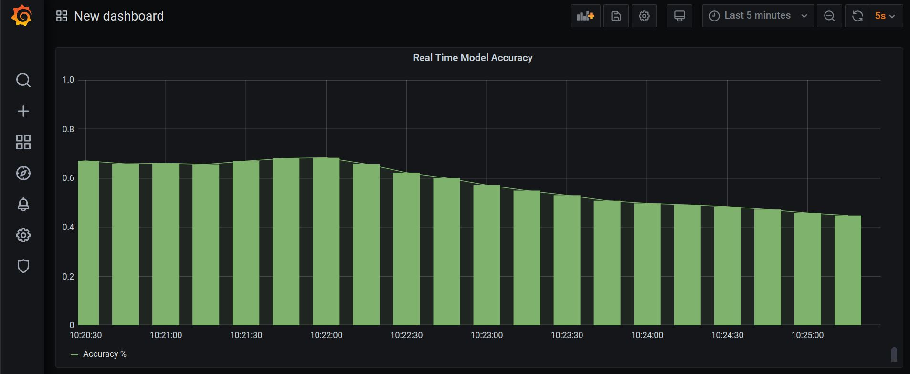
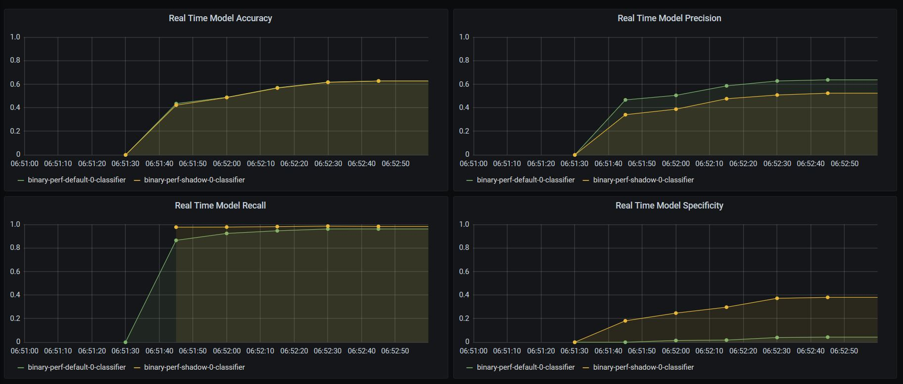
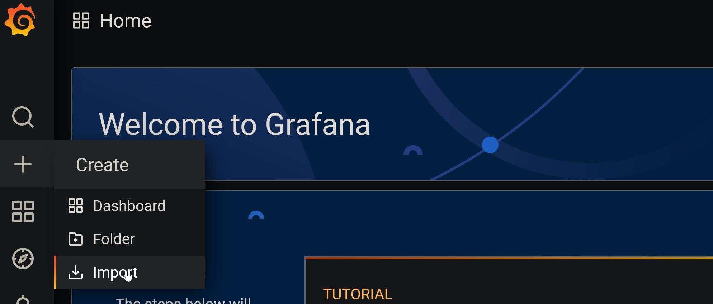
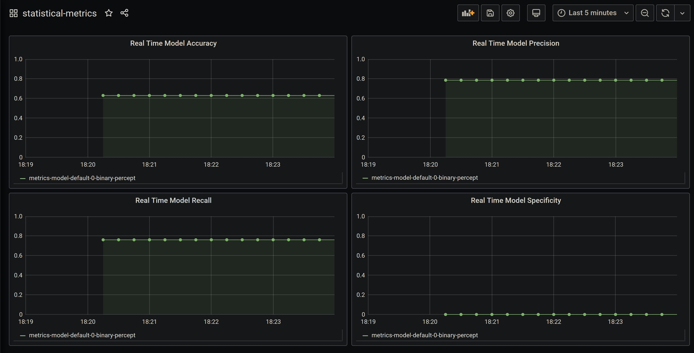

## Seldon Core Basic Statistical Metrics with Feedback Reward

In this notebook we will show how it is possible to leverage the existing "Feedback Reward" capabilities of Seldon Core to enable stateful metrics for real time statistical monitoring of production Seldon Core models.

<table>
<tr>
    
<td width="50%">

</td>
    
<td width="50%">

</td>
    
</tr>
</table>

To go ahead with the notebook, you will need to install the following components based on the documentation:
* Install [Seldon Core](https://docs.seldon.io/projects/seldon-core/en/latest/workflow/install.html)
* Install [Seldon Core Analytics](https://docs.seldon.io/projects/seldon-core/en/latest/analytics/analytics.html)
* Configure Seldon with an ingress (such as [istio](https://docs.seldon.io/projects/seldon-core/en/latest/ingress/istio.html) or ambassador)

In this tutorial we will:
1. Train a set of python models to compare
2. Write a language wrapper with custom metrics
3. Deploy model and send predictions and feedback
4. Visualise accuracy metrics on grafana dashboard
5. Deploy second model and visualise performance in real time

#### Setup Dependencies


```python
%%writefile requirements.txt
joblib==0.14.1
scikit-learn==0.20.3
```

    Writing requirements.txt


```python
!pip install -r requirements.txt
```

#### Train a simple breast cancer classifier

We will train two models, one with a perceptron and one with a logisticRegresson model, so we can compare the performance


```python
import joblib
from sklearn.pipeline import Pipeline
from sklearn.linear_model import LogisticRegression, Perceptron
from sklearn import datasets
from sklearn.model_selection import train_test_split

parameters = [
    {"clf": LogisticRegression(solver="liblinear", multi_class="ovr"), "name": "binary-lr.joblib"},
    {"clf": Perceptron(n_iter=40, eta0=0.1, random_state=0), "name": "binary-percept.joblib"},
]

X, y = datasets.load_breast_cancer(return_X_y=True)
X_train, X_test, y_train, y_test = train_test_split(X, y, test_size=0.9)

for param in parameters:
    clf = param["clf"]
    clf.fit(X_train, y_train)

    print(f"Saving model in {param['name']}")
    joblib.dump(clf, param['name'])
```

    Saving model in binary-lr.joblib
    Saving model in binary-percept.joblib


    /home/alejandro/miniconda3/lib/python3.7/site-packages/sklearn/linear_model/stochastic_gradient.py:152: DeprecationWarning: n_iter parameter is deprecated in 0.19 and will be removed in 0.21. Use max_iter and tol instead.
      DeprecationWarning)


```python
!ls
```

    README.ipynb  binary-lr.joblib	binary-percept.joblib  requirements.txt


#### Write a Seldon Language Wrapper


```python
%%writefile MetricsModel.py

import joblib

class Score:
    def __init__(self, TP, FP, TN, FN):
        self.TP = TP
        self.FP = FP
        self.TN = TN
        self.FN = FN

class MetricsModel:
    def __init__(self, model_name="binary-lr.joblib"):
        self.scores = Score(0, 0, 0, 0)
        self.model = joblib.load(model_name)
        self.model_name = model_name.split()[0]

    def predict(self, X, features_names=None, meta=None):
        return self.model.predict(X)

    def send_feedback(self, features, feature_names, reward, truth, routing=""):
        predicted = self.predict(features)
        print(f"Predicted: {predicted[0]}, Truth: {truth[0]}")
        if int(truth[0]) == 1:
            if int(predicted[0]) == int(truth[0]):
                self.scores.TP += 1
            else:
                self.scores.FN += 1
        else:
            if int(predicted[0]) == int(truth[0]):
                self.scores.TN += 1
            else:
                self.scores.FP += 1
        return []  # Ignore return statement as its not used

    def metrics(self):
        return [
            {"type": "GAUGE", "key": f"true_pos", "value": self.scores.TP},
            {"type": "GAUGE", "key": f"true_neg", "value": self.scores.FN},
            {"type": "GAUGE", "key": f"false_pos", "value": self.scores.TN},
            {"type": "GAUGE", "key": f"false_neg", "value": self.scores.FP},
        ]
```

    Overwriting MetricsModel.py


#### Containerise model

Now we can containerise our model using the seldon utilities, we will be able to leverage the `requirements.txt` above to install all dependencies.


```python
!s2i build . seldonio/seldon-core-s2i-python37:1.3.0-dev metrics_model:0.1 \
        --env MODEL_NAME="MetricsModel" --env API_TYPE=REST --env SERVICE_TYPE=MODEL --env PERSISTENCE=0
```

    ---> Installing application source...
    ---> Installing dependencies ...
    Looking in links: /whl
    Collecting joblib==0.14.1 (from -r requirements.txt (line 1))
      WARNING: Url '/whl' is ignored. It is either a non-existing path or lacks a specific scheme.
    Downloading https://files.pythonhosted.org/packages/28/5c/cf6a2b65a321c4a209efcdf64c2689efae2cb62661f8f6f4bb28547cf1bf/joblib-0.14.1-py2.py3-none-any.whl (294kB)
    Collecting scikit-learn==0.20.3 (from -r requirements.txt (line 2))
      WARNING: Url '/whl' is ignored. It is either a non-existing path or lacks a specific scheme.
    Downloading https://files.pythonhosted.org/packages/aa/cc/a84e1748a2a70d0f3e081f56cefc634f3b57013b16faa6926d3a6f0598df/scikit_learn-0.20.3-cp37-cp37m-manylinux1_x86_64.whl (5.4MB)
    Collecting scipy>=0.13.3 (from scikit-learn==0.20.3->-r requirements.txt (line 2))
      WARNING: Url '/whl' is ignored. It is either a non-existing path or lacks a specific scheme.
    Downloading https://files.pythonhosted.org/packages/65/f9/f7a7e5009711579c72da2725174825e5056741bf4001815d097eef1b2e17/scipy-1.5.2-cp37-cp37m-manylinux1_x86_64.whl (25.9MB)
    Requirement already satisfied: numpy>=1.8.2 in /opt/conda/lib/python3.7/site-packages (from scikit-learn==0.20.3->-r requirements.txt (line 2)) (1.19.1)
    Installing collected packages: joblib, scipy, scikit-learn
    Successfully installed joblib-0.14.1 scikit-learn-0.20.3 scipy-1.5.2
    Collecting pip-licenses
    Downloading https://files.pythonhosted.org/packages/c5/50/6c4b4e69a0c43bd9f03a30579695093062ba72da4e3e4026cd2144dbcc71/pip_licenses-2.3.0-py3-none-any.whl
    Collecting PTable (from pip-licenses)
    Downloading https://files.pythonhosted.org/packages/ab/b3/b54301811173ca94119eb474634f120a49cd370f257d1aae5a4abaf12729/PTable-0.9.2.tar.gz
    Building wheels for collected packages: PTable
    Building wheel for PTable (setup.py): started
    Building wheel for PTable (setup.py): finished with status 'done'
    Created wheel for PTable: filename=PTable-0.9.2-cp37-none-any.whl size=22906 sha256=bbdf078ec2fc20eee868dc4a4e9daa49e418a4f6fefa09315d53d8bb370cd6a3
    Stored in directory: /root/.cache/pip/wheels/22/cc/2e/55980bfe86393df3e9896146a01f6802978d09d7ebcba5ea56
    Successfully built PTable
    Installing collected packages: PTable, pip-licenses
    Successfully installed PTable-0.9.2 pip-licenses-2.3.0
    created path: ./licenses/license_info.csv
    created path: ./licenses/license.txt
    Build completed successfully


#### Deploy model

Now that we've containerised our model, we can deploy it using Seldon, so we get a microservice for our model.


```bash
%%bash
kubectl apply -n seldon -f - <<END
apiVersion: machinelearning.seldon.io/v1
kind: SeldonDeployment
metadata:
  name: metrics-model
spec:
  name: metrics-model
  predictors:
  - componentSpecs:
    - spec:
        containers:
        - image: metrics_model:0.1
          imagePullPolicy: IfNotPresent
          name: binary-percept
    graph:
      children: []
      endpoint:
        type: REST
      parameters:
      - name: model_name
        type: STRING
        value: binary-percept.joblib
      name: binary-percept
      type: MODEL
    name: default
    replicas: 1
END
```

    seldondeployment.machinelearning.seldon.io/metrics-model created


#### Send Predictions

We will test with some of the test data, by sending the first available param


```python
print(f"Data point to predict: {X_test[[101]]}\n")
print(f"Expected class: {y_test[101]}")
```

    Data point to predict: [[1.447e+01 2.499e+01 9.581e+01 6.564e+02 8.837e-02 1.230e-01 1.009e-01
      3.890e-02 1.872e-01 6.341e-02 2.542e-01 1.079e+00 2.615e+00 2.311e+01
      7.138e-03 4.653e-02 3.829e-02 1.162e-02 2.068e-02 6.111e-03 1.622e+01
      3.173e+01 1.135e+02 8.089e+02 1.340e-01 4.202e-01 4.040e-01 1.205e-01
      3.187e-01 1.023e-01]]
    
    Expected class: 1


Using our python client to send the prediction


```python
from seldon_core.seldon_client import SeldonClient

sc = SeldonClient(namespace="seldon", gateway_endpoint="localhost:80", deployment_name="metrics-model", payload_type="ndarray")
```


```python
y_res = sc.predict(data=X[[101]])

print(f"Raw Response: {y_res.response}\n")
print(f"Predicted Class: {y_res.response['data']['ndarray']}")
print(f"Expected class: {y_test[101]}")
```

    Raw Response: {'data': {'names': [], 'ndarray': [1]}, 'meta': {'metrics': [{'key': 'true_pos', 'type': 'GAUGE', 'value': 0}, {'key': 'true_neg', 'type': 'GAUGE', 'value': 0}, {'key': 'false_pos', 'type': 'GAUGE', 'value': 0}, {'key': 'false_neg', 'type': 'GAUGE', 'value': 0}]}}
    
    Predicted Class: [1]
    Expected class: 1


#### Sending Feedback

Whilst the predict requests go through the predict function, the feedback requests go through the send_feedback function.

In order to send feedback, we have to also follow the schema for send feedback, which allows us to send "request", "response", "truth" and "reward".

In the feedback scoring section of the Seldon documentation we cover in detail all the different approaches to feedback. 

Here we provide a simple example where feedbacks cores is dynamically calculated in the python model itself.

We will then be able to visualise the feedback that was sent to the models.


```python
import requests

url = "http://localhost:80/seldon/seldon/metrics-model/api/v1.0/feedback"

for x_i, y_i in zip(X_test, y_test):
    data = {"request": {"data": {"ndarray": [x_i.tolist()]}}, "truth":{"data": {"ndarray": [[y_i.tolist()]]}}}
    requests.post(f"{url}", json=data)
```

#### View Metrics

Now we can view the initial metrics in our current model by opening the grafana.

You can start forwarding the port with the following command:

```
kubectl port-forward -n seldon-system svc/seldon-core-analytics-grafana 7000:80
```

Then you can accessing it at [http://localhost:7000](http://localhost:7000). The username is `admin` and password is `password.

Now when you access the dashboard, you have to import the dashboard, first by going to the following section:
   


And then in the box you can add the code below for the dashboard:


```python
{"annotations": {"list": [{"builtIn": 1,"datasource": "-- Grafana --","enable": true,"hide": true,"iconColor": "rgba(0, 211, 255, 1)","name": "Annotations & Alerts","type": "dashboard"}]},"editable": true,"gnetId": null,"graphTooltip": 0,"id": 4,"links": [],"panels": [{"aliasColors": {},"bars": false,"dashLength": 10,"dashes": false,"datasource": "prometheus","description": "","fieldConfig": {"defaults": {"custom": {},"mappings": [],"thresholds": {"mode": "absolute","steps": [{"color": "green","value": null},{"color": "red","value": 80}]}},"overrides": []},"fill": 1,"fillGradient": 0,"gridPos": {"h": 8,"w": 12,"x": 0,"y": 0},"hiddenSeries": false,"id": 2,"legend": {"avg": false,"current": false,"max": false,"min": false,"show": true,"total": false,"values": false},"lines": true,"linewidth": 1,"nullPointMode": "null","options": {"dataLinks": []},"percentage": false,"pluginVersion": "7.0.3","pointradius": 2,"points": true,"renderer": "flot","seriesOverrides": [],"spaceLength": 10,"stack": false,"steppedLine": false,"targets": [{"expr": "(sum(true_pos{method=\"feedback\"} + true_neg{method=\"feedback\"}) by (seldon_app)) / (sum(true_pos{method=\"feedback\"} + true_neg{method=\"feedback\"} + false_pos{method=\"feedback\"} + false_neg{method=\"feedback\"}) by (seldon_app))","interval": "","legendFormat": "{{seldon_app}}","refId": "A"}],"thresholds": [],"timeFrom": null,"timeRegions": [],"timeShift": null,"title": "Real Time Model Accuracy","tooltip": {"shared": true,"sort": 0,"value_type": "individual"},"type": "graph","xaxis": {"buckets": null,"mode": "time","name": null,"show": true,"values": []},"yaxes": [{"decimals": null,"format": "short","label": null,"logBase": 1,"max": "1","min": "0","show": true},{"format": "short","label": null,"logBase": 1,"max": null,"min": null,"show": true}],"yaxis": {"align": false,"alignLevel": null}},{"aliasColors": {},"bars": false,"dashLength": 10,"dashes": false,"datasource": "prometheus","description": "","fieldConfig": {"defaults": {"custom": {"align": null},"mappings": [],"thresholds": {"mode": "absolute","steps": [{"color": "green","value": null},{"color": "red","value": 80}]}},"overrides": []},"fill": 1,"fillGradient": 0,"gridPos": {"h": 8,"w": 12,"x": 12,"y": 0},"hiddenSeries": false,"id": 3,"legend": {"avg": false,"current": false,"max": false,"min": false,"show": true,"total": false,"values": false},"lines": true,"linewidth": 1,"nullPointMode": "null","options": {"dataLinks": []},"percentage": false,"pluginVersion": "7.0.3","pointradius": 2,"points": true,"renderer": "flot","seriesOverrides": [],"spaceLength": 10,"stack": false,"steppedLine": false,"targets": [{"expr": "(sum(true_pos{method=\"feedback\"}) by (seldon_app)) / (sum(true_pos{method=\"feedback\"} + false_pos{method=\"feedback\"}) by (seldon_app))","interval": "","legendFormat": "{{seldon_app}}","refId": "A"}],"thresholds": [],"timeFrom": null,"timeRegions": [],"timeShift": null,"title": "Real Time Model Precision","tooltip": {"shared": true,"sort": 0,"value_type": "individual"},"type": "graph","xaxis": {"buckets": null,"mode": "time","name": null,"show": true,"values": []},"yaxes": [{"decimals": null,"format": "short","label": null,"logBase": 1,"max": "1","min": "0","show": true},{"format": "short","label": null,"logBase": 1,"max": null,"min": null,"show": true}],"yaxis": {"align": false,"alignLevel": null}},{"aliasColors": {},"bars": false,"dashLength": 10,"dashes": false,"datasource": "prometheus","description": "","fieldConfig": {"defaults": {"custom": {},"mappings": [],"thresholds": {"mode": "absolute","steps": [{"color": "green","value": null},{"color": "red","value": 80}]}},"overrides": []},"fill": 1,"fillGradient": 0,"gridPos": {"h": 8,"w": 12,"x": 0,"y": 8},"hiddenSeries": false,"id": 5,"legend": {"avg": false,"current": false,"max": false,"min": false,"show": true,"total": false,"values": false},"lines": true,"linewidth": 1,"nullPointMode": "null","options": {"dataLinks": []},"percentage": false,"pluginVersion": "7.0.3","pointradius": 2,"points": true,"renderer": "flot","seriesOverrides": [],"spaceLength": 10,"stack": false,"steppedLine": false,"targets": [{"expr": "(sum(true_pos{method=\"feedback\"}) by (seldon_app)) / (sum(true_pos{method=\"feedback\"} + false_neg{method=\"feedback\"}) by (seldon_app))","interval": "","legendFormat": "{{seldon_app}}","refId": "A"}],"thresholds": [],"timeFrom": null,"timeRegions": [],"timeShift": null,"title": "Real Time Model Recall","tooltip": {"shared": true,"sort": 0,"value_type": "individual"},"type": "graph","xaxis": {"buckets": null,"mode": "time","name": null,"show": true,"values": []},"yaxes": [{"decimals": null,"format": "short","label": null,"logBase": 1,"max": "1","min": "0","show": true},{"format": "short","label": null,"logBase": 1,"max": null,"min": null,"show": true}],"yaxis": {"align": false,"alignLevel": null}},{"aliasColors": {},"bars": false,"dashLength": 10,"dashes": false,"datasource": "prometheus","description": "","fieldConfig": {"defaults": {"custom": {},"mappings": [],"thresholds": {"mode": "absolute","steps": [{"color": "green","value": null},{"color": "red","value": 80}]}},"overrides": []},"fill": 1,"fillGradient": 0,"gridPos": {"h": 8,"w": 12,"x": 12,"y": 8},"hiddenSeries": false,"id": 4,"legend": {"avg": false,"current": false,"max": false,"min": false,"show": true,"total": false,"values": false},"lines": true,"linewidth": 1,"nullPointMode": "null","options": {"dataLinks": []},"percentage": false,"pluginVersion": "7.0.3","pointradius": 2,"points": true,"renderer": "flot","seriesOverrides": [],"spaceLength": 10,"stack": false,"steppedLine": false,"targets": [{"expr": "(sum(true_neg{method=\"feedback\"}) by (seldon_app)) / (sum(true_neg{method=\"feedback\"} + false_pos{method=\"feedback\"}) by (seldon_app))","interval": "","legendFormat": "{{seldon_app}}","refId": "A"}],"thresholds": [],"timeFrom": null,"timeRegions": [],"timeShift": null,"title": "Real Time Model Specificity","tooltip": {"shared": true,"sort": 0,"value_type": "individual"},"type": "graph","xaxis": {"buckets": null,"mode": "time","name": null,"show": true,"values": []},"yaxes": [{"decimals": null,"format": "short","label": null,"logBase": 1,"max": "1","min": "0","show": true},{"format": "short","label": null,"logBase": 1,"max": null,"min": null,"show": true}],"yaxis": {"align": false,"alignLevel": null}}],"refresh": "5s","schemaVersion": 25,"style": "dark","tags": [],"templating": {"list": []},"time": {"from": "now-5m","to": "now"},"timepicker": {"refresh_intervals": ["10s","30s","1m","5m","15m","30m","1h","2h","1d"],"time_options": ["5m","15m","1h","6h","12h","24h","2d","7d","30d"]},"timezone": "browser","title": "statistical-metrics","uid": "zmkrlZ7Gk","version": 4}
```

Once you import the dashboard you should be able to see the model as follows:
    


#### Real Time Model Performance

Now we can actually run two models at the same time and compare the performance of both.

We will be able to assess in real time which model is performing better.

We first deploy both of our models as a shadow deployment (so the requests get sent to both models):


```python
!kubectl delete sdep -n seldon metrics-model
```

    seldondeployment.machinelearning.seldon.io "metrics-model" deleted


```bash
%%bash
kubectl apply -n seldon -f - <<END
apiVersion: machinelearning.seldon.io/v1
kind: SeldonDeployment
metadata:
  name: ab-test
spec:
  name: ab-test
  predictors:
  - componentSpecs:
    - spec:
        containers:
        - image: metrics_model:0.1
          imagePullPolicy: IfNotPresent
          name: percept-model
    graph:
      children: []
      endpoint:
        type: REST
      parameters:
      - name: model_name
        type: STRING
        value: binary-percept.joblib
      name: percept-model
      type: MODEL
    name: default
    replicas: 1
  - componentSpecs:
    - spec:
        containers:
        - image: metrics_model:0.1
          imagePullPolicy: IfNotPresent
          name: lr-model
    graph:
      children: []
      endpoint:
        type: REST
      parameters:
      - name: model_name
        type: STRING
        value: binary-lr.joblib
      name: lr-model
      type: MODEL
    name: shadow
    replicas: 1
    shadow: true
END
```

    seldondeployment.machinelearning.seldon.io/ab-test created


```python
#### Test with a single prediction
```


```python
from seldon_core.seldon_client import SeldonClient

sc = SeldonClient(namespace="seldon", gateway_endpoint="localhost:80", deployment_name="ab-test", payload_type="ndarray")

y_res = sc.predict(data=X[[101]])

print(f"Raw Response: {y_res.response}\n")
print(f"Predicted Class: {y_res.response['data']['ndarray']}")
print(f"Expected class: {y_test[101]}")
```

    Raw Response: {'data': {'names': [], 'ndarray': [1]}, 'meta': {'metrics': [{'key': 'true_pos', 'type': 'GAUGE', 'value': 0}, {'key': 'true_neg', 'type': 'GAUGE', 'value': 0}, {'key': 'false_pos', 'type': 'GAUGE', 'value': 0}, {'key': 'false_neg', 'type': 'GAUGE', 'value': 0}]}}
    
    Predicted Class: [1]
    Expected class: 1


#### Send feedback to both models

Now that we have a shadow deployment with both models we just need to send the request to the main deployment, and the traffic will be split dynamically.


```python
import requests
import time

url = "http://localhost:80/seldon/seldon/ab-test/api/v1.0/feedback"

for x_i, y_i in zip(X_test, y_test):
    data = {"request": {"data": {"ndarray": [x_i.tolist()]}}, "truth":{"data": {"ndarray": [y_i.tolist()]}}}
    requests.post(f"{url}", json=data)
    time.sleep(0.3)
```

### Real time dashboard

Now we can see the real time dashboard for our two models.


```python

```
