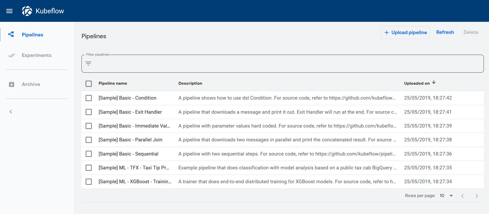

# Kubeflow NLP end-to-end with Seldon

In this example we showcase how to build re-usable components to build an ML pipeline that can be trained and deployed at scale.

We will automate content moderation on the Reddit comments in /r/science building a machine learning NLP model with the following components:


This tutorial will break down in the following sections:

1) TODO

Let's get started! 🚀🔥

# Before you start
Make sure you install the following dependencies, as they are critical for this example to work:

* Helm v2.13.1+
* A Kubernetes cluster running v1.13 or above (minkube / docker-for-windows work well if enough RAM)
* kubectl v1.14+
* ksonnet v0.13.1+
* kfctl 0.5.2 - Please use this exact version as there are major changes every few months
* Python 3.6+
* Python DEV requirements (we'll install them below)


```python
# You can also install the python dependencies that we'll need to build and test:
!pip install -r requirements-dev.txt
```

    Collecting https://storage.googleapis.com/ml-pipeline/release/0.1.20/kfp.tar.gz (from -r requirements-dev.txt (line 2))
      Using cached https://storage.googleapis.com/ml-pipeline/release/0.1.20/kfp.tar.gz
    Requirement already satisfied (use --upgrade to upgrade): kfp==0.1.20 from https://storage.googleapis.com/ml-pipeline/release/0.1.20/kfp.tar.gz in /home/alejandro/miniconda3/envs/reddit-classification/lib/python3.7/site-packages (from -r requirements-dev.txt (line 2))
    Requirement already satisfied: python-dateutil in /home/alejandro/miniconda3/envs/reddit-classification/lib/python3.7/site-packages (from -r requirements-dev.txt (line 1)) (2.8.0)
    Requirement already satisfied: kubernetes in /home/alejandro/miniconda3/envs/reddit-classification/lib/python3.7/site-packages (from -r requirements-dev.txt (line 3)) (9.0.0)
    Requirement already satisfied: click in /home/alejandro/miniconda3/envs/reddit-classification/lib/python3.7/site-packages (from -r requirements-dev.txt (line 4)) (7.0)
    Requirement already satisfied: urllib3<1.25,>=1.15 in /home/alejandro/miniconda3/envs/reddit-classification/lib/python3.7/site-packages (from kfp==0.1.20->-r requirements-dev.txt (line 2)) (1.24.2)
    Requirement already satisfied: six>=1.10 in /home/alejandro/miniconda3/envs/reddit-classification/lib/python3.7/site-packages (from kfp==0.1.20->-r requirements-dev.txt (line 2)) (1.12.0)
    Requirement already satisfied: certifi in /home/alejandro/miniconda3/envs/reddit-classification/lib/python3.7/site-packages (from kfp==0.1.20->-r requirements-dev.txt (line 2)) (2019.3.9)
    Requirement already satisfied: PyYAML in /home/alejandro/.local/lib/python3.7/site-packages (from kfp==0.1.20->-r requirements-dev.txt (line 2)) (3.13)
    Requirement already satisfied: google-cloud-storage>=1.13.0 in /home/alejandro/miniconda3/envs/reddit-classification/lib/python3.7/site-packages (from kfp==0.1.20->-r requirements-dev.txt (line 2)) (1.13.0)
    Requirement already satisfied: PyJWT>=1.6.4 in /home/alejandro/miniconda3/envs/reddit-classification/lib/python3.7/site-packages (from kfp==0.1.20->-r requirements-dev.txt (line 2)) (1.7.1)
    Requirement already satisfied: cryptography>=2.4.2 in /home/alejandro/miniconda3/envs/reddit-classification/lib/python3.7/site-packages (from kfp==0.1.20->-r requirements-dev.txt (line 2)) (2.6.1)
    Requirement already satisfied: google-auth>=1.6.1 in /home/alejandro/miniconda3/envs/reddit-classification/lib/python3.7/site-packages (from kfp==0.1.20->-r requirements-dev.txt (line 2)) (1.6.3)
    Requirement already satisfied: requests_toolbelt>=0.8.0 in /home/alejandro/miniconda3/envs/reddit-classification/lib/python3.7/site-packages (from kfp==0.1.20->-r requirements-dev.txt (line 2)) (0.9.1)
    Requirement already satisfied: kfp-server-api<0.1.19,>=0.1.18 in /home/alejandro/miniconda3/envs/reddit-classification/lib/python3.7/site-packages (from kfp==0.1.20->-r requirements-dev.txt (line 2)) (0.1.18.2)
    Requirement already satisfied: setuptools>=21.0.0 in /home/alejandro/miniconda3/envs/reddit-classification/lib/python3.7/site-packages (from kubernetes->-r requirements-dev.txt (line 3)) (41.0.0)
    Requirement already satisfied: requests-oauthlib in /home/alejandro/miniconda3/envs/reddit-classification/lib/python3.7/site-packages (from kubernetes->-r requirements-dev.txt (line 3)) (1.2.0)
    Requirement already satisfied: websocket-client!=0.40.0,!=0.41.*,!=0.42.*,>=0.32.0 in /home/alejandro/miniconda3/envs/reddit-classification/lib/python3.7/site-packages (from kubernetes->-r requirements-dev.txt (line 3)) (0.56.0)
    Requirement already satisfied: requests in /home/alejandro/miniconda3/envs/reddit-classification/lib/python3.7/site-packages (from kubernetes->-r requirements-dev.txt (line 3)) (2.21.0)
    Requirement already satisfied: google-resumable-media>=0.3.1 in /home/alejandro/miniconda3/envs/reddit-classification/lib/python3.7/site-packages (from google-cloud-storage>=1.13.0->kfp==0.1.20->-r requirements-dev.txt (line 2)) (0.3.2)
    Requirement already satisfied: google-cloud-core<0.29dev,>=0.28.0 in /home/alejandro/miniconda3/envs/reddit-classification/lib/python3.7/site-packages (from google-cloud-storage>=1.13.0->kfp==0.1.20->-r requirements-dev.txt (line 2)) (0.28.1)
    Requirement already satisfied: google-api-core<2.0.0dev,>=0.1.1 in /home/alejandro/miniconda3/envs/reddit-classification/lib/python3.7/site-packages (from google-cloud-storage>=1.13.0->kfp==0.1.20->-r requirements-dev.txt (line 2)) (1.11.0)
    Requirement already satisfied: asn1crypto>=0.21.0 in /home/alejandro/miniconda3/envs/reddit-classification/lib/python3.7/site-packages (from cryptography>=2.4.2->kfp==0.1.20->-r requirements-dev.txt (line 2)) (0.24.0)
    Requirement already satisfied: cffi!=1.11.3,>=1.8 in /home/alejandro/miniconda3/envs/reddit-classification/lib/python3.7/site-packages (from cryptography>=2.4.2->kfp==0.1.20->-r requirements-dev.txt (line 2)) (1.12.3)
    Requirement already satisfied: rsa>=3.1.4 in /home/alejandro/.local/lib/python3.7/site-packages (from google-auth>=1.6.1->kfp==0.1.20->-r requirements-dev.txt (line 2)) (3.4.2)
    Requirement already satisfied: pyasn1-modules>=0.2.1 in /home/alejandro/miniconda3/envs/reddit-classification/lib/python3.7/site-packages (from google-auth>=1.6.1->kfp==0.1.20->-r requirements-dev.txt (line 2)) (0.2.5)
    Requirement already satisfied: cachetools>=2.0.0 in /home/alejandro/miniconda3/envs/reddit-classification/lib/python3.7/site-packages (from google-auth>=1.6.1->kfp==0.1.20->-r requirements-dev.txt (line 2)) (3.1.0)
    Requirement already satisfied: oauthlib>=3.0.0 in /home/alejandro/miniconda3/envs/reddit-classification/lib/python3.7/site-packages (from requests-oauthlib->kubernetes->-r requirements-dev.txt (line 3)) (3.0.1)
    Requirement already satisfied: idna<2.9,>=2.5 in /home/alejandro/miniconda3/envs/reddit-classification/lib/python3.7/site-packages (from requests->kubernetes->-r requirements-dev.txt (line 3)) (2.8)
    Requirement already satisfied: chardet<3.1.0,>=3.0.2 in /home/alejandro/miniconda3/envs/reddit-classification/lib/python3.7/site-packages (from requests->kubernetes->-r requirements-dev.txt (line 3)) (3.0.4)
    Requirement already satisfied: pytz in /home/alejandro/miniconda3/envs/reddit-classification/lib/python3.7/site-packages (from google-api-core<2.0.0dev,>=0.1.1->google-cloud-storage>=1.13.0->kfp==0.1.20->-r requirements-dev.txt (line 2)) (2019.1)
    Requirement already satisfied: googleapis-common-protos!=1.5.4,<2.0dev,>=1.5.3 in /home/alejandro/miniconda3/envs/reddit-classification/lib/python3.7/site-packages (from google-api-core<2.0.0dev,>=0.1.1->google-cloud-storage>=1.13.0->kfp==0.1.20->-r requirements-dev.txt (line 2)) (1.6.0)
    Requirement already satisfied: protobuf>=3.4.0 in /home/alejandro/miniconda3/envs/reddit-classification/lib/python3.7/site-packages (from google-api-core<2.0.0dev,>=0.1.1->google-cloud-storage>=1.13.0->kfp==0.1.20->-r requirements-dev.txt (line 2)) (3.6.1)
    Requirement already satisfied: pycparser in /home/alejandro/miniconda3/envs/reddit-classification/lib/python3.7/site-packages (from cffi!=1.11.3,>=1.8->cryptography>=2.4.2->kfp==0.1.20->-r requirements-dev.txt (line 2)) (2.19)
    Requirement already satisfied: pyasn1>=0.1.3 in /home/alejandro/.local/lib/python3.7/site-packages (from rsa>=3.1.4->google-auth>=1.6.1->kfp==0.1.20->-r requirements-dev.txt (line 2)) (0.4.5)
    Building wheels for collected packages: kfp
      Building wheel for kfp (setup.py) ... [?25ldone
    [?25h  Stored in directory: /tmp/pip-ephem-wheel-cache-4b2ca_6e/wheels/ae/bb/02/32b1356ee756181099d8f1b0950ac6567cb2b38e71b48f02e8
    Successfully built kfp


# Create project
Kubeflow's CLI allows us to create a project which will allow us to build the configuration we need to deploy our kubeflow and seldon clusters.


```python
!kfctl init kubeflow-seldon
!ls kubeflow-seldon
```

Now we run the following commands to basically launch our Kubeflow cluster with all its components. 

It may take a while to download all the images for Kubeflow so feel free to make yourself a cup of ☕.

If you have a terminal you can see how the containers are created in real-time by running `kubectl get pods -n kubeflow -w`.


```bash
%%bash
cd kubeflow-seldon
kfctl generate all -V
kfctl apply all -V
```

    time="2019-05-25T18:24:21+01:00" level=info msg="reading from /home/alejandro/Programming/kubernetes/seldon/seldon-core/examples/kubeflow/kubeflow-seldon/app.yaml" filename="coordinator/coordinator.go:341"
    time="2019-05-25T18:24:21+01:00" level=info msg="reading from /home/alejandro/Programming/kubernetes/seldon/seldon-core/examples/kubeflow/kubeflow-seldon/app.yaml" filename="coordinator/coordinator.go:341"
    time="2019-05-25T18:24:21+01:00" level=info msg="Ksonnet.Generate Name kubeflow-seldon AppDir /home/alejandro/Programming/kubernetes/seldon/seldon-core/examples/kubeflow/kubeflow-seldon Platform " filename="ksonnet/ksonnet.go:369"
    time="2019-05-25T18:24:21+01:00" level=info msg="Creating environment \"default\" with namespace \"kubeflow\", pointing to \"version:v1.13.0\" cluster at address \"https://localhost:6445\"" filename="env/create.go:77"
    time="2019-05-25T18:24:25+01:00" level=info msg="Generating ksonnet-lib data at path '/home/alejandro/Programming/kubernetes/seldon/seldon-core/examples/kubeflow/kubeflow-seldon/ks_app/lib/ksonnet-lib/v1.13.0'" filename="lib/lib.go:148"
    time="2019-05-25T18:24:25+01:00" level=info msg="Successfully initialized the app kubeflow-seldon." filename="ksonnet/ksonnet.go:505"
    time="2019-05-25T18:24:25+01:00" level=info msg="App kubeflow-seldon add registry kubeflow URI /home/alejandro/Programming/kubernetes/seldon/seldon-core/examples/kubeflow/kubeflow-seldon/.cache/v0.5.1/kubeflow" filename="ksonnet/ksonnet.go:621"
    time="2019-05-25T18:24:25+01:00" level=info msg="Retrieved 6 files" filename="registry/cache.go:114"
    time="2019-05-25T18:24:25+01:00" level=info msg="Retrieved 22 files" filename="registry/cache.go:114"
    time="2019-05-25T18:24:25+01:00" level=info msg="Retrieved 9 files" filename="registry/cache.go:114"
    time="2019-05-25T18:24:25+01:00" level=info msg="Retrieved 35 files" filename="registry/cache.go:114"
    time="2019-05-25T18:24:25+01:00" level=info msg="Retrieved 49 files" filename="registry/cache.go:114"
    time="2019-05-25T18:24:25+01:00" level=info msg="Retrieved 6 files" filename="registry/cache.go:114"
    time="2019-05-25T18:24:25+01:00" level=info msg="Retrieved 4 files" filename="registry/cache.go:114"
    time="2019-05-25T18:24:25+01:00" level=info msg="Retrieved 4 files" filename="registry/cache.go:114"
    time="2019-05-25T18:24:25+01:00" level=info msg="Retrieved 9 files" filename="registry/cache.go:114"
    time="2019-05-25T18:24:25+01:00" level=info msg="Retrieved 14 files" filename="registry/cache.go:114"
    time="2019-05-25T18:24:25+01:00" level=info msg="Retrieved 6 files" filename="registry/cache.go:114"
    time="2019-05-25T18:24:25+01:00" level=info msg="Retrieved 17 files" filename="registry/cache.go:114"
    time="2019-05-25T18:24:25+01:00" level=info msg="Retrieved 8 files" filename="registry/cache.go:114"
    time="2019-05-25T18:24:25+01:00" level=info msg="Retrieved 12 files" filename="registry/cache.go:114"
    time="2019-05-25T18:24:25+01:00" level=info msg="Retrieved 4 files" filename="registry/cache.go:114"
    time="2019-05-25T18:24:25+01:00" level=info msg="Creating Component: ambassador ..." filename="ksonnet/ksonnet.go:207"
    time="2019-05-25T18:24:25+01:00" level=info msg="Args: [ambassador ambassador]" filename="ksonnet/ksonnet.go:208"
    time="2019-05-25T18:24:25+01:00" level=info msg="Writing component at '/home/alejandro/Programming/kubernetes/seldon/seldon-core/examples/kubeflow/kubeflow-seldon/ks_app/components/ambassador.jsonnet'" filename="component/create.go:92"
    time="2019-05-25T18:24:25+01:00" level=info msg="Creating Component: argo ..." filename="ksonnet/ksonnet.go:207"
    time="2019-05-25T18:24:25+01:00" level=info msg="Args: [argo argo]" filename="ksonnet/ksonnet.go:208"
    time="2019-05-25T18:24:25+01:00" level=info msg="Writing component at '/home/alejandro/Programming/kubernetes/seldon/seldon-core/examples/kubeflow/kubeflow-seldon/ks_app/components/argo.jsonnet'" filename="component/create.go:92"
    time="2019-05-25T18:24:25+01:00" level=info msg="Creating Component: centraldashboard ..." filename="ksonnet/ksonnet.go:207"
    time="2019-05-25T18:24:25+01:00" level=info msg="Args: [centraldashboard centraldashboard]" filename="ksonnet/ksonnet.go:208"
    time="2019-05-25T18:24:26+01:00" level=info msg="Writing component at '/home/alejandro/Programming/kubernetes/seldon/seldon-core/examples/kubeflow/kubeflow-seldon/ks_app/components/centraldashboard.jsonnet'" filename="component/create.go:92"
    time="2019-05-25T18:24:26+01:00" level=info msg="Creating Component: jupyter-web-app ..." filename="ksonnet/ksonnet.go:207"
    time="2019-05-25T18:24:26+01:00" level=info msg="Args: [jupyter-web-app jupyter-web-app]" filename="ksonnet/ksonnet.go:208"
    time="2019-05-25T18:24:26+01:00" level=info msg="Writing component at '/home/alejandro/Programming/kubernetes/seldon/seldon-core/examples/kubeflow/kubeflow-seldon/ks_app/components/jupyter-web-app.jsonnet'" filename="component/create.go:92"
    time="2019-05-25T18:24:26+01:00" level=info msg="Creating Component: katib ..." filename="ksonnet/ksonnet.go:207"
    time="2019-05-25T18:24:26+01:00" level=info msg="Args: [katib katib]" filename="ksonnet/ksonnet.go:208"
    time="2019-05-25T18:24:26+01:00" level=info msg="Writing component at '/home/alejandro/Programming/kubernetes/seldon/seldon-core/examples/kubeflow/kubeflow-seldon/ks_app/components/katib.jsonnet'" filename="component/create.go:92"
    time="2019-05-25T18:24:26+01:00" level=info msg="Creating Component: metacontroller ..." filename="ksonnet/ksonnet.go:207"
    time="2019-05-25T18:24:26+01:00" level=info msg="Args: [metacontroller metacontroller]" filename="ksonnet/ksonnet.go:208"
    time="2019-05-25T18:24:26+01:00" level=info msg="Writing component at '/home/alejandro/Programming/kubernetes/seldon/seldon-core/examples/kubeflow/kubeflow-seldon/ks_app/components/metacontroller.jsonnet'" filename="component/create.go:92"
    time="2019-05-25T18:24:26+01:00" level=info msg="Creating Component: notebook-controller ..." filename="ksonnet/ksonnet.go:207"
    time="2019-05-25T18:24:26+01:00" level=info msg="Args: [notebook-controller notebook-controller]" filename="ksonnet/ksonnet.go:208"
    time="2019-05-25T18:24:26+01:00" level=info msg="Writing component at '/home/alejandro/Programming/kubernetes/seldon/seldon-core/examples/kubeflow/kubeflow-seldon/ks_app/components/notebook-controller.jsonnet'" filename="component/create.go:92"
    time="2019-05-25T18:24:26+01:00" level=info msg="Creating Component: pipeline ..." filename="ksonnet/ksonnet.go:207"
    time="2019-05-25T18:24:26+01:00" level=info msg="Args: [pipeline pipeline]" filename="ksonnet/ksonnet.go:208"
    time="2019-05-25T18:24:26+01:00" level=info msg="Writing component at '/home/alejandro/Programming/kubernetes/seldon/seldon-core/examples/kubeflow/kubeflow-seldon/ks_app/components/pipeline.jsonnet'" filename="component/create.go:92"
    time="2019-05-25T18:24:26+01:00" level=info msg="Creating Component: pytorch-operator ..." filename="ksonnet/ksonnet.go:207"
    time="2019-05-25T18:24:26+01:00" level=info msg="Args: [pytorch-operator pytorch-operator]" filename="ksonnet/ksonnet.go:208"
    time="2019-05-25T18:24:26+01:00" level=info msg="Writing component at '/home/alejandro/Programming/kubernetes/seldon/seldon-core/examples/kubeflow/kubeflow-seldon/ks_app/components/pytorch-operator.jsonnet'" filename="component/create.go:92"
    time="2019-05-25T18:24:26+01:00" level=info msg="Creating Component: tensorboard ..." filename="ksonnet/ksonnet.go:207"
    time="2019-05-25T18:24:26+01:00" level=info msg="Args: [tensorboard tensorboard]" filename="ksonnet/ksonnet.go:208"
    time="2019-05-25T18:24:26+01:00" level=info msg="Writing component at '/home/alejandro/Programming/kubernetes/seldon/seldon-core/examples/kubeflow/kubeflow-seldon/ks_app/components/tensorboard.jsonnet'" filename="component/create.go:92"
    time="2019-05-25T18:24:26+01:00" level=info msg="Creating Component: tf-job-operator ..." filename="ksonnet/ksonnet.go:207"
    time="2019-05-25T18:24:26+01:00" level=info msg="Args: [tf-job-operator tf-job-operator]" filename="ksonnet/ksonnet.go:208"
    time="2019-05-25T18:24:26+01:00" level=info msg="Writing component at '/home/alejandro/Programming/kubernetes/seldon/seldon-core/examples/kubeflow/kubeflow-seldon/ks_app/components/tf-job-operator.jsonnet'" filename="component/create.go:92"
    time="2019-05-25T18:24:26+01:00" level=info msg="deploying kubeflow application" filename="cmd/apply.go:35"
    time="2019-05-25T18:24:26+01:00" level=info msg="reading from /home/alejandro/Programming/kubernetes/seldon/seldon-core/examples/kubeflow/kubeflow-seldon/app.yaml" filename="coordinator/coordinator.go:341"
    time="2019-05-25T18:24:26+01:00" level=info msg="reading from /home/alejandro/Programming/kubernetes/seldon/seldon-core/examples/kubeflow/kubeflow-seldon/app.yaml" filename="coordinator/coordinator.go:341"
    time="2019-05-25T18:24:26+01:00" level=info msg="namespace: kubeflow" filename="ksonnet/ksonnet.go:109"
    time="2019-05-25T18:24:26+01:00" level=info msg="Creating namespace: kubeflow" filename="ksonnet/ksonnet.go:112"
    time="2019-05-25T18:24:34+01:00" level=info msg="Applying services kubeflow.ambassador" filename="cluster/upsert.go:73"
    time="2019-05-25T18:24:34+01:00" level=info msg="Creating non-existent services kubeflow.ambassador" filename="cluster/upsert.go:92"
    time="2019-05-25T18:24:34+01:00" level=info msg="Applying services kubeflow.ambassador-admin" filename="cluster/upsert.go:73"
    time="2019-05-25T18:24:34+01:00" level=info msg="Creating non-existent services kubeflow.ambassador-admin" filename="cluster/upsert.go:92"
    time="2019-05-25T18:24:34+01:00" level=info msg="Applying clusterroles ambassador" filename="cluster/upsert.go:73"
    time="2019-05-25T18:24:34+01:00" level=info msg="Creating non-existent clusterroles ambassador" filename="cluster/upsert.go:92"
    time="2019-05-25T18:24:34+01:00" level=info msg="Applying serviceaccounts kubeflow.ambassador" filename="cluster/upsert.go:73"
    time="2019-05-25T18:24:34+01:00" level=info msg="Creating non-existent serviceaccounts kubeflow.ambassador" filename="cluster/upsert.go:92"
    time="2019-05-25T18:24:34+01:00" level=info msg="Applying clusterrolebindings ambassador" filename="cluster/upsert.go:73"
    time="2019-05-25T18:24:34+01:00" level=info msg="Creating non-existent clusterrolebindings ambassador" filename="cluster/upsert.go:92"
    time="2019-05-25T18:24:35+01:00" level=info msg="Applying deployments kubeflow.ambassador" filename="cluster/upsert.go:73"
    time="2019-05-25T18:24:35+01:00" level=info msg="Creating non-existent deployments kubeflow.ambassador" filename="cluster/upsert.go:92"
    time="2019-05-25T18:24:35+01:00" level=info msg="Component ambassador apply succeeded" filename="ksonnet/ksonnet.go:171"
    time="2019-05-25T18:24:41+01:00" level=info msg="Applying customresourcedefinitions workflows.argoproj.io" filename="cluster/upsert.go:73"
    time="2019-05-25T18:24:41+01:00" level=info msg="Creating non-existent customresourcedefinitions workflows.argoproj.io" filename="cluster/upsert.go:92"
    time="2019-05-25T18:24:45+01:00" level=info msg="Applying clusterrolebindings argo" filename="cluster/upsert.go:73"
    time="2019-05-25T18:24:45+01:00" level=info msg="Creating non-existent clusterrolebindings argo" filename="cluster/upsert.go:92"
    time="2019-05-25T18:24:45+01:00" level=info msg="Applying serviceaccounts kubeflow.argo-ui" filename="cluster/upsert.go:73"
    time="2019-05-25T18:24:45+01:00" level=info msg="Creating non-existent serviceaccounts kubeflow.argo-ui" filename="cluster/upsert.go:92"
    time="2019-05-25T18:24:45+01:00" level=info msg="Applying services kubeflow.argo-ui" filename="cluster/upsert.go:73"
    time="2019-05-25T18:24:45+01:00" level=info msg="Creating non-existent services kubeflow.argo-ui" filename="cluster/upsert.go:92"
    time="2019-05-25T18:24:46+01:00" level=info msg="Applying configmaps kubeflow.workflow-controller-configmap" filename="cluster/upsert.go:73"
    time="2019-05-25T18:24:46+01:00" level=info msg="Creating non-existent configmaps kubeflow.workflow-controller-configmap" filename="cluster/upsert.go:92"
    time="2019-05-25T18:24:46+01:00" level=info msg="Applying serviceaccounts kubeflow.argo" filename="cluster/upsert.go:73"
    time="2019-05-25T18:24:46+01:00" level=info msg="Creating non-existent serviceaccounts kubeflow.argo" filename="cluster/upsert.go:92"
    time="2019-05-25T18:24:46+01:00" level=info msg="Applying clusterroles argo" filename="cluster/upsert.go:73"
    time="2019-05-25T18:24:46+01:00" level=info msg="Creating non-existent clusterroles argo" filename="cluster/upsert.go:92"
    time="2019-05-25T18:24:46+01:00" level=info msg="Applying clusterroles argo-ui" filename="cluster/upsert.go:73"
    time="2019-05-25T18:24:46+01:00" level=info msg="Creating non-existent clusterroles argo-ui" filename="cluster/upsert.go:92"
    time="2019-05-25T18:24:46+01:00" level=info msg="Applying clusterrolebindings argo-ui" filename="cluster/upsert.go:73"
    time="2019-05-25T18:24:46+01:00" level=info msg="Creating non-existent clusterrolebindings argo-ui" filename="cluster/upsert.go:92"
    time="2019-05-25T18:24:46+01:00" level=info msg="Applying deployments kubeflow.workflow-controller" filename="cluster/upsert.go:73"
    time="2019-05-25T18:24:46+01:00" level=info msg="Creating non-existent deployments kubeflow.workflow-controller" filename="cluster/upsert.go:92"
    time="2019-05-25T18:24:46+01:00" level=info msg="Applying deployments kubeflow.argo-ui" filename="cluster/upsert.go:73"
    time="2019-05-25T18:24:46+01:00" level=info msg="Creating non-existent deployments kubeflow.argo-ui" filename="cluster/upsert.go:92"
    time="2019-05-25T18:24:46+01:00" level=info msg="Component argo apply succeeded" filename="ksonnet/ksonnet.go:171"
    time="2019-05-25T18:24:53+01:00" level=info msg="Applying clusterrolebindings centraldashboard" filename="cluster/upsert.go:73"
    time="2019-05-25T18:24:53+01:00" level=info msg="Creating non-existent clusterrolebindings centraldashboard" filename="cluster/upsert.go:92"
    time="2019-05-25T18:24:53+01:00" level=info msg="Applying services kubeflow.centraldashboard" filename="cluster/upsert.go:73"
    time="2019-05-25T18:24:53+01:00" level=info msg="Creating non-existent services kubeflow.centraldashboard" filename="cluster/upsert.go:92"
    time="2019-05-25T18:24:53+01:00" level=info msg="Applying serviceaccounts kubeflow.centraldashboard" filename="cluster/upsert.go:73"
    time="2019-05-25T18:24:53+01:00" level=info msg="Creating non-existent serviceaccounts kubeflow.centraldashboard" filename="cluster/upsert.go:92"
    time="2019-05-25T18:24:53+01:00" level=info msg="Applying roles kubeflow.centraldashboard" filename="cluster/upsert.go:73"
    time="2019-05-25T18:24:53+01:00" level=info msg="Creating non-existent roles kubeflow.centraldashboard" filename="cluster/upsert.go:92"
    time="2019-05-25T18:24:53+01:00" level=info msg="Applying rolebindings kubeflow.centraldashboard" filename="cluster/upsert.go:73"
    time="2019-05-25T18:24:53+01:00" level=info msg="Creating non-existent rolebindings kubeflow.centraldashboard" filename="cluster/upsert.go:92"
    time="2019-05-25T18:24:53+01:00" level=info msg="Applying clusterroles centraldashboard" filename="cluster/upsert.go:73"
    time="2019-05-25T18:24:53+01:00" level=info msg="Creating non-existent clusterroles centraldashboard" filename="cluster/upsert.go:92"
    time="2019-05-25T18:24:53+01:00" level=info msg="Applying deployments kubeflow.centraldashboard" filename="cluster/upsert.go:73"
    time="2019-05-25T18:24:53+01:00" level=info msg="Creating non-existent deployments kubeflow.centraldashboard" filename="cluster/upsert.go:92"
    time="2019-05-25T18:24:53+01:00" level=info msg="Component centraldashboard apply succeeded" filename="ksonnet/ksonnet.go:171"
    time="2019-05-25T18:24:59+01:00" level=info msg="Applying services kubeflow.jupyter-web-app" filename="cluster/upsert.go:73"
    time="2019-05-25T18:24:59+01:00" level=info msg="Creating non-existent services kubeflow.jupyter-web-app" filename="cluster/upsert.go:92"
    time="2019-05-25T18:24:59+01:00" level=info msg="Applying deployments kubeflow.jupyter-web-app" filename="cluster/upsert.go:73"
    time="2019-05-25T18:24:59+01:00" level=info msg="Creating non-existent deployments kubeflow.jupyter-web-app" filename="cluster/upsert.go:92"
    time="2019-05-25T18:24:59+01:00" level=info msg="Applying configmaps kubeflow.jupyter-web-app-config" filename="cluster/upsert.go:73"
    time="2019-05-25T18:24:59+01:00" level=info msg="Creating non-existent configmaps kubeflow.jupyter-web-app-config" filename="cluster/upsert.go:92"
    time="2019-05-25T18:24:59+01:00" level=info msg="Applying serviceaccounts kubeflow.jupyter-web-app" filename="cluster/upsert.go:73"
    time="2019-05-25T18:24:59+01:00" level=info msg="Creating non-existent serviceaccounts kubeflow.jupyter-web-app" filename="cluster/upsert.go:92"
    time="2019-05-25T18:25:00+01:00" level=info msg="Applying clusterrolebindings jupyter-web-app-binding" filename="cluster/upsert.go:73"
    time="2019-05-25T18:25:00+01:00" level=info msg="Creating non-existent clusterrolebindings jupyter-web-app-binding" filename="cluster/upsert.go:92"
    time="2019-05-25T18:25:00+01:00" level=info msg="Applying clusterroles jupyter-web-app-cluster-role" filename="cluster/upsert.go:73"
    time="2019-05-25T18:25:00+01:00" level=info msg="Creating non-existent clusterroles jupyter-web-app-cluster-role" filename="cluster/upsert.go:92"
    time="2019-05-25T18:25:00+01:00" level=info msg="Applying serviceaccounts kubeflow.jupyter-notebook" filename="cluster/upsert.go:73"
    time="2019-05-25T18:25:00+01:00" level=info msg="Creating non-existent serviceaccounts kubeflow.jupyter-notebook" filename="cluster/upsert.go:92"
    time="2019-05-25T18:25:00+01:00" level=info msg="Applying roles kubeflow.jupyter-notebook-role" filename="cluster/upsert.go:73"
    time="2019-05-25T18:25:00+01:00" level=info msg="Creating non-existent roles kubeflow.jupyter-notebook-role" filename="cluster/upsert.go:92"
    time="2019-05-25T18:25:00+01:00" level=info msg="Applying rolebindings kubeflow.jupyter-notebook-role-binding" filename="cluster/upsert.go:73"
    time="2019-05-25T18:25:00+01:00" level=info msg="Creating non-existent rolebindings kubeflow.jupyter-notebook-role-binding" filename="cluster/upsert.go:92"
    time="2019-05-25T18:25:00+01:00" level=info msg="Component jupyter-web-app apply succeeded" filename="ksonnet/ksonnet.go:171"
    time="2019-05-25T18:25:10+01:00" level=info msg="Applying clusterroles metrics-collector" filename="cluster/upsert.go:73"
    time="2019-05-25T18:25:10+01:00" level=info msg="Creating non-existent clusterroles metrics-collector" filename="cluster/upsert.go:92"
    time="2019-05-25T18:25:11+01:00" level=info msg="Applying services kubeflow.studyjob-controller" filename="cluster/upsert.go:73"
    time="2019-05-25T18:25:11+01:00" level=info msg="Creating non-existent services kubeflow.studyjob-controller" filename="cluster/upsert.go:92"
    time="2019-05-25T18:25:11+01:00" level=info msg="Applying services kubeflow.vizier-db" filename="cluster/upsert.go:73"
    time="2019-05-25T18:25:11+01:00" level=info msg="Creating non-existent services kubeflow.vizier-db" filename="cluster/upsert.go:92"
    time="2019-05-25T18:25:11+01:00" level=info msg="Applying persistentvolumeclaims kubeflow.katib-mysql" filename="cluster/upsert.go:73"
    time="2019-05-25T18:25:11+01:00" level=info msg="Creating non-existent persistentvolumeclaims kubeflow.katib-mysql" filename="cluster/upsert.go:92"
    time="2019-05-25T18:25:11+01:00" level=info msg="Applying clusterrolebindings studyjob-controller" filename="cluster/upsert.go:73"
    time="2019-05-25T18:25:11+01:00" level=info msg="Creating non-existent clusterrolebindings studyjob-controller" filename="cluster/upsert.go:92"
    time="2019-05-25T18:25:11+01:00" level=info msg="Applying secrets kubeflow.vizier-db-secrets" filename="cluster/upsert.go:73"
    time="2019-05-25T18:25:11+01:00" level=info msg="Creating non-existent secrets kubeflow.vizier-db-secrets" filename="cluster/upsert.go:92"
    time="2019-05-25T18:25:11+01:00" level=info msg="Applying clusterroles vizier-core" filename="cluster/upsert.go:73"
    time="2019-05-25T18:25:11+01:00" level=info msg="Creating non-existent clusterroles vizier-core" filename="cluster/upsert.go:92"
    time="2019-05-25T18:25:11+01:00" level=info msg="Applying clusterrolebindings vizier-core" filename="cluster/upsert.go:73"
    time="2019-05-25T18:25:11+01:00" level=info msg="Creating non-existent clusterrolebindings vizier-core" filename="cluster/upsert.go:92"
    time="2019-05-25T18:25:11+01:00" level=info msg="Applying serviceaccounts kubeflow.vizier-core" filename="cluster/upsert.go:73"
    time="2019-05-25T18:25:11+01:00" level=info msg="Creating non-existent serviceaccounts kubeflow.vizier-core" filename="cluster/upsert.go:92"
    time="2019-05-25T18:25:11+01:00" level=info msg="Applying services kubeflow.vizier-core-rest" filename="cluster/upsert.go:73"
    time="2019-05-25T18:25:11+01:00" level=info msg="Creating non-existent services kubeflow.vizier-core-rest" filename="cluster/upsert.go:92"
    time="2019-05-25T18:25:11+01:00" level=info msg="Applying serviceaccounts kubeflow.studyjob-controller" filename="cluster/upsert.go:73"
    time="2019-05-25T18:25:11+01:00" level=info msg="Creating non-existent serviceaccounts kubeflow.studyjob-controller" filename="cluster/upsert.go:92"
    time="2019-05-25T18:25:11+01:00" level=info msg="Applying services kubeflow.katib-ui" filename="cluster/upsert.go:73"
    time="2019-05-25T18:25:12+01:00" level=info msg="Creating non-existent services kubeflow.katib-ui" filename="cluster/upsert.go:92"
    time="2019-05-25T18:25:12+01:00" level=info msg="Applying clusterroles studyjob-controller" filename="cluster/upsert.go:73"
    time="2019-05-25T18:25:12+01:00" level=info msg="Creating non-existent clusterroles studyjob-controller" filename="cluster/upsert.go:92"
    time="2019-05-25T18:25:12+01:00" level=info msg="Applying clusterroles katib-ui" filename="cluster/upsert.go:73"
    time="2019-05-25T18:25:12+01:00" level=info msg="Creating non-existent clusterroles katib-ui" filename="cluster/upsert.go:92"
    time="2019-05-25T18:25:12+01:00" level=info msg="Applying clusterrolebindings katib-ui" filename="cluster/upsert.go:73"
    time="2019-05-25T18:25:12+01:00" level=info msg="Creating non-existent clusterrolebindings katib-ui" filename="cluster/upsert.go:92"
    time="2019-05-25T18:25:12+01:00" level=info msg="Applying serviceaccounts kubeflow.katib-ui" filename="cluster/upsert.go:73"
    time="2019-05-25T18:25:12+01:00" level=info msg="Creating non-existent serviceaccounts kubeflow.katib-ui" filename="cluster/upsert.go:92"
    time="2019-05-25T18:25:12+01:00" level=info msg="Applying services kubeflow.vizier-suggestion-random" filename="cluster/upsert.go:73"
    time="2019-05-25T18:25:12+01:00" level=info msg="Creating non-existent services kubeflow.vizier-suggestion-random" filename="cluster/upsert.go:92"
    time="2019-05-25T18:25:13+01:00" level=info msg="Applying services kubeflow.vizier-core" filename="cluster/upsert.go:73"
    time="2019-05-25T18:25:13+01:00" level=info msg="Creating non-existent services kubeflow.vizier-core" filename="cluster/upsert.go:92"
    time="2019-05-25T18:25:13+01:00" level=info msg="Applying services kubeflow.vizier-suggestion-grid" filename="cluster/upsert.go:73"
    time="2019-05-25T18:25:13+01:00" level=info msg="Creating non-existent services kubeflow.vizier-suggestion-grid" filename="cluster/upsert.go:92"
    time="2019-05-25T18:25:13+01:00" level=info msg="Applying configmaps kubeflow.metricscollector-template" filename="cluster/upsert.go:73"
    time="2019-05-25T18:25:14+01:00" level=info msg="Creating non-existent configmaps kubeflow.metricscollector-template" filename="cluster/upsert.go:92"
    time="2019-05-25T18:25:14+01:00" level=info msg="Applying services kubeflow.vizier-suggestion-hyperband" filename="cluster/upsert.go:73"
    time="2019-05-25T18:25:14+01:00" level=info msg="Creating non-existent services kubeflow.vizier-suggestion-hyperband" filename="cluster/upsert.go:92"
    time="2019-05-25T18:25:14+01:00" level=info msg="Applying clusterrolebindings metrics-collector" filename="cluster/upsert.go:73"
    time="2019-05-25T18:25:14+01:00" level=info msg="Creating non-existent clusterrolebindings metrics-collector" filename="cluster/upsert.go:92"
    time="2019-05-25T18:25:14+01:00" level=info msg="Applying services kubeflow.vizier-suggestion-bayesianoptimization" filename="cluster/upsert.go:73"
    time="2019-05-25T18:25:14+01:00" level=info msg="Creating non-existent services kubeflow.vizier-suggestion-bayesianoptimization" filename="cluster/upsert.go:92"
    time="2019-05-25T18:25:15+01:00" level=info msg="Applying serviceaccounts kubeflow.metrics-collector" filename="cluster/upsert.go:73"
    time="2019-05-25T18:25:15+01:00" level=info msg="Creating non-existent serviceaccounts kubeflow.metrics-collector" filename="cluster/upsert.go:92"
    time="2019-05-25T18:25:15+01:00" level=info msg="Applying customresourcedefinitions studyjobs.kubeflow.org" filename="cluster/upsert.go:73"
    time="2019-05-25T18:25:15+01:00" level=info msg="Creating non-existent customresourcedefinitions studyjobs.kubeflow.org" filename="cluster/upsert.go:92"
    time="2019-05-25T18:25:15+01:00" level=info msg="Applying configmaps kubeflow.worker-template" filename="cluster/upsert.go:73"
    time="2019-05-25T18:25:15+01:00" level=info msg="Creating non-existent configmaps kubeflow.worker-template" filename="cluster/upsert.go:92"
    time="2019-05-25T18:25:15+01:00" level=info msg="Applying deployments kubeflow.vizier-suggestion-bayesianoptimization" filename="cluster/upsert.go:73"
    time="2019-05-25T18:25:15+01:00" level=info msg="Creating non-existent deployments kubeflow.vizier-suggestion-bayesianoptimization" filename="cluster/upsert.go:92"
    time="2019-05-25T18:25:15+01:00" level=info msg="Applying deployments kubeflow.vizier-suggestion-hyperband" filename="cluster/upsert.go:73"
    time="2019-05-25T18:25:15+01:00" level=info msg="Creating non-existent deployments kubeflow.vizier-suggestion-hyperband" filename="cluster/upsert.go:92"
    time="2019-05-25T18:25:16+01:00" level=info msg="Applying deployments kubeflow.vizier-suggestion-grid" filename="cluster/upsert.go:73"
    time="2019-05-25T18:25:16+01:00" level=info msg="Creating non-existent deployments kubeflow.vizier-suggestion-grid" filename="cluster/upsert.go:92"
    time="2019-05-25T18:25:16+01:00" level=info msg="Applying deployments kubeflow.katib-ui" filename="cluster/upsert.go:73"
    time="2019-05-25T18:25:16+01:00" level=info msg="Creating non-existent deployments kubeflow.katib-ui" filename="cluster/upsert.go:92"
    time="2019-05-25T18:25:16+01:00" level=info msg="Applying deployments kubeflow.vizier-core-rest" filename="cluster/upsert.go:73"
    time="2019-05-25T18:25:16+01:00" level=info msg="Creating non-existent deployments kubeflow.vizier-core-rest" filename="cluster/upsert.go:92"
    time="2019-05-25T18:25:16+01:00" level=info msg="Applying deployments kubeflow.vizier-db" filename="cluster/upsert.go:73"
    time="2019-05-25T18:25:16+01:00" level=info msg="Creating non-existent deployments kubeflow.vizier-db" filename="cluster/upsert.go:92"
    time="2019-05-25T18:25:16+01:00" level=info msg="Applying deployments kubeflow.studyjob-controller" filename="cluster/upsert.go:73"
    time="2019-05-25T18:25:16+01:00" level=info msg="Creating non-existent deployments kubeflow.studyjob-controller" filename="cluster/upsert.go:92"
    time="2019-05-25T18:25:16+01:00" level=info msg="Applying deployments kubeflow.vizier-core" filename="cluster/upsert.go:73"
    time="2019-05-25T18:25:16+01:00" level=info msg="Creating non-existent deployments kubeflow.vizier-core" filename="cluster/upsert.go:92"
    time="2019-05-25T18:25:17+01:00" level=info msg="Applying deployments kubeflow.vizier-suggestion-random" filename="cluster/upsert.go:73"
    time="2019-05-25T18:25:17+01:00" level=info msg="Creating non-existent deployments kubeflow.vizier-suggestion-random" filename="cluster/upsert.go:92"
    time="2019-05-25T18:25:17+01:00" level=info msg="Component katib apply succeeded" filename="ksonnet/ksonnet.go:171"
    time="2019-05-25T18:25:30+01:00" level=info msg="Applying customresourcedefinitions compositecontrollers.metacontroller.k8s.io" filename="cluster/upsert.go:73"
    time="2019-05-25T18:25:30+01:00" level=info msg="Creating non-existent customresourcedefinitions compositecontrollers.metacontroller.k8s.io" filename="cluster/upsert.go:92"
    time="2019-05-25T18:25:30+01:00" level=info msg="Applying customresourcedefinitions controllerrevisions.metacontroller.k8s.io" filename="cluster/upsert.go:73"
    time="2019-05-25T18:25:30+01:00" level=info msg="Creating non-existent customresourcedefinitions controllerrevisions.metacontroller.k8s.io" filename="cluster/upsert.go:92"
    time="2019-05-25T18:25:30+01:00" level=info msg="Applying customresourcedefinitions decoratorcontrollers.metacontroller.k8s.io" filename="cluster/upsert.go:73"
    time="2019-05-25T18:25:30+01:00" level=info msg="Creating non-existent customresourcedefinitions decoratorcontrollers.metacontroller.k8s.io" filename="cluster/upsert.go:92"
    time="2019-05-25T18:25:30+01:00" level=info msg="Applying serviceaccounts kubeflow.meta-controller-service" filename="cluster/upsert.go:73"
    time="2019-05-25T18:25:30+01:00" level=info msg="Creating non-existent serviceaccounts kubeflow.meta-controller-service" filename="cluster/upsert.go:92"
    time="2019-05-25T18:25:30+01:00" level=info msg="Applying clusterrolebindings meta-controller-cluster-role-binding" filename="cluster/upsert.go:73"
    time="2019-05-25T18:25:30+01:00" level=info msg="Creating non-existent clusterrolebindings meta-controller-cluster-role-binding" filename="cluster/upsert.go:92"
    time="2019-05-25T18:25:30+01:00" level=info msg="Applying statefulsets kubeflow.metacontroller" filename="cluster/upsert.go:73"
    time="2019-05-25T18:25:30+01:00" level=info msg="Creating non-existent statefulsets kubeflow.metacontroller" filename="cluster/upsert.go:92"
    time="2019-05-25T18:25:30+01:00" level=info msg="Component metacontroller apply succeeded" filename="ksonnet/ksonnet.go:171"
    time="2019-05-25T18:25:37+01:00" level=info msg="Applying customresourcedefinitions notebooks.kubeflow.org" filename="cluster/upsert.go:73"
    time="2019-05-25T18:25:37+01:00" level=info msg="Creating non-existent customresourcedefinitions notebooks.kubeflow.org" filename="cluster/upsert.go:92"
    time="2019-05-25T18:25:42+01:00" level=info msg="Applying services kubeflow.notebooks-controller" filename="cluster/upsert.go:73"
    time="2019-05-25T18:25:45+01:00" level=info msg="Creating non-existent services kubeflow.notebooks-controller" filename="cluster/upsert.go:92"
    time="2019-05-25T18:25:47+01:00" level=info msg="Applying serviceaccounts kubeflow.notebook-controller" filename="cluster/upsert.go:73"
    time="2019-05-25T18:25:47+01:00" level=info msg="Creating non-existent serviceaccounts kubeflow.notebook-controller" filename="cluster/upsert.go:92"
    time="2019-05-25T18:25:57+01:00" level=info msg="Applying deployments kubeflow.notebooks-controller" filename="cluster/upsert.go:73"
    time="2019-05-25T18:25:58+01:00" level=info msg="Creating non-existent deployments kubeflow.notebooks-controller" filename="cluster/upsert.go:92"
    time="2019-05-25T18:26:00+01:00" level=info msg="Applying clusterroles notebooks-controller" filename="cluster/upsert.go:73"
    time="2019-05-25T18:26:00+01:00" level=info msg="Creating non-existent clusterroles notebooks-controller" filename="cluster/upsert.go:92"
    time="2019-05-25T18:26:00+01:00" level=info msg="Applying clusterrolebindings notebooks-controller" filename="cluster/upsert.go:73"
    time="2019-05-25T18:26:00+01:00" level=info msg="Creating non-existent clusterrolebindings notebooks-controller" filename="cluster/upsert.go:92"
    time="2019-05-25T18:26:00+01:00" level=info msg="Component notebook-controller apply succeeded" filename="ksonnet/ksonnet.go:171"
    time="2019-05-25T18:26:08+01:00" level=info msg="Applying services kubeflow.minio-service" filename="cluster/upsert.go:73"
    time="2019-05-25T18:26:08+01:00" level=info msg="Creating non-existent services kubeflow.minio-service" filename="cluster/upsert.go:92"
    time="2019-05-25T18:26:08+01:00" level=info msg="Applying deployments kubeflow.minio" filename="cluster/upsert.go:73"
    time="2019-05-25T18:26:08+01:00" level=info msg="Creating non-existent deployments kubeflow.minio" filename="cluster/upsert.go:92"
    time="2019-05-25T18:26:08+01:00" level=info msg="Applying secrets kubeflow.mlpipeline-minio-artifact" filename="cluster/upsert.go:73"
    time="2019-05-25T18:26:08+01:00" level=info msg="Creating non-existent secrets kubeflow.mlpipeline-minio-artifact" filename="cluster/upsert.go:92"
    time="2019-05-25T18:26:08+01:00" level=info msg="Applying services kubeflow.mysql" filename="cluster/upsert.go:73"
    time="2019-05-25T18:26:08+01:00" level=info msg="Creating non-existent services kubeflow.mysql" filename="cluster/upsert.go:92"
    time="2019-05-25T18:26:08+01:00" level=info msg="Applying deployments kubeflow.mysql" filename="cluster/upsert.go:73"
    time="2019-05-25T18:26:08+01:00" level=info msg="Creating non-existent deployments kubeflow.mysql" filename="cluster/upsert.go:92"
    time="2019-05-25T18:26:09+01:00" level=info msg="Applying serviceaccounts kubeflow.ml-pipeline" filename="cluster/upsert.go:73"
    time="2019-05-25T18:26:09+01:00" level=info msg="Creating non-existent serviceaccounts kubeflow.ml-pipeline" filename="cluster/upsert.go:92"
    time="2019-05-25T18:26:09+01:00" level=info msg="Applying rolebindings kubeflow.ml-pipeline" filename="cluster/upsert.go:73"
    time="2019-05-25T18:26:09+01:00" level=info msg="Creating non-existent rolebindings kubeflow.ml-pipeline" filename="cluster/upsert.go:92"
    time="2019-05-25T18:26:09+01:00" level=info msg="Applying roles kubeflow.ml-pipeline" filename="cluster/upsert.go:73"
    time="2019-05-25T18:26:09+01:00" level=info msg="Creating non-existent roles kubeflow.ml-pipeline" filename="cluster/upsert.go:92"
    time="2019-05-25T18:26:09+01:00" level=info msg="Applying services kubeflow.ml-pipeline" filename="cluster/upsert.go:73"
    time="2019-05-25T18:26:09+01:00" level=info msg="Creating non-existent services kubeflow.ml-pipeline" filename="cluster/upsert.go:92"
    time="2019-05-25T18:26:10+01:00" level=info msg="Applying deployments kubeflow.ml-pipeline" filename="cluster/upsert.go:73"
    time="2019-05-25T18:26:10+01:00" level=info msg="Creating non-existent deployments kubeflow.ml-pipeline" filename="cluster/upsert.go:92"
    time="2019-05-25T18:26:10+01:00" level=info msg="Applying serviceaccounts kubeflow.pipeline-runner" filename="cluster/upsert.go:73"
    time="2019-05-25T18:26:10+01:00" level=info msg="Creating non-existent serviceaccounts kubeflow.pipeline-runner" filename="cluster/upsert.go:92"
    time="2019-05-25T18:26:10+01:00" level=info msg="Applying clusterroles pipeline-runner" filename="cluster/upsert.go:73"
    time="2019-05-25T18:26:10+01:00" level=info msg="Creating non-existent clusterroles pipeline-runner" filename="cluster/upsert.go:92"
    time="2019-05-25T18:26:10+01:00" level=info msg="Applying clusterrolebindings pipeline-runner" filename="cluster/upsert.go:73"
    time="2019-05-25T18:26:10+01:00" level=info msg="Creating non-existent clusterrolebindings pipeline-runner" filename="cluster/upsert.go:92"
    time="2019-05-25T18:26:11+01:00" level=info msg="Applying serviceaccounts kubeflow.ml-pipeline-scheduledworkflow" filename="cluster/upsert.go:73"
    time="2019-05-25T18:26:11+01:00" level=info msg="Creating non-existent serviceaccounts kubeflow.ml-pipeline-scheduledworkflow" filename="cluster/upsert.go:92"
    time="2019-05-25T18:26:11+01:00" level=info msg="Applying clusterrolebindings ml-pipeline-scheduledworkflow" filename="cluster/upsert.go:73"
    time="2019-05-25T18:26:11+01:00" level=info msg="Creating non-existent clusterrolebindings ml-pipeline-scheduledworkflow" filename="cluster/upsert.go:92"
    time="2019-05-25T18:26:11+01:00" level=info msg="Applying roles kubeflow.ml-pipeline-scheduledworkflow" filename="cluster/upsert.go:73"
    time="2019-05-25T18:26:11+01:00" level=info msg="Creating non-existent roles kubeflow.ml-pipeline-scheduledworkflow" filename="cluster/upsert.go:92"
    time="2019-05-25T18:26:11+01:00" level=info msg="Applying deployments kubeflow.ml-pipeline-scheduledworkflow" filename="cluster/upsert.go:73"
    time="2019-05-25T18:26:11+01:00" level=info msg="Creating non-existent deployments kubeflow.ml-pipeline-scheduledworkflow" filename="cluster/upsert.go:92"
    time="2019-05-25T18:26:12+01:00" level=info msg="Applying customresourcedefinitions scheduledworkflows.kubeflow.org" filename="cluster/upsert.go:73"
    time="2019-05-25T18:26:12+01:00" level=info msg="Creating non-existent customresourcedefinitions scheduledworkflows.kubeflow.org" filename="cluster/upsert.go:92"
    time="2019-05-25T18:26:12+01:00" level=info msg="Applying serviceaccounts kubeflow.ml-pipeline-persistenceagent" filename="cluster/upsert.go:73"
    time="2019-05-25T18:26:12+01:00" level=info msg="Creating non-existent serviceaccounts kubeflow.ml-pipeline-persistenceagent" filename="cluster/upsert.go:92"
    time="2019-05-25T18:26:13+01:00" level=info msg="Applying clusterrolebindings ml-pipeline-persistenceagent" filename="cluster/upsert.go:73"
    time="2019-05-25T18:26:13+01:00" level=info msg="Creating non-existent clusterrolebindings ml-pipeline-persistenceagent" filename="cluster/upsert.go:92"
    time="2019-05-25T18:26:13+01:00" level=info msg="Applying clusterroles ml-pipeline-persistenceagent" filename="cluster/upsert.go:73"
    time="2019-05-25T18:26:13+01:00" level=info msg="Creating non-existent clusterroles ml-pipeline-persistenceagent" filename="cluster/upsert.go:92"
    time="2019-05-25T18:26:13+01:00" level=info msg="Applying deployments kubeflow.ml-pipeline-persistenceagent" filename="cluster/upsert.go:73"
    time="2019-05-25T18:26:13+01:00" level=info msg="Creating non-existent deployments kubeflow.ml-pipeline-persistenceagent" filename="cluster/upsert.go:92"
    time="2019-05-25T18:26:13+01:00" level=info msg="Applying serviceaccounts kubeflow.ml-pipeline-viewer-crd-service-account" filename="cluster/upsert.go:73"
    time="2019-05-25T18:26:13+01:00" level=info msg="Creating non-existent serviceaccounts kubeflow.ml-pipeline-viewer-crd-service-account" filename="cluster/upsert.go:92"
    time="2019-05-25T18:26:13+01:00" level=info msg="Applying clusterrolebindings ml-pipeline-viewer-crd-role-binding" filename="cluster/upsert.go:73"
    time="2019-05-25T18:26:13+01:00" level=info msg="Creating non-existent clusterrolebindings ml-pipeline-viewer-crd-role-binding" filename="cluster/upsert.go:92"
    time="2019-05-25T18:26:13+01:00" level=info msg="Applying clusterroles ml-pipeline-viewer-controller-role" filename="cluster/upsert.go:73"
    time="2019-05-25T18:26:13+01:00" level=info msg="Creating non-existent clusterroles ml-pipeline-viewer-controller-role" filename="cluster/upsert.go:92"
    time="2019-05-25T18:26:14+01:00" level=info msg="Applying deployments kubeflow.ml-pipeline-viewer-controller-deployment" filename="cluster/upsert.go:73"
    time="2019-05-25T18:26:14+01:00" level=info msg="Creating non-existent deployments kubeflow.ml-pipeline-viewer-controller-deployment" filename="cluster/upsert.go:92"
    time="2019-05-25T18:26:14+01:00" level=info msg="Applying customresourcedefinitions viewers.kubeflow.org" filename="cluster/upsert.go:73"
    time="2019-05-25T18:26:14+01:00" level=info msg="Creating non-existent customresourcedefinitions viewers.kubeflow.org" filename="cluster/upsert.go:92"
    time="2019-05-25T18:26:14+01:00" level=info msg="Applying serviceaccounts kubeflow.ml-pipeline-ui" filename="cluster/upsert.go:73"
    time="2019-05-25T18:26:14+01:00" level=info msg="Creating non-existent serviceaccounts kubeflow.ml-pipeline-ui" filename="cluster/upsert.go:92"
    time="2019-05-25T18:26:14+01:00" level=info msg="Applying services kubeflow.ml-pipeline-ui" filename="cluster/upsert.go:73"
    time="2019-05-25T18:26:14+01:00" level=info msg="Creating non-existent services kubeflow.ml-pipeline-ui" filename="cluster/upsert.go:92"
    time="2019-05-25T18:26:15+01:00" level=info msg="Applying services kubeflow.ml-pipeline-tensorboard-ui" filename="cluster/upsert.go:73"
    time="2019-05-25T18:26:15+01:00" level=info msg="Creating non-existent services kubeflow.ml-pipeline-tensorboard-ui" filename="cluster/upsert.go:92"
    time="2019-05-25T18:26:15+01:00" level=info msg="Applying rolebindings kubeflow.ml-pipeline-ui" filename="cluster/upsert.go:73"
    time="2019-05-25T18:26:15+01:00" level=info msg="Creating non-existent rolebindings kubeflow.ml-pipeline-ui" filename="cluster/upsert.go:92"
    time="2019-05-25T18:26:16+01:00" level=info msg="Applying roles kubeflow.ml-pipeline-ui" filename="cluster/upsert.go:73"
    time="2019-05-25T18:26:16+01:00" level=info msg="Creating non-existent roles kubeflow.ml-pipeline-ui" filename="cluster/upsert.go:92"
    time="2019-05-25T18:26:16+01:00" level=info msg="Applying deployments kubeflow.ml-pipeline-ui" filename="cluster/upsert.go:73"
    time="2019-05-25T18:26:16+01:00" level=info msg="Creating non-existent deployments kubeflow.ml-pipeline-ui" filename="cluster/upsert.go:92"
    time="2019-05-25T18:26:16+01:00" level=info msg="Applying persistentvolumeclaims kubeflow.mysql-pv-claim" filename="cluster/upsert.go:73"
    time="2019-05-25T18:26:16+01:00" level=info msg="Creating non-existent persistentvolumeclaims kubeflow.mysql-pv-claim" filename="cluster/upsert.go:92"
    time="2019-05-25T18:26:16+01:00" level=info msg="Applying persistentvolumeclaims kubeflow.minio-pvc" filename="cluster/upsert.go:73"
    time="2019-05-25T18:26:16+01:00" level=info msg="Creating non-existent persistentvolumeclaims kubeflow.minio-pvc" filename="cluster/upsert.go:92"
    time="2019-05-25T18:26:16+01:00" level=info msg="Component pipeline apply succeeded" filename="ksonnet/ksonnet.go:171"
    time="2019-05-25T18:26:25+01:00" level=info msg="Applying configmaps kubeflow.pytorch-operator-config" filename="cluster/upsert.go:73"
    time="2019-05-25T18:26:25+01:00" level=info msg="Creating non-existent configmaps kubeflow.pytorch-operator-config" filename="cluster/upsert.go:92"
    time="2019-05-25T18:26:25+01:00" level=info msg="Applying serviceaccounts kubeflow.pytorch-operator" filename="cluster/upsert.go:73"
    time="2019-05-25T18:26:25+01:00" level=info msg="Creating non-existent serviceaccounts kubeflow.pytorch-operator" filename="cluster/upsert.go:92"
    time="2019-05-25T18:26:26+01:00" level=info msg="Applying clusterroles pytorch-operator" filename="cluster/upsert.go:73"
    time="2019-05-25T18:26:26+01:00" level=info msg="Creating non-existent clusterroles pytorch-operator" filename="cluster/upsert.go:92"
    time="2019-05-25T18:26:26+01:00" level=info msg="Applying clusterrolebindings pytorch-operator" filename="cluster/upsert.go:73"
    time="2019-05-25T18:26:26+01:00" level=info msg="Creating non-existent clusterrolebindings pytorch-operator" filename="cluster/upsert.go:92"
    time="2019-05-25T18:26:26+01:00" level=info msg="Applying customresourcedefinitions pytorchjobs.kubeflow.org" filename="cluster/upsert.go:73"
    time="2019-05-25T18:26:26+01:00" level=info msg="Creating non-existent customresourcedefinitions pytorchjobs.kubeflow.org" filename="cluster/upsert.go:92"
    time="2019-05-25T18:26:26+01:00" level=info msg="Applying deployments kubeflow.pytorch-operator" filename="cluster/upsert.go:73"
    time="2019-05-25T18:26:26+01:00" level=info msg="Creating non-existent deployments kubeflow.pytorch-operator" filename="cluster/upsert.go:92"
    time="2019-05-25T18:26:26+01:00" level=info msg="Component pytorch-operator apply succeeded" filename="ksonnet/ksonnet.go:171"
    time="2019-05-25T18:26:42+01:00" level=info msg="Applying services kubeflow.tensorboard" filename="cluster/upsert.go:73"
    time="2019-05-25T18:26:42+01:00" level=info msg="Creating non-existent services kubeflow.tensorboard" filename="cluster/upsert.go:92"
    time="2019-05-25T18:26:43+01:00" level=info msg="Applying deployments kubeflow.tensorboard" filename="cluster/upsert.go:73"
    time="2019-05-25T18:26:43+01:00" level=info msg="Creating non-existent deployments kubeflow.tensorboard" filename="cluster/upsert.go:92"
    time="2019-05-25T18:26:43+01:00" level=info msg="Component tensorboard apply succeeded" filename="ksonnet/ksonnet.go:171"
    time="2019-05-25T18:26:58+01:00" level=info msg="Applying customresourcedefinitions tfjobs.kubeflow.org" filename="cluster/upsert.go:73"
    time="2019-05-25T18:26:59+01:00" level=info msg="Creating non-existent customresourcedefinitions tfjobs.kubeflow.org" filename="cluster/upsert.go:92"
    time="2019-05-25T18:26:59+01:00" level=info msg="Applying serviceaccounts kubeflow.tf-job-dashboard" filename="cluster/upsert.go:73"
    time="2019-05-25T18:26:59+01:00" level=info msg="Creating non-existent serviceaccounts kubeflow.tf-job-dashboard" filename="cluster/upsert.go:92"
    time="2019-05-25T18:26:59+01:00" level=info msg="Applying configmaps kubeflow.tf-job-operator-config" filename="cluster/upsert.go:73"
    time="2019-05-25T18:26:59+01:00" level=info msg="Creating non-existent configmaps kubeflow.tf-job-operator-config" filename="cluster/upsert.go:92"
    time="2019-05-25T18:26:59+01:00" level=info msg="Applying serviceaccounts kubeflow.tf-job-operator" filename="cluster/upsert.go:73"
    time="2019-05-25T18:26:59+01:00" level=info msg="Creating non-existent serviceaccounts kubeflow.tf-job-operator" filename="cluster/upsert.go:92"
    time="2019-05-25T18:26:59+01:00" level=info msg="Applying clusterroles tf-job-operator" filename="cluster/upsert.go:73"
    time="2019-05-25T18:26:59+01:00" level=info msg="Creating non-existent clusterroles tf-job-operator" filename="cluster/upsert.go:92"
    time="2019-05-25T18:26:59+01:00" level=info msg="Applying clusterrolebindings tf-job-operator" filename="cluster/upsert.go:73"
    time="2019-05-25T18:26:59+01:00" level=info msg="Creating non-existent clusterrolebindings tf-job-operator" filename="cluster/upsert.go:92"
    time="2019-05-25T18:26:59+01:00" level=info msg="Applying services kubeflow.tf-job-dashboard" filename="cluster/upsert.go:73"
    time="2019-05-25T18:26:59+01:00" level=info msg="Creating non-existent services kubeflow.tf-job-dashboard" filename="cluster/upsert.go:92"
    time="2019-05-25T18:26:59+01:00" level=info msg="Applying clusterroles tf-job-dashboard" filename="cluster/upsert.go:73"
    time="2019-05-25T18:26:59+01:00" level=info msg="Creating non-existent clusterroles tf-job-dashboard" filename="cluster/upsert.go:92"
    time="2019-05-25T18:27:00+01:00" level=info msg="Applying clusterrolebindings tf-job-dashboard" filename="cluster/upsert.go:73"
    time="2019-05-25T18:27:00+01:00" level=info msg="Creating non-existent clusterrolebindings tf-job-dashboard" filename="cluster/upsert.go:92"
    time="2019-05-25T18:27:00+01:00" level=info msg="Applying deployments kubeflow.tf-job-operator" filename="cluster/upsert.go:73"
    time="2019-05-25T18:27:00+01:00" level=info msg="Creating non-existent deployments kubeflow.tf-job-operator" filename="cluster/upsert.go:92"
    time="2019-05-25T18:27:01+01:00" level=info msg="Applying deployments kubeflow.tf-job-dashboard" filename="cluster/upsert.go:73"
    time="2019-05-25T18:27:01+01:00" level=info msg="Creating non-existent deployments kubeflow.tf-job-dashboard" filename="cluster/upsert.go:92"
    time="2019-05-25T18:27:01+01:00" level=info msg="Component tf-job-operator apply succeeded" filename="ksonnet/ksonnet.go:171"
    time="2019-05-25T18:27:01+01:00" level=info msg="All components apply succeeded" filename="ksonnet/ksonnet.go:192"


### Now let's run Seldon 
For this we'll need Helm to be running, so we'll initialise it.


```bash
%%bash
helm init 
kubectl rollout status deploy/tiller-deploy -n kube-system
```

    $HELM_HOME has been configured at /home/alejandro/.helm.
    
    Tiller (the Helm server-side component) has been installed into your Kubernetes Cluster.
    
    Please note: by default, Tiller is deployed with an insecure 'allow unauthenticated users' policy.
    To prevent this, run `helm init` with the --tiller-tls-verify flag.
    For more information on securing your installation see: https://docs.helm.sh/using_helm/#securing-your-helm-installation
    Happy Helming!
    Waiting for deployment "tiller-deploy" rollout to finish: 0 of 1 updated replicas are available...
    deployment "tiller-deploy" successfully rolled out


Once it's running we can now run the installation command for Seldon.

As you can see, we are running the Seldon Operator in the Kubeflow namespace. 


```python
!helm install seldon-core-operator --namespace kubeflow --repo https://storage.googleapis.com/seldon-charts
```

    NAME:   yummy-donkey
    LAST DEPLOYED: Sat May 25 18:27:34 2019
    NAMESPACE: kubeflow
    STATUS: DEPLOYED
    
    RESOURCES:
    ==> v1/ClusterRole
    NAME                          AGE
    seldon-operator-manager-role  1s
    
    ==> v1/ClusterRoleBinding
    NAME                                 AGE
    seldon-operator-manager-rolebinding  1s
    
    ==> v1/Pod(related)
    NAME                                  READY  STATUS             RESTARTS  AGE
    seldon-operator-controller-manager-0  0/1    ContainerCreating  0         1s
    
    ==> v1/Secret
    NAME                                   TYPE    DATA  AGE
    seldon-operator-webhook-server-secret  Opaque  0     1s
    
    ==> v1/Service
    NAME                                        TYPE       CLUSTER-IP      EXTERNAL-IP  PORT(S)  AGE
    seldon-operator-controller-manager-service  ClusterIP  10.105.250.206  <none>       443/TCP  1s
    
    ==> v1/StatefulSet
    NAME                                READY  AGE
    seldon-operator-controller-manager  0/1    1s
    
    ==> v1beta1/CustomResourceDefinition
    NAME                                         AGE
    seldondeployments.machinelearning.seldon.io  1s
    
    
    NOTES:
    NOTES: TODO
    
    


Check all the Seldon Deployment is running


```python
!kubectl get pod -n kubeflow | grep seldon
```

    seldon-operator-controller-manager-0                       1/1     Running   1          52s


# Train our NLP Pipeline with Kubeflow
We can access the Kubeflow dashboard to train our ML pipeline via http://localhost/_/pipeline-dashboard

If you can't edit this, you need to make sure that the ambassador gateway service is accessible:


```python
!kubectl get svc ambassador -n kubeflow
```

    NAME         TYPE       CLUSTER-IP     EXTERNAL-IP   PORT(S)        AGE
    ambassador   NodePort   10.99.81.144   <none>        80:31713/TCP   9m13s


In my case, I need to change the kind from `NodePort` into `LoadBalancer` which can be done with the following command:


```python
!kubectl patch svc ambassador --type='json' -p '[{"op":"replace","path":"/spec/type","value":"LoadBalancer"}]' -n kubeflow
```

    service/ambassador patched


Now that I've changed it to a loadbalancer, it has allocated the external IP as my localhost so I can access it at http://localhost/_/pipeline-dashboard


```python
!kubectl get svc ambassador -n kubeflow
```

    NAME         TYPE           CLUSTER-IP     EXTERNAL-IP   PORT(S)        AGE
    ambassador   LoadBalancer   10.99.81.144   localhost     80:31713/TCP   10m


If this was successfull, you should see the following screen:


# Upload our NLP pipeline
To uplaod our NLP pipeline we must first create it. This will consist in two steps:
    
x.1) Build all the docker images for each pipeline step
x.2) Build the Kubeflow pipeline file to upload through the dashboard
x.3) Run a new pipeline instance through the dashboard


## x.1 Build all docker images for each pipeline step

We will start by building each of the components in our ML pipeline. 


## Let's first have a look at our clean_text step:


```python
!ls pipeline/pipeline_steps/clean_text/
```

    Transformer.py	__pycache__	pipeline_step.py
    __init__.py	build_image.sh	requirements.txt


Like in this step, all of the other steps can be found in the `pipeline/pipeline_steps/` folder, and all have the following structure:
* `pipeline_step.py` which exposes the functionality through a CLI 
* `Transformer.py` which transforms the data accordingly
* `requirements.txt` which states the python dependencies to run
* `build_image.sh` which uses `s2i` to build the image with one line

### Let's check out the CLI for clean_text


```python
!python pipeline/pipeline_steps/clean_text/pipeline_step.py --help
```

    Usage: pipeline_step.py [OPTIONS]
    
    Options:
      --in-path TEXT
      --out-path TEXT
      --help           Show this message and exit.


This is actually a very simple file, as we are using the click library to define the commands:


```python
!cat pipeline/pipeline_steps/clean_text/pipeline_step.py
```

    import dill
    import click
    import dill
    try:
        # Running for tests
        from .Transformer import Transformer
    except:
        # Running from CLI
        from Transformer import Transformer
    
    @click.command()
    @click.option('--in-path', default="/mnt/raw_text.data")
    @click.option('--out-path', default="/mnt/clean_text.data")
    def run_pipeline(in_path, out_path):
        clean_text_transformer = Transformer()
        with open(in_path, 'rb') as in_f:
            x = dill.load(in_f)
        y = clean_text_transformer.predict(x)
        with open(out_path, "wb") as out_f:
            dill.dump(y, out_f)
    
    if __name__ == "__main__":
        run_pipeline()
    


If you want to understand how the CLI pipeline talks to each other, have a look at the end to end test in `pipeline/pipeline_tests/`:


```python
!pytest ./pipeline/pipeline_tests/. --disable-pytest-warnings
```

    ============================= test session starts ==============================
    platform linux -- Python 3.7.3, pytest-4.5.0, py-1.8.0, pluggy-0.11.0
    rootdir: /home/alejandro/Programming/kubernetes/seldon/seldon-core/examples/kubeflow
    collected 1 item                                                               
    
    pipeline/pipeline_tests/test_pipeline.py .                               [100%]
    
    ===================== 1 passed, 9 warnings in 4.89 seconds =====================


To build the image we provide a build script in each of the steps that contains the instructions:


```python
!cat pipeline/pipeline_steps/clean_text/build_image.sh
```

    #!/bin/bash
    
    s2i build . seldonio/seldon-core-s2i-python3:0.6 clean_text_transformer:0.1
    


The only thing you need to make sure is that Seldon knows how to wrap the right model and file.

This can be achieved with the s2i/environment file. 

As you can see, here we just tell it we want it to use the Transformer file:


```python
!cat pipeline/pipeline_steps/clean_text/.s2i/environment
```

    MODEL_NAME=Transformer
    API_TYPE=REST
    SERVICE_TYPE=MODEL
    PERSISTENCE=0


That's it! Quite simple right? 

The only thing we need to do is to run the `build_image.sh` for all the reusable components.

Here we show the manual way to do it, but we recommend to just run `make build_pipeline_steps`.


```bash
%%bash
# we must be in the same directory
cd pipeline/pipeline_steps/clean_text/ && ./build_image.sh
cd ../data_downloader && ./build_image.sh
cd ../lr_text_classifier && ./build_image.sh
cd ../spacy_tokenize && ./build_image.sh
cd ../tfidf_vectorizer && ./build_image.sh
```

    /home/alejandro/Programming/kubernetes/seldon/seldon-core/examples/kubeflow/pipeline/pipeline_steps/clean_text


    ---> Installing application source...
    ---> Installing dependencies ...
    Looking in links: /whl
    Collecting dill==0.2.9 (from -r requirements.txt (line 1))
      WARNING: Url '/whl' is ignored. It is either a non-existing path or lacks a specific scheme.
    Downloading https://files.pythonhosted.org/packages/fe/42/bfe2e0857bc284cbe6a011d93f2a9ad58a22cb894461b199ae72cfef0f29/dill-0.2.9.tar.gz (150kB)
    Requirement already satisfied: click in /usr/local/lib/python3.6/site-packages (from -r requirements.txt (line 2)) (7.0)
    Requirement already satisfied: numpy in /usr/local/lib/python3.6/site-packages (from -r requirements.txt (line 3)) (1.16.3)
    Building wheels for collected packages: dill
    Building wheel for dill (setup.py): started
    Building wheel for dill (setup.py): finished with status 'done'
    Stored in directory: /root/.cache/pip/wheels/5b/d7/0f/e58eae695403de585269f4e4a94e0cd6ca60ec0c202936fa4a
    Successfully built dill
    Installing collected packages: dill
    Successfully installed dill-0.2.9
    WARNING: Url '/whl' is ignored. It is either a non-existing path or lacks a specific scheme.
    WARNING: You are using pip version 19.1, however version 19.1.1 is available.
    You should consider upgrading via the 'pip install --upgrade pip' command.
    Build completed successfully


# Train ML Pipeline via Kubeflow
Now that we've built our steps, we can actually train our ML pipeline, which looks as follows:


To do this, we have to generate the workflow using our Kubeflow graph definition and then uplaoding it through the UI:


```bash
%%bash
# Generating graph definition
python train_pipeline/nlp_pipeline.py
ls train_pipeline/
```

    nlp_pipeline.py
    nlp_pipeline.py.tar.gz


Before uploading the image, at the time of writing we need to make some updates in the Argo images with the following commands below.

(This basically changes the images to the latest ones, otherwise we will get an error when we attach the volume)


```python
!kubectl -n kubeflow patch deployments. workflow-controller --patch '{"spec": {"template": {"spec": {"containers": [{"name": "workflow-controller", "image": "argoproj/workflow-controller:v2.3.0-rc3"}]}}}}'
!kubectl -n kubeflow patch configmaps workflow-controller-configmap --patch '{"data": {"config": "{ executorImage: argoproj/argoexec:v2.3.0-rc3,artifactRepository:{s3: {bucket: mlpipeline,keyPrefix: artifacts,endpoint: minio-service.kubeflow:9000,insecure: true,accessKeySecret: {name: mlpipeline-minio-artifact,key: accesskey},secretKeySecret: {name: mlpipeline-minio-artifact,key: secretkey}}}}" }}'
!kubectl -n kubeflow patch deployments. ml-pipeline --patch '{"spec": {"template": {"spec": {"containers": [{"name": "ml-pipeline-api-server", "image": "elikatsis/ml-pipeline-api-server:0.1.18-pick-1289"}]}}}}'
```

    deployment.extensions/workflow-controller patched
    deployment.extensions/ml-pipeline patched


We now need to upload the resulting `nlp_pipeline.py.tar.gz` file generated.

This can be done through the "Upload PIpeline" button in the UI at http://localhost/_/pipeline-dashboard.

Once it's uploaded, we want to create and trigger a run! You should now be able to see how each step is executed:


### Seeing the results in the Persistent Volume
The pipeline saves the output of the pipeline together with the trained model in the persistent volume claim.

The persistent volume claim is the same name as the argo workflow:


```python
!kubectl get workflow -n kubeflow
```

    NAME        AGE
    nlp-77bln   12m


Our workflow is there! So we can actually access it by running


```python
!kubectl get workflow -n kubeflow -o jsonpath='{.items[0].metadata.name}'
```

    nlp-77bln

And we can use good old `sed` to insert this workflow name in our PVC-Access controler which we can use to inspect the contents of the volume:


```python
!sed "s/PVC_NAME/"$(kubectl get workflow -n kubeflow -o jsonpath='{.items[0].metadata.name}')"/g" deploy_pipeline/pvc-access.yaml
```

    apiVersion: v1
    kind: Pod
    metadata:
      name: busybox
    spec:
      containers:
      - name: busybox
        image: busybox
        command: ["/bin/sh", "-ec", "sleep 1000"]
        volumeMounts:
        - name: mypvc
          mountPath: /mnt
      volumes:
      - name: mypvc
        persistentVolumeClaim:
          claimName: nlp-77bln


We just need to apply this container with our kubectl command, and we can use it to inspect the mounted folder:


```python
!sed "s/PVC_NAME/"$(kubectl get workflow -n kubeflow -o jsonpath='{.items[0].metadata.name}')"-my-pvc/g" deploy_pipeline/pvc-access.yaml | kubectl -n kubeflow apply -f -
```

    pod/pvc-access-container created


```python
!kubectl get pods -n kubeflow pvc-access-container
```

    NAME                   READY   STATUS              RESTARTS   AGE
    pvc-access-container   0/1     ContainerCreating   0          1s


```python
!kubectl apply -f deploy_pipeline/pvc-access.yaml -n kubeflow
```

    pod/busybox created


```python
!kubectl get pods busybox -n kubeflow
```

    NAME      READY   STATUS    RESTARTS   AGE
    busybox   0/1     Pending   0          9s


```python
!kubectl -n kubeflow exec -it busybox ls /mnt
```

    Error from server (BadRequest): pod busybox does not have a host assigned


```python
!kubectl delete -f deploy_pipeline/pvc-access.yaml -n kubeflow
```

    pod "pvc-access-container" deleted


```python

```
