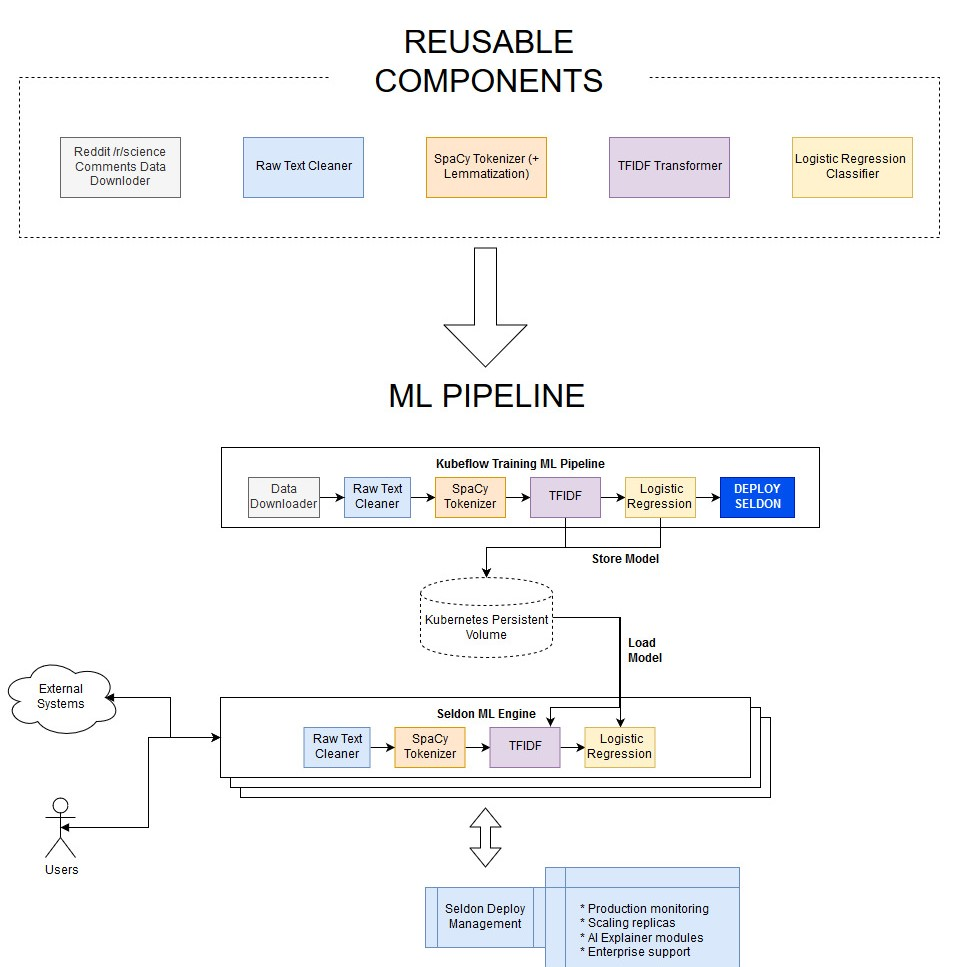
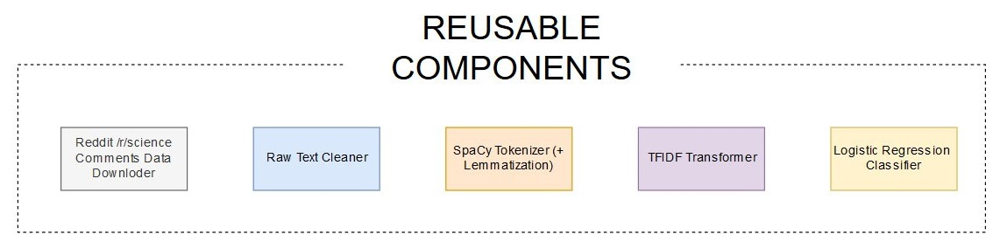
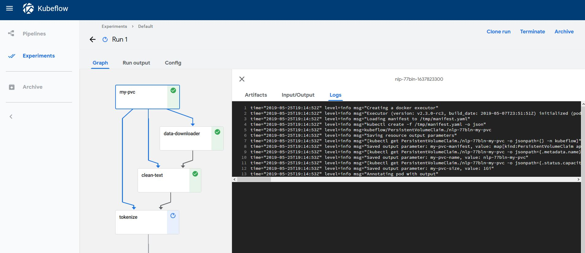

# End-to-end Reusable ML Pipeline with Seldon and Kubeflow

In this example we showcase how to build re-usable components to build an ML pipeline that can be trained and deployed at scale.

We will automate content moderation on the Reddit comments in /r/science building a machine learning NLP model with the following components:


This tutorial will break down in the following sections:

1) Test and build all our reusable pipeline steps

2) Use Kubeflow to Train the Pipeline and Deploy to Seldon

3) Test Seldon Deployed ML REST Endpoints

4) Visualise Seldon's Production ML Pipelines

## Before you start

Make sure you have the following components set-up and running in your Kubernetes cluster:

* [Seldon Core installed](https://docs.seldon.io/projects/seldon-core/en/latest/workflow/install.html#install-seldon-core-with-helm) with an [ingress (Ambassador / Istio) set up](https://docs.seldon.io/projects/seldon-core/en/latest/workflow/install.html#ingress-support)
* Kubeflow Pipelines [version 1.0.0 Standalone](https://www.kubeflow.org/docs/pipelines/installation/standalone-deployment/#deploying-kubeflow-pipelines) set up

Let's get started! 🚀🔥 We will be building the end-to-end pipeline below:




```python
%%writefile requirements-dev.txt
python-dateutil==2.8.1
kfp==1.0.0
kubernetes==11.0.0
click==7.1.2
seldon_core==1.2.3
numpy==1.19.1
pandas==1.1.1
spacy==2.3.2
scikit-learn==0.23.2
en-core-web-sm==2.3.1
```

    Overwriting requirements-dev.txt


```python
!pip install -r requirements-dev.txt
```

## 1) Test and build all our reusable pipeline steps

We will start by building each of the components in our ML pipeline. 



### Let's first have a look at our clean_text step:


```python
!ls pipeline/pipeline_steps
```

    clean_text	 lr_text_classifier  tfidf_vectorizer
    data_downloader  spacy_tokenize


Like in this step, all of the other steps can be found in the `pipeline/pipeline_steps/` folder, and all have the following structure:
* `pipeline_step.py` which exposes the functionality through a CLI 
* `Transformer.py` which transforms the data accordingly
* `requirements.txt` which states the python dependencies to run
* `build_image.sh` which uses `s2i` to build the image with one line

### Let's check out the CLI for clean_text
The pipeline_step CLI is the entry point for the kubeflow image as it will be able to pass any relevant parameters


```python
!python pipeline/pipeline_steps/clean_text/pipeline_step.py --help
```

    Usage: pipeline_step.py [OPTIONS]
    
    Options:
      --in-path TEXT
      --out-path TEXT
      --help           Show this message and exit.


This is actually a very simple file, as we are using the click library to define the commands:


```python
!cat pipeline/pipeline_steps/clean_text/pipeline_step.py
```

    import dill
    import click
    import dill
    try:
        # Running for tests
        from .Transformer import Transformer
    except:
        # Running from CLI
        from Transformer import Transformer
    
    @click.command()
    @click.option('--in-path', default="/mnt/raw_text.data")
    @click.option('--out-path', default="/mnt/clean_text.data")
    def run_pipeline(in_path, out_path):
        clean_text_transformer = Transformer()
        with open(in_path, 'rb') as in_f:
            x = dill.load(in_f)
        y = clean_text_transformer.predict(x)
        with open(out_path, "wb") as out_f:
            dill.dump(y, out_f)
    
    if __name__ == "__main__":
        run_pipeline()
    


The Transformer is where the data munging and transformation stage comes in, which will be wrapped by the container and exposed through the Seldon Engine to ensure our pipeline can be used in production.

Seldon provides multiple different features, such as abilities to send custom metrics, pre-process / post-process data and more. In this example we will only be exposing the `predict` step.


```python
!cat pipeline/pipeline_steps/clean_text/Transformer.py
```

    import re 
    from html.parser import HTMLParser
    import numpy as np
    import logging
    
    class Transformer():
        __html_parser = HTMLParser()
        __uplus_pattern = \
            re.compile("\<[uU]\+(?P<digit>[a-zA-Z0-9]+)\>")
        __markup_link_pattern = \
            re.compile("\[(.*)\]\((.*)\)")
    
        def predict(self, X, feature_names=[]):
            logging.warning(X)
            f = np.vectorize(Transformer.transform_clean_text)
            X_clean = f(X)
            logging.warning(X_clean)
            return X_clean
    
        def fit(self, X, y=None, **fit_params):
            return self
        
        @staticmethod
        def transform_clean_text(raw_text):
            try:
                decoded = raw_text.encode("ISO-8859-1").decode("utf-8")
            except:
                decoded = raw_text.encode("ISO-8859-1").decode("cp1252")
            html_unescaped =Transformer.\
                __html_parser.unescape(decoded) 
            html_unescaped = re.sub(r"\r\n", " ", html_unescaped)
            html_unescaped = re.sub(r"\r\r\n", " ", html_unescaped)
            html_unescaped = re.sub(r"\r", " ", html_unescaped)
            html_unescaped = html_unescaped.replace("&gt;", " > ")
            html_unescaped = html_unescaped.replace("&lt;", " < ")
            html_unescaped = html_unescaped.replace("--", " - ")
            html_unescaped = Transformer.__uplus_pattern.sub(
                " U\g<digit> ", html_unescaped)
            html_unescaped = Transformer.__markup_link_pattern.sub(
                " \1 \2 ", html_unescaped)
            html_unescaped = html_unescaped.replace("\\", "")
            return html_unescaped
    


If you want to understand how the CLI pipeline talks to each other, have a look at the end to end test in `pipeline/pipeline_tests/`:


```python
!pytest ./pipeline/pipeline_tests/. --disable-pytest-warnings
```

    Test session starts (platform: linux, Python 3.7.4, pytest 6.0.1, pytest-sugar 0.9.4)
    rootdir: /home/alejandro/Programming/kubernetes/seldon/seldon-core/examples/kubeflow
    plugins: celery-4.4.0, flaky-3.6.1, cov-2.10.0, django-3.8.0, forked-1.1.3, sugar-0.9.4, xdist-1.30.0
    collecting ... 
     pipeline/pipeline_tests/test_pipeline.py ✓                      100% ██████████
    
    Results (2.12s):
           1 passed


To build the image we provide a build script in each of the steps that contains the instructions:


```python
!cat pipeline/pipeline_steps/clean_text/build_image.sh
```

    #!/bin/bash
    
    s2i build . seldonio/seldon-core-s2i-python3:0.6 clean_text_transformer:0.1
    


The only thing you need to make sure is that Seldon knows how to wrap the right model and file.

This can be achieved with the s2i/environment file. 

As you can see, here we just tell it we want it to use our `Transformer.py` file:


```python
!cat pipeline/pipeline_steps/clean_text/.s2i/environment
```

    MODEL_NAME=Transformer
    API_TYPE=REST
    SERVICE_TYPE=MODEL
    PERSISTENCE=0


Once this is defined, the only thing we need to do is to run the `build_image.sh` for all the reusable components.

Here we show the manual way to do it:


```bash
%%bash
# we must be in the same directory
cd pipeline/pipeline_steps/clean_text/ && ./build_image.sh
cd ../data_downloader && ./build_image.sh
cd ../lr_text_classifier && ./build_image.sh
cd ../spacy_tokenize && ./build_image.sh
cd ../tfidf_vectorizer && ./build_image.sh
```

    
    Step 1/4 : FROM python:3.7-slim
     ---> d3fbf7fff365
    Step 2/4 : COPY . /microservice
     ---> Using cache
     ---> 6e9d7e162536
    Step 3/4 : WORKDIR /microservice
     ---> Using cache
     ---> b3d69a634dd1
    Step 4/4 : RUN pip install -r requirements.txt
     ---> Using cache
     ---> f1c421a68fe7
    Successfully built f1c421a68fe7
    Successfully tagged data_downloader:0.1


    ---> Installing application source...
    ---> Installing dependencies ...
    Looking in links: /whl
    Collecting dill==0.3.2 (from -r requirements.txt (line 1))
      WARNING: Url '/whl' is ignored. It is either a non-existing path or lacks a specific scheme.
    Downloading https://files.pythonhosted.org/packages/e2/96/518a8ea959a734b70d2e95fef98bcbfdc7adad1c1e5f5dd9148c835205a5/dill-0.3.2.zip (177kB)
    Requirement already satisfied: click==7.1.2 in /opt/conda/lib/python3.7/site-packages (from -r requirements.txt (line 2)) (7.1.2)
    Requirement already satisfied: numpy==1.19.1 in /opt/conda/lib/python3.7/site-packages (from -r requirements.txt (line 3)) (1.19.1)
    Building wheels for collected packages: dill
    Building wheel for dill (setup.py): started
    Building wheel for dill (setup.py): finished with status 'done'
    Created wheel for dill: filename=dill-0.3.2-cp37-none-any.whl size=78913 sha256=9f9ec39fffe7a46bdc1a164bc0cd8d61201f04ff0c4bfc68e7dda78d6a4c29cf
    Stored in directory: /root/.cache/pip/wheels/27/4b/a2/34ccdcc2f158742cfe9650675560dea85f78c3f4628f7daad0
    Successfully built dill
    Installing collected packages: dill
    Successfully installed dill-0.3.2
    WARNING: Url '/whl' is ignored. It is either a non-existing path or lacks a specific scheme.
    Collecting pip-licenses
    Downloading https://files.pythonhosted.org/packages/c5/50/6c4b4e69a0c43bd9f03a30579695093062ba72da4e3e4026cd2144dbcc71/pip_licenses-2.3.0-py3-none-any.whl
    Collecting PTable (from pip-licenses)
    Downloading https://files.pythonhosted.org/packages/ab/b3/b54301811173ca94119eb474634f120a49cd370f257d1aae5a4abaf12729/PTable-0.9.2.tar.gz
    Building wheels for collected packages: PTable
    Building wheel for PTable (setup.py): started
    Building wheel for PTable (setup.py): finished with status 'done'
    Created wheel for PTable: filename=PTable-0.9.2-cp37-none-any.whl size=22906 sha256=6c6c94080f12738603dbd55c01213f1c28f9922c915c92d72b547e85d229bfba
    Stored in directory: /root/.cache/pip/wheels/22/cc/2e/55980bfe86393df3e9896146a01f6802978d09d7ebcba5ea56
    Successfully built PTable
    Installing collected packages: PTable, pip-licenses
    Successfully installed PTable-0.9.2 pip-licenses-2.3.0
    created path: ./licenses/license_info.csv
    created path: ./licenses/license.txt
    Build completed successfully
    ---> Installing application source...
    ---> Installing dependencies ...
    Looking in links: /whl
    Collecting dill==0.3.2 (from -r requirements.txt (line 1))
      WARNING: Url '/whl' is ignored. It is either a non-existing path or lacks a specific scheme.
    Downloading https://files.pythonhosted.org/packages/e2/96/518a8ea959a734b70d2e95fef98bcbfdc7adad1c1e5f5dd9148c835205a5/dill-0.3.2.zip (177kB)
    Requirement already satisfied: click==7.1.2 in /opt/conda/lib/python3.7/site-packages (from -r requirements.txt (line 2)) (7.1.2)
    Requirement already satisfied: numpy==1.19.1 in /opt/conda/lib/python3.7/site-packages (from -r requirements.txt (line 3)) (1.19.1)
    Collecting scikit-learn==0.23.2 (from -r requirements.txt (line 4))
      WARNING: Url '/whl' is ignored. It is either a non-existing path or lacks a specific scheme.
    Downloading https://files.pythonhosted.org/packages/f4/cb/64623369f348e9bfb29ff898a57ac7c91ed4921f228e9726546614d63ccb/scikit_learn-0.23.2-cp37-cp37m-manylinux1_x86_64.whl (6.8MB)
    Collecting scipy>=0.19.1 (from scikit-learn==0.23.2->-r requirements.txt (line 4))
      WARNING: Url '/whl' is ignored. It is either a non-existing path or lacks a specific scheme.
    Downloading https://files.pythonhosted.org/packages/65/f9/f7a7e5009711579c72da2725174825e5056741bf4001815d097eef1b2e17/scipy-1.5.2-cp37-cp37m-manylinux1_x86_64.whl (25.9MB)
    Collecting joblib>=0.11 (from scikit-learn==0.23.2->-r requirements.txt (line 4))
      WARNING: Url '/whl' is ignored. It is either a non-existing path or lacks a specific scheme.
    Downloading https://files.pythonhosted.org/packages/51/dd/0e015051b4a27ec5a58b02ab774059f3289a94b0906f880a3f9507e74f38/joblib-0.16.0-py3-none-any.whl (300kB)
    Collecting threadpoolctl>=2.0.0 (from scikit-learn==0.23.2->-r requirements.txt (line 4))
      WARNING: Url '/whl' is ignored. It is either a non-existing path or lacks a specific scheme.
    Downloading https://files.pythonhosted.org/packages/f7/12/ec3f2e203afa394a149911729357aa48affc59c20e2c1c8297a60f33f133/threadpoolctl-2.1.0-py3-none-any.whl
    Building wheels for collected packages: dill
    Building wheel for dill (setup.py): started
    Building wheel for dill (setup.py): finished with status 'done'
    Created wheel for dill: filename=dill-0.3.2-cp37-none-any.whl size=78913 sha256=f4aa43d7acbc7953839cc8177c0e03bec249f9a7dffc10c7e9db79201ce519d3
    Stored in directory: /root/.cache/pip/wheels/27/4b/a2/34ccdcc2f158742cfe9650675560dea85f78c3f4628f7daad0
    Successfully built dill
    Installing collected packages: dill, scipy, joblib, threadpoolctl, scikit-learn
    Successfully installed dill-0.3.2 joblib-0.16.0 scikit-learn-0.23.2 scipy-1.5.2 threadpoolctl-2.1.0
    WARNING: Url '/whl' is ignored. It is either a non-existing path or lacks a specific scheme.
    Collecting pip-licenses
    Downloading https://files.pythonhosted.org/packages/c5/50/6c4b4e69a0c43bd9f03a30579695093062ba72da4e3e4026cd2144dbcc71/pip_licenses-2.3.0-py3-none-any.whl
    Collecting PTable (from pip-licenses)
    Downloading https://files.pythonhosted.org/packages/ab/b3/b54301811173ca94119eb474634f120a49cd370f257d1aae5a4abaf12729/PTable-0.9.2.tar.gz
    Building wheels for collected packages: PTable
    Building wheel for PTable (setup.py): started
    Building wheel for PTable (setup.py): finished with status 'done'
    Created wheel for PTable: filename=PTable-0.9.2-cp37-none-any.whl size=22906 sha256=e296b386d6581fe3343b84d718f7e7624bdbabfff569c4220a1f2039dd0abbdf
    Stored in directory: /root/.cache/pip/wheels/22/cc/2e/55980bfe86393df3e9896146a01f6802978d09d7ebcba5ea56
    Successfully built PTable
    Installing collected packages: PTable, pip-licenses
    Successfully installed PTable-0.9.2 pip-licenses-2.3.0
    created path: ./licenses/license_info.csv
    created path: ./licenses/license.txt
    Build completed successfully
    ---> Installing application source...
    ---> Installing dependencies ...
    Looking in links: /whl
    Collecting dill==0.3.2 (from -r requirements.txt (line 1))
      WARNING: Url '/whl' is ignored. It is either a non-existing path or lacks a specific scheme.
    Downloading https://files.pythonhosted.org/packages/e2/96/518a8ea959a734b70d2e95fef98bcbfdc7adad1c1e5f5dd9148c835205a5/dill-0.3.2.zip (177kB)
    Requirement already satisfied: click==7.1.2 in /opt/conda/lib/python3.7/site-packages (from -r requirements.txt (line 2)) (7.1.2)
    Requirement already satisfied: numpy==1.19.1 in /opt/conda/lib/python3.7/site-packages (from -r requirements.txt (line 3)) (1.19.1)
    Collecting spacy==2.3.2 (from -r requirements.txt (line 4))
      WARNING: Url '/whl' is ignored. It is either a non-existing path or lacks a specific scheme.
    Downloading https://files.pythonhosted.org/packages/55/24/70c615f5b22440c679a4132b81eee67d1dfd70d159505a28ff949c78a1ac/spacy-2.3.2-cp37-cp37m-manylinux1_x86_64.whl (9.9MB)
    Collecting en-core-web-sm==2.3.1 (from -r requirements.txt (line 5))
      WARNING: Url '/whl' is ignored. It is either a non-existing path or lacks a specific scheme.
      ERROR: Could not find a version that satisfies the requirement en-core-web-sm==2.3.1 (from -r requirements.txt (line 5)) (from versions: none)
    ERROR: No matching distribution found for en-core-web-sm==2.3.1 (from -r requirements.txt (line 5))
    WARNING: Url '/whl' is ignored. It is either a non-existing path or lacks a specific scheme.
    Build failed
    ERROR: An error occurred: non-zero (13) exit code from seldonio/seldon-core-s2i-python37:1.2.3
    ---> Installing application source...
    ---> Installing dependencies ...
    Looking in links: /whl
    Collecting dill==0.3.2 (from -r requirements.txt (line 1))
      WARNING: Url '/whl' is ignored. It is either a non-existing path or lacks a specific scheme.
    Downloading https://files.pythonhosted.org/packages/e2/96/518a8ea959a734b70d2e95fef98bcbfdc7adad1c1e5f5dd9148c835205a5/dill-0.3.2.zip (177kB)
    Requirement already satisfied: click==7.1.2 in /opt/conda/lib/python3.7/site-packages (from -r requirements.txt (line 2)) (7.1.2)
    Requirement already satisfied: numpy==1.19.1 in /opt/conda/lib/python3.7/site-packages (from -r requirements.txt (line 3)) (1.19.1)
    Collecting scikit-learn==0.23.2 (from -r requirements.txt (line 4))
      WARNING: Url '/whl' is ignored. It is either a non-existing path or lacks a specific scheme.
    Downloading https://files.pythonhosted.org/packages/f4/cb/64623369f348e9bfb29ff898a57ac7c91ed4921f228e9726546614d63ccb/scikit_learn-0.23.2-cp37-cp37m-manylinux1_x86_64.whl (6.8MB)
    Collecting joblib>=0.11 (from scikit-learn==0.23.2->-r requirements.txt (line 4))
      WARNING: Url '/whl' is ignored. It is either a non-existing path or lacks a specific scheme.
    Downloading https://files.pythonhosted.org/packages/51/dd/0e015051b4a27ec5a58b02ab774059f3289a94b0906f880a3f9507e74f38/joblib-0.16.0-py3-none-any.whl (300kB)
    Collecting scipy>=0.19.1 (from scikit-learn==0.23.2->-r requirements.txt (line 4))
      WARNING: Url '/whl' is ignored. It is either a non-existing path or lacks a specific scheme.
    Downloading https://files.pythonhosted.org/packages/65/f9/f7a7e5009711579c72da2725174825e5056741bf4001815d097eef1b2e17/scipy-1.5.2-cp37-cp37m-manylinux1_x86_64.whl (25.9MB)
    Collecting threadpoolctl>=2.0.0 (from scikit-learn==0.23.2->-r requirements.txt (line 4))
      WARNING: Url '/whl' is ignored. It is either a non-existing path or lacks a specific scheme.
    Downloading https://files.pythonhosted.org/packages/f7/12/ec3f2e203afa394a149911729357aa48affc59c20e2c1c8297a60f33f133/threadpoolctl-2.1.0-py3-none-any.whl
    Building wheels for collected packages: dill
    Building wheel for dill (setup.py): started
    Building wheel for dill (setup.py): finished with status 'done'
    Created wheel for dill: filename=dill-0.3.2-cp37-none-any.whl size=78913 sha256=2bdafea9bf8ead275cf6123cd330c7362915943a397e00ca7b203b9b8759f2a7
    Stored in directory: /root/.cache/pip/wheels/27/4b/a2/34ccdcc2f158742cfe9650675560dea85f78c3f4628f7daad0
    Successfully built dill
    Installing collected packages: dill, joblib, scipy, threadpoolctl, scikit-learn
    Successfully installed dill-0.3.2 joblib-0.16.0 scikit-learn-0.23.2 scipy-1.5.2 threadpoolctl-2.1.0
    WARNING: Url '/whl' is ignored. It is either a non-existing path or lacks a specific scheme.
    Collecting pip-licenses
    Downloading https://files.pythonhosted.org/packages/c5/50/6c4b4e69a0c43bd9f03a30579695093062ba72da4e3e4026cd2144dbcc71/pip_licenses-2.3.0-py3-none-any.whl
    Collecting PTable (from pip-licenses)
    Downloading https://files.pythonhosted.org/packages/ab/b3/b54301811173ca94119eb474634f120a49cd370f257d1aae5a4abaf12729/PTable-0.9.2.tar.gz
    Building wheels for collected packages: PTable
    Building wheel for PTable (setup.py): started
    Building wheel for PTable (setup.py): finished with status 'done'
    Created wheel for PTable: filename=PTable-0.9.2-cp37-none-any.whl size=22906 sha256=46a9ca3a63fe171ad06a2e9bbd7f00fba00ca0bb4bbda6177f3571077d79228e
    Stored in directory: /root/.cache/pip/wheels/22/cc/2e/55980bfe86393df3e9896146a01f6802978d09d7ebcba5ea56
    Successfully built PTable
    Installing collected packages: PTable, pip-licenses
    Successfully installed PTable-0.9.2 pip-licenses-2.3.0
    created path: ./licenses/license_info.csv
    created path: ./licenses/license.txt
    Build completed successfully


## 3) Train our NLP Pipeline through the Kubeflow UI
We can access the Kubeflow dashboard to train our ML pipeline via http://localhost/_/pipeline-dashboard

If you can't edit this, you need to make sure that the ambassador gateway service is accessible:


```python
!kubectl get svc ambassador -n kubeflow
```

    NAME         TYPE       CLUSTER-IP      EXTERNAL-IP   PORT(S)        AGE
    ambassador   NodePort   10.97.236.196   <none>        80:30209/TCP   8m58s


In my case, I need to change the kind from `NodePort` into `LoadBalancer` which can be done with the following command:


```python
!kubectl patch svc ambassador --type='json' -p '[{"op":"replace","path":"/spec/type","value":"LoadBalancer"}]' -n kubeflow
```

    service/ambassador patched


Now that I've changed it to a loadbalancer, it has allocated the external IP as my localhost so I can access it at http://localhost/_/pipeline-dashboard


```python
!kubectl get svc ambassador -n kubeflow
```

    NAME         TYPE           CLUSTER-IP      EXTERNAL-IP   PORT(S)        AGE
    ambassador   LoadBalancer   10.97.236.196   localhost     80:30209/TCP   9m20s


If this was successfull, you should be able to access the dashboard


### Define the pipeline
Now we want to generate the pipeline. For this we can use the DSL provided by kubeflow to define the actual steps required. 

The pipeline will look as follows:


```python
!cat train_pipeline/nlp_pipeline.py
```

    
    import kfp.dsl as dsl
    import yaml
    from kubernetes import client as k8s
    
    
    @dsl.pipeline(
      name='NLP',
      description='A pipeline demonstrating reproducible steps for NLP'
    )
    def nlp_pipeline(
            csv_url="https://raw.githubusercontent.com/axsauze/reddit-classification-exploration/master/data/reddit_train.csv",
            csv_encoding="ISO-8859-1",
            features_column="BODY",
            labels_column="REMOVED",
            raw_text_path='/mnt/text.data',
            labels_path='/mnt/labels.data',
            clean_text_path='/mnt/clean.data',
            spacy_tokens_path='/mnt/tokens.data',
            tfidf_vectors_path='/mnt/tfidf.data',
            lr_prediction_path='/mnt/prediction.data',
            tfidf_model_path='/mnt/tfidf.model',
            lr_model_path='/mnt/lr.model',
            lr_c_param=0.1,
            tfidf_max_features=10000,
            tfidf_ngram_range=3,
            batch_size='100'):
        """
        Pipeline 
        """
        vop = dsl.VolumeOp(
          name='my-pvc',
          resource_name="my-pvc",
          modes=["ReadWriteMany"],
          size="1Gi"
        )
    
        download_step = dsl.ContainerOp(
            name='data_downloader',
            image='data_downloader:0.1',
            command="python",
            arguments=[
                "/microservice/pipeline_step.py",
                "--labels-path", labels_path,
                "--features-path", raw_text_path,
                "--csv-url", csv_url,
                "--csv-encoding", csv_encoding,
                "--features-column", features_column,
                "--labels-column", labels_column
            ],
            pvolumes={"/mnt": vop.volume}
        )
    
        clean_step = dsl.ContainerOp(
            name='clean_text',
            image='clean_text_transformer:0.1',
            command="python",
            arguments=[
                "/microservice/pipeline_step.py",
                "--in-path", raw_text_path,
                "--out-path", clean_text_path,
            ],
            pvolumes={"/mnt": download_step.pvolume}
        )
    
        tokenize_step = dsl.ContainerOp(
            name='tokenize',
            image='spacy_tokenizer:0.1',
            command="python",
            arguments=[
                "/microservice/pipeline_step.py",
                "--in-path", clean_text_path,
                "--out-path", spacy_tokens_path,
            ],
            pvolumes={"/mnt": clean_step.pvolume}
        )
    
        vectorize_step = dsl.ContainerOp(
            name='vectorize',
            image='tfidf_vectorizer:0.1',
            command="python",
            arguments=[
                "/microservice/pipeline_step.py",
                "--in-path", spacy_tokens_path,
                "--out-path", tfidf_vectors_path,
                "--max-features", tfidf_max_features,
                "--ngram-range", tfidf_ngram_range,
                "--action", "train",
                "--model-path", tfidf_model_path,
            ],
            pvolumes={"/mnt": tokenize_step.pvolume}
        )
    
        predict_step = dsl.ContainerOp(
            name='predictor',
            image='lr_text_classifier:0.1',
            command="python",
            arguments=[
                "/microservice/pipeline_step.py",
                "--in-path", tfidf_vectors_path,
                "--labels-path", labels_path,
                "--out-path", lr_prediction_path,
                "--c-param", lr_c_param,
                "--action", "train",
                "--model-path", lr_model_path,
            ],
            pvolumes={"/mnt": vectorize_step.pvolume}
        )
    
        try:
            seldon_config = yaml.load(open("../deploy_pipeline/seldon_production_pipeline.yaml"))
        except:
            # If this file is run from the project core directory 
            seldon_config = yaml.load(open("deploy_pipeline/seldon_production_pipeline.yaml"))
    
        deploy_step = dsl.ResourceOp(
            name="seldondeploy",
            k8s_resource=seldon_config,
            attribute_outputs={"name": "{.metadata.name}"})
    
        deploy_step.after(predict_step)
    
    if __name__ == '__main__':
      import kfp.compiler as compiler
      compiler.Compiler().compile(nlp_pipeline, __file__ + '.tar.gz')


### Breaking down the  code
As you can see in the DSL, we have the ContainerOp - each of those is a step in the Kubeflow pipeline.

At the end we can see the `seldondeploy` step which basically deploys the trained pipeline

The definition of the SeldonDeployment graph is provided in the `deploy_pipeline/seldon_production_pipeline.yaml` file.

The seldondeployment file defines our production execution graph using the same reusable components.


```python
!cat deploy_pipeline/seldon_production_pipeline.yaml
```

    ---
    apiVersion: machinelearning.seldon.io/v1alpha2
    kind: SeldonDeployment
    metadata:
      labels:
        app: seldon
      name: "seldon-deployment-{{workflow.name}}"
      namespace: kubeflow
    spec:
      annotations:
        project_name: NLP Pipeline
        deployment_version: v1
      name: "seldon-deployment-{{workflow.name}}"
      oauth_key: oauth-key
      oauth_secret: oauth-secret
      predictors:
      - componentSpecs:
        - spec:
            containers:
            - image: clean_text_transformer:0.1
              imagePullPolicy: IfNotPresent
              name: cleantext
              resources:
                requests:
                  memory: 1Mi
            - image: spacy_tokenizer:0.1
              imagePullPolicy: IfNotPresent
              name: spacytokenizer
            - image: tfidf_vectorizer:0.1
              imagePullPolicy: IfNotPresent
              name: tfidfvectorizer
              volumeMounts:
              - name: mypvc
                mountPath: /mnt
            - image: lr_text_classifier:0.1
              imagePullPolicy: IfNotPresent
              name: lrclassifier
              volumeMounts:
              - name: mypvc
                mountPath: /mnt
            terminationGracePeriodSeconds: 20
            volumes:
            - name: mypvc
              persistentVolumeClaim:
                claimName: "{{workflow.name}}-my-pvc"
        graph:
          children:
          - name: spacytokenizer
            endpoint:
              type: REST
            type: MODEL
            children:
            - name: tfidfvectorizer
              endpoint:
                type: REST
              type: MODEL
              children:
              - name: lrclassifier
                endpoint:
                  type: REST
                type: MODEL
                children: []
          name: cleantext
          endpoint:
            type: REST
          type: MODEL
        name: single-model
        replicas: 1
        annotations:
          predictor_version: v1
    


### Seldon Production pipeline contents
If we look at the file we'll be using to deploy our pipeline, we can see that it has the following key points:

1) Reusable components definitions as containerSpecs: cleantext, spacytokenizer, tfidfvectorizer & lrclassifier

2) DAG (directed acyclic graph) definition for REST pipeline: cleantext -> spacytokenizer -> tfidfvectorizer -> lrclassifier

This graph in our production deployment looks as follows:


### Generate the pipeline files to upload to Kubeflow
To generate the pipeline we just have to run the pipeline file, which will output the `tar.gz` file that will be uploaded.


```bash
%%bash
# Generating graph definition
python train_pipeline/nlp_pipeline.py
ls train_pipeline/
```

    nlp_pipeline.py
    nlp_pipeline.py.tar.gz


    /home/alejandro/miniconda3/lib/python3.7/site-packages/kfp/components/_data_passing.py:168: UserWarning: Missing type name was inferred as "Float" based on the value "0.1".
      warnings.warn('Missing type name was inferred as "{}" based on the value "{}".'.format(type_name, str(value)))
    /home/alejandro/miniconda3/lib/python3.7/site-packages/kfp/components/_data_passing.py:168: UserWarning: Missing type name was inferred as "Integer" based on the value "10000".
      warnings.warn('Missing type name was inferred as "{}" based on the value "{}".'.format(type_name, str(value)))
    /home/alejandro/miniconda3/lib/python3.7/site-packages/kfp/components/_data_passing.py:168: UserWarning: Missing type name was inferred as "Integer" based on the value "3".
      warnings.warn('Missing type name was inferred as "{}" based on the value "{}".'.format(type_name, str(value)))
    train_pipeline/nlp_pipeline.py:114: YAMLLoadWarning: calling yaml.load() without Loader=... is deprecated, as the default Loader is unsafe. Please read https://msg.pyyaml.org/load for full details.
      seldon_config = yaml.load(open("deploy_pipeline/seldon_production_pipeline.yaml"))


### Run the pipeline

You can access the Kubeflow Pipelines UI by forwarding the port with the following command:

```
 kubectl port-forward -n kubeflow svc/ml-pipeline-ui 8000:80
```

The UI should now be accessible via [http://localhost:8000](http://localhost:8000).

We now need to upload the resulting `nlp_pipeline.py.tar.gz` file generated.

This can be done through the "Upload PIpeline" button in the UI.

Once it's uploaded, we want to create and trigger a run! You should now be able to see how each step is executed:



### Inspecting the data created in the Persistent Volume
The pipeline saves the output of the pipeline together with the trained model in the persistent volume claim.

The persistent volume claim is the same name as the argo workflow:


```python
!kubectl get workflow -n kubeflow
```

    NAME        AGE
    nlp-bddff   2m


Our workflow is there! So we can actually access it by running


```python
!kubectl get workflow -n kubeflow -o jsonpath='{.items[0].metadata.name}'
```

    nlp-bddff

And we can use good old `sed` to insert this workflow name in our PVC-Access controler which we can use to inspect the contents of the volume:


```python
!sed "s/PVC_NAME/"$(kubectl get workflow -n kubeflow -o jsonpath='{.items[0].metadata.name}')"-my-pvc/g" deploy_pipeline/pvc-access.yaml 
```

    apiVersion: v1
    kind: Pod
    metadata:
      name: pvc-access-container
    spec:
      containers:
      - name: pvc-access-container
        image: busybox
        command: ["/bin/sh", "-ec", "sleep 1000"]
        volumeMounts:
        - name: mypvc
          mountPath: /mnt
      volumes:
      - name: mypvc
        persistentVolumeClaim:
          claimName: nlp-b7qt8-my-pvc


We just need to apply this container with our kubectl command, and we can use it to inspect the mounted folder:


```python
!sed "s/PVC_NAME/"$(kubectl get workflow -n kubeflow -o jsonpath='{.items[0].metadata.name}')"-my-pvc/g" deploy_pipeline/pvc-access.yaml | kubectl -n kubeflow apply -f -
```

    pod/pvc-access-container created


```python
!kubectl get pods -n kubeflow pvc-access-container
```

    NAME                   READY   STATUS    RESTARTS   AGE
    pvc-access-container   1/1     Running   0          6s


Now we can run an `ls` command to see what's inside:


```python
!kubectl -n kubeflow exec -it pvc-access-container ls /mnt
```

    clean.data       lr.model         text.data        tfidf.model
    labels.data      prediction.data  tfidf.data       tokens.data


```python
!kubectl delete -f deploy_pipeline/pvc-access.yaml -n kubeflow
```

    pod "pvc-access-container" deleted


## 5) Test Deployed ML REST Endpoints
Now that it's running we have a production ML text pipeline that we can Query using REST and GRPC


First we can check if our Seldon deployment is running with


```python
!kubectl -n kubeflow get seldondeployment 
```

    NAME                          AGE
    seldon-deployment-nlp-b7qt8   57m


We will need the Seldon Pipeline Deployment name to reach the API, so we can get it using:


```python
!kubectl -n kubeflow get seldondeployment -o jsonpath='{.items[0].metadata.name}'
```

    seldon-deployment-nlp-b7qt8

Now we can interact with our API in two ways: 

1) Using CURL or any client like PostMan

2) Using the Python SeldonClient

### Using CURL from the terminal
When using CURL, the only thing we need to provide is the data in JSON format, as well as the url, which is of the format:

```
http://<ENDPOINT>/seldon/kubeflow/<PIPELINE_NAME>/api/v0.1/predictions
```


```bash
%%bash
curl -X POST -H 'Content-Type: application/json' \
    -d "{'data': {'names': ['text'], 'ndarray': ['Hello world this is a test']}}" \
    http://127.0.0.1/seldon/kubeflow/$(kubectl -n kubeflow get seldondeployment -o jsonpath='{.items[0].metadata.name}')/api/v0.1/predictions
```

    {
      "meta": {
        "puid": "k89krp6t7tfgb386nt6vc3iftk",
        "tags": {
        },
        "routing": {
          "cleantext": -1,
          "tfidfvectorizer": -1,
          "spacytokenizer": -1
        },
        "requestPath": {
          "cleantext": "clean_text_transformer:0.1",
          "tfidfvectorizer": "tfidf_vectorizer:0.1",
          "lrclassifier": "lr_text_classifier:0.1",
          "spacytokenizer": "spacy_tokenizer:0.1"
        },
        "metrics": []
      },
      "data": {
        "names": ["t:0", "t:1"],
        "ndarray": [[0.6729318752883149, 0.3270681247116851]]
      }
    }

      % Total    % Received % Xferd  Average Speed   Time    Time     Time  Current
                                     Dload  Upload   Total   Spent    Left  Speed
    100   599  100   527  100    72    516     70  0:00:01  0:00:01 --:--:--   588


### Using the SeldonClient
We can also use the Python SeldonClient to interact with the pipeline we just deployed 


```python
from seldon_core.seldon_client import SeldonClient
import numpy as np
import subprocess

host = "localhost"
port = "80" # Make sure you use the port above
batch = np.array(["Hello world this is a test"])
payload_type = "ndarray"
# Get the deployment name
deployment_name = subprocess.getoutput("kubectl -n kubeflow get seldondeployment -o jsonpath='{.items[0].metadata.name}'")
transport="rest"
namespace="kubeflow"

sc = SeldonClient(
    gateway="ambassador", 
    ambassador_endpoint=host + ":" + port,
    namespace=namespace)

client_prediction = sc.predict(
    data=batch, 
    deployment_name=deployment_name,
    names=["text"],
    payload_type=payload_type,
    transport="rest")

print(client_prediction)
```

    Success:True message:
    Request:
    data {
      names: "text"
      ndarray {
        values {
          string_value: "Hello world this is a test"
        }
      }
    }
    
    Response:
    meta {
      puid: "qtdca40d3s0463nn4ginhkvc6t"
      routing {
        key: "cleantext"
        value: -1
      }
      routing {
        key: "spacytokenizer"
        value: -1
      }
      routing {
        key: "tfidfvectorizer"
        value: -1
      }
      requestPath {
        key: "cleantext"
        value: "clean_text_transformer:0.1"
      }
      requestPath {
        key: "lrclassifier"
        value: "lr_text_classifier:0.1"
      }
      requestPath {
        key: "spacytokenizer"
        value: "spacy_tokenizer:0.1"
      }
      requestPath {
        key: "tfidfvectorizer"
        value: "tfidf_vectorizer:0.1"
      }
    }
    data {
      names: "t:0"
      names: "t:1"
      ndarray {
        values {
          list_value {
            values {
              number_value: 0.6729318752883149
            }
            values {
              number_value: 0.3270681247116851
            }
          }
        }
      }
    }
    


## 6) Visualise Seldon's Production ML Pipelines
We can visualise the performance using the SeldonAnalytics package, which we can deploy using:


```python
!helm install seldon-core-analytics --repo https://storage.googleapis.com/seldon-charts --namespace kubeflow
```

In my case, similar to what I did with Ambassador, I need to make sure the the service is a LoadBalancer instead of a NodePort


```python
!kubectl patch svc grafana-prom --type='json' -p '[{"op":"replace","path":"/spec/type","value":"LoadBalancer"}]' -n kubeflow
```

    service/grafana-prom patched


```python
!kubectl get svc grafana-prom -n kubeflow
```

    NAME           TYPE           CLUSTER-IP      EXTERNAL-IP   PORT(S)        AGE
    grafana-prom   LoadBalancer   10.98.248.223   localhost     80:32445/TCP   64m


Now we can access it at the port provided, in my case it is http://localhost:32445/d/3swM2iGWz/prediction-analytics?refresh=5s&orgId=1

(initial username is admin and password is password, which will be requested to be changed on the first login)

Generate a bunch of requests and visualise:


```python
while True:
    client_prediction = sc.predict(
        data=batch, 
        deployment_name=deployment_name,
        names=["text"],
        payload_type=payload_type,
        transport="rest")
```

## You now have a full end-to-end training and production NLP pipeline 😎 


```python

```
