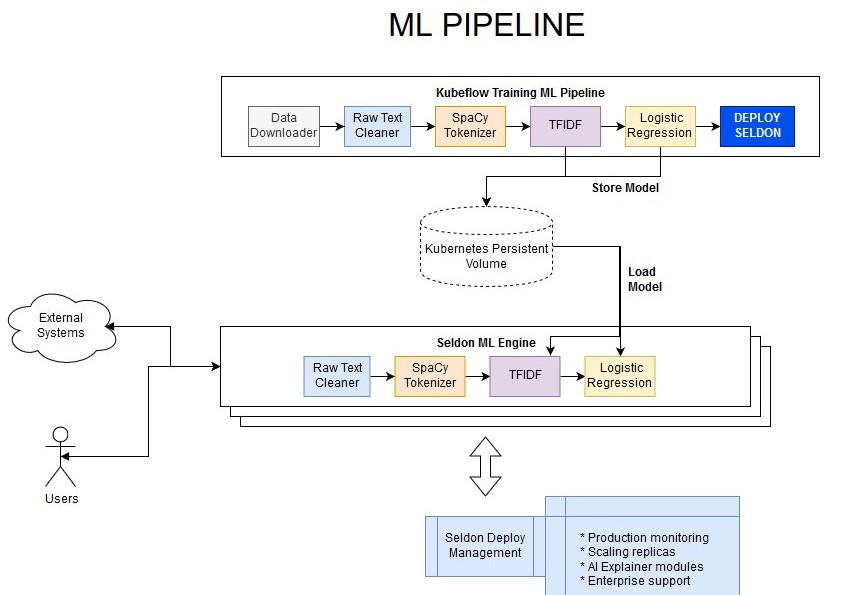

# End-to-end Reusable ML Pipeline with Seldon and Kubeflow

In this example we showcase how to build re-usable components to build an ML pipeline that can be trained and deployed at scale.

We will automate content moderation on the Reddit comments in /r/science building a machine learning NLP model with the following components:


This tutorial will break down in the following sections:

1) Run all the services (Kubeflow and Seldon)

2) Test and build all our reusable pipeline steps

3) Train our NLP Pipeline with Kubeflow

4) Deploying your ML Pipeline with Seldon

5) Test Deployed ML REST Endpoints

Let's get started! 🚀🔥

# Before you start
Make sure you install the following dependencies, as they are critical for this example to work:

* Helm v2.13.1+
* A Kubernetes cluster running v1.13 or above (minkube / docker-for-windows work well if enough RAM)
* kubectl v1.14+
* ksonnet v0.13.1+
* kfctl 0.5.2 - Please use this exact version as there are major changes every few months
* Python 3.6+
* Python DEV requirements (we'll install them below)


```python
!pip install -r requirements-dev.txt
```

## 1) Run all the services (Kubeflow and Seldon)
Kubeflow's CLI allows us to create a project which will allow us to build the configuration we need to deploy our kubeflow and seldon clusters.


```python
!kfctl init kubeflow-seldon
!ls kubeflow-seldon
```

    app.yaml


Now we run the following commands to basically launch our Kubeflow cluster with all its components. 

It may take a while to download all the images for Kubeflow so feel free to make yourself a cup of ☕.

If you have a terminal you can see how the containers are created in real-time by running `kubectl get pods -n kubeflow -w`.


```bash
%%bash
cd kubeflow-seldon
kfctl generate all -V
kfctl apply all -V
```

### Now let's run Seldon 
For this we'll need Helm to be running, so we'll initialise it.


```bash
%%bash
helm init 
kubectl rollout status deploy/tiller-deploy -n kube-system
```

    $HELM_HOME has been configured at /home/alejandro/.helm.
    Warning: Tiller is already installed in the cluster.
    (Use --client-only to suppress this message, or --upgrade to upgrade Tiller to the current version.)
    Happy Helming!
    deployment "tiller-deploy" successfully rolled out


Once it's running we can now run the installation command for Seldon.

As you can see, we are running the Seldon Operator in the Kubeflow namespace. 


```python
!helm install seldon-core-operator --namespace kubeflow --repo https://storage.googleapis.com/seldon-charts
```

    NAME:   aspiring-chinchilla
    LAST DEPLOYED: Mon May 27 16:15:38 2019
    NAMESPACE: kubeflow
    STATUS: DEPLOYED
    
    RESOURCES:
    ==> v1/ClusterRole
    NAME                          AGE
    seldon-operator-manager-role  0s
    
    ==> v1/ClusterRoleBinding
    NAME                                 AGE
    seldon-operator-manager-rolebinding  0s
    
    ==> v1/Pod(related)
    NAME                                  READY  STATUS             RESTARTS  AGE
    seldon-operator-controller-manager-0  0/1    ContainerCreating  0         0s
    
    ==> v1/Secret
    NAME                                   TYPE    DATA  AGE
    seldon-operator-webhook-server-secret  Opaque  0     0s
    
    ==> v1/Service
    NAME                                        TYPE       CLUSTER-IP      EXTERNAL-IP  PORT(S)  AGE
    seldon-operator-controller-manager-service  ClusterIP  10.108.159.109  <none>       443/TCP  0s
    
    ==> v1/StatefulSet
    NAME                                READY  AGE
    seldon-operator-controller-manager  0/1    0s
    
    ==> v1beta1/CustomResourceDefinition
    NAME                                         AGE
    seldondeployments.machinelearning.seldon.io  0s
    
    
    NOTES:
    NOTES: TODO
    
    


Check all the Seldon Deployment is running


```python
!kubectl get pod -n kubeflow | grep seldon
```

    seldon-operator-controller-manager-0                       1/1     Running   0          15s


### Temporary fix for Argo image

At the time of writing we need to make some updates in the Argo images with the following commands below.

(This basically changes the images to the latest ones, otherwise we will get an error when we attach the volume)


```python
!kubectl -n kubeflow patch deployments. workflow-controller --patch '{"spec": {"template": {"spec": {"containers": [{"name": "workflow-controller", "image": "argoproj/workflow-controller:v2.3.0-rc3"}]}}}}'
!kubectl -n kubeflow patch deployments. ml-pipeline --patch '{"spec": {"template": {"spec": {"containers": [{"name": "ml-pipeline-api-server", "image": "elikatsis/ml-pipeline-api-server:0.1.18-pick-1289"}]}}}}'
# !kubectl -n kubeflow patch configmaps workflow-controller-configmap --patch '{"data": {"config": "{ executorImage: argoproj/argoexec:v2.3.0-rc3,artifactRepository:{s3: {bucket: mlpipeline,keyPrefix: artifacts,endpoint: minio-service.kubeflow:9000,insecure: true,accessKeySecret: {name: mlpipeline-minio-artifact,key: accesskey},secretKeySecret: {name: mlpipeline-minio-artifact,key: secretkey}}}}" }}'
```

    deployment.extensions/workflow-controller patched
    deployment.extensions/ml-pipeline patched


The last command you need to run actually needs to be manual as the patch cannot change configmap contents directly

You need to run the edit commad and change the executorImage to: `argoproj/argoexec:v2.3.0-rc3`

The command should be run from a terminal:

```
kubectl edit configmaps workflow-controller-configmap -n kubeflow
```

## 2) Test and build all our reusable pipeline steps

We will start by building each of the components in our ML pipeline. 


### Let's first have a look at our clean_text step:


```python
!ls pipeline/pipeline_steps/clean_text/
```

    Transformer.py	__init__.py  build_image.sh  pipeline_step.py  requirements.txt


Like in this step, all of the other steps can be found in the `pipeline/pipeline_steps/` folder, and all have the following structure:
* `pipeline_step.py` which exposes the functionality through a CLI 
* `Transformer.py` which transforms the data accordingly
* `requirements.txt` which states the python dependencies to run
* `build_image.sh` which uses `s2i` to build the image with one line

### Let's check out the CLI for clean_text


```python
!python pipeline/pipeline_steps/clean_text/pipeline_step.py --help
```

    Usage: pipeline_step.py [OPTIONS]
    
    Options:
      --in-path TEXT
      --out-path TEXT
      --help           Show this message and exit.


This is actually a very simple file, as we are using the click library to define the commands:


```python
!cat pipeline/pipeline_steps/clean_text/pipeline_step.py
```

    import dill
    import click
    import dill
    try:
        # Running for tests
        from .Transformer import Transformer
    except:
        # Running from CLI
        from Transformer import Transformer
    
    @click.command()
    @click.option('--in-path', default="/mnt/raw_text.data")
    @click.option('--out-path', default="/mnt/clean_text.data")
    def run_pipeline(in_path, out_path):
        clean_text_transformer = Transformer()
        with open(in_path, 'rb') as in_f:
            x = dill.load(in_f)
        y = clean_text_transformer.predict(x)
        with open(out_path, "wb") as out_f:
            dill.dump(y, out_f)
    
    if __name__ == "__main__":
        run_pipeline()
    


If you want to understand how the CLI pipeline talks to each other, have a look at the end to end test in `pipeline/pipeline_tests/`:


```python
!pytest ./pipeline/pipeline_tests/. --disable-pytest-warnings
```

    ============================= test session starts ==============================
    platform linux -- Python 3.7.3, pytest-4.5.0, py-1.8.0, pluggy-0.11.0
    rootdir: /home/alejandro/Programming/kubernetes/seldon/seldon-core/examples/kubeflow
    collected 1 item                                                               
    
    pipeline/pipeline_tests/test_pipeline.py .                               [100%]
    
    ===================== 1 passed, 9 warnings in 3.26 seconds =====================


To build the image we provide a build script in each of the steps that contains the instructions:


```python
!cat pipeline/pipeline_steps/clean_text/build_image.sh
```

    #!/bin/bash
    
    s2i build . seldonio/seldon-core-s2i-python3:0.6 clean_text_transformer:0.1
    


The only thing you need to make sure is that Seldon knows how to wrap the right model and file.

This can be achieved with the s2i/environment file. 

As you can see, here we just tell it we want it to use our `Transformer.py` file:


```python
!cat pipeline/pipeline_steps/clean_text/.s2i/environment
```

    MODEL_NAME=Transformer
    API_TYPE=REST
    SERVICE_TYPE=MODEL
    PERSISTENCE=0


Once this is defined, the only thing we need to do is to run the `build_image.sh` for all the reusable components.

Here we show the manual way to do it:


```bash
%%bash
# we must be in the same directory
cd pipeline/pipeline_steps/clean_text/ && ./build_image.sh
cd ../data_downloader && ./build_image.sh
cd ../lr_text_classifier && ./build_image.sh
cd ../spacy_tokenize && ./build_image.sh
cd ../tfidf_vectorizer && ./build_image.sh
```

## 3) Train our NLP Pipeline through the Kubeflow UI
We can access the Kubeflow dashboard to train our ML pipeline via http://localhost/_/pipeline-dashboard

If you can't edit this, you need to make sure that the ambassador gateway service is accessible:


```python
!kubectl get svc ambassador -n kubeflow
```

    NAME         TYPE       CLUSTER-IP      EXTERNAL-IP   PORT(S)        AGE
    ambassador   NodePort   10.108.204.59   <none>        80:31357/TCP   7m8s


In my case, I need to change the kind from `NodePort` into `LoadBalancer` which can be done with the following command:


```python
!kubectl patch svc ambassador --type='json' -p '[{"op":"replace","path":"/spec/type","value":"LoadBalancer"}]' -n kubeflow
```

    service/ambassador patched


Now that I've changed it to a loadbalancer, it has allocated the external IP as my localhost so I can access it at http://localhost/_/pipeline-dashboard


```python
!kubectl get svc ambassador -n kubeflow
```

    NAME         TYPE           CLUSTER-IP      EXTERNAL-IP   PORT(S)        AGE
    ambassador   LoadBalancer   10.108.204.59   localhost     80:31357/TCP   7m36s


If this was successfull, you should be able to access the dashboard


```bash
%%bash
# Generating graph definition
python train_pipeline/nlp_pipeline.py
ls train_pipeline/
```

    nlp_pipeline.py
    nlp_pipeline.py.tar.gz


Now that we've built our steps, we can actually train our ML pipeline, which looks as follows:


### Run the pipeline

We now need to upload the resulting `nlp_pipeline.py.tar.gz` file generated.

This can be done through the "Upload PIpeline" button in the UI at http://localhost/_/pipeline-dashboard.

Once it's uploaded, we want to create and trigger a run! You should now be able to see how each step is executed:


### Inspecting the data created in the Persistent Volume
The pipeline saves the output of the pipeline together with the trained model in the persistent volume claim.

The persistent volume claim is the same name as the argo workflow:


```python
!kubectl get workflow -n kubeflow
```

    NAME        AGE
    nlp-jvfdd   1m


Our workflow is there! So we can actually access it by running


```python
!kubectl get workflow -n kubeflow -o jsonpath='{.items[0].metadata.name}'
```

    nlp-jvfdd

And we can use good old `sed` to insert this workflow name in our PVC-Access controler which we can use to inspect the contents of the volume:


```python
!sed "s/PVC_NAME/"$(kubectl get workflow -n kubeflow -o jsonpath='{.items[0].metadata.name}')"-my-pvc/g" deploy_pipeline/pvc-access.yaml
```

    apiVersion: v1
    kind: Pod
    metadata:
      name: pvc-access-container
    spec:
      containers:
      - name: pvc-access-container
        image: busybox
        command: ["/bin/sh", "-ec", "sleep 1000"]
        volumeMounts:
        - name: mypvc
          mountPath: /mnt
      volumes:
      - name: mypvc
        persistentVolumeClaim:
          claimName: nlp-jvfdd-my-pvc


We just need to apply this container with our kubectl command, and we can use it to inspect the mounted folder:


```python
!sed "s/PVC_NAME/"$(kubectl get workflow -n kubeflow -o jsonpath='{.items[0].metadata.name}')"-my-pvc/g" deploy_pipeline/pvc-access.yaml | kubectl -n kubeflow apply -f -
```

    pod/pvc-access-container created


```python
!kubectl get pods -n kubeflow pvc-access-container
```

    NAME                   READY   STATUS    RESTARTS   AGE
    pvc-access-container   1/1     Running   0          6s


```python
!kubectl -n kubeflow exec -it pvc-access-container ls /mnt
```

    clean.data       lr.model         text.data        tfidf.model
    labels.data      prediction.data  tfidf.data       tokens.data


```python
!kubectl delete -f deploy_pipeline/pvc-access.yaml -n kubeflow
```

    pod "pvc-access-container" deleted


## 4) Deploying your ML Pipeline with Seldon
Now that we have trained our ML pipeline, it's time to deploy it at scale!

For this we will just need to create a simple Graph definition using the SeldonDeploy Kubernetes Custom Resource Definition.

Adding the Seldon deployment will make our architecture look as follows:



### Seldon Production pipeline contents
If we look at the file we'll be using to deploy our pipeline, we can see that it has the following key points:

1) Reusable components definitions as containerSpecs: cleantext, spacytokenizer, tfidfvectorizer & lrclassifier

2) DAG (directed acyclic graph) definition for REST pipeline: cleantext -> spacytokenizer -> tfidfvectorizer -> lrclassifier


```python
!cat deploy_pipeline/seldon_production_pipeline.yaml
```

    ---
    apiVersion: machinelearning.seldon.io/v1alpha2
    kind: SeldonDeployment
    metadata:
      labels:
        app: seldon
      name: nlp-classifier
      namespace: kubeflow
    spec:
      annotations:
        project_name: NLP Pipeline
        deployment_version: v1
      name: nlp-classifier
      oauth_key: oauth-key
      oauth_secret: oauth-secret
      predictors:
      - componentSpecs:
        - spec:
            containers:
            - image: clean_text_transformer:0.1
              imagePullPolicy: IfNotPresent
              name: cleantext
              resources:
                requests:
                  memory: 1Mi
            - image: spacy_tokenizer:0.1
              imagePullPolicy: IfNotPresent
              name: spacytokenizer
            - image: tfidf_vectorizer:0.1
              imagePullPolicy: IfNotPresent
              name: tfidfvectorizer
              volumeMounts:
              - name: mypvc
                mountPath: /mnt
            - image: lr_text_classifier:0.1
              imagePullPolicy: IfNotPresent
              name: lrclassifier
              volumeMounts:
              - name: mypvc
                mountPath: /mnt
            terminationGracePeriodSeconds: 20
            volumes:
            - name: mypvc
              persistentVolumeClaim:
                claimName: PVC_NAME
        graph:
          children:
          - name: spacytokenizer
            endpoint:
              type: REST
            type: MODEL
            children:
            - name: tfidfvectorizer
              endpoint:
                type: REST
              type: MODEL
              children:
              - name: lrclassifier
                endpoint:
                  type: REST
                type: MODEL
                children: []
          name: cleantext
          endpoint:
            type: REST
          type: MODEL
        name: single-model
        replicas: 1
        annotations:
          predictor_version: v1
    


This is the exact same structure as the Kubeflow definition, and can be deployed using kubectl

Once again, we want to make sure we replace the "PVC_NAME" variable with the workflow ID to attach the container to the Seldon pipeline


```python
!sed "s/PVC_NAME/"$(kubectl get workflow -n kubeflow -o jsonpath='{.items[0].metadata.name}')"-my-pvc/g" deploy_pipeline/seldon_production_pipeline.yaml | kubectl -n kubeflow apply -f -
```

    seldondeployment.machinelearning.seldon.io/nlp-classifier created


We now make sure that the Seldon Engine with the 4 reusable components are running:


```python
!kubectl -n kubeflow get pods | grep nlp-classifier
```

    nlp-classifier-single-model-51fb0cb-6cf49fdd7d-txlc8       5/5     Running     0          27s


We can also find this with the SeldonDeployment custom resource definition


```python
!kubectl -n kubeflow get seldondeployment 
```

    NAME             AGE
    nlp-classifier   40s


## 5) Test Deployed ML REST Endpoints
Now that it's running we have a production ML text pipeline that we can Query using REST and GRPC

We can interact with our API in two ways: 

1) Using CURL or any client like PostMan

2) Using the Python SeldonClient

### Using CURL from the terminal
When using CURL, the only thing we need to provide is the data in JSON format, as well as the url, which is of the format:

```
http://<ENDPOINT>/seldon/kubeflow/<PIPELINE_NAME>/api/v0.1/predictions
```


```bash
%%bash
#!curl -H \"Content-Type: application/x-www-form-urlencoded\" -g localhost/seldon/kubeflow/nlp-classifier/api/v0.1/predictions -d 'json={\"data\":{\"ndarray\":[[\"Hello this is some text to test\"]]}}'
curl -X POST -H 'Content-Type: application/json' \
    -d "{'data': {'names': ['text'], 'ndarray': ['Hello world this is a test']}}" \
    http://127.0.0.1/seldon/kubeflow/nlp-classifier/api/v0.1/predictions
```

    {
      "meta": {
        "puid": "9f7cnfoj2cdk1e052l428s3f7i",
        "tags": {
        },
        "routing": {
          "cleantext": -1,
          "tfidfvectorizer": -1,
          "spacytokenizer": -1
        },
        "requestPath": {
          "cleantext": "clean_text_transformer:0.1",
          "tfidfvectorizer": "tfidf_vectorizer:0.1",
          "lrclassifier": "lr_text_classifier:0.1",
          "spacytokenizer": "spacy_tokenizer:0.1"
        },
        "metrics": []
      },
      "data": {
        "names": ["t:0", "t:1"],
        "ndarray": [[0.6729294030193711, 0.3270705969806289]]
      }
    }

      % Total    % Received % Xferd  Average Speed   Time    Time     Time  Current
                                     Dload  Upload   Total   Spent    Left  Speed
    100   599  100   527  100    72    918    125 --:--:-- --:--:-- --:--:--  1043


### Using the SeldonClient
We can also use the Python SeldonClient to interact with the pipeline we just deployed 


```python
from seldon_core.seldon_client import SeldonClient
import numpy as np

host = "localhost"
port = "80" # Make sure you use the port above
batch = np.array(["Hello world this is a test"])
payload_type = "ndarray"
deployment_name="nlp-classifier"
transport="rest"
namespace="kubeflow"

sc = SeldonClient(
    gateway="ambassador", 
    ambassador_endpoint=host + ":" + port,
    namespace=namespace)

client_prediction = sc.predict(
    data=batch, 
    deployment_name=deployment_name,
    names=["text"],
    payload_type=payload_type,
    transport="rest")

print(client_prediction)
```

    Success:True message:
    Request:
    data {
      names: "text"
      ndarray {
        values {
          string_value: "Hello world this is a test"
        }
      }
    }
    
    Response:
    meta {
      puid: "5ppdl2ff869fnn6l0n59qspck7"
      routing {
        key: "cleantext"
        value: -1
      }
      routing {
        key: "spacytokenizer"
        value: -1
      }
      routing {
        key: "tfidfvectorizer"
        value: -1
      }
      requestPath {
        key: "cleantext"
        value: "clean_text_transformer:0.1"
      }
      requestPath {
        key: "lrclassifier"
        value: "lr_text_classifier:0.1"
      }
      requestPath {
        key: "spacytokenizer"
        value: "spacy_tokenizer:0.1"
      }
      requestPath {
        key: "tfidfvectorizer"
        value: "tfidf_vectorizer:0.1"
      }
    }
    data {
      names: "t:0"
      names: "t:1"
      ndarray {
        values {
          list_value {
            values {
              number_value: 0.6729294030193711
            }
            values {
              number_value: 0.3270705969806289
            }
          }
        }
      }
    }
    


## You now have a full end-to-end training and production NLP pipeline 😎 
