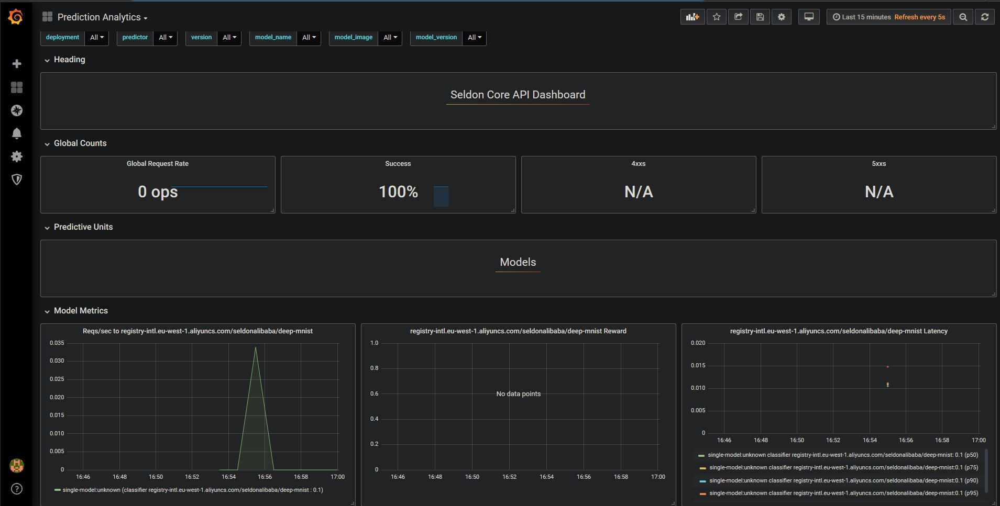

# Alibaba Cloud Container Service for Kubernetes (ACK) Deep MNIST Example
In this example we will deploy a tensorflow MNIST model in the Alibaba Cloud Container Service for Kubernetes.

This tutorial will break down in the following sections:

1) Train a tensorflow model to predict mnist locally

2) Containerise the tensorflow model with our docker utility

3) Test model locally with docker

4) Set-up and configure Alibaba Cloud environment

5) Deploy your model and visualise requests

#### Let's get started! 🚀🔥

You can access the tutorial on the following versions:

* [English Version Jupyter Notebook](alibaba_cloud_ack_deep_mnist.ipynb)
* [Chinese Version Jupyter Notebook](alibaba_cloud_ack_deep_mnist_cn.ipynb)

By the end you will have deployed a model in your Alibaba Cloud Container Service for Kubernetes cluster and should be able to visualise real-time metrics as per the image below:

