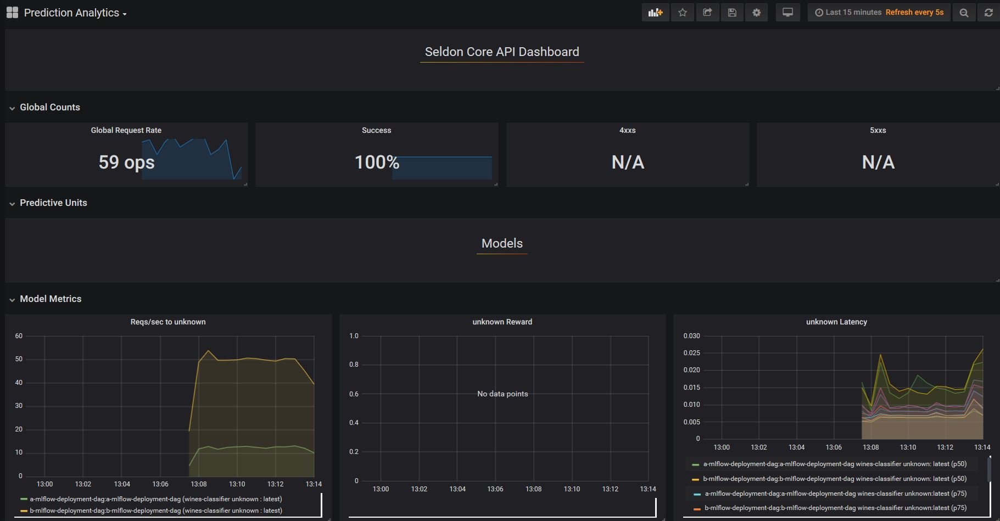

# MLFlow Pre-packaged Model Server AB Test Deployment

In this example we will deploy a tensorflow MNIST model in the Alibaba Cloud Container Service for Kubernetes.

This tutorial will break down in the following sections:

1) Train a tensorflow model to predict mnist locally

2) Containerise the tensorflow model with our docker utility

3) Test model locally with docker

4) Set-up and configure Alibaba Cloud environment

5) Deploy your model and visualise requests

#### Let's get started! 🚀🔥

You can try it by going to the [Jupyter notebook in this folder](mlflow_model_server_ab_test_deployment.ipynb).

By the end you will have deployed A/B test which you will be able to visualise through grafana as per the screenshot below:

