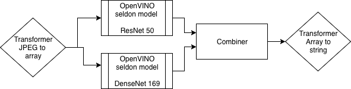

# Inference pipeline example with models ensemble and python_openvino image

## Overview
The pipeline presented here includes the following components:

* an [input transformer](resources/transformer) that converts jpeg compressed content into NumPy array
* two [model components](resources/model) that executes inference requests using ResNet and DenseNet models
* a [combiner component](resources/combiner) that implements the ensemble of models
* an [output transformer](resources/transformer) that converts an array of classification probabilities to a human-readable top1 class name



The model component is based on [python_openvino](../../../wrappers/s2i/python_openvino) model wrapper
which includes OpenVINO inference engine python API. It can be used as a base for all kind of models implementation
using optimized inference execution and OpenVINO models.


# Deployment and execution
Try executing the pipeline by following the steps in the [jupyter notebook](openvino_imagenet_ensemble.ipynb).
 
It is recommended it run it on Kubernetes nodes with 32vCPU nodes. When less resources is available on the nodes,
adjust the env variables in the pipeline OMP_THREADS to match the physical cores you allocated (vCPU/2).

This pipeline uses public docker images, public pre-trained models and includes sample images. 
Only the kubernetes instance is needed to follow it and reproduce in your environment.

You can use included grpc client to connect to the deployed pipeline and submit the inference requests.
```bash
python seldon_grpc_client.py --help
usage: seldon_grpc_client.py [-h] [--repeats REPEATS] [--debug]
                             [--test-input TEST_INPUT]
                             [--ambassador AMBASSADOR]

optional arguments:
  -h, --help            show this help message and exit
  --repeats REPEATS
  --debug
  --test-input TEST_INPUT
  --ambassador AMBASSADOR

example:  
python seldon_grpc_client.py --ambassador IP:port --test-input input_images.txt
```


## References:
 
[intel.ai blog post](https://www.intel.ai/inference-performance-boost-with-seldon-on-intel-xeon-scalable-processors)

[seldon model wrapper with openvino python API](../../../wrappers/s2i/python_openvino)

[Inference Engine Dev Guide](https://docs.openvinotoolkit.org/latest/_docs_IE_DG_Deep_Learning_Inference_Engine_DevGuide.html)

[OpenVINO model zoo](https://github.com/opencv/open_model_zoo)