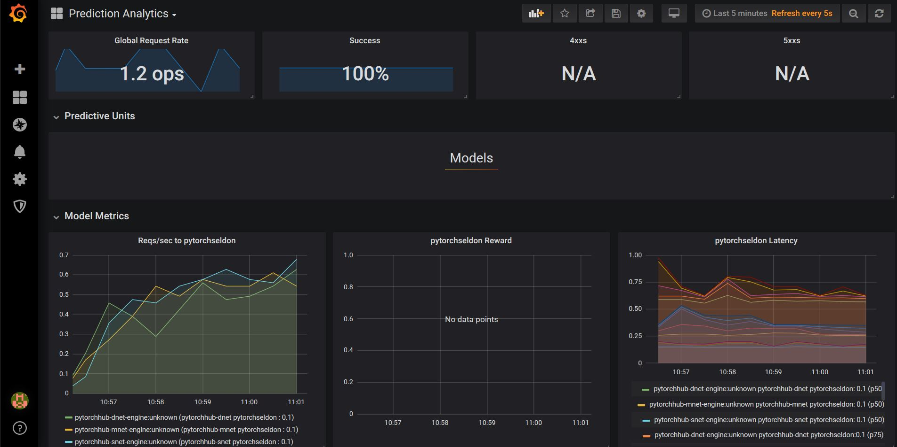

# Production-level PyTorch Hub models in k8s with 10 lines of Python code

In this example we will showcase how to use Seldon to use our re-usable PyTorch Hub Seldon Deployment to be able to productionise your PyTorch Hub models with a single line of code.

PyTorch Hub is a pre-trained model repository designed to facilitate research reproducibility. Extending PyTorch with Seldon Deployments allows us to go from reproducible research models to robust production machine learning systems.

The architectural diagram of the the PyTorchHub SeldonDeployment project is the following:


This tutorial will break down in the following sections:

1) Run all the services (Kubeflow and Seldon)

2) Test and build all our reusable pipeline steps

3) Use Kubeflow to Train the Pipeline and Deploy to Seldon

5) Test Seldon Deployed ML REST Endpoints

6) Visualise Seldon's Production ML Pipelines

# Before you start
Make sure you install the following dependencies, as they are critical for this example to work:

* Helm v2.13.1+
* A Kubernetes cluster running v1.13 or above (minkube / docker-for-windows work well if enough RAM)
* kubectl v1.14+
* ksonnet v0.13.1+
* kfctl 0.5.1 - Please use this exact version as there are major changes every few months
* Python 3.6+
* Python DEV requirements (we'll install them below)

Let's get started! 🚀🔥 


## 1) Set-up all the dependencies

Before we start, we will need to run the Seldon Deployment and Seldon Analytics in your Kubernetes cluster.

Please refer to these two tutorials:

* Installing and running Seldon in your Kubernetes Cluster
* Installing and running Seldon Analytics in your Kubernetes Cluster

## 2) Build your own PyTorch Hub Seldon Deployment 

In this section now we'll learn how we actually built the generic Seldon wrapper for pytorch hub.

If you would like to skip this section and just deploy a model, we've created a pre-built image you can use in the next steps.

This will allow for you to extend it if you need any  specific custom functionality.

This is quite simple, and only requires 4 steps:

2.1) Write a Python simple wrapper that exposes a `predict` function

2.2) Specify the dependencies for your model through a requirements.txt file

2.3) Run the source2image configuration command to build your container image

### 2.1) Write a simple Python wrapper that exposes the functionality through a predict function


```python
!mkdir deployment_image
```

    mkdir: cannot create directory ‘deployment_image’: File exists


```python
%%writefile deployment_image/PyTorchSeldonDeployment.py
import os, torch, pickle

class PyTorchSeldonDeployment:

    def __init__(self, repo, name):
        self._repo = repo
        self._name = name
        self._model = torch.hub.load(
                self._repo,
                self._name,
                pretrained=True)

        if torch.cuda.is_available(): 
            model.to('cuda')

    def predict(self, X_bytes, feature_names=[]):
        X = pickle.loads(X_bytes)

        if torch.cuda.is_available():
            X = X.to('cuda')

        response = self._model(X)

        response_bytes = pickle.dumps(response)
        return response_bytes
```

    Writing deployment_image/PyTorchSeldonDeployment.py


### 2.2) Specify the dependencies for your model through a requirements.txt file


```python
%%writefile deployment_image/requirements.txt
numpy==1.15.4
torch==1.1.0
image==1.5.27
```

    Writing deployment_image/requirements.txt


### 2.3) Use source2image to build your container image


```python
!mkdir deployment_image/.s2i
```


```python
%%writefile deployment_image/.s2i/environment
MODEL_NAME=PyTorchSeldonDeployment
API_TYPE=REST
SERVICE_TYPE=MODEL
PERSISTENCE=0
```

    Writing deployment_image/.s2i/environment


```python
!s2i deployment_image/. s2i build . seldonio/seldon-core-s2i-python36:0.8 pytorchseldon:0.1
```

## 3) Let's deploy MobileNet from PyTorch Hub

Before we dive into the code itself (10 lines of code), we'll try to deploy a couple of models.

For this section we will be deploying a couple of examples.

### Create a Seldon Graph Definition

The seldon graph definition is basically a computational DAG (Directed Acyclic Graph) definition for the components in your machine learning pipeline.

In this case we define our graph below - the structure contains the main three key pieces:

1) An outline of the containers used in the graph (each with a name for reference)

2) The hierarchical order in which the graph will execute (referencing the containers through the names)

3) The parameters that we pass to the model

We will start by creating an easily re-usable template where we'll be able to specify the model by replacing the string `MODEL_NAME` with the command:

```
sed 's|MODEL_NAME|CHOSEN_MODEL|g' pytorch_seldon_template.yaml
```

You can also use the `seldonio/pytorchseldon:0.1` image if you prefer to use our hosted image (it's the same as above).


```python
%%writefile pytorch_seldon_template.yaml
---
apiVersion: machinelearning.seldon.io/v1alpha2
kind: SeldonDeployment
metadata:
  name: pytorchhub-DEPLOYMENT_NAME-deployment
spec:
  annotations:
    project_name: PyTorch Hub Engine
    deployment_version: v1
  name: pytorchhub-DEPLOYMENT_NAME-deployment
  predictors:
  - componentSpecs:
    - spec:
        containers:
        - image: pytorchseldon:0.1
          imagePullPolicy: IfNotPresent
          name: pytorchhub-DEPLOYMENT_NAME
        terminationGracePeriodSeconds: 20
    graph:
      name: pytorchhub-DEPLOYMENT_NAME
      endpoint:
        type: REST
      type: MODEL
      children: []
      parameters:
      - name: repo
        type: STRING
        value: pytorch/vision
      - name: name
        type: STRING
        value: MODEL_NAME
    name: pytorchhub-DEPLOYMENT_NAME-engine
    replicas: 1

```

    Overwriting pytorch_seldon_template.yaml


### Details: Defining the PyTorch Model through the parameters

As you can see in the `pytorch-MODEL_NAME` model we will add, we are passing the name of the model we want as the parameter "name", which is what will specify which pytorch hub model to use:

```
    graph:
      name: pytorch-MODEL_NAME
      endpoint:
        type: REST
      type: MODEL
      children: []
      parameters:
      - name: repo
        type: STRING
        value: pytorch/vision
      - name: name
        type: STRING
        value: MODEL_NAME
```

In this section is where we can just change the configuration and a new PyTorch Model will be downloaded.

### Run the configuration for the VGG

Now that we've defined the configuration file, we will deploy it with the `mobilenet_v2` model.

For this we just have to run the replaced file into `kubectl apply -f -`. 

In this case we are applying the file with the model `mobilenet_v2` and the deployment name `"mnet"`.


```bash
%%bash 
sed 's|MODEL_NAME|mobilenet_v2|g; s|DEPLOYMENT_NAME|mnet|g' pytorch_seldon_template.yaml | \
    kubectl apply -f -
```

    seldondeployment.machinelearning.seldon.io/pytorchhub-mnet-deployment created


### Wait until the MobileNet network is ready

The container will first download the trained image and then spin up when ready. You can check if the pod has successfully started by running the following command:


```python
!kubectl get pods | grep mnet
```

    pytorchhub-mnet-deployment-pytorchhub-mnet-engine-e33c4ea-vr454   2/2     Running     0          48s


If you want to make sure that it's still downloading, you can attach to the logs of that container with the following command:

**NOTE: With this command below it attaches to the container, so when you see that the microservice is running you can stop the command so you can continue, otherwise it will just run forever**


```python
!kubectl logs -f pytorchhub-mnet-deployment-pytorchhub-mnet-engine-e33c4ea-vr454 pytorchhub-mnet -f
```

    starting microservice
    2019-06-23 09:16:55,856 - seldon_core.microservice:main:154 - INFO:  Starting microservice.py:main
    2019-06-23 09:16:55,857 - seldon_core.microservice:load_annotations:104 - INFO:  Found annotation deployment_version:v1 
    2019-06-23 09:16:55,857 - seldon_core.microservice:load_annotations:104 - INFO:  Found annotation kubernetes.io/config.seen:2019-06-23T09:16:52.9451781Z 
    2019-06-23 09:16:55,857 - seldon_core.microservice:load_annotations:104 - INFO:  Found annotation kubernetes.io/config.source:api 
    2019-06-23 09:16:55,857 - seldon_core.microservice:load_annotations:104 - INFO:  Found annotation project_name:PyTorch Hub Engine 
    2019-06-23 09:16:55,857 - seldon_core.microservice:load_annotations:104 - INFO:  Found annotation prometheus.io/path:prometheus 
    2019-06-23 09:16:55,857 - seldon_core.microservice:load_annotations:104 - INFO:  Found annotation prometheus.io/port:8000 
    2019-06-23 09:16:55,857 - seldon_core.microservice:load_annotations:104 - INFO:  Found annotation prometheus.io/scrape:true 
    2019-06-23 09:16:55,858 - seldon_core.microservice:main:185 - INFO:  Annotations: {'deployment_version': 'v1', 'kubernetes.io/config.seen': '2019-06-23T09:16:52.9451781Z', 'kubernetes.io/config.source': 'api', 'project_name': 'PyTorch Hub Engine', 'prometheus.io/path': 'prometheus', 'prometheus.io/port': '8000', 'prometheus.io/scrape': 'true'}
    2019-06-23 09:16:55,858 - seldon_core.microservice:main:189 - INFO:  Importing PyTorchSeldonDeployment
    Downloading: "https://github.com/pytorch/vision/archive/master.zip" to /root/.cache/torch/hub/master.zip
    Downloading: "https://download.pytorch.org/models/mobilenet_v2-b0353104.pth" to /root/.cache/torch/checkpoints/mobilenet_v2-b0353104.pth
    100.0%
    2019-06-23 09:17:15,260 - seldon_core.microservice:main:226 - INFO:  REST microservice running on port 9000
    2019-06-23 09:17:15,260 - seldon_core.microservice:main:260 - INFO:  Starting servers
     * Serving Flask app "seldon_core.wrapper" (lazy loading)
     * Environment: production
       WARNING: Do not use the development server in a production environment.
       Use a production WSGI server instead.
     * Debug mode: off
    2019-06-23 09:17:15,279 - werkzeug:_log:122 - INFO:   * Running on http://0.0.0.0:9000/ (Press CTRL+C to quit)
    ^C


## Interact with your deployed model via the REST API

We now have a Seldon Deployment of the MobileNet V2 listening for commands. We can send a request using the Seldon Client:


```python
from seldon_core.seldon_client import SeldonClient

sc = SeldonClient(
    gateway="ambassador", 
    ambassador_endpoint="localhost:80",
    namespace="default",
    payload_type="bytes",
    transport="rest")
```

### Get some data to send to the model


```python
import urllib
url, filename = ("https://github.com/pytorch/hub/raw/master/dog.jpg", "dog.jpg")
try: urllib.URLopener().retrieve(url, filename)
except: urllib.request.urlretrieve(url, filename)
```

We can use the image file you downloaded called `dog.jpg`


### Convert the image into a tensor


```python
from PIL import Image
from torchvision import transforms
input_image = Image.open(filename)
preprocess = transforms.Compose([
    transforms.Resize(256),
    transforms.CenterCrop(224),
    transforms.ToTensor(),
    transforms.Normalize(mean=[0.485, 0.456, 0.406], std=[0.229, 0.224, 0.225]),
])
input_tensor = preprocess(input_image)
input_batch = input_tensor.unsqueeze(0) # create a mini-batch as expected by the model
input_batch.shape
```


    torch.Size([1, 3, 224, 224])


```python
import pickle
from seldon_core.utils import seldon_message_to_json

seldon_message_proto = sc.predict(
    bin_data=pickle.dumps(input_batch), 
    deployment_name="pytorchhub-mnet-deployment",
    names=["image_features"])
```

    <class 'NoneType'>


```python
import base64

def unpickled_proto_response(bin_data):
    seldon_message_dict = seldon_message_to_json(seldon_message_proto.response)
    decoded_data = base64.b64decode(seldon_message_dict['binData'])
    return pickle.loads(decoded_data)
```


```python
result = unpickled_proto_response(seldon_message_proto)
print(result)
```

    tensor([[-1.4330e+00, -4.9740e-01, -1.0928e+00, -2.1204e+00, -8.3041e-01,
              1.3389e-01, -8.7533e-01,  1.5980e+00,  1.3235e+00, -1.0711e+00,
             -5.9168e-01, -7.8693e-01, -2.0388e-01, -7.9074e-01, -1.7512e+00,
             -2.5161e-01, -1.4408e-01,  2.6692e-01,  2.1198e-01, -8.0811e-01,
             -2.2025e+00, -1.3507e+00, -2.1353e+00,  5.0871e-01, -7.9707e-01,
             -1.5032e+00, -1.0638e+00, -1.6637e+00, -1.2285e+00, -1.5053e-01,
             -1.1163e+00, -1.2226e+00, -8.9330e-01, -1.5911e-01,  1.1483e-01,
             -7.1935e-01,  1.0405e+00, -1.1046e+00, -6.9327e-01,  1.6837e+00,
              1.9495e-01, -1.0450e+00, -5.6622e-01,  4.1831e-01,  1.4902e-01,
             -1.4781e+00,  3.2513e-02,  3.3965e-01, -1.1519e+00, -1.6894e+00,
             -7.9146e-01,  3.7503e-01,  4.6002e-01, -4.9682e-01, -4.0816e-01,
             -1.2634e+00, -8.6771e-01, -1.5838e+00, -4.5533e-01, -5.6035e-01,
              4.5671e-01, -4.1993e-01, -2.0381e-01, -1.3952e-01, -4.6230e-01,
             -1.5501e-02, -4.7154e-01, -3.6576e-01, -5.2370e-01, -4.8470e-01,
             -1.5447e+00,  4.6213e-01, -5.9440e-01,  5.2693e-01, -3.1549e-03,
             -7.1473e-01, -2.6096e-01,  2.9233e-01, -2.9513e-01,  6.2118e-02,
             -1.1234e+00, -2.0163e+00,  3.9848e-01, -6.4592e-01, -1.0320e+00,
             -4.3730e-02,  5.0703e-01,  7.8969e-01,  1.2479e-01,  2.9540e-01,
             -1.4064e+00, -5.0540e-01, -1.8219e+00, -1.3251e-01,  7.0103e-02,
             -2.5178e+00, -5.5238e-01, -3.3045e-01, -2.6408e+00, -5.9155e-01,
             -1.1385e+00, -1.2528e+00, -1.6340e+00, -1.3029e+00,  3.3403e-01,
             -6.2710e-01, -8.9324e-01, -8.0238e-01, -1.7688e+00, -1.6076e+00,
             -2.4420e+00, -1.5378e+00,  1.4643e+00,  7.8148e-01,  5.2873e-01,
             -2.3474e+00, -1.7809e+00,  1.6865e-01,  5.6678e-02, -4.8566e-01,
             -9.2665e-01, -3.5156e-01,  6.6649e-01, -9.2558e-02,  1.3140e+00,
             -6.8347e-02, -5.3508e-01, -2.4810e+00, -2.1343e+00, -1.0609e+00,
             -2.4853e+00, -2.2175e+00, -2.1156e+00, -2.2985e+00, -1.0338e+00,
             -2.4828e+00, -8.8791e-01, -1.2072e+00, -2.1511e+00, -2.2922e+00,
             -1.3802e+00, -2.3329e+00, -2.4403e+00, -2.8457e+00, -1.4536e+00,
             -6.8044e-01, -1.2266e+00, -2.5517e+00, -1.6689e+00, -1.7816e+00,
              1.7297e-01,  2.0898e+00, -7.6187e-01, -4.5540e-01,  5.8270e-01,
              4.6388e-01, -9.0012e-01,  1.4478e-01,  5.4826e-01,  8.5118e-01,
              3.0786e-01, -2.6673e-01, -1.8679e-01,  3.9841e-01,  7.0764e-01,
             -5.3219e-01, -5.3309e-01, -4.0022e-01,  1.0094e+00, -9.8959e-01,
              4.3131e-01,  1.0459e+00,  3.7711e-01, -1.0536e-01,  3.5346e-01,
             -4.8365e-01,  3.4830e-01,  8.9205e-02,  5.7154e-01,  5.0653e-01,
              5.5260e-01,  2.5964e-01,  1.0525e+00,  3.2929e-01,  8.2899e-01,
              1.1215e+00,  9.8372e-01,  2.6502e-01, -2.0140e-01,  7.5872e-01,
             -5.0935e-01, -8.8825e-02,  7.0978e-01,  7.5773e-01, -1.1691e+00,
              1.3239e+00,  2.8265e-01,  3.7685e-01,  7.4656e-01,  8.5674e-01,
              5.8698e-01, -4.0380e-02,  6.5682e-01,  7.7440e-01,  6.7963e-01,
              5.8268e-01,  5.9502e-01,  5.2676e-01,  9.5781e-01, -1.8774e-03,
              2.1784e-01,  6.0365e-01,  2.3321e-01, -3.4289e-02,  4.2628e-01,
              2.3947e-01, -1.3900e-01,  2.7390e-01, -8.1542e-01, -5.2831e-02,
             -1.9777e-01, -3.7599e-01,  7.1921e-01,  1.3423e+00,  8.2255e-01,
              7.9196e-01,  8.9143e-03,  1.0171e+00, -3.8918e-01, -2.4796e-02,
             -4.5569e-01,  4.0370e-01,  4.8612e-01,  1.2125e-01,  3.4144e-01,
              4.1630e-01,  1.0892e-01,  3.8576e-01,  5.5126e-02,  3.7656e-01,
              3.9027e-01, -2.8836e-01,  4.9959e-01,  6.1777e-01,  4.1543e-01,
              7.2662e-01,  1.0526e+00, -5.9238e-01,  7.1863e-01, -2.9579e-01,
              7.4414e-01,  6.5609e-01, -4.4321e-01,  7.9711e-02,  1.5143e+00,
             -7.4178e-01,  8.1160e-01,  1.8391e-01, -4.2093e-01,  8.7589e-01,
              1.1915e-01, -6.1999e-01,  2.2579e-01,  1.3956e-02,  1.6894e-01,
              1.1962e+00,  4.2979e-01,  9.6895e-01,  1.2575e+00, -5.1843e-02,
             -9.3547e-01, -6.1240e-01, -8.6115e-01,  4.7047e-01, -5.5563e-01,
             -6.5238e-01, -6.2132e-01, -7.5196e-01, -1.6243e+00, -1.1628e+00,
             -3.3248e-01,  9.4873e-01,  9.2997e-01, -9.2640e-02, -3.8461e-01,
              1.2943e+00, -1.1156e+00,  2.1930e-01, -4.4879e-01, -2.0285e+00,
             -1.5609e+00, -1.1612e+00,  1.0529e-02, -1.2377e+00, -2.7025e+00,
             -1.2589e+00, -1.6638e+00, -2.2974e+00,  1.7159e-02, -3.4549e-01,
             -2.5861e+00, -7.1006e-01, -8.4305e-01,  1.2474e-01, -1.1071e+00,
             -1.0730e+00,  8.4925e-01, -1.2957e-01, -1.1813e+00,  3.4863e-01,
              8.1268e-01,  4.4428e-01,  5.2360e-01,  2.0072e-01,  8.7583e-01,
             -1.1504e-01, -8.9507e-01, -1.2966e+00, -1.4375e+00,  7.2178e-01,
             -1.6606e+00, -9.3947e-01, -9.2971e-01, -1.6210e+00, -1.7429e+00,
             -2.1700e+00, -6.0158e-01, -3.8840e-01, -6.8766e-01, -1.4361e+00,
             -2.1534e-01, -1.6759e-01,  2.2748e-01, -1.5097e-01, -3.7161e-01,
             -4.2941e-01, -1.2739e+00, -4.6353e-01,  5.4385e-01, -1.1031e+00,
             -5.6588e-02,  4.9824e-01, -7.8009e-01, -1.2068e+00, -1.6010e+00,
              6.1461e-01, -2.5812e-01, -1.7949e+00,  3.4086e-01, -1.4604e+00,
             -8.6468e-01, -1.5470e+00, -1.0410e+00, -7.5554e-01, -1.1244e+00,
              7.3643e-01,  6.7108e-01, -3.9069e-02,  5.1029e-01, -4.5417e-02,
             -8.4930e-01, -8.5176e-01, -1.1922e+00,  5.4477e-01, -2.1569e-01,
              4.5254e-01, -1.0161e+00,  1.3976e-01, -4.0349e-01, -3.0147e-01,
             -9.0482e-02,  6.8261e-02, -6.6617e-01,  1.5849e-01, -7.6672e-02,
             -5.9153e-01, -1.2678e+00,  1.3498e+00, -8.6546e-01,  7.9156e-01,
              1.3858e+00,  6.6056e-01,  1.7867e-01,  3.3634e-01, -2.8285e-04,
             -5.6570e-01, -1.0650e+00, -1.2496e+00, -1.4579e+00, -7.1717e-01,
             -1.7761e-01, -4.9465e-01, -1.8286e+00, -2.5942e+00, -1.3155e+00,
              5.1167e-01, -1.0090e+00, -6.7688e-01,  2.7905e-01,  6.0712e-01,
             -1.0645e+00,  1.0789e+00,  7.7721e-01, -2.7627e+00, -2.2902e+00,
             -9.8354e-01, -6.9733e-01, -4.1275e-01, -1.3164e+00,  1.9223e+00,
              1.6135e-01,  8.1545e-01,  1.5841e+00,  6.3567e-01,  2.1829e-01,
              3.6297e-01, -1.3034e+00,  3.3389e-01,  2.6976e-01,  1.4332e+00,
              1.3631e+00,  1.3848e+00,  5.3600e-02, -3.6203e-02, -2.1264e-02,
             -3.4493e-01,  1.2711e+00,  1.7407e+00,  1.4055e+00,  1.4545e+00,
             -1.2340e+00, -5.6628e-01,  1.1092e+00,  4.4789e-01,  6.0433e-01,
              1.8680e+00, -1.3101e+00, -7.1997e-01,  6.5290e-01,  1.0483e+00,
              7.6825e-01, -2.0269e-01,  5.4227e-01, -3.9504e-01, -9.0727e-01,
              9.2471e-02,  3.3235e-01,  2.3451e+00,  6.6680e-01, -1.2255e+00,
             -9.3639e-01,  8.7986e-02,  5.2772e-02, -7.1008e-01, -7.4574e-01,
             -5.1267e-01,  2.1480e+00,  1.5717e+00,  7.4614e-02,  1.6909e+00,
             -8.7370e-02,  1.1856e+00,  2.1048e+00,  2.7678e+00,  6.8628e-01,
             -1.1076e+00, -2.0994e+00, -3.1607e-01, -1.2706e+00,  2.2383e+00,
              1.6323e+00,  1.1889e+00,  5.3162e-01,  1.2213e+00,  4.1837e-01,
              3.3060e-01, -1.8201e+00,  1.8444e-01,  7.7163e-01, -6.6845e-01,
              1.3259e+00,  4.3343e-01,  3.4760e-01, -1.5177e+00, -8.8623e-01,
              9.9948e-01, -1.3924e+00,  1.7358e+00,  2.2874e+00,  9.5514e-01,
              8.3175e-01,  8.7416e-02,  5.2815e-01, -8.3426e-01,  1.6885e+00,
             -1.6934e+00, -1.6743e-01, -4.2355e-01,  4.1109e-01,  2.0445e+00,
             -2.1745e+00,  1.4404e+00,  9.8590e-01,  5.9911e-01,  1.4815e+00,
              1.0383e+00,  1.2752e+00,  3.6168e-01,  9.7451e-01, -9.9827e-01,
             -1.3063e+00, -1.0528e+00,  1.7094e+00,  1.1706e+00,  1.8680e+00,
              2.5190e+00, -1.8569e-01, -5.3280e-01,  1.3074e+00,  1.1203e+00,
             -1.6678e+00, -1.0167e-01,  1.4572e+00,  8.1577e-01,  3.7637e-01,
             -1.3542e+00,  2.2974e-01,  2.9381e-01,  1.2931e+00,  9.8934e-02,
              1.0816e+00, -4.2678e-01, -4.3893e-01, -1.5431e+00,  9.0282e-01,
             -1.3516e+00, -6.3430e-02, -7.7844e-01,  3.0036e-01,  1.0724e+00,
             -9.3827e-01,  2.2459e+00,  2.6276e+00,  3.2939e-01,  7.7752e-01,
              1.2557e+00,  1.1282e+00, -2.4006e+00, -9.7202e-01, -4.0845e-01,
             -8.8707e-01,  2.8534e-01,  1.5742e+00,  1.2473e-01, -1.3513e+00,
             -6.4750e-01,  6.8328e-03,  5.3135e-01,  1.4410e+00,  1.0859e+00,
              2.4097e-01, -5.6183e-01, -4.6861e-01, -1.3746e-01, -1.7431e+00,
             -1.4833e+00,  1.3608e+00,  1.5444e+00, -8.6502e-02, -1.0423e+00,
              1.6600e+00,  1.0226e+00,  1.6287e+00, -1.9673e+00,  1.3841e+00,
              7.9713e-02, -4.9251e-01,  1.5319e+00,  7.8379e-01,  1.0548e+00,
             -4.7870e-01, -2.6910e-01,  1.5409e-01,  1.0857e+00,  7.2689e-01,
              1.2498e+00, -8.8999e-01,  1.7846e+00,  5.9218e-02,  1.1003e+00,
             -2.7677e-01,  6.7946e-01,  5.0556e-01,  8.2397e-01,  1.4146e-01,
             -1.1431e+00,  2.3540e+00,  5.3664e-01,  5.9165e-01,  1.2810e+00,
              3.1525e+00,  2.2138e-01, -8.5701e-01, -5.0987e-02,  7.1064e-01,
              7.0584e-01,  1.4598e+00, -9.9501e-01,  1.0400e+00, -1.3626e+00,
              1.4840e+00, -9.6197e-01, -4.5945e-01,  7.3883e-01,  3.2387e-01,
              2.2783e-01,  2.1445e+00,  1.0357e+00,  2.0459e+00,  1.5949e+00,
              1.3964e+00,  3.9530e-01, -1.6331e-01,  5.7956e-01, -2.2645e-01,
             -1.0514e+00,  1.0279e+00, -6.5903e-01, -1.1276e+00,  1.8749e-01,
              8.1631e-01,  1.8437e+00,  1.9695e+00,  1.9079e+00, -6.3977e-01,
              1.2078e+00,  1.6620e+00,  1.7551e+00,  1.0034e+00,  8.5485e-01,
             -2.8799e+00,  1.1183e+00,  7.9426e-01,  2.3812e+00,  1.4156e+00,
             -1.2623e+00, -4.3772e-02, -2.4268e-01, -1.0898e+00, -1.4468e+00,
              1.7698e+00,  3.9625e-01,  1.2559e+00,  1.3730e+00, -6.9217e-01,
              9.1798e-01, -2.5259e-01,  4.3959e-01, -3.8252e-01, -3.0854e-02,
              5.4095e-01, -1.0450e+00,  7.0542e-01, -4.2127e-01,  1.5104e+00,
             -1.0143e+00,  8.4794e-01,  4.2536e-01, -1.4152e+00, -1.5908e+00,
             -3.9825e-01, -4.1683e-01, -8.8630e-01,  5.3595e-01,  2.1648e+00,
             -8.6672e-01,  1.9284e+00,  1.4729e+00,  2.4446e-01,  5.1240e-02,
              2.0804e-01,  1.2303e+00, -7.1011e-01,  4.1321e-01,  5.3390e-01,
             -1.0400e+00,  3.6385e-01, -8.8897e-01,  3.8747e-02, -6.4857e-01,
             -1.2810e+00,  1.5574e+00,  8.9420e-01,  7.9876e-01, -9.3385e-01,
              1.1772e+00,  1.9557e+00, -2.7750e-01, -8.5345e-01,  1.7435e+00,
              2.1254e+00, -9.2283e-02, -1.1184e+00,  4.3399e-01,  4.5440e-01,
             -1.1339e+00, -2.3761e-01,  7.1444e-01,  7.1826e-01, -4.8785e-01,
              6.0148e-01,  1.4959e+00,  8.9603e-01,  1.7400e-01,  1.3170e+00,
             -2.8826e-01,  2.4951e-01, -2.1700e+00, -3.0543e-01,  1.2745e-01,
              3.4232e-01,  2.6951e-01,  1.8638e+00,  7.1079e-01, -5.4137e-01,
              1.1564e+00, -1.6086e+00,  4.8817e-01,  1.0103e+00, -8.3808e-01,
             -2.3408e-01,  2.4453e+00,  1.3848e-01,  2.4492e+00, -2.6548e+00,
              7.1480e-01,  3.4498e-01,  1.1008e+00,  1.0418e+00, -4.4233e-01,
              4.4447e-01, -5.4854e-01,  7.7215e-01,  6.9973e-01,  8.5667e-01,
              3.7390e-01, -2.4666e-01,  1.0145e+00,  1.0532e+00,  2.2493e+00,
              4.6602e-01, -1.7179e+00,  1.4900e+00,  3.7567e-01,  1.8196e+00,
             -1.4755e-01,  2.1381e+00,  1.0590e+00,  1.3656e+00,  1.3261e-01,
             -6.3452e-02,  8.8277e-02,  3.6097e-01,  8.7465e-01,  1.5957e+00,
              3.7523e-01, -2.6479e-02,  5.7263e-01,  2.4736e-02,  1.2348e+00,
              4.1806e-01,  1.2866e+00,  1.0220e+00,  2.1151e-01,  1.4249e+00,
              9.1402e-01,  1.3331e+00,  1.8456e+00,  1.7599e+00, -1.1147e+00,
             -1.7841e-01, -5.7700e-01,  1.6525e+00,  2.0230e+00,  1.4907e+00,
              9.9416e-02,  1.2276e+00,  1.5430e+00, -2.5575e-01,  1.1751e-01,
             -1.3460e-01,  3.1919e-01,  2.2358e+00,  7.2004e-01,  2.7824e-01,
             -1.9353e-01,  1.2544e+00,  1.4514e-01, -2.6729e-01, -1.3520e-02,
             -2.5611e-01, -1.8386e-01, -1.4456e+00, -1.7775e+00,  9.4784e-01,
              1.0385e+00,  1.0802e+00,  7.4286e-01,  1.8384e+00, -4.5846e-01,
              7.2912e-01,  1.1747e+00,  4.4352e-01,  1.6846e+00, -1.3735e+00,
             -3.9846e-01,  6.5491e-01, -1.3865e+00,  2.6876e+00,  2.8377e-01,
             -1.9906e+00, -1.9467e+00,  1.3643e+00,  9.8197e-01,  1.3313e+00,
             -1.2969e+00,  9.3525e-01,  8.7183e-01,  1.1642e+00, -1.6201e+00,
              9.8419e-01,  4.0292e-01,  4.0135e-02, -7.0840e-01,  7.7438e-01,
             -1.5822e-01,  2.1524e+00,  1.8428e+00,  1.5527e+00, -1.7225e+00,
              1.7146e+00,  8.3647e-01, -2.1192e-01, -1.3333e+00,  1.2439e+00,
              1.9704e+00,  1.4227e+00, -1.4155e+00,  1.2083e+00,  8.1313e-01,
              1.4330e+00,  2.9818e+00,  3.0145e+00, -1.1148e+00,  2.7892e-01,
              1.1698e+00, -8.2766e-01, -8.8716e-01, -7.8726e-01,  3.2285e-01,
              5.0090e-01,  9.0701e-01,  6.0431e-01, -1.8450e-01, -1.1877e+00,
             -1.1479e+00, -7.3498e-01, -2.5580e-05,  1.3512e+00,  1.5533e-01,
             -6.4804e-01, -1.5353e+00,  6.5706e-01, -4.1585e-01, -3.4459e+00,
              7.7148e-01,  1.9807e+00, -7.0551e-02,  5.9761e-01,  8.5961e-01,
              6.9162e-01,  6.5290e-01,  1.0602e+00,  1.1572e+00, -1.9169e-01,
              5.5971e-01,  3.7788e-01, -5.7930e-01, -1.5896e+00,  9.4276e-02,
             -3.8516e-01, -2.1105e-01,  1.3753e+00,  3.4039e-01, -1.6548e-01,
             -9.7789e-01,  1.3209e+00,  8.1657e-01,  2.6770e+00,  2.1660e+00,
             -1.5121e+00, -6.1687e-01,  2.1526e+00,  7.5564e-01,  4.6580e-01,
              3.4910e-01,  5.8691e-02,  1.5108e+00, -1.7775e+00,  1.1082e+00,
              1.9479e+00,  1.6645e+00,  1.4556e+00, -6.9333e-01, -1.6628e+00,
             -1.0264e+00,  1.7533e-01,  7.0532e-02,  5.4915e-01,  1.4671e-01,
             -4.8262e-01,  2.5609e+00, -1.0353e+00,  8.3115e-01, -8.9147e-01,
             -1.3521e+00, -1.8751e+00, -1.7604e+00, -9.1738e-01,  1.4860e+00,
             -7.3926e-01, -2.7532e-01, -1.0448e+00, -3.0074e+00, -4.8156e-01,
             -1.1311e+00, -2.0666e-01,  1.4054e-01, -2.6841e-01,  1.5456e-02,
             -8.0202e-01, -1.8304e+00, -7.8100e-01,  4.4826e-01, -1.1040e+00,
             -6.1503e-01, -1.0981e+00, -2.9763e-01,  8.2461e-01,  2.1015e-01,
              2.7688e-01, -6.1188e-02, -5.3624e-01,  1.9144e-01,  7.4152e-01,
             -2.1906e-01, -6.7299e-01,  4.4928e-02, -1.7956e-01, -1.2313e+00,
             -2.6001e-01, -4.9383e-02, -1.2927e+00, -1.7034e+00, -3.0426e+00,
             -1.2337e+00,  1.4467e+00, -1.5067e+00,  1.1733e+00, -3.0564e-01,
              1.9105e-01,  1.7316e+00, -1.8258e-01, -1.5374e+00, -2.0121e+00,
              7.4934e-01, -1.4830e+00,  3.4154e-01, -3.4041e-01, -1.8361e+00,
             -1.1857e+00,  3.8160e-01, -6.7061e-02, -5.8118e-01, -4.8083e-01,
             -1.2998e+00, -2.1102e+00,  2.1509e+00, -2.7440e-01, -4.3221e-01,
             -5.8593e-01, -2.2662e+00, -1.8602e+00, -2.8755e+00, -1.0536e+00,
             -8.3695e-01, -4.0860e-01, -8.7891e-01,  1.1584e+00,  8.0334e-01]],
           requires_grad=True)


## 3) Deploy a few more models and visualise metrics

Now that we know what our workflow looks like, we can deploy more models. In this case we'll deploy a squeezenet model, and a densenet model.

#### Deploying the squezenet model


```bash
%%bash 
sed 's|MODEL_NAME|squeezenet1_0|g; s|DEPLOYMENT_NAME|snet|g' pytorch_seldon_template.yaml | \
    kubectl apply -f -
```

    seldondeployment.machinelearning.seldon.io/pytorchhub-snet-deployment configured


#### Deploying the densenet model


```bash
%%bash 
sed 's|MODEL_NAME|densenet121|g; s|DEPLOYMENT_NAME|dnet|g' pytorch_seldon_template.yaml | \
    kubectl apply -f -
```

    seldondeployment.machinelearning.seldon.io/pytorchhub-dnet-deployment created


```bash
%%bash 
sed 's|MODEL_NAME|densenet121|g; s|DEPLOYMENT_NAME|dnet|g' pytorch_seldon_template.yaml | \
    kubectl apply -f -
```

### Interact with both models using the same SeldonClient

##### Let's start with the squeezenet (which we called Snet)


```python
seldon_message_proto = sc.predict(
    bin_data=pickle.dumps(input_batch), 
    deployment_name="pytorchhub-snet-deployment",
    names=["image_features"])

unpickled_proto_response(seldon_message_proto)
```

    <class 'NoneType'>


    tensor([[ 7.3344,  7.9111, 13.0409, 11.7355, 11.1145,  9.1319,  9.6167, 18.9222,
             23.1842, 12.5593,  7.8293,  9.0537,  8.3661, 10.6228,  5.0446,  7.1391,
             13.5780, 13.3673, 10.9086,  8.3717, 10.1240, 14.2630, 14.6676, 17.8737,
             13.0535,  4.7774,  5.0082,  7.2305,  4.5269, 15.5195,  5.9449,  3.8930,
              5.0701,  6.1585,  6.2826,  4.8049,  7.6353,  7.0481,  5.4418,  6.2629,
              3.8449,  4.1280,  4.3896,  5.7580,  4.6446,  5.4393,  5.0399,  5.0743,
              7.8497,  5.5055,  5.5675, 11.2643,  5.2156,  5.7681,  7.4943,  5.1767,
              5.8598,  4.3628,  3.9076,  4.4946,  4.3012,  6.5492,  6.7286,  4.0350,
              4.5268,  4.4444,  5.9506,  5.5000,  4.5276,  1.8928,  3.2864,  1.9421,
              3.7542,  4.3784,  4.2017,  5.4236,  6.0290,  4.1888,  5.7185,  4.0853,
              8.0802, 12.2144, 11.7385, 11.3793, 15.5667,  9.3782, 12.8645,  9.7796,
              9.6429, 14.0086,  6.2304,  7.7380,  5.7446, 11.9736, 11.2676,  7.2487,
             12.2320, 12.5119,  8.3593, 14.5685, 10.7712,  7.6395,  8.1208,  7.4173,
             27.6855, 17.8198, 16.0021,  5.2698,  9.9358,  9.5715, 10.4906,  4.4050,
             10.5057,  6.0011, 10.1231,  8.7582,  3.8104,  5.5006,  3.3577,  3.1683,
              3.1505,  5.3429,  2.8992,  3.2615,  3.8483,  5.9829,  3.8440, 11.6430,
              8.4020, 14.1605, 10.9656,  8.0736, 12.6325,  5.0761, 13.2670,  7.7491,
              6.0039,  6.4401,  9.3217,  8.3686, 10.3116,  6.5177,  3.6825,  9.8826,
             13.7186, 14.7854, 15.8845,  4.7189,  7.5941, 10.3649,  6.7069, 26.6181,
             27.1215, 24.8347, 25.7835, 22.7652, 21.8805, 30.7404, 25.6557, 13.7652,
             21.4043, 16.5859, 19.1744, 13.0408, 15.6705, 10.0195, 17.9540, 17.5491,
             12.9495, 24.1909, 21.7245, 18.7513, 19.3033, 25.2164, 26.7632, 19.1826,
             18.7714, 16.4061, 16.2597, 24.0278, 22.9602, 16.4696, 19.4629, 16.8179,
             18.5162, 24.4226, 24.8952, 18.2832, 25.5693, 18.7318, 23.6248, 14.4579,
             25.3097, 24.8039, 21.4708, 22.1577, 22.4165, 19.6906, 20.3813, 25.0998,
             24.1346, 20.4781, 21.7051, 31.0317, 24.3342, 17.9792, 12.0226, 23.9095,
             22.7262, 15.3195, 16.9322, 13.8743, 25.5798, 15.7032, 15.1008, 24.1112,
             24.8022, 24.2218, 22.1672, 23.8527, 20.9365, 12.6284, 27.8043, 24.5065,
             22.1921, 20.6137, 20.9447, 24.6513, 20.1794, 24.6656, 28.0382, 29.8926,
             30.1156, 18.4186, 14.4160, 25.3709, 16.3522, 15.1904, 20.4148, 23.7235,
             22.4935, 19.5975, 20.7486, 17.2327, 21.1630, 22.1534, 19.0785, 24.0700,
             31.5456, 31.5922, 30.7573, 22.8424, 16.0236, 20.6544, 18.7609, 19.3862,
             22.2359, 31.1682, 35.0963, 29.5435, 24.6228, 29.2178, 16.5244, 28.5451,
             29.4392, 21.0568, 21.3851, 22.7775, 17.4784, 23.9757, 29.3100, 18.7383,
             16.7953, 22.5576, 18.0569, 18.9179, 15.6553, 19.6593, 17.8081, 30.0369,
             18.9647, 23.2205, 22.2159, 25.8065, 28.0512, 24.0096, 16.7323, 25.4687,
             12.6311, 18.4073, 11.5817, 14.5307, 19.3900, 15.1543, 14.1964, 13.6557,
             17.7390, 12.5529, 13.2392, 13.1473,  2.9007,  5.3389,  3.3681,  3.3212,
              3.8461,  4.2717,  5.1361,  2.5158,  4.8411,  9.2836,  6.8539,  4.3025,
              3.8495,  5.2628,  2.5941,  4.0070,  3.6318,  3.2519,  3.7550,  2.5863,
              2.4451,  7.2088,  8.0500,  3.8775,  9.8025,  5.1475,  5.2338, 12.6839,
             10.8551, 11.4925, 19.5820, 21.6651, 28.4781, 22.6282, 13.5702, 16.7123,
             16.2041, 11.2919, 23.9712, 11.8994, 11.7435, 19.9961, 12.8780, 10.3156,
              9.2194, 14.8228, 10.7457,  7.7230, 19.8594, 13.3677, 11.7919,  7.8804,
              7.3224, 11.8532, 11.7668, 21.4711, 23.4995, 15.8405, 23.1281, 23.2353,
             10.9524, 18.2367, 16.3074, 10.5263, 12.8276,  9.7081, 11.7697,  9.6147,
             17.3749, 10.9084, 18.6462, 17.2166, 14.1416, 18.4779, 17.7989, 15.8585,
             13.9959, 19.2324, 16.9396, 12.3021, 20.1490, 14.2022, 15.7356, 20.2560,
             19.1775,  7.6052,  6.5618, 15.0059, 19.4158, 10.0874,  6.2453,  8.8123,
              3.6463,  6.8993,  7.7264,  7.4921,  4.6047,  9.8382,  7.4280,  6.9276,
              7.2053,  6.2879,  6.4974,  3.8285,  8.2489,  6.1122,  5.7861,  7.8849,
              8.0226,  5.5972, 10.9028,  7.0455, 12.8274,  8.3846,  5.7509,  8.5015,
              8.5292,  7.9903,  6.3448, 10.0983,  9.1312,  6.6991,  8.7751,  5.3440,
              8.5697,  7.8107,  4.5567,  7.7493, 17.0465, 11.3501,  4.0787, 14.2076,
              8.5725,  6.2293, 16.5578, 13.4911,  7.2926,  7.7614,  4.0322, 11.1245,
              6.9975,  6.3892,  9.4541, 13.2365,  7.7463,  7.4240,  5.8324,  9.7880,
             10.4957,  5.5660, 11.0353,  5.0542, 14.0827, 11.5098, 11.7448,  9.6006,
              8.1220, 15.7493,  7.4765,  7.3817, 10.9409, 10.0918, 11.0779, 17.9347,
              4.1004,  7.7494,  6.5900,  7.6181,  7.1797,  9.7291,  5.8091, 12.3110,
              8.8407,  4.8850, 11.0559, 10.9207, 11.0628,  3.5345, 17.6939,  9.0729,
              9.2396,  5.4049,  5.4779,  9.7459,  4.6724,  6.6061,  6.1393,  9.8355,
              5.7961, 11.0938, 11.6295,  8.9966,  7.0013,  2.5524,  6.1855,  5.7989,
             14.9059,  9.6192,  6.3100,  7.4298,  5.7925, 14.0503, 12.4257,  5.4579,
              8.2603,  6.8474,  5.3138,  2.9887, 15.3942,  4.4674,  2.5500,  7.4749,
              2.0774,  7.4798,  7.1566, 13.3218, 12.0548,  3.8542,  7.0511, 11.5863,
             11.1808,  8.1960, 11.7236, 11.4399,  9.7172, 10.0814,  6.0109,  7.8618,
              4.3145, 12.3757,  6.9807,  6.4150,  7.3802,  6.6614, 17.7861,  5.5190,
              2.1093, 19.3064,  5.7302, 21.1280,  1.7387,  7.9891,  6.1330, 10.6383,
              7.9894,  4.7629,  7.1062,  2.7170,  5.5645,  7.6835,  3.4582,  7.6655,
             17.2103,  9.0224,  9.3928, 11.7212,  3.4927,  7.9100,  9.6293,  7.4292,
              7.3568,  5.6131, 10.0522,  3.1910,  6.4149,  4.3399, 10.1067,  5.9164,
             19.3609,  8.5204,  9.3024,  6.2766,  4.7632,  7.5734,  9.7330,  8.6786,
              7.7245,  7.7266, 10.3581,  7.5050, 11.6055,  4.7663,  8.1520,  7.9074,
              9.9691,  8.1930,  8.7510,  8.3975, 13.4923,  9.7782,  6.7348, 11.5011,
              3.3122, 10.2333, 10.1606,  6.4606, 10.6972,  6.3152,  5.3357,  6.7060,
              6.0532, 10.4174, 14.0337, 12.5619,  2.5474,  7.9070,  8.4787,  8.1626,
              9.4755,  8.4601,  8.1354, 10.5004,  5.8580,  6.0016, 11.4014,  6.1814,
              5.8044,  7.1015,  6.1291,  4.0156, 13.8891, 12.6268, 10.8377,  3.7947,
              9.3635,  6.7658,  7.1633,  9.6427,  4.3428,  8.1680,  8.5504,  7.0099,
              5.4208,  5.8859,  7.7083,  4.2277,  9.1095, 11.1758,  8.0682,  7.0370,
              3.5832,  6.3384,  8.0801, 10.0837,  4.5849,  7.2414,  9.6460,  3.9498,
              5.6355,  8.2812,  6.0378,  3.9833,  6.6533,  9.9630,  8.5829,  6.6329,
              7.6935, 12.5389, 12.7983,  6.9348,  9.7801,  4.8720,  4.3978,  7.1011,
             12.0493,  8.9641,  8.3445, 11.4833,  5.7036, 11.3200,  9.8561,  8.6859,
             10.9556, 13.6876, 13.4497,  7.9057, 22.2813,  6.2576, 11.8652,  8.1307,
             12.1891, 13.0942,  6.8836,  6.8151,  6.4699,  6.6329,  5.4102,  2.5655,
              7.5925,  8.5497, 13.5424,  8.4070,  5.5461,  6.6701,  6.5300,  4.7635,
              9.9450,  9.7666,  9.8792, 10.2651, 17.9163,  7.8901, 12.4537, 13.0370,
              7.4469,  6.2801,  7.7326,  5.6437,  6.4077,  8.2862,  6.6291,  5.6790,
              5.6088, 10.0396,  5.2499,  5.7429, 14.9980,  9.2008,  5.2299, 11.5451,
              6.3202, 13.4213, 12.4779, 12.8898,  4.4501, 10.9111,  1.3794,  8.3388,
             15.0839,  4.1937, 10.1494, 11.7717,  6.1185,  9.6887,  6.6232, 14.7399,
             10.7274,  4.9152,  6.3463,  6.1880,  7.9655, 10.4505, 19.0003,  5.3196,
             12.3744,  4.8104,  4.2197,  8.0458,  9.0244, 11.4026, 17.8215,  7.8560,
              8.0881, 10.8537,  5.7250,  7.3101, 10.1173,  6.8888,  6.8729,  7.5008,
             14.7374, 17.7802,  6.3761, 10.6944,  8.8585,  7.8231,  8.8528,  6.3435,
             10.3630,  9.8278,  8.5854,  4.0708,  9.8824,  7.4399,  7.0810,  7.3817,
              7.4120,  4.2564,  9.9303,  6.0326,  6.4598,  6.6807, 12.6696,  7.2740,
              5.7695, 12.3929,  4.5913, 10.9374,  9.2193,  8.9396,  8.8298, 13.8542,
             11.2408, 10.2471,  7.9191,  9.2557,  8.5605, 15.1894,  4.0148, 12.1855,
              9.3229,  8.0335,  8.6302,  8.7670,  6.3187, 20.2722, 11.9243,  5.1317,
              9.1851,  5.3698,  6.5097, 16.3199,  7.6871,  6.0219,  9.7791,  8.5044,
             10.9270,  6.1752,  6.9831,  9.3200, 11.9680,  4.4828,  6.2521,  8.8157,
             16.1864,  9.9654,  7.5687,  7.1539,  5.5548,  6.8747, 10.2112, 15.8019,
              7.9849,  4.9934,  7.3756,  7.2614, 10.8552, 13.7029,  8.1177,  7.6442,
              6.7404, 12.8911,  7.4809, 13.9076,  5.8372,  9.2686,  6.0997,  8.5863,
              6.4123,  7.8129, 15.2894, 10.1259, 23.0915, 10.4965,  5.5513,  7.9750,
              7.4721,  2.8621,  5.0531,  7.5693,  7.3367, 13.6463,  6.3768,  6.0182,
              6.9147, 12.5140,  7.5355,  6.0580,  8.1140,  6.8870, 13.1093,  4.8526,
              6.2008,  4.9443,  6.0302,  8.3359, 16.0021,  7.5533,  4.8373, 10.7335,
              9.7577,  6.7976, 10.8720,  5.5181,  5.5687,  9.0681,  4.4817,  6.6275,
              7.7273,  6.5598,  7.3230,  3.8748,  6.1273,  7.0560,  6.4476,  7.6903,
             13.7833, 15.9636,  9.1298,  7.9322,  5.3462,  5.2128,  6.1356, 10.7114,
             12.3925,  6.7364,  6.3822,  5.1664,  8.2656,  9.6059,  6.3911, 13.1979,
             13.0752,  3.0242,  6.9068,  9.4241,  7.4938,  4.4927, 13.5563,  5.0083,
              4.7804,  7.4145,  4.4889,  6.3699,  3.5916,  5.0599,  4.7220,  8.3146,
              7.0877, 15.0043,  4.3335,  7.6784,  8.2634,  3.8946,  6.6327,  6.9051,
              8.0315, 18.1641,  6.3302,  8.7636,  5.8162,  5.6851,  5.7801,  7.7678,
              7.2200,  4.7742,  9.3340,  9.6652,  9.3260,  8.6728,  5.9166,  7.3199,
              8.8302,  8.4143, 10.1466,  9.0382,  8.0121,  7.8332, 11.1244,  3.2738,
              5.8645,  6.6100,  3.7400,  7.4417,  4.3988,  6.0641,  5.3950,  2.8046,
              9.5647,  6.4619, 11.2969, 11.5079,  7.7256,  6.4873, 14.7681, 13.2824,
              6.5320,  8.1849,  7.4216, 11.2493, 12.0455,  6.4454, 11.6678,  5.9713,
             11.8528,  8.2742,  5.2569, 10.6587,  5.8860,  7.0169,  8.5802,  8.0844,
              9.5111,  5.4744,  6.7512, 11.7039,  8.8151,  5.7571, 10.7312, 16.7469]],
           requires_grad=True)


##### And now the densenet (which we called Dnet)


```python
seldon_message_proto = sc.predict(
    bin_data=pickle.dumps(input_batch), 
    deployment_name="pytorchhub-dnet-deployment",
    names=["image_features"])

unpickled_proto_response(seldon_message_proto)
```

    <class 'NoneType'>


    tensor([[-8.0496e-01, -3.9624e-01, -5.1752e-01, -1.5001e+00, -6.3708e-01,
             -1.3756e-01, -7.0189e-01,  7.5910e-01,  2.8360e-01, -4.7575e-01,
             -6.6391e-01, -7.8201e-01, -5.0137e-01, -9.0335e-01, -9.3767e-01,
             -5.0170e-01, -7.8611e-01, -4.6869e-01, -6.5123e-01, -7.0452e-01,
             -1.5152e+00, -7.4845e-01, -1.1941e+00,  1.2465e-02, -9.9113e-01,
             -6.6783e-01, -6.5150e-01, -4.8814e-01, -6.9637e-01, -6.5749e-01,
             -1.0803e+00, -8.4734e-01, -4.8819e-01, -4.5481e-01, -1.6184e-01,
             -5.2296e-01,  7.5906e-01, -2.1984e-01, -3.2606e-01,  4.7541e-01,
             -5.2860e-01, -5.5460e-01, -5.5549e-01, -2.5999e-01, -3.4499e-01,
             -3.3859e-01, -6.0929e-01, -3.0058e-01, -1.1790e+00, -8.9682e-01,
             -3.3619e-01,  5.4677e-01, -2.7706e-01, -3.4993e-01, -2.0042e-01,
             -8.8975e-01, -3.1411e-01, -1.0394e+00, -4.0769e-01, -9.2472e-02,
              8.9438e-01, -1.7260e-01, -8.9643e-02,  2.3894e-01, -4.3398e-01,
             -1.3165e-02, -2.9586e-01, -3.5092e-01, -7.7349e-01, -5.4523e-01,
             -1.7453e+00,  8.3756e-02, -1.3881e+00, -3.0645e-01, -8.6492e-01,
             -1.3129e+00, -2.0009e-02, -4.6342e-01, -1.9711e-02,  1.6808e-01,
             -8.9638e-01, -1.4555e+00,  5.3580e-02, -6.0014e-01, -6.4793e-01,
             -2.1789e-01,  1.5336e-01,  3.5490e-01,  1.3039e-01, -5.8999e-01,
             -7.6125e-01, -1.1789e+00, -1.4391e+00, -2.1203e-01,  1.3618e-01,
             -1.5255e+00, -3.4186e-01, -6.0661e-01, -1.4951e+00, -5.0019e-01,
             -1.1937e+00, -8.7684e-01, -5.4104e-01, -4.1130e-01, -1.7599e-01,
             -6.3371e-01, -5.8867e-01, -1.2337e+00, -8.6801e-01, -1.2451e+00,
             -1.4764e+00, -3.9738e-01,  1.2396e+00,  5.5353e-01,  1.5737e-01,
             -1.3613e+00, -7.9482e-01, -1.0081e-02,  4.9315e-01, -2.7185e-01,
             -8.8152e-01, -1.1738e-02,  3.8415e-01,  2.1359e-01,  1.1985e+00,
             -3.3056e-01,  4.3586e-03, -1.3841e+00, -9.5263e-01, -1.2661e+00,
             -1.2711e+00, -1.4073e+00, -1.0006e+00, -1.0872e+00, -4.5678e-01,
             -1.2205e+00, -8.2328e-01, -1.5303e+00, -1.4681e+00, -1.7612e+00,
             -1.6574e+00, -1.6090e+00, -1.8860e+00, -1.7298e+00, -6.3547e-01,
             -4.3536e-02, -9.1668e-01, -1.5743e+00, -1.3091e+00, -1.5545e+00,
              2.1636e-01,  1.1768e+00, -9.6601e-01, -6.6982e-01,  1.4056e-01,
              1.4750e-01, -3.2817e-01, -2.3706e-01,  9.8501e-02,  1.2815e-01,
              8.9384e-02,  5.6966e-01,  3.5926e-01,  8.6531e-01,  2.1742e-01,
             -6.1122e-02, -1.3690e-01, -2.1682e-01,  6.4720e-01, -3.4058e-01,
              1.3273e-01,  5.4153e-01,  4.2412e-01,  3.0525e-01,  1.2687e-01,
             -3.3225e-01, -8.3919e-02, -1.4185e-01,  3.6534e-01,  1.9210e-01,
              3.3967e-01,  1.7950e-01,  3.7376e-01,  1.7377e-01,  6.2917e-01,
              8.8936e-01,  6.5684e-01,  1.8884e-01,  1.3624e-01,  5.3838e-01,
             -4.8762e-01,  4.5200e-01,  3.8489e-01,  4.5440e-01, -5.8010e-01,
              6.8117e-01,  1.6416e-02,  1.5222e-01,  2.3744e-01,  4.8276e-01,
              7.4951e-02, -8.2995e-02,  7.9724e-01,  6.7423e-01, -4.9690e-02,
              1.3555e-02, -1.5838e-01,  5.4326e-01,  1.1033e+00,  5.7873e-01,
             -1.4083e-01,  5.7901e-01,  2.6287e-01,  3.7294e-02, -1.0926e-01,
              3.9859e-01, -1.5085e-02, -1.6094e-02, -3.2893e-01,  3.7040e-01,
              3.7462e-01, -9.6313e-02,  5.1135e-02,  4.9506e-01, -7.0307e-02,
              2.2456e-01,  1.1839e-01,  8.7053e-01, -4.9610e-01, -1.5331e-01,
              1.7310e-01,  6.5486e-01,  1.7468e-01,  2.0402e-03,  5.0270e-01,
              5.8001e-01,  4.2902e-01,  2.8389e-01,  8.1036e-01,  7.1376e-02,
              4.3750e-01,  4.2901e-02,  4.6509e-01,  5.7586e-02, -1.1330e-01,
              3.9758e-01,  3.1086e-01,  1.8224e-02,  2.8545e-01, -3.0982e-02,
              2.6231e-01,  7.5712e-01, -4.8786e-01,  7.2357e-01,  9.0674e-01,
             -3.9794e-01,  4.9695e-01,  1.4058e-01, -1.6648e-01,  3.1305e-02,
             -2.2187e-01, -6.8124e-01,  2.6615e-01,  3.1277e-01,  7.3516e-01,
              7.2136e-01,  2.2776e-01,  5.5388e-01, -2.0504e-01, -7.2238e-01,
             -1.0081e+00, -7.4901e-01, -2.5012e-01,  3.7951e-01, -1.1238e+00,
             -1.0685e+00, -1.0129e+00, -8.6260e-01, -1.5174e+00, -9.0696e-01,
             -1.8449e-01,  9.0903e-01,  9.0449e-01, -6.3433e-02,  2.4032e-01,
              9.6590e-01, -8.0177e-01, -1.7991e-01, -4.5676e-01, -1.4101e+00,
             -9.6372e-01, -1.0211e+00, -1.4962e-01, -9.3955e-01, -1.0580e+00,
             -1.0139e+00, -1.1259e+00, -1.3199e+00, -8.3663e-01, -4.5638e-01,
             -1.4975e+00, -8.3392e-01, -7.0217e-01, -4.0668e-01, -1.1404e+00,
             -9.8557e-01,  4.5862e-02, -8.4123e-01, -1.5122e+00, -4.0937e-01,
              3.5491e-01, -2.3861e-01, -3.0361e-01,  2.5830e-01,  6.8066e-01,
             -6.3509e-01, -8.7077e-01, -1.1342e+00, -1.2175e+00, -5.5476e-01,
             -1.8107e+00, -1.0837e+00, -1.0292e+00, -1.4442e+00, -1.4931e+00,
             -1.6701e+00, -1.4199e+00,  1.0160e-01, -1.3310e-01, -7.9015e-01,
              9.1522e-02, -9.8396e-02, -7.5350e-02, -1.6213e-01, -2.5653e-01,
             -4.4306e-01, -1.1483e+00,  3.0535e-02,  5.4147e-01, -1.2917e+00,
             -5.8610e-01,  5.4146e-01, -4.5901e-01, -1.3067e+00, -1.0625e+00,
              6.3805e-01, -6.8233e-01, -1.6906e+00,  2.6329e-01, -1.0184e+00,
             -7.8159e-01, -1.9032e+00, -1.2436e+00, -5.2374e-01, -5.8855e-01,
              3.4944e-01,  1.0975e+00,  2.4107e-01,  2.9220e-01,  3.0131e-01,
             -1.1855e-01,  2.7706e-01, -5.5758e-02,  1.3849e-01, -4.2606e-01,
             -5.6293e-01, -1.3083e+00, -7.3650e-01, -7.8628e-01, -9.2409e-01,
             -3.7820e-01, -4.9604e-02, -7.4922e-01, -1.7396e-02, -4.4528e-01,
             -1.1704e+00, -9.6193e-01,  4.4354e-01, -1.8185e-01, -6.2711e-01,
              3.8625e-01, -4.0983e-01,  4.8071e-02, -6.7851e-01, -9.1333e-01,
             -2.7697e-01, -9.2503e-01, -1.0584e+00, -1.3013e+00, -1.9350e-01,
              2.1943e-01, -1.3772e-01, -1.2516e+00, -1.7246e+00, -3.7029e-01,
              2.8717e-01, -1.0588e+00, -8.2018e-01,  6.3294e-01, -3.8065e-02,
             -6.5098e-01,  8.7614e-01,  1.2889e-01, -1.9579e+00, -1.8494e+00,
             -1.0117e+00, -3.3380e-01, -2.7995e-01, -3.7494e-01,  1.0743e+00,
             -3.5329e-01, -1.1564e-01,  1.7034e+00,  5.0403e-01,  5.3808e-01,
              8.3011e-01, -3.6586e-01,  5.6701e-01, -9.0176e-02,  7.2070e-01,
              7.3854e-01,  1.0634e+00,  7.7734e-02,  3.2476e-01,  8.8894e-02,
             -7.9769e-01,  3.9506e-01,  1.3500e+00,  1.6936e+00,  3.4885e-01,
             -5.8231e-01, -1.4953e-01,  8.1360e-02,  4.1851e-01,  4.7116e-01,
              1.0280e+00, -2.0640e-02, -3.6398e-01,  4.7564e-01,  2.2010e-01,
              7.2376e-01,  2.9635e-01,  3.5360e-01, -9.2059e-02, -5.9849e-01,
             -1.7769e-02,  1.4795e-01,  1.7009e+00,  6.4887e-01, -7.3734e-01,
             -3.1705e-01,  1.0876e-01,  4.6292e-01, -6.7768e-02,  4.3758e-02,
              3.7162e-01,  1.4003e+00,  1.0558e+00,  1.6380e-03,  4.4545e-01,
             -4.0633e-01,  1.0423e+00,  1.5487e+00,  2.1727e+00,  8.3808e-01,
             -4.3652e-01, -1.0847e+00,  1.3646e-01, -1.5600e-01,  1.2238e+00,
              9.9464e-01,  3.1818e-01,  1.8143e-01,  7.6715e-01, -3.6768e-01,
              5.6802e-02,  3.0610e-01,  3.9788e-01,  8.4017e-01,  3.8390e-01,
             -2.1910e-01,  1.2368e-01,  2.2933e-01, -9.9946e-01, -1.3796e+00,
             -2.7839e-01, -3.2262e-01,  1.0626e+00,  1.4365e+00,  1.0752e+00,
              4.5315e-01,  6.8180e-01,  4.3581e-01, -1.0339e+00,  1.1432e+00,
             -8.1165e-01,  1.6802e-02, -3.9629e-01,  2.1582e-02,  1.1614e+00,
             -1.8514e+00,  6.3055e-01,  1.0999e+00,  6.9012e-01,  8.4207e-01,
              9.8356e-01,  9.1466e-01,  2.4067e-01,  5.7095e-01,  9.2520e-02,
             -1.2322e+00, -6.7170e-01,  5.0271e-01,  5.8397e-01,  9.7530e-01,
              1.8950e+00,  4.5787e-01, -1.4572e-02,  1.3358e+00,  1.0521e+00,
             -8.5195e-01,  3.5550e-01,  7.3579e-01,  1.6711e+00,  5.4145e-01,
             -5.1165e-01,  1.4299e-01, -1.9771e-01,  4.7108e-01,  8.5829e-02,
              8.2952e-01,  4.3505e-01,  4.8631e-02, -9.8788e-01,  7.1288e-02,
             -4.7198e-01, -6.3482e-01, -6.3857e-01,  2.9122e-01,  1.2175e+00,
             -1.1127e+00,  1.3494e+00,  1.0919e+00,  4.8966e-01,  2.9033e-01,
              1.1875e+00,  4.4020e-01, -2.1644e+00, -1.2258e+00, -1.7132e-01,
             -6.6744e-01,  8.8045e-03,  7.6272e-01,  8.0937e-02, -1.1401e+00,
             -3.4380e-01,  5.3241e-01,  5.1330e-01,  8.4659e-01,  8.6732e-01,
             -1.1322e-01, -3.2368e-02,  6.2385e-01, -3.6408e-01, -1.2883e+00,
             -5.1959e-01,  3.0154e-01,  1.0990e+00,  5.5707e-01, -6.5435e-01,
              1.2372e+00,  1.8755e-01,  1.0007e+00, -1.2067e+00,  4.6276e-01,
             -4.3111e-02, -8.7881e-01,  1.3604e+00,  4.3280e-01,  8.3565e-02,
              2.7938e-01, -1.7081e-01,  8.8791e-01,  7.3438e-01,  6.6269e-01,
              8.0734e-01, -2.4817e-01,  1.6454e+00,  8.6805e-01,  1.1697e+00,
             -4.8003e-01,  2.9882e-01, -9.0448e-01,  4.3696e-01,  5.3783e-01,
             -6.1687e-01,  1.3978e+00, -2.0550e-02, -8.7135e-01,  9.9729e-01,
              2.1571e+00, -6.9602e-02, -3.5722e-01, -4.6034e-01,  1.9899e-01,
              8.9831e-02,  1.0722e+00, -3.0861e-01,  6.1841e-01, -2.0459e-01,
              1.1268e+00,  6.7908e-01, -5.0235e-01,  4.0498e-01, -9.4681e-02,
              2.7689e-01,  9.5891e-01,  8.3089e-01,  1.7434e+00,  9.2748e-01,
              9.2701e-01,  7.8844e-01,  3.5169e-01,  4.1947e-01,  1.3814e-01,
             -1.1550e+00,  7.6697e-01, -1.7033e-01, -7.9788e-01, -4.5698e-01,
              1.7697e-01,  7.4044e-01,  6.7323e-01,  1.1031e+00,  1.6908e-01,
              4.1158e-01,  1.0423e+00,  5.1469e-01,  8.4518e-01,  1.3381e-01,
             -1.6643e+00,  1.3562e+00,  1.4075e-01,  1.4385e+00,  4.8137e-01,
             -7.6438e-01,  6.0937e-01,  5.1348e-01, -8.6126e-01, -1.3111e+00,
              1.0028e+00,  7.6898e-02,  8.8026e-01,  7.4211e-01,  5.0324e-02,
              1.0425e+00,  4.6234e-01, -2.8513e-01, -9.7454e-03,  4.0875e-01,
             -5.5166e-02, -8.3521e-01,  1.8332e-02, -7.9262e-01,  9.5909e-01,
              5.6801e-02,  1.0042e+00,  4.9980e-01, -8.2376e-01, -2.4352e-01,
              3.6232e-01, -6.3803e-02, -1.2078e-01,  6.0165e-01,  1.1228e+00,
             -6.4496e-01,  1.3904e+00,  8.8897e-01,  1.2272e+00,  1.0035e-01,
              8.7765e-01,  7.0498e-01, -6.0064e-01,  5.1186e-01,  6.1406e-01,
             -1.0688e+00,  3.4180e-02, -1.0005e+00, -8.2112e-02, -8.5891e-01,
             -6.0323e-01,  7.8261e-01,  1.1134e+00,  5.7220e-01, -1.0372e+00,
              6.0312e-01,  1.3962e+00, -1.2261e-01, -5.1236e-01,  5.7103e-01,
              1.4378e+00, -1.6049e-01, -4.0635e-01,  3.8443e-01,  4.4793e-01,
             -1.3536e-02, -8.0928e-02,  5.6203e-01,  5.7213e-01, -6.8431e-02,
              5.3936e-01,  7.2397e-01,  9.4768e-02, -5.1681e-01,  3.7779e-01,
             -5.7451e-01,  8.2834e-01, -6.1178e-01, -4.7219e-02,  3.1816e-01,
              9.2072e-02,  2.4601e-01,  1.1608e+00,  2.8976e-01, -7.5337e-01,
              1.3351e+00, -5.0036e-01, -2.5462e-02,  1.3730e+00, -2.4723e-01,
              7.3017e-02,  2.0562e+00, -1.1416e+00,  1.7172e+00, -1.2939e+00,
              3.4184e-01, -2.0609e-01,  6.2665e-01,  8.6222e-01,  2.7092e-01,
              1.1233e+00, -4.3977e-02,  3.3980e-01,  3.0811e-01,  3.6479e-01,
             -5.9141e-02, -1.4326e-01,  4.8454e-01,  6.2286e-01,  1.2676e+00,
              2.7321e-01, -3.3631e-01,  3.6608e-01,  1.0282e+00,  8.6472e-01,
             -6.3797e-01,  7.8908e-01,  3.0839e-02,  1.6156e+00, -2.4213e-01,
              2.1945e-01,  7.4594e-01,  5.2446e-01,  4.1417e-01,  1.3311e+00,
              6.6746e-01,  3.5446e-01,  4.3235e-01, -9.1447e-02,  1.2641e+00,
              4.3532e-01,  1.2850e-01,  1.3550e+00,  2.7239e-01,  8.8370e-01,
              4.4308e-01,  4.6871e-01,  6.0800e-01,  1.5680e+00, -4.8158e-01,
             -6.4212e-01, -4.9751e-01,  8.6897e-01,  1.0593e+00,  1.4922e+00,
              6.7373e-01,  6.1792e-01,  1.4812e+00,  4.0658e-01,  1.1482e-01,
              6.9403e-01,  9.3398e-01,  1.5701e+00,  8.6734e-01,  7.4522e-02,
             -1.4910e-01,  8.2700e-01,  8.2964e-01, -5.6792e-01,  7.7905e-01,
             -3.4362e-01,  1.6869e-01, -1.2782e+00, -9.3376e-01,  8.9421e-01,
              1.2709e+00,  5.2716e-02,  4.6575e-01,  1.2176e+00, -3.6124e-02,
             -2.4644e-01,  8.8704e-01, -6.7197e-01,  1.6834e+00, -1.1970e+00,
             -1.4131e-01,  6.6840e-01, -9.6695e-01,  1.6584e+00,  3.5584e-01,
             -1.5287e+00, -7.4857e-01,  4.2575e-01,  5.9336e-01,  8.8941e-01,
             -5.6640e-01,  3.5941e-01,  8.1344e-01,  1.0875e+00, -6.4872e-01,
              9.8158e-01,  3.7091e-01, -9.3183e-01, -1.1547e+00,  4.3306e-01,
              5.2449e-01,  1.5147e+00,  1.4530e+00,  9.9190e-01, -6.5078e-01,
              1.5517e+00,  5.1843e-01,  4.0880e-01,  3.2841e-01,  1.7054e-01,
              1.3290e+00,  7.8122e-01, -6.1342e-01,  2.3979e-01,  8.5357e-01,
              1.0503e+00,  1.5021e+00,  1.8355e+00, -5.1350e-02, -1.4373e-01,
              6.3438e-01, -3.8484e-01, -4.1985e-01, -2.2589e-01,  9.2737e-01,
              3.7917e-01,  1.4318e+00,  1.0452e+00, -3.2887e-01, -3.9508e-01,
              3.6861e-01,  3.8199e-01, -5.5565e-01,  1.4953e+00, -3.0587e-01,
              9.1182e-01, -1.4538e+00,  8.4325e-01, -1.1918e+00, -2.2970e+00,
              4.7641e-01,  1.3822e+00, -1.8531e-02, -1.1942e-01,  1.5383e+00,
              1.0366e+00, -3.5643e-02,  1.2428e+00,  1.0896e+00,  6.0384e-02,
              2.8053e-01, -2.9159e-01, -3.0155e-01, -7.0826e-01,  6.7143e-01,
             -7.9806e-01,  2.6791e-01,  6.8591e-01, -7.9975e-02, -2.7358e-01,
             -7.9353e-01,  7.5960e-01,  7.1202e-01,  1.9064e+00,  2.0180e+00,
             -9.3013e-01, -2.8742e-01,  1.2023e+00,  9.3905e-01,  7.9921e-01,
              2.7600e-01, -2.9499e-01,  9.6865e-01, -8.9701e-01,  8.8435e-01,
              1.4254e+00,  7.4766e-01,  9.9672e-01, -5.2191e-01, -1.8739e+00,
             -4.2797e-01,  2.0159e-01,  2.3791e-01,  3.9504e-01,  1.2324e-01,
             -6.1797e-02,  1.2222e+00, -6.0392e-01,  5.5315e-01, -3.3066e-01,
             -7.6035e-01, -9.1998e-01, -9.2394e-01, -2.5825e-01,  1.1730e+00,
             -2.3241e-01, -1.0675e-01,  5.2876e-01, -1.8742e+00,  8.5137e-04,
             -5.3375e-01,  2.0117e-01,  5.8112e-01,  3.4576e-02,  9.9458e-02,
             -3.1703e-01, -5.6940e-01,  1.8082e-01,  1.5465e-01, -2.5493e-01,
             -5.9136e-01, -8.2715e-01,  6.1360e-01,  7.6209e-01, -1.4485e-01,
              3.6898e-01, -3.7964e-02, -4.5531e-01, -1.3389e-02,  7.3036e-01,
             -1.5794e-01, -2.5043e-01, -3.4609e-01, -1.9255e-01, -1.0178e+00,
             -1.2249e-02,  2.6694e-02, -3.4861e-01, -7.4879e-01, -1.0762e+00,
             -4.2046e-01,  6.0873e-01, -6.0287e-01,  7.7218e-01, -3.1545e-02,
             -5.3571e-02,  8.4514e-01, -2.4557e-01, -3.6174e-01, -1.8792e+00,
              7.9536e-01, -1.1372e+00,  3.7362e-01,  2.6749e-01, -9.6759e-01,
             -7.8235e-01, -3.1545e-01,  2.4757e-01, -5.4024e-02, -5.4043e-01,
             -9.7487e-01, -2.5274e+00,  1.7191e+00, -2.1972e-01, -9.6710e-01,
             -3.4380e-01, -7.0024e-01, -8.9105e-01, -1.5989e+00, -5.3250e-01,
             -2.4072e-01,  6.0235e-01, -2.7602e-01,  1.1802e+00,  1.1044e+00]],
           requires_grad=True)


### Visualise metrics and logs from components

Now that we have a few models deployed we can actually visualise the metrics of our models.

For this we'll have to access our Grafana's "Prediction Analytics" dashboard. After you run the commands below you should see something like this:



### What this chart shows

This chart shows all the models that you have deployed, together with the number of success responses, errors, other response codes, requests per second, latency and more. If there are metrics that you'd like to expose from your model you can do so through the SDK we provide.

### Trying it yourself

For starters you need to access the grafana dashboard, and you can do this by forwarding the grafana port by running the following command in the terminal, which should then make it accessible on `localhost:8080`

```
kubectl port-forward svc/grafana-prom 8080:80
```

We can also generate some traffic so we can see some metrics so we can actually visualise some movement:


```python
import random

deployments = [
    "pytorchhub-snet-deployment",
    "pytorchhub-dnet-deployment",
    "pytorchhub-mnet-deployment"
]

while True:
    for d in deployments:
        if random.random() > 0.8:
            seldon_message_proto = sc.predict(
                bin_data=pickle.dumps(input_batch), 
                deployment_name=d,
                names=["image_features"])
```

### You now have a one line solution to deploy models from PyTorch Hub 😎 

## Where do you go from here?

* You can try to build more complex graphs like our [re-usable NLP pipelines with Kubeflow Example]()
* Deploy an A/B test of the models with our [Canary deployments tutorial]()
* Build a multi-armed bandit routing optimizer across various models like the one we built with an [R, SKlearn & Tensorflow models]()
* Check out the [rest of our tutorials!]()


```python

```
