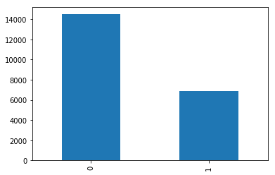

# SKLearn Spacy Reddit Text Classification Example

In this example we will be buiding a text classifier using the reddit content moderation dataset.

For this, we will be using SpaCy for the word tokenization and lemmatization. 

The classification will be done with a Logistic Regression binary classifier.

The steps in this tutorial include:

1) Train and build your NLP model

2) Build your containerized model

3) Test your model as a docker container

4) Run Seldon in your kubernetes cluster

5) Deploy your model with Seldon

6) Interact with your model through API

7) Clean your environment


### Before you start
Make sure you install the following dependencies, as they are critical for this example to work:

* Helm v2.13.1+
* A Kubernetes cluster running v1.13 or above (minkube / docker-for-windows work well if enough RAM)
* kubectl v1.14+
* Python 3.6+
* Python DEV requirements (we'll install them below)

Let's get started! 🚀🔥

## 1) Train and build your NLP model


```python
# Let's first install any dependencies
!pip install -r requirements.txt
```


```python
import pandas as pd 
from sklearn.model_selection import train_test_split
import numpy as np
from sklearn.feature_extraction.text import TfidfVectorizer
from sklearn.linear_model import LogisticRegression
from seldon_core.seldon_client import SeldonClient
import dill
import sys, os

# This import may take a while as it will download the Spacy ENGLISH model
from ml_utils import CleanTextTransformer, SpacyTokenTransformer
```


```python
df_cols = ["prev_idx", "parent_idx", "body", "removed"]

TEXT_COLUMN = "body" 
CLEAN_COLUMN = "clean_body"
TOKEN_COLUMN = "token_body"

# Downloading the 50k reddit dataset of moderated comments
df = pd.read_csv("https://raw.githubusercontent.com/axsauze/reddit-classification-exploration/master/data/reddit_train.csv", 
                         names=df_cols, skiprows=1, encoding="ISO-8859-1")

df.head()
```


<div>
<style scoped>
    .dataframe tbody tr th:only-of-type {
        vertical-align: middle;
    }

    .dataframe tbody tr th {
        vertical-align: top;
    }

    .dataframe thead th {
        text-align: right;
    }
</style>
<table border="1" class="dataframe">
  <thead>
    <tr style="text-align: right;">
      <th></th>
      <th>prev_idx</th>
      <th>parent_idx</th>
      <th>body</th>
      <th>removed</th>
    </tr>
  </thead>
  <tbody>
    <tr>
      <th>0</th>
      <td>8756</td>
      <td>8877</td>
      <td>Always be wary of news articles that cite unpu...</td>
      <td>0</td>
    </tr>
    <tr>
      <th>1</th>
      <td>7330</td>
      <td>7432</td>
      <td>The problem I have with this is that the artic...</td>
      <td>0</td>
    </tr>
    <tr>
      <th>2</th>
      <td>15711</td>
      <td>15944</td>
      <td>This is indicative of a typical power law, and...</td>
      <td>0</td>
    </tr>
    <tr>
      <th>3</th>
      <td>1604</td>
      <td>1625</td>
      <td>This doesn't make sense. Chess obviously trans...</td>
      <td>0</td>
    </tr>
    <tr>
      <th>4</th>
      <td>13327</td>
      <td>13520</td>
      <td>1. I dispute that gene engineering is burdenso...</td>
      <td>0</td>
    </tr>
  </tbody>
</table>
</div>


```python
# Let's see how many examples we have of each class
df["removed"].value_counts().plot.bar()
```


    <matplotlib.axes._subplots.AxesSubplot at 0x7fcd615502b0>





```python
x = df["body"].values
y = df["removed"].values
x_train, x_test, y_train, y_test = train_test_split(
    x, y, 
    stratify=y, 
    random_state=42, 
    test_size=0.1, shuffle=True)
```


```python
# Clean the text
clean_text_transformer = CleanTextTransformer()
x_train_clean = clean_text_transformer.transform(x_train)
```


```python
# Tokenize the text and get the lemmas
spacy_tokenizer = SpacyTokenTransformer()
x_train_tokenized = spacy_tokenizer.transform(x_train_clean)
```


```python
# Build tfidf vectorizer
tfidf_vectorizer = TfidfVectorizer(
    max_features=10000,
    preprocessor=lambda x: x, 
    tokenizer=lambda x: x, 
    token_pattern=None,
    ngram_range=(1, 3))

tfidf_vectorizer.fit(x_train_tokenized)
```


    TfidfVectorizer(analyzer='word', binary=False, decode_error='strict',
            dtype=<class 'numpy.float64'>, encoding='utf-8', input='content',
            lowercase=True, max_df=1.0, max_features=10000, min_df=1,
            ngram_range=(1, 3), norm='l2',
            preprocessor=<function <lambda> at 0x7fcda0a72950>,
            smooth_idf=True, stop_words=None, strip_accents=None,
            sublinear_tf=False, token_pattern=None,
            tokenizer=<function <lambda> at 0x7fcda0a72730>, use_idf=True,
            vocabulary=None)


```python
# Transform our tokens to tfidf vectors
x_train_tfidf = tfidf_vectorizer.transform(
    x_train_tokenized)
```


```python
# Train logistic regression classifier
lr = LogisticRegression(C=0.1, solver='sag')
lr.fit(x_train_tfidf, y_train)
```


    LogisticRegression(C=0.1, class_weight=None, dual=False, fit_intercept=True,
              intercept_scaling=1, max_iter=100, multi_class='warn',
              n_jobs=None, penalty='l2', random_state=None, solver='sag',
              tol=0.0001, verbose=0, warm_start=False)


```python
# These are the models we'll deploy
with open('tfidf_vectorizer.model', 'wb') as model_file:
    dill.dump(tfidf_vectorizer, model_file)
with open('lr.model', 'wb') as model_file:
    dill.dump(lr, model_file)
```

## 2) Build your containerized model


```python
# This is the class we will use to deploy
!cat RedditClassifier.py
```

    import dill
    
    from ml_utils import CleanTextTransformer, SpacyTokenTransformer
    
    class RedditClassifier(object):
        def __init__(self):
            
            self._clean_text_transformer = CleanTextTransformer()
            self._spacy_tokenizer = SpacyTokenTransformer()
            
            with open('tfidf_vectorizer.model', 'rb') as model_file:
                self._tfidf_vectorizer = dill.load(model_file)
               
            with open('lr.model', 'rb') as model_file:
                self._lr_model = dill.load(model_file)
    
        def predict(self, X, feature_names):
            clean_text = self._clean_text_transformer.transform(X)
            spacy_tokens = self._spacy_tokenizer.transform(clean_text)
            tfidf_features = self._tfidf_vectorizer.transform(spacy_tokens)
            predictions = self._lr_model.predict_proba(tfidf_features)
            return predictions
    


```python
# test that our model works
from RedditClassifier import RedditClassifier
# With one sample
sample = x_test[0:1]
print(sample)
print(RedditClassifier().predict(sample, ["feature_name"]))
```

    ['This is the study that the article is based on:\r\n\r\nhttps://www.nature.com/articles/nature25778.epdf']
    [[0.82767095 0.17232905]]


### Create Docker Image with the S2i utility
Using the S2I command line interface we wrap our current model to seve it through the Seldon interface


```python
# To create a docker image we need to create the .s2i folder configuration as below:
!cat .s2i/environment
```

    MODEL_NAME=RedditClassifier
    API_TYPE=REST
    SERVICE_TYPE=MODEL
    PERSISTENCE=0


```python
# As well as a requirements.txt file with all the relevant dependencies
!cat requirements.txt
```

    scipy>= 0.13.3
    scikit-learn>=0.18
    spacy==2.0.18
    dill==0.2.9
    seldon-core==0.2.7


```python
!s2i build . seldonio/seldon-core-s2i-python3:0.6 reddit-classifier:0.1
```

    ---> Installing application source...
    ---> Installing dependencies ...
    Looking in links: /whl
    Collecting scipy>=0.13.3 (from -r requirements.txt (line 1))
      WARNING: Url '/whl' is ignored. It is either a non-existing path or lacks a specific scheme.
    Downloading https://files.pythonhosted.org/packages/72/4c/5f81e7264b0a7a8bd570810f48cd346ba36faedbd2ba255c873ad556de76/scipy-1.3.0-cp36-cp36m-manylinux1_x86_64.whl (25.2MB)
    Collecting scikit-learn>=0.18 (from -r requirements.txt (line 2))
      WARNING: Url '/whl' is ignored. It is either a non-existing path or lacks a specific scheme.
    Downloading https://files.pythonhosted.org/packages/85/04/49633f490f726da6e454fddc8e938bbb5bfed2001681118d3814c219b723/scikit_learn-0.21.2-cp36-cp36m-manylinux1_x86_64.whl (6.7MB)
    Collecting spacy==2.0.18 (from -r requirements.txt (line 3))
      WARNING: Url '/whl' is ignored. It is either a non-existing path or lacks a specific scheme.
    Downloading https://files.pythonhosted.org/packages/ae/6e/a89da6b5c83f8811e46e3a9270c1aed90e9b9ee6c60faf52b7239e5d3d69/spacy-2.0.18-cp36-cp36m-manylinux1_x86_64.whl (25.2MB)
    Collecting dill==0.2.9 (from -r requirements.txt (line 4))
      WARNING: Url '/whl' is ignored. It is either a non-existing path or lacks a specific scheme.
    Downloading https://files.pythonhosted.org/packages/fe/42/bfe2e0857bc284cbe6a011d93f2a9ad58a22cb894461b199ae72cfef0f29/dill-0.2.9.tar.gz (150kB)
    Requirement already satisfied: seldon-core==0.2.7 in /usr/local/lib/python3.6/site-packages (from -r requirements.txt (line 5)) (0.2.7)
    Requirement already satisfied: numpy>=1.13.3 in /usr/local/lib/python3.6/site-packages (from scipy>=0.13.3->-r requirements.txt (line 1)) (1.16.3)
    Collecting joblib>=0.11 (from scikit-learn>=0.18->-r requirements.txt (line 2))
      WARNING: Url '/whl' is ignored. It is either a non-existing path or lacks a specific scheme.
    Downloading https://files.pythonhosted.org/packages/cd/c1/50a758e8247561e58cb87305b1e90b171b8c767b15b12a1734001f41d356/joblib-0.13.2-py2.py3-none-any.whl (278kB)
    Collecting murmurhash<1.1.0,>=0.28.0 (from spacy==2.0.18->-r requirements.txt (line 3))
      WARNING: Url '/whl' is ignored. It is either a non-existing path or lacks a specific scheme.
    Downloading https://files.pythonhosted.org/packages/a6/e6/63f160a4fdf0e875d16b28f972083606d8d54f56cd30cb8929f9a1ee700e/murmurhash-1.0.2-cp36-cp36m-manylinux1_x86_64.whl
    Collecting thinc<6.13.0,>=6.12.1 (from spacy==2.0.18->-r requirements.txt (line 3))
      WARNING: Url '/whl' is ignored. It is either a non-existing path or lacks a specific scheme.
    Downloading https://files.pythonhosted.org/packages/db/a7/46640a46fd707aeb204aa4257a70974b6a22a0204ba703164d803215776f/thinc-6.12.1-cp36-cp36m-manylinux1_x86_64.whl (1.9MB)
    Collecting plac<1.0.0,>=0.9.6 (from spacy==2.0.18->-r requirements.txt (line 3))
      WARNING: Url '/whl' is ignored. It is either a non-existing path or lacks a specific scheme.
    Downloading https://files.pythonhosted.org/packages/9e/9b/62c60d2f5bc135d2aa1d8c8a86aaf84edb719a59c7f11a4316259e61a298/plac-0.9.6-py2.py3-none-any.whl
    Collecting ujson>=1.35 (from spacy==2.0.18->-r requirements.txt (line 3))
      WARNING: Url '/whl' is ignored. It is either a non-existing path or lacks a specific scheme.
    Downloading https://files.pythonhosted.org/packages/16/c4/79f3409bc710559015464e5f49b9879430d8f87498ecdc335899732e5377/ujson-1.35.tar.gz (192kB)
    Collecting regex==2018.01.10 (from spacy==2.0.18->-r requirements.txt (line 3))
      WARNING: Url '/whl' is ignored. It is either a non-existing path or lacks a specific scheme.
    Downloading https://files.pythonhosted.org/packages/76/f4/7146c3812f96fcaaf2d06ff6862582302626a59011ccb6f2833bb38d80f7/regex-2018.01.10.tar.gz (612kB)
    Requirement already satisfied: requests<3.0.0,>=2.13.0 in /usr/local/lib/python3.6/site-packages (from spacy==2.0.18->-r requirements.txt (line 3)) (2.21.0)
    Collecting preshed<2.1.0,>=2.0.1 (from spacy==2.0.18->-r requirements.txt (line 3))
      WARNING: Url '/whl' is ignored. It is either a non-existing path or lacks a specific scheme.
    Downloading https://files.pythonhosted.org/packages/20/93/f222fb957764a283203525ef20e62008675fd0a14ffff8cc1b1490147c63/preshed-2.0.1-cp36-cp36m-manylinux1_x86_64.whl (83kB)
    Collecting cymem<2.1.0,>=2.0.2 (from spacy==2.0.18->-r requirements.txt (line 3))
      WARNING: Url '/whl' is ignored. It is either a non-existing path or lacks a specific scheme.
    Downloading https://files.pythonhosted.org/packages/3d/61/9b0520c28eb199a4b1ca667d96dd625bba003c14c75230195f9691975f85/cymem-2.0.2-cp36-cp36m-manylinux1_x86_64.whl
    Requirement already satisfied: jaeger-client in /usr/local/lib/python3.6/site-packages (from seldon-core==0.2.7->-r requirements.txt (line 5)) (4.0.0)
    Requirement already satisfied: Flask-OpenTracing==0.2.0 in /usr/local/lib/python3.6/site-packages (from seldon-core==0.2.7->-r requirements.txt (line 5)) (0.2.0)
    Requirement already satisfied: grpcio in /usr/local/lib/python3.6/site-packages (from seldon-core==0.2.7->-r requirements.txt (line 5)) (1.20.1)
    Requirement already satisfied: tensorflow in /usr/local/lib/python3.6/site-packages (from seldon-core==0.2.7->-r requirements.txt (line 5)) (1.13.1)
    Requirement already satisfied: grpcio-opentracing in /usr/local/lib/python3.6/site-packages (from seldon-core==0.2.7->-r requirements.txt (line 5)) (1.1.4)
    Requirement already satisfied: flatbuffers in /usr/local/lib/python3.6/site-packages (from seldon-core==0.2.7->-r requirements.txt (line 5)) (1.11)
    Requirement already satisfied: pyyaml in /usr/local/lib/python3.6/site-packages (from seldon-core==0.2.7->-r requirements.txt (line 5)) (5.1)
    Requirement already satisfied: protobuf in /usr/local/lib/python3.6/site-packages (from seldon-core==0.2.7->-r requirements.txt (line 5)) (3.7.1)
    Requirement already satisfied: opentracing<2,>=1.2.2 in /usr/local/lib/python3.6/site-packages (from seldon-core==0.2.7->-r requirements.txt (line 5)) (1.3.0)
    Requirement already satisfied: flask-cors in /usr/local/lib/python3.6/site-packages (from seldon-core==0.2.7->-r requirements.txt (line 5)) (3.0.7)
    Requirement already satisfied: flask in /usr/local/lib/python3.6/site-packages (from seldon-core==0.2.7->-r requirements.txt (line 5)) (1.0.2)
    Requirement already satisfied: redis in /usr/local/lib/python3.6/site-packages (from seldon-core==0.2.7->-r requirements.txt (line 5)) (3.2.1)
    Collecting tqdm<5.0.0,>=4.10.0 (from thinc<6.13.0,>=6.12.1->spacy==2.0.18->-r requirements.txt (line 3))
      WARNING: Url '/whl' is ignored. It is either a non-existing path or lacks a specific scheme.
    Downloading https://files.pythonhosted.org/packages/45/af/685bf3ce889ea191f3b916557f5677cc95a5e87b2fa120d74b5dd6d049d0/tqdm-4.32.1-py2.py3-none-any.whl (49kB)
    Collecting msgpack<0.6.0,>=0.5.6 (from thinc<6.13.0,>=6.12.1->spacy==2.0.18->-r requirements.txt (line 3))
      WARNING: Url '/whl' is ignored. It is either a non-existing path or lacks a specific scheme.
    Downloading https://files.pythonhosted.org/packages/22/4e/dcf124fd97e5f5611123d6ad9f40ffd6eb979d1efdc1049e28a795672fcd/msgpack-0.5.6-cp36-cp36m-manylinux1_x86_64.whl (315kB)
    Requirement already satisfied: six<2.0.0,>=1.10.0 in /usr/local/lib/python3.6/site-packages (from thinc<6.13.0,>=6.12.1->spacy==2.0.18->-r requirements.txt (line 3)) (1.12.0)
    Collecting wrapt<1.11.0,>=1.10.0 (from thinc<6.13.0,>=6.12.1->spacy==2.0.18->-r requirements.txt (line 3))
      WARNING: Url '/whl' is ignored. It is either a non-existing path or lacks a specific scheme.
    Downloading https://files.pythonhosted.org/packages/a0/47/66897906448185fcb77fc3c2b1bc20ed0ecca81a0f2f88eda3fc5a34fc3d/wrapt-1.10.11.tar.gz
    Collecting msgpack-numpy<0.4.4 (from thinc<6.13.0,>=6.12.1->spacy==2.0.18->-r requirements.txt (line 3))
      WARNING: Url '/whl' is ignored. It is either a non-existing path or lacks a specific scheme.
    Downloading https://files.pythonhosted.org/packages/ad/45/464be6da85b5ca893cfcbd5de3b31a6710f636ccb8521b17bd4110a08d94/msgpack_numpy-0.4.3.2-py2.py3-none-any.whl
    Collecting cytoolz<0.10,>=0.9.0 (from thinc<6.13.0,>=6.12.1->spacy==2.0.18->-r requirements.txt (line 3))
      WARNING: Url '/whl' is ignored. It is either a non-existing path or lacks a specific scheme.
    Downloading https://files.pythonhosted.org/packages/36/f4/9728ba01ccb2f55df9a5af029b48ba0aaca1081bbd7823ea2ee223ba7a42/cytoolz-0.9.0.1.tar.gz (443kB)
    Requirement already satisfied: certifi>=2017.4.17 in /usr/local/lib/python3.6/site-packages (from requests<3.0.0,>=2.13.0->spacy==2.0.18->-r requirements.txt (line 3)) (2019.3.9)
    Requirement already satisfied: urllib3<1.25,>=1.21.1 in /usr/local/lib/python3.6/site-packages (from requests<3.0.0,>=2.13.0->spacy==2.0.18->-r requirements.txt (line 3)) (1.24.2)
    Requirement already satisfied: idna<2.9,>=2.5 in /usr/local/lib/python3.6/site-packages (from requests<3.0.0,>=2.13.0->spacy==2.0.18->-r requirements.txt (line 3)) (2.8)
    Requirement already satisfied: chardet<3.1.0,>=3.0.2 in /usr/local/lib/python3.6/site-packages (from requests<3.0.0,>=2.13.0->spacy==2.0.18->-r requirements.txt (line 3)) (3.0.4)
    Requirement already satisfied: threadloop<2,>=1 in /usr/local/lib/python3.6/site-packages (from jaeger-client->seldon-core==0.2.7->-r requirements.txt (line 5)) (1.0.2)
    Requirement already satisfied: tornado<5,>=4.3 in /usr/local/lib/python3.6/site-packages (from jaeger-client->seldon-core==0.2.7->-r requirements.txt (line 5)) (4.5.3)
    Requirement already satisfied: thrift in /usr/local/lib/python3.6/site-packages (from jaeger-client->seldon-core==0.2.7->-r requirements.txt (line 5)) (0.11.0)
    Requirement already satisfied: termcolor>=1.1.0 in /usr/local/lib/python3.6/site-packages (from tensorflow->seldon-core==0.2.7->-r requirements.txt (line 5)) (1.1.0)
    Requirement already satisfied: keras-preprocessing>=1.0.5 in /usr/local/lib/python3.6/site-packages (from tensorflow->seldon-core==0.2.7->-r requirements.txt (line 5)) (1.0.9)
    Requirement already satisfied: wheel>=0.26 in /usr/local/lib/python3.6/site-packages (from tensorflow->seldon-core==0.2.7->-r requirements.txt (line 5)) (0.33.1)
    Requirement already satisfied: keras-applications>=1.0.6 in /usr/local/lib/python3.6/site-packages (from tensorflow->seldon-core==0.2.7->-r requirements.txt (line 5)) (1.0.7)
    Requirement already satisfied: absl-py>=0.1.6 in /usr/local/lib/python3.6/site-packages (from tensorflow->seldon-core==0.2.7->-r requirements.txt (line 5)) (0.7.1)
    Requirement already satisfied: tensorflow-estimator<1.14.0rc0,>=1.13.0 in /usr/local/lib/python3.6/site-packages (from tensorflow->seldon-core==0.2.7->-r requirements.txt (line 5)) (1.13.0)
    Requirement already satisfied: astor>=0.6.0 in /usr/local/lib/python3.6/site-packages (from tensorflow->seldon-core==0.2.7->-r requirements.txt (line 5)) (0.7.1)
    Requirement already satisfied: tensorboard<1.14.0,>=1.13.0 in /usr/local/lib/python3.6/site-packages (from tensorflow->seldon-core==0.2.7->-r requirements.txt (line 5)) (1.13.1)
    Requirement already satisfied: gast>=0.2.0 in /usr/local/lib/python3.6/site-packages (from tensorflow->seldon-core==0.2.7->-r requirements.txt (line 5)) (0.2.2)
    Requirement already satisfied: setuptools in /usr/local/lib/python3.6/site-packages (from protobuf->seldon-core==0.2.7->-r requirements.txt (line 5)) (41.0.1)
    Requirement already satisfied: itsdangerous>=0.24 in /usr/local/lib/python3.6/site-packages (from flask->seldon-core==0.2.7->-r requirements.txt (line 5)) (1.1.0)
    Requirement already satisfied: click>=5.1 in /usr/local/lib/python3.6/site-packages (from flask->seldon-core==0.2.7->-r requirements.txt (line 5)) (7.0)
    Requirement already satisfied: Jinja2>=2.10 in /usr/local/lib/python3.6/site-packages (from flask->seldon-core==0.2.7->-r requirements.txt (line 5)) (2.10.1)
    Requirement already satisfied: Werkzeug>=0.14 in /usr/local/lib/python3.6/site-packages (from flask->seldon-core==0.2.7->-r requirements.txt (line 5)) (0.15.2)
    Collecting toolz>=0.8.0 (from cytoolz<0.10,>=0.9.0->thinc<6.13.0,>=6.12.1->spacy==2.0.18->-r requirements.txt (line 3))
      WARNING: Url '/whl' is ignored. It is either a non-existing path or lacks a specific scheme.
    Downloading https://files.pythonhosted.org/packages/14/d0/a73c15bbeda3d2e7b381a36afb0d9cd770a9f4adc5d1532691013ba881db/toolz-0.9.0.tar.gz (45kB)
    Requirement already satisfied: h5py in /usr/local/lib/python3.6/site-packages (from keras-applications>=1.0.6->tensorflow->seldon-core==0.2.7->-r requirements.txt (line 5)) (2.9.0)
    Requirement already satisfied: mock>=2.0.0 in /usr/local/lib/python3.6/site-packages (from tensorflow-estimator<1.14.0rc0,>=1.13.0->tensorflow->seldon-core==0.2.7->-r requirements.txt (line 5)) (2.0.0)
    Requirement already satisfied: markdown>=2.6.8 in /usr/local/lib/python3.6/site-packages (from tensorboard<1.14.0,>=1.13.0->tensorflow->seldon-core==0.2.7->-r requirements.txt (line 5)) (3.1)
    Requirement already satisfied: MarkupSafe>=0.23 in /usr/local/lib/python3.6/site-packages (from Jinja2>=2.10->flask->seldon-core==0.2.7->-r requirements.txt (line 5)) (1.1.1)
    Requirement already satisfied: pbr>=0.11 in /usr/local/lib/python3.6/site-packages (from mock>=2.0.0->tensorflow-estimator<1.14.0rc0,>=1.13.0->tensorflow->seldon-core==0.2.7->-r requirements.txt (line 5)) (5.2.0)
    Building wheels for collected packages: dill, ujson, regex, wrapt, cytoolz, toolz
    Building wheel for dill (setup.py): started
    Building wheel for dill (setup.py): finished with status 'done'
    Stored in directory: /root/.cache/pip/wheels/5b/d7/0f/e58eae695403de585269f4e4a94e0cd6ca60ec0c202936fa4a
    Building wheel for ujson (setup.py): started
    Building wheel for ujson (setup.py): finished with status 'done'
    Stored in directory: /root/.cache/pip/wheels/28/77/e4/0311145b9c2e2f01470e744855131f9e34d6919687550f87d1
    Building wheel for regex (setup.py): started
    Building wheel for regex (setup.py): finished with status 'done'
    Stored in directory: /root/.cache/pip/wheels/74/17/3f/c77bba99efd74ba1a19862c9dd97f4b6d735e2826721dc00ff
    Building wheel for wrapt (setup.py): started
    Building wheel for wrapt (setup.py): finished with status 'done'
    Stored in directory: /root/.cache/pip/wheels/48/5d/04/22361a593e70d23b1f7746d932802efe1f0e523376a74f321e
    Building wheel for cytoolz (setup.py): started
    Building wheel for cytoolz (setup.py): finished with status 'done'
    Stored in directory: /root/.cache/pip/wheels/88/f3/11/9817b001e59ab04889e8cffcbd9087e2e2155b9ebecfc8dd38
    Building wheel for toolz (setup.py): started
    Building wheel for toolz (setup.py): finished with status 'done'
    Stored in directory: /root/.cache/pip/wheels/f4/0c/f6/ce6b2d1aa459ee97cc3c0f82236302bd62d89c86c700219463
    Successfully built dill ujson regex wrapt cytoolz toolz
    Installing collected packages: scipy, joblib, scikit-learn, murmurhash, tqdm, plac, msgpack, dill, wrapt, msgpack-numpy, cymem, preshed, toolz, cytoolz, thinc, ujson, regex, spacy
    Successfully installed cymem-2.0.2 cytoolz-0.9.0.1 dill-0.2.9 joblib-0.13.2 msgpack-0.5.6 msgpack-numpy-0.4.3.2 murmurhash-1.0.2 plac-0.9.6 preshed-2.0.1 regex-2018.1.10 scikit-learn-0.21.2 scipy-1.3.0 spacy-2.0.18 thinc-6.12.1 toolz-0.9.0 tqdm-4.32.1 ujson-1.35 wrapt-1.10.11
    WARNING: Url '/whl' is ignored. It is either a non-existing path or lacks a specific scheme.
    WARNING: You are using pip version 19.1, however version 19.1.1 is available.
    You should consider upgrading via the 'pip install --upgrade pip' command.
    Build completed successfully


## 3) Test your model as a docker container


```python
# Remove previously deployed containers for this model
!docker rm -f reddit_predictor
```

    Error: No such container: reddit_predictor


```python
!docker run --name "reddit_predictor" -d --rm -p 5001:5000 reddit-classifier:0.1
```

    be29c6a00adec0f708dc5a1c83613e0656fddc06daba4ca02d93b5a7ece9b92b


### Make sure you wait for language model
SpaCy will download the English language model, so you have to make sure the container finishes downloading it before it can be used. You can view this by running the logs until you see "Linking successful".


```python
# Here we need to wait until we see "Linking successful", as it's downloading the Spacy English model
# You can hit stop when this happens
!docker logs -t -f reddit_predictor
```

    2019-05-27T13:50:12.739381600Z starting microservice
    2019-05-27T13:50:14.023399000Z 2019-05-27 13:50:14,023 - seldon_core.microservice:main:154 - INFO:  Starting microservice.py:main
    2019-05-27T13:50:14.024836400Z 2019-05-27 13:50:14,024 - seldon_core.microservice:main:185 - INFO:  Annotations: {}
    2019-05-27T13:50:14.686919400Z Collecting en_core_web_sm==2.0.0 from https://github.com/explosion/spacy-models/releases/download/en_core_web_sm-2.0.0/en_core_web_sm-2.0.0.tar.gz#egg=en_core_web_sm==2.0.0
    2019-05-27T13:50:15.402484400Z   Downloading https://github.com/explosion/spacy-models/releases/download/en_core_web_sm-2.0.0/en_core_web_sm-2.0.0.tar.gz (37.4MB)
    2019-05-27T13:50:47.771818100Z Building wheels for collected packages: en-core-web-sm
    2019-05-27T13:50:47.772287600Z   Building wheel for en-core-web-sm (setup.py): started
    2019-05-27T13:50:49.845376700Z   Building wheel for en-core-web-sm (setup.py): finished with status 'done'
    2019-05-27T13:50:49.845641500Z   Stored in directory: /tmp/pip-ephem-wheel-cache-wszfsf1z/wheels/54/7c/d8/f86364af8fbba7258e14adae115f18dd2c91552406edc3fdaa
    2019-05-27T13:50:50.163985100Z Successfully built en-core-web-sm
    2019-05-27T13:50:50.164057000Z Installing collected packages: en-core-web-sm
    2019-05-27T13:50:50.242852700Z Successfully installed en-core-web-sm-2.0.0
    2019-05-27T13:50:50.400850200Z WARNING: You are using pip version 19.1, however version 19.1.1 is available.
    2019-05-27T13:50:50.400901100Z You should consider upgrading via the 'pip install --upgrade pip' command.
    2019-05-27T13:50:51.728895100Z --- Logging error ---
    2019-05-27T13:50:51.728944900Z Traceback (most recent call last):
    2019-05-27T13:50:51.728954200Z   File "/usr/local/lib/python3.6/logging/__init__.py", line 994, in emit
    2019-05-27T13:50:51.728958900Z     msg = self.format(record)
    2019-05-27T13:50:51.728963000Z   File "/usr/local/lib/python3.6/logging/__init__.py", line 840, in format
    2019-05-27T13:50:51.728966900Z     return fmt.format(record)
    2019-05-27T13:50:51.728970500Z   File "/usr/local/lib/python3.6/logging/__init__.py", line 577, in format
    2019-05-27T13:50:51.728974300Z     record.message = record.getMessage()
    2019-05-27T13:50:51.728977900Z   File "/usr/local/lib/python3.6/logging/__init__.py", line 338, in getMessage
    2019-05-27T13:50:51.728981600Z     msg = msg % self.args
    2019-05-27T13:50:51.728985100Z TypeError: not all arguments converted during string formatting
    2019-05-27T13:50:51.728988800Z Call stack:
    2019-05-27T13:50:51.728992300Z   File "/usr/local/bin/seldon-core-microservice", line 10, in <module>
    2019-05-27T13:50:51.728996500Z     sys.exit(main())
    2019-05-27T13:50:51.729000000Z   File "/usr/local/lib/python3.6/site-packages/seldon_core/microservice.py", line 189, in main
    2019-05-27T13:50:51.729004000Z     logger.info("Importing ",args.interface_name)
    2019-05-27T13:50:51.729007800Z Message: 'Importing '
    2019-05-27T13:50:51.729011400Z Arguments: ('RedditClassifier',)
    2019-05-27T13:50:51.729025900Z /usr/local/lib/python3.6/site-packages/sklearn/base.py:306: UserWarning: Trying to unpickle estimator TfidfTransformer from version 0.20.3 when using version 0.21.2. This might lead to breaking code or invalid results. Use at your own risk.
    2019-05-27T13:50:51.729030000Z   UserWarning)
    2019-05-27T13:50:51.729033400Z /usr/local/lib/python3.6/site-packages/sklearn/base.py:306: UserWarning: Trying to unpickle estimator TfidfVectorizer from version 0.20.3 when using version 0.21.2. This might lead to breaking code or invalid results. Use at your own risk.
    2019-05-27T13:50:51.729036900Z   UserWarning)
    2019-05-27T13:50:51.729040100Z /usr/local/lib/python3.6/site-packages/sklearn/base.py:306: UserWarning: Trying to unpickle estimator LogisticRegression from version 0.20.3 when using version 0.21.2. This might lead to breaking code or invalid results. Use at your own risk.
    2019-05-27T13:50:51.729044000Z   UserWarning)
    2019-05-27T13:50:51.729047500Z 2019-05-27 13:50:51,727 - seldon_core.microservice:main:226 - INFO:  REST microservice running on port 5000
    2019-05-27T13:50:51.729051200Z 2019-05-27 13:50:51,728 - seldon_core.microservice:main:260 - INFO:  Starting servers
    2019-05-27T13:50:51.730423900Z 
    2019-05-27T13:50:51.730464700Z     Linking successful
    2019-05-27T13:50:51.730473700Z     /usr/local/lib/python3.6/site-packages/en_core_web_sm -->
    2019-05-27T13:50:51.730477700Z     /usr/local/lib/python3.6/site-packages/spacy/data/en_core_web_sm
    2019-05-27T13:50:51.730481100Z 
    2019-05-27T13:50:51.730484300Z     You can now load the model via spacy.load('en_core_web_sm')
    2019-05-27T13:50:51.730487600Z 
    2019-05-27T13:50:51.743475000Z  * Serving Flask app "seldon_core.wrapper" (lazy loading)
    2019-05-27T13:50:51.743530400Z  * Environment: production
    2019-05-27T13:50:51.743538900Z    WARNING: Do not use the development server in a production environment.
    2019-05-27T13:50:51.743542800Z    Use a production WSGI server instead.
    2019-05-27T13:50:51.743546000Z  * Debug mode: off
    2019-05-27T13:50:51.760002000Z 2019-05-27 13:50:51,759 - werkzeug:_log:122 - INFO:   * Running on http://0.0.0.0:5000/ (Press CTRL+C to quit)
    ^C


```python
# We now test the REST endpoint expecting the same result
endpoint = "0.0.0.0:5001"
batch = sample
payload_type = "ndarray"

sc = SeldonClient(microservice_endpoint=endpoint)
response = sc.microservice(
    data=batch,
    method="predict",
    payload_type=payload_type,
    names=["tfidf"])

print(response)
```

    Success:True message:
    Request:
    data {
      names: "tfidf"
      ndarray {
        values {
          string_value: "This is the study that the article is based on:\r\n\r\nhttps://www.nature.com/articles/nature25778.epdf"
        }
      }
    }
    
    Response:
    meta {
    }
    data {
      names: "t:0"
      names: "t:1"
      ndarray {
        values {
          list_value {
            values {
              number_value: 0.8276709475641506
            }
            values {
              number_value: 0.1723290524358494
            }
          }
        }
      }
    }
    


```python
# We now stop it to run it in docker
!docker stop reddit_predictor
```

    reddit_predictor


## 4) Run Seldon in your kubernetes cluster
In order to run Seldon we need to make sure that Helm is initialised and Tiller is running. 

For this we can run the following initialisation and waiting commands.


```python
# If not running you can install it
# First initialise helm
!kubectl create clusterrolebinding kube-system-cluster-admin --clusterrole=cluster-admin --serviceaccount=kube-system:default
!helm init
!kubectl rollout status deploy/tiller-deploy -n kube-system
```

    clusterrolebinding.rbac.authorization.k8s.io/kube-system-cluster-admin created
    $HELM_HOME has been configured at /home/alejandro/.helm.
    Warning: Tiller is already installed in the cluster.
    (Use --client-only to suppress this message, or --upgrade to upgrade Tiller to the current version.)
    Happy Helming!
    deployment "tiller-deploy" successfully rolled out


Now we can install run the Seldon Operator using the latest Helm charts


```python
!helm install seldon-core-operator --name seldon-core-operator --repo https://storage.googleapis.com/seldon-charts
```

    NAME:   seldon-core-operator
    LAST DEPLOYED: Mon May 27 15:04:30 2019
    NAMESPACE: default
    STATUS: DEPLOYED
    
    RESOURCES:
    ==> v1/ClusterRole
    NAME                          AGE
    seldon-operator-manager-role  0s
    
    ==> v1/ClusterRoleBinding
    NAME                                 AGE
    seldon-operator-manager-rolebinding  0s
    
    ==> v1/Pod(related)
    NAME                                  READY  STATUS             RESTARTS  AGE
    seldon-operator-controller-manager-0  0/1    ContainerCreating  0         0s
    
    ==> v1/Secret
    NAME                                   TYPE    DATA  AGE
    seldon-operator-webhook-server-secret  Opaque  0     0s
    
    ==> v1/Service
    NAME                                        TYPE       CLUSTER-IP      EXTERNAL-IP  PORT(S)  AGE
    seldon-operator-controller-manager-service  ClusterIP  10.101.147.136  <none>       443/TCP  0s
    
    ==> v1/StatefulSet
    NAME                                READY  AGE
    seldon-operator-controller-manager  0/1    0s
    
    ==> v1beta1/CustomResourceDefinition
    NAME                                         AGE
    seldondeployments.machinelearning.seldon.io  0s
    
    
    NOTES:
    NOTES: TODO
    
    


And we can make sure that it is actually running with the following command 


```python
!kubectl get pod | grep seldon
```

    seldon-operator-controller-manager-0   1/1     Running   1          12s


In order for us to be able to reach the model, we will need to set up an ingress. For this we will use ambassador:


```python
!helm install stable/ambassador --name ambassador
```

    NAME:   ambassador
    LAST DEPLOYED: Mon May 27 15:04:50 2019
    NAMESPACE: default
    STATUS: DEPLOYED
    
    RESOURCES:
    ==> v1/Deployment
    NAME        READY  UP-TO-DATE  AVAILABLE  AGE
    ambassador  0/3    3           0          0s
    
    ==> v1/Pod(related)
    NAME                         READY  STATUS             RESTARTS  AGE
    ambassador-7bfc87f865-jkxs8  0/1    ContainerCreating  0         0s
    ambassador-7bfc87f865-nr7bn  0/1    ContainerCreating  0         0s
    ambassador-7bfc87f865-q4lng  0/1    ContainerCreating  0         0s
    
    ==> v1/Service
    NAME               TYPE          CLUSTER-IP     EXTERNAL-IP  PORT(S)                     AGE
    ambassador         LoadBalancer  10.101.89.32   localhost    80:30004/TCP,443:31350/TCP  0s
    ambassador-admins  ClusterIP     10.98.228.159  <none>       8877/TCP                    0s
    
    ==> v1/ServiceAccount
    NAME        SECRETS  AGE
    ambassador  1        1s
    
    ==> v1beta1/ClusterRole
    NAME        AGE
    ambassador  1s
    
    ==> v1beta1/ClusterRoleBinding
    NAME        AGE
    ambassador  1s
    
    
    NOTES:
    Congratuations! You've successfully installed Ambassador.
    
    For help, visit our Slack at https://d6e.co/slack or view the documentation online at https://www.getambassador.io.
    
    To get the IP address of Ambassador, run the following commands:
    NOTE: It may take a few minutes for the LoadBalancer IP to be available.
         You can watch the status of by running 'kubectl get svc -w  --namespace default ambassador'
    
      On GKE/Azure:
      export SERVICE_IP=$(kubectl get svc --namespace default ambassador -o jsonpath='{.status.loadBalancer.ingress[0].ip}')
    
      On AWS:
      export SERVICE_IP=$(kubectl get svc --namespace default ambassador -o jsonpath='{.status.loadBalancer.ingress[0].hostname}')
    
      echo http://$SERVICE_IP:
    


We can now see the ambassador service is running. In our case we can reach it through the external IP which is our localhost, but if you are using a cloud provider, make sure you have access to the ambassador endpoint.


```python
!kubectl get svc ambassador
```

    NAME         TYPE           CLUSTER-IP     EXTERNAL-IP   PORT(S)                      AGE
    ambassador   LoadBalancer   10.101.89.32   localhost     80:30004/TCP,443:31350/TCP   2m43s


## 5) Deploy your model with Seldon
We can now deploy our model by using the Seldon graph definition:


```python
# We'll use our seldon deployment file
!cat reddit_clf.json
```

    {
        "apiVersion": "machinelearning.seldon.io/v1alpha2",
        "kind": "SeldonDeployment",
        "metadata": {
            "labels": {
                "app": "seldon"
            },
            "name": "reddit-classifier"
        },
        "spec": {
            "annotations": {
                "project_name": "Reddit classifier",
                "deployment_version": "v1"
            },
            "name": "reddit-classifier",
            "oauth_key": "oauth-key",
            "oauth_secret": "oauth-secret",
            "predictors": [
                {
                    "componentSpecs": [{
                        "spec": {
                            "containers": [
                                {
                                    "image": "reddit-classifier:0.1",
                                    "imagePullPolicy": "IfNotPresent",
                                    "name": "classifier",
                                    "resources": {
                                        "requests": {
                                            "memory": "1Mi"
                                        }
                                    }
                                }
                            ],
                            "terminationGracePeriodSeconds": 20
                        }
                    }],
                    "graph": {
                        "children": [],
                        "name": "classifier",
                        "endpoint": {
                "type" : "REST"
                },
                        "type": "MODEL"
                    },
                    "name": "single-model",
                    "replicas": 1,
            "annotations": {
                "predictor_version" : "v1"
            }
                }
            ]
        }
    }


```python
!kubectl apply -f reddit_clf.json
```

    seldondeployment.machinelearning.seldon.io/reddit-classifier created


```python
!kubectl get pods 
```

    NAME                                                    READY   STATUS    RESTARTS   AGE
    ambassador-7bfc87f865-jkxs8                             1/1     Running   0          5m2s
    ambassador-7bfc87f865-nr7bn                             1/1     Running   0          5m2s
    ambassador-7bfc87f865-q4lng                             1/1     Running   0          5m2s
    reddit-classifier-single-model-9199e4b-bcc5cdcc-g8j2q   2/2     Running   1          77s
    seldon-operator-controller-manager-0                    1/1     Running   1          5m23s


## 6) Interact with your model through API
Now that our Seldon Deployment is live, we are able to interact with it through its API.

There are two options in which we can interact with our new model. These are:

a) Using CURL from the CLI (or another rest client like Postman)

b) Using the Python SeldonClient

#### a) Using CURL from the CLI


```bash
%%bash
curl -X POST -H 'Content-Type: application/json' \
    -d "{'data': {'names': ['text'], 'ndarray': ['Hello world this is a test']}}" \
    http://127.0.0.1/seldon/default/reddit-classifier/api/v0.1/predictions
```

    {
      "meta": {
        "puid": "bvj1rjiq3vvnieo0oir4h7bf6f",
        "tags": {
        },
        "routing": {
        },
        "requestPath": {
          "classifier": "reddit-classifier:0.1"
        },
        "metrics": []
      },
      "data": {
        "names": ["t:0", "t:1"],
        "ndarray": [[0.6815614604065544, 0.3184385395934456]]
      }
    }

      % Total    % Received % Xferd  Average Speed   Time    Time     Time  Current
                                     Dload  Upload   Total   Spent    Left  Speed
    100   372  100   300  100    72   1522    365 --:--:-- --:--:-- --:--:--  1897


#### b) Using the Python SeldonClient


```python
from seldon_core.seldon_client import SeldonClient
import numpy as np

host = "localhost"
port = "80" # Make sure you use the port above
batch = np.array(["Hello world this is a test"])
payload_type = "ndarray"
deployment_name="reddit-classifier"
transport="rest"
namespace="default"

sc = SeldonClient(
    gateway="ambassador", 
    ambassador_endpoint=host + ":" + port,
    namespace=namespace)

client_prediction = sc.predict(
    data=batch, 
    deployment_name=deployment_name,
    names=["text"],
    payload_type=payload_type,
    transport="rest")

print(client_prediction)
```

    Success:True message:
    Request:
    data {
      names: "text"
      ndarray {
        values {
          string_value: "Hello world this is a test"
        }
      }
    }
    
    Response:
    meta {
      puid: "uld2famhfrb97vd7regu0q7k32"
      requestPath {
        key: "classifier"
        value: "reddit-classifier:0.1"
      }
    }
    data {
      names: "t:0"
      names: "t:1"
      ndarray {
        values {
          list_value {
            values {
              number_value: 0.6815614604065544
            }
            values {
              number_value: 0.3184385395934456
            }
          }
        }
      }
    }
    


## 7) Clean your environment


```python
!kubectl delete -f reddit_clf.json
```


```python
!helm del --purge ambassador
```

    release "ambassador" deleted


```python
!helm del --purge seldon-core-operator
```

    release "seldon-core-operator" deleted


```python

```
