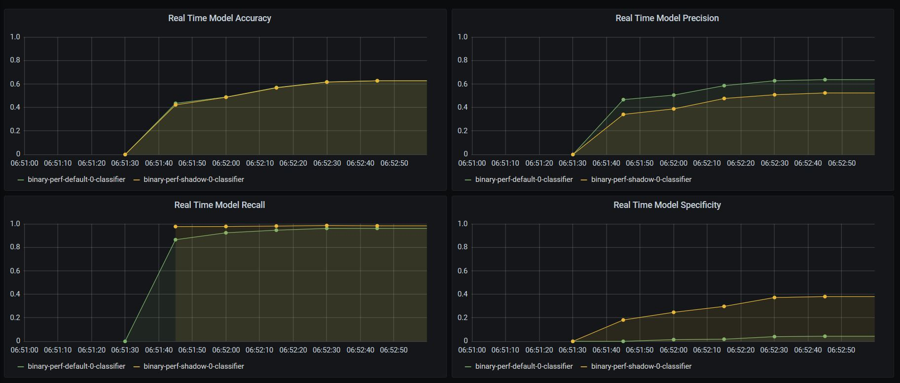
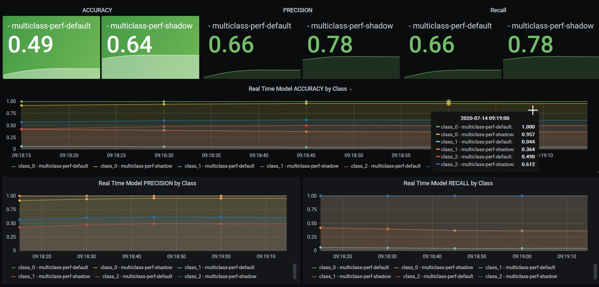
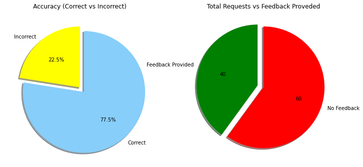
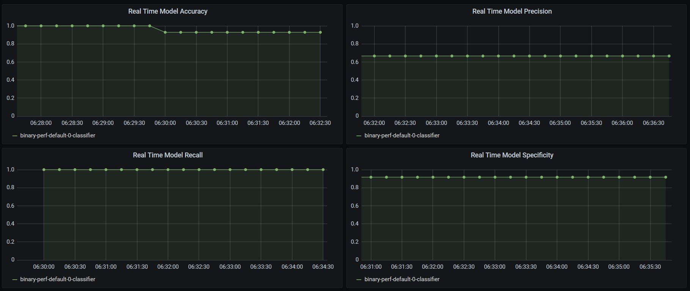
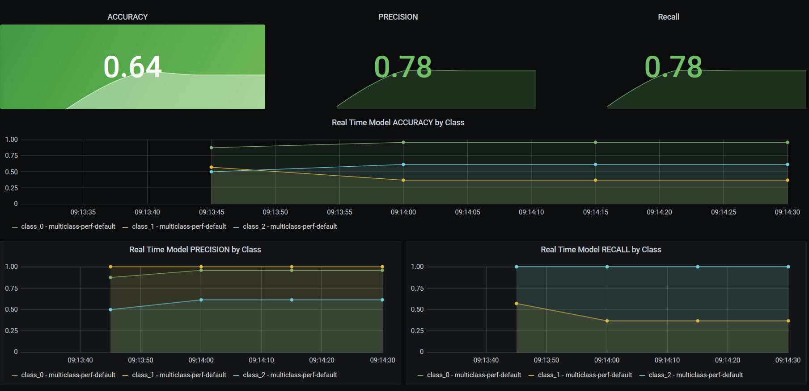

## Stateful Basic Model Feedback Metrics 

In this example we will be able to see how we can add stateful ML metrics into our models.

Initially we will see how to use simple statistical metrics for a binary model.

We will be able to leverage this to compare the performance of two models at the same time.

<table>
<tr>
<td>
    
</td>
<td>
    
</td>
</tr>
</table>


At the end we will be able to show how this can be extended to multiclass models as well.

This can be seen in the dashboard below.



This will explore two architecture to achieve this, namely:
* Through a separate stateful metrics server using knative eventing (left)
* Through the model server leveraging custom metrics (right)

<table>
<tr>
<td>
    
</td>
<td>
    
</td>
</tr>
</table>

### Setup dependencies
* Istio
* Seldon Core (with Istio + Req Logger)
* Elasticsearch
* Knative eventing
* Request logger
* Model with request logger

#### Istio


```python
!istioctl install -y
```

    Detected that your cluster does not support third party JWT authentication. Falling back to less secure first party JWT. See https://istio.io/docs/ops/best-practices/security/#configure-third-party-service-account-tokens for details.
    ✔ Istio core installed                                                          
    ✔ Istiod installed                                                              
    ✔ Addons installed                                                              
    ✔ Ingress gateways installed                                                    
    ✔ Installation complete                                                         


```bash
%%bash
kubectl apply -n istio-system -f - << END
apiVersion: networking.istio.io/v1alpha3
kind: Gateway
metadata:
  name: seldon-gateway
spec:
  selector:
    istio: ingressgateway # use istio default controller
  servers:
  - port:
      number: 80
      name: http
      protocol: HTTP
    hosts:
    - "*"
END
```

    gateway.networking.istio.io/seldon-gateway created


#### Seldon Core


```bash
%%bash
kubectl create ns seldon-system || echo "seldon-system ns exists"

helm upgrade --install seldon-core ../../../helm-charts/seldon-core-operator/ \
    --namespace seldon-system \
    --set certmanager.enabled="true" \
    --set istio.enabled="true" \
    --set istio.gateway="seldon-gateway.istio-system.svc.cluster.local" \
    --set executor.requestLogger.defaultEndpoint="http://default-broker.seldon-logs.svc.cluster.local"
```

    seldon-system ns exists
    Release "seldon-core" does not exist. Installing it now.
    NAME: seldon-core
    LAST DEPLOYED: Sat Jul 11 09:24:28 2020
    NAMESPACE: seldon-system
    STATUS: deployed
    REVISION: 1
    TEST SUITE: None


    Error from server (AlreadyExists): namespaces "seldon-system" already exists


```bash
%%bash
kubectl create ns seldon-logs || echo "seldon-logs ns exists"
helm upgrade --install elasticsearch elasticsearch \
    --version 7.6.0 \
    --namespace=seldon-logs \
    --set service.type=LoadBalancer \
    --set antiAffinity="soft" \
    --repo https://helm.elastic.co \
    --set image=docker.elastic.co/elasticsearch/elasticsearch-oss
```

    namespace/seldon-logs created
    Release "elasticsearch" does not exist. Installing it now.
    NAME: elasticsearch
    LAST DEPLOYED: Sat Jul 11 08:56:31 2020
    NAMESPACE: seldon-logs
    STATUS: deployed
    REVISION: 1
    NOTES:
    1. Watch all cluster members come up.
      $ kubectl get pods --namespace=seldon-logs -l app=elasticsearch-master -w
    2. Test cluster health using Helm test.
      $ helm test elasticsearch


```python
!kubectl rollout status statefulset/elasticsearch-master -n seldon-logs
```

    Waiting for 3 pods to be ready...
    Waiting for 2 pods to be ready...
    Waiting for 1 pods to be ready...
    statefulset rolling update complete 3 pods at revision elasticsearch-master-695c796997...


#### Knative Eventing


```bash
%%bash

kubectl apply --selector knative.dev/crd-install=true \
	--filename https://github.com/knative/eventing/releases/download/v0.11.0/eventing.yaml

kubectl apply --selector knative.dev/crd-install=true \
	--filename https://github.com/knative/eventing/releases/download/v0.11.0/eventing.yaml 

kubectl apply \
	--filename https://github.com/knative/eventing/releases/download/v0.11.0/eventing.yaml 

kubectl rollout status -n knative-eventing deployment/eventing-controller

kubectl apply --filename https://github.com/knative/eventing/releases/download/v0.11.0/in-memory-channel.yaml
```

    customresourcedefinition.apiextensions.k8s.io/apiserversources.sources.eventing.knative.dev created
    customresourcedefinition.apiextensions.k8s.io/brokers.eventing.knative.dev created
    customresourcedefinition.apiextensions.k8s.io/channels.messaging.knative.dev created
    customresourcedefinition.apiextensions.k8s.io/containersources.sources.eventing.knative.dev created
    customresourcedefinition.apiextensions.k8s.io/cronjobsources.sources.eventing.knative.dev created
    customresourcedefinition.apiextensions.k8s.io/eventtypes.eventing.knative.dev created
    customresourcedefinition.apiextensions.k8s.io/parallels.flows.knative.dev created
    customresourcedefinition.apiextensions.k8s.io/sequences.flows.knative.dev created
    customresourcedefinition.apiextensions.k8s.io/parallels.messaging.knative.dev created
    customresourcedefinition.apiextensions.k8s.io/sequences.messaging.knative.dev created
    customresourcedefinition.apiextensions.k8s.io/sinkbindings.sources.eventing.knative.dev created
    customresourcedefinition.apiextensions.k8s.io/subscriptions.messaging.knative.dev created
    customresourcedefinition.apiextensions.k8s.io/triggers.eventing.knative.dev created
    customresourcedefinition.apiextensions.k8s.io/apiserversources.sources.eventing.knative.dev unchanged
    customresourcedefinition.apiextensions.k8s.io/brokers.eventing.knative.dev unchanged
    customresourcedefinition.apiextensions.k8s.io/channels.messaging.knative.dev unchanged
    customresourcedefinition.apiextensions.k8s.io/containersources.sources.eventing.knative.dev unchanged
    customresourcedefinition.apiextensions.k8s.io/cronjobsources.sources.eventing.knative.dev unchanged
    customresourcedefinition.apiextensions.k8s.io/eventtypes.eventing.knative.dev unchanged
    customresourcedefinition.apiextensions.k8s.io/parallels.flows.knative.dev unchanged
    customresourcedefinition.apiextensions.k8s.io/sequences.flows.knative.dev unchanged
    customresourcedefinition.apiextensions.k8s.io/parallels.messaging.knative.dev unchanged
    customresourcedefinition.apiextensions.k8s.io/sequences.messaging.knative.dev unchanged
    customresourcedefinition.apiextensions.k8s.io/sinkbindings.sources.eventing.knative.dev unchanged
    customresourcedefinition.apiextensions.k8s.io/subscriptions.messaging.knative.dev unchanged
    customresourcedefinition.apiextensions.k8s.io/triggers.eventing.knative.dev unchanged
    namespace/knative-eventing created
    clusterrole.rbac.authorization.k8s.io/addressable-resolver created
    clusterrole.rbac.authorization.k8s.io/service-addressable-resolver created
    clusterrole.rbac.authorization.k8s.io/serving-addressable-resolver created
    clusterrole.rbac.authorization.k8s.io/channel-addressable-resolver created
    clusterrole.rbac.authorization.k8s.io/broker-addressable-resolver created
    clusterrole.rbac.authorization.k8s.io/messaging-addressable-resolver created
    clusterrole.rbac.authorization.k8s.io/flows-addressable-resolver created
    clusterrole.rbac.authorization.k8s.io/eventing-broker-filter created
    clusterrole.rbac.authorization.k8s.io/eventing-broker-ingress created
    clusterrole.rbac.authorization.k8s.io/eventing-config-reader created
    clusterrole.rbac.authorization.k8s.io/channelable-manipulator created
    clusterrole.rbac.authorization.k8s.io/knative-eventing-namespaced-admin created
    clusterrole.rbac.authorization.k8s.io/knative-messaging-namespaced-admin created
    clusterrole.rbac.authorization.k8s.io/knative-eventing-sources-namespaced-admin created
    clusterrole.rbac.authorization.k8s.io/knative-eventing-namespaced-edit created
    clusterrole.rbac.authorization.k8s.io/knative-eventing-namespaced-view created
    clusterrole.rbac.authorization.k8s.io/knative-eventing-controller created
    clusterrole.rbac.authorization.k8s.io/podspecable-binding created
    clusterrole.rbac.authorization.k8s.io/builtin-podspecable-binding created
    serviceaccount/eventing-controller created
    serviceaccount/eventing-webhook created
    serviceaccount/eventing-source-controller created
    clusterrole.rbac.authorization.k8s.io/source-observer created
    clusterrole.rbac.authorization.k8s.io/eventing-sources-source-observer created
    clusterrole.rbac.authorization.k8s.io/knative-eventing-source-controller created
    clusterrole.rbac.authorization.k8s.io/knative-eventing-webhook created
    clusterrolebinding.rbac.authorization.k8s.io/eventing-controller created
    clusterrolebinding.rbac.authorization.k8s.io/eventing-controller-resolver created
    clusterrolebinding.rbac.authorization.k8s.io/eventing-controller-source-observer created
    clusterrolebinding.rbac.authorization.k8s.io/eventing-controller-manipulator created
    clusterrolebinding.rbac.authorization.k8s.io/eventing-webhook created
    clusterrolebinding.rbac.authorization.k8s.io/eventing-source-controller created
    clusterrolebinding.rbac.authorization.k8s.io/eventing-source-controller-resolver created
    clusterrolebinding.rbac.authorization.k8s.io/eventing-webhook-resolver created
    clusterrolebinding.rbac.authorization.k8s.io/eventing-webhook-podspecable-binding created
    customresourcedefinition.apiextensions.k8s.io/apiserversources.sources.eventing.knative.dev unchanged
    customresourcedefinition.apiextensions.k8s.io/brokers.eventing.knative.dev unchanged
    customresourcedefinition.apiextensions.k8s.io/channels.messaging.knative.dev unchanged
    customresourcedefinition.apiextensions.k8s.io/containersources.sources.eventing.knative.dev unchanged
    customresourcedefinition.apiextensions.k8s.io/cronjobsources.sources.eventing.knative.dev unchanged
    customresourcedefinition.apiextensions.k8s.io/eventtypes.eventing.knative.dev unchanged
    customresourcedefinition.apiextensions.k8s.io/parallels.flows.knative.dev unchanged
    customresourcedefinition.apiextensions.k8s.io/sequences.flows.knative.dev unchanged
    customresourcedefinition.apiextensions.k8s.io/parallels.messaging.knative.dev unchanged
    customresourcedefinition.apiextensions.k8s.io/sequences.messaging.knative.dev unchanged
    customresourcedefinition.apiextensions.k8s.io/sinkbindings.sources.eventing.knative.dev unchanged
    customresourcedefinition.apiextensions.k8s.io/subscriptions.messaging.knative.dev unchanged
    customresourcedefinition.apiextensions.k8s.io/triggers.eventing.knative.dev unchanged
    configmap/default-ch-webhook created
    service/eventing-webhook created
    deployment.apps/eventing-controller created
    deployment.apps/sources-controller created
    mutatingwebhookconfiguration.admissionregistration.k8s.io/webhook.eventing.knative.dev created
    validatingwebhookconfiguration.admissionregistration.k8s.io/validation.webhook.eventing.knative.dev created
    validatingwebhookconfiguration.admissionregistration.k8s.io/config.webhook.eventing.knative.dev created
    mutatingwebhookconfiguration.admissionregistration.k8s.io/sinkbindings.webhook.sources.knative.dev created
    secret/eventing-webhook-certs created
    deployment.apps/eventing-webhook created
    configmap/config-logging created
    configmap/config-observability created
    configmap/config-tracing created
    Waiting for deployment "eventing-controller" rollout to finish: 0 of 1 updated replicas are available...
    deployment "eventing-controller" successfully rolled out
    clusterrole.rbac.authorization.k8s.io/imc-addressable-resolver created
    clusterrole.rbac.authorization.k8s.io/imc-channelable-manipulator created
    clusterrole.rbac.authorization.k8s.io/imc-controller created
    clusterrole.rbac.authorization.k8s.io/imc-dispatcher created
    service/imc-dispatcher created
    serviceaccount/imc-controller created
    serviceaccount/imc-dispatcher created
    clusterrolebinding.rbac.authorization.k8s.io/imc-controller created
    clusterrolebinding.rbac.authorization.k8s.io/imc-dispatcher created
    customresourcedefinition.apiextensions.k8s.io/inmemorychannels.messaging.knative.dev created
    deployment.apps/imc-controller created
    deployment.apps/imc-dispatcher created


```python
!kubectl get pods -n knative-eventing
```

    NAME                                  READY   STATUS    RESTARTS   AGE
    eventing-controller-d67878576-szkqx   1/1     Running   0          34s
    eventing-webhook-5b45945585-l8xxf     1/1     Running   0          34s
    imc-controller-67b4c9787b-np5cm       1/1     Running   0          30s
    imc-dispatcher-7b57bc9796-b4hpn       1/1     Running   0          30s
    sources-controller-685db898c-t65fl    1/1     Running   0          34s


#### Create Request Logger in Seldon Logs namespace


```python
!kubectl label namespace seldon-logs knative-eventing-injection=enabled --overwrite=true
```

    namespace/seldon-logs labeled


```python
!kubectl get broker -n seldon-logs 
```

    NAME      READY   REASON   URL                                                   AGE
    default   True             http://default-broker.seldon-logs.svc.cluster.local   18s


```bash
%%bash
kubectl apply -f - << END
apiVersion: eventing.knative.dev/v1alpha1
kind: Trigger
metadata:
 name: seldon-request-logger-trigger
 namespace: seldon-logs
spec:
 subscriber:
   ref:
     apiVersion: v1
     kind: Service
     name: seldon-request-logger
END

kubectl apply -f - << END
apiVersion: apps/v1
kind: Deployment
metadata:
 name: seldon-request-logger
 namespace: seldon-logs
 labels:
   app: seldon-request-logger
spec:
 replicas: 1
 selector:
   matchLabels:
     app: seldon-request-logger
 template:
   metadata:
     labels:
       app: seldon-request-logger
   spec:
     containers:
       - name: user-container
         image: docker.io/seldonio/seldon-request-logger:1.2.2-dev
         imagePullPolicy: IfNotPresent
         env:
           - name: ELASTICSEARCH_HOST
             value: "elasticsearch-master.seldon-logs.svc.cluster.local"
           - name: ELASTICSEARCH_PORT
             value: "9200"
END

kubectl apply -f - << END
apiVersion: v1
kind: Service
metadata:
 name: seldon-request-logger
 namespace: seldon-logs
spec:
 selector:
   app: seldon-request-logger
 ports:
   - protocol: TCP
     port: 80
     targetPort: 8080
END
```

    trigger.eventing.knative.dev/seldon-request-logger-trigger created
    deployment.apps/seldon-request-logger unchanged
    service/seldon-request-logger unchanged


```python
!kubectl get trigger -n seldon-logs
```

    NAME                            READY   REASON   BROKER    SUBSCRIBER_URI                                                AGE
    seldon-request-logger-trigger   True             default   http://seldon-request-logger.seldon-logs.svc.cluster.local/   2m18s


```python
#### Deploy model with request logger
```


```bash
%%bash

kubectl create ns seldon || echo "seldon ns exists"

kubectl apply -n seldon -f - << END
kind: SeldonDeployment
apiVersion: machinelearning.seldon.io/v1
metadata:
  name: sklearn
spec:
  annotations:
    seldon.io/engine-seldon-log-messages-externally: 'true'
  name: sklearn
  predictors:
  - name: default
    graph:
      name: irisclassifier-default
      implementation: SKLEARN_SERVER
      endpoint:
        type: REST
      modelUri: gs://seldon-models/sklearn/iris
      logger:
        mode: "all"
    replicas: 1
END
```

    seldon ns exists
    seldondeployment.machinelearning.seldon.io/sklearn created


    Error from server (AlreadyExists): namespaces "seldon" already exists


### Set up elasticsearch client and clean the index


```python
from elasticsearch import Elasticsearch
es = Elasticsearch(['http://localhost:9200'])
```


```python
es.indices.delete(index='inference-log-seldon-seldon-sklearn-default', ignore=[400, 404])
```

## Send Request


```python
import requests
url = "http://localhost:80/seldon/seldon/sklearn/api/v1.0"
```


```python
pred_req_1 = {"data":{"ndarray":[[1,2,3,4]]}}
pred_resp_1 = requests.post(f"{url}/predictions", json=pred_req_1)
```


```python
print(f"Response ID: {pred_resp_1.headers.get('seldon-puid')}")
print(pred_resp_1.json())
```

    Response ID: 2cfe7cb7-9467-467e-b9ea-1361042c3d60
    {'data': {'names': ['t:0', 't:1', 't:2'], 'ndarray': [[0.0006985194531162841, 0.003668039039435755, 0.9956334415074478]]}, 'meta': {}}


### Check request was sent to Elasticsearch

See the index that has been created


```python
 es.indices.get_alias("*")
```


    {'inference-log-seldon-seldon-sklearn-default': {'aliases': {}}}


Check that the index has been created for that request


```python
res = es.search(index="inference-log-seldon-seldon-sklearn-default", body={"query": {"match_all": {}}})
print("Logged Request:")
print(res["hits"]["hits"][0]["_source"]["request"])
print("\nLogged Response:")
print(res["hits"]["hits"][0]["_source"]["response"])
```

    Logged Request:
    {'payload': {'data': {'ndarray': [[1, 2, 3, 4]]}}, 'dataType': 'tabular', 'elements': {}, 'instance': [1.0, 2.0, 3.0, 4.0], 'ce-time': '2020-07-14T19:51:55.897123716Z', 'ce-source': 'http:localhost:8000'}
    
    Logged Response:
    {'ce-source': 'http:localhost:8000', 'instance': [0.0006985194531162841, 0.003668039039435755, 0.9956334415074478], 'names': ['t:0', 't:1', 't:2'], 'payload': {'data': {'names': ['t:0', 't:1', 't:2'], 'ndarray': [[0.0006985194531162841, 0.003668039039435755, 0.9956334415074478]]}, 'meta': {}}, 'dataType': 'tabular', 'elements': {'t:1': [0.003668039039435755], 't:0': [0.0006985194531162841], 't:2': [0.9956334415074478]}, 'ce-time': '2020-07-14T19:51:55.900570216Z'}


### Now we can send feedback 

For this we can include the reward, which in this case can state whether it's correct or incorrect, together with the truth answer, in case it was incorrect (or to emphasise that it was correct).

In order for us to be able to send the feedback to the right request, we need to provide the feedback ID for the request:


```python
puid_seldon_1 = pred_resp_1.headers.get("seldon-puid")

print(puid_seldon_1)
```

    2cfe7cb7-9467-467e-b9ea-1361042c3d60


We will also be able to add extra metadata, such as the user providing the feedback, date, time, etc.


```python
feedback_tags_1 = {
    "user": "Seldon Admin",
    "date": "11/07/2020"
}
```

And finally we can put together the feedback request.


```python
feedback_req_1 = {
    "reward": 0,
    "truth": {
        'data': {
            'names': ['t:0', 't:1', 't:2'], 
            'ndarray': [[0, 0, 1]]
        },
        "meta": {
            "tags": feedback_tags_1
        }
    }
}
```


```python
feedback_resp_1 = requests.post(f"{url}/feedback", json=feedback_req_1, headers={"seldon-puid": puid_seldon_1})
```


```python
feedback_resp_1
```


    <Response [200]>


### CHeck that feedback has been received


```python
res = es.search(index="inference-log-seldon-seldon-sklearn-default", body={"query": {"match_all": {}}})
print(res["hits"]["hits"][0]["_source"]["feedback"])
```

    {'reward': 0, 'ce-source': 'http:localhost:8000', 'truth': {'data': {'names': ['t:0', 't:1', 't:2'], 'ndarray': [[0, 0, 1]]}, 'meta': {'tags': {'date': '11/07/2020', 'user': 'Seldon Admin'}}}, 'ce-time': '2020-07-14T19:52:10.51310669Z'}


### Stateful metrics Overview

Now that we have seen the basics of the feedback mechanism we can actually leverage the features it provides.

For this we'll want to send a few requests, together with feedback to some requests. This will include:
* 100 requests in total
* 50 will be provided feedback
* 35 of those will be correct (the rest incorrect)

Once we set up the requests, we will be able to get further insights.


```python
TOTAL_REQS = 100
MAX_FEEDBACK = 63
MAX_CORRECT = 46
```


```python
es.indices.delete(index='inference-log-seldon-seldon-sklearn-default', ignore=[400, 404])
```


    {'acknowledged': True}


#### First send all the requests


```python
ids_list = []
for i in range(TOTAL_REQS):
    pred_req = {"data":{"ndarray":[[1,2,3,4]]}}
    pred_resp = requests.post(f"{url}/predictions", json=pred_req)
    assert pred_resp.status_code == 200
    ids_list.append(pred_resp.headers["seldon-puid"])
    
```


```python
es_count = es.count(index="inference-log-seldon-seldon-sklearn-default")
print(es_count)
```

    {'count': 100, '_shards': {'total': 1, 'successful': 1, 'skipped': 0, 'failed': 0}}


#### Then send the feedback


```python
default_truth_val = {'data': { 'names': ['t:0', 't:1', 't:2'], 'ndarray': [[0, 0, 1]]}}
default_truth_meta = {"tags": {"user": "Seldon Admin", "date": "11/07/2020"}}

for idx, sid in enumerate(ids_list):
    if idx == MAX_FEEDBACK: break # we only want to provide feedback to 50
    
    feedback = {}
    feedback["reward"] = idx < MAX_CORRECT
    feedback["truth"] = {} if idx < MAX_CORRECT else default_truth_val
    feedback["truth"]["meta"] = default_truth_meta
    
    feed_resp = requests.post(f"{url}/feedback", json=feedback, headers={"seldon-puid": sid})
    assert feed_resp.status_code == 200
```

### Exposing Feedback Metrics

Now that feedback has been provided, it's possible to expose the feedback metrics for visualisation.

The default and simplest way to provide this is basically through two simple metrics:
* Accuracy 
* Number of data with feedback

This can be extended to also provide insights such as:
* Precision
* Recall
* Specificity
* F1 score

Primarily as these insights can be provided as insights with teh feedback. For more advanced metrics is discussed below.


```python
query = {
  "aggregations": { 
    "reward_sum": { "sum": { "field": "feedback.reward" } },
    "reward_count": { "filter": { "exists": { "field": "feedback.reward"} } }
  }
}
feedback_metrics = es.search(index="inference-log-seldon-seldon-sklearn-default", body=query)
print(feedback_metrics["aggregations"])
```

    {'reward_sum': {'value': 31.0, 'value_as_string': 'true'}, 'reward_count': {'doc_count': 40}}


This can also be performed for a specified datetime, so you can actually filter the accuracy / performance based on:
* Date of processing of the initial request
* Date of feedback being provided

Below is a simple visualisation of these results:


```python
import numpy as np
import matplotlib.pyplot as plt

feedback_correct = feedback_metrics["aggregations"]["reward_sum"]["value"]
feedback_total = feedback_metrics["aggregations"]["reward_count"]["doc_count"]
feedback_incorrect = feedback_total - feedback_correct
no_feedback = es_count["count"] - feedback_total

plt.subplots(figsize=(12, 6))
plt.subplot(1, 2, 1)
plt.title("Accuracy (Correct vs Incorrect)")
plt.pie([feedback_incorrect, feedback_correct], explode=(0, 0.1), labels=('Incorrect', 'Correct'), autopct='%1.1f%%', shadow=True, startangle=90, colors=['yellow', 'lightskyblue'])  

plt.subplot(1, 2, 2)
plt.title("Total Requests vs Feedback Proveded")
plt.pie([feedback_total, no_feedback], explode=(0.1, 0), labels=('Feedback Provided', 'No Feedback'), autopct='%.0f', shadow=True, startangle=90, colors=['green', 'red'])

plt.show()
```





## Real Time Metrics Example with separate service

Similar to the design pattern that Seldon Core introduced with request logging and outlier detectors through asynchronous eventing, it's possible to do the same for metrics.

More specifically, it is possible to set up a stateful feedback processor which retrieves all the metrics on start and registers for feedback events to provide real time insights on any new incoming requests.

In this notebook we show how this can be achieved thorugh two different approaches:
* As a separate stateful metrics processor using KNative Eventing
* Implemented in the seldon model itself

Below we dive into both examples together with tradeoffs.

#### Example of custom stateful metrics processor

These can then be visualised through different areas such as through prometheus metrics, using a grafana dashboard. Below is a brief example of how this can be achieved through a simple implementation.


First we deploy the Seldon Core Analyitcs


```python
!helm install seldon-core-analytics ../../../helm-charts/seldon-core-analytics --namespace seldon-system
```

Now we should be able to access the grafana dashboard for the model. You can access it by port-forwarding the grafana dashboard with:
```
kubectl port-forward -n seldon-system svc/seldon-core-analytics-grafana 7000:80
```
This way you can now access it via `http://localhost:7000` with the username `admin` and password `password`.

You should be able to see the following dashboard out of the box:


Now we can deploy our [stateful metrics component](../../../components/stateful-metrics-server/) with the following configuration:


```bash
%%bash
kubectl apply -n seldon-logs -f - << END
---
apiVersion: apps/v1
kind: Deployment
metadata:
 name: seldon-stateful-metrics-sklearn-deployment
 labels:
   app: seldon-stateful-metrics-sklearn
spec:
 replicas: 1
 selector:
   matchLabels:
     app: seldon-stateful-metrics-sklearn
 template:
   metadata:
     annotations:
       prometheus.io/path: /metrics
       prometheus.io/scrape: "true"
     labels:
       app: seldon-stateful-metrics-sklearn
   spec:
     containers:
       - name: user-container
         image: docker.io/seldonio/stateful-metrics-server:1.2.2-dev
         imagePullPolicy: IfNotPresent
         ports:
         - containerPort: 8080
           name: metrics
           protocol: TCP
         - containerPort: 8080
           name: http
           protocol: TCP
         env:
           - name: ELASTICSEARCH_HOST
             value: "elasticsearch-master.seldon-logs.svc.cluster.local"
           - name: ELASTICSEARCH_PORT
             value: "9200"
---
apiVersion: v1
kind: Service
metadata:
 name: seldon-stateful-metrics-sklearn-svc
spec:
 selector:
   app: seldon-stateful-metrics-sklearn
 ports:
   - protocol: TCP
     port: 80
     targetPort: 8080
END
```

A couple of things to notice, is that here we have enabled prometheus scraping to the `/metrics` endpoint, and we've also added the named `metrcs` port, which `seldon-core-analytics` is configured to scrape from.

Now we can actually deploy the trigger for the model we've built:


```bash
%%bash
kubectl apply -n seldon-logs -f - << END
apiVersion: eventing.knative.dev/v1alpha1
kind: Trigger
metadata:
  name: seldon-stateful-metrics-sklearn-trigger
spec:
  subscriber:
    ref:
      apiVersion: v1
      kind: Service
      name: seldon-stateful-metrics-sklearn-svc
  filter:
    attributes:
      type: io.seldon.serving.feedback
      inferenceservicename: sklearn
END
```

You can see that this trigger is filtering on the `type: io.seldon.serving.feedback` and `inferenceservicename: sklearn`.

Once we have this, we actually would see that it automatically collects all of the available logs and starts producing metrics that are being collected with prometheus.

We can confirm this by proceeding to our dashboard and adding a new dashboard, with the prometheus datasource, and the metric would have as value `sum(correct_total) / sum(total_total)` which basically is the metric `correct_total` divided by the `total_total` which shoudl give us the real time accuracy.

You should be able to see the following: 


Once you add this dashboard, you can set it to refresh every 5 minutes, and in turn, we will now be able to see real time accuracy changing, let's actually start some data:


```python
import time
import random

CORRECT_PROBABILITY = 0.8

pred_req = {"data":{"ndarray":[[1,2,3,4]]}}
default_truth_val = {'data': { 'names': ['t:0', 't:1', 't:2'], 'ndarray': [[0, 0, 1]]}}
default_truth_meta = {"tags": {"user": "Seldon Admin", "date": "11/07/2020"}}

while True:
    pred_resp = requests.post(f"{url}/predictions", json=pred_req)
    assert pred_resp.status_code == 200
    idx = pred_resp.headers["seldon-puid"]
    time.sleep(0.1)
    
    pred = 1 if random.random() > CORRECT_PROBABILITY else 0
    print(f"Sending: {pred} ")
    feedback = {}
    feedback["reward"] = 1 if pred else 0
    feedback["truth"] = {} if pred else default_truth_val
    feedback["truth"]["meta"] = default_truth_meta
    feed_resp = requests.post(f"{url}/feedback", json=feedback, headers={"seldon-puid": sid})
    assert feed_resp.status_code == 200
    time.sleep(0.5)    
```

    Sending: 1 
    Sending: 0 
    Sending: 1 
    Sending: 0 
    Sending: 0 
    Sending: 1 
    Sending: 0 
    Sending: 1 
    Sending: 0 
    Sending: 1 
    Sending: 0 
    Sending: 1 
    Sending: 0 
    Sending: 0 
    Sending: 0 
    Sending: 0 
    Sending: 0 
    Sending: 0 
    Sending: 0 
    Sending: 0 
    Sending: 0 
    Sending: 0 
    Sending: 1 
    Sending: 0 
    Sending: 0 
    Sending: 0 
    Sending: 1 
    Sending: 0 
    Sending: 0 
    Sending: 0 
    Sending: 0 
    Sending: 1 
    Sending: 0 
    Sending: 0 
    Sending: 0 
    Sending: 1 
    Sending: 0 
    Sending: 0 
    Sending: 0 
    Sending: 0 
    Sending: 0 
    Sending: 0 
    Sending: 0 
    Sending: 0 
    Sending: 0 
    Sending: 0 
    Sending: 0 
    Sending: 1 
    Sending: 0 
    Sending: 0 
    Sending: 0 
    Sending: 0 
    Sending: 1 
    Sending: 0 
    Sending: 0 
    Sending: 0 
    Sending: 0 
    Sending: 0 
    Sending: 0 
    Sending: 0 
    Sending: 0 
    Sending: 0 
    Sending: 0 
    Sending: 0 
    Sending: 1 
    Sending: 0 
    Sending: 0 
    Sending: 0 
    Sending: 0 
    Sending: 0 
    Sending: 1 
    Sending: 1 
    Sending: 0 
    Sending: 0 
    Sending: 0 
    Sending: 0 
    Sending: 0 
    Sending: 0 
    Sending: 0 
    Sending: 0 
    Sending: 0 
    Sending: 1 
    Sending: 0 
    Sending: 0 
    Sending: 0 
    Sending: 0 
    Sending: 1 
    Sending: 0 
    Sending: 0 
    Sending: 0 


    -----------------------

    KeyboardInterruptTraceback (most recent call last)

    <ipython-input-80-fc7bc223c77e> in <module>
         22     feed_resp = requests.post(f"{url}/feedback", json=feedback, headers={"seldon-puid": sid})
         23     assert feed_resp.status_code == 200
    ---> 24     time.sleep(0.5)
    

    KeyboardInterrupt: 


This will send requests that will show 80% probablility of incorrect predictions, showing a steady decline in accuracy as per the image below.


This could be quite powerful as it could be connected with something like Alertmanager to ensure alerts are sent if the model metric drops below a specific percentage.

If you wish to load the dashboard directly, you can also do this by importing the json below in your grafana dashboard:


```python
{"annotations": {"list": [{"builtIn": 1,"datasource": "-- Grafana --","enable": true,"hide": true,"iconColor": "rgba(0, 211, 255, 1)","name": "Annotations & Alerts","type": "dashboard"}]},"editable": true,"gnetId": null,"graphTooltip": 0,"id": null,"links": [],"panels": [{"aliasColors": {},"bars": true,"dashLength": 10,"dashes": false,"datasource": "prometheus","description": "","fieldConfig": {"defaults": {"custom": {}},"overrides": []},"fill": 1,"fillGradient": 0,"gridPos": {"h": 12,"w": 24,"x": 0,"y": 0},"hiddenSeries": false,"id": 2,"legend": {"avg": false,"current": false,"max": false,"min": false,"show": true,"total": false,"values": false},"lines": true,"linewidth": 1,"nullPointMode": "null","options": {"dataLinks": []},"percentage": false,"pointradius": 2,"points": false,"renderer": "flot","seriesOverrides": [],"spaceLength": 10,"stack": false,"steppedLine": false,"targets": [{"expr": "sum(correct_total) / sum(total_total)","interval": "","legendFormat": "Accuracy %","refId": "A"}],"thresholds": [],"timeFrom": null,"timeRegions": [],"timeShift": null,"title": "Real Time Model Accuracy","tooltip": {"shared": true,"sort": 0,"value_type": "individual"},"type": "graph","xaxis": {"buckets": null,"mode": "time","name": null,"show": true,"values": []},"yaxes": [{"decimals": null,"format": "short","label": null,"logBase": 1,"max": "1","min": "0","show": true},{"format": "short","label": null,"logBase": 1,"max": null,"min": null,"show": true}],"yaxis": {"align": false,"alignLevel": null}}],"refresh": "5s","schemaVersion": 25,"style": "dark","tags": [],"templating": {"list": []},"time": {"from": "now-5m","to": "now"},"timepicker": {"refresh_intervals": ["10s","30s","1m","5m","15m","30m","1h","2h","1d"]},"timezone": "","title": "New dashboard","uid": null,"version": 0}
```

### Example using python wrapper for Binary Classifier

For this second example we will show how we can implement the stateful metrics in the python wrapper itself.

The reason why this is possible, is because the metrics server above is actually implemented in a very similar way to the wrapper.

Because of this, it will be possible to just use the wrapper itself and enable for more complex functionality.

Not only it's possible to store the metrics, but given that the models are loaded, it's possible to perform complex comparisons in the model itself.

We will see how to compute complex statistical metrics for a binary model, and then how it can be approached for multi-class models.

This will allow us to deploy a shadow deployment and compare the metrics against both models.


#### Setup Requirements

Install required dependencies and make file available for language wrapper.


```python
%%writefile requirements.txt
joblib==0.14.1
scikit-learn==0.20.3
```


```python
!pip install -r requirememnts.txt
```

#### Train the binary models we'll deploy

The first model is a LogisticRegression model, and the second is a Perceptron model.

We will first set everyhthing up with the LogisticRegression model.


```python
import joblib
from sklearn.pipeline import Pipeline
from sklearn.linear_model import LogisticRegression, Perceptron
from sklearn import datasets

parameters = [
    {"clf": LogisticRegression(solver="liblinear", multi_class="ovr"), "name": "binary-lr.joblib"},
    {"clf": Perceptron(n_iter=40, eta0=0.1, random_state=0), "name": "binary-percept.joblib"},
]

X, y = datasets.load_breast_cancer(return_X_y=True)

for param in parameters:
    clf = param["clf"]
    clf.fit(X, y)

    print(f"Saving model in {param['name']}")
    joblib.dump(clf, param['name'])
```

    Saving model in binary-lr.joblib
    Saving model in binary-percept.joblib


    /home/alejandro/miniconda3/lib/python3.7/site-packages/sklearn/linear_model/stochastic_gradient.py:152: DeprecationWarning: n_iter parameter is deprecated in 0.19 and will be removed in 0.21. Use max_iter and tol instead.
      DeprecationWarning)


```python
%%writefile BinaryClassifier.py
import joblib


class Score:
    def __init__(self, TP, FP, TN, FN):
        self.TP = TP
        self.FP = FP
        self.TN = TN
        self.FN = FN


class BinaryClassifier:
    def __init__(self, model_name="binary-lr.joblib"):
        self.scores = Score(0, 0, 0, 0)
        self.model = joblib.load(model_name)

    def predict(self, X, features_names=None, meta=None):
        return self.model.predict(X)

    def send_feedback(self, features, feature_names, reward, truth, routing=""):
        predicted = self.predict(features)
        if int(truth[0]) == 1:
            if int(predicted[0]) == int(truth[0]):
                self.scores.TP += 1
            else:
                self.scores.FN += 1
        else:
            if int(predicted[0]) == int(truth[0]):
                self.scores.TN += 1
            else:
                self.scores.FP += 1
        return []  # Ignore return statement as its not used

    def metrics(self):
        return [
            {"type": "GAUGE", "key": "true_pos", "value": self.scores.TP},
            {"type": "GAUGE", "key": "true_neg", "value": self.scores.FN},
            {"type": "GAUGE", "key": "false_pos", "value": self.scores.TN},
            {"type": "GAUGE", "key": "false_neg", "value": self.scores.FP},
        ]
```

    Overwriting BinaryClassifier.py


Now we can build the image using the s2i utility which will create our microservice to deploy.


```python
!s2i build . seldonio/seldon-core-s2i-python37:1.2.2-dev binary_perf:0.1 \
        --env MODEL_NAME=BinaryClassifier --env API_TYPE=REST --env SERVICE_TYPE=MODEL --env PERSISTENCE=0
```

    ---> Installing application source...
    ---> Installing dependencies ...
    Looking in links: /whl
    Collecting joblib==0.14.1 (from -r requirements.txt (line 1))
      WARNING: Url '/whl' is ignored. It is either a non-existing path or lacks a specific scheme.
    Downloading https://files.pythonhosted.org/packages/28/5c/cf6a2b65a321c4a209efcdf64c2689efae2cb62661f8f6f4bb28547cf1bf/joblib-0.14.1-py2.py3-none-any.whl (294kB)
    Collecting scikit-learn==0.20.3 (from -r requirements.txt (line 2))
      WARNING: Url '/whl' is ignored. It is either a non-existing path or lacks a specific scheme.
    Downloading https://files.pythonhosted.org/packages/aa/cc/a84e1748a2a70d0f3e081f56cefc634f3b57013b16faa6926d3a6f0598df/scikit_learn-0.20.3-cp37-cp37m-manylinux1_x86_64.whl (5.4MB)
    Collecting scipy>=0.13.3 (from scikit-learn==0.20.3->-r requirements.txt (line 2))
      WARNING: Url '/whl' is ignored. It is either a non-existing path or lacks a specific scheme.
    Downloading https://files.pythonhosted.org/packages/30/45/ff9df4beceab76f979ee0ea7f5d248596aa5b0c179aa3d30589a3f4549eb/scipy-1.5.1-cp37-cp37m-manylinux1_x86_64.whl (25.9MB)
    Requirement already satisfied: numpy>=1.8.2 in /opt/conda/lib/python3.7/site-packages (from scikit-learn==0.20.3->-r requirements.txt (line 2)) (1.19.0)
    Installing collected packages: joblib, scipy, scikit-learn
    Successfully installed joblib-0.14.1 scikit-learn-0.20.3 scipy-1.5.1
    Collecting pip-licenses
    Downloading https://files.pythonhosted.org/packages/2e/8a/b8eb114545d9e984fcc013ef544c487aa2c02489a66185a82108625784a5/pip_licenses-2.2.1-py3-none-any.whl
    Collecting PTable (from pip-licenses)
    Downloading https://files.pythonhosted.org/packages/ab/b3/b54301811173ca94119eb474634f120a49cd370f257d1aae5a4abaf12729/PTable-0.9.2.tar.gz
    Building wheels for collected packages: PTable
    Building wheel for PTable (setup.py): started
    Building wheel for PTable (setup.py): finished with status 'done'
    Created wheel for PTable: filename=PTable-0.9.2-cp37-none-any.whl size=22906 sha256=879ef5389c9fde9164b54781263911d3dddbc07f3c552ca98188f6774b64104a
    Stored in directory: /root/.cache/pip/wheels/22/cc/2e/55980bfe86393df3e9896146a01f6802978d09d7ebcba5ea56
    Successfully built PTable
    Installing collected packages: PTable, pip-licenses
    Successfully installed PTable-0.9.2 pip-licenses-2.2.1
    created path: ./licenses/license_info.csv
    created path: ./licenses/license.txt
    Build completed successfully


And we can deploy a simple model with the yaml below


```bash
%%bash
kubectl apply -n seldon -f - <<END
apiVersion: machinelearning.seldon.io/v1
kind: SeldonDeployment
metadata:
  name: binary-perf
spec:
  name: binary-perf
  predictors:
  - componentSpecs:
    - spec:
        containers:
        - image: binary_perf:0.1
          imagePullPolicy: IfNotPresent
          name: classifier
    graph:
      children: []
      endpoint:
        type: REST
      parameters:
      - name: model_name
        type: STRING
        value: binary-lr.joblib
      name: classifier
      type: MODEL
    name: default
    replicas: 1
END
```

    seldondeployment.machinelearning.seldon.io/binary-perf created


```python
!kubectl get pods -n seldon | grep binary
```

    binary-perf-default-0-classifier-6bb78d67d4-2b2gh           2/2     Running   0          24s


Now we can send a couple of initial requests to be able to set up the initial dashboard in grafana with the metrics generated in prometheus


```python
import requests

url = "http://localhost:80/seldon/seldon/binary-perf/api/v1.0"

tn = {"reward": 0, "request": {"data": {"ndarray": [X[0].tolist()]}}, "truth":{"data": {"ndarray": [[0]]}}}
fp = {"reward": 0, "request": {"data": {"ndarray": [X[0].tolist()]}}, "truth":{"data": {"ndarray": [[1]]}}}
tp = {"reward": 0, "request": {"data": {"ndarray": [X[-1].tolist()]}}, "truth":{"data": {"ndarray": [[1]]}}}
fn = {"reward": 0, "request": {"data": {"ndarray": [X[-1].tolist()]}}, "truth":{"data": {"ndarray": [[0]]}}}

samp_list = [tn, tp, fp, fn]

for s in samp_list:
    for i in range(10):
        requests.post(f"{url}/feedback", json=s)
```

We can now create a dashboard with these values to display the following statistical metrics:
* Accuracy (tp + tn) / (tp + tn + fp + fn)
* Precision tp / (tp + fp)
* Recall tp / (fp + fn)
* Specificity tn / (tn + fp)
    


You can import the dashboard using the json below:


```python
{"annotations": {"list": [{"builtIn": 1,"datasource": "-- Grafana --","enable": true,"hide": true,"iconColor": "rgba(0, 211, 255, 1)","name": "Annotations & Alerts","type": "dashboard"}]},"editable": true,"gnetId": null,"graphTooltip": 0,"links": [],"panels": [{"aliasColors": {},"bars": false,"dashLength": 10,"dashes": false,"datasource": "prometheus","description": "","fieldConfig": {"defaults": {"custom": {},"mappings": [],"thresholds": {"mode": "absolute","steps": [{"color": "green","value": null},{"color": "red","value": 80}]}},"overrides": []},"fill": 1,"fillGradient": 0,"gridPos": {"h": 8,"w": 12,"x": 0,"y": 0},"hiddenSeries": false,"id": 2,"legend": {"avg": false,"current": false,"max": false,"min": false,"show": true,"total": false,"values": false},"lines": true,"linewidth": 1,"nullPointMode": "null","options": {"dataLinks": []},"percentage": false,"pluginVersion": "7.0.3","pointradius": 2,"points": true,"renderer": "flot","seriesOverrides": [],"spaceLength": 10,"stack": false,"steppedLine": false,"targets": [{"expr": "(true_pos+true_neg)/(true_pos + true_neg + false_neg + false_pos)","interval": "","legendFormat": "{{app}}","refId": "A"}],"thresholds": [],"timeFrom": null,"timeRegions": [],"timeShift": null,"title": "Real Time Model Accuracy","tooltip": {"shared": true,"sort": 0,"value_type": "individual"},"type": "graph","xaxis": {"buckets": null,"mode": "time","name": null,"show": true,"values": []},"yaxes": [{"$$hashKey": "object:211","decimals": null,"format": "short","label": null,"logBase": 1,"max": "1","min": "0","show": true},{"$$hashKey": "object:212","format": "short","label": null,"logBase": 1,"max": null,"min": null,"show": true}],"yaxis": {"align": false,"alignLevel": null}},{"aliasColors": {},"bars": false,"dashLength": 10,"dashes": false,"datasource": "prometheus","description": "","fieldConfig": {"defaults": {"custom": {"align": null},"mappings": [],"thresholds": {"mode": "absolute","steps": [{"color": "green","value": null},{"color": "red","value": 80}]}},"overrides": []},"fill": 1,"fillGradient": 0,"gridPos": {"h": 8,"w": 12,"x": 12,"y": 0},"hiddenSeries": false,"id": 3,"legend": {"avg": false,"current": false,"max": false,"min": false,"show": true,"total": false,"values": false},"lines": true,"linewidth": 1,"nullPointMode": "null","options": {"dataLinks": []},"percentage": false,"pluginVersion": "7.0.3","pointradius": 2,"points": true,"renderer": "flot","seriesOverrides": [],"spaceLength": 10,"stack": false,"steppedLine": false,"targets": [{"expr": "true_pos/(true_pos + false_pos)","interval": "","legendFormat": "{{app}}","refId": "A"}],"thresholds": [],"timeFrom": null,"timeRegions": [],"timeShift": null,"title": "Real Time Model Precision","tooltip": {"shared": true,"sort": 0,"value_type": "individual"},"type": "graph","xaxis": {"buckets": null,"mode": "time","name": null,"show": true,"values": []},"yaxes": [{"$$hashKey": "object:260","decimals": null,"format": "short","label": null,"logBase": 1,"max": "1","min": "0","show": true},{"$$hashKey": "object:261","format": "short","label": null,"logBase": 1,"max": null,"min": null,"show": true}],"yaxis": {"align": false,"alignLevel": null}},{"aliasColors": {},"bars": false,"dashLength": 10,"dashes": false,"datasource": "prometheus","description": "","fieldConfig": {"defaults": {"custom": {},"mappings": [],"thresholds": {"mode": "absolute","steps": [{"color": "green","value": null},{"color": "red","value": 80}]}},"overrides": []},"fill": 1,"fillGradient": 0,"gridPos": {"h": 8,"w": 12,"x": 0,"y": 8},"hiddenSeries": false,"id": 5,"legend": {"avg": false,"current": false,"max": false,"min": false,"show": true,"total": false,"values": false},"lines": true,"linewidth": 1,"nullPointMode": "null","options": {"dataLinks": []},"percentage": false,"pluginVersion": "7.0.3","pointradius": 2,"points": true,"renderer": "flot","seriesOverrides": [],"spaceLength": 10,"stack": false,"steppedLine": false,"targets": [{"expr": "true_pos/(true_pos + false_neg)","interval": "","legendFormat": "{{app}}","refId": "A"}],"thresholds": [],"timeFrom": null,"timeRegions": [],"timeShift": null,"title": "Real Time Model Recall","tooltip": {"shared": true,"sort": 0,"value_type": "individual"},"type": "graph","xaxis": {"buckets": null,"mode": "time","name": null,"show": true,"values": []},"yaxes": [{"$$hashKey": "object:309","decimals": null,"format": "short","label": null,"logBase": 1,"max": "1","min": "0","show": true},{"$$hashKey": "object:310","format": "short","label": null,"logBase": 1,"max": null,"min": null,"show": true}],"yaxis": {"align": false,"alignLevel": null}},{"aliasColors": {},"bars": false,"dashLength": 10,"dashes": false,"datasource": "prometheus","description": "","fieldConfig": {"defaults": {"custom": {},"mappings": [],"thresholds": {"mode": "absolute","steps": [{"color": "green","value": null},{"color": "red","value": 80}]}},"overrides": []},"fill": 1,"fillGradient": 0,"gridPos": {"h": 8,"w": 12,"x": 12,"y": 8},"hiddenSeries": false,"id": 4,"legend": {"avg": false,"current": false,"max": false,"min": false,"show": true,"total": false,"values": false},"lines": true,"linewidth": 1,"nullPointMode": "null","options": {"dataLinks": []},"percentage": false,"pluginVersion": "7.0.3","pointradius": 2,"points": true,"renderer": "flot","seriesOverrides": [],"spaceLength": 10,"stack": false,"steppedLine": false,"targets": [{"expr": "true_neg/(true_neg + false_pos)","interval": "","legendFormat": "{{app}}","refId": "A"}],"thresholds": [],"timeFrom": null,"timeRegions": [],"timeShift": null,"title": "Real Time Model Specificity","tooltip": {"shared": true,"sort": 0,"value_type": "individual"},"type": "graph","xaxis": {"buckets": null,"mode": "time","name": null,"show": true,"values": []},"yaxes": [{"$$hashKey": "object:358","decimals": null,"format": "short","label": null,"logBase": 1,"max": "1","min": "0","show": true},{"$$hashKey": "object:359","format": "short","label": null,"logBase": 1,"max": null,"min": null,"show": true}],"yaxis": {"align": false,"alignLevel": null}}],"refresh": false,"schemaVersion": 25,"style": "dark","tags": [],"templating": {"list": []},"time": {"from": "now-5m","to": "now"},"timepicker": {"refresh_intervals": ["5s","10s","30s","1m","5m","15m","30m","1h","2h","1d"],"time_options": ["5m","15m","1h","6h","12h","24h","2d","7d","30d"]},"timezone": "browser","title": "metrics-test","uid": "zmkrlZ7Gk","version": 1}
```

We can now use this to compare the performance of two models next to each other.

We'll delete the model and create a new shadow deployment


```python
!kubectl delete sdep -n seldon binary-perf
```

    seldondeployment.machinelearning.seldon.io "binary-perf" deleted


Now the command below will create two models, with a shadow deployment where the traffic will be forwarded to both models (but only the main one will return value)


```bash
%%bash
kubectl apply -n seldon -f - <<END
apiVersion: machinelearning.seldon.io/v1
kind: SeldonDeployment
metadata:
  name: binary-perf
spec:
  name: binary-perf
  predictors:
  - componentSpecs:
    - spec:
        containers:
        - image: binary_perf:0.1
          imagePullPolicy: IfNotPresent
          name: classifier
    graph:
      children: []
      endpoint:
        type: REST
      parameters:
      - name: model_name
        type: STRING
        value: binary-lr.joblib
      name: classifier
      type: MODEL
    name: default
    replicas: 1
  - componentSpecs:
    - spec:
        containers:
        - image: binary_perf:0.1
          imagePullPolicy: IfNotPresent
          name: classifier
    graph:
      children: []
      endpoint:
        type: REST
      parameters:
      - name: model_name
        type: STRING
        value: binary-percept.joblib
      name: classifier
      type: MODEL
    name: shadow
    replicas: 1
    shadow: true
END
```

    seldondeployment.machinelearning.seldon.io/binary-perf configured


```python
!kubectl get pods -n seldon | grep binary
```

    binary-perf-default-0-classifier-6bb78d67d4-tcp5f   2/2     Running   0          29s
    binary-perf-shadow-0-classifier-5dbcf7997b-mxmn4    2/2     Running   0          29s


Now that we have both models deployed, we can send requests with 0.1 sec delay to see the real time metrics comparison


```python
import time
from sklearn import datasets

X_in, y_in = datasets.load_breast_cancer(return_X_y=True)

url = "http://localhost:80/seldon/seldon/binary-perf/api/v1.0"

for x, y in zip(X_in, y_in):
    data = {"reward": 0, "request": {"data": {"ndarray": [x.tolist()]}}, "truth":{"data": {"ndarray": [[y.tolist()]]}}}
    requests.post(f"{url}/feedback", json=data)
    time.sleep(0.1)
```

Now with our model we are able to see the detailed performance by looking at the dashboard we created.

We can see that in this case, both models have very similar perfromance on accuracy, however one model has better performance on precision, which would be important if you need to minimise false positives.


### Example using python wrapper for Multiclass Classifier

Now we can build the model wrapper which uses the iris dataset.

This will have 3 classes available, and we will be able to use this for deploying and evaluation.

FOr this example the metrics used are only accuracy, but we can explore how to abstract for multi-class classification.

#### STart by training the models to deploy


```python
import joblib
from sklearn.linear_model import LogisticRegression, Perceptron
from sklearn.model_selection import train_test_split
from sklearn import datasets

parameters = [
    {"clf": LogisticRegression(solver="liblinear", multi_class="ovr"), "name": "multiclass-lr.joblib"},
    {"clf": Perceptron(n_iter=40, eta0=0.1, random_state=0), "name": "multiclass-percept.joblib"},
]

X, y = datasets.load_iris(return_X_y=True)
X_train, X_test, y_train, y_test = train_test_split(X, y, test_size=0.9)

for param in parameters:
    clf = param["clf"]
    clf.fit(X_train, y_train)

    print(f"Saving model in {param['name']}")
    joblib.dump(clf, param['name'])
```

    Saving model in multiclass-lr.joblib
    Saving model in multiclass-percept.joblib


    /home/alejandro/miniconda3/lib/python3.7/site-packages/sklearn/linear_model/stochastic_gradient.py:152: DeprecationWarning: n_iter parameter is deprecated in 0.19 and will be removed in 0.21. Use max_iter and tol instead.
      DeprecationWarning)


We can see both our logistic regression model and the perceptron models are available

We can now create our simple wrapper. In this wrapper we will be exposing some of the key custom metrics


```python
%%writefile MulticlassClassifier.py
import joblib


class Scores:
    def __init__(self, numclass):
        self.TP = [0] * numclass
        self.FP = [0] * numclass
        self.FN = [0] * numclass
        # Further parameters can be added for more advanced metrics
#         self.N = 0
#         self.DELTA = [0] * numclass # [0, 0, 0]
#         self.DELTA_SQ = [0] * numclass
#         self.LOG_DELTA = [0] * numclass
        # self.TN = [0] * numclass # Most often there won't be true negatives in multiclass although w
        # We could explore using reward (or a binary param) to define if expected TN, but that seems more custom

class MulticlassClassifier:
    def __init__(self, model_name="multiclass-lr.joblib", class_num=3, proba=False):
        self.scores = Scores(class_num)
        self.model = joblib.load(model_name)
        self.proba = proba

    def predict(self, X, features_names=None, meta=None):
        return self.model.predict(X)

    def send_feedback(self, features, feature_names, reward, truth, routing=""):
        predicted = self.predict(features)
        print(f"Predicted: {predicted}")
        print(f"Truth: {truth}")
        # These parameters could also be set for other metrics
#         delta = truth - predicted
#         delta_sq = delta ** 2
#         delta_sq = math.log(delta)
#         self.score.DELTA += delta
#         self.score.DELTA_SQ += delta_sq
        
        if int(predicted[0]) == int(truth[0]):
            self.scores.TP[int(truth[0])] += 1
        else:
            self.scores.FN[int(truth[0])] += 1
            self.scores.FP[int(predicted[0])] += 1
        return []  # Ignore return statement as its not used

    def metrics(self):
        metrics = []
        for score, arr in vars(self.scores).items():
            for i,val in enumerate(arr):
                metric = {"type": "GAUGE", "key": f"score_{score}", "value": val, "tags": {"class": f"class_{i}"}}
                print(metric)
                metrics.append(metric)
        return metrics
```

    Overwriting MulticlassClassifier.py


Now we can build the image


```python
!s2i build . seldonio/seldon-core-s2i-python37:1.2.2-dev multiclass_perf:0.1 \
        --env MODEL_NAME=MulticlassClassifier --env API_TYPE=REST --env SERVICE_TYPE=MODEL --env PERSISTENCE=0
```

    ---> Installing application source...
    ---> Installing dependencies ...
    Looking in links: /whl
    Collecting joblib==0.14.1 (from -r requirements.txt (line 1))
      WARNING: Url '/whl' is ignored. It is either a non-existing path or lacks a specific scheme.
    Downloading https://files.pythonhosted.org/packages/28/5c/cf6a2b65a321c4a209efcdf64c2689efae2cb62661f8f6f4bb28547cf1bf/joblib-0.14.1-py2.py3-none-any.whl (294kB)
    Collecting scikit-learn==0.20.3 (from -r requirements.txt (line 2))
      WARNING: Url '/whl' is ignored. It is either a non-existing path or lacks a specific scheme.
    Downloading https://files.pythonhosted.org/packages/aa/cc/a84e1748a2a70d0f3e081f56cefc634f3b57013b16faa6926d3a6f0598df/scikit_learn-0.20.3-cp37-cp37m-manylinux1_x86_64.whl (5.4MB)
    Requirement already satisfied: numpy>=1.8.2 in /opt/conda/lib/python3.7/site-packages (from scikit-learn==0.20.3->-r requirements.txt (line 2)) (1.19.0)
    Collecting scipy>=0.13.3 (from scikit-learn==0.20.3->-r requirements.txt (line 2))
      WARNING: Url '/whl' is ignored. It is either a non-existing path or lacks a specific scheme.
    Downloading https://files.pythonhosted.org/packages/30/45/ff9df4beceab76f979ee0ea7f5d248596aa5b0c179aa3d30589a3f4549eb/scipy-1.5.1-cp37-cp37m-manylinux1_x86_64.whl (25.9MB)
    Installing collected packages: joblib, scipy, scikit-learn
    Successfully installed joblib-0.14.1 scikit-learn-0.20.3 scipy-1.5.1
    Collecting pip-licenses
    Downloading https://files.pythonhosted.org/packages/2e/8a/b8eb114545d9e984fcc013ef544c487aa2c02489a66185a82108625784a5/pip_licenses-2.2.1-py3-none-any.whl
    Collecting PTable (from pip-licenses)
    Downloading https://files.pythonhosted.org/packages/ab/b3/b54301811173ca94119eb474634f120a49cd370f257d1aae5a4abaf12729/PTable-0.9.2.tar.gz
    Building wheels for collected packages: PTable
    Building wheel for PTable (setup.py): started
    Building wheel for PTable (setup.py): finished with status 'done'
    Created wheel for PTable: filename=PTable-0.9.2-cp37-none-any.whl size=22906 sha256=dcd92a9d34f16e4b8fa793b7146ceea7d8d8ff0306edded2c7a38f907a52daea
    Stored in directory: /root/.cache/pip/wheels/22/cc/2e/55980bfe86393df3e9896146a01f6802978d09d7ebcba5ea56
    Successfully built PTable
    Installing collected packages: PTable, pip-licenses
    Successfully installed PTable-0.9.2 pip-licenses-2.2.1
    created path: ./licenses/license_info.csv
    created path: ./licenses/license.txt
    Build completed successfully


Now we can deploy a simple model to initially visualise the custom metrics that are generated


```bash
%%bash
kubectl apply -n seldon -f - <<END
apiVersion: machinelearning.seldon.io/v1
kind: SeldonDeployment
metadata:
  name: multiclass-perf
spec:
  name: multiclass-perf
  predictors:
  - componentSpecs:
    - spec:
        containers:
        - image: multiclass_perf:0.1
          imagePullPolicy: IfNotPresent
          name: classifier
    graph:
      children: []
      endpoint:
        type: REST
      parameters:
      - name: model_name
        type: STRING
        value: multiclass-percept.joblib
      name: classifier
      type: MODEL
    name: default
    replicas: 1
END
```

    seldondeployment.machinelearning.seldon.io/multiclass-perf created


```python
!kubectl get pods -n seldon | grep multiclass
```

    multiclass-perf-default-0-classifier-ff47b85dc-q95fr        2/2     Running   0          58s


Now that we have deployed the model let's send a couple of requests so we can generate metrics, and we can create the dashboard.


```python
import requests
from sklearn import datasets
import random

url = "http://localhost:80/seldon/seldon/multiclass-perf/api/v1.0"

for x_i, y_i in zip(X_test, y_test):
    data = {"reward": 0, "request": {"data": {"ndarray": [x_i.tolist()]}}, "truth":{"data": {"ndarray": [[y_i.tolist()]]}}}
    requests.post(f"{url}/feedback", json=data)
    time.sleep(0.1)
```

Now we can go to grafana and create a dashboard. We just need to go to the dashboard and provide the custom metrics to create the dashboard.

For this, we are able to build a flexible dashboard that is able to display the metrics for each of the subclasses, together with the global metrics.

The way that this is done is scalable, as we will see that once we deploy a second model we will be able to see that it automatically appears as well.

We should then be able to see the following dashboard:



You can load/import the full dashboard with the json below:


```python
{"annotations": {"list": [{"builtIn": 1,"datasource": "-- Grafana --","enable": true,"hide": true,"iconColor": "rgba(0, 211, 255, 1)","name": "Annotations & Alerts","type": "dashboard"}]},"editable": true,"gnetId": null,"graphTooltip": 0,"id": 4,"links": [],"panels": [{"datasource": "prometheus","description": "","fieldConfig": {"defaults": {"custom": {},"mappings": [],"thresholds": {"mode": "absolute","steps": [{"color": "green","value": null},{"color": "red","value": 80}]}},"overrides": []},"gridPos": {"h": 5,"w": 8,"x": 0,"y": 0},"id": 5,"options": {"colorMode": "background","graphMode": "area","justifyMode": "auto","orientation": "auto","reduceOptions": {"calcs": ["mean"],"fields": "","values": false}},"pluginVersion": "7.0.3","targets": [{"expr": "(sum(score_TP) by (seldon_app)) / (sum(score_TP + score_FN + score_FP) by (seldon_app))","interval": "","legendFormat": "{{class}} - {{seldon_app}}","refId": "A"}],"timeFrom": null,"timeShift": null,"title": "ACCURACY","transparent": true,"type": "stat"},{"datasource": "prometheus","description": "","fieldConfig": {"defaults": {"custom": {},"mappings": [],"thresholds": {"mode": "absolute","steps": [{"color": "green","value": null},{"color": "red","value": 80}]}},"overrides": []},"gridPos": {"h": 5,"w": 8,"x": 8,"y": 0},"id": 6,"options": {"colorMode": "value","graphMode": "area","justifyMode": "auto","orientation": "auto","reduceOptions": {"calcs": ["mean"],"fields": "","values": false}},"pluginVersion": "7.0.3","targets": [{"expr": "(sum(score_TP) by (seldon_app)) / (sum(score_TP + score_FP) by (seldon_app))","interval": "","legendFormat": "{{class}} - {{seldon_app}}","refId": "A"}],"timeFrom": null,"timeShift": null,"title": "PRECISION","transparent": true,"type": "stat"},{"datasource": "prometheus","description": "","fieldConfig": {"defaults": {"custom": {},"mappings": [],"thresholds": {"mode": "absolute","steps": [{"color": "green","value": null},{"color": "red","value": 80}]}},"overrides": []},"gridPos": {"h": 5,"w": 8,"x": 16,"y": 0},"id": 7,"options": {"colorMode": "value","graphMode": "area","justifyMode": "auto","orientation": "auto","reduceOptions": {"calcs": ["mean"],"fields": "","values": false}},"pluginVersion": "7.0.3","targets": [{"expr": "(sum(score_TP) by (seldon_app)) / (sum(score_TP + score_FN) by (seldon_app))","interval": "","legendFormat": "{{class}} - {{seldon_app}}","refId": "A"}],"timeFrom": null,"timeShift": null,"title": "Recall","transparent": true,"type": "stat"},{"aliasColors": {},"bars": false,"dashLength": 10,"dashes": false,"datasource": "prometheus","description": "","fieldConfig": {"defaults": {"custom": {}},"overrides": []},"fill": 1,"fillGradient": 0,"gridPos": {"h": 6,"w": 24,"x": 0,"y": 5},"hiddenSeries": false,"id": 3,"legend": {"avg": false,"current": false,"max": false,"min": false,"show": true,"total": false,"values": false},"lines": true,"linewidth": 1,"nullPointMode": "null","options": {"dataLinks": []},"percentage": false,"pointradius": 2,"points": true,"renderer": "flot","seriesOverrides": [],"spaceLength": 10,"stack": false,"steppedLine": false,"targets": [{"expr": "sum(score_TP / (score_TP + score_FN + score_FP)) by (class, seldon_app)","interval": "","legendFormat": "{{class}} - {{seldon_app}}","refId": "A"}],"thresholds": [],"timeFrom": null,"timeRegions": [],"timeShift": null,"title": "Real Time Model ACCURACY by Class","tooltip": {"shared": true,"sort": 0,"value_type": "individual"},"transparent": true,"type": "graph","xaxis": {"buckets": null,"mode": "time","name": null,"show": true,"values": []},"yaxes": [{"decimals": null,"format": "short","label": null,"logBase": 1,"max": "1","min": "0","show": true},{"format": "short","label": null,"logBase": 1,"max": null,"min": null,"show": true}],"yaxis": {"align": false,"alignLevel": null}},{"aliasColors": {},"bars": false,"dashLength": 10,"dashes": false,"datasource": "prometheus","description": "","fieldConfig": {"defaults": {"custom": {}},"overrides": []},"fill": 1,"fillGradient": 0,"gridPos": {"h": 7,"w": 12,"x": 0,"y": 11},"hiddenSeries": false,"id": 2,"legend": {"avg": false,"current": false,"max": false,"min": false,"show": true,"total": false,"values": false},"lines": true,"linewidth": 1,"nullPointMode": "null","options": {"dataLinks": []},"percentage": false,"pointradius": 2,"points": true,"renderer": "flot","seriesOverrides": [],"spaceLength": 10,"stack": false,"steppedLine": false,"targets": [{"expr": "sum(score_TP / (score_TP + score_FP)) by (class, seldon_app)","interval": "","legendFormat": "{{class}} - {{seldon_app}}","refId": "A"}],"thresholds": [],"timeFrom": null,"timeRegions": [],"timeShift": null,"title": "Real Time Model PRECISION by Class","tooltip": {"shared": true,"sort": 0,"value_type": "individual"},"type": "graph","xaxis": {"buckets": null,"mode": "time","name": null,"show": true,"values": []},"yaxes": [{"decimals": null,"format": "short","label": null,"logBase": 1,"max": "1","min": "0","show": true},{"format": "short","label": null,"logBase": 1,"max": null,"min": null,"show": true}],"yaxis": {"align": false,"alignLevel": null}},{"aliasColors": {},"bars": false,"dashLength": 10,"dashes": false,"datasource": "prometheus","description": "","fieldConfig": {"defaults": {"custom": {}},"overrides": []},"fill": 1,"fillGradient": 0,"gridPos": {"h": 7,"w": 12,"x": 12,"y": 11},"hiddenSeries": false,"id": 4,"legend": {"avg": false,"current": false,"max": false,"min": false,"show": true,"total": false,"values": false},"lines": true,"linewidth": 1,"nullPointMode": "null","options": {"dataLinks": []},"percentage": false,"pointradius": 2,"points": true,"renderer": "flot","seriesOverrides": [],"spaceLength": 10,"stack": false,"steppedLine": false,"targets": [{"expr": "sum(score_TP / (score_TP + score_FN)) by (class, seldon_app)","interval": "","legendFormat": "{{class}} - {{seldon_app}}","refId": "A"}],"thresholds": [],"timeFrom": null,"timeRegions": [],"timeShift": null,"title": "Real Time Model RECALL by Class","tooltip": {"shared": true,"sort": 0,"value_type": "individual"},"type": "graph","xaxis": {"buckets": null,"mode": "time","name": null,"show": true,"values": []},"yaxes": [{"decimals": null,"format": "short","label": null,"logBase": 1,"max": "1","min": "0","show": true},{"format": "short","label": null,"logBase": 1,"max": null,"min": null,"show": true}],"yaxis": {"align": false,"alignLevel": null}}],"refresh": "5s","schemaVersion": 25,"style": "dark","tags": [],"templating": {"list": []},"time": {"from": "now-1m","to": "now"},"timepicker": {"refresh_intervals": ["10s","30s","1m","5m","15m","30m","1h","2h","1d"]},"timezone": "","title": "MultiClass Prediction Statistics","uid": "St9vqHnGk","version": 2}
```

#### Compare two models performance
Now we can actually run two models in parallel and compare their performance against each other.

The previous model was trained with a LogisticRegrssion model, this one will be trained with a different SVM model


```bash
%%bash
kubectl apply -n seldon -f - <<END
apiVersion: machinelearning.seldon.io/v1
kind: SeldonDeployment
metadata:
  name: multiclass-perf
spec:
  name: multiclass-perf
  predictors:
  - componentSpecs:
    - spec:
        containers:
        - image: multiclass_perf:0.1
          imagePullPolicy: IfNotPresent
          name: classifier
    graph:
      children: []
      endpoint:
        type: REST
      parameters:
      - name: model_name
        type: STRING
        value: multiclass-lr.joblib
      name: classifier
      type: MODEL
    name: default
    replicas: 1
  - componentSpecs:
    - spec:
        containers:
        - image: multiclass_perf:0.1
          imagePullPolicy: IfNotPresent
          name: classifier
    graph:
      children: []
      endpoint:
        type: REST
      parameters:
      - name: model_name
        type: STRING
        value: multiclass-percept.joblib
      name: classifier
      type: MODEL
    name: shadow
    replicas: 1
    shadow: true
END
```

    seldondeployment.machinelearning.seldon.io/multiclass-perf configured


We can now see that the logistic regression (default) and perceptron (shadow) models are running


```python
!kubectl get pods -n seldon | grep multiclass
```

    multiclass-perf-default-0-classifier-77d74bd8f7-nn8n9   0/2     Running   0          3s
    multiclass-perf-default-0-classifier-ff47b85dc-sgmvz    2/2     Running   0          5m58s
    multiclass-perf-shadow-0-classifier-7f4646bc4-xwmkc     0/2     Running   0          3s


We now just need to send some data. We can send the data one by one to simulate live data.

We will be able to see the data as it's computed in the dashboard


```python
import requests
from sklearn import datasets
import random

url = "http://localhost:80/seldon/seldon/multiclass-perf/api/v1.0"

for i in range(2):
    for x_i, y_i in zip(X_test, y_test):
        data = {"reward": 0, "request": {"data": {"ndarray": [x_i.tolist()]}}, "truth":{"data": {"ndarray": [[y_i.tolist()]]}}}
        requests.post(f"{url}/feedback", json=data)
        time.sleep(0.1)
```

We can now see in real time the performance of both models in regards to accuracy.

We can see that our perceptron model is performing better than our logistic regression model.

In this case we would be able to programmatically promote the 2nd model model without loss of performance.

Both models are performing badly in this case to show some noise but this can be tweaked by increasing the training size earlier in the example.


As a side note, the current idea as extension is:
* Out of the box, all models will come with basic statistical metrics (accuracy, precision, recall), without even implementing the feedback function, as long as you send the feedback with the statMetrics info (that's something I have still to specifically define, but it would be of similar structure to the Score  class in the multiclass example)
* Feature to override the feedback that is stored in the ELK database, which would just require returning the value from Feedback. This new Feedback message would also be the one that would be used for the model itself ot display the metrics
* Feature to override and extend your own statistical metrics on the model, which basically owuld be exactly how I'm doing it in the example provided (or at least very similar)


```python

```
