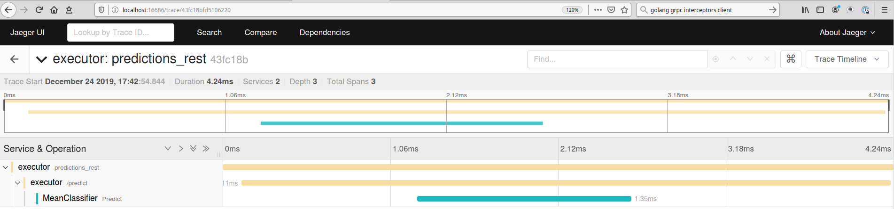
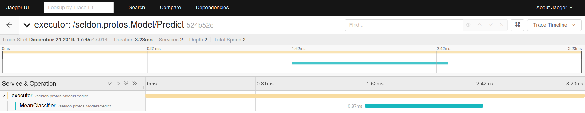

# Test Executor with Open Tracing

## REST

Run the following commands in different terminals.

Start all-in-one Jaeger.

```bash
make run_jaeger
```

Start the executor locally.
```bash
make run_rest_executor
```

Start a dummy REST model locally.
```bash
make run_dummy_rest_model
```

Send a request
```bash
make curl_rest
```

Check Jaeger UI for trace at http://localhost:16686

Example:




You can do the same for status and metadata calls

```bash
make curl_status
```

```bash
make curl_metadata
```

## gRPC

Run the following commands in different terminals.

Start all-in-one Jaeger.

```bash
make run_jaeger
```

Start the executor locally.
```bash
make run_grpc_executor
```

Start a dummy REST model locally.
```bash
make run_dummy_grpc_model
```

Send a request
```bash
make grpc_test
```

Check Jaeger UI for trace at http://localhost:16686

Example:



