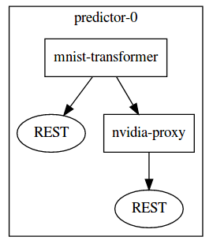

# NVIDIA Inference Server Proxy

The NVIDIA Inference Server Proxy provides a proxy to forward Seldon prediction requests to a running [NVIDIA Inference Server](https://docs.nvidia.com/deeplearning/sdk/inference-user-guide/index.html).

## Configuration

The Nvidia Proxy takes several parameters:

 | Parameter | Type | Value | Example |
 |-----------|------|-------|---------|
 | url | STRING | URL to Nvidia Inference Server endpoint | 127.0.0.1:8000 |
 | model_name | STRING | model name | tensorrt_mnist |
 | protocol | STRING | API protocol to use: HTTP or GRPC | HTTP |


An example SeldonDeployment Kubernetes resource taken from the MNIST demo is shown below to illustrate how these parameters are set. The graph consists of three containers

  1. A Seldon transformer to do feature transformations on the raw input.
  1. A NVIDIA Inference Server Model Proxy.
  1. The NVIDIA Inference Server loaded with a model.




```json
{
    "apiVersion": "machinelearning.seldon.io/v1alpha2",
    "kind": "SeldonDeployment",
    "metadata": {
        "labels": {
            "app": "seldon"
        },
        "name": "nvidia-mnist",
	"namespace": "kubeflow"
    },
    "spec": {
        "name": "caffe2-mnist",
        "predictors": [
            {
                "componentSpecs": [{
                    "spec": {
                        "containers": [
                            {
                                "image": "seldonio/mnist-caffe2-transformer:0.1",
                                "name": "mnist-transformer"
                            },
                            {
                                "image": "seldonio/nvidia-inference-server-proxy:0.1",
                                "name": "nvidia-proxy"
                            },
			    {
				"args": [
				    "--model-store=gs://seldon-inference-server-model-store"
				],
				"command": [
				    "inference_server"
				],
				"image": "nvcr.io/nvidia/inferenceserver:18.08.1-py2",
				"livenessProbe": {
				    "failureThreshold": 3,
				    "handler":{
					"httpGet": {
					    "path": "/api/health/live",
					    "port": 8000,
					    "scheme": "HTTP"
					}
				    },
				    "initialDelaySeconds": 5,
				    "periodSeconds": 5,
				    "successThreshold": 1,
				    "timeoutSeconds": 1
				},
				"name": "inference-server",
				"ports": [
				    {
					"containerPort": 8000,
					"protocol": "TCP"
				    },
				    {
					"containerPort": 8001,
					"protocol": "TCP"
				    },
				    {
					"containerPort": 8002,
					"protocol": "TCP"
				    }
				],
				"readinessProbe": {
				    "failureThreshold": 3,
				    "handler":{
					"httpGet": {
					    "path": "/api/health/ready",
					    "port": 8000,
					    "scheme": "HTTP"
					}
				    },
				    "initialDelaySeconds": 5,
				    "periodSeconds": 5,
				    "successThreshold": 1,
				    "timeoutSeconds": 1
				},
				"resources": {
				    "limits": {
					"nvidia.com/gpu": "1"
				    },
				    "requests": {
					"cpu": "100m",
					"nvidia.com/gpu": "1"
				    }
				},
				"securityContext": {
				    "runAsUser": 1000
				}
			    }
			],
			"terminationGracePeriodSeconds": 1,
			"imagePullSecrets": [
			    {
				"name": "ngc"
			    }
			]
		    }
		}],
                "graph": {
                    "name": "mnist-transformer",
                    "endpoint": { "type" : "REST" },
                    "type": "TRANSFORMER",
		    "children": [
			{
			    "name": "nvidia-proxy",
			    "endpoint": { "type" : "REST" },
			    "type": "MODEL",
			    "children": [],
			    "parameters":
			    [
				{
				    "name":"url",
				    "type":"STRING",
				    "value":"127.0.0.1:8000"
				},
				{
				    "name":"model_name",
				    "type":"STRING",
				    "value":"tensorrt_mnist"
				},
				{
				    "name":"protocol",
				    "type":"STRING",
				    "value":"HTTP"
				}
			    ]
			}
		    ]
                },
                "name": "mnist-nvidia",
                "replicas": 1
            }
        ]
    }
}
```

