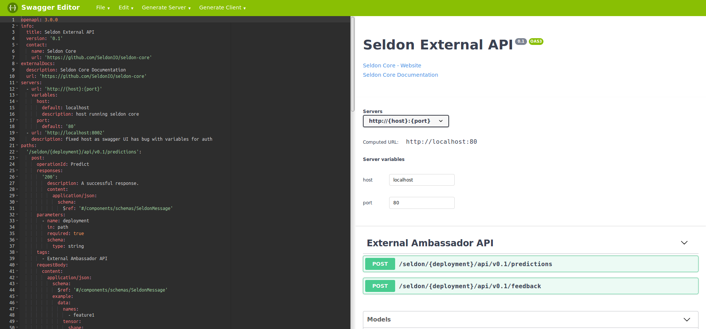

# Open API V3 for Seldon Core API

We provide initial [OpenAPI](https://www.openapis.org/) 3.0 specifications for our APIs

 * [Seldon Core External via Ambassador](https://github.com/SeldonIO/seldon-core/blob/master/openapi/engine.oas3.json) 
 * [Seldon Core Internal microservice API](https://github.com/SeldonIO/seldon-core/blob/master/openapi/wrapper.oas3.json) 

You will find the API Specs at runtime at the `/seldon.json` path of your API endpoint.

You will need to be running 0.2.4-SNAPSHOT or later for this endpoint to be active.

## Viewing/Testing via Swagger-UI

You can view the APIs using the [Swagger UI tool](https://swagger.io/tools/swagger-ui/).

You can run this via Docker with:

```bash
docker run --network host --rm  swaggerapi/swagger-editor
```

It will be reachable at http://localhost:8080/

Open one of the two API specificatons referenced above.



For using the Swagger "try it out" feature there are some caveats due to Swagger UI bugs:

 * For the [Seldon Core External via Ambassador](https://github.com/SeldonIO/seldon-core/blob/master/openapi/engine.oas3.json)
     * You will need to use a hardwired host, localhost:8002 is provided for Authorization as currently the Swagger UI can't handle variables in Authorization calls.
     * You will need to use the browser network console to get the bearer token from the returned json as this is not displayed by the Swagger UI.
 * For the [Seldon Internal API](https://github.com/SeldonIO/seldon-core/blob/master/openapi/wrapper.oas3.json)
     * in GET calls you can't edit the JSON string passed.


## Contributions and Roadmap

We welcome contributions to improving these initial API specifications.

We plan to investigate how these APIs can be customized to show the acceptable payloads for a particular machine learning inference graph running under Seldon Core. Suggestions welcome.


