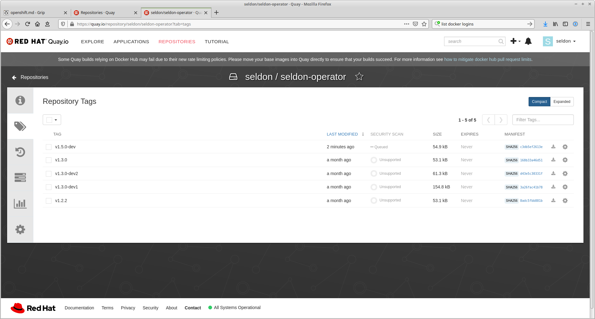

# RedHat Operator Release Steps

## Summary

*Run this in branch of released version not in master*

## Prerequisites

### Kustomize

*** You must install kustomize v3 and not v4 ***

Kustomize v4 seems to run patches differently which results in fields not being removed as seen in the patch `config/openshift/patch_manager_env.yaml` which trys to get rid of the `securitycontext` with:

```yaml
apiVersion: apps/v1
kind: Deployment
metadata:
  name: controller-manager
  namespace: system
spec:
  template:
    spec:
      securityContext:
      containers:
      - env:
        - name: MANAGER_CREATE_RESOURCES
          value: "true"
        - name: ENGINE_CONTAINER_USER
          value: ""
        - name: EXECUTOR_CONTAINER_USER
          value: ""
        name: manager

```

For kustomize v3 this works but for v4 it leaves `securityContext` as is.

### Operastor-SDK

Install [operator-sdk](https://sdk.operatorframework.io/).


```
operator-sdk version
operator-sdk version: "v1.16.0", commit: "560044140c4f3d88677e4ef2872931f5bb97f255", kubernetes version: "1.21", go version: "go1.16.13", GOOS: "linux", GOARCH: "amd64"
operator-sdk version: "v1.13.0", commit: "6e84414b468029c5c3e07352cabe64cf3a682111", kubernetes version: "1.21", go version: "go1.16.8", GOOS: "linux", GOARCH: "amd64"
```


### OPM

Install [opm](https://docs.openshift.com/container-platform/4.6/cli_reference/opm-cli.html#opm-cli). I used docker instead of podman to install.

```
opm version
Version: version.Version{OpmVersion:"1.12.3", GitCommit:"", BuildDate:"2020-09-18T09:16:12Z", GoOs:"linux", GoArch:"amd64"}
```

### Quay

Login to quay.io as seldon. Password in 1password.


## Version Update

 * Update Makefile and change PREV_VERSION.


```bash
make update_openshift
```

Updated image should be available in quay.io (https://quay.io/signin)




## Tests

Create an openshift cluster via [https://console.redhat.com/openshift/](https://console.redhat.com/openshift/). This uses a tool call [rosa](https://www.rosaworkshop.io/). For issues see [rosa github repo](https://github.com/openshift/rosa).

Run [Openshift cluster tests](./openshift/tests/README.md#openshift-cluster). Openshift >= 4.9.


## Community Operators

Will need to be run in release branch

Create a fork of https://github.com/k8s-operatorhub/community-operators

Update the Makefile locally for

```
COMMUNITY_OPERATORS_FOLDER=~/work/seldon-core/redhat/community-operators
UPSTREAM_OPERATORS_FOLDER=~/work/seldon-core/redhat/community-operators-prod
```

Create a branch for update in above fork. e.g.:

```
git checkout -b 1.14.0
```

```
make update_community
```

Add to `manifests/seldon-operator.clusterserviceversion.yaml`
```
  replaces: seldon-operator.v1.13.1
```
line with previous version of operator (see previous releases for example)

Create a PR for community operator

Follow [instructions](https://operator-framework.github.io/community-operators/). At present the test instructions fail to work.

Add new folder and changed package yaml to a PR. Ensure you sign the commit.

```
git commit -s -m "Update Seldon Community Operator to 1.12.0"
```

Push and create PR.

if you need to redo and create a new commit. As they allow only 1 commit the simplest option is to amend existing commit and force-push it with

```
git commit --amend
git push -f
```

Other option is to do the rebase and change previous commit to "FixUp" or "f" via:

```
git rebase -i HEAD~2
git push --force
```

## Upstream Operator

Will need to be run in release branch

Create a fork of https://github.com/redhat-openshift-ecosystem/community-operators-prod

Create a PR for upstream operator

Update the Makefile locally for

```
UPSTREAM_OPERATORS_FOLDER=~/work/seldon-core/redhat/community-operators-prod
```

Create a branch for update in above fork. e.g.:

```
git checkout -b 1.12.0
```

```
make update_upstream
```

Follow [instructions](https://operator-framework.github.io/community-operators/). At present the test instructions fail to work.

Add new folder and changed package yaml to a PR. Ensure you sign the commit.

```
git commit -s -m "Update Seldon Upstream Operator to 1.12.0"
```

If you need to create a new commit and push fix you will need to squash to 1 commit as shown above.

Push and create PR.

## Certified Operators

The bundle certification process is desbribed in [official RedHat docs](https://access.redhat.com/documentation/en-us/red_hat_openshift_certification/4.9/html/red_hat_openshift_software_certification_workflow_guide/index) and on [Github redhat certification releases project](https://github.com/redhat-openshift-ecosystem/certification-releases/blob/main/4.9/ga/operator-cert-workflow.md).

First create the bundle with

```
make create_certified_bundle
```

Then push all images to redhat. requires download of passwords from 1password to `~/.config/seldon/seldon-core/redhat-image-passwords.sh`

```
cd {project_base_folder}/marketplaces/redhat
python scan-images.py
```

After these are finished (approx 1.5 hours) you will need to manually publish images on https://connect.redhat.com/projects

publish

 * https://connect.redhat.com/project/5912261/view
 * https://connect.redhat.com/project/5912271/view
 * https://connect.redhat.com/project/5912311/view
 * https://connect.redhat.com/project/5912301/view
 * https://connect.redhat.com/project/1366481/view
 * https://connect.redhat.com/project/1366491/view
 * https://connect.redhat.com/project/3977851/view
 * https://connect.redhat.com/project/3986991/view
 * https://connect.redhat.com/project/3987291/view
 * https://connect.redhat.com/project/3993461/view
 * https://connect.redhat.com/project/4035711/view

Noe fork the [certified operators repo](https://github.com/redhat-openshift-ecosystem/certified-operators). Seldon's operator is in `operators/seldon-operator-certified`. Update Makefile CERTIFIED_OPERATORS_FOLDER or set when running:

```
make update_certified
```

Next run the pipelines to test, pin images and submit a PR. Youl will need to set 3 secrets as described in docs at start of section. You will also need to fork [operator pipelines](https://github.com/redhat-openshift-ecosystem/operator-pipelines) as described in these docs and update OPENSHIFT_PIPELINES_FOLDER and GIT_REPO_URL.

With an openshift cluster authenticated first run the basic pipeline after following setup steps in docs at start of section on your cluster to install Tekton pipelines:

```
make run_certified_pipeline_basic
```

There may be an issue with the Tekton pipeline w.r.t TLSVERIFY: see [here](https://github.com/tektoncd/pipeline/issues/3243) and [here](https://bugzilla.redhat.com/show_bug.cgi?id=1879680). To allow the pipeline to run succesfully you will need to switch off TLSVERIFY by modifying [the buildah setps](https://github.com/cliveseldon/operator-pipelines/commit/72b2e12620a9a2d9a5f84b3f218d65f2e936a0ff).

When successful we can rerun but also with pinning. This failed last time but does create a pinned branch in your fork which can be used for a manual PR. For example, run with:

```
make run_certified_pipeline_pinning GIT_USERNAME=<git account> GIT_EMAIL=<git email>
```

In theory we could then run final step which runs tests, pins and submits with:

```
make run_certified_pipeline_submit GIT_USERNAME=<git account> GIT_EMAIL=<git email>
```

However, this did not work last time so needed to submit a PR manually from pinned branch created in previous step to [certified operators repo](https://github.com/redhat-openshift-ecosystem/certified-operators).

Ensure you check the correct title and look for other issues as described [here](https://github.com/redhat-openshift-ecosystem/certification-releases/blob/main/4.9/ga/troubleshooting.md).

## Prepare for next release

Update base config version for next release

```
make update_config
```

As we are running on a branch from the previous release. We need to rebase master before creating a PR. This will create a lot of merge conflicts unless we switch the version to that of master first in a final commit before rebasing, e.g. from project root

```
./release 1.13.0-dev
```

Then rebase master and create a PR.
