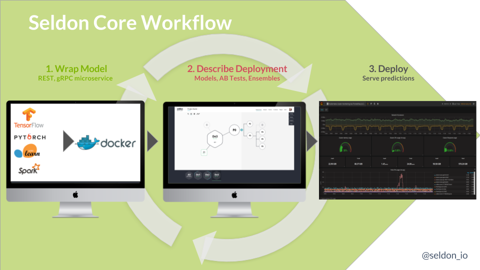

# Seldon Core

| Branch      | Status |
|-------------|-------|
| master      |  |
| release-0.1 |  |

Seldon Core is an open source platform for deploying machine learning models on Kubernetes.

- [Goals](#goals)
- [Prerequisites](#prerequisites)
- [Quick Start](#quick-start)
- [Example Components](#example-components)
- [Integrations](#integrations)
- [Install](#install)
- [Deployment guide](#deployment-guide)
- [Reference](#reference)

## Goals

Machine learning deployment has many [challenges](./docs/challenges.md). Seldon Core intends to help with these challenges. Its high level goals are:

 - Allow data scientists to create models using any machine learning toolkit or programming language. We plan to initially cover the tools/languages below:
   - Python based models including
     - Tensorflow models
     - Sklearn models
   - Spark models
   - H2O models
   - R models
 - Expose machine learning models via REST and gRPC automatically when deployed for easy integration into business apps that need predictions.
 - Allow complex runtime inference graphs to be deployed as microservices. These graphs can be composed of:
   - Models - runtime inference executable for machine learning models
   - Routers - route API requests to sub-graphs. Examples: AB Tests, Multi-Armed Bandits.
   - Combiners - combine the responses from sub-graphs. Examples: ensembles of models
   - Transformers - transform request or responses. Example: transform feature requests.
 - Handle full lifecycle management of the deployed model:
    - Updating the runtime graph with no downtime
    - Scaling
    - Monitoring
    - Security

## Prerequisites

  A [Kubernetes](https://kubernetes.io/) Cluster.  
  Kubernetes can be deployed into many environments, both in cloud and on-premise.

## Quick Start

 - Jupyter notebooks showing worked examples:
    * Minikube:
         * [Jupyter Notebook showing deployment of prebuilt model using Minikube - with RBAC](https://github.com/SeldonIO/seldon-core/blob/master/notebooks/kubectl_demo_minikube_rbac.ipynb)
         * [Jupyter notebook to create seldon-core with ksonnet and expose APIs using Ambassador on Minikube with RBAC.](https://github.com/SeldonIO/seldon-core/blob/master/notebooks/ksonnet_ambassador_minikube.ipynb)
    * GCP:
         * [Jupyter Notebook showing deployment of prebuilt model using GCP cluster](https://github.com/SeldonIO/seldon-core/blob/master/notebooks/kubectl_demo_gcp.ipynb)
         * [Jupyter notebook to create seldon-core with ksonnet and expose APIs using Ambassador on GCP.](https://github.com/SeldonIO/seldon-core/blob/master/notebooks/ksonnet_ambassador_gcp.ipynb)
    * Azure
         * [Jupyter Notebook showing deployment of prebuilt model using Azure cluster](https://github.com/SeldonIO/seldon-core/blob/master/notebooks/kubectl_demo_azure.ipynb)

## Advanced Tutorials

 * [Advanced graphs](https://github.com/cliveseldon/seldon-core/blob/master/notebooks/advanced_graphs.ipynb) showing the various types of runtime prediction graphs that can be built.

### Example Components
Seldon-core allows various types of components to be built and plugged into the runtime prediction graph. These include [models, routers, transformers and combiners](docs/reference/internal-api.md). Some example components that are available as part of the project are:

 * **Models** : example that illustrate simple machine learning models to help you build your own integrations
   * Python
      * [Tensorflow MNIST Classifier](./examples/models/deep_mnist/deep_mnist.ipynb)
      * [Keras MNIST Classifier](./examples/models/keras_mnist/keras_mnist.ipynb)
      * [Scikit-learn Iris Classifier](./examples/models/sklearn_iris/sklearn_iris.ipynb)
   * R
      * [R MNIST Classifier](./examples/models/r_mnist/r_mnist.ipynb)
      * [R Iris Classifier](./examples/models/r_iris/r_iris.ipynb)
   * Java
      * [H2O Classifier](./examples/models/h2o_mojo/h2o_model.ipynb)
   * PMML
      * [PySpark MNIST Classifier](https://github.com/SeldonIO/JPMML-utils/blob/master/examples/pyspark_pmml/mnist.ipynb)

 * **routers**
   * [Epsilon-greedy multi-armed bandits for real time optimization of models](https://github.com/SeldonIO/seldon-core/blob/master/notebooks/epsilon_greedy_gcp.ipynb)
 * **transformers**
    * [Mahalanobis distance outlier detection](https://github.com/SeldonIO/seldon-core/blob/master/examples/transformers/outlier_mahalanobis/outlier_documentation.ipynb). Example usage can be found in the [Advanced graphs notebook](https://github.com/cliveseldon/seldon-core/blob/master/notebooks/advanced_graphs.ipynb)

## Integrations

 * [kubeflow](https://github.com/kubeflow/kubeflow)
    * Seldon-core can be installed as part of the kubeflow project. A detailed [end-to-end example](https://github.com/kubeflow/example-seldon) provides a complete workflow for training various models and deploying them using seldon-core.
 * [IBM's Fabric for Deep Learning](https://github.com/IBM/FfDL)
    * Seldon-core can be used to [serve deep learning models trained using FfDL](https://github.com/IBM/FfDL/blob/master/community/FfDL-Seldon/README.md).
       * [Train and deploy a Tensorflow MNIST classififer using FfDL and Seldon.](https://github.com/IBM/FfDL/blob/master/community/FfDL-Seldon/tf-model/README.md)
       * [Train and deploy a PyTorch MNIST classififer using FfDL and Seldon.](https://github.com/IBM/FfDL/blob/master/community/FfDL-Seldon/pytorch-model/README.md)
	

## Install

Follow the [install guide](docs/install.md) for details on ways to install seldon onto your Kubernetes cluster.

## Deployment Guide

Three steps:

 1. [Wrap your runtime prediction model](./docs/wrappers/readme.md).
    * We provide easy to use wrappers for [python](./docs/wrappers/python.md), [R](./docs/wrappers/r.md) and [Java](./docs/wrappers/java.md)
 1. [Define your runtime inference graph in a seldon deployment custom resource](./docs/crd/readme.md).
 1. [Deploy the graph](./docs/deploying.md).

## Reference

 - [Prediction API](./docs/reference/prediction.md)
 - [Seldon Deployment Custom Resource](./docs/reference/seldon-deployment.md)

## Articles/Blogs/Videos

 - [Kubecon Europe 2018 - Serving Machine Learning Models at Scale with Kubeflow and Seldon](https://www.youtube.com/watch?v=pDlapGtecbY)
 - [Openshift Commons ML SIG - Openshift S2I Helping ML Deployment with Seldon-Core](https://www.youtube.com/watch?v=1uZPBcfYxlM)
 - [Overview of Openshift source-to-image use in Seldon-Core](./docs/articles/openshift_s2i.md)
 - [IBM Framework for Deep Learning and Seldon-Core](https://developer.ibm.com/code/2018/06/12/serve-it-hot-deploy-your-ffdl-trained-models-using-seldon/)
 
## Testing

 - [Benchmarking seldon-core](docs/benchmarking.md)

## Community

 * [Slack Channel](https://join.slack.com/t/seldondev/shared_invite/enQtMzA2Mzk1Mzg0NjczLWQzMGFkNmRjN2UxZmFmMWJmNWIzMTM5Y2UxNGY1ODE5ZmI2NDdkMmNiMmUxYjZhZGYxOTllMDQwM2NkNDQ1MGI)

## Developer

 - [CHANGELOG](CHANGELOG.md)
 - [Developer Guide](./docs/developer/readme.md)
