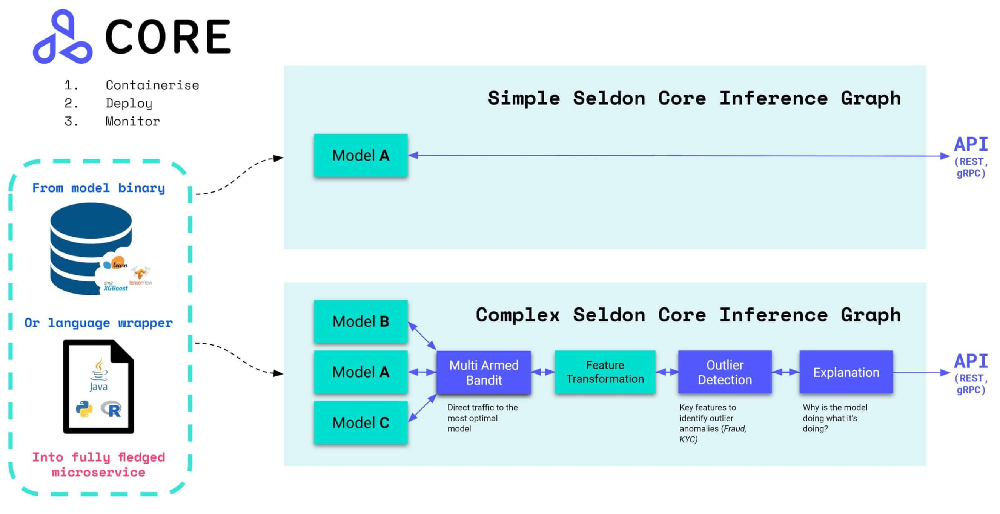

# Seldon Core: Blazing Fast, Industry-Ready ML
An open source platform to deploy your machine learning models on Kubernetes at massive scale.


# Overview

Seldon core converts your ML models (Tensorflow, Pytorch, H2o, etc.) or language wrappers (Python, Java, etc.) into production REST/GRPC microservices.

Seldon handles scaling to thousands of production machine learning models and provides advanced machine learning capabilities out of the box including Advanced Metrics, Request Logging, Explainers, Outlier Detectors, A/B Tests, Canaries and more.

* Read the [Seldon Core Documentation](https://docs.seldon.io/projects/seldon-core/en/latest/)
* Join our [community Slack](https://join.slack.com/t/seldondev/shared_invite/enQtMzA2Mzk1Mzg0NjczLTJlNjQ1NTE5Y2MzMWIwMGUzYjNmZGFjZjUxODU5Y2EyMDY0M2U3ZmRiYTBkOTRjMzZhZjA4NjJkNDkxZTA2YmU) to ask any questions
* Get started with [Seldon Core Notebook Examples](https://docs.seldon.io/projects/seldon-core/en/latest/examples/notebooks.html)
* Join our fortnightly [online community calls]()
* Learn how you can [start contributing](https://docs.seldon.io/projects/seldon-core/en/latest/developer/contributing.html)
* Check out [Blogs](https://docs.seldon.io/projects/seldon-core/en/latest/tutorials/blogs.html) that dive into Seldon Core components
* Watch some of the [Videos and Talks](https://docs.seldon.io/projects/seldon-core/en/latest/tutorials/videos.html) using Seldon Core
 


## Details

With over 2M installs, Seldon Core is used across organisations to manage large scale deployment of machine learning models, and key benefits include:

 * Cloud agnostic and tested on AWS EKS, Azure AKS, Google GKE, Alicloud, Digital Ocean and Openshift.
 * Easy way to containerise ML models using our language wrappers or pre-packaged inference servers.
 * Powerful and rich inference graphs made out of predictors, transformers, routers, combiners, and more.
 * A standardised serving layer across models from heterogeneous toolkits and languages.
 * Advanced and customisable metrics with integration to Prometheus and Grafana.
 * Full auditability through model input-output request logging integration with Elasticsearch.
 * Microservice tracing through integration to Jaeger for insights on latency across microservice hops.

# Getting Started

Below is a very high level overview that describes a simplified workflow that summarises the base steps to get you up and running with Seldon Core and deploy your first model.

You can dive into the full deep dive of the [Seldon Core Workflow](https://docs.seldon.io/projects/seldon-core/en/latest/workflow/index.html).

## 1. Install Seldon Core in your Cluster

**Install using Helm 3:**

```
kubectl create namespace seldon-system

helm install seldon-core seldon-core-operator \
    --repo https://storage.googleapis.com/seldon-charts \
    --set usageMetrics.enabled=true \
    --namespace seldon-system \
    --set istio.enabled=true
    # You can set ambassador instead with --set ambassador.enabled=true
```

For a more advanced guide that shows you how to install Seldon Core with many different options and parameters you can dive further in our [detailed installation guide](https://docs.seldon.io/projects/seldon-core/en/latest/workflow/install.html).

## Productionise your first Model with Seldon Core

There are two main ways you can productionise using Seldon Core: 
* Wrap your model with our pre-packaged inference servers
* Wrap your model with our language wrappers

Below is a very high level walkthrough of what it looks like when using one of those approaches, but for more information you can have a look at the [Workflow Deep Dive section of our documentation](https://docs.seldon.io/projects/seldon-core/en/latest/workflow/index.html).

### Wrap your model with our pre-packaged inference servers

You can use our pre-packaged inference servers which are optimized for popular machine learning frameworks and languages, and allow for simplified workflows that can be scaled across large number of usecases.

A typical workflow would normally be programmatic (triggered through CI/CD), however below we show the commands you would normally carry out.

**1. Export your model binaries / artifacts**

Export your model binaries using the instructions provided in the requirements outlined in the respective [pre-packaged model server](https://docs.seldon.io/projects/seldon-core/en/latest/servers/overview.html) you are planning to use.

```python
>>my_sklearn_model.train(...)
>>pickle.dumps(my_sklearn_model, "model.pickle")

[Created file at /mypath/model.pickle]
```

**2. Upload your model to an object store**

You can upload your models into any of the object stores supported by our pre-package model server file downloader, or alternatively add your custom file downloader.

For simplicity we have already uploaded it to the bucket so you can just proceed to the next step and run your model on Seldon Core.

```console
$ gsutil cp model.pickle gs://seldon-models/sklearn/iris/model.pickle

[ Saved into gs://seldon-models/sklearn/iris/model.pickle ]
```

**3. Deploy to Seldon Core in Kubernetes**

Finally you can just deploy your model by loading the binaries/artifacts using the pre-packaged model server of your choice. You can build [complex inference graphs]() that use multiple components for inference.

```yaml
$ kubectl apply -f - << END
apiVersion: machinelearning.seldon.io/v1
kind: SeldonDeployment
metadata:
  name: iris-model
  namespace: model-namespace
spec:
  name: iris
  predictors:
  - graph:
      implementation: SKLEARN_SERVER
      modelUri: gs://seldon-models/sklearn/iris
      name: classifier
    name: default
    replicas: 1
END
```

**4. Send a request in Kubernetes cluster**

Once you deploy your model you can access it through the Kubernetes ingress you exposed, or by port forwarding the service:

```console
$ curl -X POST http://<ingress>/seldon/model-namespace/iris-model/api/v1.0/predictions \
    -H 'Content-Type: application/json' \
    -d '{ "data": { "ndarray": [1,2,3,4] } }' | json_pp

{
   "meta" : {},
   "data" : {
      "names" : [
         "t:0",
         "t:1",
         "t:2"
      ],
      "ndarray" : [
         [
            0.000698519453116284,
            0.00366803903943576,
            0.995633441507448
         ]
      ]
   }
}
```

### Wrap your model with our language wrappers

1. Export your model binaries and/or artifacts:

```python
>> my_sklearn_model.train(...)
>> pickle.dumps(my_sklearn_model, "model.pickle")

[Created file at /mypath/model.pickle]
```

2. Create a wrapper class `Model.py`
```python
class Model:
    def __init__(self):
        self._model = pickle.loads("model.pickle")

    def predict(self, X):
        output = self._model(X)
        return output
```

3. Use the Seldon tools to containerise your model

```console
s2i build . seldonio/seldon-core-s2i-python3:0.18 sklearn_iris:0.1 
```

4. Test model locally

```console
$ docker run -p 8000:8000 --rm step_one:0.1 

Listening on port 8080...

$ curl -X POST localhost:8080/api/v1.0/predictions \
    -H 'Content-Type: application/json' \
    -d '{ "data": { "ndarray": [1,2,3,4] } }' | json_pp

{
   "meta" : {},
   "data" : {
      "names" : [
         "t:0",
         "t:1",
         "t:2"
      ],
      "ndarray" : [
         [
            0.000698519453116284,
            0.00366803903943576,
            0.995633441507448
         ]
      ]
   }
}
```

4. Deploy to Kubernetes

```yaml
$ kubectl apply -f - << END
apiVersion: machinelearning.seldon.io/v1
kind: SeldonDeployment
metadata:
  name: iris-model
  namespace: model-namespace
spec:
  name: iris
  predictors:
  - componentSpecs:
    - spec:
      containers:
      - name: classifier
        image: sklearn_iris:0.1
  - graph:
      name: classifier
    name: default
    replicas: 1
END
```

5. Send a request in Kubernetes cluster

```console
$ curl -X POST http://<ingress>/seldon/model-namespace/iris-model/api/v1.0/predictions \
    -H 'Content-Type: application/json' \
    -d '{ "data": { "ndarray": [1,2,3,4] } }' | json_pp

{
   "meta" : {},
   "data" : {
      "names" : [
         "t:0",
         "t:1",
         "t:2"
      ],
      "ndarray" : [
         [
            0.000698519453116284,
            0.00366803903943576,
            0.995633441507448
         ]
      ]
   }
}
```


## Containerise and deploy your model

The easiest way to get started is by following any of our existing examples - listed below on increasing complexity:

### Prepacked Model Servers

 * [Deploy a SciKit-learn Pickle/Binary](../servers/sklearn.html) 
 * [Deploy an XGBoost model](../servers/xgboost.html) 
 * [Deploy a Tensorflow exported model](../servers/tensorflow.html)
 * [Deploy an MLFlow Exported model](https://docs.seldon.io/projects/seldon-core/en/latest/examples/server_examples.html#Serve-MLflow-Elasticnet-Wines-Model)
 
### Recommended starter tutorials for custom inference code

* [Tensorflow Deep MNIST Tutorial](https://docs.seldon.io/projects/seldon-core/en/latest/examples/deep_mnist.html) (Try it also in [AWS](https://docs.seldon.io/projects/seldon-core/en/latest/examples/aws_eks_deep_mnist.html), [Azure](https://docs.seldon.io/projects/seldon-core/en/latest/examples/azure_aks_deep_mnist.html) and [GKE with GPU](https://github.com/SeldonIO/seldon-core/tree/master/examples/models/gpu_tensorflow_deep_mnist))
* [SKlearn SpaCy Reddit Text Classification Tutorial](https://docs.seldon.io/projects/seldon-core/en/latest/examples/sklearn_spacy_text_classifier_example.html)
* Deploy your R models with the [MNIST example](https://docs.seldon.io/projects/seldon-core/en/latest/examples/r_mnist.html) and the [Iris example](https://docs.seldon.io/projects/seldon-core/en/latest/examples/r_iris.html)
* [Deploy your Java models with the H2O example](https://docs.seldon.io/projects/seldon-core/en/latest/examples/h2o_mojo.html)

### More complex deployments

* [Example Seldon Core Deployments using Helm](https://docs.seldon.io/projects/seldon-core/en/latest/examples/helm_examples.html)
* [Canary deployment with Seldon and Istio](https://docs.seldon.io/projects/seldon-core/en/latest/examples/istio_canary.html)
* [Autoscaling Seldon Example](https://docs.seldon.io/projects/seldon-core/en/latest/examples/autoscaling_example.html)
* [Seldon Model with Custom Metrics](https://docs.seldon.io/projects/seldon-core/en/latest/examples/tmpl_model_with_metrics.html)

### End-to-end / use-case tutorials

* [End-to-end Reusable ML Pipeline with Seldon and Kubeflow](https://docs.seldon.io/projects/seldon-core/en/latest/examples/kubeflow_seldon_e2e_pipeline.html)
* [Seldon Deployment of Income Classifier and Alibi Anchor Explainer](https://docs.seldon.io/projects/seldon-core/en/latest/examples/alibi_anchor_tabular.html)

### Integration with other platforms

* [Sagemaker (Seldon SKLearn integration example)](https://docs.seldon.io/projects/seldon-core/en/latest/examples/sagemaker_sklearn.html)
* [Tensorflow Serving (TFServing) integration example](https://docs.seldon.io/projects/seldon-core/en/latest/examples/tfserving_mnist.html)
* [MLFlow integration example](https://docs.seldon.io/projects/seldon-core/en/latest/examples/mlflow.html)

# About the name

The name Seldon (ˈSɛldən) Core was inspired from [the Foundation Series (Scifi Novel)](https://en.wikipedia.org/wiki/Foundation_series) and it's premise of fictitious mathematician Hari Seldon spends his life developing a theory of Psychohistory, a new and effective mathematical sociology which allows for the future to be predicted extremely accurate through long periods of time (across hundreds of thousands of years).

