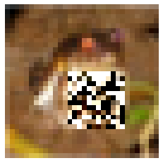

## CIFAR10 Image Classification Production Deployment


We show an image classifier (CIFAR10) with associated outlier and drift detectors using a Pipeline.

 * The model is a tensorflow [CIFAR10](https://www.cs.toronto.edu/~kriz/cifar.html) image classfier 
 * The outlier detector is created from the [CIFAR10 VAE Outlier example](https://docs.seldon.io/projects/alibi-detect/en/stable/examples/od_vae_cifar10.html).
 * The drift detector is created from the [CIFAR10 KS Drift example](https://docs.seldon.io/projects/alibi-detect/en/stable/examples/cd_ks_cifar10.html)
 
### Model Training (optional for notebook)

Here we describe how we created the artifacts. This is not needed to run this notebook but will help you to apply these techniques to your own models.

#### Outlier Detection Model

Follow the Alibi-Detect outlier detector example [CIFAR10 VAE Outlier example](https://docs.seldon.io/projects/alibi-detect/en/stable/examples/od_vae_cifar10.html).

Use the `save_detector` command to save the trained outlier detector as shown in the notebook.

Create a MLServer model settings file: `model-settings.json`:

```json
{
  "name": "cifar10-outlier-detect",
  "implementation": "mlserver_alibi_detect.AlibiDetectRuntime",
  "parameters": {
    "uri": "./",
    "version": "v0.1.0"
  }
}

```

Save to local or remote storage the directory. Here we saved to Google Storage:

```bash
gsutil ls -R gs://seldon-models/mlserver/alibi-detect/cifar10-outlier 

gs://seldon-models/mlserver/alibi-detect/cifar10-outlier/:
gs://seldon-models/mlserver/alibi-detect/cifar10-outlier/
gs://seldon-models/mlserver/alibi-detect/cifar10-outlier/OutlierVAE.dill
gs://seldon-models/mlserver/alibi-detect/cifar10-outlier/meta.dill
gs://seldon-models/mlserver/alibi-detect/cifar10-outlier/model-settings.json
gs://seldon-models/mlserver/alibi-detect/cifar10-outlier/model/:
gs://seldon-models/mlserver/alibi-detect/cifar10-outlier/model/checkpoint
gs://seldon-models/mlserver/alibi-detect/cifar10-outlier/model/decoder_net.h5
gs://seldon-models/mlserver/alibi-detect/cifar10-outlier/model/encoder_net.h5
gs://seldon-models/mlserver/alibi-detect/cifar10-outlier/model/vae.ckpt.data-00000-of-00001
gs://seldon-models/mlserver/alibi-detect/cifar10-outlier/model/vae.ckpt.index

```
 
 ### Drift Detector
 
Follow the Alibi-Detect drift detection example [CIFAR10 KS Drift example](https://docs.seldon.io/projects/alibi-detect/en/stable/examples/cd_ks_cifar10.html).

Use the `save_detector` command to save the trained outlier detector as shown in the notebook.

Create a MLServer model settings file: `model-settings.json`:

```json
{
  "name": "cifar10-drift",
  "implementation": "mlserver_alibi_detect.AlibiDetectRuntime",
  "parameters": {
    "uri": "./",
    "version": "v0.1.0"
  }
}
```

Save to local or remote storage the directory. Here we saved to Google Storage:

```bash
gsutil ls -R gs://seldon-models/mlserver/alibi-detect/cifar10-drift 

gs://seldon-models/mlserver/alibi-detect/cifar10-drift/:
gs://seldon-models/mlserver/alibi-detect/cifar10-drift/
gs://seldon-models/mlserver/alibi-detect/cifar10-drift/KSDrift.dill
gs://seldon-models/mlserver/alibi-detect/cifar10-drift/meta.dill
gs://seldon-models/mlserver/alibi-detect/cifar10-drift/model-settings.json
gs://seldon-models/mlserver/alibi-detect/cifar10-drift/model/:
gs://seldon-models/mlserver/alibi-detect/cifar10-drift/model/encoder.h5

```
 
 


```python
import requests
import json
from typing import Dict, List
import numpy as np
import os
import tensorflow as tf
from alibi_detect.utils.perturbation import apply_mask
from alibi_detect.datasets import fetch_cifar10c
import matplotlib.pyplot as plt
tf.keras.backend.clear_session()
```

    2022-06-24 09:13:02.143420: W tensorflow/stream_executor/platform/default/dso_loader.cc:64] Could not load dynamic library 'libcudart.so.11.0'; dlerror: libcudart.so.11.0: cannot open shared object file: No such file or directory
    2022-06-24 09:13:02.143442: I tensorflow/stream_executor/cuda/cudart_stub.cc:29] Ignore above cudart dlerror if you do not have a GPU set up on your machine.
```
````

```python
train, test = tf.keras.datasets.cifar10.load_data()
X_train, y_train = train
X_test, y_test = test

X_train = X_train.astype('float32') / 255
X_test = X_test.astype('float32') / 255
print(X_train.shape, y_train.shape, X_test.shape, y_test.shape)
classes = (
    "plane",
    "car",
    "bird",
    "cat",
    "deer",
    "dog",
    "frog",
    "horse",
    "ship",
    "truck",
)

```

    (50000, 32, 32, 3) (50000, 1) (10000, 32, 32, 3) (10000, 1)
```
````

```python
outliers = []
for idx in range(0,X_train.shape[0]):
    X_mask, mask = apply_mask(X_train[idx].reshape(1, 32, 32, 3),
                                  mask_size=(12,12),
                                  n_masks=1,
                                  channels=[0,1,2],
                                  mask_type='normal',
                                  noise_distr=(0,1),
                                  clip_rng=(0,1))
    outliers.append(X_mask)
X_outliers = np.vstack(outliers)
X_outliers.shape
```


    (50000, 32, 32, 3)
```
````


```python
corruption = ['gaussian_noise']
X_corr, y_corr = fetch_cifar10c(corruption=corruption, severity=5, return_X_y=True)
X_corr = X_corr.astype('float32') / 255
```


```python
reqJson = json.loads('{"inputs":[{"name":"input_1","data":[],"datatype":"FP32","shape":[]}]}')
url = "http://0.0.0.0:9000/v2/models/model/infer"
```


```python
def infer(resourceName: str, batchSz: int, requestType: str):
    if requestType == "outlier":
        rows = X_outliers[0:0+batchSz]
    elif requestType == "drift":
        rows = X_corr[0:0+batchSz]
    else:
        rows = X_train[0:0+batchSz]
    for i in range(batchSz):
        show(rows[i])
    reqJson["inputs"][0]["data"] = rows.flatten().tolist()
    reqJson["inputs"][0]["shape"] = [batchSz, 32, 32, 3]
    headers = {"Content-Type": "application/json", "seldon-model":resourceName}
    response_raw = requests.post(url, json=reqJson, headers=headers)
    print(response_raw)
    print(response_raw.json())
    
```
````def show(X):
    plt.imshow(X.reshape(32, 32, 3))
    plt.axis("off")
    plt.show()
```
```````

### Pipeline


```bash
cat ../../models/cifar10.yaml
echo "---"
cat ../../models/cifar10-outlier-detect.yaml
echo "---"
cat ../../models/cifar10-drift-detect.yaml
```
````{collapse} Expand to see output
```yaml
    apiVersion: mlops.seldon.io/v1alpha1
    kind: Model
    metadata:
      name: cifar10
      namespace: seldon-mesh
    spec:
      storageUri: "gs://seldon-models/triton/tf_cifar10"
      requirements:
      - tensorflow
    ---
    apiVersion: mlops.seldon.io/v1alpha1
    kind: Model
    metadata:
      name: cifar10-outlier
      namespace: seldon-mesh
    spec:
      storageUri: "gs://seldon-models/mlserver/alibi-detect/cifar10-outlier"
      requirements:
        - mlserver
        - alibi-detect
    ---
    apiVersion: mlops.seldon.io/v1alpha1
    kind: Model
    metadata:
      name: cifar10-drift
      namespace: seldon-mesh
    spec:
      storageUri: "gs://seldon-models/mlserver/alibi-detect/cifar10-drift"
      requirements:
        - mlserver
        - alibi-detect
```
````

```bash
seldon model load -f ../../models/cifar10.yaml
seldon model load -f ../../models/cifar10-outlier-detect.yaml
seldon model load -f ../../models/cifar10-drift-detect.yaml
```
````{collapse} Expand to see output
```json

    {}
    {}
    {}
```
````

```bash
seldon model status cifar10 -w ModelAvailable | jq .
seldon model status cifar10-outlier -w ModelAvailable | jq .
seldon model status cifar10-drift -w ModelAvailable | jq .
```
````{collapse} Expand to see output
```json

    {}
    {}
    {}
```
````

```bash
cat ../../pipelines/cifar10.yaml
```
````{collapse} Expand to see output
```yaml
    apiVersion: mlops.seldon.io/v1alpha1
    kind: Pipeline
    metadata:
      name: cifar10-production
      namespace: seldon-mesh
    spec:
      steps:
        - name: cifar10
        - name: cifar10-outlier
        - name: cifar10-drift
          batch:
            size: 20
      output:
        steps:
        - cifar10
        - cifar10-outlier.outputs.is_outlier
```
````

```bash
seldon pipeline load -f ../../pipelines/cifar10.yaml
```
````{collapse} Expand to see output
```json

    {}
```
````

```bash
seldon pipeline status cifar10-production -w PipelineReady| jq -M .
```
````{collapse} Expand to see output
```json

    {
      "pipelineName": "cifar10-production",
      "versions": [
        {
          "pipeline": {
            "name": "cifar10-production",
            "uid": "caqonpp64e2ahltbcce0",
            "version": 1,
            "steps": [
              {
                "name": "cifar10"
              },
              {
                "name": "cifar10-drift",
                "batch": {
                  "size": 20
                }
              },
              {
                "name": "cifar10-outlier"
              }
            ],
            "output": {
              "steps": [
                "cifar10.outputs",
                "cifar10-outlier.outputs.is_outlier"
              ]
            },
            "kubernetesMeta": {
              "namespace": "seldon-mesh"
            }
          },
          "state": {
            "pipelineVersion": 1,
            "status": "PipelineReady",
            "reason": "Created pipeline",
            "lastChangeTimestamp": "2022-06-24T10:03:19.836347885Z"
          }
        }
      ]
    }
```
````

```python
infer("cifar10-production.pipeline",20, "normal")
```


    

    
```
````

    

    
```
````

    

    
```
````

    

    
```
````

    

    
```
````

    

    
```
````

    

    
```
````

    

    
```
````

    

    
```
````

    

    
```
````

    

    
```
````

    

    
```
````

    

    
```
````

    

    
```
````

    

    
```
````

    

    
```
````

    

    
```
````

    

    
```
````

    

    
```
````

    

    
```
````
    <Response [200]>
    {'model_name': '', 'outputs': [{'data': None, 'name': 'fc10', 'shape': [20, 10], 'datatype': 'FP32'}, {'data': [0, 0, 0, 0, 0, 0, 0, 0, 0, 0, 0, 0, 0, 0, 0, 0, 0, 0, 0, 0], 'name': 'is_outlier', 'shape': [1, 20], 'datatype': 'INT64'}], 'rawOutputContents': ['CRx5MvEmrDCaAC80yx7sPdQqOzRRjs82t3tiP5Wy0DE1up8zppSiMUO3qTWauacxz0PQMM3dETKvihcwIqqfMP6uHjC/1Jo0wjAhOprXfz/ehGM/t/8pNrr5BznIr9c9k7XLN1+C1DYyJNU6s7Y9N1YmrjpFGjg7YuIMNuMSHjOy7q06mJe2NwiYfz+lcCA5JBzpNsDAXjcau4E4Q+22NIb9Ozcm/n8/ODFWNFMRljN5ZQ8zp+1hM/jzojRu2zsz7ewONcIhhTc1DSs6NEVaPD2vxjWSBHo/LRNROFk+GDpSuAk8D0WvNqBDdTn1XvM4AujfNRi1HjAgYH8/Y2KHOOVyGzseLt8zyFXRM8SGGzQEN2s1CKzUMojJrDHrxZYuI97SLBlGBzAu9x00HYI7NlCEbTHQ/38/elUjMN+yzy5CjS84a4hYM6pyrDPVIgI0/QPpMWy+WDJrEkwyUtTfMDz9fz8X8wwzPeS2PeUFFzQQv9w0JbNoP8nNbzWg9sw67mwROSeOGDdd4wI1XBjsNPHDKDnyab80WcGbPeiKZD/4Xpo6ggsuO1u73jzekIw25ghfNyor+TUUgLM18CTcM82jFDLQl5U2prl1N/09qTV8tzMyGPl/P1q+rjhhbdE0aR+JOGNfATOrDtwzG6j8Nfr7ATpdNBQ4OxqTNDTYfz/IaaI2/DRtNhenEDrcoqk0+L9/P/szpTmq3Vg1fanbNdibOzYtGc02aOLNOIi7izTZLe85Wt+zNi1j8DcIW/M4Ck+QOA5kFDcYTTs4IysVOCAa1zu4H34/7zzvO2cn7TVM26M01GrcPJXQuDU5Y5A501q7NpyDfjZfQcs54xF3P+V8OT4u5+03MPRQOfLZ+zv9wRk50RclOKA2eThDY5o4Q6NMP/Z+ODzXCtMtXQZcJsYN0yYAAIA/5gveKIuWAS+Ucloq6sqYJ+hGriZ7RlEnPQCEMrV4qzCmmRE0zv9/PwidPS5i7PEyvmEkNlZJEC9Lcsw0MD6+LWQjATon8+g21CntNzPjbD9KZB83HXK9OcrqlD2wxQk0IxCJOtoVmTQ=']}
```
````

```bash
seldon pipeline inspect cifar10-production.cifar10-drift.outputs.is_drift
```
````{collapse} Expand to see output
```json

    ---
    seldon.default.model.cifar10-drift.outputs
    {"name":"is_drift","datatype":"INT64","shape":["1"],"contents":{"int64Contents":["0"]}}
```
````

```python
infer("cifar10-production.pipeline",20, "drift")
```


    

    
```
````

    

    
```
````

    

    
```
````

    

    
```
````

    

    
```
````

    

    
```
````

    

    
```
````

    

    
```
````

    

    
```
````

    

    
```
````

    

    
```
````

    

    
```
````

    

    
```
````

    

    
```
````

    

    
```
````

    

    
```
````

    

    
```
````

    

    
```
````

    

    
```
````

    

    
```
````
    <Response [200]>
    {'model_name': '', 'outputs': [{'data': None, 'name': 'fc10', 'shape': [20, 10], 'datatype': 'FP32'}, {'data': [1, 0, 0, 0, 0, 0, 0, 0, 0, 0, 0, 1, 0, 0, 0, 1, 0, 0, 0, 0], 'name': 'is_outlier', 'shape': [1, 20], 'datatype': 'INT64'}], 'rawOutputContents': ['1M3eMCFl3C/cUvA5KrBuP0Xg3jSP4Aw3uomJPdTueDAoMCEx6rwLL1u1rjrZcAs3o6htP2N/oTuhl+E7Bna8OQHG6TkQE0M3aDdsPel6jjZcLc82+rKNNiFiFTwwvR8/QKsUOLlYODm+MlU3OaxsNae7uz6jhyU1KYA0OBO6lTVRu3g/9GBsO5PPmTkLHu04hFAcOiNWgzddU8I8NA+CNfQAuTWWldAzJoHiPTiaYz97L0o40eYbOOw5fjnaVaA0r5sDNdkSgTKvbiA1Nj89NAlBjD6Eyzk/zY58OKIy7zh2MQA5XmvDNRQ5xzbrWwszxF3mMtLKqzLDAA855NtpP+kFgjS35as0EdmwPTeukzHv0KwxHQRCMdHlLzq9Myk4nyVaPzNBwT3kurA8dVkkOz/sGjuYRFE5eNnVPD8GKDhJm6E1lGNmM1QEZz6OIUQ/jwACOSgviTjYMgQ8PFLtNGmaFzW1J1Ez5h0qOCMUrTUKsw4+uldwPrzqgzwsjMY7qngaP6BNHDdvxqI518oDNwC6TjiV+481gd0hPqLJVj9lhoA6/agLOquEZzqryY42s27yOcapUjVeQAU4rgqzNbNP7T4k/jU8G5sAP8MnEzgdNLc8aoLcN2C6AzpLa4o44mihM05zZzMzXsw+x8cZP+MNWji1Hqo2MG6oOECFCzXUcJg1xYinMiSTFjO6AOUyGRrtOphZfz/laB04/GOWNWyFNDoo3Fc1tOUFNoxKwTLXVAwzhIKxMEsTfj/fCU47AASFO9vbMjH7JJ05bue1M5yKCTfJgOg2qiNTNtTeKjSMKYw84bJ6P8i2iDmiPB82ti5aOxpIsTQqZBs2f0pPM8uRBDDE5hkvuybWObuSfz9eB540YaZ2MpX4pDqQVNwwP0SRMCIBdzCWQbozMULkMe4+Qj97xXY+MZ4oOfsgmDT8CKM4k93RMxSuJTWmjgozSbhpNtpdNzWbgkE/9U14PoktHTrRefs4d9U7OpWQ2jXOYjY5EzY6NGhkITZ5CBI02cI5PwxYjD466Fc3XOG7N367STnPDno0JncBOIF46DE=']}
```
````

```bash
seldon pipeline inspect cifar10-production.cifar10-drift.outputs.is_drift
```
````{collapse} Expand to see output
```json

    ---
    seldon.default.model.cifar10-drift.outputs
    {"name":"is_drift","datatype":"INT64","shape":["1"],"contents":{"int64Contents":["1"]}}
```
````

```python
infer("cifar10-production.pipeline",1, "outlier")
```


    

    
```
````
    <Response [200]>
    {'model_name': '', 'outputs': [{'data': None, 'name': 'fc10', 'shape': [1, 10], 'datatype': 'FP32'}, {'data': [1], 'name': 'is_outlier', 'shape': [1, 1], 'datatype': 'INT64'}], 'rawOutputContents': ['QiBWN0rRszUjms41yi+6PTzNBzYMkLA3/7ZoP45q0zUMqTg2ccNXNg==']}
```
````

```python
infer("cifar10-production.pipeline",1, "ok")
```


    

    
```
````
    <Response [200]>
    {'model_name': '', 'outputs': [{'data': None, 'name': 'fc10', 'shape': [1, 10], 'datatype': 'FP32'}, {'data': [0], 'name': 'is_outlier', 'shape': [1, 1], 'datatype': 'INT64'}], 'rawOutputContents': ['JRx5MgYnrDCDAC802B7sPd4qOzQ1js82tXtiP3my0DFHup8zpZSiMQ==']}
```
````

```bash
seldon pipeline inspect cifar10-production.cifar10.outputs
```
````{collapse} Expand to see output
```json

    ---
    seldon.default.model.cifar10.outputs
    {"modelName":"cifar10_1","modelVersion":"1","outputs":[{"name":"fc10","datatype":"FP32","shape":["1","10"],"contents":{"fp32Contents":[1.4500107e-8,1.2525738e-9,1.6298331e-7,0.115293205,1.7431327e-7,0.000006185636,0.8847001,6.0738867e-9,7.437898e-8,4.7317195e-9]}}],"rawOutputContents":["JRx5MgYnrDCDAC802B7sPd4qOzQ1js82tXtiP3my0DFHup8zpZSiMQ=="]}
```
````

```bash
seldon pipeline unload cifar10-production
```
````{collapse} Expand to see output
```json

    {}
```
````

```bash
seldon model unload cifar10
seldon model unload cifar10-outlier
seldon model unload cifar10-drift
```
````{collapse} Expand to see output
```json

    {}
    {}
    {}
```
````

```python

```
