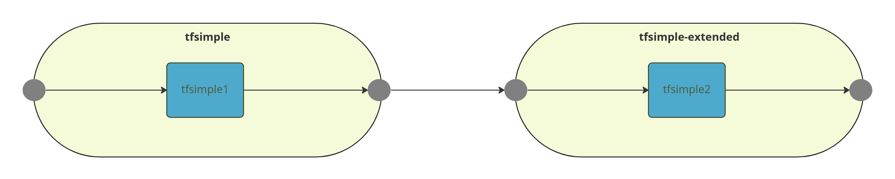
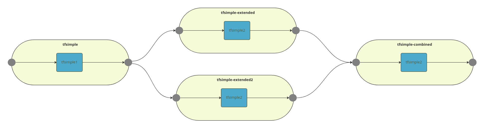
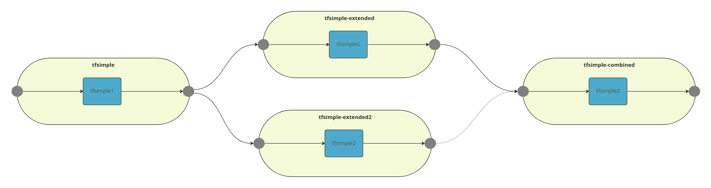
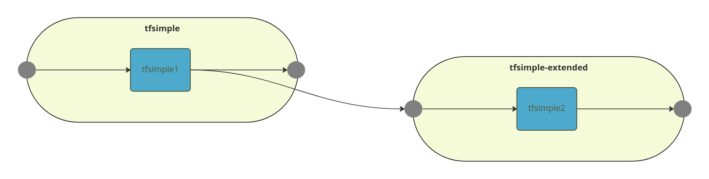
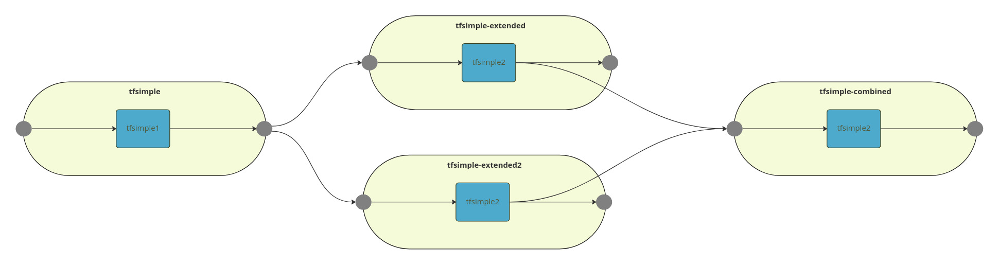

## Seldon V2 Pipeline to Pipeline Examples

This notebook illustrates a series of Pipelines that are joined together.

### Models Used

 * `gs://seldon-models/triton/simple` an example Triton tensorflow model that takes 2 inputs INPUT0 and INPUT1 and adds them to produce OUTPUT0 and also subtracts INPUT1 from INPUT0 to produce OUTPUT1. See [here](https://github.com/triton-inference-server/server/tree/main/docs/examples/model_repository/simple) for the original source code and license.
 * Other models can be found at https://github.com/SeldonIO/triton-python-examples

### Pipeline pulling from one other Pipeline



```bash
cat ./models/tfsimple1.yaml
cat ./models/tfsimple2.yaml
```

```yaml
apiVersion: mlops.seldon.io/v1alpha1
kind: Model
metadata:
  name: tfsimple1
spec:
  storageUri: "gs://seldon-models/triton/simple"
  requirements:
  - tensorflow
  memory: 100Ki
apiVersion: mlops.seldon.io/v1alpha1
kind: Model
metadata:
  name: tfsimple2
spec:
  storageUri: "gs://seldon-models/triton/simple"
  requirements:
  - tensorflow
  memory: 100Ki

```

```bash
seldon model load -f ./models/tfsimple1.yaml
seldon model load -f ./models/tfsimple2.yaml
```

```json
{}
{}

```

```bash
seldon model status tfsimple1 -w ModelAvailable | jq -M .
seldon model status tfsimple2 -w ModelAvailable | jq -M .
```

```json
{}
{}

```

```bash
cat ./pipelines/tfsimple.yaml
```

```yaml
apiVersion: mlops.seldon.io/v1alpha1
kind: Pipeline
metadata:
  name: tfsimple
spec:
  steps:
    - name: tfsimple1
  output:
    steps:
    - tfsimple1

```

```bash
seldon pipeline load -f ./pipelines/tfsimple.yaml
```

```json
{}

```

```bash
seldon pipeline status tfsimple -w PipelineReady| jq -M .
```

```json
{
  "pipelineName": "tfsimple",
  "versions": [
    {
      "pipeline": {
        "name": "tfsimple",
        "uid": "cg5g5qs6dpcs73c4qhg0",
        "version": 1,
        "steps": [
          {
            "name": "tfsimple1"
          }
        ],
        "output": {
          "steps": [
            "tfsimple1.outputs"
          ]
        },
        "kubernetesMeta": {}
      },
      "state": {
        "pipelineVersion": 1,
        "status": "PipelineReady",
        "reason": "created pipeline",
        "lastChangeTimestamp": "2023-03-10T10:14:03.169320487Z",
        "modelsReady": true
      }
    }
  ]
}

```

```bash
seldon pipeline infer tfsimple \
    '{"inputs":[{"name":"INPUT0","data":[1,2,3,4,5,6,7,8,9,10,11,12,13,14,15,16],"datatype":"INT32","shape":[1,16]},{"name":"INPUT1","data":[1,2,3,4,5,6,7,8,9,10,11,12,13,14,15,16],"datatype":"INT32","shape":[1,16]}]}' | jq -M .
```

```json
{
  "model_name": "",
  "outputs": [
    {
      "data": [
        2,
        4,
        6,
        8,
        10,
        12,
        14,
        16,
        18,
        20,
        22,
        24,
        26,
        28,
        30,
        32
      ],
      "name": "OUTPUT0",
      "shape": [
        1,
        16
      ],
      "datatype": "INT32"
    },
    {
      "data": [
        0,
        0,
        0,
        0,
        0,
        0,
        0,
        0,
        0,
        0,
        0,
        0,
        0,
        0,
        0,
        0
      ],
      "name": "OUTPUT1",
      "shape": [
        1,
        16
      ],
      "datatype": "INT32"
    }
  ]
}

```

```bash
cat ./pipelines/tfsimple-extended.yaml
```

```yaml
apiVersion: mlops.seldon.io/v1alpha1
kind: Pipeline
metadata:
  name: tfsimple-extended
spec:
  input:
    externalInputs:
      - tfsimple.outputs
    tensorMap:
      tfsimple.outputs.OUTPUT0: INPUT0
      tfsimple.outputs.OUTPUT1: INPUT1
  steps:
    - name: tfsimple2
  output:
    steps:
    - tfsimple2

```

```bash
seldon pipeline load -f ./pipelines/tfsimple-extended.yaml
```

```json
{}

```

```bash
seldon pipeline status tfsimple-extended -w PipelineReady| jq -M .
```

```json
{
  "pipelineName": "tfsimple-extended",
  "versions": [
    {
      "pipeline": {
        "name": "tfsimple-extended",
        "uid": "cg5g5sk6dpcs73c4qhgg",
        "version": 1,
        "steps": [
          {
            "name": "tfsimple2"
          }
        ],
        "output": {
          "steps": [
            "tfsimple2.outputs"
          ]
        },
        "kubernetesMeta": {},
        "input": {
          "externalInputs": [
            "tfsimple.outputs"
          ],
          "tensorMap": {
            "tfsimple.outputs.OUTPUT0": "INPUT0",
            "tfsimple.outputs.OUTPUT1": "INPUT1"
          }
        }
      },
      "state": {
        "pipelineVersion": 1,
        "status": "PipelineReady",
        "reason": "created pipeline",
        "lastChangeTimestamp": "2023-03-10T10:14:10.396311657Z",
        "modelsReady": true
      }
    }
  ]
}

```

```bash
seldon pipeline infer tfsimple \
    '{"inputs":[{"name":"INPUT0","data":[1,2,3,4,5,6,7,8,9,10,11,12,13,14,15,16],"datatype":"INT32","shape":[1,16]},{"name":"INPUT1","data":[1,2,3,4,5,6,7,8,9,10,11,12,13,14,15,16],"datatype":"INT32","shape":[1,16]}]}'
```

```json
{
	"model_name": "",
	"outputs": [
		{
			"data": [
				2,
				4,
				6,
				8,
				10,
				12,
				14,
				16,
				18,
				20,
				22,
				24,
				26,
				28,
				30,
				32
			],
			"name": "OUTPUT0",
			"shape": [
				1,
				16
			],
			"datatype": "INT32"
		},
		{
			"data": [
				0,
				0,
				0,
				0,
				0,
				0,
				0,
				0,
				0,
				0,
				0,
				0,
				0,
				0,
				0,
				0
			],
			"name": "OUTPUT1",
			"shape": [
				1,
				16
			],
			"datatype": "INT32"
		}
	]
}

```

```bash
seldon pipeline inspect tfsimple
```

```
seldon.default.model.tfsimple1.inputs	cg5g5t8fh5ss73a44vt0	{"inputs":[{"name":"INPUT0","datatype":"INT32","shape":["1","16"],"contents":{"intContents":[1,2,3,4,5,6,7,8,9,10,11,12,13,14,15,16]}},{"name":"INPUT1","datatype":"INT32","shape":["1","16"],"contents":{"intContents":[1,2,3,4,5,6,7,8,9,10,11,12,13,14,15,16]}}]}
seldon.default.model.tfsimple1.outputs	cg5g5t8fh5ss73a44vt0	{"modelName":"tfsimple1_1","modelVersion":"1","outputs":[{"name":"OUTPUT0","datatype":"INT32","shape":["1","16"],"contents":{"intContents":[2,4,6,8,10,12,14,16,18,20,22,24,26,28,30,32]}},{"name":"OUTPUT1","datatype":"INT32","shape":["1","16"],"contents":{"intContents":[0,0,0,0,0,0,0,0,0,0,0,0,0,0,0,0]}}]}
seldon.default.pipeline.tfsimple.inputs	cg5g5t8fh5ss73a44vt0	{"inputs":[{"name":"INPUT0","datatype":"INT32","shape":["1","16"],"contents":{"intContents":[1,2,3,4,5,6,7,8,9,10,11,12,13,14,15,16]}},{"name":"INPUT1","datatype":"INT32","shape":["1","16"],"contents":{"intContents":[1,2,3,4,5,6,7,8,9,10,11,12,13,14,15,16]}}]}
seldon.default.pipeline.tfsimple.outputs	cg5g5t8fh5ss73a44vt0	{"outputs":[{"name":"OUTPUT0","datatype":"INT32","shape":["1","16"],"contents":{"intContents":[2,4,6,8,10,12,14,16,18,20,22,24,26,28,30,32]}},{"name":"OUTPUT1","datatype":"INT32","shape":["1","16"],"contents":{"intContents":[0,0,0,0,0,0,0,0,0,0,0,0,0,0,0,0]}}]}

```

```bash
seldon pipeline inspect tfsimple-extended
```

```
seldon.default.model.tfsimple2.inputs	cg5g5t8fh5ss73a44vt0	{"inputs":[{"name":"INPUT0","datatype":"INT32","shape":["1","16"],"contents":{"intContents":[2,4,6,8,10,12,14,16,18,20,22,24,26,28,30,32]}},{"name":"INPUT1","datatype":"INT32","shape":["1","16"],"contents":{"intContents":[0,0,0,0,0,0,0,0,0,0,0,0,0,0,0,0]}}],"rawInputContents":["AgAAAAQAAAAGAAAACAAAAAoAAAAMAAAADgAAABAAAAASAAAAFAAAABYAAAAYAAAAGgAAABwAAAAeAAAAIAAAAA==","AAAAAAAAAAAAAAAAAAAAAAAAAAAAAAAAAAAAAAAAAAAAAAAAAAAAAAAAAAAAAAAAAAAAAAAAAAAAAAAAAAAAAA=="]}
seldon.default.model.tfsimple2.outputs	cg5g5t8fh5ss73a44vt0	{"modelName":"tfsimple2_1","modelVersion":"1","outputs":[{"name":"OUTPUT0","datatype":"INT32","shape":["1","16"],"contents":{"intContents":[2,4,6,8,10,12,14,16,18,20,22,24,26,28,30,32]}},{"name":"OUTPUT1","datatype":"INT32","shape":["1","16"],"contents":{"intContents":[2,4,6,8,10,12,14,16,18,20,22,24,26,28,30,32]}}]}
seldon.default.pipeline.tfsimple-extended.inputs	cg5g5t8fh5ss73a44vt0	{"inputs":[{"name":"INPUT0","datatype":"INT32","shape":["1","16"],"contents":{"intContents":[2,4,6,8,10,12,14,16,18,20,22,24,26,28,30,32]}},{"name":"INPUT1","datatype":"INT32","shape":["1","16"],"contents":{"intContents":[0,0,0,0,0,0,0,0,0,0,0,0,0,0,0,0]}}],"rawInputContents":["AgAAAAQAAAAGAAAACAAAAAoAAAAMAAAADgAAABAAAAASAAAAFAAAABYAAAAYAAAAGgAAABwAAAAeAAAAIAAAAA==","AAAAAAAAAAAAAAAAAAAAAAAAAAAAAAAAAAAAAAAAAAAAAAAAAAAAAAAAAAAAAAAAAAAAAAAAAAAAAAAAAAAAAA=="]}
seldon.default.pipeline.tfsimple-extended.outputs	cg5g5t8fh5ss73a44vt0	{"outputs":[{"name":"OUTPUT0","datatype":"INT32","shape":["1","16"],"contents":{"intContents":[2,4,6,8,10,12,14,16,18,20,22,24,26,28,30,32]}},{"name":"OUTPUT1","datatype":"INT32","shape":["1","16"],"contents":{"intContents":[2,4,6,8,10,12,14,16,18,20,22,24,26,28,30,32]}}]}

```

```bash
seldon pipeline unload tfsimple-extended
seldon pipeline unload tfsimple
```

```json
{}
{}

```

```bash
seldon model unload tfsimple1
seldon model unload tfsimple2
```

```json
{}
{}

```

### Pipeline pulling from two other Pipelines



```bash
cat ./models/tfsimple1.yaml
cat ./models/tfsimple2.yaml
```

```yaml
apiVersion: mlops.seldon.io/v1alpha1
kind: Model
metadata:
  name: tfsimple1
spec:
  storageUri: "gs://seldon-models/triton/simple"
  requirements:
  - tensorflow
  memory: 100Ki
apiVersion: mlops.seldon.io/v1alpha1
kind: Model
metadata:
  name: tfsimple2
spec:
  storageUri: "gs://seldon-models/triton/simple"
  requirements:
  - tensorflow
  memory: 100Ki

```

```bash
seldon model load -f ./models/tfsimple1.yaml
seldon model load -f ./models/tfsimple2.yaml
```

```json
{}
{}

```

```bash
seldon model status tfsimple1 -w ModelAvailable | jq -M .
seldon model status tfsimple2 -w ModelAvailable | jq -M .
```

```json
{}
{}

```

```bash
cat ./pipelines/tfsimple.yaml
```

```yaml
apiVersion: mlops.seldon.io/v1alpha1
kind: Pipeline
metadata:
  name: tfsimple
spec:
  steps:
    - name: tfsimple1
  output:
    steps:
    - tfsimple1

```

```bash
seldon pipeline load -f ./pipelines/tfsimple.yaml
```

```json
{}

```

```bash
seldon pipeline status tfsimple -w PipelineReady| jq -M .
```

```json
{
  "pipelineName": "tfsimple",
  "versions": [
    {
      "pipeline": {
        "name": "tfsimple",
        "uid": "cg5g62s6dpcs73c4qhh0",
        "version": 1,
        "steps": [
          {
            "name": "tfsimple1"
          }
        ],
        "output": {
          "steps": [
            "tfsimple1.outputs"
          ]
        },
        "kubernetesMeta": {}
      },
      "state": {
        "pipelineVersion": 1,
        "status": "PipelineReady",
        "reason": "created pipeline",
        "lastChangeTimestamp": "2023-03-10T10:14:35.628711406Z",
        "modelsReady": true
      }
    }
  ]
}

```

```bash
seldon pipeline infer tfsimple \
    '{"inputs":[{"name":"INPUT0","data":[1,2,3,4,5,6,7,8,9,10,11,12,13,14,15,16],"datatype":"INT32","shape":[1,16]},{"name":"INPUT1","data":[1,2,3,4,5,6,7,8,9,10,11,12,13,14,15,16],"datatype":"INT32","shape":[1,16]}]}' | jq -M .
```

```json
{
  "model_name": "",
  "outputs": [
    {
      "data": [
        2,
        4,
        6,
        8,
        10,
        12,
        14,
        16,
        18,
        20,
        22,
        24,
        26,
        28,
        30,
        32
      ],
      "name": "OUTPUT0",
      "shape": [
        1,
        16
      ],
      "datatype": "INT32"
    },
    {
      "data": [
        0,
        0,
        0,
        0,
        0,
        0,
        0,
        0,
        0,
        0,
        0,
        0,
        0,
        0,
        0,
        0
      ],
      "name": "OUTPUT1",
      "shape": [
        1,
        16
      ],
      "datatype": "INT32"
    }
  ]
}

```

```bash
cat ./pipelines/tfsimple-extended.yaml
echo "---"
cat ./pipelines/tfsimple-extended2.yaml
echo "---"
cat ./pipelines/tfsimple-combined.yaml
```

```yaml
apiVersion: mlops.seldon.io/v1alpha1
kind: Pipeline
metadata:
  name: tfsimple-extended
spec:
  input:
    externalInputs:
      - tfsimple.outputs
    tensorMap:
      tfsimple.outputs.OUTPUT0: INPUT0
      tfsimple.outputs.OUTPUT1: INPUT1
  steps:
    - name: tfsimple2
  output:
    steps:
    - tfsimple2
---
apiVersion: mlops.seldon.io/v1alpha1
kind: Pipeline
metadata:
  name: tfsimple-extended2
spec:
  input:
    externalInputs:
      - tfsimple.outputs
    tensorMap:
      tfsimple.outputs.OUTPUT0: INPUT0
      tfsimple.outputs.OUTPUT1: INPUT1
  steps:
    - name: tfsimple2
  output:
    steps:
    - tfsimple2
---
apiVersion: mlops.seldon.io/v1alpha1
kind: Pipeline
metadata:
  name: tfsimple-combined
spec:
  input:
    externalInputs:
      - tfsimple-extended.outputs.OUTPUT0
      - tfsimple-extended2.outputs.OUTPUT1
    tensorMap:
      tfsimple-extended.outputs.OUTPUT0: INPUT0
      tfsimple-extended2.outputs.OUTPUT1: INPUT1
  steps:
    - name: tfsimple2
  output:
    steps:
    - tfsimple2

```

```bash
seldon pipeline load -f ./pipelines/tfsimple-extended.yaml
seldon pipeline load -f ./pipelines/tfsimple-extended2.yaml
seldon pipeline load -f ./pipelines/tfsimple-combined.yaml
```

```json
{}
{}
{}

```

```bash
seldon pipeline status tfsimple-extended -w PipelineReady
seldon pipeline status tfsimple-extended2 -w PipelineReady
seldon pipeline status tfsimple-combined -w PipelineReady
```

```json
{"pipelineName":"tfsimple-extended","versions":[{"pipeline":{"name":"tfsimple-extended","uid":"cg5g6546dpcs73c4qhhg","version":1,"steps":[{"name":"tfsimple2"}],"output":{"steps":["tfsimple2.outputs"]},"kubernetesMeta":{},"input":{"externalInputs":["tfsimple.outputs"],"tensorMap":{"tfsimple.outputs.OUTPUT0":"INPUT0","tfsimple.outputs.OUTPUT1":"INPUT1"}}},"state":{"pipelineVersion":1,"status":"PipelineReady","reason":"created pipeline","lastChangeTimestamp":"2023-03-10T10:14:44.373378331Z","modelsReady":true}}]}
{"pipelineName":"tfsimple-extended2","versions":[{"pipeline":{"name":"tfsimple-extended2","uid":"cg5g6546dpcs73c4qhi0","version":1,"steps":[{"name":"tfsimple2"}],"output":{"steps":["tfsimple2.outputs"]},"kubernetesMeta":{},"input":{"externalInputs":["tfsimple.outputs"],"tensorMap":{"tfsimple.outputs.OUTPUT0":"INPUT0","tfsimple.outputs.OUTPUT1":"INPUT1"}}},"state":{"pipelineVersion":1,"status":"PipelineReady","reason":"created pipeline","lastChangeTimestamp":"2023-03-10T10:14:44.563703042Z","modelsReady":true}}]}
{"pipelineName":"tfsimple-combined","versions":[{"pipeline":{"name":"tfsimple-combined","uid":"cg5g6546dpcs73c4qhig","version":1,"steps":[{"name":"tfsimple2"}],"output":{"steps":["tfsimple2.outputs"]},"kubernetesMeta":{},"input":{"externalInputs":["tfsimple-extended.outputs.OUTPUT0","tfsimple-extended2.outputs.OUTPUT1"],"tensorMap":{"tfsimple-extended.outputs.OUTPUT0":"INPUT0","tfsimple-extended2.outputs.OUTPUT1":"INPUT1"}}},"state":{"pipelineVersion":1,"status":"PipelineReady","reason":"created pipeline","lastChangeTimestamp":"2023-03-10T10:14:44.834240743Z","modelsReady":true}}]}

```

```bash
seldon pipeline infer tfsimple \
    '{"inputs":[{"name":"INPUT0","data":[1,2,3,4,5,6,7,8,9,10,11,12,13,14,15,16],"datatype":"INT32","shape":[1,16]},{"name":"INPUT1","data":[1,2,3,4,5,6,7,8,9,10,11,12,13,14,15,16],"datatype":"INT32","shape":[1,16]}]}'
```

```json
{
	"model_name": "",
	"outputs": [
		{
			"data": [
				2,
				4,
				6,
				8,
				10,
				12,
				14,
				16,
				18,
				20,
				22,
				24,
				26,
				28,
				30,
				32
			],
			"name": "OUTPUT0",
			"shape": [
				1,
				16
			],
			"datatype": "INT32"
		},
		{
			"data": [
				0,
				0,
				0,
				0,
				0,
				0,
				0,
				0,
				0,
				0,
				0,
				0,
				0,
				0,
				0,
				0
			],
			"name": "OUTPUT1",
			"shape": [
				1,
				16
			],
			"datatype": "INT32"
		}
	]
}

```

```bash
seldon pipeline inspect tfsimple
```

```
seldon.default.model.tfsimple1.inputs	cg5g668fh5ss73a44vu0	{"inputs":[{"name":"INPUT0","datatype":"INT32","shape":["1","16"],"contents":{"intContents":[1,2,3,4,5,6,7,8,9,10,11,12,13,14,15,16]}},{"name":"INPUT1","datatype":"INT32","shape":["1","16"],"contents":{"intContents":[1,2,3,4,5,6,7,8,9,10,11,12,13,14,15,16]}}]}
seldon.default.model.tfsimple1.outputs	cg5g668fh5ss73a44vu0	{"modelName":"tfsimple1_1","modelVersion":"1","outputs":[{"name":"OUTPUT0","datatype":"INT32","shape":["1","16"],"contents":{"intContents":[2,4,6,8,10,12,14,16,18,20,22,24,26,28,30,32]}},{"name":"OUTPUT1","datatype":"INT32","shape":["1","16"],"contents":{"intContents":[0,0,0,0,0,0,0,0,0,0,0,0,0,0,0,0]}}]}
seldon.default.pipeline.tfsimple.inputs	cg5g668fh5ss73a44vu0	{"inputs":[{"name":"INPUT0","datatype":"INT32","shape":["1","16"],"contents":{"intContents":[1,2,3,4,5,6,7,8,9,10,11,12,13,14,15,16]}},{"name":"INPUT1","datatype":"INT32","shape":["1","16"],"contents":{"intContents":[1,2,3,4,5,6,7,8,9,10,11,12,13,14,15,16]}}]}
seldon.default.pipeline.tfsimple.outputs	cg5g668fh5ss73a44vu0	{"outputs":[{"name":"OUTPUT0","datatype":"INT32","shape":["1","16"],"contents":{"intContents":[2,4,6,8,10,12,14,16,18,20,22,24,26,28,30,32]}},{"name":"OUTPUT1","datatype":"INT32","shape":["1","16"],"contents":{"intContents":[0,0,0,0,0,0,0,0,0,0,0,0,0,0,0,0]}}]}

```

```bash
seldon pipeline inspect tfsimple-extended
```

```
seldon.default.model.tfsimple2.inputs	cg5g668fh5ss73a44vu0	{"inputs":[{"name":"INPUT0","datatype":"INT32","shape":["1","16"],"contents":{"intContents":[2,4,6,8,10,12,14,16,18,20,22,24,26,28,30,32]}},{"name":"INPUT1","datatype":"INT32","shape":["1","16"],"contents":{"intContents":[2,4,6,8,10,12,14,16,18,20,22,24,26,28,30,32]}}],"rawInputContents":["AgAAAAQAAAAGAAAACAAAAAoAAAAMAAAADgAAABAAAAASAAAAFAAAABYAAAAYAAAAGgAAABwAAAAeAAAAIAAAAA==","AgAAAAQAAAAGAAAACAAAAAoAAAAMAAAADgAAABAAAAASAAAAFAAAABYAAAAYAAAAGgAAABwAAAAeAAAAIAAAAA=="]}
seldon.default.model.tfsimple2.outputs	cg5g668fh5ss73a44vu0	{"modelName":"tfsimple2_1","modelVersion":"1","outputs":[{"name":"OUTPUT0","datatype":"INT32","shape":["1","16"],"contents":{"intContents":[4,8,12,16,20,24,28,32,36,40,44,48,52,56,60,64]}},{"name":"OUTPUT1","datatype":"INT32","shape":["1","16"],"contents":{"intContents":[0,0,0,0,0,0,0,0,0,0,0,0,0,0,0,0]}}]}
seldon.default.pipeline.tfsimple-extended.inputs	cg5g668fh5ss73a44vu0	{"inputs":[{"name":"INPUT0","datatype":"INT32","shape":["1","16"],"contents":{"intContents":[2,4,6,8,10,12,14,16,18,20,22,24,26,28,30,32]}},{"name":"INPUT1","datatype":"INT32","shape":["1","16"],"contents":{"intContents":[0,0,0,0,0,0,0,0,0,0,0,0,0,0,0,0]}}],"rawInputContents":["AgAAAAQAAAAGAAAACAAAAAoAAAAMAAAADgAAABAAAAASAAAAFAAAABYAAAAYAAAAGgAAABwAAAAeAAAAIAAAAA==","AAAAAAAAAAAAAAAAAAAAAAAAAAAAAAAAAAAAAAAAAAAAAAAAAAAAAAAAAAAAAAAAAAAAAAAAAAAAAAAAAAAAAA=="]}
seldon.default.pipeline.tfsimple-extended.outputs	cg5g668fh5ss73a44vu0	{"outputs":[{"name":"OUTPUT0","datatype":"INT32","shape":["1","16"],"contents":{"intContents":[2,4,6,8,10,12,14,16,18,20,22,24,26,28,30,32]}},{"name":"OUTPUT1","datatype":"INT32","shape":["1","16"],"contents":{"intContents":[2,4,6,8,10,12,14,16,18,20,22,24,26,28,30,32]}}]}

```

```bash
seldon pipeline inspect tfsimple-extended2
```

```
seldon.default.model.tfsimple2.inputs	cg5g668fh5ss73a44vu0	{"inputs":[{"name":"INPUT0","datatype":"INT32","shape":["1","16"],"contents":{"intContents":[2,4,6,8,10,12,14,16,18,20,22,24,26,28,30,32]}},{"name":"INPUT1","datatype":"INT32","shape":["1","16"],"contents":{"intContents":[2,4,6,8,10,12,14,16,18,20,22,24,26,28,30,32]}}],"rawInputContents":["AgAAAAQAAAAGAAAACAAAAAoAAAAMAAAADgAAABAAAAASAAAAFAAAABYAAAAYAAAAGgAAABwAAAAeAAAAIAAAAA==","AgAAAAQAAAAGAAAACAAAAAoAAAAMAAAADgAAABAAAAASAAAAFAAAABYAAAAYAAAAGgAAABwAAAAeAAAAIAAAAA=="]}
seldon.default.model.tfsimple2.outputs	cg5g668fh5ss73a44vu0	{"modelName":"tfsimple2_1","modelVersion":"1","outputs":[{"name":"OUTPUT0","datatype":"INT32","shape":["1","16"],"contents":{"intContents":[4,8,12,16,20,24,28,32,36,40,44,48,52,56,60,64]}},{"name":"OUTPUT1","datatype":"INT32","shape":["1","16"],"contents":{"intContents":[0,0,0,0,0,0,0,0,0,0,0,0,0,0,0,0]}}]}
seldon.default.pipeline.tfsimple-extended2.inputs	cg5g668fh5ss73a44vu0	{"inputs":[{"name":"INPUT0","datatype":"INT32","shape":["1","16"],"contents":{"intContents":[2,4,6,8,10,12,14,16,18,20,22,24,26,28,30,32]}},{"name":"INPUT1","datatype":"INT32","shape":["1","16"],"contents":{"intContents":[0,0,0,0,0,0,0,0,0,0,0,0,0,0,0,0]}}],"rawInputContents":["AgAAAAQAAAAGAAAACAAAAAoAAAAMAAAADgAAABAAAAASAAAAFAAAABYAAAAYAAAAGgAAABwAAAAeAAAAIAAAAA==","AAAAAAAAAAAAAAAAAAAAAAAAAAAAAAAAAAAAAAAAAAAAAAAAAAAAAAAAAAAAAAAAAAAAAAAAAAAAAAAAAAAAAA=="]}
seldon.default.pipeline.tfsimple-extended2.outputs	cg5g668fh5ss73a44vu0	{"outputs":[{"name":"OUTPUT0","datatype":"INT32","shape":["1","16"],"contents":{"intContents":[2,4,6,8,10,12,14,16,18,20,22,24,26,28,30,32]}},{"name":"OUTPUT1","datatype":"INT32","shape":["1","16"],"contents":{"intContents":[2,4,6,8,10,12,14,16,18,20,22,24,26,28,30,32]}}]}

```

```bash
seldon pipeline inspect tfsimple-combined
```

```
seldon.default.model.tfsimple2.inputs	cg5g668fh5ss73a44vu0	{"inputs":[{"name":"INPUT0","datatype":"INT32","shape":["1","16"],"contents":{"intContents":[2,4,6,8,10,12,14,16,18,20,22,24,26,28,30,32]}},{"name":"INPUT1","datatype":"INT32","shape":["1","16"],"contents":{"intContents":[2,4,6,8,10,12,14,16,18,20,22,24,26,28,30,32]}}],"rawInputContents":["AgAAAAQAAAAGAAAACAAAAAoAAAAMAAAADgAAABAAAAASAAAAFAAAABYAAAAYAAAAGgAAABwAAAAeAAAAIAAAAA==","AgAAAAQAAAAGAAAACAAAAAoAAAAMAAAADgAAABAAAAASAAAAFAAAABYAAAAYAAAAGgAAABwAAAAeAAAAIAAAAA=="]}
seldon.default.model.tfsimple2.outputs	cg5g668fh5ss73a44vu0	{"modelName":"tfsimple2_1","modelVersion":"1","outputs":[{"name":"OUTPUT0","datatype":"INT32","shape":["1","16"],"contents":{"intContents":[4,8,12,16,20,24,28,32,36,40,44,48,52,56,60,64]}},{"name":"OUTPUT1","datatype":"INT32","shape":["1","16"],"contents":{"intContents":[0,0,0,0,0,0,0,0,0,0,0,0,0,0,0,0]}}]}
seldon.default.pipeline.tfsimple-combined.inputs	cg5g668fh5ss73a44vu0	{"inputs":[{"name":"INPUT0","datatype":"INT32","shape":["1","16"],"contents":{"intContents":[2,4,6,8,10,12,14,16,18,20,22,24,26,28,30,32]}},{"name":"INPUT1","datatype":"INT32","shape":["1","16"],"contents":{"intContents":[2,4,6,8,10,12,14,16,18,20,22,24,26,28,30,32]}}],"rawInputContents":["AgAAAAQAAAAGAAAACAAAAAoAAAAMAAAADgAAABAAAAASAAAAFAAAABYAAAAYAAAAGgAAABwAAAAeAAAAIAAAAA==","AgAAAAQAAAAGAAAACAAAAAoAAAAMAAAADgAAABAAAAASAAAAFAAAABYAAAAYAAAAGgAAABwAAAAeAAAAIAAAAA=="]}
seldon.default.pipeline.tfsimple-combined.outputs	cg5g668fh5ss73a44vu0	{"outputs":[{"name":"OUTPUT0","datatype":"INT32","shape":["1","16"],"contents":{"intContents":[4,8,12,16,20,24,28,32,36,40,44,48,52,56,60,64]}},{"name":"OUTPUT1","datatype":"INT32","shape":["1","16"],"contents":{"intContents":[0,0,0,0,0,0,0,0,0,0,0,0,0,0,0,0]}}]}

```

```bash
seldon pipeline unload tfsimple-extended
seldon pipeline unload tfsimple-extended2
seldon pipeline unload tfsimple-combined
seldon pipeline unload tfsimple
```

```json
{}
{}
{}
{}

```

```bash
seldon model unload tfsimple1
seldon model unload tfsimple2
```

```json
{}
{}

```

### Pipeline pullin from one pipeline with a trigger to another



```bash
cat ./models/tfsimple1.yaml
cat ./models/tfsimple2.yaml
```

```yaml
apiVersion: mlops.seldon.io/v1alpha1
kind: Model
metadata:
  name: tfsimple1
spec:
  storageUri: "gs://seldon-models/triton/simple"
  requirements:
  - tensorflow
  memory: 100Ki
apiVersion: mlops.seldon.io/v1alpha1
kind: Model
metadata:
  name: tfsimple2
spec:
  storageUri: "gs://seldon-models/triton/simple"
  requirements:
  - tensorflow
  memory: 100Ki

```

```bash
seldon model load -f ./models/tfsimple1.yaml
seldon model load -f ./models/tfsimple2.yaml
```

```json
{}
{}

```

```bash
seldon model status tfsimple1 -w ModelAvailable | jq -M .
seldon model status tfsimple2 -w ModelAvailable | jq -M .
```

```json
{}
{}

```

```bash
cat ./pipelines/tfsimple.yaml
```

```yaml
apiVersion: mlops.seldon.io/v1alpha1
kind: Pipeline
metadata:
  name: tfsimple
spec:
  steps:
    - name: tfsimple1
  output:
    steps:
    - tfsimple1

```

```bash
seldon pipeline load -f ./pipelines/tfsimple.yaml
```

```json
{}

```

```bash
seldon pipeline status tfsimple -w PipelineReady| jq -M .
```

```json
{
  "pipelineName": "tfsimple",
  "versions": [
    {
      "pipeline": {
        "name": "tfsimple",
        "uid": "cg5g6dc6dpcs73c4qhj0",
        "version": 1,
        "steps": [
          {
            "name": "tfsimple1"
          }
        ],
        "output": {
          "steps": [
            "tfsimple1.outputs"
          ]
        },
        "kubernetesMeta": {}
      },
      "state": {
        "pipelineVersion": 1,
        "status": "PipelineReady",
        "reason": "created pipeline",
        "lastChangeTimestamp": "2023-03-10T10:15:17.178539871Z",
        "modelsReady": true
      }
    }
  ]
}

```

```bash
seldon pipeline infer tfsimple \
    '{"inputs":[{"name":"INPUT0","data":[1,2,3,4,5,6,7,8,9,10,11,12,13,14,15,16],"datatype":"INT32","shape":[1,16]},{"name":"INPUT1","data":[1,2,3,4,5,6,7,8,9,10,11,12,13,14,15,16],"datatype":"INT32","shape":[1,16]}]}' | jq -M .
```

```json
{
  "model_name": "",
  "outputs": [
    {
      "data": [
        2,
        4,
        6,
        8,
        10,
        12,
        14,
        16,
        18,
        20,
        22,
        24,
        26,
        28,
        30,
        32
      ],
      "name": "OUTPUT0",
      "shape": [
        1,
        16
      ],
      "datatype": "INT32"
    },
    {
      "data": [
        0,
        0,
        0,
        0,
        0,
        0,
        0,
        0,
        0,
        0,
        0,
        0,
        0,
        0,
        0,
        0
      ],
      "name": "OUTPUT1",
      "shape": [
        1,
        16
      ],
      "datatype": "INT32"
    }
  ]
}

```

```bash
cat ./pipelines/tfsimple-extended.yaml
echo "---"
cat ./pipelines/tfsimple-extended2.yaml
echo "---"
cat ./pipelines/tfsimple-combined-trigger.yaml
```

```yaml
apiVersion: mlops.seldon.io/v1alpha1
kind: Pipeline
metadata:
  name: tfsimple-extended
spec:
  input:
    externalInputs:
      - tfsimple.outputs
    tensorMap:
      tfsimple.outputs.OUTPUT0: INPUT0
      tfsimple.outputs.OUTPUT1: INPUT1
  steps:
    - name: tfsimple2
  output:
    steps:
    - tfsimple2
---
apiVersion: mlops.seldon.io/v1alpha1
kind: Pipeline
metadata:
  name: tfsimple-extended2
spec:
  input:
    externalInputs:
      - tfsimple.outputs
    tensorMap:
      tfsimple.outputs.OUTPUT0: INPUT0
      tfsimple.outputs.OUTPUT1: INPUT1
  steps:
    - name: tfsimple2
  output:
    steps:
    - tfsimple2
---
apiVersion: mlops.seldon.io/v1alpha1
kind: Pipeline
metadata:
  name: tfsimple-combined-trigger
spec:
  input:
    externalInputs:
      - tfsimple-extended.outputs
    externalTriggers:
      - tfsimple-extended2.outputs
    tensorMap:
      tfsimple-extended.outputs.OUTPUT0: INPUT0
      tfsimple-extended.outputs.OUTPUT1: INPUT1
  steps:
    - name: tfsimple2
  output:
    steps:
    - tfsimple2

```

```bash
seldon pipeline load -f ./pipelines/tfsimple-extended.yaml
seldon pipeline load -f ./pipelines/tfsimple-extended2.yaml
seldon pipeline load -f ./pipelines/tfsimple-combined-trigger.yaml
```

```json
{}
{}
{}

```

```bash
seldon pipeline status tfsimple-extended -w PipelineReady
seldon pipeline status tfsimple-extended2 -w PipelineReady
seldon pipeline status tfsimple-combined-trigger -w PipelineReady
```

```json
{"pipelineName":"tfsimple-extended","versions":[{"pipeline":{"name":"tfsimple-extended","uid":"cg5g6es6dpcs73c4qhjg","version":1,"steps":[{"name":"tfsimple2"}],"output":{"steps":["tfsimple2.outputs"]},"kubernetesMeta":{},"input":{"externalInputs":["tfsimple.outputs"],"tensorMap":{"tfsimple.outputs.OUTPUT0":"INPUT0","tfsimple.outputs.OUTPUT1":"INPUT1"}}},"state":{"pipelineVersion":1,"status":"PipelineReady","reason":"created pipeline","lastChangeTimestamp":"2023-03-10T10:15:23.471254028Z","modelsReady":true}}]}
{"pipelineName":"tfsimple-extended2","versions":[{"pipeline":{"name":"tfsimple-extended2","uid":"cg5g6es6dpcs73c4qhk0","version":1,"steps":[{"name":"tfsimple2"}],"output":{"steps":["tfsimple2.outputs"]},"kubernetesMeta":{},"input":{"externalInputs":["tfsimple.outputs"],"tensorMap":{"tfsimple.outputs.OUTPUT0":"INPUT0","tfsimple.outputs.OUTPUT1":"INPUT1"}}},"state":{"pipelineVersion":1,"status":"PipelineReady","reason":"created pipeline","lastChangeTimestamp":"2023-03-10T10:15:23.595015619Z","modelsReady":true}}]}
{"pipelineName":"tfsimple-combined-trigger","versions":[{"pipeline":{"name":"tfsimple-combined-trigger","uid":"cg5g6es6dpcs73c4qhkg","version":1,"steps":[{"name":"tfsimple2"}],"output":{"steps":["tfsimple2.outputs"]},"kubernetesMeta":{},"input":{"externalInputs":["tfsimple-extended.outputs"],"externalTriggers":["tfsimple-extended2.outputs"],"tensorMap":{"tfsimple-extended.outputs.OUTPUT0":"INPUT0","tfsimple-extended.outputs.OUTPUT1":"INPUT1"}}},"state":{"pipelineVersion":1,"status":"PipelineReady","reason":"created pipeline","lastChangeTimestamp":"2023-03-10T10:15:23.880795216Z","modelsReady":true}}]}

```

```bash
seldon pipeline infer tfsimple --header x-request-id=test-id3 \
    '{"inputs":[{"name":"INPUT0","data":[1,2,3,4,5,6,7,8,9,10,11,12,13,14,15,16],"datatype":"INT32","shape":[1,16]},{"name":"INPUT1","data":[1,2,3,4,5,6,7,8,9,10,11,12,13,14,15,16],"datatype":"INT32","shape":[1,16]}]}'
```

```json
{
	"model_name": "",
	"outputs": [
		{
			"data": [
				2,
				4,
				6,
				8,
				10,
				12,
				14,
				16,
				18,
				20,
				22,
				24,
				26,
				28,
				30,
				32
			],
			"name": "OUTPUT0",
			"shape": [
				1,
				16
			],
			"datatype": "INT32"
		},
		{
			"data": [
				0,
				0,
				0,
				0,
				0,
				0,
				0,
				0,
				0,
				0,
				0,
				0,
				0,
				0,
				0,
				0
			],
			"name": "OUTPUT1",
			"shape": [
				1,
				16
			],
			"datatype": "INT32"
		}
	]
}

```

```bash
seldon pipeline inspect tfsimple
```

```
seldon.default.model.tfsimple1.inputs	test-id3	{"inputs":[{"name":"INPUT0","datatype":"INT32","shape":["1","16"],"contents":{"intContents":[1,2,3,4,5,6,7,8,9,10,11,12,13,14,15,16]}},{"name":"INPUT1","datatype":"INT32","shape":["1","16"],"contents":{"intContents":[1,2,3,4,5,6,7,8,9,10,11,12,13,14,15,16]}}]}
seldon.default.model.tfsimple1.outputs	test-id3	{"modelName":"tfsimple1_1","modelVersion":"1","outputs":[{"name":"OUTPUT0","datatype":"INT32","shape":["1","16"],"contents":{"intContents":[2,4,6,8,10,12,14,16,18,20,22,24,26,28,30,32]}},{"name":"OUTPUT1","datatype":"INT32","shape":["1","16"],"contents":{"intContents":[0,0,0,0,0,0,0,0,0,0,0,0,0,0,0,0]}}]}
seldon.default.pipeline.tfsimple.inputs	test-id3	{"inputs":[{"name":"INPUT0","datatype":"INT32","shape":["1","16"],"contents":{"intContents":[1,2,3,4,5,6,7,8,9,10,11,12,13,14,15,16]}},{"name":"INPUT1","datatype":"INT32","shape":["1","16"],"contents":{"intContents":[1,2,3,4,5,6,7,8,9,10,11,12,13,14,15,16]}}]}
seldon.default.pipeline.tfsimple.outputs	test-id3	{"outputs":[{"name":"OUTPUT0","datatype":"INT32","shape":["1","16"],"contents":{"intContents":[2,4,6,8,10,12,14,16,18,20,22,24,26,28,30,32]}},{"name":"OUTPUT1","datatype":"INT32","shape":["1","16"],"contents":{"intContents":[0,0,0,0,0,0,0,0,0,0,0,0,0,0,0,0]}}]}

```

```bash
seldon pipeline inspect tfsimple-extended
```

```
seldon.default.model.tfsimple2.inputs	test-id3	{"inputs":[{"name":"INPUT0","datatype":"INT32","shape":["1","16"],"contents":{"intContents":[2,4,6,8,10,12,14,16,18,20,22,24,26,28,30,32]}},{"name":"INPUT1","datatype":"INT32","shape":["1","16"],"contents":{"intContents":[2,4,6,8,10,12,14,16,18,20,22,24,26,28,30,32]}}],"rawInputContents":["AgAAAAQAAAAGAAAACAAAAAoAAAAMAAAADgAAABAAAAASAAAAFAAAABYAAAAYAAAAGgAAABwAAAAeAAAAIAAAAA==","AgAAAAQAAAAGAAAACAAAAAoAAAAMAAAADgAAABAAAAASAAAAFAAAABYAAAAYAAAAGgAAABwAAAAeAAAAIAAAAA=="]}
seldon.default.model.tfsimple2.outputs	test-id3	{"modelName":"tfsimple2_1","modelVersion":"1","outputs":[{"name":"OUTPUT0","datatype":"INT32","shape":["1","16"],"contents":{"intContents":[4,8,12,16,20,24,28,32,36,40,44,48,52,56,60,64]}},{"name":"OUTPUT1","datatype":"INT32","shape":["1","16"],"contents":{"intContents":[0,0,0,0,0,0,0,0,0,0,0,0,0,0,0,0]}}]}
seldon.default.pipeline.tfsimple-extended.inputs	test-id3	{"inputs":[{"name":"INPUT0","datatype":"INT32","shape":["1","16"],"contents":{"intContents":[2,4,6,8,10,12,14,16,18,20,22,24,26,28,30,32]}},{"name":"INPUT1","datatype":"INT32","shape":["1","16"],"contents":{"intContents":[0,0,0,0,0,0,0,0,0,0,0,0,0,0,0,0]}}],"rawInputContents":["AgAAAAQAAAAGAAAACAAAAAoAAAAMAAAADgAAABAAAAASAAAAFAAAABYAAAAYAAAAGgAAABwAAAAeAAAAIAAAAA==","AAAAAAAAAAAAAAAAAAAAAAAAAAAAAAAAAAAAAAAAAAAAAAAAAAAAAAAAAAAAAAAAAAAAAAAAAAAAAAAAAAAAAA=="]}
seldon.default.pipeline.tfsimple-extended.outputs	test-id3	{"outputs":[{"name":"OUTPUT0","datatype":"INT32","shape":["1","16"],"contents":{"intContents":[2,4,6,8,10,12,14,16,18,20,22,24,26,28,30,32]}},{"name":"OUTPUT1","datatype":"INT32","shape":["1","16"],"contents":{"intContents":[2,4,6,8,10,12,14,16,18,20,22,24,26,28,30,32]}}]}

```

```bash
seldon pipeline inspect tfsimple-extended2
```

```
seldon.default.model.tfsimple2.inputs	test-id3	{"inputs":[{"name":"INPUT0","datatype":"INT32","shape":["1","16"],"contents":{"intContents":[2,4,6,8,10,12,14,16,18,20,22,24,26,28,30,32]}},{"name":"INPUT1","datatype":"INT32","shape":["1","16"],"contents":{"intContents":[2,4,6,8,10,12,14,16,18,20,22,24,26,28,30,32]}}],"rawInputContents":["AgAAAAQAAAAGAAAACAAAAAoAAAAMAAAADgAAABAAAAASAAAAFAAAABYAAAAYAAAAGgAAABwAAAAeAAAAIAAAAA==","AgAAAAQAAAAGAAAACAAAAAoAAAAMAAAADgAAABAAAAASAAAAFAAAABYAAAAYAAAAGgAAABwAAAAeAAAAIAAAAA=="]}
seldon.default.model.tfsimple2.outputs	test-id3	{"modelName":"tfsimple2_1","modelVersion":"1","outputs":[{"name":"OUTPUT0","datatype":"INT32","shape":["1","16"],"contents":{"intContents":[4,8,12,16,20,24,28,32,36,40,44,48,52,56,60,64]}},{"name":"OUTPUT1","datatype":"INT32","shape":["1","16"],"contents":{"intContents":[0,0,0,0,0,0,0,0,0,0,0,0,0,0,0,0]}}]}
seldon.default.pipeline.tfsimple-extended2.inputs	test-id3	{"inputs":[{"name":"INPUT0","datatype":"INT32","shape":["1","16"],"contents":{"intContents":[2,4,6,8,10,12,14,16,18,20,22,24,26,28,30,32]}},{"name":"INPUT1","datatype":"INT32","shape":["1","16"],"contents":{"intContents":[0,0,0,0,0,0,0,0,0,0,0,0,0,0,0,0]}}],"rawInputContents":["AgAAAAQAAAAGAAAACAAAAAoAAAAMAAAADgAAABAAAAASAAAAFAAAABYAAAAYAAAAGgAAABwAAAAeAAAAIAAAAA==","AAAAAAAAAAAAAAAAAAAAAAAAAAAAAAAAAAAAAAAAAAAAAAAAAAAAAAAAAAAAAAAAAAAAAAAAAAAAAAAAAAAAAA=="]}
seldon.default.pipeline.tfsimple-extended2.outputs	test-id3	{"outputs":[{"name":"OUTPUT0","datatype":"INT32","shape":["1","16"],"contents":{"intContents":[2,4,6,8,10,12,14,16,18,20,22,24,26,28,30,32]}},{"name":"OUTPUT1","datatype":"INT32","shape":["1","16"],"contents":{"intContents":[2,4,6,8,10,12,14,16,18,20,22,24,26,28,30,32]}}]}

```

```bash
seldon pipeline inspect tfsimple-combined-trigger
```

```
seldon.default.model.tfsimple2.inputs	test-id3	{"inputs":[{"name":"INPUT0","datatype":"INT32","shape":["1","16"],"contents":{"intContents":[2,4,6,8,10,12,14,16,18,20,22,24,26,28,30,32]}},{"name":"INPUT1","datatype":"INT32","shape":["1","16"],"contents":{"intContents":[2,4,6,8,10,12,14,16,18,20,22,24,26,28,30,32]}}],"rawInputContents":["AgAAAAQAAAAGAAAACAAAAAoAAAAMAAAADgAAABAAAAASAAAAFAAAABYAAAAYAAAAGgAAABwAAAAeAAAAIAAAAA==","AgAAAAQAAAAGAAAACAAAAAoAAAAMAAAADgAAABAAAAASAAAAFAAAABYAAAAYAAAAGgAAABwAAAAeAAAAIAAAAA=="]}
seldon.default.model.tfsimple2.outputs	test-id3	{"modelName":"tfsimple2_1","modelVersion":"1","outputs":[{"name":"OUTPUT0","datatype":"INT32","shape":["1","16"],"contents":{"intContents":[4,8,12,16,20,24,28,32,36,40,44,48,52,56,60,64]}},{"name":"OUTPUT1","datatype":"INT32","shape":["1","16"],"contents":{"intContents":[0,0,0,0,0,0,0,0,0,0,0,0,0,0,0,0]}}]}
seldon.default.pipeline.tfsimple-combined-trigger.inputs	test-id3	{"inputs":[{"name":"INPUT0","datatype":"INT32","shape":["1","16"],"contents":{"intContents":[2,4,6,8,10,12,14,16,18,20,22,24,26,28,30,32]}},{"name":"INPUT1","datatype":"INT32","shape":["1","16"],"contents":{"intContents":[2,4,6,8,10,12,14,16,18,20,22,24,26,28,30,32]}}],"rawInputContents":["AgAAAAQAAAAGAAAACAAAAAoAAAAMAAAADgAAABAAAAASAAAAFAAAABYAAAAYAAAAGgAAABwAAAAeAAAAIAAAAA==","AgAAAAQAAAAGAAAACAAAAAoAAAAMAAAADgAAABAAAAASAAAAFAAAABYAAAAYAAAAGgAAABwAAAAeAAAAIAAAAA=="]}
seldon.default.pipeline.tfsimple-combined-trigger.outputs	test-id3	{"outputs":[{"name":"OUTPUT0","datatype":"INT32","shape":["1","16"],"contents":{"intContents":[4,8,12,16,20,24,28,32,36,40,44,48,52,56,60,64]}},{"name":"OUTPUT1","datatype":"INT32","shape":["1","16"],"contents":{"intContents":[0,0,0,0,0,0,0,0,0,0,0,0,0,0,0,0]}}]}

```

```bash
seldon pipeline unload tfsimple-extended
seldon pipeline unload tfsimple-extended2
seldon pipeline unload tfsimple-combined-trigger
seldon pipeline unload tfsimple
```

```json
{}
{}
{}
{}

```

```bash
seldon model unload tfsimple1
seldon model unload tfsimple2
```

```json
{}
{}

```

### Pipeline pulling from one other Pipeline Step



```bash
cat ./models/tfsimple1.yaml
cat ./models/tfsimple2.yaml
```

```yaml
apiVersion: mlops.seldon.io/v1alpha1
kind: Model
metadata:
  name: tfsimple1
spec:
  storageUri: "gs://seldon-models/triton/simple"
  requirements:
  - tensorflow
  memory: 100Ki
apiVersion: mlops.seldon.io/v1alpha1
kind: Model
metadata:
  name: tfsimple2
spec:
  storageUri: "gs://seldon-models/triton/simple"
  requirements:
  - tensorflow
  memory: 100Ki

```

```bash
seldon model load -f ./models/tfsimple1.yaml
seldon model load -f ./models/tfsimple2.yaml
```

```json
{}
{}

```

```bash
seldon model status tfsimple1 -w ModelAvailable | jq -M .
seldon model status tfsimple2 -w ModelAvailable | jq -M .
```

```json
{}
{}

```

```bash
cat ./pipelines/tfsimple.yaml
```

```yaml
apiVersion: mlops.seldon.io/v1alpha1
kind: Pipeline
metadata:
  name: tfsimple
spec:
  steps:
    - name: tfsimple1
  output:
    steps:
    - tfsimple1

```

```bash
seldon pipeline load -f ./pipelines/tfsimple.yaml
```

```json
{}

```

```bash
seldon pipeline status tfsimple -w PipelineReady| jq -M .
```

```json
{
  "pipelineName": "tfsimple",
  "versions": [
    {
      "pipeline": {
        "name": "tfsimple",
        "uid": "cg5g6m46dpcs73c4qhl0",
        "version": 1,
        "steps": [
          {
            "name": "tfsimple1"
          }
        ],
        "output": {
          "steps": [
            "tfsimple1.outputs"
          ]
        },
        "kubernetesMeta": {}
      },
      "state": {
        "pipelineVersion": 1,
        "status": "PipelineReady",
        "reason": "created pipeline",
        "lastChangeTimestamp": "2023-03-10T10:15:52.515491456Z",
        "modelsReady": true
      }
    }
  ]
}

```

```bash
seldon pipeline infer tfsimple \
    '{"inputs":[{"name":"INPUT0","data":[1,2,3,4,5,6,7,8,9,10,11,12,13,14,15,16],"datatype":"INT32","shape":[1,16]},{"name":"INPUT1","data":[1,2,3,4,5,6,7,8,9,10,11,12,13,14,15,16],"datatype":"INT32","shape":[1,16]}]}' | jq -M .
```

```json
{
  "model_name": "",
  "outputs": [
    {
      "data": [
        2,
        4,
        6,
        8,
        10,
        12,
        14,
        16,
        18,
        20,
        22,
        24,
        26,
        28,
        30,
        32
      ],
      "name": "OUTPUT0",
      "shape": [
        1,
        16
      ],
      "datatype": "INT32"
    },
    {
      "data": [
        0,
        0,
        0,
        0,
        0,
        0,
        0,
        0,
        0,
        0,
        0,
        0,
        0,
        0,
        0,
        0
      ],
      "name": "OUTPUT1",
      "shape": [
        1,
        16
      ],
      "datatype": "INT32"
    }
  ]
}

```

```bash
cat ./pipelines/tfsimple-extended-step.yaml
```

```yaml
apiVersion: mlops.seldon.io/v1alpha1
kind: Pipeline
metadata:
  name: tfsimple-extended-step
spec:
  input:
    externalInputs:
      - tfsimple.step.tfsimple1.outputs
    tensorMap:
      tfsimple.step.tfsimple1.outputs.OUTPUT0: INPUT0
      tfsimple.step.tfsimple1.outputs.OUTPUT1: INPUT1
  steps:
    - name: tfsimple2
  output:
    steps:
    - tfsimple2

```

```bash
seldon pipeline load -f ./pipelines/tfsimple-extended-step.yaml
```

```json
{}

```

```bash
seldon pipeline status tfsimple-extended-step -w PipelineReady| jq -M .
```

```json
{
  "pipelineName": "tfsimple-extended-step",
  "versions": [
    {
      "pipeline": {
        "name": "tfsimple-extended-step",
        "uid": "cg5g6ns6dpcs73c4qhlg",
        "version": 1,
        "steps": [
          {
            "name": "tfsimple2"
          }
        ],
        "output": {
          "steps": [
            "tfsimple2.outputs"
          ]
        },
        "kubernetesMeta": {},
        "input": {
          "externalInputs": [
            "tfsimple.step.tfsimple1.outputs"
          ],
          "tensorMap": {
            "tfsimple.step.tfsimple1.outputs.OUTPUT0": "INPUT0",
            "tfsimple.step.tfsimple1.outputs.OUTPUT1": "INPUT1"
          }
        }
      },
      "state": {
        "pipelineVersion": 1,
        "status": "PipelineReady",
        "reason": "created pipeline",
        "lastChangeTimestamp": "2023-03-10T10:15:59.634720740Z",
        "modelsReady": true
      }
    }
  ]
}

```

```bash
seldon pipeline infer tfsimple \
    '{"inputs":[{"name":"INPUT0","data":[1,2,3,4,5,6,7,8,9,10,11,12,13,14,15,16],"datatype":"INT32","shape":[1,16]},{"name":"INPUT1","data":[1,2,3,4,5,6,7,8,9,10,11,12,13,14,15,16],"datatype":"INT32","shape":[1,16]}]}'
```

```json
{
	"model_name": "",
	"outputs": [
		{
			"data": [
				2,
				4,
				6,
				8,
				10,
				12,
				14,
				16,
				18,
				20,
				22,
				24,
				26,
				28,
				30,
				32
			],
			"name": "OUTPUT0",
			"shape": [
				1,
				16
			],
			"datatype": "INT32"
		},
		{
			"data": [
				0,
				0,
				0,
				0,
				0,
				0,
				0,
				0,
				0,
				0,
				0,
				0,
				0,
				0,
				0,
				0
			],
			"name": "OUTPUT1",
			"shape": [
				1,
				16
			],
			"datatype": "INT32"
		}
	]
}

```

```bash
seldon pipeline inspect tfsimple --verbose
```

```
seldon.default.model.tfsimple1.inputs	cg5g6ogfh5ss73a44vvg	{"inputs":[{"name":"INPUT0","datatype":"INT32","shape":["1","16"],"contents":{"intContents":[1,2,3,4,5,6,7,8,9,10,11,12,13,14,15,16]}},{"name":"INPUT1","datatype":"INT32","shape":["1","16"],"contents":{"intContents":[1,2,3,4,5,6,7,8,9,10,11,12,13,14,15,16]}}]}		pipeline=[tfsimple]	traceparent=[00-2c66ff815d920ad238365be52a4467f5-90824e4cb70c3242-01]	x-forwarded-proto=[http]	x-envoy-expected-rq-timeout-ms=[60000]	x-request-id=[cg5g6ogfh5ss73a44vvg]
seldon.default.model.tfsimple1.outputs	cg5g6ogfh5ss73a44vvg	{"modelName":"tfsimple1_1","modelVersion":"1","outputs":[{"name":"OUTPUT0","datatype":"INT32","shape":["1","16"],"contents":{"intContents":[2,4,6,8,10,12,14,16,18,20,22,24,26,28,30,32]}},{"name":"OUTPUT1","datatype":"INT32","shape":["1","16"],"contents":{"intContents":[0,0,0,0,0,0,0,0,0,0,0,0,0,0,0,0]}}]}		x-request-id=[cg5g6ogfh5ss73a44vvg]	pipeline=[tfsimple]	x-envoy-upstream-service-time=[8]	x-seldon-route=[:tfsimple1_1:]	traceparent=[00-2c66ff815d920ad238365be52a4467f5-ca023a540fa463b3-01]	x-forwarded-proto=[http]	x-envoy-expected-rq-timeout-ms=[60000]
seldon.default.pipeline.tfsimple.inputs	cg5g6ogfh5ss73a44vvg	{"inputs":[{"name":"INPUT0","datatype":"INT32","shape":["1","16"],"contents":{"intContents":[1,2,3,4,5,6,7,8,9,10,11,12,13,14,15,16]}},{"name":"INPUT1","datatype":"INT32","shape":["1","16"],"contents":{"intContents":[1,2,3,4,5,6,7,8,9,10,11,12,13,14,15,16]}}]}		pipeline=[tfsimple]	x-request-id=[cg5g6ogfh5ss73a44vvg]	traceparent=[00-2c66ff815d920ad238365be52a4467f5-843d6ce39292396d-01]	x-forwarded-proto=[http]	x-envoy-expected-rq-timeout-ms=[60000]
seldon.default.pipeline.tfsimple.outputs	cg5g6ogfh5ss73a44vvg	{"outputs":[{"name":"OUTPUT0","datatype":"INT32","shape":["1","16"],"contents":{"intContents":[2,4,6,8,10,12,14,16,18,20,22,24,26,28,30,32]}},{"name":"OUTPUT1","datatype":"INT32","shape":["1","16"],"contents":{"intContents":[0,0,0,0,0,0,0,0,0,0,0,0,0,0,0,0]}}]}		x-envoy-expected-rq-timeout-ms=[60000]	x-request-id=[cg5g6ogfh5ss73a44vvg]	x-envoy-upstream-service-time=[8]	x-seldon-route=[:tfsimple1_1:]	pipeline=[tfsimple]	traceparent=[00-2c66ff815d920ad238365be52a4467f5-ee7527353e9fe5a2-01]	x-forwarded-proto=[http]

```

```bash
seldon pipeline inspect tfsimple-extended-step
```

```
seldon.default.model.tfsimple2.inputs	cg5g6ogfh5ss73a44vvg	{"inputs":[{"name":"INPUT0","datatype":"INT32","shape":["1","16"],"contents":{"intContents":[2,4,6,8,10,12,14,16,18,20,22,24,26,28,30,32]}},{"name":"INPUT1","datatype":"INT32","shape":["1","16"],"contents":{"intContents":[0,0,0,0,0,0,0,0,0,0,0,0,0,0,0,0]}}],"rawInputContents":["AgAAAAQAAAAGAAAACAAAAAoAAAAMAAAADgAAABAAAAASAAAAFAAAABYAAAAYAAAAGgAAABwAAAAeAAAAIAAAAA==","AAAAAAAAAAAAAAAAAAAAAAAAAAAAAAAAAAAAAAAAAAAAAAAAAAAAAAAAAAAAAAAAAAAAAAAAAAAAAAAAAAAAAA=="]}
seldon.default.model.tfsimple2.outputs	cg5g6ogfh5ss73a44vvg	{"modelName":"tfsimple2_1","modelVersion":"1","outputs":[{"name":"OUTPUT0","datatype":"INT32","shape":["1","16"],"contents":{"intContents":[2,4,6,8,10,12,14,16,18,20,22,24,26,28,30,32]}},{"name":"OUTPUT1","datatype":"INT32","shape":["1","16"],"contents":{"intContents":[2,4,6,8,10,12,14,16,18,20,22,24,26,28,30,32]}}]}
seldon.default.pipeline.tfsimple-extended-step.inputs	cg5g6ogfh5ss73a44vvg	{"inputs":[{"name":"INPUT0","datatype":"INT32","shape":["1","16"],"contents":{"intContents":[2,4,6,8,10,12,14,16,18,20,22,24,26,28,30,32]}},{"name":"INPUT1","datatype":"INT32","shape":["1","16"],"contents":{"intContents":[0,0,0,0,0,0,0,0,0,0,0,0,0,0,0,0]}}],"rawInputContents":["AgAAAAQAAAAGAAAACAAAAAoAAAAMAAAADgAAABAAAAASAAAAFAAAABYAAAAYAAAAGgAAABwAAAAeAAAAIAAAAA==","AAAAAAAAAAAAAAAAAAAAAAAAAAAAAAAAAAAAAAAAAAAAAAAAAAAAAAAAAAAAAAAAAAAAAAAAAAAAAAAAAAAAAA=="]}
seldon.default.pipeline.tfsimple-extended-step.outputs	cg5g6ogfh5ss73a44vvg	{"outputs":[{"name":"OUTPUT0","datatype":"INT32","shape":["1","16"],"contents":{"intContents":[2,4,6,8,10,12,14,16,18,20,22,24,26,28,30,32]}},{"name":"OUTPUT1","datatype":"INT32","shape":["1","16"],"contents":{"intContents":[2,4,6,8,10,12,14,16,18,20,22,24,26,28,30,32]}}]}

```

```bash
seldon pipeline unload tfsimple-extended-step
seldon pipeline unload tfsimple
```

```json
{}
{}

```

```bash
seldon model unload tfsimple1
seldon model unload tfsimple2
```

```json
{}
{}

```

### Pipeline pulling from two other Pipeline steps from same model



```bash
cat ./models/tfsimple1.yaml
cat ./models/tfsimple2.yaml
```

```yaml
apiVersion: mlops.seldon.io/v1alpha1
kind: Model
metadata:
  name: tfsimple1
spec:
  storageUri: "gs://seldon-models/triton/simple"
  requirements:
  - tensorflow
  memory: 100Ki
apiVersion: mlops.seldon.io/v1alpha1
kind: Model
metadata:
  name: tfsimple2
spec:
  storageUri: "gs://seldon-models/triton/simple"
  requirements:
  - tensorflow
  memory: 100Ki

```

```bash
seldon model load -f ./models/tfsimple1.yaml
seldon model load -f ./models/tfsimple2.yaml
```

```json
{}
{}

```

```bash
seldon model status tfsimple1 -w ModelAvailable | jq -M .
seldon model status tfsimple2 -w ModelAvailable | jq -M .
```

```json
{}
{}

```

```bash
cat ./pipelines/tfsimple.yaml
```

```yaml
apiVersion: mlops.seldon.io/v1alpha1
kind: Pipeline
metadata:
  name: tfsimple
spec:
  steps:
    - name: tfsimple1
  output:
    steps:
    - tfsimple1

```

```bash
seldon pipeline load -f ./pipelines/tfsimple.yaml
```

```json
{}

```

```bash
seldon pipeline status tfsimple -w PipelineReady| jq -M .
```

```json
{
  "pipelineName": "tfsimple",
  "versions": [
    {
      "pipeline": {
        "name": "tfsimple",
        "uid": "cg5g6u46dpcs73c4qhm0",
        "version": 1,
        "steps": [
          {
            "name": "tfsimple1"
          }
        ],
        "output": {
          "steps": [
            "tfsimple1.outputs"
          ]
        },
        "kubernetesMeta": {}
      },
      "state": {
        "pipelineVersion": 1,
        "status": "PipelineReady",
        "reason": "created pipeline",
        "lastChangeTimestamp": "2023-03-10T10:16:24.433333171Z",
        "modelsReady": true
      }
    }
  ]
}

```

```bash
seldon pipeline infer tfsimple \
    '{"inputs":[{"name":"INPUT0","data":[1,2,3,4,5,6,7,8,9,10,11,12,13,14,15,16],"datatype":"INT32","shape":[1,16]},{"name":"INPUT1","data":[1,2,3,4,5,6,7,8,9,10,11,12,13,14,15,16],"datatype":"INT32","shape":[1,16]}]}' | jq -M .
```

```json
{
  "model_name": "",
  "outputs": [
    {
      "data": [
        2,
        4,
        6,
        8,
        10,
        12,
        14,
        16,
        18,
        20,
        22,
        24,
        26,
        28,
        30,
        32
      ],
      "name": "OUTPUT0",
      "shape": [
        1,
        16
      ],
      "datatype": "INT32"
    },
    {
      "data": [
        0,
        0,
        0,
        0,
        0,
        0,
        0,
        0,
        0,
        0,
        0,
        0,
        0,
        0,
        0,
        0
      ],
      "name": "OUTPUT1",
      "shape": [
        1,
        16
      ],
      "datatype": "INT32"
    }
  ]
}

```

```bash
cat ./pipelines/tfsimple-extended.yaml
echo "---"
cat ./pipelines/tfsimple-extended2.yaml
echo "---"
cat ./pipelines/tfsimple-combined-step.yaml
```

```yaml
apiVersion: mlops.seldon.io/v1alpha1
kind: Pipeline
metadata:
  name: tfsimple-extended
spec:
  input:
    externalInputs:
      - tfsimple.outputs
    tensorMap:
      tfsimple.outputs.OUTPUT0: INPUT0
      tfsimple.outputs.OUTPUT1: INPUT1
  steps:
    - name: tfsimple2
  output:
    steps:
    - tfsimple2
---
apiVersion: mlops.seldon.io/v1alpha1
kind: Pipeline
metadata:
  name: tfsimple-extended2
spec:
  input:
    externalInputs:
      - tfsimple.outputs
    tensorMap:
      tfsimple.outputs.OUTPUT0: INPUT0
      tfsimple.outputs.OUTPUT1: INPUT1
  steps:
    - name: tfsimple2
  output:
    steps:
    - tfsimple2
---
apiVersion: mlops.seldon.io/v1alpha1
kind: Pipeline
metadata:
  name: tfsimple-combined-step
spec:
  input:
    externalInputs:
      - tfsimple-extended.step.tfsimple2.outputs.OUTPUT0
      - tfsimple-extended2.step.tfsimple2.outputs.OUTPUT0
    tensorMap:
      tfsimple-extended.step.tfsimple2.outputs.OUTPUT0: INPUT0
      tfsimple-extended2.step.tfsimple2.outputs.OUTPUT0: INPUT1
  steps:
    - name: tfsimple2
  output:
    steps:
    - tfsimple2

```

```bash
seldon pipeline load -f ./pipelines/tfsimple-extended.yaml
seldon pipeline load -f ./pipelines/tfsimple-extended2.yaml
seldon pipeline load -f ./pipelines/tfsimple-combined-step.yaml
```

```json
{}
{}
{}

```

```bash
seldon pipeline status tfsimple-extended -w PipelineReady
seldon pipeline status tfsimple-extended2 -w PipelineReady
seldon pipeline status tfsimple-combined-step -w PipelineReady
```

```json
{"pipelineName":"tfsimple-extended","versions":[{"pipeline":{"name":"tfsimple-extended","uid":"cg5g7046dpcs73c4qhmg","version":1,"steps":[{"name":"tfsimple2"}],"output":{"steps":["tfsimple2.outputs"]},"kubernetesMeta":{},"input":{"externalInputs":["tfsimple.outputs"],"tensorMap":{"tfsimple.outputs.OUTPUT0":"INPUT0","tfsimple.outputs.OUTPUT1":"INPUT1"}}},"state":{"pipelineVersion":1,"status":"PipelineReady","reason":"created pipeline","lastChangeTimestamp":"2023-03-10T10:16:32.576588675Z","modelsReady":true}}]}
{"pipelineName":"tfsimple-extended2","versions":[{"pipeline":{"name":"tfsimple-extended2","uid":"cg5g7046dpcs73c4qhn0","version":1,"steps":[{"name":"tfsimple2"}],"output":{"steps":["tfsimple2.outputs"]},"kubernetesMeta":{},"input":{"externalInputs":["tfsimple.outputs"],"tensorMap":{"tfsimple.outputs.OUTPUT0":"INPUT0","tfsimple.outputs.OUTPUT1":"INPUT1"}}},"state":{"pipelineVersion":1,"status":"PipelineReady","reason":"created pipeline","lastChangeTimestamp":"2023-03-10T10:16:32.711813099Z","modelsReady":true}}]}
{"pipelineName":"tfsimple-combined-step","versions":[{"pipeline":{"name":"tfsimple-combined-step","uid":"cg5g7046dpcs73c4qhng","version":1,"steps":[{"name":"tfsimple2"}],"output":{"steps":["tfsimple2.outputs"]},"kubernetesMeta":{},"input":{"externalInputs":["tfsimple-extended.step.tfsimple2.outputs.OUTPUT0","tfsimple-extended2.step.tfsimple2.outputs.OUTPUT0"],"tensorMap":{"tfsimple-extended.step.tfsimple2.outputs.OUTPUT0":"INPUT0","tfsimple-extended2.step.tfsimple2.outputs.OUTPUT0":"INPUT1"}}},"state":{"pipelineVersion":1,"status":"PipelineReady","reason":"created pipeline","lastChangeTimestamp":"2023-03-10T10:16:33.017843490Z","modelsReady":true}}]}

```

```bash
seldon pipeline infer tfsimple \
    '{"inputs":[{"name":"INPUT0","data":[1,2,3,4,5,6,7,8,9,10,11,12,13,14,15,16],"datatype":"INT32","shape":[1,16]},{"name":"INPUT1","data":[1,2,3,4,5,6,7,8,9,10,11,12,13,14,15,16],"datatype":"INT32","shape":[1,16]}]}'
```

```json
{
	"model_name": "",
	"outputs": [
		{
			"data": [
				2,
				4,
				6,
				8,
				10,
				12,
				14,
				16,
				18,
				20,
				22,
				24,
				26,
				28,
				30,
				32
			],
			"name": "OUTPUT0",
			"shape": [
				1,
				16
			],
			"datatype": "INT32"
		},
		{
			"data": [
				0,
				0,
				0,
				0,
				0,
				0,
				0,
				0,
				0,
				0,
				0,
				0,
				0,
				0,
				0,
				0
			],
			"name": "OUTPUT1",
			"shape": [
				1,
				16
			],
			"datatype": "INT32"
		}
	]
}

```

```bash
seldon pipeline inspect tfsimple
```

```
seldon.default.model.tfsimple1.inputs	cg5g710fh5ss73a4500g	{"inputs":[{"name":"INPUT0","datatype":"INT32","shape":["1","16"],"contents":{"intContents":[1,2,3,4,5,6,7,8,9,10,11,12,13,14,15,16]}},{"name":"INPUT1","datatype":"INT32","shape":["1","16"],"contents":{"intContents":[1,2,3,4,5,6,7,8,9,10,11,12,13,14,15,16]}}]}
seldon.default.model.tfsimple1.outputs	cg5g710fh5ss73a4500g	{"modelName":"tfsimple1_1","modelVersion":"1","outputs":[{"name":"OUTPUT0","datatype":"INT32","shape":["1","16"],"contents":{"intContents":[2,4,6,8,10,12,14,16,18,20,22,24,26,28,30,32]}},{"name":"OUTPUT1","datatype":"INT32","shape":["1","16"],"contents":{"intContents":[0,0,0,0,0,0,0,0,0,0,0,0,0,0,0,0]}}]}
seldon.default.pipeline.tfsimple.inputs	cg5g710fh5ss73a4500g	{"inputs":[{"name":"INPUT0","datatype":"INT32","shape":["1","16"],"contents":{"intContents":[1,2,3,4,5,6,7,8,9,10,11,12,13,14,15,16]}},{"name":"INPUT1","datatype":"INT32","shape":["1","16"],"contents":{"intContents":[1,2,3,4,5,6,7,8,9,10,11,12,13,14,15,16]}}]}
seldon.default.pipeline.tfsimple.outputs	cg5g710fh5ss73a4500g	{"outputs":[{"name":"OUTPUT0","datatype":"INT32","shape":["1","16"],"contents":{"intContents":[2,4,6,8,10,12,14,16,18,20,22,24,26,28,30,32]}},{"name":"OUTPUT1","datatype":"INT32","shape":["1","16"],"contents":{"intContents":[0,0,0,0,0,0,0,0,0,0,0,0,0,0,0,0]}}]}

```

```bash
seldon pipeline inspect tfsimple-extended
```

```
seldon.default.model.tfsimple2.inputs	cg5g710fh5ss73a4500g	{"inputs":[{"name":"INPUT0","datatype":"INT32","shape":["1","16"],"contents":{"intContents":[2,4,6,8,10,12,14,16,18,20,22,24,26,28,30,32]}},{"name":"INPUT1","datatype":"INT32","shape":["1","16"],"contents":{"intContents":[2,4,6,8,10,12,14,16,18,20,22,24,26,28,30,32]}}],"rawInputContents":["AgAAAAQAAAAGAAAACAAAAAoAAAAMAAAADgAAABAAAAASAAAAFAAAABYAAAAYAAAAGgAAABwAAAAeAAAAIAAAAA==","AgAAAAQAAAAGAAAACAAAAAoAAAAMAAAADgAAABAAAAASAAAAFAAAABYAAAAYAAAAGgAAABwAAAAeAAAAIAAAAA=="]}
seldon.default.model.tfsimple2.outputs	cg5g710fh5ss73a4500g	{"modelName":"tfsimple2_1","modelVersion":"1","outputs":[{"name":"OUTPUT0","datatype":"INT32","shape":["1","16"],"contents":{"intContents":[4,8,12,16,20,24,28,32,36,40,44,48,52,56,60,64]}},{"name":"OUTPUT1","datatype":"INT32","shape":["1","16"],"contents":{"intContents":[0,0,0,0,0,0,0,0,0,0,0,0,0,0,0,0]}}]}
seldon.default.pipeline.tfsimple-extended.inputs	cg5g710fh5ss73a4500g	{"inputs":[{"name":"INPUT0","datatype":"INT32","shape":["1","16"],"contents":{"intContents":[2,4,6,8,10,12,14,16,18,20,22,24,26,28,30,32]}},{"name":"INPUT1","datatype":"INT32","shape":["1","16"],"contents":{"intContents":[0,0,0,0,0,0,0,0,0,0,0,0,0,0,0,0]}}],"rawInputContents":["AgAAAAQAAAAGAAAACAAAAAoAAAAMAAAADgAAABAAAAASAAAAFAAAABYAAAAYAAAAGgAAABwAAAAeAAAAIAAAAA==","AAAAAAAAAAAAAAAAAAAAAAAAAAAAAAAAAAAAAAAAAAAAAAAAAAAAAAAAAAAAAAAAAAAAAAAAAAAAAAAAAAAAAA=="]}
seldon.default.pipeline.tfsimple-extended.outputs	cg5g710fh5ss73a4500g	{"outputs":[{"name":"OUTPUT0","datatype":"INT32","shape":["1","16"],"contents":{"intContents":[2,4,6,8,10,12,14,16,18,20,22,24,26,28,30,32]}},{"name":"OUTPUT1","datatype":"INT32","shape":["1","16"],"contents":{"intContents":[2,4,6,8,10,12,14,16,18,20,22,24,26,28,30,32]}}]}

```

```bash
seldon pipeline inspect tfsimple-extended2
```

```
seldon.default.model.tfsimple2.inputs	cg5g710fh5ss73a4500g	{"inputs":[{"name":"INPUT0","datatype":"INT32","shape":["1","16"],"contents":{"intContents":[2,4,6,8,10,12,14,16,18,20,22,24,26,28,30,32]}},{"name":"INPUT1","datatype":"INT32","shape":["1","16"],"contents":{"intContents":[2,4,6,8,10,12,14,16,18,20,22,24,26,28,30,32]}}],"rawInputContents":["AgAAAAQAAAAGAAAACAAAAAoAAAAMAAAADgAAABAAAAASAAAAFAAAABYAAAAYAAAAGgAAABwAAAAeAAAAIAAAAA==","AgAAAAQAAAAGAAAACAAAAAoAAAAMAAAADgAAABAAAAASAAAAFAAAABYAAAAYAAAAGgAAABwAAAAeAAAAIAAAAA=="]}
seldon.default.model.tfsimple2.outputs	cg5g710fh5ss73a4500g	{"modelName":"tfsimple2_1","modelVersion":"1","outputs":[{"name":"OUTPUT0","datatype":"INT32","shape":["1","16"],"contents":{"intContents":[4,8,12,16,20,24,28,32,36,40,44,48,52,56,60,64]}},{"name":"OUTPUT1","datatype":"INT32","shape":["1","16"],"contents":{"intContents":[0,0,0,0,0,0,0,0,0,0,0,0,0,0,0,0]}}]}
seldon.default.pipeline.tfsimple-extended2.inputs	cg5g710fh5ss73a4500g	{"inputs":[{"name":"INPUT0","datatype":"INT32","shape":["1","16"],"contents":{"intContents":[2,4,6,8,10,12,14,16,18,20,22,24,26,28,30,32]}},{"name":"INPUT1","datatype":"INT32","shape":["1","16"],"contents":{"intContents":[0,0,0,0,0,0,0,0,0,0,0,0,0,0,0,0]}}],"rawInputContents":["AgAAAAQAAAAGAAAACAAAAAoAAAAMAAAADgAAABAAAAASAAAAFAAAABYAAAAYAAAAGgAAABwAAAAeAAAAIAAAAA==","AAAAAAAAAAAAAAAAAAAAAAAAAAAAAAAAAAAAAAAAAAAAAAAAAAAAAAAAAAAAAAAAAAAAAAAAAAAAAAAAAAAAAA=="]}
seldon.default.pipeline.tfsimple-extended2.outputs	cg5g710fh5ss73a4500g	{"outputs":[{"name":"OUTPUT0","datatype":"INT32","shape":["1","16"],"contents":{"intContents":[2,4,6,8,10,12,14,16,18,20,22,24,26,28,30,32]}},{"name":"OUTPUT1","datatype":"INT32","shape":["1","16"],"contents":{"intContents":[2,4,6,8,10,12,14,16,18,20,22,24,26,28,30,32]}}]}

```

```bash
seldon pipeline inspect tfsimple-combined-step
```

```
seldon.default.model.tfsimple2.inputs	cg5g710fh5ss73a4500g	{"inputs":[{"name":"INPUT0","datatype":"INT32","shape":["1","16"],"contents":{"intContents":[2,4,6,8,10,12,14,16,18,20,22,24,26,28,30,32]}},{"name":"INPUT1","datatype":"INT32","shape":["1","16"],"contents":{"intContents":[2,4,6,8,10,12,14,16,18,20,22,24,26,28,30,32]}}],"rawInputContents":["AgAAAAQAAAAGAAAACAAAAAoAAAAMAAAADgAAABAAAAASAAAAFAAAABYAAAAYAAAAGgAAABwAAAAeAAAAIAAAAA==","AgAAAAQAAAAGAAAACAAAAAoAAAAMAAAADgAAABAAAAASAAAAFAAAABYAAAAYAAAAGgAAABwAAAAeAAAAIAAAAA=="]}
seldon.default.model.tfsimple2.outputs	cg5g710fh5ss73a4500g	{"modelName":"tfsimple2_1","modelVersion":"1","outputs":[{"name":"OUTPUT0","datatype":"INT32","shape":["1","16"],"contents":{"intContents":[4,8,12,16,20,24,28,32,36,40,44,48,52,56,60,64]}},{"name":"OUTPUT1","datatype":"INT32","shape":["1","16"],"contents":{"intContents":[0,0,0,0,0,0,0,0,0,0,0,0,0,0,0,0]}}]}
seldon.default.pipeline.tfsimple-combined-step.inputs	cg5g710fh5ss73a4500g	{"inputs":[{"name":"INPUT0","datatype":"INT32","shape":["1","16"],"contents":{"intContents":[2,4,6,8,10,12,14,16,18,20,22,24,26,28,30,32]}},{"name":"INPUT1","datatype":"INT32","shape":["1","16"],"contents":{"intContents":[2,4,6,8,10,12,14,16,18,20,22,24,26,28,30,32]}}],"rawInputContents":["AgAAAAQAAAAGAAAACAAAAAoAAAAMAAAADgAAABAAAAASAAAAFAAAABYAAAAYAAAAGgAAABwAAAAeAAAAIAAAAA==","AgAAAAQAAAAGAAAACAAAAAoAAAAMAAAADgAAABAAAAASAAAAFAAAABYAAAAYAAAAGgAAABwAAAAeAAAAIAAAAA=="]}
seldon.default.pipeline.tfsimple-combined-step.outputs	cg5g710fh5ss73a4500g	{"outputs":[{"name":"OUTPUT0","datatype":"INT32","shape":["1","16"],"contents":{"intContents":[4,8,12,16,20,24,28,32,36,40,44,48,52,56,60,64]}},{"name":"OUTPUT1","datatype":"INT32","shape":["1","16"],"contents":{"intContents":[0,0,0,0,0,0,0,0,0,0,0,0,0,0,0,0]}}]}

```

```bash
seldon pipeline unload tfsimple-extended
seldon pipeline unload tfsimple-extended2
seldon pipeline unload tfsimple-combined-step
seldon pipeline unload tfsimple
```

```json
{}
{}
{}
{}

```

```bash
seldon model unload tfsimple1
seldon model unload tfsimple2
```

```json
{}
{}

```

```python

```
