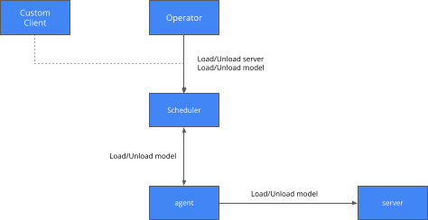

# Scheduler Service

 * Allow a model server to be added  with given replica endpoints
 * Allow a model server to be removed
 * Allow a model to be started on a server
 * Allow a model to be removed

