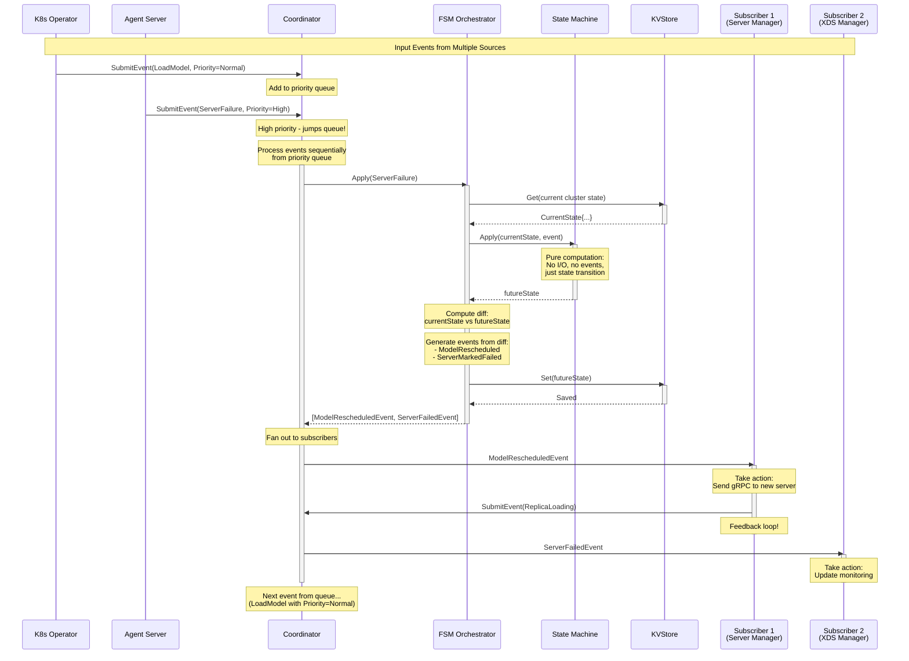

# Event-Driven Finite State Machine Architecture

## Overview
This architecture implements a clean three-layer separation: pure state computation, state diff observation with event generation, and event coordination.

## Architecture Layers

### 1. State Machine (Pure State Generator)
**Purpose**: Pure function that computes state transitions

**Characteristics**:
- **Pure function**: No side effects, no I/O, no event generation
- **Deterministic**: Same inputs always produce same outputs
- **Testable**: Easy to unit test since it's just computation
- **Immutable**: Takes current state, returns new state (no mutations)

**Responsibilities**:
- Receive current cluster state
- Receive an incoming event
- Apply business logic
- Return the new/future cluster state
- **Does NOT generate events** - only computes state

**Input**: `(CurrentState, Event) → FutureState`

**Benefits**:
- Easy to test (no mocks needed)
- Easy to reason about
- Can be extracted into a separate library
- Time-travel debugging possible

**Example**:
```go
currentState := ClusterState{
    Models: {"model-a": {Status: Pending}}
}
event := LoadModelEvent{ModelName: "model-a"}

futureState := stateMachine.Apply(currentState, event)
// Returns: ClusterState{
//     Models: {"model-a": {Status: Scheduled, Server: "server-1"}}
// }
```

### 2. FSM Orchestrator (Diff Observer & Event Generator)
**Purpose**: Observes state changes and generates events from diffs

**Responsibilities**:
1. Load current state from KVStore
2. Call state machine to compute future state
3. **Compute diff** between current state and future state
4. **Generate events based on what changed** in the diff
5. Save future state to KVStore (with optimistic locking)
6. Return generated events to coordinator

**Characteristics**:
- **Sequential processing**: Processes one event at a time
- **Stateless**: No internal state between calls
- **Observes changes**: Looks at before/after to determine events

**Diff-to-Event Examples**:
- Model status: `Pending → Scheduled` → Generate `ModelScheduledEvent`
- Model status: `Loading → Active` → Generate `ModelActiveEvent` + `XDSUpdateEvent`
- Pipeline status: `Pending → Active` → Generate `PipelineReadyEvent`
- Server capacity: `10 → 9` → Generate `ServerCapacityChangedEvent`

**Benefits**:
- State machine stays pure (no coupling to event types)
- Easy to add new event types without changing state logic
- Clear separation: state computation vs. change observation

**Example**:
```go
func (fsm *FSM) Apply(ctx, inputEvent) ([]OutputEvent, error) {
    // 1. Load current state
    currentState := fsm.store.Get(ctx)

    // 2. Compute future state (pure logic)
    futureState := fsm.stateMachine.Apply(currentState, inputEvent)

    // 3. Compute diff and generate events
    diff := computeDiff(currentState, futureState)
    outputEvents := generateEventsFromDiff(diff)

    // 4. Save future state
    fsm.store.Set(ctx, futureState)

    // 5. Return events for coordinator to fan out
    return outputEvents
}
```

### 3. Coordinator (Event Queue & Fan-out Manager)
**Purpose**: Manages event prioritization, queuing, and distribution to subscribers

**Responsibilities**:
1. Accept events from multiple sources (K8s operator, model servers, metrics)
2. Prioritize events by type (server updates > model loads > metrics)
3. Queue events in a priority queue
4. Process events **sequentially** through FSM orchestrator
5. Fan out output events to subscribers via channels
6. Enable feedback loops (subscribers can submit new events)

**Characteristics**:
- **Single-threaded**: One goroutine processes events sequentially
- **Priority-based**: Critical events (server failures) jump the queue
- **Pub/sub model**: Subscribers receive filtered event streams
- **Non-blocking submission**: Event submission never blocks callers

**Event Priorities**:
- **High (0)**: Server failures, critical system events
- **Normal (1)**: Model loads, pipeline updates, resource changes
- **Low (2)**: Metrics, status updates, housekeeping

**Benefits**:
- Simple concurrency model (no race conditions)
- Priority handling for critical events
- Flexible event routing via filters
- Easy to monitor (queue depth, throughput)

## Complete Event Flow



## Key Architectural Points

### State Machine is Pure
```go
// State machine signature - pure function
func (sm *StateMachine) Apply(current ClusterState, event Event) ClusterState {
    // Only state computation
    // No I/O, no event generation
    return newState
}
```

### FSM Orchestrator Generates Events from Diff
```go
// Orchestrator generates events by observing changes
func (fsm *FSM) Apply(ctx, event) ([]OutputEvent, error) {
    current := fsm.store.Get()
    future := fsm.stateMachine.Apply(current, event)

    // Diff and event generation
    events := []OutputEvent{}

    // Example: Model status changed?
    if current.Models["model-a"].Status != future.Models["model-a"].Status {
        events = append(events, &ModelStatusChangedEvent{
            Model: "model-a",
            OldStatus: current.Models["model-a"].Status,
            NewStatus: future.Models["model-a"].Status,
        })
    }

    // Example: Model became active? Trigger XDS update
    if future.Models["model-a"].Status == Active {
        events = append(events, &XDSUpdateEvent{...})
    }

    fsm.store.Set(future)
    return events, nil
}
```

### Coordinator Enables Feedback Loops
Subscribers can submit new events back to the coordinator, creating reactive workflows:

1. **LoadModel event** → State changes → **ModelScheduled event**
2. Subscriber receives **ModelScheduled** → Sends gRPC to server
3. Server responds → Subscriber submits **ReplicaLoading event**
4. **ReplicaLoading** → State changes → **ModelStatusChanged event**
5. Subscriber receives **ModelStatusChanged** → Updates XDS
6. Loop continues until model is fully active

## Design Benefits

### Testability
- **State Machine**: Pure functions, easy to unit test
- **Orchestrator**: Test diff generation logic independently
- **Coordinator**: Test event routing and prioritization

### Maintainability
- Each layer has single responsibility
- Easy to modify state logic without touching I/O
- Easy to add new event types without changing state machine

### Observability
- All state changes generate events
- Easy to add logging/metrics in coordinator
- Can replay events for debugging

### Flexibility
- Subscribers can be added/removed at runtime
- Event filters allow targeted subscriptions
- Priority system handles critical events first

## Implementation Notes

### Priority Guidelines
- **High (0)**: Server updates, critical resource events, manual overrides
- **Normal (1)**: Model/pipeline/experiment lifecycle events
- **Low (2)**: Metrics updates, status syncs, housekeeping

### Feedback Loop Safety
- Coordinator is single-threaded → no race conditions
- Priority ensures critical feedback (failures) is processed first
- Can add cycle detection if needed

### State Storage Considerations
- Use optimistic locking (version numbers) to detect conflicts
- Consider MVCC (etcd) for atomic state snapshots
- Entire cluster state snapshot may be more efficient than per-entity reads