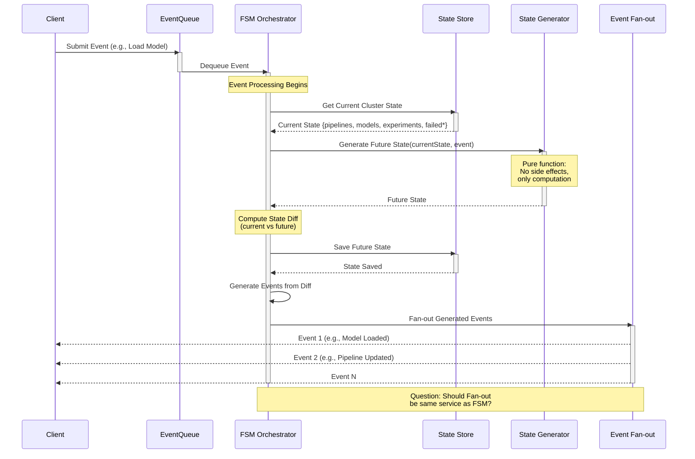

# Event-Driven Finite State Machine Architecture

## Overview
This architecture implements a clean separation between state computation and state management using an event-driven FSM pattern.

## Architecture Layers

### 1. State Generator (Core Logic Layer)
**Purpose**: Pure function that computes the next state

**Characteristics**:
- **Pure function**: No side effects, no I/O operations
- **Deterministic**: Same inputs always produce same outputs
- **Testable**: Easy to unit test since it's just computation
- **Immutable**: Takes current state, returns new state (no mutations)

**Responsibilities**:
- Receive current cluster state
- Receive an event
- Compute and return the future state
- Handle all business logic for state transitions

**Benefits**:
- Easy to test (no mocks needed)
- Easy to reason about
- Can be extracted into a separate library
- Time-travel debugging possible

### 2. FSM Orchestrator (Coordination Layer)
**Purpose**: Orchestrates the flow between components

**Responsibilities**:
1. Receive events from the event queue
2. Retrieve current state from the store
3. Call state generator to compute future state
4. Compute diff between current and future state
5. Persist the new state
6. Generate and fan out events for state changes

**Benefits**:
- Clear orchestration flow
- Single responsibility
- Easy to add middleware (logging, metrics, tracing)

## Event Flow

# Questions and things to handle
- Need to use the mvcc of etcd if we are getting all the states separately 
- retrieving an entire snapshot of the cluster might be more efficient and could make it easier to introduce optimistic locking
- certain events such as server updates need higher priority in terms of processing